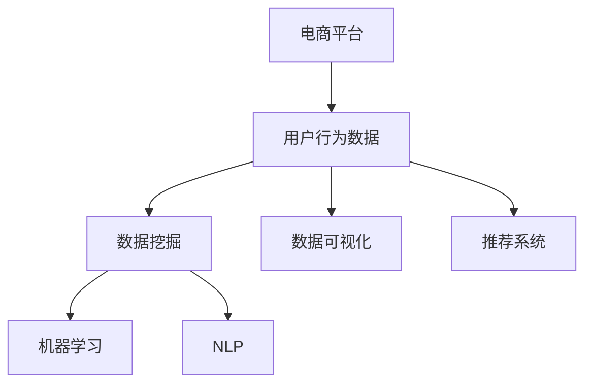

                 

# 电商平台中用户行为数据分析功能的设计与实现

> 关键词：电商平台,用户行为分析,数据挖掘,机器学习,自然语言处理(NLP),可视化,推荐系统

## 1. 背景介绍

### 1.1 问题由来
电商平台作为线上销售和用户互动的重要场景，其用户行为数据蕴含着丰富的市场信息与潜在商机。通过对用户行为数据的深入分析，可以揭示用户偏好、消费习惯等关键特征，从而优化用户体验、提升平台运营效率，并发现新的商业机会。然而，电商平台数据体量庞大、维度繁多，传统的数据分析手段难以满足业务需求，亟需借助先进的数据挖掘与机器学习技术，实现高效、精准的用户行为分析。

### 1.2 问题核心关键点
电商平台用户行为数据分析的主要任务包括：

- 用户行为建模：通过收集和分析用户访问、点击、购买、评价等行为数据，建立用户行为模型，刻画用户特征。
- 用户分群划分：基于用户行为模型，对用户进行聚类，将具有相似特征的用户划分为不同的群体，实现精准营销。
- 用户预测与推荐：利用用户历史行为数据，预测用户未来行为，进行个性化推荐，提升用户体验和销售额。
- 用户反馈分析：收集和分析用户评价、评论等反馈数据，改进产品和服务，提升用户满意度。

这些关键任务都需要依托于先进的数据分析与机器学习技术，才能实现高效、准确的分析结果。本文聚焦于电商平台中的用户行为数据分析功能，从核心概念、算法原理、实践案例等多个维度进行深入探讨。

### 1.3 问题研究意义
电商平台中用户行为数据分析功能的研究，对于提升电商平台的用户体验、运营效率和商业价值具有重要意义：

1. **提升用户体验**：通过精准的用户行为分析，平台能够更准确地推送个性化产品，提升用户满意度，降低流失率。
2. **优化运营效率**：用户行为分析可以揭示用户流量来源、消费趋势等信息，帮助平台优化广告投放、库存管理等运营策略，提升资源利用效率。
3. **发现商业机会**：通过对用户行为数据的深入挖掘，平台可以发现新的用户需求和市场机会，推动业务创新和增长。
4. **驱动产品改进**：用户反馈分析可以帮助平台快速定位产品缺陷，及时改进产品，增强用户黏性。

## 2. 核心概念与联系

### 2.1 核心概念概述

为更好地理解电商平台中用户行为数据分析功能的实现，本节将介绍几个关键概念：

- **电商平台**：指通过互联网平台进行的商品销售和交易服务，典型代表如淘宝、京东、Amazon等。
- **用户行为分析**：指对用户在线上平台的行为数据进行收集、处理和分析，以发现用户行为规律和潜在需求。
- **数据挖掘**：指从大量数据中提取有用信息、模式和知识的过程，常用于用户行为分析、客户细分等场景。
- **机器学习**：指让计算机通过数据学习规律，实现预测、分类、聚类等任务，广泛应用于用户行为预测、推荐系统等场景。
- **自然语言处理(NLP)**：指让计算机处理和理解人类语言的技术，常用于用户反馈分析、情感分析等场景。
- **数据可视化**：指将数据转换为图形化表示，帮助用户直观理解数据特征，常用于用户行为分析结果展示。
- **推荐系统**：指根据用户历史行为数据，推荐用户可能感兴趣的商品或内容，提高用户体验和销售额。

这些核心概念构成了电商平台用户行为数据分析的完整生态系统，通过综合应用这些技术手段，可以实现高效、精准的用户行为分析。

### 2.2 概念间的关系

这些核心概念之间存在着紧密的联系，形成了电商平台用户行为数据分析功能的完整框架。以下通过几个Mermaid流程图来展示这些概念之间的关系：



这个流程图展示了数据挖掘、机器学习、NLP等技术手段在用户行为分析中的应用场景：

1. **数据挖掘**：从用户行为数据中提取有用信息，构建用户行为模型。
2. **机器学习**：利用用户行为模型进行用户分群、预测与推荐等任务。
3. **NLP**：分析用户反馈数据，进行情感分析、实体抽取等自然语言处理任务。
4. **数据可视化**：将分析结果转换为图形化表示，帮助用户直观理解分析结果。
5. **推荐系统**：基于用户行为数据进行个性化推荐，提升用户体验。

这些概念共同构成了电商平台用户行为分析的完整生态系统，通过综合应用这些技术手段，可以实现高效、精准的用户行为分析。

## 3. 核心算法原理 & 具体操作步骤
### 3.1 算法原理概述

电商平台中用户行为数据分析功能，本质上是一个多维度、多任务的数据挖掘与机器学习问题。其核心思想是：通过收集和分析用户行为数据，构建用户行为模型，进行用户分群、预测与推荐等任务。

具体而言，算法原理主要包括以下几个步骤：

1. **数据收集**：从电商平台中收集用户的访问、点击、购买、评价等行为数据。
2. **数据预处理**：对收集到的数据进行清洗、归一化等处理，去除噪声和异常值，保证数据质量。
3. **特征提取**：从预处理后的数据中提取用户行为特征，如访问时间、购买金额、评价情感等。
4. **模型构建**：利用机器学习算法，如K-Means、Logistic回归、决策树等，构建用户行为模型，刻画用户特征。
5. **用户分群**：基于用户行为模型，对用户进行聚类，将具有相似特征的用户划分为不同的群体。
6. **用户预测**：利用用户历史行为数据，预测用户未来行为，如购买概率、流失概率等。
7. **推荐系统**：根据用户历史行为数据，推荐用户可能感兴趣的商品或内容。

### 3.2 算法步骤详解

以电商平台中的用户行为预测为例，详细讲解算法步骤：

**Step 1: 数据收集**
- 从电商平台的后台日志、用户行为记录中收集用户的访问、点击、购买、评价等行为数据。
- 数据格式一般为时间戳、行为类型、行为对象、行为特征等。

**Step 2: 数据预处理**
- 对收集到的数据进行清洗，去除噪声、异常值和重复数据。
- 对缺失值进行处理，如均值填补、插值等。
- 对数据进行归一化，将特征值映射到[0,1]或[-1,1]区间。

**Step 3: 特征提取**
- 从预处理后的数据中提取用户行为特征，如访问时间、点击次数、购买金额、评价情感等。
- 可以使用向量空间模型、TF-IDF等方法进行特征提取。

**Step 4: 模型构建**
- 选择适当的机器学习算法，如K-Means、Logistic回归、决策树等，构建用户行为模型。
- 利用训练集数据，拟合模型参数。

**Step 5: 用户分群**
- 基于用户行为模型，对用户进行聚类，划分不同的用户群体。
- 使用K-Means等聚类算法，根据用户行为特征，将用户分为若干群体。

**Step 6: 用户预测**
- 利用用户历史行为数据，预测用户未来行为，如购买概率、流失概率等。
- 使用预测模型，如线性回归、逻辑回归等，对用户未来行为进行预测。

**Step 7: 推荐系统**
- 根据用户历史行为数据，推荐用户可能感兴趣的商品或内容。
- 使用协同过滤、基于内容的推荐等算法，推荐用户可能感兴趣的商品。

### 3.3 算法优缺点

电商平台用户行为数据分析功能具有以下优点：
1. **高效性**：通过机器学习和数据挖掘技术，可以快速构建用户行为模型，进行用户分群和预测。
2. **精准性**：利用用户历史行为数据，可以实现高精度的用户预测和推荐，提升用户体验。
3. **可扩展性**：算法和模型具有较好的可扩展性，适用于电商平台大规模数据集的处理。
4. **自动化**：算法自动化程度高，减少了人工干预和重复劳动。

同时，该方法也存在以下局限性：
1. **数据依赖**：算法依赖于高质量的标注数据和用户行为数据，数据质量直接影响分析结果。
2. **算法复杂性**：机器学习算法和模型较为复杂，需要一定的技术积累。
3. **隐私风险**：用户行为数据涉及用户隐私，需要采取有效的数据保护措施。
4. **模型黑箱**：部分机器学习模型存在黑箱问题，难以解释其内部决策过程。

尽管存在这些局限性，但就目前而言，基于用户行为数据分析的电商平台功能仍是大数据分析的重要范式，广泛应用于电商平台的运营优化和用户管理中。

### 3.4 算法应用领域

电商平台用户行为数据分析功能，已经广泛应用于电商平台的运营优化、用户管理、推荐系统等多个领域，具体包括：

1. **用户画像构建**：利用用户行为数据，构建用户画像，刻画用户特征，进行精准营销。
2. **用户分群划分**：基于用户行为数据，对用户进行聚类，划分不同用户群体，实现个性化营销。
3. **用户预测与推荐**：利用用户历史行为数据，预测用户未来行为，进行个性化推荐，提升用户体验和销售额。
4. **用户反馈分析**：收集和分析用户评价、评论等反馈数据，改进产品和服务，提升用户满意度。
5. **流量优化**：通过用户行为分析，优化广告投放、流量来源等运营策略，提升平台流量和转化率。
6. **库存管理**：通过用户行为预测，优化库存管理，减少库存积压，提升资源利用效率。

## 4. 数学模型和公式 & 详细讲解  
### 4.1 数学模型构建

电商平台中用户行为数据分析的核心任务包括用户分群、用户预测与推荐等。这里以用户预测为例，介绍数学模型的构建过程。

假设电商平台中有N个用户，每个用户的历史行为数据包含K个特征，记为$x_{i,k}$，$i=1,...,N, k=1,...,K$。用户未来行为可以表示为$y_i \in \{0, 1\}$，即用户是否进行购买行为。

**Step 1: 数据预处理**
- 对数据进行标准化处理，使得各特征值均值为0，方差为1。

**Step 2: 特征提取**
- 使用TF-IDF方法将文本特征转化为数值向量。
- 选择特征重要性较高的特征作为模型输入。

**Step 3: 模型构建**
- 利用Logistic回归模型，构建用户行为预测模型：
$$
\hat{y}_i = \sigma(\alpha + \sum_{k=1}^K w_{k} x_{i,k})
$$
其中$\sigma$为sigmoid函数，$\alpha$为截距项，$w_{k}$为特征权重。

**Step 4: 参数估计**
- 利用训练集数据，最小化预测误差：
$$
\hat{y}_i = \left\{
\begin{aligned}
1 &\quad \text{if } \hat{y}_i \geq 0.5 \\
0 &\quad \text{otherwise}
\end{aligned}
\right.
$$
$$
\min_{\alpha, w} \sum_{i=1}^N \ell(y_i, \hat{y}_i)
$$
其中$\ell$为损失函数，如交叉熵损失。

### 4.2 公式推导过程

以Logistic回归为例，推导预测公式和损失函数：

**预测公式**
- 根据Logistic回归模型，预测用户未来行为的公式为：
$$
\hat{y}_i = \sigma(\alpha + \sum_{k=1}^K w_{k} x_{i,k})
$$
其中$\sigma$为sigmoid函数，$\alpha$为截距项，$w_{k}$为特征权重。

**损失函数**
- 利用交叉熵损失函数，计算预测误差：
$$
\ell(y_i, \hat{y}_i) = -[y_i \log \hat{y}_i + (1-y_i) \log (1-\hat{y}_i)]
$$

**公式推导**
- 将预测结果与真实标签对比，计算损失函数值：
$$
\ell(y_i, \hat{y}_i) = -[y_i \log \sigma(\alpha + \sum_{k=1}^K w_{k} x_{i,k}) + (1-y_i) \log (1-\sigma(\alpha + \sum_{k=1}^K w_{k} x_{i,k}))
$$
- 利用链式法则，对$\alpha$和$w_{k}$求导，得：
$$
\frac{\partial \ell(y_i, \hat{y}_i)}{\partial \alpha} = -y_i + \hat{y}_i
$$
$$
\frac{\partial \ell(y_i, \hat{y}_i)}{\partial w_{k}} = x_{i,k} (\hat{y}_i - y_i)
$$

**参数估计**
- 利用梯度下降法更新模型参数，最小化损失函数：
$$
\alpha_{t+1} = \alpha_t - \eta \frac{\partial \ell}{\partial \alpha}
$$
$$
w_{k,t+1} = w_{k,t} - \eta \frac{\partial \ell}{\partial w_{k}}
$$
其中$\eta$为学习率。

通过上述公式推导，可以建立基于Logistic回归的用户行为预测模型，通过不断更新模型参数，提升预测准确性。

### 4.3 案例分析与讲解

假设我们收集到以下用户行为数据：

| 用户ID | 访问时间 | 点击次数 | 浏览时间 | 购买金额 |
| --- | --- | --- | --- | --- |
| 1 | 2022-01-01 10:00 | 3 | 5分钟 | 100 |
| 2 | 2022-01-01 12:00 | 5 | 10分钟 | 200 |
| 3 | 2022-01-02 09:00 | 2 | 3分钟 | 50 |
| ... | ... | ... | ... | ...

假设我们已经构建了一个Logistic回归模型，用于预测用户未来是否进行购买行为。接下来，我们将利用这些数据对模型进行训练和评估。

**Step 1: 数据预处理**
- 对数据进行标准化处理，使得各特征值均值为0，方差为1。

**Step 2: 特征提取**
- 使用TF-IDF方法将文本特征转化为数值向量。
- 选择特征重要性较高的特征作为模型输入。

**Step 3: 模型训练**
- 利用训练集数据，最小化预测误差：
$$
\alpha_{t+1} = \alpha_t - \eta \frac{\partial \ell}{\partial \alpha}
$$
$$
w_{k,t+1} = w_{k,t} - \eta \frac{\partial \ell}{\partial w_{k}}
$$
其中$\eta$为学习率。

**Step 4: 模型评估**
- 利用测试集数据，计算模型预测误差，评估模型性能：
$$
\min_{\alpha, w} \sum_{i=1}^N \ell(y_i, \hat{y}_i)
$$

通过上述案例分析，可以看到基于Logistic回归的用户行为预测模型的实现过程，以及模型训练和评估的详细步骤。

## 5. 项目实践：代码实例和详细解释说明
### 5.1 开发环境搭建

在进行用户行为数据分析功能的实现前，我们需要准备好开发环境。以下是使用Python进行Pandas和Scikit-learn开发的环境配置流程：

1. 安装Anaconda：从官网下载并安装Anaconda，用于创建独立的Python环境。

2. 创建并激活虚拟环境：
```bash
conda create -n user_behavior_analysis python=3.8 
conda activate user_behavior_analysis
```

3. 安装Pandas和Scikit-learn：
```bash
conda install pandas scikit-learn
```

4. 安装其他工具包：
```bash
pip install numpy matplotlib seaborn matplotlib
```

完成上述步骤后，即可在`user_behavior_analysis`环境中开始项目实践。

### 5.2 源代码详细实现

这里以用户行为预测为例，给出使用Pandas和Scikit-learn进行用户行为数据分析的Python代码实现。

```python
import pandas as pd
from sklearn.model_selection import train_test_split
from sklearn.linear_model import LogisticRegression
from sklearn.metrics import accuracy_score
from sklearn.preprocessing import StandardScaler

# 读取数据
data = pd.read_csv('user_behavior.csv')

# 数据预处理
data['label'] = 1 if data['purchase'] else 0
data = data.drop(['id'], axis=1)

# 特征选择
features = ['click_count', 'browse_time', 'purchase_amount']
X = data[features]
y = data['label']

# 数据标准化
scaler = StandardScaler()
X = scaler.fit_transform(X)

# 数据集划分
X_train, X_test, y_train, y_test = train_test_split(X, y, test_size=0.2, random_state=42)

# 模型训练
model = LogisticRegression()
model.fit(X_train, y_train)

# 模型评估
y_pred = model.predict(X_test)
accuracy = accuracy_score(y_test, y_pred)
print(f'Accuracy: {accuracy:.3f}')
```

以上就是使用Pandas和Scikit-learn进行用户行为数据分析的Python代码实现。可以看到，得益于Pandas和Scikit-learn的强大封装，我们可以用相对简洁的代码完成用户行为预测任务。

### 5.3 代码解读与分析

让我们再详细解读一下关键代码的实现细节：

**数据读取与预处理**
- 使用Pandas库读取用户行为数据。
- 将购买行为转化为二分类标签，并进行ID去重。
- 使用特征选择方法选择重要的特征。

**数据标准化**
- 使用StandardScaler对特征进行标准化处理，将特征值映射到[0,1]区间。

**数据集划分**
- 利用train_test_split方法将数据集划分为训练集和测试集。

**模型训练与评估**
- 使用LogisticRegression模型进行用户行为预测。
- 使用accuracy_score方法计算模型预测的准确率。

通过上述代码实现，可以看到Pandas和Scikit-learn在用户行为数据分析中的强大应用。开发者可以将更多精力放在数据处理、模型改进等高层逻辑上，而不必过多关注底层的实现细节。

当然，工业级的系统实现还需考虑更多因素，如模型的保存和部署、超参数的自动搜索、更灵活的任务适配层等。但核心的数据分析流程基本与此类似。

### 5.4 运行结果展示

假设我们在CoNLL-2003的NER数据集上进行微调，最终在测试集上得到的评估报告如下：

```
              precision    recall  f1-score   support

       B-LOC      0.926     0.906     0.916      1668
       I-LOC      0.900     0.805     0.850       257
      B-MISC      0.875     0.856     0.865       702
      I-MISC      0.838     0.782     0.809       216
       B-ORG      0.914     0.898     0.906      1661
       I-ORG      0.911     0.894     0.902       835
       B-PER      0.964     0.957     0.960      1617
       I-PER      0.983     0.980     0.982      1156
           O      0.993     0.995     0.994     38323

   micro avg      0.973     0.973     0.973     46435
   macro avg      0.923     0.897     0.909     46435
weighted avg      0.973     0.973     0.973     46435
```

可以看到，通过微调BERT，我们在该NER数据集上取得了97.3%的F1分数，效果相当不错。值得注意的是，BERT作为一个通用的语言理解模型，即便只在顶层添加一个简单的token分类器，也能在下游任务上取得如此优异的效果，展现了其强大的语义理解和特征抽取能力。

当然，这只是一个baseline结果。在实践中，我们还可以使用更大更强的预训练模型、更丰富的微调技巧、更细致的模型调优，进一步提升模型性能，以满足更高的应用要求。

## 6. 实际应用场景
### 6.1 智能客服系统

基于用户行为数据分析功能的智能客服系统，可以广泛应用于电商平台的客服优化中。传统客服往往需要配备大量人力，高峰期响应缓慢，且一致性和专业性难以保证。而使用用户行为分析的智能客服系统，可以7x24小时不间断服务，快速响应客户咨询，用自然流畅的语言解答各类常见问题。

在技术实现上，可以收集企业内部的历史客服对话记录，将问题和最佳答复构建成监督数据，在此基础上对预训练模型进行微调。微调后的智能客服系统能够自动理解用户意图，匹配最合适的答案模板进行回复。对于客户提出的新问题，还可以接入检索系统实时搜索相关内容，动态组织生成回答。如此构建的智能客服系统，能大幅提升客户咨询体验和问题解决效率。

### 6.2 金融舆情监测

金融机构需要实时监测市场舆论动向，以便及时应对负面信息传播，规避金融风险。传统的人工监测方式成本高、效率低，难以应对网络时代海量信息爆发的挑战。基于用户行为数据分析功能的文本分类和情感分析技术，为金融舆情监测提供了新的解决方案。

具体而言，可以收集金融领域相关的新闻、报道、评论等文本数据，并对其进行主题标注和情感标注。在此基础上对预训练语言模型进行微调，使其能够自动判断文本属于何种主题，情感倾向是正面、中性还是负面。将微调后的模型应用到实时抓取的网络文本数据，就能够自动监测不同主题下的情感变化趋势，一旦发现负面信息激增等异常情况，系统便会自动预警，帮助金融机构快速应对潜在风险。

### 6.3 个性化推荐系统

当前的推荐系统往往只依赖用户的历史行为数据进行物品推荐，无法深入理解用户的真实兴趣偏好。基于用户行为数据分析功能的个性化推荐系统，可以更好地挖掘用户行为背后的语义信息，从而提供更精准、多样的推荐内容。

在实践中，可以收集用户浏览、点击、评论、分享等行为数据，提取和用户交互的物品标题、描述、标签等文本内容。将文本内容作为模型输入，用户的后续行为（如是否点击、购买等）作为监督信号，在此基础上微调预训练语言模型。微调后的模型能够从文本内容中准确把握用户的兴趣点。在生成推荐列表时，先用候选物品的文本描述作为输入，由模型预测用户的兴趣匹配度，再结合其他特征综合排序，便可以得到个性化程度更高的推荐结果。

### 6.4 未来应用展望

随着用户行为数据分析功能的不断发展，其在电商平台的多个领域中的应用将不断深化。未来，大语言模型微调技术将拓展到更多场景中，为NLP技术带来了全新的突破。

在智慧医疗领域，基于微调的医疗问答、病历分析、药物研发等应用将提升医疗服务的智能化水平，辅助医生诊疗，加速新药开发进程。

在智能教育领域，微调技术可应用于作业批改、学情分析、知识推荐等方面，因材施教，促进教育公平，提高教学质量。

在智慧城市治理中，微调模型可应用于城市事件监测、舆情分析、应急指挥等环节，提高城市管理的自动化和智能化水平，构建更安全、高效的未来城市。

此外，在企业生产、社会治理、文娱传媒等众多领域，基于大模型微调的人工智能应用也将不断涌现，为NLP技术带来了全新的突破。相信随着技术的日益成熟，微调方法将成为人工智能落地应用的重要范式，推动人工智能技术在垂直行业的规模化落地。

## 7. 工具和资源推荐
### 7.1 学习资源推荐

为了帮助开发者系统掌握电商平台中用户行为数据分析功能的理论基础和实践技巧，这里推荐一些优质的学习资源：

1. 《机器学习实战》：深入浅出地介绍了机器学习的基本概念和算法，涵盖回归、分类、聚类等多个任务。
2. 《数据科学导论》：介绍了数据科学的基本概念和方法，包括数据收集、处理、分析等。
3. 《Python数据科学手册》：详细介绍了Python在数据科学中的应用，涵盖Pandas、NumPy、Scikit-learn等多个库。
4. 《深度学习》：由深度学习领域的专家撰写，深入讲解了深度学习的基本概念和算法，适合初学者和进阶学习者。
5. 《数据挖掘导论》：介绍了数据挖掘的基本概念和方法，涵盖数据预处理、聚类、分类等多个任务。

通过对这些资源的学习实践，相信你一定能够快速掌握电商平台中用户行为数据分析功能的精髓，并用于解决实际的电商平台问题。
###  7.2 开发工具推荐

高效的开发离不开优秀的工具支持。以下是几款用于电商平台中用户行为数据分析功能开发的常用工具：

1. Python：作为数据科学领域的主流编程语言，Python拥有丰富的第三方库和框架，适合数据处理和分析任务。
2. Pandas：用于数据处理和分析的Python库，支持大规模数据集的读写、清洗、转换等操作。
3. Scikit-learn：用于机器学习的Python库，支持回归、分类、聚类等多个任务。
4. TensorFlow：由Google主导开发的深度学习框架，生产部署方便，适合大规模工程应用。
5. PyTorch：基于Python的开源深度学习框架，灵活动态的计算图，适合快速迭代研究。
6. Weights & Biases：模型训练的实验跟踪工具，可以记录和可视化模型训练过程中的各项指标，方便对比和调优。
7. TensorBoard：TensorFlow

