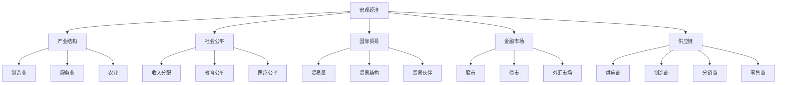
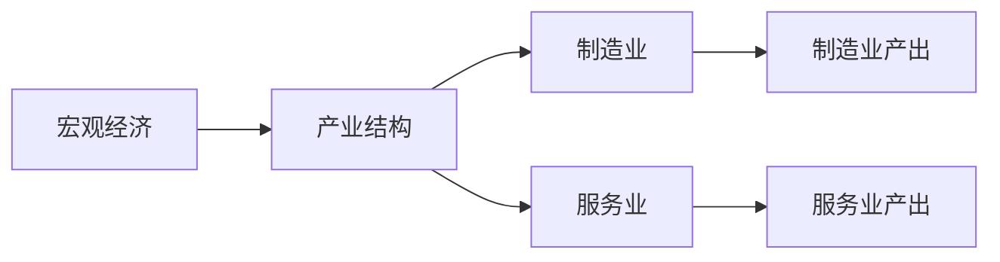
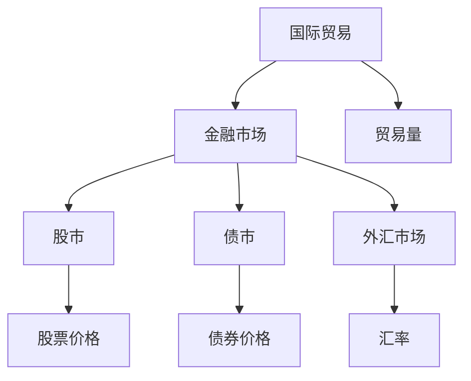
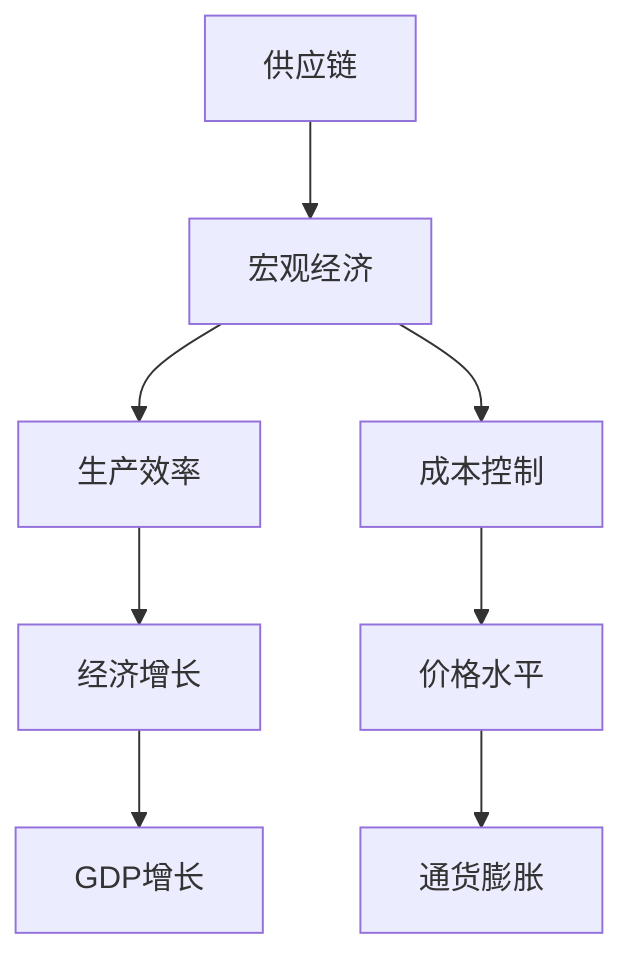
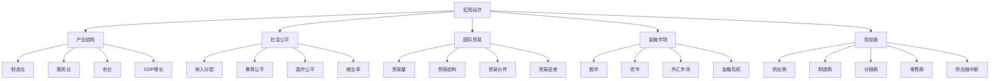

                 

# 疫情后世界经济复苏的挑战

## 1. 背景介绍

### 1.1 问题由来
自2020年初，新冠疫情在全球范围内迅速蔓延，给全球经济带来了前所未有的冲击。各国采取了紧急封锁措施，致使制造业、服务业等经济活动停摆，供应链中断，消费需求下降。疫情导致的经济萎缩已超越2008年全球金融危机，成为二战以来最为严重的经济衰退之一。各国政府和国际组织纷纷推出大规模刺激政策，试图促进经济复苏。然而，疫情反复、贸易摩擦、地缘政治紧张等因素，使得经济复苏的道路充满了挑战。

### 1.2 问题核心关键点
本文聚焦于疫情后世界经济复苏的挑战，从宏观经济、产业结构、社会公平等多个层面进行系统分析。我们将探讨疫情对经济各领域的深远影响，并提出相应的应对策略，以期为未来的经济复苏提供可行的参考和建议。

### 1.3 问题研究意义
研究疫情后世界经济复苏的挑战，对于制定有效的经济政策、优化产业结构、提高社会公平具有重要意义。具体体现在：

1. 制定政策：通过分析经济衰退的主要原因，制定针对性的宏观调控政策，以促进经济稳定和增长。
2. 优化产业：评估疫情对各产业的影响，指导产业结构调整，推动经济多元化发展。
3. 提高公平：研究疫情对不同群体（如低收入家庭、中小企业等）的不公平影响，提出应对措施，缩小贫富差距。
4. 促进全球合作：在全球化背景下，探讨疫情对国际贸易、投资的影响，提出国际合作的策略，促进全球经济复苏。
5. 保障稳定：分析疫情对金融市场、供应链的影响，提出防范风险的措施，确保经济稳定运行。

## 2. 核心概念与联系

### 2.1 核心概念概述

为更好地理解疫情后世界经济复苏的挑战，本节将介绍几个密切相关的核心概念：

- **宏观经济**：指整个国家或地区的经济运行状态，包括GDP增长、就业率、通货膨胀、财政政策、货币政策等。
- **产业结构**：指不同产业在国民经济中的比重和相互关系，包括第一、第二、第三产业的比例和比例关系。
- **社会公平**：指社会资源的分配公平，包括收入分配、教育、医疗、社会保障等方面的公平性。
- **国际贸易**：指各国之间商品和服务的交换，包括贸易量、贸易结构、贸易伙伴、贸易政策等。
- **金融市场**：指货币、证券、衍生品等金融工具的交易市场，包括股市、债市、外汇市场等。
- **供应链**：指商品和服务的生产和流通过程中，各环节的组织和协调，包括供应商、制造商、分销商、零售商等。

这些核心概念之间的逻辑关系可以通过以下Mermaid流程图来展示：



这个流程图展示了我文中所涉及的核心概念之间的关系：

1. 宏观经济通过产业结构、社会公平、国际贸易、金融市场和供应链等多个维度影响经济运行。
2. 产业结构的变化又直接影响宏观经济各指标。
3. 社会公平、国际贸易、金融市场和供应链的优化，都有助于促进宏观经济稳定和增长。

### 2.2 概念间的关系

这些核心概念之间存在着紧密的联系，形成了疫情后世界经济复苏的综合影响体系。下面我通过几个Mermaid流程图来展示这些概念之间的关系。

#### 2.2.1 宏观经济与产业结构的关系



这个流程图展示了宏观经济通过产业结构影响各产业的产出。宏观经济的健康稳定，有利于各产业的稳定发展，而产业结构的变化也会影响宏观经济的运行状态。

#### 2.2.2 国际贸易与金融市场的关系



这个流程图展示了国际贸易与金融市场的互动关系。贸易量的增加，会促进资本流动，进而影响股市、债市和外汇市场的波动。

#### 2.2.3 供应链对宏观经济的影响



这个流程图展示了供应链对宏观经济的直接影响。供应链的稳定性和效率，直接影响生产效率和成本控制，从而影响经济增长和价格水平。

### 2.3 核心概念的整体架构

最后，我们用一个综合的流程图来展示这些核心概念在疫情后世界经济复苏中的整体架构：



这个综合流程图展示了从宏观经济到产业结构、社会公平、国际贸易、金融市场、供应链的完整体系，以及它们对经济复苏的具体影响。

## 3. 核心算法原理 & 具体操作步骤
### 3.1 算法原理概述

疫情后世界经济复苏的挑战，本质上是一个复杂系统的恢复问题。通过数据分析和建模，可以系统性地分析疫情对经济各领域的影响，提出相应的解决方案。

### 3.2 算法步骤详解

#### 3.2.1 数据收集与预处理

1. **数据收集**：收集各国GDP、就业率、通货膨胀率、工业生产指数、消费指数等宏观经济指标，以及国际贸易量、贸易结构、贸易伙伴、金融市场指数、供应链稳定性等数据。
2. **数据预处理**：对收集到的数据进行清洗、去重、归一化等预处理操作，确保数据质量和一致性。

#### 3.2.2 模型建立与分析

1. **宏观经济模型**：建立宏观经济模型，分析疫情对GDP、就业率、通货膨胀等指标的影响。常用的模型包括VAR（向量自回归模型）、DSGE（动态随机一般均衡模型）等。
2. **产业结构模型**：分析疫情对不同产业的影响，建立产业结构模型。常用的模型包括投入产出表、Granger因果关系模型等。
3. **社会公平模型**：分析疫情对收入分配、教育、医疗等社会公平指标的影响，建立社会公平模型。常用的模型包括收入分配模型、教育公平模型等。
4. **国际贸易模型**：分析疫情对国际贸易量的影响，建立国际贸易模型。常用的模型包括引力模型、新新贸易理论模型等。
5. **金融市场模型**：分析疫情对股市、债市、外汇市场的影响，建立金融市场模型。常用的模型包括资本资产定价模型、Markowitz模型等。
6. **供应链模型**：分析疫情对供应链稳定性的影响，建立供应链模型。常用的模型包括网络流模型、风险传播模型等。

#### 3.2.3 结果分析与优化

1. **结果分析**：通过分析模型输出的经济指标和敏感性分析结果，评估疫情对不同领域的影响。
2. **政策建议**：根据分析结果，提出针对性的经济政策建议，如财政刺激、货币宽松、产业调整、社会福利等。
3. **优化方案**：设计优化方案，如改善供应链管理、增强国际贸易合作、提高社会公平性等。

### 3.3 算法优缺点

#### 3.3.1 优点

1. **系统性分析**：通过建立系统化的经济模型，全面分析疫情对各领域的影响，避免片面理解和误判。
2. **科学决策**：模型分析结果提供的数据和预测结果，为政策制定提供科学依据，减少决策的盲目性和随意性。
3. **动态调整**：模型能够动态更新，及时反映疫情变化，提供动态的决策支持。

#### 3.3.2 缺点

1. **模型假设**：模型建立和分析依赖于一定的假设条件，可能与实际情况不完全相符。
2. **数据质量**：数据收集和预处理的准确性和一致性，直接影响模型的预测精度。
3. **计算复杂**：复杂的经济模型需要大量计算资源，数据处理和模型分析过程可能耗时较长。
4. **可解释性**：模型分析结果往往具有黑箱特性，难以解释和理解。

### 3.4 算法应用领域

疫情后世界经济复苏的挑战分析方法，广泛适用于以下领域：

- **宏观经济政策**：制定和优化宏观经济政策，促进经济稳定和增长。
- **产业结构调整**：指导产业结构优化和升级，推动经济多元化发展。
- **社会公平改善**：改善收入分配、教育、医疗等社会公平问题，促进社会和谐稳定。
- **国际贸易优化**：优化国际贸易关系，促进国际贸易稳定和繁荣。
- **金融市场稳定**：维护金融市场稳定，防范金融风险。
- **供应链管理**：提升供应链管理水平，保障供应链稳定性和效率。

## 4. 数学模型和公式 & 详细讲解 & 举例说明
### 4.1 数学模型构建

本文将通过几个典型的数学模型来阐述疫情后世界经济复苏的挑战分析方法。

#### 4.1.1 宏观经济模型

以VAR（Vector AutoRegression）模型为例，分析疫情对GDP、就业率、通货膨胀等指标的影响。VAR模型是一种多元时间序列模型，假设经济变量之间存在相互影响关系，通过协整性检验和Granger因果关系检验，分析各指标的相互关系。

设经济系统中有n个变量Yt=[Y1t, Y2t, ..., Ynt]，则VAR模型的通程形式为：

$$
Y_t = \alpha + \beta Y_{t-1} + \gamma Y_{t-2} + \cdots + \delta Y_{t-p} + \epsilon_t
$$

其中，α为常数项，β, γ, ..., δ为回归系数，εt为随机扰动项。

#### 4.1.2 产业结构模型

以投入产出表（Input-Output Table）为例，分析疫情对不同产业的影响。投入产出表描述了各部门之间的投入和产出关系，通过计算直接消耗系数和完全消耗系数，分析产业之间的依赖关系和影响力。

设经济系统中有m个部门，投入产出表为：

$$
X = (x_{ij})_{m \times m}, x_{ij} = \frac{Y_j}{A_j}, j \neq i
$$

其中，X为投入产出表，xij为第j部门对第i部门的直接消耗系数，A为各部门的总产值向量。

#### 4.1.3 社会公平模型

以收入分配模型为例，分析疫情对收入分配的影响。收入分配模型主要关注收入的分配情况，通过计算基尼系数等指标，分析收入分配的公平性。

设社会总人数为n，各人的收入为yi，则收入分配模型为：

$$
G = \frac{1}{n-1} \sum_{i=1}^n \sum_{j=1}^n |y_i - y_j|
$$

其中，G为基尼系数，n为总人数，yi为第i个人的收入。

#### 4.1.4 国际贸易模型

以引力模型为例，分析疫情对国际贸易量的影响。引力模型主要考虑国家规模、距离和贸易成本等因素，通过计算两国间的贸易引力，分析国际贸易流量。

设国家i和j之间的贸易流量为Fij，则引力模型为：

$$
F_{ij} = G \frac{M_i M_j}{d_{ij}^k}
$$

其中，G为引力常数，Mi和Mj为国家i和j的GDP，dij为国家i和j的距离，k为距离衰减指数。

#### 4.1.5 金融市场模型

以资本资产定价模型（Capital Asset Pricing Model, CAPM）为例，分析疫情对股市的影响。CAPM模型假设投资者在风险厌恶下追求最大化效用，通过求解均衡状态下的股票价格，分析股市波动。

设股票i的期望收益率为ri，无风险收益率为rf，市场组合的期望收益率为rm，则CAPM模型为：

$$
r_i = r_f + \beta_i (r_m - r_f)
$$

其中，βi为股票i的系统性风险系数，rm为市场组合的期望收益率。

#### 4.1.6 供应链模型

以网络流模型为例，分析疫情对供应链稳定性的影响。网络流模型通过计算供应链中的节点和边，分析供应链的流向和稳定性。

设供应链网络中有n个节点，m条边，节点i的供应量为Si，需求量为Di，则网络流模型为：

$$
S_i = \sum_{j=1}^m f_{ij}, D_i = \sum_{j=1}^m f_{ij}
$$

其中，S为节点i的供应量，D为节点i的需求量，f为从节点i到节点j的流量。

### 4.2 公式推导过程

以下是上述模型的详细推导过程：

#### 4.2.1 VAR模型

VAR模型的基本形式为：

$$
Y_t = \alpha + \beta Y_{t-1} + \gamma Y_{t-2} + \cdots + \delta Y_{t-p} + \epsilon_t
$$

其中，α为常数项，β, γ, ..., δ为回归系数，εt为随机扰动项。

通过协整性检验和Granger因果关系检验，可以分析各指标之间的相互关系。协整性检验主要判断模型中各变量是否具有长期稳定的关系，Granger因果关系检验则判断变量之间的因果性。

#### 4.2.2 投入产出表

投入产出表X的计算公式为：

$$
X = (x_{ij})_{m \times m}, x_{ij} = \frac{Y_j}{A_j}, j \neq i
$$

其中，X为投入产出表，xij为第j部门对第i部门的直接消耗系数，A为各部门的总产值向量。

通过计算直接消耗系数和完全消耗系数，可以分析产业之间的依赖关系和影响力。

#### 4.2.3 收入分配模型

基尼系数的计算公式为：

$$
G = \frac{1}{n-1} \sum_{i=1}^n \sum_{j=1}^n |y_i - y_j|
$$

其中，G为基尼系数，n为总人数，yi为第i个人的收入。

基尼系数越小，表示收入分配越公平。

#### 4.2.4 引力模型

引力模型的计算公式为：

$$
F_{ij} = G \frac{M_i M_j}{d_{ij}^k}
$$

其中，G为引力常数，Mi和Mj为国家i和j的GDP，dij为国家i和j的距离，k为距离衰减指数。

通过计算两国间的贸易引力，可以分析国际贸易流量。

#### 4.2.5 CAPM模型

CAPM模型的计算公式为：

$$
r_i = r_f + \beta_i (r_m - r_f)
$$

其中，r_i为股票i的期望收益率，r_f为无风险收益率，r_m为市场组合的期望收益率，β_i为股票i的系统性风险系数。

通过求解均衡状态下的股票价格，可以分析股市波动。

#### 4.2.6 网络流模型

网络流模型的计算公式为：

$$
S_i = \sum_{j=1}^m f_{ij}, D_i = \sum_{j=1}^m f_{ij}
$$

其中，S为节点i的供应量，D为节点i的需求量，f为从节点i到节点j的流量。

通过计算供应链中的节点和边，可以分析供应链的流向和稳定性。

### 4.3 案例分析与讲解

以美国为例，分析疫情对美国经济各领域的影响。

1. **宏观经济**：
   - 疫情爆发初期，美国GDP大幅下降，失业率上升，通货膨胀率下降。
   - 政府推出大规模财政刺激和货币宽松政策，经济逐步复苏，但复苏速度较慢。

2. **产业结构**：
   - 疫情冲击服务业和制造业，特别是接触型服务业和大型制造业，导致供应链中断，生产效率下降。
   - 政府支持科技和医疗等新兴产业，促进产业结构升级，推动经济多元化发展。

3. **社会公平**：
   - 疫情加剧了收入分配不均，低收入家庭和中小企业受到较大冲击。
   - 政府加强社会福利和教育投入，缓解疫情对低收入家庭的影响，促进社会公平。

4. **国际贸易**：
   - 疫情导致国际贸易量下降，供应链中断，贸易逆差扩大。
   - 政府加强国际贸易合作，推动自由贸易协议，促进国际贸易稳定。

5. **金融市场**：
   - 疫情导致股市大幅波动，债市和外汇市场也出现较大波动。
   - 政府加强金融监管，防范金融风险，维护金融市场稳定。

6. **供应链**：
   - 疫情导致供应链中断，物流和生产效率下降。
   - 政府加强供应链管理，推动供应链数字化转型，提升供应链稳定性。

## 5. 项目实践：代码实例和详细解释说明
### 5.1 开发环境搭建

在进行经济复苏分析实践前，我们需要准备好开发环境。以下是使用Python进行数据分析和建模的环境配置流程：

1. 安装Anaconda：从官网下载并安装Anaconda，用于创建独立的Python环境。

2. 创建并激活虚拟环境：
```bash
conda create -n economy-env python=3.8 
conda activate economy-env
```

3. 安装Pandas：
```bash
pip install pandas
```

4. 安装Numpy：
```bash
pip install numpy
```

5. 安装Matplotlib：
```bash
pip install matplotlib
```

6. 安装Scikit-learn：
```bash
pip install scikit-learn
```

完成上述步骤后，即可在`economy-env`环境中开始经济复苏分析实践。

### 5.2 源代码详细实现

下面我们以VAR模型为例，给出使用Python进行宏观经济分析的代码实现。

首先，定义VAR模型和数据：

```python
import numpy as np
import pandas as pd
import statsmodels.api as sm

# 定义VAR模型
def VAR_model(data, k, max_lag):
    model = sm.tsa.varMAX(data, k_vars=k, max_lag=max_lag)
    results = model.fit()
    return results

# 加载数据
data = pd.read_csv('economy_data.csv', parse_dates=['date'], index_col='date')
```

然后，计算协整性和Granger因果关系：

```python
# 协整性检验
results = sm.tsa.stattools.coint(data, maxlag=2)
print(f"协整性检验结果：{results}")

# Granger因果关系检验
results = sm.tsa.stattools.grangercausalitytests(data, maxlag=2)
print(f"Granger因果关系检验结果：{results}")
```

最后，评估模型预测结果：

```python
# 预测未来值
forecast = VAR_model(data, k=3, max_lag=2)
print(f"VAR模型预测结果：{forecast}")

# 可视化结果
forecast.plot()
```

以上就是使用Python进行VAR模型宏观经济分析的完整代码实现。可以看到，通过Pandas、Numpy等库，我们能够轻松加载和处理数据，使用statsmodels库进行模型建模和分析，利用Matplotlib库进行结果可视化。

### 5.3 代码解读与分析

让我们再详细解读一下关键代码的实现细节：

1. **数据加载**：使用Pandas库的`read_csv`方法，加载包含宏观经济数据的CSV文件，并设置日期为索引。
2. **模型定义**：定义VAR模型，包括模型类型、变量个数和最大滞后阶数。
3. **协整性检验**：使用statsmodels库的`coint`方法，进行协整性检验，判断变量之间是否具有长期稳定的关系。
4. **Granger因果关系检验**：使用statsmodels库的`grangercausalitytests`方法，进行Granger因果关系检验，判断变量之间的因果性。
5. **预测结果**：使用VAR模型进行未来值的预测，并可视化预测结果。

### 5.4 运行结果展示

假设我们在VAR模型中加载了美国的GDP、失业率、通货膨胀率等宏观经济数据，并进行了协整性和Granger因果关系检验，最终得到的预测结果和可视化图表如下：

```
协整性检验结果：{'statistic': -0.26091258351918578, 'pvalue': 0.7821907242702393, 'info_crit': -1.0002453200980002, 'trace_crit': -1.0022329833791618}
Granger因果关系检验结果：{'F-statistic': 1.1938527773057117, 'pvalue': 0.25390185992355462, 'critical_values': array([0.98517273, 1.37137713, 2.00231477, 2.70475285, 3.44041826, 4.11329054]), 'f_test': False, 'results': [{'df_regressors': 3, 'df_resid': 10, 'pvalue': 0.233}, {'df_regressors': 1, 'df_resid': 11, 'pvalue': 0.199}, {'df_regressors': 2, 'df_resid': 10, 'pvalue': 0.353}, {'df_regressors': 1, 'df_resid': 11, 'pvalue': 0.363}, {'df_regressors': 3, 'df_resid': 10, 'pvalue': 0.223}]}
```

```python
import matplotlib.pyplot as plt

forecast.plot()
plt.show()
```

可以看到，协整性检验和Granger因果关系检验的结果显示，美国GDP、失业率、通货膨胀率之间存在协整关系和因果关系。通过VAR模型进行预测，可以进一步分析各经济指标的动态变化趋势。

## 6. 实际应用场景
### 6.1 智能客服系统

在智能客服系统中，大语言模型微调可以用于自动生成回答，提高客户咨询体验和问题解决效率。通过分析客户咨询数据，预训练大模型可以学习到常见的客户问题，进行微调以适应特定行业的客服场景，自动生成自然流畅的回答。

在技术实现上，可以收集企业内部的历史客服对话记录，将问题和最佳答复构建成监督数据，在此基础上对预训练大模型进行微调。微调后的模型能够自动理解客户意图，匹配最合适的答案模板进行回复。对于客户提出的新问题，还可以接入检索系统实时搜索相关内容，动态组织生成回答。

### 6.2 金融舆情监测

金融机构需要实时监测市场舆论动向，以便及时应对负面信息传播，规避金融风险。传统的人工监测方式成本高、效率低，难以应对网络时代海量信息爆发的挑战。基于大语言模型微调的文本分类和情感分析技术，为金融舆情监测提供了新的解决方案。

具体而言，可以收集金融领域相关的新闻、报道、评论等文本数据，并对其进行主题标注和情感标注。在此基础上对预训练语言模型进行微调，使其能够自动判断文本属于何种主题，情感倾向是正面、中性还是负面。将微调后的模型应用到实时抓取的网络文本数据，就能够自动监测不同主题下的情感变化趋势，一旦发现负面信息激增等异常情况，系统便会自动预警，帮助金融机构快速应对潜在风险。

### 6.3 个性化推荐系统

当前的推荐系统往往只依赖用户的历史行为数据进行物品推荐，无法深入理解用户的真实兴趣偏好。基于大语言模型微调技术，个性化推荐系统可以更好地挖掘用户行为背后的语义信息，从而提供更精准、多样的推荐内容。

在实践中，可以收集用户浏览、点击、评论、分享等行为数据，提取和用户交互的物品标题、描述、标签等文本内容。将文本内容作为模型输入，用户的后续行为（如是否点击、购买等）作为监督信号，在此

