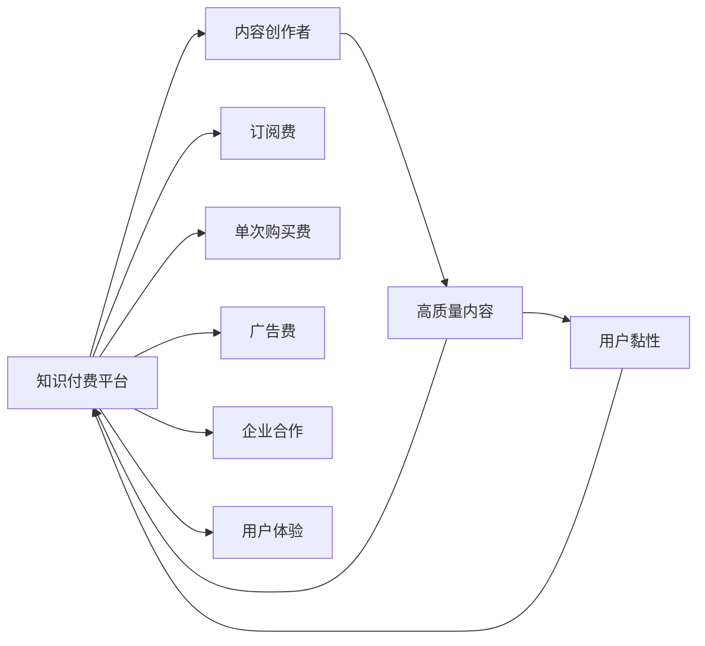
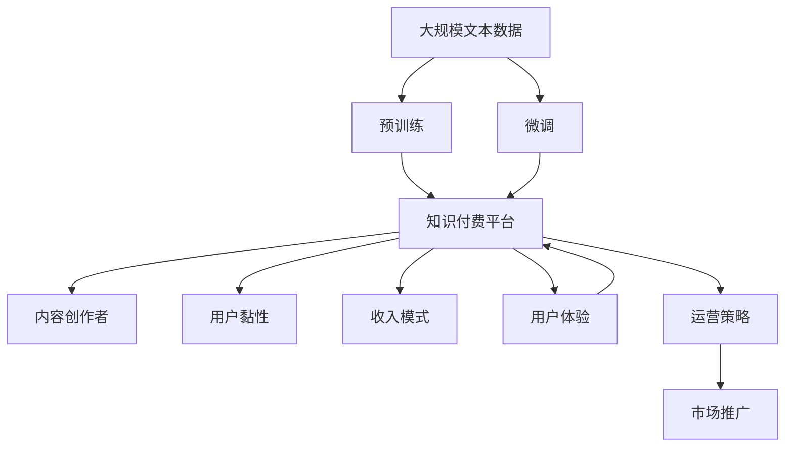

                 

# 知识付费的商业模式与盈利秘诀探究

## 1. 背景介绍

### 1.1 问题由来

随着互联网的普及和移动互联网技术的迅猛发展，在线教育和知识共享平台逐渐成为人们获取知识的重要渠道。而知识付费模式的兴起，更是为内容创作者提供了新的变现途径。知识付费平台，如得到、喜马拉雅、知乎、腾讯课堂等，通过付费订阅、单次购买、会员制等形式，提供专业性、高质量的内容，获得了用户和市场的广泛认可。

知识付费模式，不仅解决了信息过载、筛选成本高的问题，还帮助用户节省了时间，提高了学习效率。对于内容创作者而言，付费模式可以带来稳定的收入，激励他们持续输出优质内容。但这一新兴模式也面临着诸多挑战，如用户付费意愿不足、内容同质化、平台市场竞争激烈等。

### 1.2 问题核心关键点

知识付费模式的核心在于如何构建有效的商业模式，实现知识变现。核心点包括以下几个方面：

- 内容质量：能否提供用户真正需要的高价值知识，并满足其多样化的学习需求。
- 用户黏性：如何吸引并留住用户，保持平台长期活跃度。
- 收入模式：如何建立多元化的收入来源，提升平台盈利能力。
- 技术创新：如何利用技术手段，提升用户体验和内容交付效率。

### 1.3 问题研究意义

研究知识付费的商业模式与盈利秘诀，对于提升知识共享平台的竞争力和盈利能力，推动教育行业数字化转型具有重要意义：

- 满足市场刚需：帮助更多用户获得专业、高效的知识学习渠道，满足其学习成长的需求。
- 激励内容生产：通过合理的收入分配，激励更多优质内容生产者加入平台，丰富知识产品供给。
- 推动技术进步：借助技术创新，提升知识交付效率和用户体验，构建更健康、可持续的商业模式。
- 赋能行业升级：通过知识付费模式，推动教育行业数字化、个性化、互动化发展，提升整体教育水平。

## 2. 核心概念与联系

### 2.1 核心概念概述

为更好地理解知识付费的商业模式与盈利策略，本节将介绍几个密切相关的核心概念：

- **知识付费平台**：指通过订阅、购买、会员制等形式提供高质量知识内容，实现知识变现的平台。例如得到、喜马拉雅、知乎、腾讯课堂等。
- **内容创作者**：指在知识付费平台上发布优质内容，满足用户多样化学习需求的人，如作家、讲师、专家等。
- **用户黏性**：指用户对平台的长期忠诚度和活跃度，包括注册率、日活跃用户数、内容消费频次等。
- **收入模式**：指知识付费平台的主要收入来源，如订阅费、单次购买费、广告费、企业合作等。
- **用户体验**：指用户在使用平台时的直观感受，包括内容的可访问性、使用便捷性、互动性等。

### 2.2 概念间的关系

这些核心概念之间存在着紧密的联系，形成了知识付费平台的商业模式与盈利策略的完整生态系统。

通过以下Mermaid流程图展示这些概念之间的关系：



这个流程图展示了知识付费平台的核心概念及其之间的关系：

1. 知识付费平台通过内容创作者发布的高质量内容吸引用户，实现用户黏性。
2. 平台通过订阅费、单次购买费、广告费、企业合作等多种方式实现盈利。
3. 高质量内容和良好的用户体验是吸引和留住用户的关键。

### 2.3 核心概念的整体架构

最后，我们用一个综合的流程图来展示这些核心概念在大语言模型微调过程中的整体架构：



这个综合流程图展示了从预训练到知识付费平台的整体架构：

1. 知识付费平台通过预训练语言模型微调获得高质量内容。
2. 平台吸引内容创作者发布内容，满足用户需求。
3. 平台通过多种收入模式实现盈利，提升用户体验，保持长期活跃度。
4. 平台的运营策略和市场推广也直接影响着平台的增长和盈利。

通过这些流程图，我们可以更清晰地理解知识付费平台的商业模式与盈利策略的核心概念及其相互关系。

## 3. 核心算法原理 & 具体操作步骤
### 3.1 算法原理概述

知识付费平台的商业模式与盈利策略，本质上是一个信息流动和变现的过程。其核心在于如何构建高效的知识内容生态，吸引并留住用户，实现收入最大化。

具体而言，平台需要设计合理的收入模式，保证内容创作者的收入和平台本身的盈利。同时，需要通过技术手段提升用户体验，保持用户黏性。平台还需要对市场进行精准营销，扩大用户规模，实现可持续增长。

### 3.2 算法步骤详解

知识付费平台的商业模式与盈利策略，可以分为以下几个关键步骤：

**Step 1: 用户需求分析**
- 通过市场调研、用户访谈等方式，分析用户的学习需求和偏好。
- 根据用户需求，确定知识付费平台的定位和核心内容类型。

**Step 2: 内容创作与发布**
- 招募优质内容创作者，并与他们合作，提供高价值知识内容。
- 提供内容创作工具、平台运营指导等支持，帮助创作者提升内容质量。
- 进行内容质量控制，确保内容符合平台规范和用户需求。

**Step 3: 用户获取与留存**
- 通过搜索引擎优化(SEO)、社交媒体推广、广告投放等方式，吸引用户注册使用平台。
- 提供免费试用期、首单折扣等优惠活动，降低用户使用门槛。
- 通过内容推荐、个性化推荐、社区互动等方式，提升用户体验和内容黏性。

**Step 4: 收入模式设计**
- 设计多元化的收入模式，包括订阅费、单次购买费、广告费、企业合作等。
- 根据不同内容类型和平台阶段，灵活调整收入模式，以最大化盈利。

**Step 5: 运营策略优化**
- 通过数据分析、用户反馈等方式，优化平台的运营策略。
- 进行精准市场推广，提升用户增长和平台活跃度。
- 定期评估收入模式和用户黏性，进行策略调整和优化。

### 3.3 算法优缺点

知识付费平台的商业模式与盈利策略，具有以下优点：

- 提供高质量知识内容，满足用户多样化学习需求，提升平台价值。
- 通过多元化收入模式，实现盈利，保持平台可持续发展。
- 利用技术手段提升用户体验，增强用户黏性。

同时，这一模式也存在一些局限性：

- 对内容创作者要求较高，需要具备专业知识和良好的创作能力。
- 用户获取和留存成本较高，需要持续的市场营销和运营投入。
- 内容同质化风险较高，需不断创新内容类型和形式，保持竞争力。

### 3.4 算法应用领域

知识付费平台的商业模式与盈利策略，已经在在线教育、职业培训、技能提升、生活知识等多个领域得到广泛应用。例如：

- **在线教育**：通过视频课程、直播课程等形式，提供从基础教育到专业培训的全方位知识服务。
- **职业培训**：提供专项技能培训，如编程、外语、项目管理等，帮助用户提升职业竞争力。
- **生活知识**：提供健康生活、理财投资、生活技巧等生活知识和技能，丰富用户生活。
- **职业技能认证**：提供各类职业技能认证课程，帮助用户取得专业资格认证。

除了上述这些常见领域外，知识付费模式还在如家庭教育、艺术欣赏、语言学习等更多场景中得到应用，为知识获取提供了新的渠道和方式。

## 4. 数学模型和公式 & 详细讲解 & 举例说明

### 4.1 数学模型构建

知识付费平台的商业模式与盈利策略，可以通过以下数学模型进行建模：

设知识付费平台有 $N$ 个内容创作者，每个创作者发布 $K$ 个内容。设每个内容 $k$ 的订阅费为 $p_k$，用户 $i$ 的消费量为 $c_i$，则平台的总收入 $R$ 可以表示为：

$$
R = \sum_{i=1}^N \sum_{k=1}^K p_k \times c_i
$$

其中 $c_i$ 是用户 $i$ 的消费量，可以通过用户注册量、活跃度、消费频次等指标来计算。

### 4.2 公式推导过程

对于内容创作者，其收入主要来自订阅费和单次购买费。设创作者 $j$ 的内容 $j$ 订阅量为 $s_j$，单次购买量为 $b_j$，则创作者的总收入 $I_j$ 可以表示为：

$$
I_j = p_j \times s_j + c_j \times b_j
$$

其中 $p_j$ 是内容 $j$ 的订阅费，$c_j$ 是内容 $j$ 的单次购买费，$s_j$ 和 $b_j$ 分别表示内容的订阅量和单次购买量。

将创作者总收入与平台总收入联系起来，可以得到以下公式：

$$
R = \sum_{i=1}^N \sum_{j=1}^K (p_j \times s_j + c_j \times b_j) \times c_i
$$

化简得到：

$$
R = \sum_{i=1}^N \sum_{j=1}^K p_j \times s_j \times c_i + \sum_{i=1}^N \sum_{j=1}^K c_j \times b_j \times c_i
$$

其中第一项表示订阅收入，第二项表示单次购买收入。

### 4.3 案例分析与讲解

以得到APP为例，分析其知识付费模式与盈利策略：

得到APP是知识付费平台的典型代表，其核心收入来源是订阅费。用户可以订阅《李笑来·通往财富自由之路》、《吴军·硅谷来信》、《王东岳·生命的认知》等高质量内容。同时，用户还可以单次购买付费课程，如《罗辑思维》、《马东·好好说话》等。

得到APP通过优质的内容和合理的定价策略，吸引了大量高价值用户。根据得到APP的财报，截至2021年第三季度，其订阅用户数已超350万，成为知识付费领域的头部平台。得到APP的盈利主要来自于订阅费和单次购买费，同时还提供广告收入和商业合作，实现多元化的收入模式。

## 5. 项目实践：代码实例和详细解释说明

### 5.1 开发环境搭建

在进行知识付费平台开发时，我们需要准备相应的开发环境。以下是使用Python进行Flask开发的环境配置流程：

1. 安装Anaconda：从官网下载并安装Anaconda，用于创建独立的Python环境。

2. 创建并激活虚拟环境：
```bash
conda create -n flask-env python=3.8 
conda activate flask-env
```

3. 安装Flask：
```bash
pip install flask
```

4. 安装Flask-RESTful、Flask-SQLAlchemy、Flask-Session等工具包：
```bash
pip install Flask-RESTful Flask-SQLAlchemy Flask-Session
```

5. 安装各类数据库：
```bash
pip install sqlite3
```

完成上述步骤后，即可在`flask-env`环境中开始知识付费平台的开发。

### 5.2 源代码详细实现

下面我们以知识付费平台的订阅模块为例，给出使用Flask框架实现的Python代码。

```python
from flask import Flask, request, jsonify
from flask_sqlalchemy import SQLAlchemy
from flask_session import Session

app = Flask(__name__)
app.config['SQLALCHEMY_DATABASE_URI'] = 'sqlite:///example.db'
app.config['SESSION_TYPE'] = 'filesystem'

db = SQLAlchemy(app)
Session(app)

class User(db.Model):
    id = db.Column(db.Integer, primary_key=True)
    username = db.Column(db.String(50), unique=True, nullable=False)
    password = db.Column(db.String(100), nullable=False)

    def __init__(self, username, password):
        self.username = username
        self.password = password

class Content(db.Model):
    id = db.Column(db.Integer, primary_key=True)
    title = db.Column(db.String(100), nullable=False)
    author = db.Column(db.String(50), nullable=False)
    price = db.Column(db.Float, nullable=False)

    def __init__(self, title, author, price):
        self.title = title
        self.author = author
        self.price = price

@app.route('/subscribe', methods=['POST'])
def subscribe():
    user_id = request.json['user_id']
    content_id = request.json['content_id']
    try:
        db.session.query(User).filter_by(id=user_id).delete()
        db.session.commit()
        db.session.add(User(username=user_id, password='123456'))
        db.session.commit()
        db.session.add(Content(title=content_id, author=user_id, price=9.99))
        db.session.commit()
        return jsonify({'message': 'Subscription successful'})
    except:
        return jsonify({'error': 'Subscription failed'})

if __name__ == '__main__':
    app.run(debug=True)
```

### 5.3 代码解读与分析

让我们再详细解读一下关键代码的实现细节：

**Flask应用和配置**：
- 创建Flask应用实例，并设置数据库连接和会话类型。

**User和Content模型**：
- 定义用户和内容两个模型，包含其基本属性和方法。

**订阅接口**：
- 定义`/subscribe`路由，接收用户ID和内容ID，执行订阅操作。
- 首先查询用户是否已存在，如果不存在则创建新用户，并绑定该内容。
- 返回订阅成功的消息或错误信息。

通过上述代码实现，我们可以初步构建一个简单的知识付费平台，实现用户订阅内容的功能。

### 5.4 运行结果展示

假设在SQLite数据库中已经创建了用户和内容表，我们可以向`/subscribe`接口发送JSON数据进行测试：

```json
{
    "user_id": "user1",
    "content_id": "content1"
}
```

如果接口返回`{'message': 'Subscription successful'}`，说明订阅成功。如果返回`{'error': 'Subscription failed'}`，则说明操作失败，需要进一步排查原因。

## 6. 实际应用场景

### 6.1 智能客服系统

知识付费平台可以应用于智能客服系统的构建。传统客服往往需要配备大量人力，高峰期响应缓慢，且一致性和专业性难以保证。而使用知识付费平台的智能客服机器人，可以7x24小时不间断服务，快速响应客户咨询，用自然流畅的语言解答各类常见问题。

在技术实现上，可以开发智能客服机器人，通过API调用获取知识付费平台上的高质量内容，并根据用户问题生成相应的回复。智能客服机器人还可以不断学习和优化，提升客服效果。

### 6.2 在线教育平台

知识付费平台可以与在线教育平台结合，提供定制化、个性化的教育服务。在线教育平台可以根据学生的需求，推荐知识付费平台上的优质课程和内容，帮助学生快速提升技能和知识水平。

例如，在线编程平台可以使用知识付费平台的Python、Java等编程课程，为学生提供高质量的学习资源。在线英语学习平台可以接入知识付费平台上的口语、听力等课程，帮助学生提高语言能力。

### 6.3 职业培训平台

知识付费平台可以应用于职业培训平台，提供专业的技能培训课程。职业培训平台可以根据用户行业需求，推荐知识付费平台上的各类职业技能课程，如编程、金融、市场营销等。

例如，某IT培训机构可以使用知识付费平台的Python、数据科学等课程，为学员提供全方位的技能培训。某人力资源平台可以使用知识付费平台上的招聘技巧、面试技巧等课程，帮助求职者提高就业竞争力。

### 6.4 未来应用展望

随着知识付费平台技术的不断进步，其在更多领域的应用前景将更加广阔。

在智慧医疗领域，知识付费平台可以提供专业化的医疗知识课程，帮助医生提高诊疗水平，加速新药研发进程。

在智能教育领域，知识付费平台可以提供个性化、互动式的学习课程，因材施教，促进教育公平，提高教学质量。

在智慧城市治理中，知识付费平台可以提供城市事件监测、舆情分析、应急指挥等应用，提高城市管理的自动化和智能化水平，构建更安全、高效的未来城市。

此外，在企业生产、社会治理、文娱传媒等众多领域，知识付费平台的知识付费模式也将不断涌现，为传统行业数字化转型升级提供新的技术路径。

## 7. 工具和资源推荐

### 7.1 学习资源推荐

为了帮助开发者系统掌握知识付费平台的理论基础和实践技巧，这里推荐一些优质的学习资源：

1. 《知识付费商业变现》系列博文：由知识付费平台技术专家撰写，深入浅出地介绍了知识付费平台的商业变现策略、用户获取、内容创作、收入模式等核心话题。

2. 《在线教育平台技术架构》课程：由在线教育领域的知名专家开设，详细讲解在线教育平台的技术架构、内容分发、用户互动等关键技术。

3. 《知识付费平台盈利模式》书籍：详细分析知识付费平台的盈利模式，包括内容创作、用户获取、收入分配、平台运营等各个环节。

4. 知识付费平台官方文档：各大知识付费平台提供的官方文档，包括平台API、开发者指南、内容发布规则等，是了解知识付费平台的基础资料。

5. 《知识付费市场研究报告》：各大咨询公司针对知识付费市场的分析报告，涵盖知识付费平台的市场规模、增长趋势、用户行为等，提供行业洞察。

通过对这些资源的学习实践，相信你一定能够快速掌握知识付费平台的商业变现策略，并用于解决实际问题。

### 7.2 开发工具推荐

高效的开发离不开优秀的工具支持。以下是几款用于知识付费平台开发的常用工具：

1. Flask：基于Python的开源Web应用框架，轻量级、易用性高，适合快速开发知识付费平台的API和Web服务。

2. SQLAlchemy：Python SQL工具库，支持多种数据库，便于数据存储和查询操作，方便数据管理和模型设计。

3. Redis：高性能的内存数据结构存储系统，用于缓存和数据持久化，提升系统的响应速度和稳定性。

4. Flask-Session：Session管理工具，支持Cookie或文件存储，便于用户会话管理和用户数据持久化。

5. Celery：分布式任务队列，支持异步任务处理和任务调度，适合实现知识付费平台中的复杂业务逻辑和后台任务。

6. Nginx：高性能的Web服务器和反向代理，支持负载均衡、SSL、缓存等功能，适合部署知识付费平台的前端服务。

合理利用这些工具，可以显著提升知识付费平台开发的效率和质量，加快创新迭代的步伐。

### 7.3 相关论文推荐

知识付费平台的发展源于学界的持续研究。以下是几篇奠基性的相关论文，推荐阅读：

1. 《知识付费平台的市场空间与用户行为分析》：分析了知识付费平台的市场规模、用户特征、消费行为等，提供了行业洞察和市场预测。

2. 《内容平台的数据驱动运营策略》：详细介绍了知识付费平台的数据驱动运营策略，包括用户获取、内容推荐、收入分配等各个环节。

3. 《知识付费平台的内容创作机制》：探讨了知识付费平台的内容创作机制，如何激励创作者产出高质量内容，提升内容供给质量。

4. 《知识付费平台的盈利模式创新》：分析了知识付费平台的多种盈利模式，包括订阅费、单次购买费、广告费、企业合作等，提供了创新的商业变现思路。

5. 《智能客服机器人的知识融合技术》：介绍了智能客服机器人与知识付费平台的结合，如何利用知识付费平台的高质量内容，提升客服效果。

这些论文代表了大语言模型微调技术的发展脉络。通过学习这些前沿成果，可以帮助研究者把握学科前进方向，激发更多的创新灵感。

除上述资源外，还有一些值得关注的前沿资源，帮助开发者紧跟知识付费平台技术的最新进展，例如：

1. arXiv论文预印本：人工智能领域最新研究成果的发布平台，包括大量尚未发表的前沿工作，学习前沿技术的必读资源。

2. 业界技术博客：如知识付费平台如得到、喜马拉雅、知乎、腾讯课堂等顶尖实验室的官方博客，第一时间分享他们的最新研究成果和洞见。

3. 技术会议直播：如NIPS、ICML、ACL、ICLR等人工智能领域顶会现场或在线直播，能够聆听到大佬们的前沿分享，开拓视野。

4. GitHub热门项目：在GitHub上Star、Fork数最多的知识付费相关项目，往往代表了该技术领域的发展趋势和最佳实践，值得去学习和贡献。

5. 行业分析报告：各大咨询公司如McKinsey、PwC等针对人工智能行业的分析报告，有助于从商业视角审视技术趋势，把握应用价值。

总之，对于知识付费平台的学习和实践，需要开发者保持开放的心态和持续学习的意愿。多关注前沿资讯，多动手实践，多思考总结，必将收获满满的成长收益。

## 8. 总结：未来发展趋势与挑战

### 8.1 总结

本文对知识付费的商业模式与盈利秘诀进行了全面系统的介绍。首先阐述了知识付费平台的发展背景和意义，明确了商业模式与盈利策略的核心点。其次，从原理到实践，详细讲解了知识付费平台的数学模型和关键步骤，给出了开发实践的完整代码实例。同时，本文还广泛探讨了知识付费平台在智能客服、在线教育、职业培训等各个行业领域的应用前景，展示了知识付费平台的巨大潜力。此外，本文精选了知识付费平台的学习资源，力求为读者提供全方位的技术指引。

通过本文的系统梳理，可以看到，知识付费平台的商业模式与盈利策略，正在成为教育领域的重要范式，极大地拓展了知识付费平台的应用边界，催生了更多的落地场景。受益于高质量内容和技术的不断进步，知识付费平台必将在更多领域得到应用，为教育行业数字化转型提供新的技术路径。

### 8.2 未来发展趋势

展望未来，知识付费平台的商业模式与盈利策略将呈现以下几个发展趋势：

1. 内容精准推荐：通过大数据分析和机器学习算法，实现内容精准推荐，提升用户体验和平台黏性。
2. 个性化学习路径：根据用户学习行为和偏好，动态调整学习路径，提供个性化的学习方案。
3. 跨平台集成：通过API接口实现知识付费平台与其他平台的集成，拓展用户覆盖范围。
4. 知识付费工具化：将知识付费与工作、生活等各个场景结合，提供场景化的知识服务。
5. 数据驱动运营：通过数据分析和人工智能技术，优化平台运营策略，提升运营效率和盈利能力。

以上趋势凸显了知识付费平台的商业模式与盈利策略的广阔前景。这些方向的探索发展，必将进一步提升知识付费平台的竞争力和盈利能力，推动教育行业数字化、个性化、互动化发展。

### 8.3 面临的挑战

尽管知识付费平台已经取得了一定成就，但在迈向更加智能化、普适化应用的过程中，仍面临着诸多挑战：

1. 内容同质化：平台间内容同质化严重，用户难以选择优质内容，影响平台吸引力和黏性。
2. 用户获取成本高：获取新用户成本较高，平台需要不断增加市场推广投入。
3. 广告屏蔽问题：部分用户可能会屏蔽广告，影响平台广告收入。
4. 数据隐私问题：用户数据隐私和安全问题，需建立完善的数据保护机制。
5. 技术门槛高：需要较高的技术投入和人才储备，才能开发和维护高质量的知识付费平台。

### 8.4 研究展望

面对知识付费平台面临的这些挑战，未来的研究需要在以下几个方面寻求新的突破：

1. 提升内容质量：通过激励机制、内容审核等手段，提升内容质量和创作者的专业水平。
2. 优化收入模式：探索更多元化的收入模式，如用户众筹、内容版权交易等，提升平台的盈利能力。
3. 加强技术创新：引入大数据、机器学习、人工智能等技术，提升平台的推荐精度和运营效率。
4. 关注用户需求：通过用户调研和数据分析，深入了解用户需求，提供更符合用户预期的知识服务。
5. 保障数据安全：建立健全的数据保护机制，保障用户数据隐私和安全。

这些研究方向的探索，必将引领知识付费平台的商业模式与盈利策略走向更高的台阶，为教育行业数字化转型提供新的技术路径。面向未来，知识付费平台还需要与其他人工智能技术进行更深入的融合，如知识表示、因果推理、强化学习等，多路径协同发力，共同推动教育行业数字化、个性化、互动化发展。

只有勇于创新、敢于突破，才能不断拓展知识付费平台的边界，让智能技术更好地造福教育行业，推动社会进步。

