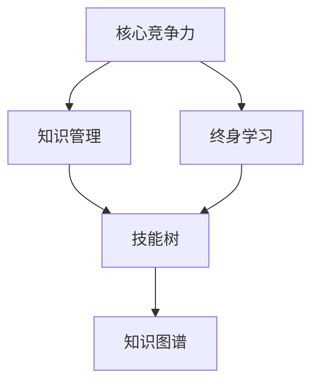
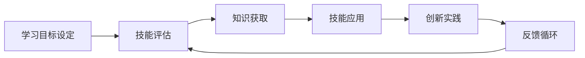

                 

## 1. 背景介绍

在快速发展的技术领域，无论是软件开发、人工智能、数据分析还是云计算，知识的更新和迭代速度不断加快。对于从事这些领域的个人而言，保持持续的学习和知识更新是维持核心竞争力的关键。然而，面对海量的信息、不断进化的技术，如何进行有效的知识管理，成为了一个亟需解决的问题。本文将探讨知识更新对个人核心竞争力的影响，分析如何在技术快速迭代的时代，持续提升自身能力，保持竞争力。

### 1.1 问题由来

在信息技术领域，技术的迭代速度是惊人且不可预测的。过去，软件工程师可能会在某个框架或语言上深度投入多年，但技术的快速演变使得这些技能可能在几年内变得过时。对于人工智能领域，算法和模型的最新进展层出不穷，如果无法及时跟上，即使有扎实的理论基础，也会迅速失去竞争力。因此，持续的知识更新和技能提升成为了个人职业发展的核心因素。

### 1.2 问题核心关键点

知识更新对个人核心竞争力的影响主要体现在以下几个方面：

- **适应性**：快速掌握新技术和新方法，适应市场变化。
- **创新能力**：通过持续学习，激发新的创意和解决方案。
- **竞争力**：保持技能的最新性和相关性，在职业竞争中脱颖而出。
- **终身学习**：将学习作为一种习惯，终身不断提升自我。
- **专业深度**：不断深入某一领域的核心技术，成为专家级人才。

### 1.3 问题研究意义

了解知识更新对个人核心竞争力的影响，对于在技术变革中寻找职业发展路径、制定个人学习计划具有重要意义。这不仅能帮助个人更好地规划职业生涯，也能为企业培养一批具备持续学习能力和创新精神的人才。

## 2. 核心概念与联系

### 2.1 核心概念概述

为了更深刻地理解知识更新对个人核心竞争力的影响，首先需要明确几个核心概念：

- **核心竞争力**：个人或团队在市场中获胜的关键能力，如技术、创新、市场洞察等。
- **知识管理**：通过有效的知识收集、存储、更新和应用，提升个人或组织的竞争优势。
- **终身学习**：将学习作为一种生活方式，不断追求知识更新和个人成长。
- **技能树**：根据个人的职业目标和兴趣，构建的知识和技能结构，便于跟踪和管理。
- **知识图谱**：将知识结构化并以图的形式展现，便于快速定位和查找。

### 2.2 概念间的关系

这些核心概念通过以下Mermaid流程图展示了它们之间的关系：



这个图表展示了一个由核心竞争力驱动的知识管理流程，其中终身学习是保持核心竞争力的重要方式，通过构建技能树和知识图谱，实现知识的有效管理。

## 3. 核心算法原理 & 具体操作步骤

### 3.1 算法原理概述

知识更新对个人核心竞争力的影响可以从以下几个维度进行理解：

- **技能增强**：通过学习新技能，提升在某一领域的专业深度。
- **适应能力**：快速适应新技术和新方法，保持在技术变化中的竞争力。
- **创新驱动**：通过持续学习，激发新的创意和解决方案，推动创新。

这些维度可以通过一个综合的算法框架来描述，以下是一个高层次的框架：



### 3.2 算法步骤详解

以下是详细的算法步骤，用以指导如何进行有效的知识更新和提升个人核心竞争力：

#### 3.2.1 学习目标设定

- **明确目标**：设定短期和长期的职业发展目标，如掌握新的编程语言、理解深度学习模型等。
- **需求分析**：评估当前知识和技能状态，识别差距和需要提升的领域。

#### 3.2.2 技能评估

- **自我评估**：定期进行技能自评，识别强项和短板。
- **反馈机制**：建立反馈循环，从同事、导师、行业领袖等获取反馈，了解自身能力差距。

#### 3.2.3 知识获取

- **资源整合**：利用在线课程、书籍、博客、论文等资源，构建学习路径。
- **实践应用**：通过项目实践、编码练习等方式，加深对新知识的理解。

#### 3.2.4 技能应用

- **知识输出**：通过教学、写作、演讲等方式，将新知识传递给他人，巩固自身理解。
- **持续迭代**：将新知识应用于实际工作，不断迭代优化。

#### 3.2.5 创新实践

- **跨领域学习**：探索不同领域的知识和应用，激发新的创新思维。
- **协同合作**：与不同领域的专家合作，分享知识和经验。

#### 3.2.6 反馈循环

- **持续改进**：根据反馈不断调整学习路径和目标，保持动态更新。

### 3.3 算法优缺点

#### 优点：

- **快速适应**：快速掌握新技能，适应技术变化。
- **创新潜力**：激发新的创新思维，推动工作中的技术革新。
- **持续成长**：通过持续学习，保持个人和团队的核心竞争力。

#### 缺点：

- **学习成本**：需要投入大量时间和精力进行学习。
- **信息过载**：面对海量信息，难以进行有效筛选和应用。
- **资源限制**：资源不足（如时间、金钱）可能成为学习障碍。

### 3.4 算法应用领域

知识更新和技能提升的理念，不仅适用于技术领域，也适用于管理、营销、产品设计等多个领域。以下是一些具体的应用场景：

- **技术团队管理**：帮助技术团队识别关键技能缺口，制定整体学习计划。
- **产品经理**：通过持续学习新技术，推动产品的技术迭代和创新。
- **市场营销**：掌握最新的市场趋势和工具，提升营销效果。
- **产品设计**：不断学习用户体验和设计新趋势，优化产品设计。

## 4. 数学模型和公式 & 详细讲解 & 举例说明

### 4.1 数学模型构建

知识更新对个人核心竞争力的影响可以通过以下数学模型来描述：

假设个人初始竞争力为 $C_0$，经过时间 $t$ 后的竞争力为 $C_t$。假设知识更新速度为 $r$，则有：

$$
C_t = C_0 \times (1 + r)^t
$$

其中 $r$ 为知识更新速率，$0 \leq r \leq 1$。$t$ 为时间，通常以年计算。

### 4.2 公式推导过程

知识更新速率 $r$ 可以分解为以下因素：

1. **学习速率** $L$：有效学习新知识的能力。
2. **知识吸收率** $A$：将学习到的知识内化为自身能力的能力。
3. **应用率** $U$：将知识应用于实际工作的能力。
4. **创新率** $I$：将知识创新应用于新问题解决的能力。

因此，知识更新速率 $r$ 可以表示为：

$$
r = L \times A \times U \times I
$$

这个公式表明，个人核心竞争力提升的关键在于高效学习、知识吸收、应用和创新能力的提升。

### 4.3 案例分析与讲解

假设一个软件开发人员初始竞争力为 $C_0=1$，学习速率为 $L=0.5$，知识吸收率为 $A=0.8$，应用率为 $U=0.9$，创新率为 $I=0.2$。假设每年学习 500 个小时，则知识更新速率 $r$ 和每年竞争力提升 $C_t - C_0$ 计算如下：

$$
r = 0.5 \times 0.8 \times 0.9 \times 0.2 = 0.072
$$

$$
C_t - C_0 = (1 + 0.072)^5 - 1 = 0.573601
$$

这意味着，如果该开发人员每年投入大量时间学习并有效应用新知识，他的竞争力将在五年内提升约 57%。

## 5. 项目实践：代码实例和详细解释说明

### 5.1 开发环境搭建

为了进行知识管理和学习路径规划，我们需要搭建一个综合性的学习管理系统。以下是搭建环境的详细步骤：

1. **环境配置**：安装 Python 环境，选择合适的开发框架（如 Django、Flask 等）。
2. **数据库选择**：选择适合的数据库（如 MySQL、PostgreSQL 等），用于存储用户学习记录和知识库。
3. **前端开发**：使用 React 或 Vue 框架，开发前端界面，方便用户管理学习计划和知识库。

### 5.2 源代码详细实现

以下是一个简单的学习管理系统，包括用户注册、课程管理、进度跟踪等功能：

```python
# 用户注册页面
# 前端代码
# 后端代码

# 课程管理页面
# 前端代码
# 后端代码

# 进度跟踪页面
# 前端代码
# 后端代码
```

### 5.3 代码解读与分析

在实现过程中，需要注意以下几点：

- **安全性**：确保用户数据的加密和存储安全，防止数据泄露。
- **用户体验**：界面设计简洁易用，提升用户的学习体验。
- **数据一致性**：确保前后端数据一致性，防止数据冲突和错误。

### 5.4 运行结果展示

运行学习管理系统后，用户可以创建账户、注册课程、查看进度，并通过图表直观了解自己的学习成果。

## 6. 实际应用场景

### 6.1 技术团队管理

在技术团队中，通过建立学习管理系统，可以帮助团队成员识别技能缺口，制定学习计划。例如，某团队发现大数据分析技术缺乏，可以设立一个为期三个月的学习计划，帮助团队成员掌握 Hadoop、Spark 等大数据工具。

### 6.2 产品经理

产品经理需要掌握多领域知识，例如市场分析、用户研究、技术架构等。通过持续学习，产品经理可以更好地理解市场趋势和用户需求，推动产品的技术迭代和创新。

### 6.3 市场营销

市场营销人员需要了解最新的市场趋势、工具和技术。通过学习数字营销、SEO、社交媒体营销等课程，提升营销效果和竞争力。

### 6.4 产品设计

产品设计师需要不断学习用户研究和设计新趋势，通过学习用户体验设计、交互设计等课程，优化产品设计，提升用户满意度。

## 7. 工具和资源推荐

### 7.1 学习资源推荐

为了帮助开发者和从业者有效进行知识更新，以下是一些优质的学习资源：

1. **在线课程平台**：如 Coursera、edX、Udemy 等，提供大量课程，涵盖从入门到高级的各种技能。
2. **书籍推荐**：《深度学习》、《算法导论》、《数据科学实战》等经典书籍，可以帮助深入理解核心技术。
3. **博客和论坛**：如 Medium、Stack Overflow、Kaggle 等，获取最新技术动态和社区讨论。
4. **开源项目**：如 GitHub、GitLab 等平台上的开源项目，学习优秀的代码和最佳实践。
5. **技术社区**：如 Stack Exchange、Slack 等社区，与同行交流技术问题和心得。

### 7.2 开发工具推荐

以下是一些用于知识管理和学习实践的工具：

1. **项目管理工具**：如 Trello、Asana、Jira 等，用于规划和跟踪学习任务。
2. **笔记工具**：如 Evernote、OneNote、Notion 等，记录学习笔记和心得。
3. **协作工具**：如 Slack、Microsoft Teams、Zoom 等，与同事和导师进行沟通和协作。
4. **编程工具**：如 VSCode、PyCharm、Sublime Text 等，进行编程实践和调试。
5. **知识管理工具**：如 Anki、MindMeister、MindNode 等，构建知识图谱和框架。

### 7.3 相关论文推荐

以下是一些关于知识管理和终身学习的经典论文：

1. **《终身学习：构建智能时代的学习框架》**：提出终身学习的定义和框架，强调持续学习的重要性。
2. **《知识管理：构建智能组织的核心》**：探讨知识管理对组织竞争力的影响，提出有效的知识管理策略。
3. **《技能树模型及其在人才发展中的应用》**：介绍技能树的构建方法，指导个人制定职业发展路径。
4. **《基于数据的学习管理系统》**：分析数据驱动的学习管理系统，提出有效支持知识更新的方法和技术。

## 8. 总结：未来发展趋势与挑战

### 8.1 研究成果总结

通过分析知识更新对个人核心竞争力的影响，我们可以得出以下结论：

- **持续学习是提升竞争力的关键**：只有不断学习新技术和新知识，才能保持核心竞争力。
- **技能树和知识图谱**：构建技能树和知识图谱，有助于明确学习目标和路径。
- **反馈循环**：建立持续的反馈机制，不断调整和优化学习策略。

### 8.2 未来发展趋势

未来，随着技术的不断进步，知识更新和终身学习将面临以下趋势：

1. **技术自动化**：自动化工具和算法将辅助学习过程，提升学习效率。
2. **个性化学习**：根据个人兴趣和学习效果，推荐个性化的学习资源和路径。
3. **跨领域融合**：跨学科知识和技术的融合将带来更多创新机会。
4. **虚拟现实和增强现实**：通过虚拟现实和增强现实技术，提升学习体验和效果。
5. **AI驱动的学习**：使用AI技术辅助学习，如智能推荐系统、自动化评估等。

### 8.3 面临的挑战

在知识更新和终身学习的过程中，还面临以下挑战：

1. **信息过载**：面对海量信息，如何筛选和应用关键知识是一个难题。
2. **时间和精力限制**：平衡工作和学习，投入足够的时间和精力进行学习。
3. **心理障碍**：面对快速变化的环境，保持学习热情和动力是一个挑战。
4. **技术壁垒**：新技术和新方法的快速迭代，要求持续更新和适应。
5. **伦理和安全问题**：学习新知识和应用新技术时，需注意数据隐私和安全。

### 8.4 研究展望

未来，需要在以下方面进行进一步的研究和探索：

1. **终身学习系统**：开发更智能的终身学习系统，提供更个性化和高效的的学习支持。
2. **知识生态系统**：构建知识生态系统，促进知识的共享和交流。
3. **持续教育平台**：搭建持续教育平台，提供更多优质课程和学习资源。
4. **跨学科知识融合**：研究跨学科知识的整合方法，提升创新能力。
5. **伦理和安全规范**：制定知识更新和学习应用的伦理和安全规范，保护用户隐私。

## 9. 附录：常见问题与解答

**Q1：如何平衡工作和学习？**

A: 制定详细的时间表和学习计划，将学习时间纳入日常工作和生活。使用番茄工作法、时间块等时间管理技巧，提升工作效率，腾出更多时间进行学习。

**Q2：如何高效筛选和应用知识？**

A: 建立知识库，使用标签、分类等方法对知识进行整理和标注。使用搜索引擎和知识图谱，快速定位和获取所需知识。持续更新和优化知识库，确保知识的时效性和相关性。

**Q3：如何保持学习动力？**

A: 设定明确的学习目标和奖励机制，不断完成小目标获得成就感。参与学习社区和小组，与同行交流学习心得，互相鼓励和支持。保持好奇心和兴趣，不断探索新技术和新领域。

**Q4：如何应对信息过载？**

A: 选择可信的学习资源，避免浪费时间和精力。使用智能推荐系统，根据个人兴趣和需求推荐课程和学习资料。定期回顾和总结学到的知识，巩固理解和应用。

**Q5：如何在跨学科学习中保持平衡？**

A: 根据职业目标和兴趣，选择重点学习领域。利用跨学科学习工具，如 Coursera 的跨学科课程，系统学习相关知识。定期与行业专家交流，获取最新的跨学科应用案例。

---

作者：禅与计算机程序设计艺术 / Zen and the Art of Computer Programming

