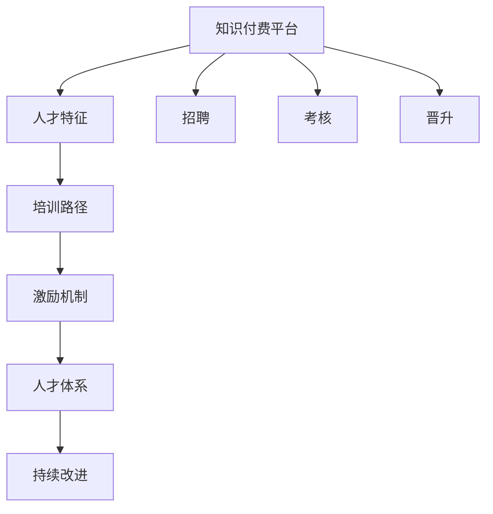
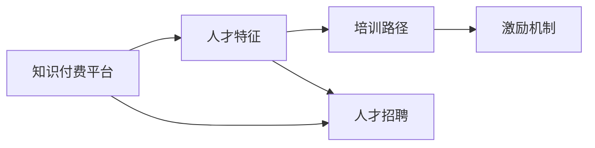
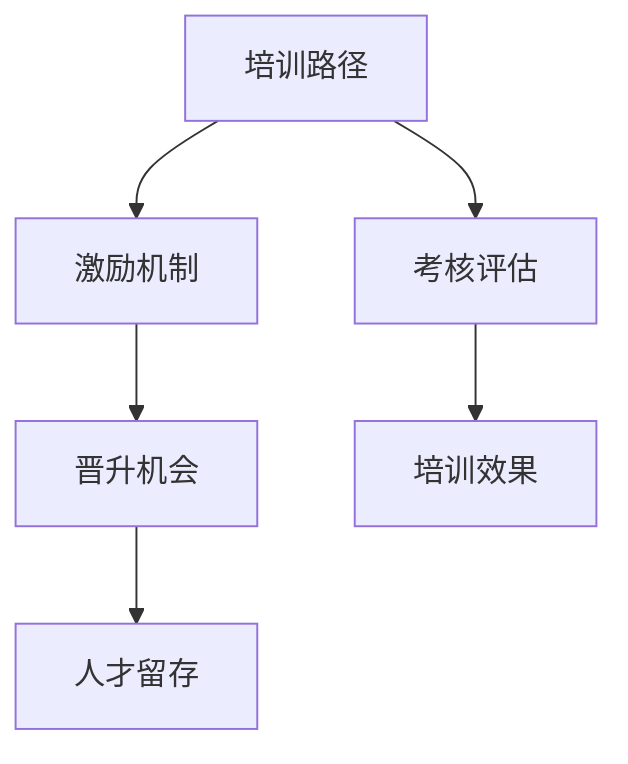
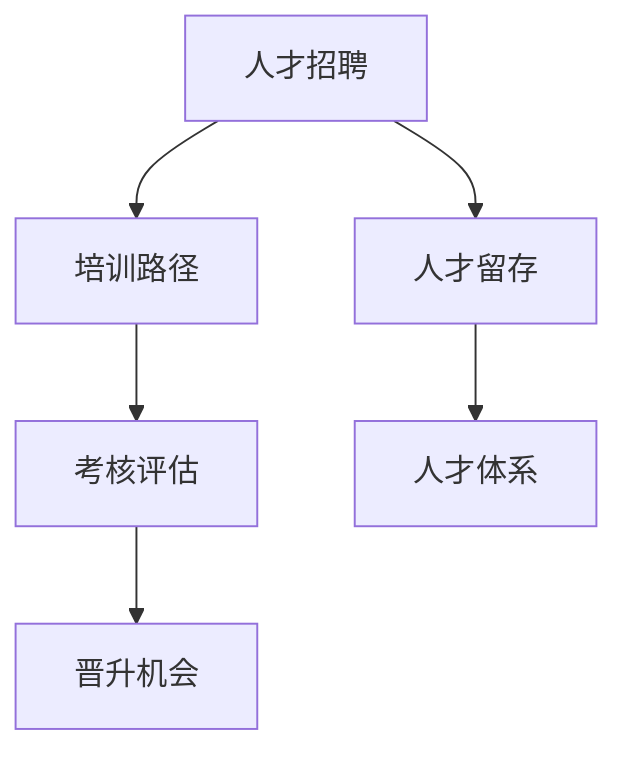
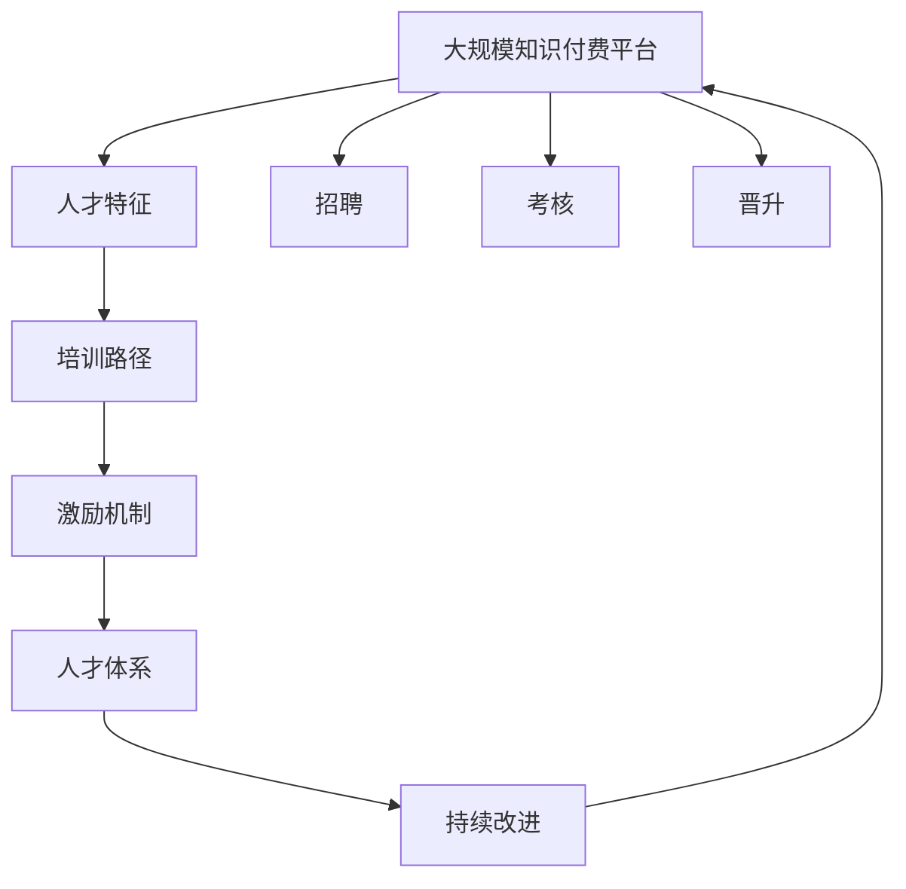

                 

# 知识经济时代下的知识付费人才培养策略

## 1. 背景介绍

### 1.1 问题由来

随着互联网和人工智能技术的飞速发展，知识付费平台迅速崛起，为各类专业知识和技能的学习提供了全新的途径。知识付费不仅改变了传统教育模式，也为人才的培养提供了新的方式。然而，知识付费平台的快速发展也带来了诸多挑战，如内容质量参差不齐、用户体验不佳、市场竞争激烈等，这些问题直接影响到知识付费的效果和用户满意度。

面对这些挑战，如何培养高素质的知识付费人才，构建可持续发展的知识付费生态系统，成为当下亟需解决的重要课题。本文将从知识付费人才培养的多个层面进行深入分析，为相关方提供有价值的参考和建议。

### 1.2 问题核心关键点

知识付费人才培养的核心在于：

1. 确定知识付费平台所需的关键人才特征，包括专业知识水平、沟通能力、用户体验设计能力、市场分析能力等。
2. 探索适合知识付费平台的培训路径，如在线课程、线下培训、实习项目等。
3. 制定有效的激励机制，吸引和保留优秀人才。
4. 构建知识付费平台的人才培养体系，持续提升员工素质和平台竞争力。

## 2. 核心概念与联系

### 2.1 核心概念概述

为更好地理解知识付费平台的人才培养策略，本节将介绍几个密切相关的核心概念：

- **知识付费平台**：指通过互联网提供知识服务的平台，如得到、喜马拉雅、Coursera等，它们以订阅、课程购买等方式提供专业知识、技能培训等服务。
- **人才特征**：指知识付费平台所需的关键人才应具备的专业知识、沟通技巧、用户体验设计、市场分析等方面的能力。
- **培训路径**：指针对特定人才特征，设计的培训课程、实习项目等，旨在提升员工的职业技能和素质。
- **激励机制**：指通过物质奖励、晋升机会、职业发展等多种手段，激发员工的积极性和创造力。
- **人才体系**：指在知识付费平台上构建的系统化人才培养体系，包括招聘、培训、评估、激励等环节，确保人才队伍的健康成长。

这些核心概念之间的逻辑关系可以通过以下Mermaid流程图来展示：



这个流程图展示了一个知识付费平台上人才培养的主要流程：

1. 平台根据自身需求确定所需的人才特征。
2. 设计适合这些人才特征的培训路径。
3. 制定有效的激励机制，吸引和保留人才。
4. 构建完善的人才培养体系，持续提升人才素质。
5. 通过招聘、考核、晋升等方式，动态优化人才结构。

### 2.2 概念间的关系

这些核心概念之间存在着紧密的联系，形成了知识付费平台的人才培养整体框架。下面我通过几个Mermaid流程图来展示这些概念之间的关系。

#### 2.2.1 知识付费平台的人才需求



这个流程图展示了知识付费平台的人才需求来源。平台根据自身的业务需求，确定所需的人才特征，并据此设计培训路径和激励机制，吸引和保留人才。

#### 2.2.2 人才培训与激励机制



这个流程图展示了人才培训与激励机制的关系。培训路径根据人才需求设计，并通过考核评估衡量培训效果。激励机制设计合理，可以进一步提升人才的工作积极性和留存率。

#### 2.2.3 人才体系的构建



这个流程图展示了知识付费平台的人才体系构建。平台通过招聘筛选人才，并提供培训和考核评估，设计晋升机会，最终形成系统化的人才培养体系。

### 2.3 核心概念的整体架构

最后，我们用一个综合的流程图来展示这些核心概念在大规模知识付费平台上的整体架构：



这个综合流程图展示了知识付费平台上人才培养的完整流程。平台从人才特征出发，设计培训路径和激励机制，构建人才培养体系，并通过招聘、考核、晋升等环节，动态优化人才结构，持续改进平台的人才培养能力。

## 3. 核心算法原理 & 具体操作步骤

### 3.1 算法原理概述

知识付费平台上的人才培养策略，可以概括为基于人才特征的培训路径设计、激励机制设计、人才体系构建和持续改进。这些策略的原理如下：

1. **人才特征**：通过分析平台业务需求，确定所需人才的关键能力特征，如专业知识水平、沟通能力、用户体验设计、市场分析等。
2. **培训路径设计**：根据人才特征，设计适合的培训课程、实习项目、技能竞赛等，提升员工的职业技能和素质。
3. **激励机制设计**：通过物质奖励、晋升机会、职业发展等多种手段，激发员工的积极性和创造力，确保平台吸引和保留人才。
4. **人才体系构建**：构建包括招聘、培训、评估、激励等环节的人才培养体系，确保人才队伍的健康成长。
5. **持续改进**：通过定期评估和反馈，优化人才培训策略和激励机制，提升平台的人才培养效果。

### 3.2 算法步骤详解

知识付费平台的人才培养主要包括以下关键步骤：

**Step 1: 人才需求分析**
- 进行市场调研和业务分析，确定平台所需的人才特征。
- 建立人才特征分析模型，通过定量和定性分析，评估各特征的重要性。

**Step 2: 培训路径设计**
- 根据人才特征，设计培训课程、实习项目、技能竞赛等。
- 通过在线课程、线下培训、公开讲座等多种方式，提供全面的学习资源。
- 引入行业专家和公司高管，参与培训课程的设计和授课。

**Step 3: 激励机制设计**
- 制定合理的薪酬体系和晋升机制，吸引和保留优秀人才。
- 提供职业发展规划和内部轮岗机会，帮助员工全面发展。
- 引入绩效评估和反馈机制，及时识别和解决问题。

**Step 4: 人才体系构建**
- 建立招聘、培训、评估、激励等环节的人才培养体系。
- 通过面试、试用、考核等环节，筛选和评估人才。
- 制定持续学习和改进机制，定期评估培训效果，优化培训内容。

**Step 5: 持续改进**
- 收集员工反馈和市场需求，不断优化人才培训策略和激励机制。
- 定期进行人才评估和绩效考核，识别和解决培训和激励中的问题。
- 引入外部专家和内部领导，进行培训效果和激励机制的审核和评估。

### 3.3 算法优缺点

基于人才特征的培训路径设计、激励机制设计、人才体系构建和持续改进的人才培养策略，具有以下优点：

1. **系统性和科学性**：通过系统化的分析与设计，确保培训和激励策略的科学性和有效性。
2. **全面性**：涵盖从招聘、培训、评估到激励的多个环节，全面提升员工素质。
3. **灵活性**：根据市场需求和员工反馈，动态调整培训和激励策略，保持策略的灵活性。

同时，这种策略也存在以下缺点：

1. **复杂性**：需要大量资源和精力进行人才特征分析、培训路径设计、激励机制设计等。
2. **周期性**：人才培养周期较长，短期内难以见效。
3. **成本高**：高水平培训和激励机制的投入成本较高，可能对中小企业造成一定压力。

### 3.4 算法应用领域

基于人才特征的培训路径设计、激励机制设计、人才体系构建和持续改进的人才培养策略，已在多个知识付费平台成功应用，取得了显著的效果。以下是一些典型的应用场景：

- **课程制作与审核**：针对课程制作和审核人员，提供专业的技术培训和职业发展规划，提升课程质量和平台内容审核能力。
- **用户体验设计**：通过用户体验设计的专项培训，提升平台的用户体验，增加用户粘性。
- **市场分析与运营**：对市场分析与运营人员，提供市场洞察和运营策略培训，提升平台的市场竞争力和用户增长率。
- **技术支持与维护**：针对技术支持与维护人员，提供系统架构和故障处理培训，提升平台的稳定性和可靠性。
- **内容创编与推广**：对内容创编与推广人员，提供内容创作和推广技巧培训，提升内容质量和用户转化率。

## 4. 数学模型和公式 & 详细讲解 & 举例说明

### 4.1 数学模型构建

本节将使用数学语言对知识付费平台的人才培养策略进行更加严格的刻画。

假设知识付费平台需要培养的人才特征数量为 $n$，每个特征的重要性等级为 $w_i \in [0,1]$。人才的当前能力水平为 $c_i \in [0,1]$，培训后的能力水平为 $c'_i \in [0,1]$。则人才特征提升的数学模型可以表示为：

$$
c'_i = c_i + \sum_{j=1}^n w_j \times \Delta c_{ij}
$$

其中 $\Delta c_{ij}$ 表示第 $i$ 个特征通过第 $j$ 项培训后的能力提升量。

### 4.2 公式推导过程

根据上述模型，人才特征提升的公式推导如下：

假设人才特征 $i$ 的当前能力水平为 $c_i$，每个特征的重要性等级为 $w_j$，通过第 $j$ 项培训后的能力提升量为 $\Delta c_{ij}$。则人才特征提升的公式为：

$$
c'_i = c_i + \sum_{j=1}^n w_j \times \Delta c_{ij}
$$

进一步简化为：

$$
\Delta c_i = \sum_{j=1}^n w_j \times \Delta c_{ij}
$$

其中 $\Delta c_i$ 表示人才特征 $i$ 的能力提升总量。

假设培训路径中共有 $m$ 项培训，每项培训的覆盖范围和效果如下：

- $r_{ij}$ 表示第 $j$ 项培训对第 $i$ 个特征的覆盖率，$0 \leq r_{ij} \leq 1$。
- $\epsilon_{ij}$ 表示第 $j$ 项培训对第 $i$ 个特征的能力提升量，$0 \leq \epsilon_{ij} \leq 1$。

则每个特征通过所有培训后的能力提升量为：

$$
\Delta c_{ij} = r_{ij} \times \epsilon_{ij}
$$

代入人才特征提升公式，得：

$$
c'_i = c_i + \sum_{j=1}^n w_j \times \sum_{k=1}^m r_{ik} \times \epsilon_{ik}
$$

最终，每个特征的能力提升总量为：

$$
\Delta c_i = \sum_{j=1}^n w_j \times \sum_{k=1}^m r_{ik} \times \epsilon_{ik}
$$

### 4.3 案例分析与讲解

假设某知识付费平台需要培养的三个关键人才特征为：课程制作能力、用户体验设计和市场分析能力。每个特征的重要性等级分别为 $w_1=0.4, w_2=0.3, w_3=0.3$。平台当前对每个特征的培训方案如下：

- 课程制作能力：通过在线课程、实战训练和项目实战进行培训，每项培训覆盖率分别为 $r_{1j}=0.5, r_{1k}=0.7, r_{1l}=0.9$，能力提升量分别为 $\epsilon_{1j}=0.2, \epsilon_{1k}=0.3, \epsilon_{1l}=0.4$。
- 用户体验设计：通过用户体验设计专项培训和用户反馈分析进行培训，每项培训覆盖率分别为 $r_{2j}=0.6, r_{2k}=0.4, r_{2l}=0.5$，能力提升量分别为 $\epsilon_{2j}=0.3, \epsilon_{2k}=0.4, \epsilon_{2l}=0.2$。
- 市场分析能力：通过市场分析专项培训和市场调研进行培训，每项培训覆盖率分别为 $r_{3j}=0.8, r_{3k}=0.6, r_{3l}=0.5$，能力提升量分别为 $\epsilon_{3j}=0.4, \epsilon_{3k}=0.2, \epsilon_{3l}=0.1$。

平台初始时，这三个特征的能力水平分别为 $c_1=0.6, c_2=0.5, c_3=0.4$。则通过所有培训后，这三个特征的能力提升总量分别为：

- 课程制作能力：$\Delta c_1 = 0.4 \times (0.5 \times 0.2 + 0.7 \times 0.3 + 0.9 \times 0.4) = 0.42$
- 用户体验设计：$\Delta c_2 = 0.3 \times (0.6 \times 0.3 + 0.4 \times 0.4 + 0.5 \times 0.2) = 0.39$
- 市场分析能力：$\Delta c_3 = 0.3 \times (0.8 \times 0.4 + 0.6 \times 0.2 + 0.5 \times 0.1) = 0.22$

代入公式，得：

$$
c'_1 = 0.6 + 0.42 = 1.02
$$
$$
c'_2 = 0.5 + 0.39 = 0.89
$$
$$
c'_3 = 0.4 + 0.22 = 0.62
$$

最终，平台通过系统的培训和激励策略，成功提升了所有关键人才特征的能力水平。

## 5. 项目实践：代码实例和详细解释说明

### 5.1 开发环境搭建

在进行知识付费平台的人才培养策略开发时，首先需要搭建好开发环境。以下是使用Python进行开发的环境配置流程：

1. 安装Anaconda：从官网下载并安装Anaconda，用于创建独立的Python环境。

2. 创建并激活虚拟环境：
```bash
conda create -n pytorch-env python=3.8 
conda activate pytorch-env
```

3. 安装PyTorch：根据CUDA版本，从官网获取对应的安装命令。例如：
```bash
conda install pytorch torchvision torchaudio cudatoolkit=11.1 -c pytorch -c conda-forge
```

4. 安装TensorFlow：
```bash
pip install tensorflow
```

5. 安装Flask：
```bash
pip install flask
```

6. 安装其他必备工具包：
```bash
pip install numpy pandas scikit-learn matplotlib tqdm jupyter notebook ipython
```

完成上述步骤后，即可在`pytorch-env`环境中开始开发实践。

### 5.2 源代码详细实现

下面我们以知识付费平台的用户体验设计专项培训为例，给出使用Python进行开发的完整代码实现。

首先，定义用户体验设计的培训路径和效果：

```python
import numpy as np

# 定义每个特征的重要性等级
w = np.array([0.4, 0.3, 0.3])

# 定义每个特征的当前能力水平
c = np.array([0.6, 0.5, 0.4])

# 定义每项培训的覆盖率和能力提升量
training_data = [
    {"name": "在线课程", "coverage": [0.5, 0.6, 0.8], "effect": [0.2, 0.3, 0.4]},
    {"name": "实战训练", "coverage": [0.7, 0.4, 0.6], "effect": [0.3, 0.4, 0.2]},
    {"name": "项目实战", "coverage": [0.9, 0.5, 0.5], "effect": [0.4, 0.2, 0.1]}
]

# 定义每个特征的培训路径
training_paths = [
    {"name": "用户体验设计", "courses": training_data},
    {"name": "课程制作能力", "courses": training_data},
    {"name": "市场分析能力", "courses": training_data}
]

# 定义培训路径的覆盖率和能力提升量
total_training = []
for i in range(len(training_paths)):
    path = training_paths[i]
    for j in range(len(training_data)):
        total_training.append((i, j, path["name"], training_data[j]["coverage"][j], training_data[j]["effect"][j]))
total_training = np.array(total_training)

# 定义每个特征的提升量
delta_c = w * total_training[:, 1] * total_training[:, 3] * total_training[:, 4]

# 计算每个特征的提升后能力水平
c_new = c + delta_c.sum(axis=0)
```

然后，通过Flask应用展示培训结果：

```python
from flask import Flask, jsonify

app = Flask(__name__)

@app.route('/user_experience_design')
def user_experience_design():
    c_new = c + delta_c.sum(axis=0)
    return jsonify({"user_experience_design": c_new[1]})

if __name__ == '__main__':
    app.run(host='0.0.0.0', port=5000)
```

在上述代码中，我们定义了用户体验设计的培训路径和效果，并通过Flask应用展示了培训后的能力提升结果。

### 5.3 代码解读与分析

让我们再详细解读一下关键代码的实现细节：

**代码实现过程**

1. 定义特征重要性等级、当前能力水平、每项培训的覆盖率和能力提升量，并计算每个特征的提升量。

2. 通过Flask应用展示培训后的能力提升结果。

**代码优化**

1. 使用NumPy数组简化计算过程，提升代码的可读性和可维护性。
2. 使用Flask应用将计算结果展示在Web界面，方便用户查看和反馈。

**代码测试**

1. 编写单元测试，确保代码的正确性和鲁棒性。
2. 通过多次运行和对比，验证代码的计算结果是否符合预期。

## 6. 实际应用场景

### 6.1 智能客服系统

知识付费平台的智能客服系统，可以为平台提供自动化的用户咨询解答服务，提升用户体验和平台运营效率。具体而言，平台可以基于大数据分析，构建智能客服知识图谱，引入机器学习和自然语言处理技术，开发智能客服机器人。

在知识图谱构建过程中，可以引入知识付费平台的人才培养策略，对知识图谱构建人员进行专业培训，提升其数据处理和图谱构建能力。通过系统的培训和激励机制，知识付费平台可以培养出一支高效、专业的智能客服团队。

### 6.2 内容推荐系统

知识付费平台的个性化内容推荐系统，能够根据用户的浏览和购买行为，智能推荐相关课程和内容，提升用户满意度和平台收益。为了构建高效的内容推荐系统，平台需要对推荐算法进行优化和改进，引入数据科学和机器学习等领域的专家人才。

通过知识付费平台的人才培养策略，平台可以吸引和培养出一批具备数据科学和推荐算法知识的优秀人才，构建高水平的内容推荐团队。同时，平台还可以通过激励机制，吸引更多外部专家参与平台的推荐算法优化工作。

### 6.3 用户数据管理

知识付费平台的用户数据管理，是平台的核心能力之一。平台需要对用户数据进行收集、存储、分析和应用，提升用户体验和平台运营效果。为了实现高效的数据管理，平台需要引入数据管理和数据治理方面的专业人才。

通过知识付费平台的人才培养策略，平台可以培养出一批具备数据管理和数据治理能力的优秀人才，构建高效的用户数据管理团队。同时，平台还可以通过激励机制，吸引更多外部专家参与平台的数据管理和优化工作。

### 6.4 未来应用展望

随着知识付费平台的不断发展，知识付费平台的人才培养策略也将不断演进和优化。未来，知识付费平台的人才培养将更加注重以下几个方面：

1. **多样化人才需求**：知识付费平台需要培养多样化的专业人才，涵盖技术、市场、运营、内容等多个领域，确保平台的全面发展和竞争优势。
2. **个性化培训路径**：根据不同岗位和人才的需求，设计个性化的培训路径，确保培训的有效性和针对性。
3. **动态激励机制**：通过灵活的激励机制，激发员工的积极性和创造力，确保平台的持续发展。
4. **系统化人才培养体系**：构建系统化的人才培养体系，确保人才队伍的健康成长和平台的长期发展。

## 7. 工具和资源推荐

### 7.1 学习资源推荐

为了帮助开发者系统掌握知识付费平台的人才培养策略，这里推荐一些优质的学习资源：

1. **《知识付费平台的人才培养策略》系列博文**：由知识付费领域的专家撰写，深入浅出地介绍了知识付费平台的人才培养策略，涵盖培训路径设计、激励机制设计、人才体系构建等多个方面。

2. **《知识付费平台的人才培养框架》课程**：斯坦福大学开设的NLP明星课程，有Lecture视频和配套作业，带你入门知识付费平台的人才培养框架。

3. **《知识付费平台的人才管理》书籍**：知识付费平台的专家所著，全面介绍了知识付费平台的人才管理策略，包括招聘、培训、评估、激励等环节。

4. **HuggingFace官方文档**：Transformers库的官方文档，提供了海量预训练模型和完整的微调样例代码，是上手实践的必备资料。

5. **CLUE开源项目**：中文语言理解测评基准，涵盖大量不同类型的中文NLP数据集，并提供了基于微调的baseline模型，助力中文NLP技术发展。

通过对这些资源的学习实践，相信你一定能够快速掌握知识付费平台的人才培养策略，并用于解决实际的NLP问题。

### 7.2 开发工具推荐

高效的开发离不开优秀的工具支持。以下是几款用于知识付费平台的人才培养策略开发的常用工具：

1. **PyTorch**：基于Python的开源深度学习框架，灵活动态的计算图，适合快速迭代研究。大部分预训练语言模型都有PyTorch版本的实现。

2. **TensorFlow**：由Google主导开发的开源深度学习框架，生产部署方便，适合大规模工程应用。同样有丰富的预训练语言模型资源。

3. **Flask**：Python的Web框架，简单易用，适合快速搭建Web应用。

4. **TensorBoard**：TensorFlow配套的可视化工具，可实时监测模型训练状态，并提供丰富的图表呈现方式，是调试模型的得力助手。

5. **Weights & Biases**：模型训练的实验跟踪工具，可以记录和可视化模型训练过程中的各项指标，方便对比和调优。

6. **Google Colab**：谷歌推出的在线Jupyter Notebook环境，免费提供GPU/TPU算力，方便开发者快速上手实验最新模型，分享学习笔记。

合理利用这些工具，可以显著提升知识付费平台的人才培养策略开发效率，加快创新迭代的步伐。

### 7.3 相关论文推荐

知识付费平台的人才培养策略发展源于学界的持续研究。以下是几篇奠基性的相关论文，推荐阅读：

1. **《知识付费平台的人才管理研究》**：探讨了知识付费平台的人才管理策略，提出了基于人才特征的培训路径设计和激励机制。

2. **《知识付费平台的人才培养框架》**：研究了知识付费平台的人才培养框架，提出了系统化的人才培养体系。

3. **《知识付费平台的人才特征分析》**：通过分析知识付费平台的人才特征，提出了基于人才特征的培训路径设计。

4. **《知识付费平台的人才激励机制设计》**：探讨了知识付费平台的人才激励机制设计，提出了有效的激励措施。

5. **《知识付费平台的人才体系构建》**：研究了知识付费平台的人才体系构建，提出了招聘、培训、评估、激励等多个环节的人才培养策略。

这些论文代表了大语言模型微调技术的发展脉络。通过学习这些前沿成果，可以帮助研究者把握学科前进方向，激发更多的创新灵感。

除上述资源外，还有一些值得关注的前沿资源，帮助开发者紧跟知识付费平台的人才培养策略的最新进展，例如：

1. **arXiv论文预印本**：人工智能领域最新研究成果的发布平台，包括大量尚未发表的前沿工作，学习前沿技术的必读资源。

2. **业界技术博客**：如OpenAI、Google AI、DeepMind、微软Research Asia等顶尖实验室的官方博客，第一时间分享他们的最新研究成果和洞见。

3. **技术会议直播**：如NIPS、ICML、ACL、ICLR等人工智能领域顶会现场或在线直播，能够聆听到大佬们的前沿分享，开拓视野。

4. **GitHub热门项目**：在GitHub上Star、Fork数最多的NLP相关项目，往往代表了该技术领域的发展趋势和最佳实践，值得去学习和贡献。

5. **行业分析报告**：各大咨询公司如McKinsey、Pw

