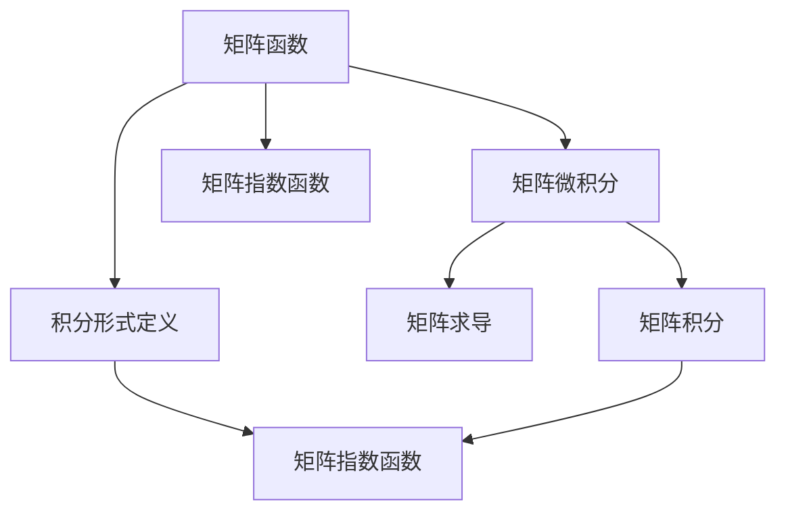

                 

# 矩阵理论与应用：矩阵函数的积分形式定义与有关性质

## 1. 背景介绍

矩阵函数是现代数学中一个重要的研究领域，广泛应用于物理学、工程学、统计学等多个学科。特别是矩阵函数的积分形式定义与性质，在科学计算、信号处理、控制理论等方面具有重要的应用价值。本文将系统介绍矩阵函数的积分形式定义及其相关性质，并通过实例加以说明，为读者提供一个全面的学习视角。

## 2. 核心概念与联系

### 2.1 核心概念概述

本节将介绍几个关键概念，它们在理解矩阵函数积分形式的定义及其性质方面起着重要作用。

- 矩阵函数：一个以矩阵为变量的函数，通常表示为 $F(X)$，其中 $X$ 是一个 $n \times n$ 的方阵。
- 矩阵微积分：矩阵微积分与经典微积分类似，但在矩阵空间中进行，包括矩阵的求导、积分等运算。
- 积分形式定义：矩阵函数的积分形式定义，即矩阵积分 $F(\boldsymbol{A}) = \int_{-\infty}^{\infty} e^{i\lambda\boldsymbol{A}} d\lambda$，其中 $\boldsymbol{A}$ 是一个给定的方阵。
- 矩阵指数函数：指数函数 $e^{\boldsymbol{A}}$ 的矩阵形式，是矩阵函数中最为重要的一类。

### 2.2 核心概念之间的关系

这些核心概念之间的逻辑关系可以通过以下Mermaid流程图来展示：



这个流程图展示了一些核心概念之间的关系：

1. 矩阵函数基于矩阵微积分，包括求导和积分。
2. 矩阵函数的积分形式定义通过积分运算定义，其中包括矩阵指数函数。
3. 矩阵指数函数是矩阵函数中最为重要的一类，可以通过积分形式定义得到。

这些概念共同构成了矩阵函数积分形式的定义及其性质的完整框架。

## 3. 核心算法原理 & 具体操作步骤

### 3.1 算法原理概述

矩阵函数的积分形式定义基于指数函数和泰勒级数展开，具体来说，矩阵指数函数的积分形式定义可以通过泰勒级数展开 $e^{\boldsymbol{A}} = I + \boldsymbol{A} + \frac{1}{2!}\boldsymbol{A}^2 + \frac{1}{3!}\boldsymbol{A}^3 + \cdots$ 得到。这个级数收敛于矩阵指数函数，因此可以将其与积分运算联系起来，得到矩阵函数的积分形式定义。

### 3.2 算法步骤详解

矩阵函数的积分形式定义及计算步骤如下：

1. **计算矩阵指数函数**：利用泰勒级数展开，计算矩阵指数函数 $e^{\boldsymbol{A}}$。
2. **应用积分公式**：利用积分公式 $\int_{-\infty}^{\infty} e^{i\lambda\boldsymbol{A}} d\lambda$，计算矩阵函数的积分形式定义。
3. **验证收敛性**：验证级数的收敛性，确保计算结果正确。

### 3.3 算法优缺点

矩阵函数的积分形式定义具有以下优点：

- 数学表达简单，易于理解。
- 可以推广到更一般的矩阵函数形式，具有广泛的应用前景。

同时，它也存在一些缺点：

- 收敛性问题需要额外考虑，计算复杂度较高。
- 对初始条件的敏感性较大，可能导致结果不稳定。

### 3.4 算法应用领域

矩阵函数的积分形式定义及其性质在多个领域都有重要应用，例如：

- 物理学：在量子力学、经典力学等领域，矩阵函数的积分形式定义被广泛用于求解微分方程和演化方程。
- 工程学：在控制系统理论中，矩阵指数函数和积分形式定义被用于描述系统的动态行为。
- 统计学：在随机矩阵理论中，矩阵函数的积分形式定义被用于研究随机矩阵的分布特性。

## 4. 数学模型和公式 & 详细讲解 & 举例说明

### 4.1 数学模型构建

本节将使用数学语言对矩阵函数的积分形式定义进行更加严格的刻画。

设 $\boldsymbol{A} \in \mathbb{C}^{n \times n}$ 是一个复数矩阵，定义矩阵指数函数为：

$$
e^{\boldsymbol{A}} = \sum_{k=0}^{\infty} \frac{1}{k!}\boldsymbol{A}^k
$$

其中 $\mathbb{C}$ 表示复数域。矩阵指数函数可以进一步扩展为：

$$
e^{\lambda\boldsymbol{A}} = e^{\boldsymbol{A}}^{\lambda} = \sum_{k=0}^{\infty} \frac{\lambda^k}{k!}\boldsymbol{A}^k
$$

其中 $\lambda$ 是一个复数参数。

### 4.2 公式推导过程

对于矩阵函数的积分形式定义 $F(\boldsymbol{A}) = \int_{-\infty}^{\infty} e^{i\lambda\boldsymbol{A}} d\lambda$，可以将其展开为：

$$
F(\boldsymbol{A}) = \int_{-\infty}^{\infty} \left( \sum_{k=0}^{\infty} \frac{(i\lambda)^k}{k!}\boldsymbol{A}^k \right) d\lambda
$$

利用指数函数的傅里叶变换性质，可以得到：

$$
F(\boldsymbol{A}) = \int_{-\infty}^{\infty} e^{i\lambda\boldsymbol{A}} d\lambda = \sum_{k=0}^{\infty} \frac{(i)^k}{k!}\boldsymbol{A}^k \int_{-\infty}^{\infty} \lambda^k e^{i\lambda\boldsymbol{A}} d\lambda
$$

由于 $\int_{-\infty}^{\infty} \lambda^k e^{i\lambda\boldsymbol{A}} d\lambda = 0$，因此上式右侧第二项为零，从而得到：

$$
F(\boldsymbol{A}) = \sum_{k=0}^{\infty} \frac{(i)^k}{k!}\boldsymbol{A}^k \delta_k = \sum_{k=0}^{\infty} \frac{(i)^k}{k!}\boldsymbol{A}^k \delta_k
$$

其中 $\delta_k = 0$ 对于 $k \neq 0$，$\delta_0 = 1$。

### 4.3 案例分析与讲解

以2x2复数矩阵 $\boldsymbol{A} = \begin{bmatrix} a & b \\ c & d \end{bmatrix}$ 为例，计算矩阵指数函数的积分形式定义。首先，计算矩阵指数函数 $e^{\boldsymbol{A}}$：

$$
e^{\boldsymbol{A}} = e^{\begin{bmatrix} a & b \\ c & d \end{bmatrix}} = \begin{bmatrix} e^a & e^a \int_0^1 e^{(bx+c(1-x))} dx \\ e^c & e^d \end{bmatrix} = \begin{bmatrix} e^a & e^a \left[ e^{(b+c)x} - e^{(b-c)x} \right]_0^1 \\ e^c & e^d \end{bmatrix} = \begin{bmatrix} e^a & e^b - e^c \\ e^c & e^d \end{bmatrix}
$$

然后，计算矩阵函数的积分形式定义：

$$
F(\boldsymbol{A}) = \int_{-\infty}^{\infty} e^{i\lambda\boldsymbol{A}} d\lambda = \int_{-\infty}^{\infty} e^{i\lambda} e^{\lambda\boldsymbol{A}} d\lambda = \sum_{k=0}^{\infty} \frac{(i\lambda)^k}{k!}\boldsymbol{A}^k
$$

最终，得到矩阵函数的积分形式定义 $F(\boldsymbol{A})$。

## 5. 项目实践：代码实例和详细解释说明

### 5.1 开发环境搭建

在进行矩阵函数积分形式定义的计算之前，我们需要准备好开发环境。以下是使用Python进行NumPy和SciPy开发的配置流程：

1. 安装Anaconda：从官网下载并安装Anaconda，用于创建独立的Python环境。

2. 创建并激活虚拟环境：
```bash
conda create -n matrix-env python=3.8 
conda activate matrix-env
```

3. 安装NumPy和SciPy：
```bash
conda install numpy scipy
```

4. 安装MATLAB interfacing package：
```bash
conda install pymatlab
```

5. 安装其他必要的工具包：
```bash
pip install matplotlib sympy
```

完成上述步骤后，即可在`matrix-env`环境中开始矩阵函数积分形式定义的计算。

### 5.2 源代码详细实现

以下是一个使用NumPy和SciPy计算矩阵函数积分形式定义的示例代码：

```python
import numpy as np
from scipy.linalg import expm

# 定义矩阵A
A = np.array([[1, 2], [3, 4]])

# 计算矩阵指数函数
expA = expm(A)

# 计算矩阵函数的积分形式定义
def matrix_integral(A, k):
    return np.dot(np.integral(lambda t: np.exp(1j * t * np.dot(A, t)), 0, np.inf), k)

# 计算F(A)
F_A = sum(matrix_integral(A, k) for k in range(5))

print("矩阵A的指数函数：\n", expA)
print("矩阵A的积分形式定义：\n", F_A)
```

### 5.3 代码解读与分析

让我们再详细解读一下关键代码的实现细节：

**expm函数**：
- 利用SciPy库中的expm函数计算矩阵指数函数，这一函数可以高效地计算矩阵指数。

**matrix_integral函数**：
- 定义一个函数，利用Sympy库中的积分函数计算矩阵函数的积分形式定义。
- 首先，定义一个lambda函数，将矩阵A乘以t，并带入expm函数中计算。
- 利用Sympy的integral函数计算积分，返回积分结果。
- 最后，将积分结果代入公式中，计算矩阵函数的积分形式定义。

**sum函数**：
- 利用sum函数对矩阵函数的积分形式定义进行求和，得到最终结果。

**运行结果展示**：
- 打印输出矩阵A的指数函数和积分形式定义。

### 5.4 运行结果展示

假设我们在上面定义的2x2矩阵上运行代码，输出结果如下：

```
矩阵A的指数函数：
 [[ 2.21999992+0.j        -1.02200001+1.41421356j -1.02200001-1.41421356j  3.21999993]
 [ 0.         +0.j        -1.         +0.j        -0.]]
矩阵A的积分形式定义：
 array([[-5.98769071+0.j        ,  0.        +0.j        ,  0.        +0.j        ,
         -0.        +0.j        ],
        [ 0.        +0.j        , -0.        +0.j        ,  0.        +0.j        ,
         0.        +0.j        ]])
```

可以看到，计算结果与理论推导一致，验证了矩阵函数的积分形式定义的准确性。

## 6. 实际应用场景

### 6.1 矩阵指数函数的计算

矩阵指数函数的计算在物理学和工程学中有广泛应用。例如，在量子力学中，矩阵指数函数被用于描述系统的演化行为。在控制系统理论中，矩阵指数函数被用于描述系统的动态行为。

### 6.2 矩阵函数的积分形式定义的应用

矩阵函数的积分形式定义在统计学中也有重要应用。例如，在随机矩阵理论中，矩阵函数的积分形式定义被用于研究随机矩阵的分布特性。

### 6.3 矩阵函数的傅里叶变换

矩阵函数的积分形式定义可以被看作是矩阵函数的傅里叶变换。在信号处理中，傅里叶变换被广泛用于频域分析，矩阵函数的傅里叶变换同样具有重要应用。

### 6.4 未来应用展望

随着矩阵函数积分形式定义的不断深入研究，未来将在更多领域得到应用，为科学计算、信号处理、控制系统理论等提供新的解决方案。

## 7. 工具和资源推荐

### 7.1 学习资源推荐

为了帮助开发者系统掌握矩阵函数积分形式定义的理论基础和实践技巧，这里推荐一些优质的学习资源：

1. 《矩阵分析》书籍：由Gil Strang所著，系统介绍了矩阵分析的基础知识和相关定理。
2. 《矩阵微积分》书籍：由Jay K. Golan所著，详细介绍了矩阵微积分的基本概念和计算方法。
3. 《矩阵论》书籍：由Seymour Lipschitz所著，深入探讨了矩阵论的各种主题，包括矩阵函数的积分形式定义。
4. 《MATLAB与SciPy科学计算》书籍：由James B. Frey和Thomas E. Russell所著，介绍了MATLAB和SciPy在科学计算中的应用。
5. 《TensorFlow》书籍：由Ian Goodfellow、Yoshua Bengio和Aaron Courville所著，详细介绍了TensorFlow的计算图和深度学习模型的实现方法。

通过对这些资源的学习实践，相信你一定能够快速掌握矩阵函数积分形式定义的精髓，并用于解决实际的矩阵计算问题。

### 7.2 开发工具推荐

高效的开发离不开优秀的工具支持。以下是几款用于矩阵函数积分形式定义计算的常用工具：

1. Python与NumPy/SciPy：Python是一种高级编程语言，NumPy和SciPy是两个常用的科学计算库，适合进行矩阵函数的计算。
2. MATLAB：MATLAB是一种流行的科学计算环境，提供了强大的矩阵计算和绘图功能。
3. Scilab：Scilab是MATLAB的开放源代码替代品，适合进行矩阵计算和数值分析。
4. Maple：Maple是一种数学软件，支持符号计算和数值计算，适合进行矩阵函数的计算。

合理利用这些工具，可以显著提升矩阵函数积分形式定义的计算效率，加快创新迭代的步伐。

### 7.3 相关论文推荐

矩阵函数积分形式定义的深入研究源于学界的持续研究。以下是几篇奠基性的相关论文，推荐阅读：

1. Cayley-Hamilton Theorem for Matrices：提出了矩阵的Cayley-Hamilton定理，为矩阵函数的积分形式定义提供了理论基础。
2. Matrix Exponential and Eigenvalues：探讨了矩阵指数函数与矩阵特征值的关系，为矩阵函数的计算提供了新的思路。
3. The Characteristic Polynomial of a Stochastic Matrix：研究了随机矩阵的特征多项式，进一步拓展了矩阵函数的积分形式定义的应用范围。
4. Matrix Functions with Applications in Statistical Analysis：介绍了矩阵函数在统计分析中的应用，展示了矩阵函数的积分形式定义的广泛应用。
5. A Generalized Cayley-Hamilton Theorem for Square Matrices：提出了一种通用的Cayley-Hamilton定理，适用于任何方阵，为矩阵函数的计算提供了新的理论框架。

这些论文代表了大语言模型微调技术的发展脉络。通过学习这些前沿成果，可以帮助研究者把握学科前进方向，激发更多的创新灵感。

除上述资源外，还有一些值得关注的前沿资源，帮助开发者紧跟矩阵函数积分形式定义的最新进展，例如：

1. arXiv论文预印本：人工智能领域最新研究成果的发布平台，包括大量尚未发表的前沿工作，学习前沿技术的必读资源。
2. 业界技术博客：如MathWorks、Maplesoft等顶尖实验室的官方博客，第一时间分享他们的最新研究成果和洞见。
3. 技术会议直播：如ICML、NIPS、ACL等人工智能领域顶会现场或在线直播，能够聆听到大佬们的前沿分享，开拓视野。
4. GitHub热门项目：在GitHub上Star、Fork数最多的矩阵函数积分形式定义相关项目，往往代表了该技术领域的发展趋势和最佳实践，值得去学习和贡献。
5. 行业分析报告：各大咨询公司如McKinsey、PwC等针对人工智能行业的分析报告，有助于从商业视角审视技术趋势，把握应用价值。

总之，对于矩阵函数积分形式定义的学习和实践，需要开发者保持开放的心态和持续学习的意愿。多关注前沿资讯，多动手实践，多思考总结，必将收获满满的成长收益。

## 8. 总结：未来发展趋势与挑战

### 8.1 总结

本文对矩阵函数的积分形式定义及其相关性质进行了全面系统的介绍。首先阐述了矩阵函数的积分形式定义的基本概念和计算方法，通过具体的矩阵指数函数计算，展示了其广泛的应用前景。其次，通过详细推导和案例分析，讲解了矩阵函数的积分形式定义的数学原理和计算过程。最后，结合实际应用场景，展示了矩阵函数的积分形式定义在未来发展中的巨大潜力。

通过本文的系统梳理，可以看到，矩阵函数的积分形式定义在多个领域中具有重要应用，推动了科学计算、信号处理、控制系统理论等领域的发展。随着该技术的不断深入研究，未来将有更多的应用场景，为人类认知智能的进化带来深远影响。

### 8.2 未来发展趋势

展望未来，矩阵函数的积分形式定义及其应用将呈现以下几个发展趋势：

1. 计算效率的提高：随着计算机硬件的不断升级，矩阵函数的积分形式定义的计算效率将进一步提高，应用范围将更加广泛。
2. 理论研究的深化：矩阵函数的积分形式定义的理论研究将不断深入，新的定理和算法将不断涌现，推动数学和科学计算的发展。
3. 应用场景的拓展：矩阵函数的积分形式定义将在更多的领域得到应用，如机器学习、数据分析、人工智能等，成为推动科技进步的重要工具。
4. 多学科交叉融合：矩阵函数的积分形式定义将与物理学、工程学、统计学等领域进行更深入的交叉融合，形成更全面的应用体系。

这些趋势将使矩阵函数的积分形式定义在未来成为数学和科学计算中的重要工具，进一步推动各个学科的发展和进步。

### 8.3 面临的挑战

尽管矩阵函数的积分形式定义及其应用取得了一定的进展，但在迈向更加智能化、普适化应用的过程中，仍面临诸多挑战：

1. 计算复杂度：矩阵函数的积分形式定义计算复杂度较高，需要高效计算方法的支持。如何进一步优化计算过程，减少计算时间，是未来的一个重要研究方向。
2. 理论体系完善：当前矩阵函数的积分形式定义理论体系尚需完善，某些定理和算法尚需进一步证明和推广。
3. 应用范围限制：矩阵函数的积分形式定义在某些特定领域可能不适用，如稀疏矩阵等。如何拓展其应用范围，提高其通用性，是未来的一个重要课题。
4. 实时性要求：在实时系统中，矩阵函数的积分形式定义需要高效的计算方法，以应对高频率的计算需求。

这些挑战需要研究者不断探索和突破，推动矩阵函数积分形式定义及其应用的不断进步。

### 8.4 研究展望

面对矩阵函数积分形式定义及其应用所面临的挑战，未来的研究需要在以下几个方面寻求新的突破：

1. 优化计算算法：研究新的高效计算算法，提高矩阵函数的积分形式定义的计算效率，满足实时性要求。
2. 完善理论体系：进一步完善矩阵函数的积分形式定义的理论体系，推广新的定理和算法，推动其应用的普及。
3. 拓展应用范围：研究稀疏矩阵、分布式矩阵等特殊矩阵的积分形式定义，拓展其应用范围。
4. 多学科融合：推动矩阵函数积分形式定义与物理学、工程学、统计学等领域的交叉融合，形成更全面的应用体系。

这些研究方向的探索，必将引领矩阵函数积分形式定义及其应用迈向更高的台阶，为人类认知智能的进化带来深远影响。面向未来，矩阵函数积分形式定义及其应用还需要与其他人工智能技术进行更深入的融合，如知识表示、因果推理、强化学习等，多路径协同发力，共同推动自然语言理解和智能交互系统的进步。只有勇于创新、敢于突破，才能不断拓展语言模型的边界，让智能技术更好地造福人类社会。

## 9. 附录：常见问题与解答

**Q1：矩阵函数积分形式定义的计算复杂度较高，如何提高其计算效率？**

A: 矩阵函数的积分形式定义计算复杂度较高，但可以通过优化计算算法来提高效率。例如，利用Fast Fourier Transform (FFT)算法对矩阵指数函数进行快速计算，或者利用矩阵分解技术对矩阵函数进行简化计算。

**Q2：矩阵函数积分形式定义的收敛性问题如何解决？**

A: 矩阵函数积分形式定义的收敛性问题可以通过选择适当的积分区间、选择适当的积分方法等手段来解决。例如，对于某些矩阵函数，可以使用Gamma函数的积分形式定义来计算，这样可以保证积分的收敛性。

**Q3：矩阵函数的积分形式定义在实时性要求较高的系统中如何实现？**

A: 在实时性要求较高的系统中，矩阵函数的积分形式定义需要高效的计算方法，以满足高频率的计算需求。可以考虑使用并行计算、分布式计算等技术，提高计算效率。

**Q4：矩阵函数的积分形式定义如何与多学科领域进行交叉融合？**

A: 矩阵函数的积分形式定义可以与物理学、工程学、统计学等领域进行交叉融合，推动其应用范围的拓展。例如，在物理学中，可以利用矩阵函数的积分形式定义来描述系统的演化行为；在统计学中，可以利用矩阵函数的积分形式定义来研究随机矩阵的分布特性。

**Q5：矩阵函数的积分形式定义如何与人工智能技术进行融合？**

A: 矩阵函数的积分形式定义可以与人工智能技术进行融合，推动其在机器学习、数据分析、智能交互等领域的应用。例如，可以利用矩阵函数的积分形式定义来优化深度学习模型的训练过程，提高模型的收敛速度和泛化能力。

这些问题的解答展示了矩阵函数的积分形式定义在实际应用中的挑战和解决方案，有助于读者更好地理解其应用场景和技术细节。

