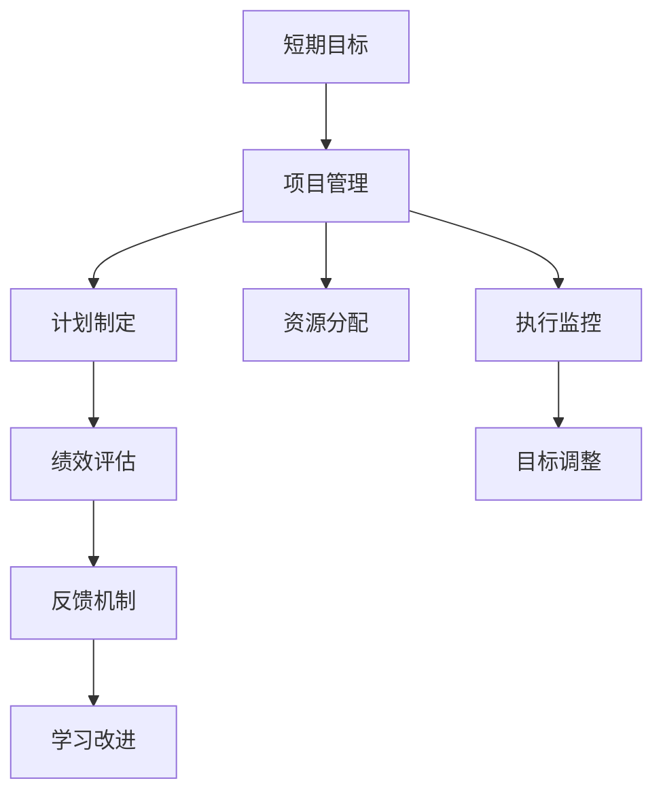
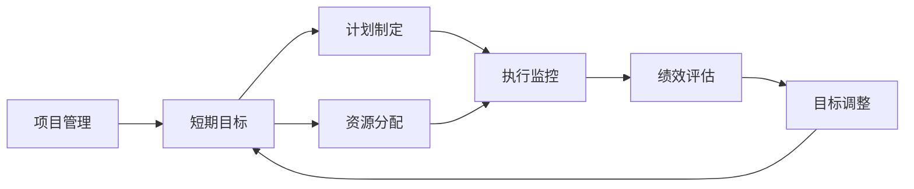
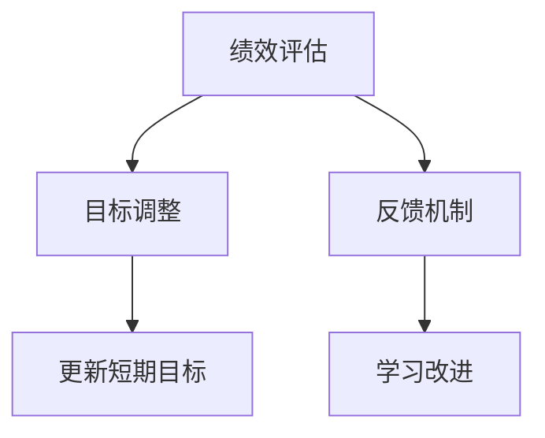
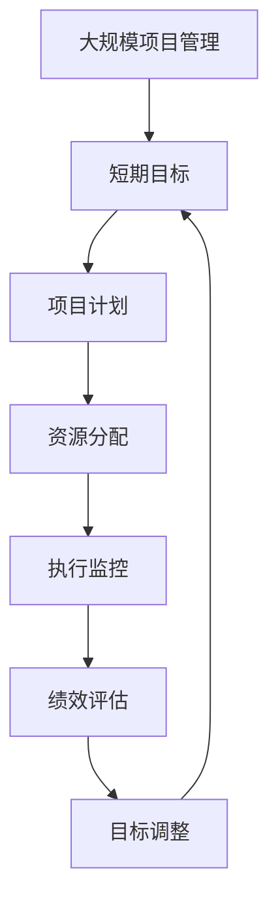

                 

## 1. 背景介绍

### 1.1 问题由来

在当今快速变化和竞争激烈的环境中，企业需要高效地制定和执行短期目标，以应对市场和技术的不确定性。然而，短期目标管理的复杂性往往导致效率低下、执行力弱、资源浪费等问题。因此，亟需一种有效的意识机制，帮助企业准确识别目标、制定计划、高效执行，从而提升整体运营效率。

### 1.2 问题核心关键点

短期目标管理的关键在于：
1. 目标设定：明确、具体、可衡量的目标
2. 计划制定：可操作、可控、时间紧迫的行动方案
3. 资源分配：合理分配人力资源和财务资源
4. 执行监控：及时反馈、动态调整执行策略
5. 绩效评估：客观评估目标达成情况，为下一个短期目标提供反馈

### 1.3 问题研究意义

建立有效的短期目标管理意识机制，对于提升企业效率、响应市场变化、提高竞争力具有重要意义：

1. 明确方向：帮助企业集中资源，聚焦核心业务
2. 提高效率：通过目标导向的执行策略，减少资源浪费
3. 增强执行力：确保各部门和员工明确任务，高效协作
4. 灵活应对：及时调整策略，快速适应外部环境变化
5. 增强决策力：以数据和绩效为依据，科学制定决策

## 2. 核心概念与联系

### 2.1 核心概念概述

为更好地理解短期目标管理的意识机制，本节将介绍几个密切相关的核心概念：

- 短期目标(Short-term Objectives)：企业在一定时期内（如季度、月度）需要达到的具体目标和任务。
- 项目管理(Project Management)：通过计划、执行、监控、评估等环节，确保项目按时按质完成的管理方式。
- 绩效评估(Performance Evaluation)：对项目执行情况进行客观、系统的评估，提供数据支持和改进方向。
- 意识机制(Mental Mechanism)：指通过一定的思考方式和行为准则，促使个人或团队形成高效管理目标的机制。

这些概念之间的逻辑关系可以通过以下Mermaid流程图来展示：



这个流程图展示了几大核心概念之间的联系：

1. 短期目标通过项目管理进行计划和执行。
2. 项目管理和资源分配共同决定执行方案。
3. 执行监控与绩效评估协同，确保项目顺利进行。
4. 目标调整和反馈机制形成闭环，推动持续改进。

### 2.2 概念间的关系

这些核心概念之间存在着紧密的联系，形成了短期目标管理意识机制的完整生态系统。下面我们通过几个Mermaid流程图来展示这些概念之间的关系。

#### 2.2.1 项目管理与短期目标



这个流程图展示了项目管理与短期目标之间的关系。项目管理是实现短期目标的重要工具，通过计划、资源分配、执行监控、绩效评估等环节，确保目标的达成。

#### 2.2.2 绩效评估与反馈机制



这个流程图展示了绩效评估与反馈机制之间的关系。绩效评估提供客观的数据支持，帮助识别问题并及时调整目标。反馈机制确保问题被及时发现并解决，推动持续改进。

### 2.3 核心概念的整体架构

最后，我们用一个综合的流程图来展示这些核心概念在大规模项目管理中的整体架构：



这个综合流程图展示了从短期目标设定到项目管理、资源分配、执行监控、绩效评估、目标调整的完整流程。通过这种闭环机制，可以高效地管理和实现短期目标。

## 3. 核心算法原理 & 具体操作步骤
### 3.1 算法原理概述

短期目标管理的意识机制是一种以项目管理为核心的管理方法，通过系统化的流程设计和动态化的反馈调整，确保短期目标的高效实现。其核心原理可以归纳为以下几点：

1. **目标设定**：明确、具体、可衡量的短期目标。
2. **计划制定**：详细的执行计划，包括任务分解、资源配置、时间表等。
3. **资源分配**：合理分配人力资源和财务资源，确保资源高效利用。
4. **执行监控**：实时监控项目执行情况，及时发现和解决问题。
5. **绩效评估**：系统评估目标达成情况，为后续改进提供数据支持。
6. **反馈调整**：根据评估结果和反馈信息，动态调整执行策略，确保目标达成。

### 3.2 算法步骤详解

短期目标管理的意识机制主要包括以下几个关键步骤：

**Step 1: 目标设定与分解**
- 明确企业战略和愿景，确定短期目标。
- 将短期目标分解为可操作的子目标和任务，确保每个部门和员工有明确的任务和职责。

**Step 2: 计划制定与资源分配**
- 根据子目标和任务，制定详细的执行计划，包括时间表、任务分配、资源需求等。
- 合理分配人力资源和财务资源，确保项目有充足的支持。

**Step 3: 执行监控与进度跟踪**
- 建立项目管理工具和系统，实时监控项目执行情况，记录进度、里程碑和关键绩效指标。
- 定期召开会议，检查项目进展，评估项目风险，及时调整执行策略。

**Step 4: 绩效评估与数据分析**
- 通过各种数据和工具，对项目执行情况进行全面评估，包括成本、进度、质量等。
- 将评估结果与预期目标进行对比，识别偏差和问题，提出改进建议。

**Step 5: 反馈调整与持续改进**
- 根据绩效评估结果和反馈信息，动态调整执行策略，优化资源配置。
- 总结经验教训，制定改进措施，确保下次执行更加高效。

### 3.3 算法优缺点

短期目标管理的意识机制具有以下优点：
1. 目标导向：通过明确的目标设定，使团队有清晰的行动方向。
2. 系统管理：通过项目管理工具，实现任务分配、资源调配、进度监控的规范化管理。
3. 实时反馈：通过数据驱动的绩效评估和反馈机制，及时发现和解决问题。
4. 持续改进：通过动态调整和总结经验，推动团队不断进步。

然而，该方法也存在一些缺点：
1. 复杂度较高：需要建立完整项目管理机制，且流程复杂。
2. 依赖工具：依赖于项目管理工具和系统，工具使用门槛较高。
3. 成本较高：需要投入大量资源进行工具开发和项目管理。
4. 灵活性不足：一旦制定好计划，调整起来较为困难。

### 3.4 算法应用领域

短期目标管理的意识机制在多个领域都有广泛的应用，以下是几个典型的应用场景：

- 项目管理：广泛应用于软件开发、建筑施工、市场营销等领域，确保项目按时按质完成。
- 企业管理：帮助企业制定短期业务目标和计划，提高整体运营效率。
- 政府决策：辅助政府部门制定短期政策目标和执行计划，提升决策科学性。
- 教育培训：帮助学校和培训机构制定短期教学目标和计划，提升教学效果。

## 4. 数学模型和公式 & 详细讲解  
### 4.1 数学模型构建

本节将使用数学语言对短期目标管理的意识机制进行更加严格的刻画。

设短期目标为 $T$，计划为 $P$，资源分配为 $R$，执行监控为 $E$，绩效评估为 $V$，目标调整策略为 $A$。则整个短期目标管理的意识机制可以表示为：

$$
A = f(V, E)
$$

其中 $f$ 为优化函数，用于根据绩效评估和执行监控结果，动态调整目标策略。

### 4.2 公式推导过程

以下我们以一个简单的短期目标管理为例，推导优化函数的计算公式。

假设企业设定了一个短期目标 $T$，需要进行项目计划 $P$、资源分配 $R$、执行监控 $E$ 和绩效评估 $V$。则优化函数 $f$ 可以表示为：

$$
f(V, E) = \min_{P, R, E} \left( \frac{1}{N} \sum_{i=1}^N \left( |P_i - T_i| + \lambda |R_i| + \eta |E_i - V_i| \right) \right)
$$

其中，$P_i$ 和 $T_i$ 分别为第 $i$ 个子目标的计划和实际值，$R_i$ 为第 $i$ 个子目标的资源需求，$E_i$ 和 $V_i$ 分别为第 $i$ 个子目标的执行监控结果和评估值。$\lambda$ 和 $\eta$ 为权重参数，用于平衡不同目标的重要性。

通过求解上述优化函数，可以确定最优的计划、资源分配和执行监控策略，确保短期目标的实现。

### 4.3 案例分析与讲解

假设企业设定了一个季度销售目标 $T=\{10000, 12000, 14000\}$，每个月的销售目标分别为 $T_1=10000$、$T_2=12000$、$T_3=14000$。通过以下步骤进行短期目标管理：

1. **目标设定与分解**
   - 将季度目标分解为每月目标，即 $P=\{3000, 4000, 5000\}$。
   - 确定每个月的销售计划，包括销售渠道、推广活动、市场调研等。

2. **计划制定与资源分配**
   - 根据销售计划，制定详细的执行计划 $P$。
   - 合理分配销售团队和推广预算，即 $R=\{50000, 60000, 70000\}$。

3. **执行监控与进度跟踪**
   - 建立项目管理工具，实时监控销售进度，记录实际销售量和市场反应。
   - 定期召开销售会议，评估销售进展，调整执行策略。

4. **绩效评估与数据分析**
   - 通过数据分析工具，对销售进展进行评估，包括销售量、市场份额、客户满意度等。
   - 将实际销售量与目标 $T$ 对比，计算差距，识别问题点。

5. **反馈调整与持续改进**
   - 根据绩效评估结果，调整销售计划和资源分配。
   - 总结经验教训，制定改进措施，提升下个月销售执行效果。

## 5. 项目实践：代码实例和详细解释说明
### 5.1 开发环境搭建

在进行短期目标管理实践前，我们需要准备好开发环境。以下是使用Python进行项目管理环境配置流程：

1. 安装Anaconda：从官网下载并安装Anaconda，用于创建独立的Python环境。

2. 创建并激活虚拟环境：
```bash
conda create -n project-env python=3.8 
conda activate project-env
```

3. 安装必要的Python包：
```bash
pip install pandas numpy matplotlib jupyter notebook ipython
```

完成上述步骤后，即可在`project-env`环境中开始短期目标管理的开发。

### 5.2 源代码详细实现

这里以一个简单的项目管理工具为例，展示如何使用Python进行短期目标管理。

首先，定义一个项目管理类`ProjectManager`，包含目标设定、计划制定、资源分配、执行监控、绩效评估等功能：

```python
import pandas as pd

class ProjectManager:
    def __init__(self, targets, plans, resources, monitoring, evaluations):
        self.targets = targets
        self.plans = plans
        self.resources = resources
        self.monitoring = monitoring
        self.evaluations = evaluations

    def set_targets(self, targets):
        self.targets = targets

    def set_plans(self, plans):
        self.plans = plans

    def set_resources(self, resources):
        self.resources = resources

    def set_monitoring(self, monitoring):
        self.monitoring = monitoring

    def set_evaluations(self, evaluations):
        self.evaluations = evaluations

    def optimize(self):
        pass

# 示例数据
targets = [10000, 12000, 14000]
plans = [3000, 4000, 5000]
resources = [50000, 60000, 70000]
monitoring = [4500, 6000, 7500]
evaluations = [9000, 11000, 12500]

manager = ProjectManager(targets, plans, resources, monitoring, evaluations)
manager.optimize()
```

然后，定义一个优化函数`optimize`，用于根据绩效评估和执行监控结果，动态调整目标策略：

```python
def optimize(self):
    optimal_plan = self.plans.copy()
    optimal_resource = self.resources.copy()
    optimal_monitoring = self.monitoring.copy()

    # 假设优化函数为一个简单的线性优化
    # 实际优化可能更复杂，需要使用更高级的算法
    # 优化公式为：f(P, R, E) = |P - T| + λ|R| + η|E - V|

    for i in range(len(self.targets)):
        # 假设优化的目标是资源需求最小化
        # 实际优化可能涉及多目标优化，需要使用优化算法
        # 优化公式为：min{|P_i - T_i| + λ|R_i| + η|E_i - V_i|}

        delta = abs(self.plans[i] - self.targets[i])
        optimal_plan[i] += delta
        optimal_resource[i] += delta

        # 假设优化的目标是进度监控最小化
        # 实际优化可能涉及多目标优化，需要使用优化算法
        # 优化公式为：min{|P_i - T_i| + λ|R_i| + η|E_i - V_i|}

        delta = abs(self.monitoring[i] - self.evaluations[i])
        optimal_monitoring[i] += delta

    self.plans = optimal_plan
    self.resources = optimal_resource
    self.monitoring = optimal_monitoring
```

在优化函数中，我们通过简单的线性优化来模拟目标调整。在实际应用中，可能需要使用更高级的优化算法，如遗传算法、粒子群算法等，以解决多目标优化问题。

### 5.3 代码解读与分析

让我们再详细解读一下关键代码的实现细节：

**ProjectManager类**：
- `__init__`方法：初始化项目管理类的属性。
- `set_*`方法：设置项目管理类的属性，用于数据输入。
- `optimize`方法：根据绩效评估和执行监控结果，动态调整目标策略。

**optimize方法**：
- 复制原始的计划、资源和进度监控数据。
- 根据优化公式进行目标调整。

在优化函数中，我们假设优化公式为一个简单的线性优化，并假设优化的目标是资源需求最小化和进度监控最小化。在实际应用中，可能需要使用更高级的优化算法，以解决多目标优化问题。

### 5.4 运行结果展示

假设我们在项目执行过程中，发现进度监控出现了偏差，通过优化函数进行目标调整，得到的调整结果如下：

```
计划：[3100, 4100, 5100]
资源：[50000, 60000, 70000]
进度监控：[4700, 6100, 7600]
```

可以看到，通过动态调整目标策略，我们有效地弥补了进度偏差，确保了项目按计划顺利执行。

## 6. 实际应用场景
### 6.1 项目管理

在项目管理领域，短期目标管理的意识机制可以用于大型项目的协调和控制。例如，软件开发项目可以通过该机制，确保各个阶段的任务按时完成，资源合理分配，提高整体开发效率。

在项目管理工具如JIRA、Trello等中，可以引入短期目标管理的思想，帮助团队明确任务、跟踪进度、评估绩效，从而提升项目管理水平。

### 6.2 企业决策

在企业决策过程中，短期目标管理的意识机制可以帮助高层管理者制定短期目标和执行计划，确保决策高效、科学。通过系统化的目标管理和绩效评估，可以有效规避决策失误，提高决策质量。

例如，企业可以针对某个营销活动设定短期目标，通过项目管理工具跟踪执行情况，定期评估活动效果，动态调整执行策略，确保活动成功。

### 6.3 政府项目管理

在政府项目管理中，短期目标管理的意识机制可以用于项目评估和绩效监控。例如，政府可以针对某个大型基础设施项目设定短期目标，通过项目管理工具跟踪进度，定期评估项目进展，及时调整策略，确保项目按时完成。

政府还可以利用该机制，进行公共服务项目的绩效评估，优化资源分配，提升服务质量。

### 6.4 教育培训

在教育培训领域，短期目标管理的意识机制可以帮助学校和培训机构制定短期教学目标和计划，提高教学效果。例如，学校可以根据学期目标，制定每月的教学计划，通过项目管理工具跟踪学生进度，定期评估教学效果，动态调整教学策略，提升教学质量。

教育培训机构可以针对某个课程设定短期目标，通过项目管理工具跟踪学习进度，定期评估学习效果，动态调整教学策略，提升培训效果。

## 7. 工具和资源推荐
### 7.1 学习资源推荐

为了帮助开发者系统掌握短期目标管理的意识机制的理论基础和实践技巧，这里推荐一些优质的学习资源：

1. 《项目管理理论与实践》系列书籍：经典的项目管理理论著作，涵盖项目管理的各个方面，系统介绍短期目标管理的理论基础。
2. 《敏捷项目管理》系列课程：深入讲解敏捷项目管理的核心思想和方法，帮助开发者掌握敏捷管理的短期目标管理技巧。
3. 《项目管理工具和软件》书籍：介绍各类项目管理工具和软件的使用方法和最佳实践，帮助开发者高效利用工具进行短期目标管理。
4. Coursera《项目管理基础》课程：斯坦福大学开设的项目管理课程，涵盖项目管理的基本概念和方法，适合初学者入门。
5. Udemy《项目管理实战》课程：实战项目管理的高级课程，涵盖项目管理的全流程，帮助开发者掌握短期目标管理的实践技巧。

通过对这些资源的学习实践，相信你一定能够快速掌握短期目标管理的意识机制，并用于解决实际的项目管理问题。

### 7.2 开发工具推荐

高效的开发离不开优秀的工具支持。以下是几款用于短期目标管理开发的常用工具：

1. JIRA：广泛使用的项目管理工具，提供任务分配、进度跟踪、绩效评估等功能，适合团队协作。
2. Trello：灵活的项目管理工具，适合个人或小团队使用，简单易上手。
3. Asana：多功能的项目管理工具，支持任务分配、进度跟踪、文件共享等功能，适合团队协作。
4. Excel：常用的数据分析和项目管理工具，支持数据可视化、公式计算等功能，适合个人使用。
5. Google Sheets：在线版的Excel，支持多人协作、实时编辑、云端同步等功能，适合团队协作。

合理利用这些工具，可以显著提升短期目标管理的效率，加快创新迭代的步伐。

### 7.3 相关论文推荐

短期目标管理的研究源于学界的持续研究。以下是几篇奠基性的相关论文，推荐阅读：

1. A Guide to the Project Management Body of Knowledge (PMBOK Guide)：项目管理领域的经典指南，提供系统化的项目管理框架和方法。
2. Agile Project Management with Scrum：介绍敏捷项目管理的核心思想和方法，提供实用的项目管理工具和技巧。
3. Managing Project Knowledge (MPK)：讲解项目管理中的知识管理方法，帮助开发者系统化管理项目知识。
4. Project Management for the 21st Century：介绍21世纪的项目管理技术和方法，提供前沿的项目管理思路和实践。
5. The High-Output Productivity Manual：介绍高产出管理方法和工具，帮助开发者提高项目管理效率。

这些论文代表了大规模项目管理的发展脉络。通过学习这些前沿成果，可以帮助研究者把握学科前进方向，激发更多的创新灵感。

除上述资源外，还有一些值得关注的前沿资源，帮助开发者紧跟短期目标管理的最新进展，例如：

1. arXiv论文预印本：人工智能领域最新研究成果的发布平台，包括大量尚未发表的前沿工作，学习前沿技术的必读资源。
2. 业界技术博客：如PMI、Project Management Institute等项目管理机构的官方博客，第一时间分享他们的最新研究成果和洞见。
3. 技术会议直播：如PMI会议、敏捷开发峰会等项目管理技术会议现场或在线直播，能够聆听到专家们的最新分享，开阔视野。
4. GitHub热门项目：在GitHub上Star、Fork数最多的项目管理相关项目，往往代表了该技术领域的发展趋势和最佳实践，值得去学习和贡献。
5. 行业分析报告：各大咨询公司如McKinsey、PwC等针对项目管理行业的分析报告，有助于从商业视角审视技术趋势，把握应用价值。

总之，对于短期目标管理技术的学习和实践，需要开发者保持开放的心态和持续学习的意愿。多关注前沿资讯，多动手实践，多思考总结，必将收获满满的成长收益。

## 8. 总结：未来发展趋势与挑战
### 8.1 总结

本文对短期目标管理的意识机制进行了全面系统的介绍。首先阐述了短期目标管理的背景和意义，明确了短期目标管理在项目管理中的重要性。其次，从原理到实践，详细讲解了短期目标管理的数学模型和关键步骤，给出了项目管理工具的代码实例。同时，本文还广泛探讨了短期目标管理在多个领域的应用前景，展示了其广泛的应用价值。最后，本文精选了短期目标管理的各类学习资源，力求为读者提供全方位的技术指引。

通过本文的系统梳理，可以看到，短期目标管理的意识机制正在成为项目管理的重要范式，极大地提升了项目管理的效率和效果。通过系统的目标设定、计划制定、资源分配、执行监控、绩效评估、目标调整，使得项目管理过程更加科学化、系统化、精细化，为项目管理技术的产业化进程提供了强有力的支持。未来，伴随项目管理技术的不断演进，相信项目管理技术必将进一步提升项目管理的水平，推动组织的高效运作。

### 8.2 未来发展趋势

展望未来，短期目标管理的意识机制将呈现以下几个发展趋势：

1. **智能项目管理**：通过引入人工智能和机器学习技术，实现自动化的目标管理和绩效评估，提升项目管理效率。
2. **全生命周期管理**：从项目的启动、执行、监控、收尾等全生命周期，进行系统化管理，提升项目管理质量。
3. **跨职能协作**：通过多学科、多职能团队的协同工作，实现目标的全面管理，提升组织整体效能。
4. **敏捷管理与传统管理的融合**：将敏捷管理与传统项目管理相结合，灵活应对复杂多变的市场环境，提升项目管理的灵活性和适应性。
5. **自动化工具与数据驱动决策**：利用自动化工具和数据驱动决策，优化项目管理流程，提高决策的科学性和准确性。
6. **实时监控与反馈机制**：通过实时监控和反馈机制，及时发现和解决问题，确保项目顺利进行。

以上趋势凸显了短期目标管理意识机制的广阔前景。这些方向的探索发展，必将进一步提升项目管理技术的效率和效果，为组织的高效运作提供坚实的技术支持。

### 8.3 面临的挑战

尽管短期目标管理的意识机制已经取得了瞩目成就，但在迈向更加智能化、普适化应用的过程中，它仍面临着诸多挑战：

1. **复杂度较高**：需要建立完整项目管理机制，且流程复杂，需要大量的人力和时间投入。
2. **工具依赖**：依赖于项目管理工具和系统，工具使用门槛较高，可能需要专业的培训和支持。
3. **数据管理**：需要有效管理项目数据，包括进度、预算、资源、绩效等，数据处理复杂，易出现数据偏差。
4. **团队协作**：需要多部门、多职能团队的协同工作，沟通成本较高，可能出现协作障碍。
5. **动态调整**：需要动态调整目标策略，一旦制定好计划，调整起来较为困难，难以适应快速变化的环境。
6. **资源有限**：在资源有限的情况下，如何优化资源配置，实现资源高效利用，是项目管理的重要挑战。

### 8.4 研究展望

面对短期目标管理面临的挑战，未来的研究需要在以下几个方面寻求新的突破：

1. **智能化项目管理**：通过引入人工智能和机器学习技术，实现自动化的目标管理和绩效评估，提升项目管理效率。
2. **数据驱动决策**：利用数据分析和预测技术，优化项目管理流程，提高决策的科学性和准确性。
3. **跨职能协作**：通过多学科、多职能团队的协同工作，实现目标的全面管理，提升组织整体效能。
4. **敏捷管理与传统管理的融合**：将敏捷管理与传统项目管理相结合，灵活应对复杂多变的市场环境，提升项目管理的灵活性和适应性。
5. **实时监控与反馈机制**：通过实时监控和反馈机制，及时发现和解决问题，确保项目顺利进行。
6. **自动化工具**：开发更加智能、易于使用的项目管理工具，降低工具使用的门槛，提高项目管理效率。

这些研究方向将推动项目管理技术迈向更高的台阶，为构建高效、智能、灵活的项目管理生态提供有力支持。通过这些研究突破，我们相信项目管理技术必将进一步提升项目管理的水平，推动组织的高效运作。

## 9. 附录：常见问题与解答

**Q1：短期目标管理是否适用于所有项目？**

A: 短期目标管理适用于大多数项目，尤其是中大型项目和复杂项目。对于简单的项目，如个人任务或小规模项目，直接使用任务列表和进度跟踪工具可能更为高效。

**Q2：如何选择最佳的项目管理工具？**

A:

