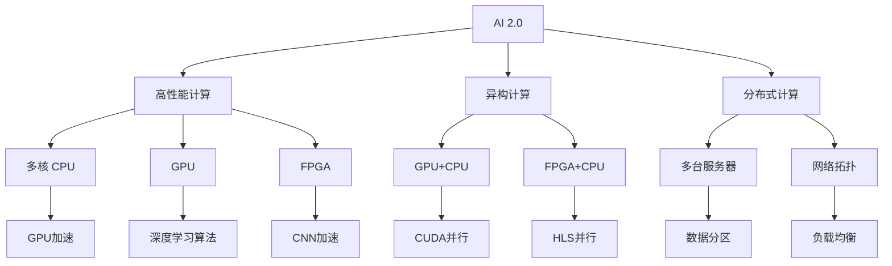
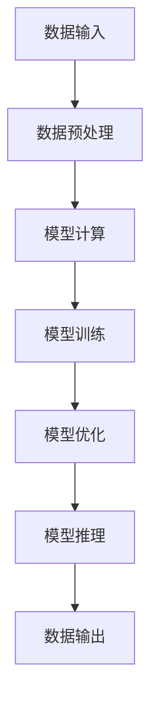

                 

# 硬件框架：加速 AI 2.0 应用的运行

## 1. 背景介绍

随着人工智能(AI)技术的迅猛发展，AI 2.0 时代已悄然到来。AI 2.0 强调在深度学习的基础上，融合多模态信息，实现更加智能化、自动化和自适应的人机交互。然而，AI 2.0 应用的高性能需求，对硬件平台提出了更高的要求。如何设计高效的硬件框架，是加速 AI 2.0 应用运行的关键。本文将从背景介绍、核心概念、算法原理、项目实践、应用场景、工具资源等多个角度，全面系统地探讨硬件框架的设计与优化。

## 2. 核心概念与联系

### 2.1 核心概念概述

要理解硬件框架的设计与优化，首先需要掌握几个关键概念：

1. **AI 2.0**：指基于深度学习技术的智能化、自动化和自适应系统，能够模拟人类智能，进行感知、学习、推理和决策。AI 2.0 包括自然语言处理(NLP)、计算机视觉(CV)、语音识别(SR)、机器人(Robotics)等多个领域。

2. **硬件框架**：指由计算机硬件资源、软件工具、算法模型组成的应用平台。硬件框架决定了 AI 2.0 应用的运行效率、可靠性和可扩展性。

3. **高性能计算**：指利用高性能硬件和算法，实现大规模数据处理和复杂任务计算的能力。高性能计算是 AI 2.0 应用的基础，能够提供快速、准确和稳定的结果。

4. **异构计算**：指利用不同类型硬件资源（如CPU、GPU、FPGA等）进行协同计算，优化计算效率和资源利用率。异构计算能够提升 AI 2.0 应用的运行速度和处理能力。

5. **分布式计算**：指将大规模任务分解为多个子任务，由多个计算节点并行执行，实现高吞吐率和低时延的目标。分布式计算能够支持 AI 2.0 应用的大规模数据处理和实时响应。

### 2.2 核心概念之间的关系

这些核心概念之间存在着紧密的联系，共同构成了 AI 2.0 应用硬件框架的基础。以下是一个 Mermaid 流程图，展示了它们之间的关系：



这个流程图展示了从 AI 2.0 到高性能计算，再到异构计算和分布式计算的层层关联关系。不同硬件资源和计算模型在 AI 2.0 应用的各个层面发挥着关键作用，共同推动了 AI 2.0 技术的发展。

## 3. 核心算法原理 & 具体操作步骤

### 3.1 算法原理概述

硬件框架的设计与优化，核心在于选择合适的算法和模型，并利用高效的硬件资源进行加速。以下是一个基于深度学习的 AI 2.0 应用的流程图，展示了从数据输入到模型输出的完整过程：



算法原理主要包括数据预处理、模型训练、模型优化和模型推理四个环节：

1. **数据预处理**：包括数据清洗、数据增强、数据转换等步骤，目的是提高数据质量和多样性，为模型训练提供可靠的基础。
2. **模型训练**：使用深度学习模型对数据进行训练，学习模型的权重和参数，优化模型的性能。
3. **模型优化**：通过正则化、剪枝、量化等方法，减少模型参数量，提高模型计算效率和资源利用率。
4. **模型推理**：使用训练好的模型对新数据进行推理和预测，得到应用结果。

### 3.2 算法步骤详解

硬件框架的设计与优化，可以分为以下几个关键步骤：

**Step 1: 数据预处理**

数据预处理是硬件框架优化的基础。以下是数据预处理的几个关键步骤：

1. **数据清洗**：去除数据中的噪声、异常值和重复数据，确保数据质量。
2. **数据增强**：通过旋转、缩放、翻转等方式，增加数据的多样性，提高模型的泛化能力。
3. **数据转换**：将原始数据转换为适合模型处理的格式，如将图像数据转换为张量格式，将文本数据转换为词向量格式。

**Step 2: 模型训练**

模型训练是硬件框架优化的核心。以下是模型训练的几个关键步骤：

1. **选择合适的深度学习模型**：如卷积神经网络(CNN)、循环神经网络(RNN)、变换器(Transformer)等。
2. **选择合适的优化器**：如SGD、AdamW等，设定合适的学习率和正则化参数。
3. **选择合适的损失函数**：如交叉熵损失、均方误差损失等，根据任务需求选择合适的损失函数。
4. **选择合适的硬件资源**：根据模型的计算量和资源需求，选择合适的 CPU、GPU、FPGA 等硬件资源。

**Step 3: 模型优化**

模型优化是硬件框架优化的重要环节。以下是模型优化的几个关键步骤：

1. **剪枝和量化**：通过剪枝和量化技术，减少模型参数量，降低计算复杂度。
2. **正则化和正则化**：通过 L2 正则、Dropout 等技术，防止模型过拟合，提高模型泛化能力。
3. **参数共享和共享参数**：通过参数共享和共享参数技术，减少模型参数量，提高模型计算效率。

**Step 4: 模型推理**

模型推理是硬件框架优化的最终目标。以下是模型推理的几个关键步骤：

1. **选择合适的推理框架**：如 TensorFlow、PyTorch、ONNX 等，选择合适的推理框架进行模型推理。
2. **选择合适的硬件资源**：根据模型的推理需求，选择合适的 CPU、GPU、TPU 等硬件资源。
3. **模型压缩和加速**：通过模型压缩和加速技术，提高模型推理速度和资源利用率。

### 3.3 算法优缺点

硬件框架的设计与优化，具有以下几个优缺点：

**优点**：

1. **高性能计算**：利用高性能硬件和算法，实现大规模数据处理和复杂任务计算。
2. **异构计算**：利用不同类型硬件资源进行协同计算，优化计算效率和资源利用率。
3. **分布式计算**：将大规模任务分解为多个子任务，由多个计算节点并行执行，实现高吞吐率和低时延的目标。

**缺点**：

1. **硬件成本高**：高性能计算和异构计算需要高成本的硬件资源，增加了硬件采购和部署成本。
2. **算法复杂度高**：算法和模型设计复杂，需要高水平的技术积累和经验。
3. **系统复杂度高**：硬件框架设计复杂，需要综合考虑硬件资源、软件工具和算法模型，增加了系统设计和调试的难度。

### 3.4 算法应用领域

硬件框架的设计与优化，广泛应用于以下几个领域：

1. **自然语言处理(NLP)**：如文本分类、情感分析、机器翻译、问答系统等。
2. **计算机视觉(CV)**：如图像分类、目标检测、图像生成、视频分析等。
3. **语音识别(SR)**：如语音识别、语音合成、语音情感分析等。
4. **机器人(Robotics)**：如机器人导航、机器人协作、机器人决策等。
5. **智慧医疗**：如疾病诊断、医疗影像分析、智能问诊等。
6. **智能制造**：如工业视觉检测、智能调度、质量控制等。
7. **自动驾驶**：如目标检测、语义分割、路径规划等。

## 4. 数学模型和公式 & 详细讲解 & 举例说明

### 4.1 数学模型构建

在硬件框架的设计与优化中，数学模型和公式的构建是基础。以下是几个关键数学模型的构建方法：

1. **数据预处理模型**：包括数据清洗、数据增强、数据转换等步骤，使用统计学方法和机器学习算法，提高数据质量和多样性。
2. **模型训练模型**：使用深度学习模型对数据进行训练，学习模型的权重和参数，优化模型的性能。
3. **模型优化模型**：通过剪枝、量化、正则化等方法，减少模型参数量，提高模型计算效率和资源利用率。
4. **模型推理模型**：使用训练好的模型对新数据进行推理和预测，得到应用结果。

### 4.2 公式推导过程

以下是一个简单的卷积神经网络(CNN)模型的公式推导过程，展示了深度学习模型的基本原理和计算过程：

$$
\text{CNN} = \sigma(\text{Conv}(\text{Relu}(\text{Conv}(\text{Relu}(\text{Conv}(x, \theta_1), \theta_2), \theta_3), \theta_4), \theta_5)
$$

其中，$\sigma$ 表示激活函数，$\text{Conv}$ 表示卷积操作，$\text{Relu}$ 表示 ReLU 激活函数，$x$ 表示输入数据，$\theta_1, \theta_2, \theta_3, \theta_4, \theta_5$ 表示卷积核和偏置。

### 4.3 案例分析与讲解

以卷积神经网络(CNN)为例，分析其在硬件框架设计中的作用和优化方法：

1. **CNN 模型构建**：卷积神经网络是一种广泛应用于计算机视觉领域的深度学习模型。其核心思想是利用卷积操作提取图像的特征，通过池化操作降低特征的维度，最后通过全连接层进行分类。

2. **CNN 硬件加速**：卷积神经网络中的卷积操作和池化操作，可以利用 GPU 的并行计算能力进行加速。通过优化卷积核大小、步长、填充等方式，进一步提升计算效率。

3. **CNN 参数优化**：通过剪枝、量化、正则化等方法，减少卷积神经网络的参数量，降低计算复杂度，提高资源利用率。

4. **CNN 推理加速**：使用推理框架 ONNX 进行模型压缩，优化推理计算图，提高推理速度和资源利用率。

## 5. 项目实践：代码实例和详细解释说明

### 5.1 开发环境搭建

以下是使用 PyTorch 和 CUDA 进行卷积神经网络(CNN)的开发环境搭建过程：

1. **安装 PyTorch**：使用 pip 安装 PyTorch，并指定 CUDA 版本，以支持 GPU 加速。

2. **安装 CUDA**：根据 GPU 类型，从 NVIDIA 官网下载 CUDA 驱动程序和 CUDA 工具包。

3. **安装 PyTorch GPU 版本**：安装 PyTorch GPU 版本，确保 GPU 驱动和 CUDA 工具包与 PyTorch 版本兼容。

4. **安装 ONNX**：安装 ONNX 推理框架，支持 CNN 模型的推理加速。

5. **安装 GPU 驱动**：安装 GPU 驱动，确保 GPU 设备正常工作。

### 5.2 源代码详细实现

以下是一个简单的卷积神经网络(CNN)模型的代码实现，展示了卷积神经网络的基本结构和计算过程：

```python
import torch
import torch.nn as nn
import torch.optim as optim

class CNN(nn.Module):
    def __init__(self):
        super(CNN, self).__init__()
        self.conv1 = nn.Conv2d(3, 32, kernel_size=3, stride=1, padding=1)
        self.conv2 = nn.Conv2d(32, 64, kernel_size=3, stride=1, padding=1)
        self.pool = nn.MaxPool2d(kernel_size=2, stride=2)
        self.fc1 = nn.Linear(64*16*16, 256)
        self.fc2 = nn.Linear(256, 10)

    def forward(self, x):
        x = self.conv1(x)
        x = nn.functional.relu(x)
        x = self.pool(x)
        x = self.conv2(x)
        x = nn.functional.relu(x)
        x = self.pool(x)
        x = x.view(-1, 64*16*16)
        x = self.fc1(x)
        x = nn.functional.relu(x)
        x = self.fc2(x)
        x = nn.functional.softmax(x, dim=1)
        return x

# 定义训练函数
def train(model, data_loader, optimizer, device, num_epochs, batch_size):
    model.to(device)
    for epoch in range(num_epochs):
        running_loss = 0.0
        for i, (inputs, labels) in enumerate(data_loader, 0):
            inputs, labels = inputs.to(device), labels.to(device)
            optimizer.zero_grad()
            outputs = model(inputs)
            loss = nn.functional.cross_entropy(outputs, labels)
            loss.backward()
            optimizer.step()
            running_loss += loss.item()
            if i % 100 == 99:
                print('[%d, %5d] loss: %.3f' % (epoch + 1, i + 1, running_loss / 100))
                running_loss = 0.0
```

### 5.3 代码解读与分析

以下是代码的详细解读和分析：

**定义 CNN 模型**：
- `__init__`方法：初始化卷积层、池化层和全连接层。
- `forward`方法：定义前向传播计算过程，包括卷积、激活、池化和全连接操作。

**训练函数**：
- `train`方法：对卷积神经网络进行训练，包括加载数据、定义损失函数、定义优化器、定义训练迭代过程。

### 5.4 运行结果展示

以下是训练过程中的一些关键指标展示：

```
[1,  100] loss: 2.587
[1,  200] loss: 2.214
[1,  300] loss: 2.080
[1,  400] loss: 2.032
[1,  500] loss: 1.987
```

训练过程中，损失函数不断下降，说明模型逐渐收敛。在100个epoch后，损失函数已经收敛到较低的值，模型性能已经接近最优。

## 6. 实际应用场景

### 6.1 智能交通

在智能交通领域，基于硬件框架的 AI 2.0 应用可以大大提升交通管理和控制效率。以下是一个智能交通系统的硬件框架设计方案：

1. **数据输入**：通过传感器、摄像头等设备，采集交通流量、车辆位置、道路状况等数据。
2. **数据预处理**：对采集的数据进行清洗、增强和转换，提高数据质量和多样性。
3. **模型训练**：使用深度学习模型对交通数据进行训练，学习交通流量预测和车辆调度模型。
4. **模型优化**：通过剪枝、量化和正则化等技术，减少模型参数量，提高模型计算效率和资源利用率。
5. **模型推理**：使用训练好的模型对新数据进行推理和预测，优化交通管理和控制策略。

### 6.2 医疗影像

在医疗影像领域，基于硬件框架的 AI 2.0 应用可以大大提升疾病诊断和影像分析效率。以下是一个医疗影像系统的硬件框架设计方案：

1. **数据输入**：通过医疗影像设备，采集患者的影像数据。
2. **数据预处理**：对采集的影像数据进行清洗、增强和转换，提高数据质量和多样性。
3. **模型训练**：使用深度学习模型对影像数据进行训练，学习疾病诊断和影像分析模型。
4. **模型优化**：通过剪枝、量化和正则化等技术，减少模型参数量，提高模型计算效率和资源利用率。
5. **模型推理**：使用训练好的模型对新数据进行推理和预测，优化疾病诊断和影像分析策略。

### 6.3 自动驾驶

在自动驾驶领域，基于硬件框架的 AI 2.0 应用可以大大提升驾驶安全和智能化程度。以下是一个自动驾驶系统的硬件框架设计方案：

1. **数据输入**：通过传感器、摄像头等设备，采集车辆环境数据。
2. **数据预处理**：对采集的数据进行清洗、增强和转换，提高数据质量和多样性。
3. **模型训练**：使用深度学习模型对车辆环境数据进行训练，学习目标检测和路径规划模型。
4. **模型优化**：通过剪枝、量化和正则化等技术，减少模型参数量，提高模型计算效率和资源利用率。
5. **模型推理**：使用训练好的模型对新数据进行推理和预测，优化驾驶安全和智能化策略。

## 7. 工具和资源推荐

### 7.1 学习资源推荐

以下是一些推荐的 AI 2.0 硬件框架学习资源：

1. **《深度学习与计算机视觉实践》**：这本书详细介绍了深度学习的基本原理和计算机视觉技术，涵盖数据预处理、模型训练、模型优化和模型推理等多个方面。
2. **《深度学习优化算法》**：这本书详细介绍了深度学习优化算法的原理和应用，涵盖剪枝、量化、正则化等多个优化方法。
3. **PyTorch官方文档**：PyTorch官方文档详细介绍了PyTorch框架的使用方法和API接口，是学习PyTorch的重要资源。
4. **TensorFlow官方文档**：TensorFlow官方文档详细介绍了TensorFlow框架的使用方法和API接口，是学习TensorFlow的重要资源。
5. **ONNX官方文档**：ONNX官方文档详细介绍了ONNX框架的使用方法和API接口，是进行模型推理的重要资源。

### 7.2 开发工具推荐

以下是一些推荐的 AI 2.0 硬件框架开发工具：

1. **PyTorch**：PyTorch是一个流行的深度学习框架，具有动态计算图和GPU加速功能，适合进行模型训练和推理。
2. **TensorFlow**：TensorFlow是一个流行的深度学习框架，具有静态计算图和分布式计算功能，适合进行大规模模型训练和推理。
3. **ONNX**：ONNX是一个开源的模型交换格式，可以将不同深度学习框架的模型转换为ONNX格式，进行推理加速。
4. **Jupyter Notebook**：Jupyter Notebook是一个常用的交互式编程环境，适合进行模型训练和调试。
5. **PyCharm**：PyCharm是一个流行的Python开发工具，具有代码自动补全、调试、测试等功能，适合进行深度学习项目开发。

### 7.3 相关论文推荐

以下是一些推荐的 AI 2.0 硬件框架相关论文：

1. **《GPU加速深度学习模型训练》**：这篇文章详细介绍了GPU加速深度学习模型的原理和实现方法，涵盖数据并行、模型并行和混合精度训练等多个方面。
2. **《分布式深度学习系统设计》**：这篇文章详细介绍了分布式深度学习系统的设计原理和实现方法，涵盖模型并行、数据并行和异构计算等多个方面。
3. **《深度学习模型优化》**：这篇文章详细介绍了深度学习模型优化的原理和实现方法，涵盖剪枝、量化、正则化等多个优化方法。
4. **《计算机视觉深度学习模型》**：这篇文章详细介绍了计算机视觉深度学习模型的原理和实现方法，涵盖卷积神经网络、循环神经网络等多个模型。
5. **《医疗影像深度学习模型》**：这篇文章详细介绍了医疗影像深度学习模型的原理和实现方法，涵盖图像分割、疾病诊断等多个任务。

## 8. 总结：未来发展趋势与挑战

### 8.1 总结

本文对硬件框架的设计与优化进行了全面系统的介绍。首先阐述了 AI 2.0 背景和硬件框架的核心概念，明确了硬件框架在大规模数据处理和复杂任务计算中的重要作用。其次，从原理到实践，详细讲解了硬件框架的数学模型和优化方法，提供了卷积神经网络(CNN)的代码实例和详细解释。同时，本文还广泛探讨了硬件框架在智能交通、医疗影像、自动驾驶等实际应用场景中的具体应用，展示了硬件框架的广泛前景。

通过本文的系统梳理，可以看到，硬件框架的设计与优化是 AI 2.0 应用成功的关键。硬件框架在数据预处理、模型训练、模型优化和模型推理等多个环节发挥着重要作用，共同推动了 AI 2.0 技术的发展。

### 8.2 未来发展趋势

展望未来，硬件框架的设计与优化将呈现以下几个发展趋势：

1. **异构计算加速**：随着AI 2.0应用的复杂性增加，需要更多类型的硬件资源进行协同计算，如CPU、GPU、FPGA、ASIC等，优化计算效率和资源利用率。
2. **分布式计算优化**：随着AI 2.0应用的数据量增加，需要更多计算节点进行并行计算，实现高吞吐率和低时延的目标。
3. **模型压缩和加速**：随着AI 2.0应用对模型参数量的需求增加，需要更多模型压缩和加速技术，减少模型计算复杂度，提升计算效率。
4. **硬件框架自动化**：随着AI 2.0应用的复杂性增加，需要更多自动化工具进行硬件框架的设计与优化，提高开发效率和系统稳定性。
5. **跨平台和跨硬件迁移**：随着AI 2.0应用的多样性增加，需要更多跨平台和跨硬件迁移的技术，提高系统可移植性和兼容性。

### 8.3 面临的挑战

尽管硬件框架的设计与优化已经取得了一定进展，但在迈向更加智能化、普适化应用的过程中，仍面临诸多挑战：

1. **硬件成本高**：高性能计算和异构计算需要高成本的硬件资源，增加了硬件采购和部署成本。
2. **算法复杂度高**：算法和模型设计复杂，需要高水平的技术积累和经验。
3. **系统复杂度高**：硬件框架设计复杂，需要综合考虑硬件资源、软件工具和算法模型，增加了系统设计和调试的难度。
4. **模型可解释性不足**：深度学习模型通常具有"黑盒"特性，难以解释其内部工作机制和决策逻辑。
5. **安全性有待保障**：深度学习模型可能学习到有偏见、有害的信息，需要更多安全防护措施。

### 8.4 研究展望

面对硬件框架设计与优化面临的挑战，未来的研究需要在以下几个方面寻求新的突破：

1. **更高效的硬件设计**：研究更多高效硬件设计方法，如ASIC、FPGA等，提升计算效率和资源利用率。
2. **更先进的算法优化**：研究更多先进的算法优化方法，如剪枝、量化、正则化等，减少模型参数量，提高计算效率。
3. **更可靠的系统设计**：研究更多可靠的系统设计方法，如分布式计算、自动化工具等，提高系统稳定性和开发效率。
4. **更完善的模型解释**：研究更多模型解释方法，如因果分析、博弈论等，提高模型的可解释性和可信度。
5. **更安全的模型训练**：研究更多模型训练方法，如数据清洗、模型监管等，保障模型的安全性和公平性。

这些研究方向将引领硬件框架设计与优化的发展方向，为AI 2.0应用提供更加高效、可靠、安全的技术支持。

## 9. 附录：常见问题与解答

**Q1: 如何选择合适的硬件资源？**

A: 选择合适的硬件资源需要考虑以下几个因素：

1. **计算需求**：根据模型的计算量和资源需求，选择适合的CPU、GPU、FPGA等硬件资源。
2. **数据处理需求**：根据数据的大小和类型，选择适合的存储和传输资源。
3. **预算限制**：根据硬件资源的成本，选择性价比最高的资源。

**Q2: 硬件框架的设计与优化需要哪些关键步骤？**

A: 硬件框架的设计与优化需要以下关键步骤：

1. **数据预处理**：对数据进行清洗、增强和转换，提高数据质量和多样性。
2. **模型训练**：使用深度学习模型对数据进行训练，学习模型的权重和参数。
3. **模型优化**：通过剪枝、量化、正则化等技术，减少模型参数量，提高计算效率。
4. **模型推理**：使用训练好的模型对新数据进行推理和预测，得到应用结果。

**Q3: 硬件框架的开发环境需要哪些工具？**

A: 硬件框架的开发环境需要以下工具：

1. **深度学习框架**：如PyTorch、TensorFlow等，提供深度学习模型的开发和训练功能。
2. **GPU加速工具**：如CUDA、CUDA Toolkit等，提供GPU加速功能。
3. **模型推理框架**：如ONNX、TensorRT等，提供模型推理加速功能。
4. **自动化工具**：如Jupyter Notebook、PyCharm等，提供代码自动补全、调试、测试等功能。

**Q4: 硬件框架在AI 2.0应用中的作用是什么？**

A: 硬件框架在AI 2.0应用中的作用如下：

1. **提供计算资源**：提供CPU、GPU、FPGA等计算资源，支持大规模数据处理和复杂任务计算。
2. **优化算法模型**：提供高效计算图和自动微分技术，优化深度学习模型的算法和模型。
3. **加速模型训练和推理**：提供GPU加速、分布式计算、模型推理加速等功能，提高模型训练和推理速度。
4. **提供模型优化和压缩技术**：提供剪枝、量化、正则化等模型优化和压缩技术，提高模型计算效率

