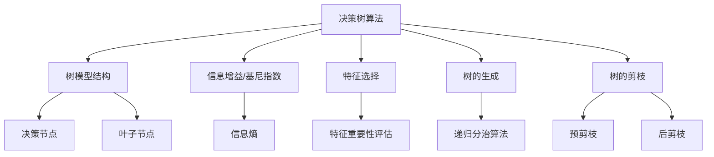

# 决策树(Decision Trees) - 原理与代码实例讲解

## 1. 背景介绍

### 1.1 问题的由来

在现实世界中,我们经常需要根据某些已知条件做出决策或预测。例如,一家银行在审批贷款申请时,需要根据申请人的收入、信用记录、就业情况等因素来预测其是否有能力偿还贷款。一个医疗诊断系统则需要根据病人的症状、体征和化验结果来判断其患有何种疾病。这类问题被称为分类(classification)问题,是机器学习和数据挖掘领域的核心任务之一。

分类问题可以用监督学习的方法来解决。监督学习是指利用已知类别的训练数据,学习出一个分类模型,然后将该模型应用于新的未知数据,对其进行分类或预测。常见的监督学习算法包括逻辑回归、支持向量机、神经网络等。其中,决策树是一种简单而有效的监督学习算法,被广泛应用于各个领域的分类问题。

### 1.2 研究现状

决策树模型最早可以追溯到20世纪60年代,当时主要用于决策分析。20世纪后期,随着机器学习和数据挖掘的兴起,决策树开始被广泛应用于分类和回归任务。经典的决策树算法包括ID3、C4.5和CART等。近年来,随着计算能力的提高和大数据时代的到来,决策树及其集成算法(如随机森林、梯度提升树等)在工业界和学术界都得到了广泛关注和应用。

### 1.3 研究意义

决策树具有可解释性强、可视化直观、无需数据预处理、能够处理数值型和类别型数据等优点,因此在许多领域都有重要应用,如:

- 金融风险评估:用于评估贷款申请人的违约风险
- 医疗诊断:根据症状判断疾病类型
- 网络入侵检测:判断网络流量是否为攻击行为
- 营销策略:预测客户对某项产品或服务的购买倾向
- 自然语言处理:文本分类、情感分析等

此外,决策树还可以作为解释更复杂的黑盒模型(如深度神经网络)的工具,帮助理解模型的内在决策机制。

### 1.4 本文结构

本文将全面介绍决策树算法的原理、实现细节和应用实践。具体内容安排如下:

1. 背景介绍:阐述问题由来、研究现状和意义
2. 核心概念与联系:介绍决策树的基本概念及其与其他算法的关系
3. 核心算法原理与具体操作步骤:深入解析决策树算法的原理和实现细节
4. 数学模型和公式详细讲解与举例说明:推导决策树相关公式,并结合实例进行讲解
5. 项目实践:代码实例和详细解释说明:提供决策树的Python代码实现及解读
6. 实际应用场景:列举决策树在不同领域的应用案例
7. 工具和资源推荐:介绍相关学习资源、开发工具和论文
8. 总结:未来发展趋势与挑战:对决策树算法的发展前景和面临的挑战进行总结和展望
9. 附录:常见问题与解答:列出一些常见的问题并给出解答

## 2. 核心概念与联系

上图展示了决策树算法的一些核心概念及其相互关系:

- **决策树算法**本质上是一种基于树形结构的监督学习算法,用于分类或回归任务。
- **树模型结构**包括决策节点(内部节点)和叶子节点(终止节点)。每个决策节点对应一个特征,叶子节点对应一个类别标签。
- **信息增益/基尼指数**是构建决策树时选择最优特征的准则,用于评估特征对数据集的分类能力。
- **特征选择**是决策树算法的关键步骤,根据某种准则选择最优特征作为决策节点。
- **树的生成**通常采用递归分治的自顶向下方式,不断地在决策节点处划分数据集,生成子节点。
- **树的剪枝**是防止过拟合的重要手段,包括预剪枝(提前停止生长)和后剪枝(先生成整棵树,再裁剪)。

此外,决策树算法与其他一些机器学习概念也有联系:

- **信息熵**是度量数据集无序程度的一种指标,是计算信息增益的基础。
- **特征重要性评估**对于决策树以外的其他模型也是一个重要的步骤。
- **递归分治算法**是一种常见的算法范式,也被应用于其他树形结构算法中。

## 3. 核心算法原理与具体操作步骤

### 3.1 算法原理概述

决策树算法的核心思想是将数据集根据最优特征划分为较小的子集,并在子集上递归地重复相同的划分过程,直到满足某个停止条件。最终形成一棵树形结构模型,每个叶子节点对应一个分类标签。

算法的关键步骤包括:

1. 特征选择:基于某种准则(如信息增益或基尼指数)选择最优特征作为当前节点。
2. 数据集划分:根据选定的特征将数据集划分为若干子集。
3. 生成子节点:对每个子集递归调用算法,生成子节点。
4. 决策树生长控制:设置合理的停止条件以防止过拟合。

最终得到的决策树模型可以用于新数据的分类预测。给定一个新样本,从树根开始,根据样本的特征值在每个内部节点处做出决策,最终到达某个叶子节点,将该节点的类别标签作为预测结果。

### 3.2 算法步骤详解

以下是决策树算法的详细步骤:

1. **收集数据**:获取训练数据集
2. **准备数据**:对数据进行预处理,如处理缺失值、标准化等
3. **计算最优特征**:对每个特征计算某种指标(如信息增益或基尼指数),选择指标最优的特征作为当前节点
4. **划分数据集**:根据选定的最优特征,将数据集划分为若干子集
5. **生成子节点**:对每个子集递归调用算法,生成子节点
6. **决策树生长控制**:判断是否满足停止条件,如果满足则将当前节点标记为叶子节点,否则回到第3步
7. **类别标签赋值**:对叶子节点进行类别标签赋值
8. **模型构建完成**:生成完整的决策树模型

### 3.3 算法优缺点

**优点:**

- 可解释性强:决策树的决策过程直观可解释
- 无需数据预处理:能自动处理数值型和类别型数据
- 计算高效:构建决策树的时间复杂度较低
- 可视化友好:树形结构易于可视化展示
- 处理非线性数据:不受数据集线性可分性的限制

**缺点:**

- 容易过拟合:对训练数据有很强的描述能力,但泛化性能可能不佳
- 对数据扰动敏感:数据集微小变化可能导致决策树结构发生较大改变
- 存在分类偏差:对于不平衡数据集,决策树可能过度偏向大类
- 难以解释复杂树:当决策树过于复杂时,可解释性会降低

### 3.4 算法应用领域

决策树算法由于其优点和特性,在诸多领域得到了广泛应用,包括但不限于:

- **金融风险评估**:评估贷款申请人的违约风险
- **医疗诊断**:根据症状和体征判断疾病类型
- **网络入侵检测**:识别网络流量中的攻击行为
- **营销策略**:预测客户对产品或服务的购买倾向
- **自然语言处理**:文本分类、情感分析等任务
- **图像识别**:基于决策树对图像进行分类
- **制造业**:检测产品缺陷,优化生产流程
- **天文学**:星系分类、行星发现等
- **基因组学**:基因表达分析、蛋白质功能预测等

## 4. 数学模型和公式详细讲解与举例说明

### 4.1 数学模型构建

在构建决策树模型时,我们需要一种指标来评估每个特征对数据集的分类能力,从而选择最优特征作为决策节点。常用的指标包括**信息增益**和**基尼指数**。

#### 4.1.1 信息增益

信息增益的计算基于**信息熵**的概念。信息熵$H(X)$用于度量随机变量$X$的不确定性,定义为:

$$H(X) = -\sum_{i=1}^n p(x_i)\log_2 p(x_i)$$

其中,$p(x_i)$表示随机变量$X$取值为$x_i$的概率。

对于一个数据集$D$,其信息熵$H(D)$可以理解为对其分类的不确定性:

$$H(D) = -\sum_{k=1}^{|y|}\frac{|C_k|}{|D|}\log_2\frac{|C_k|}{|D|}$$

其中,$|y|$表示类别数量,$C_k$表示属于第$k$类的数据集,$|C_k|$和$|D|$分别表示$C_k$和$D$的数据量。

现在考虑根据特征$A$对数据集$D$进行划分,得到子集$\{D_1, D_2, \cdots, D_v\}$,其中$v$为特征$A$的取值个数。于是给定特征$A$的条件下,数据集$D$的信息熵为:

$$H(D|A) = \sum_{j=1}^v\frac{|D_j|}{|D|}H(D_j)$$

则以$A$为特征划分数据集所获得的**信息增益**为:

$$\text{Gain}(A) = H(D) - H(D|A)$$

我们选择信息增益最大的特征作为当前节点的最优特征。

#### 4.1.2 基尼指数

另一种常用的指标是**基尼指数**,定义为:

$$\text{Gini}(D) = 1 - \sum_{k=1}^{|y|}\left(\frac{|C_k|}{|D|}\right)^2$$

基尼指数反映了数据集的"纯度",取值范围为$[0,1]$。当基尼指数为0时,表示数据集中所有实例都属于同一类别;当基尼指数为1时,表示每个实例都属于不同类别。

类似于信息增益,我们可以计算给定特征$A$的条件下,数据集$D$的基尼指数:

$$\text{Gini}(D,A) = \sum_{j=1}^v\frac{|D_j|}{|D|}\text{Gini}(D_j)$$

则以$A$为特征划分数据集所获得的**基尼指数减少量**为:

$$\Delta\text{Gini}(A) = \text{Gini}(D) - \text{Gini}(D,A)$$

我们选择基尼指数减少量最大的特征作为当前节点的最优特征。

### 4.2 公式推导过程

以下是信息增益公式的推导过程:

1) 定义数据集$D$的信息熵:

$$H(D) = -\sum_{k=1}^{|y|}\frac{|C_k|}{|D|}\log_2\frac{|C_k|}{|D|}$$

2) 假设以特征$A$对数据集$D$进行划分,得到子集$\{D_1, D_2, \cdots, D_v\}$,其中$v$为特征$A$的取值个数。

3) 在给定特征$A$的条件下,数据集$D$的信息熵为:

$$\begin{aligned}
H(D|A) &= -\sum_{j=1}^v\sum_{k=1