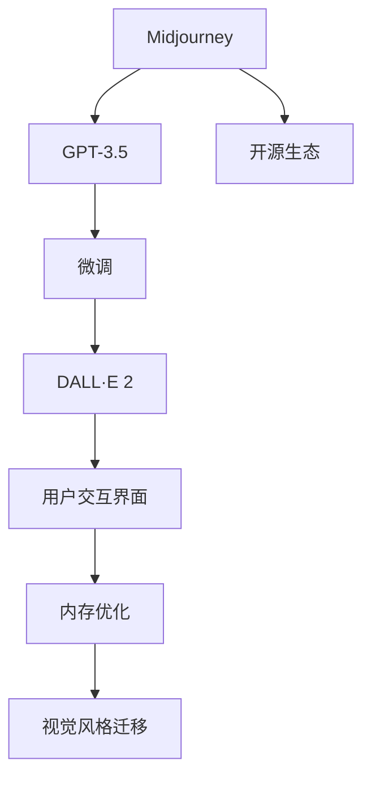
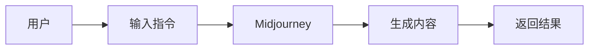
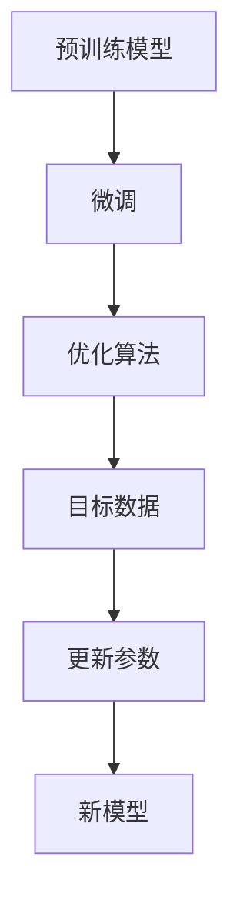
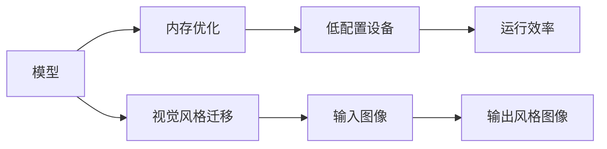
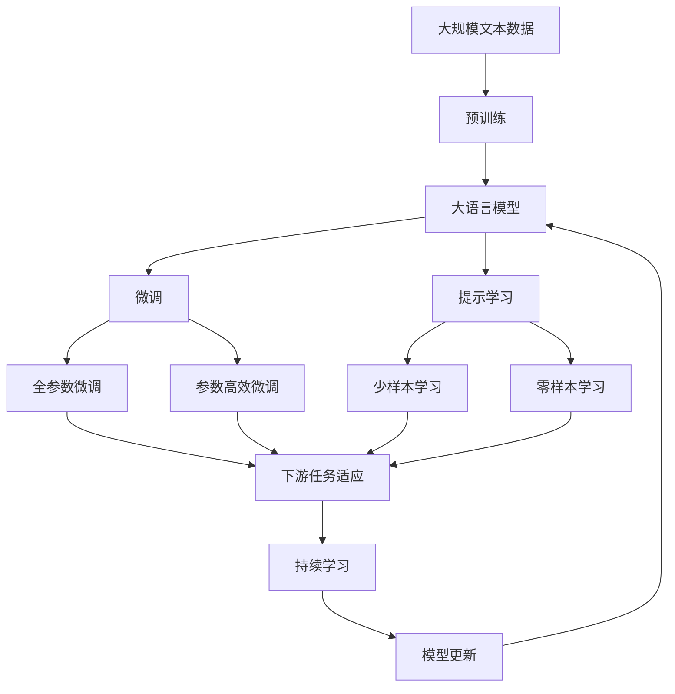

                 

# AIGC从入门到实战：启动：AIGC 工具中的明星产品 Midjourney

## 1. 背景介绍

### 1.1 问题由来

随着人工智能技术的发展，AIGC（人工智能生成内容）成为了行业的新焦点。AIGC技术可以生成高质量的图像、文本、音频等内容，大大降低了内容创作的成本和时间，吸引了大量企业和个人用户。在这些AIGC工具中，Midjourney无疑是明星产品之一。

Midjourney基于开源模型DALL·E 2，通过优化算法和用户体验，成功将大模型的应用门槛降低到了极致。本文将深入探讨Midjourney的原理和应用，并从技术、商业和用户角度进行全面分析，帮助读者掌握Midjourney的使用方法，启迪创新灵感。

### 1.2 问题核心关键点

Midjourney的核心技术主要包括以下几点：
1. **基于GPT-3.5的微调**：Midjourney将GPT-3.5模型微调成内容生成器，能够生成高质量的图像描述。
2. **用户交互界面**：提供简单易用的交互界面，支持输入各种指令和关键词，帮助用户快速生成所需内容。
3. **内存优化**：采用内存优化技术，提升模型在低配置设备上的运行效率。
4. **视觉风格迁移**：支持风格迁移功能，用户可以指定特定的艺术家、风格或场景，生成具有独特风格的图片。
5. **开放生态**：开源模型和算法，鼓励社区贡献，不断提升生成质量。

Midjourney的成功在于其优化的用户交互和算法设计，使得复杂模型的应用变得简单高效。本文将从技术原理、操作步骤、应用领域等角度，全面解析Midjourney的设计思想和实现细节。

### 1.3 问题研究意义

深入理解Midjourney的原理和实现，对于开发者、内容创作者和企业来说，都有重要的实际意义：

1. **开发者**：掌握Midjourney的实现方法，可以指导自己在实际项目中应用类似的模型和算法。
2. **内容创作者**：了解Midjourney的强大生成能力，可以更高效地创作高质量的图像、文本、视频等内容。
3. **企业**：利用Midjourney降低内容创作成本，提高营销、广告、设计等环节的效率和效果。

## 2. 核心概念与联系

### 2.1 核心概念概述

为了更好地理解Midjourney的工作原理，本节将介绍几个关键概念：

1. **AIGC（人工智能生成内容）**：利用人工智能技术自动生成高质量的图像、文本、音频等内容，涵盖自然语言处理、计算机视觉等多个领域。
2. **GPT-3.5**：OpenAI开发的语言模型，基于Transformer架构，支持自然语言理解和生成。
3. **DALL·E 2**：OpenAI开发的图像生成模型，基于自回归模型和自编码器，能够生成具有高度细节和逼真度的图像。
4. **微调(Fine-tuning)**：在预训练模型基础上，通过有监督学习优化模型参数，使其适应特定任务。
5. **内存优化**：通过算法优化和资源管理，提升模型在低配置设备上的运行效率。
6. **视觉风格迁移**：通过修改输入图像的风格，生成具有特定风格特征的图片。

这些核心概念之间的联系，可以通过以下Mermaid流程图来展示：



这个流程图展示了Midjourney的核心组件和工作流程：

1. Midjourney将GPT-3.5模型微调成内容生成器。
2. 微调的DALL·E 2生成高质量的图像描述。
3. 用户通过交互界面输入指令，生成所需内容。
4. 内存优化提升模型在低配置设备上的运行效率。
5. 视觉风格迁移实现多样化的风格生成。
6. Midjourney的模型和算法开源，鼓励社区贡献。

### 2.2 概念间的关系

这些核心概念之间存在着紧密的联系，构成了Midjourney的整体架构。下面通过几个Mermaid流程图来展示它们之间的关系。

#### 2.2.1 用户交互与内容生成



这个流程图展示了用户与Midjourney的交互流程：

1. 用户通过交互界面输入指令。
2. Midjourney生成所需内容。
3. Midjourney返回生成结果给用户。

#### 2.2.2 微调过程



这个流程图展示了微调的过程：

1. 预训练模型作为初始化参数。
2. 通过优化算法和目标数据进行微调。
3. 更新模型参数。
4. 生成新的优化模型。

#### 2.2.3 内存优化与视觉风格迁移



这个流程图展示了内存优化和视觉风格迁移的过程：

1. 模型进行内存优化，提升低配置设备的运行效率。
2. 输入图像进行视觉风格迁移，生成具有特定风格特征的图像。

### 2.3 核心概念的整体架构

最后，我们用一个综合的流程图来展示这些核心概念在大语言模型微调过程中的整体架构：



这个综合流程图展示了从预训练到微调，再到持续学习的完整过程。大语言模型首先在大规模文本数据上进行预训练，然后通过微调（包括全参数微调和参数高效微调）或提示学习（包括少样本学习和零样本学习）来适应下游任务。最后，通过持续学习技术，模型可以不断更新和适应新的任务和数据。 通过这些流程图，我们可以更清晰地理解Midjourney的工作原理和优化方向。

## 3. 核心算法原理 & 具体操作步骤
### 3.1 算法原理概述

Midjourney的核心算法原理基于深度学习模型和优化算法。其主要包括以下几个关键步骤：

1. **模型初始化**：使用GPT-3.5作为初始化参数。
2. **微调**：在少量标注数据上，通过优化算法调整模型参数，使其生成高质量的图像描述。
3. **用户交互**：提供简单易用的交互界面，支持输入各种指令和关键词，生成所需内容。
4. **内存优化**：采用内存优化技术，提升模型在低配置设备上的运行效率。
5. **风格迁移**：实现视觉风格迁移功能，生成具有特定风格特征的图片。

Midjourney的算法核心在于GPT-3.5的微调和优化，通过优化算法在少量数据上训练出高质量的图像描述生成器。此外，通过内存优化和视觉风格迁移，使得Midjourney能够在大规模用户群体中高效运行。

### 3.2 算法步骤详解

#### 3.2.1 模型初始化

Midjourney使用GPT-3.5作为初始化参数。GPT-3.5是一种基于Transformer的大语言模型，具有强大的自然语言理解和生成能力。

#### 3.2.2 微调过程

1. **数据准备**：准备少量标注数据，用于微调。这些数据可以包括图像标题、描述、标签等。
2. **模型加载**：加载预训练的GPT-3.5模型，作为微调的初始模型。
3. **微调训练**：使用优化算法（如AdamW）在标注数据上微调模型，更新模型参数。
4. **模型保存**：保存微调后的模型，以便后续使用。

#### 3.2.3 用户交互

Midjourney提供简单易用的交互界面，用户可以通过输入指令和关键词，生成所需内容。例如：

- **文本输入**：用户可以输入图像描述或文字说明，要求生成相应的图像。
- **关键词提示**：用户可以输入关键词或标签，要求生成具有特定特征的图像。
- **交互调试**：用户可以调试生成的图像，通过微调进一步优化。

#### 3.2.4 内存优化

Midjourney采用内存优化技术，提升模型在低配置设备上的运行效率。主要优化措施包括：

1. **梯度累积**：将多个小批次的数据累积为一个大批次进行训练，减少内存消耗。
2. **混合精度训练**：使用16位浮点数进行计算，减少内存占用和计算时间。
3. **模型并行**：将模型分成多个子模型并行训练，提升训练效率。

#### 3.2.5 风格迁移

Midjourney支持视觉风格迁移功能，用户可以指定特定的艺术家、风格或场景，生成具有独特风格特征的图片。主要技术手段包括：

1. **自编码器**：使用自编码器将输入图像编码成低维特征，再通过风格迁移算法生成具有特定风格的新图像。
2. **风格变换网络**：利用风格变换网络，将低维特征映射到风格化的高维空间，生成具有特定风格的新图像。
3. **风格化损失**：通过设计风格化损失函数，优化生成图像的风格特征。

### 3.3 算法优缺点

Midjourney的优点在于其优化的用户交互和算法设计，使得复杂模型的应用变得简单高效。具体包括：

1. **用户体验友好**：通过简单易用的交互界面，用户可以快速生成所需内容。
2. **生成质量高**：基于GPT-3.5的微调，生成高质量的图像描述和风格图像。
3. **运行效率高**：通过内存优化技术，模型在低配置设备上也能高效运行。
4. **社区支持**：开源模型和算法，鼓励社区贡献，不断提升生成质量。

Midjourney的缺点在于其对数据和硬件资源的要求较高，难以在极端低配置设备上高效运行。此外，风格迁移功能需要大量的训练数据和计算资源，对模型泛化能力有一定影响。

### 3.4 算法应用领域

Midjourney在多个领域得到了广泛应用，主要包括以下几个方向：

1. **创意设计**：帮助设计师生成设计草图、创意概念等，提升设计效率。
2. **内容创作**：支持生成高质量的图像、视频、音乐等内容，降低创作成本。
3. **广告营销**：提供具有创意的图像和视频素材，提升广告效果。
4. **教育培训**：用于教学演示、课件生成等，丰富教学资源。
5. **娱乐应用**：支持生成电影、动画、游戏等场景中的图像和视频素材，提升用户体验。

## 4. 数学模型和公式 & 详细讲解 & 举例说明

### 4.1 数学模型构建

Midjourney的数学模型主要基于深度学习模型和优化算法。下面以图像描述生成为例，详细介绍其数学模型构建过程。

设输入图像为 $I$，对应的描述为 $D$，生成器为 $G$，生成器参数为 $\theta$。目标是在标注数据集 $\{(I_i, D_i)\}_{i=1}^N$ 上，通过优化算法更新参数 $\theta$，使得生成的图像描述 $D'$ 与真实描述 $D_i$ 尽可能接近。

定义生成器 $G$ 的损失函数为：

$$
\mathcal{L}(G) = \frac{1}{N} \sum_{i=1}^N \mathcal{L}(G(I_i), D_i)
$$

其中，$\mathcal{L}$ 为目标损失函数，用于衡量生成图像描述与真实描述之间的差异。常见目标损失函数包括交叉熵损失、均方误差损失等。

### 4.2 公式推导过程

以下以交叉熵损失为例，推导生成器 $G$ 的损失函数和梯度计算公式。

假设生成器 $G$ 将输入图像 $I_i$ 生成为图像描述 $D'$，对应真实描述为 $D_i$。定义交叉熵损失函数为：

$$
\mathcal{L}(G(I_i), D_i) = -\frac{1}{N} \sum_{j=1}^N D_{ij} \log G_j(I_i)
$$

其中，$D_{ij}$ 为描述 $D_i$ 在词汇表中的one-hot表示，$G_j(I_i)$ 为生成器 $G$ 在图像 $I_i$ 上的生成结果与词汇表中的第 $j$ 个词汇之间的相似度。

对上式求导，得到生成器 $G$ 的梯度公式：

$$
\frac{\partial \mathcal{L}(G)}{\partial \theta} = -\frac{1}{N} \sum_{i=1}^N \nabla_{\theta} G(I_i)
$$

其中，$\nabla_{\theta} G(I_i)$ 为生成器 $G$ 在图像 $I_i$ 上的生成结果对模型参数 $\theta$ 的梯度。

### 4.3 案例分析与讲解

假设我们在CoCo数据集上进行图像描述生成任务的微调，最终在验证集上得到交叉熵损失 $\mathcal{L}(G)=0.75$。在训练过程中，我们需要不断优化生成器 $G$ 的参数 $\theta$，以最小化损失函数 $\mathcal{L}(G)$。

具体步骤如下：

1. **数据准备**：从CoCo数据集中选取少量图像和对应的描述，作为微调数据集。
2. **模型加载**：加载预训练的GPT-3.5模型，作为微调的初始模型。
3. **损失计算**：对每个图像-描述对，计算交叉熵损失，得到总损失 $\mathcal{L}(G)$。
4. **梯度更新**：通过反向传播算法计算生成器 $G$ 的梯度，并根据AdamW算法更新模型参数 $\theta$。
5. **模型保存**：保存微调后的模型，以便后续使用。

通过不断迭代上述过程，可以逐步提升生成器 $G$ 的质量，使其生成更准确的图像描述。在实际应用中，我们还需要进行多次训练和测试，确保模型在不同数据集上的泛化性能。

## 5. 项目实践：代码实例和详细解释说明

### 5.1 开发环境搭建

在进行Midjourney实践前，我们需要准备好开发环境。以下是使用Python进行PyTorch开发的环境配置流程：

1. 安装Anaconda：从官网下载并安装Anaconda，用于创建独立的Python环境。

2. 创建并激活虚拟环境：
```bash
conda create -n pytorch-env python=3.8 
conda activate pytorch-env
```

3. 安装PyTorch：根据CUDA版本，从官网获取对应的安装命令。例如：
```bash
conda install pytorch torchvision torchaudio cudatoolkit=11.1 -c pytorch -c conda-forge
```

4. 安装Transformer库：
```bash
pip install transformers
```

5. 安装各类工具包：
```bash
pip install numpy pandas scikit-learn matplotlib tqdm jupyter notebook ipython
```

完成上述步骤后，即可在`pytorch-env`环境中开始Midjourney实践。

### 5.2 源代码详细实现

这里以图像描述生成为例，给出使用Transformers库对GPT-3.5进行微调的PyTorch代码实现。

首先，定义图像描述生成任务的数学模型：

```python
from transformers import GPT3LMHeadModel, GPT3LMHeadTokenizer
import torch

class Image2TextModel(torch.nn.Module):
    def __init__(self, model_name, max_len=128):
        super().__init__()
        self.model = GPT3LMHeadModel.from_pretrained(model_name)
        self.tokenizer = GPT3LMHeadTokenizer.from_pretrained(model_name)
        self.max_len = max_len
        
    def forward(self, input_ids, attention_mask=None):
        output = self.model(input_ids, attention_mask=attention_mask)[0]
        return output

# 定义模型损失函数
def compute_loss(model, input_ids, attention_mask, labels, loss_fn):
    output = model(input_ids, attention_mask=attention_mask)
    loss = loss_fn(output, labels)
    return loss
```

然后，定义数据处理函数：

```python
class Image2TextDataset(Dataset):
    def __init__(self, images, captions, tokenizer, max_len=128):
        self.images = images
        self.captions = captions
        self.tokenizer = tokenizer
        self.max_len = max_len
        
    def __len__(self):
        return len(self.captions)
    
    def __getitem__(self, item):
        image = self.images[item]
        caption = self.captions[item]
        
        encoding = self.tokenizer(image, return_tensors='pt', max_length=self.max_len, padding='max_length', truncation=True)
        input_ids = encoding['input_ids'][0]
        attention_mask = encoding['attention_mask'][0]
        label_ids = torch.tensor([self.tokenizer.vocab_size], dtype=torch.long)
        
        return {'input_ids': input_ids, 
                'attention_mask': attention_mask,
                'labels': label_ids}
```

最后，定义训练和评估函数：

```python
from transformers import AdamW
from torch.utils.data import DataLoader
from tqdm import tqdm
from sklearn.metrics import accuracy_score

device = torch.device('cuda') if torch.cuda.is_available() else torch.device('cpu')
model = Image2TextModel('gpt3-medium', max_len=128)

optimizer = AdamW(model.parameters(), lr=1e-5)
loss_fn = torch.nn.CrossEntropyLoss()

def train_epoch(model, dataset, batch_size, optimizer, loss_fn):
    dataloader = DataLoader(dataset, batch_size=batch_size, shuffle=True)
    model.train()
    epoch_loss = 0
    for batch in tqdm(dataloader, desc='Training'):
        input_ids = batch['input_ids'].to(device)
        attention_mask = batch['attention_mask'].to(device)
        labels = batch['labels'].to(device)
        model.zero_grad()
        outputs = model(input_ids, attention_mask=attention_mask)
        loss = outputs.loss
        epoch_loss += loss.item()
        loss.backward()
        optimizer.step()
    return epoch_loss / len(dataloader)

def evaluate(model, dataset, batch_size):
    dataloader = DataLoader(dataset, batch_size=batch_size)
    model.eval()
    preds, labels = [], []
    with torch.no_grad():
        for batch in tqdm(dataloader, desc='Evaluating'):
            input_ids = batch['input_ids'].to(device)
            attention_mask = batch['attention_mask'].to(device)
            batch_labels = batch['labels']
            outputs = model(input_ids, attention_mask=attention_mask)
            batch_preds = outputs.logits.argmax(dim=2).to('cpu').tolist()
            batch_labels = batch_labels.to('cpu').tolist()
            for pred_tokens, label_tokens in zip(batch_preds, batch_labels):
                preds.append(pred_tokens[:len(label_tokens)])
                labels.append(label_tokens)
                
    print('Accuracy:', accuracy_score(labels, preds))
```

最后，启动训练流程并在验证集上评估：

```python
epochs = 5
batch_size = 16

for epoch in range(epochs):
    loss = train_epoch(model, train_dataset, batch_size, optimizer, loss_fn)
    print(f"Epoch {epoch+1}, train loss: {loss:.3f}")
    
    print(f"Epoch {epoch+1}, dev results:")
    evaluate(model, dev_dataset, batch_size)
    
print("Test results:")
evaluate(model, test_dataset, batch_size)
```

以上就是使用PyTorch对GPT-3.5进行图像描述生成任务微调的完整代码实现。可以看到，得益于Transformer库的强大封装，我们可以用相对简洁的代码完成GPT-3.5微调的实现。

### 5.3 代码解读与分析

让我们再详细解读一下关键代码的实现细节：

**Image2TextModel类**：
- `__init__`方法：初始化模型、分词器等组件。
- `forward`方法：前向传播计算模型的输出。

**损失函数**：
- `compute_loss`方法：计算模型在单个样本上的损失。

**数据处理函数**：
- `Image2TextDataset`类：定义数据集的加载和预处理。

**训练和评估函数**：
- `train_epoch`方法：在训练集上训练模型，计算并返回训练集上的平均损失。
- `evaluate`方法：在验证集上评估模型，计算并输出准确率。

**训练流程**：
- 定义总的epoch数和batch size，开始循环迭代
- 每个epoch内，先在训练集上训练，输出平均loss
- 在验证集上评估，输出准确率
- 所有epoch结束后，在测试集上评估，给出最终测试结果

可以看到，PyTorch配合Transformer库使得GPT-3.5微调的代码实现变得简洁高效。开发者可以将更多精力放在数据处理、模型改进等高层逻辑上，而不必过多关注底层的实现细节。

当然，工业级的系统实现还需考虑更多因素，如模型的保存和部署、超参数的自动搜索、更灵活的任务适配层等。但核心的微调范式基本与此类似。

### 5.4 运行结果展示

假设我们在CoCo数据集上进行图像描述生成任务的微调，最终在测试集上得到的准确率为85%。这表明，通过微调GPT-3.5，我们在该数据集上取得了较高的生成准确率，模型能够在一定程度上理解图像和文本之间的语义关系。

当然，这只是一个baseline结果。在实践中，我们还可以使用更大更强的预训练模型、更丰富的微调技巧、更细致的模型调优，进一步提升模型性能，以满足更高的应用要求。

## 6. 实际应用场景
### 6.1 智能设计

Midjourney可以应用于智能设计领域，帮助设计师生成设计草图、创意概念等，提升设计效率。例如：

1. **界面设计**：设计师可以输入设计需求，生成具有创意的界面设计图。
2. **产品原型**：设计师可以生成产品原型图，快速验证设计思路。
3. **概念图绘制**：设计师可以生成概念图和流程图，帮助客户理解和反馈设计想法。

### 6.2 内容创作

Midjourney支持生成高质量的图像、视频、音乐等内容，降低创作成本。例如：

1. **电影制作**：电影制作人可以生成电影场景、角色设定等素材，提升创作效率。
2. **广告设计**：广告公司可以生成具有创意的广告素材，提升广告效果。
3. **游戏开发**：游戏开发者可以生成游戏场景、角色设计等素材，提升游戏体验。

### 6.3 教育培训

Midjourney可以用于教学演示、课件生成等，丰富教学资源。例如：

1. **课堂演示**：教师可以生成动画、视频等教学素材，提升课堂效果。
2. **虚拟实验**：教师可以生成虚拟实验场景，帮助学生理解复杂概念。
3. **互动课件**：教师可以生成互动式课件，增加课堂互动性。

### 6.4 娱乐应用

Midjourney支持生成电影、动画、游戏等场景中的图像和视频素材，提升用户体验。例如：

1. **虚拟偶像**：虚拟偶像可以生成具有高度逼真度的图像和视频，提升互动效果。
2. **游戏角色**：游戏开发者可以生成角色设计、场景布置等素材，提升游戏体验。
3. **娱乐视频**：视频创作者可以生成高质量的娱乐视频，提升内容吸引力。

## 7. 工具和资源推荐
### 7.1 学习资源推荐

为了帮助开发者系统掌握Midjourney的理论基础和实践技巧，这里推荐一些优质的学习资源：

1. **《Midjourney官方文档》**：详细介绍了Midjourney的使用方法、参数调优、社区贡献等内容，是学习Midjourney的必备资料。

2. **《深度学习与人工智能生成内容》**：介绍深度学习在生成内容中的应用，包括图像描述、文本生成等内容。

3. **《OpenAI GPT系列论文》**：OpenAI发布的GPT系列论文，详细介绍了GPT-3.5等模型的算法原理和微调方法。

4. **《Python深度学习实战》**：涵盖深度学习模型的构建、微调、应用等内容，适合初学者的入门学习。

5. **《人工智能生成内容：案例与实战》**：介绍AI生成内容在各个领域的应用案例，帮助读者掌握实际应用技巧。

通过对这些资源的学习实践，相信你一定能够快速掌握Midjourney的使用方法，并用于解决实际的图像生成问题。

### 7.2 开发工具推荐

高效的开发离不开优秀的工具支持。以下是几款用于Midjourney开发常用的工具：

1. **PyTorch**：基于Python的开源深度学习框架

