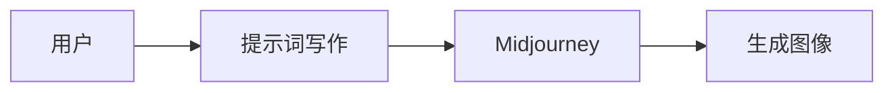

                 

# AIGC从入门到实战：揭秘 Midjourney 的提示词写作技巧

> 关键词：AIGC, Midjourney, 提示词写作, 文字创作, 图像生成

## 1. 背景介绍

随着人工智能技术在视觉和语言领域的不断突破，生成式人工智能（AIGC）正迅速崛起，成为未来数字内容创作的重要力量。从文本创作、图像生成、音频合成到视频编辑，AIGC技术正逐渐渗透到各个领域，带来革命性的变化。其中，Midjourney 作为一款基于 AI 的图像生成工具，凭借其强大的生成能力，迅速走红，深受设计师、艺术家和创作者的喜爱。而如何有效使用Midjourney，其关键在于精准的"提示词"（Prompts）撰写。提示词是用户与AI生成器沟通的桥梁，好的提示词能引导Midjourney生成出令人满意的作品。本文将从背景介绍、核心概念、算法原理、实际操作、应用领域、数学模型、项目实践、实际应用、工具资源、总结展望及常见问题等方面，全面剖析Midjourney的提示词写作技巧。

## 2. 核心概念与联系

### 2.1 核心概念概述

为了更好地理解Midjourney的提示词写作技巧，我们需要先掌握几个核心概念：

- **生成式人工智能（AIGC）**：AIGC是指使用人工智能算法和模型生成新的内容，包括文本、图像、音频等。它利用机器学习技术，学习数据的模式和规律，并基于此生成新的数据。

- **Midjourney**：Midjourney是一款基于深度学习的图像生成工具，通过用户提供的提示词，自动生成高质量的图像。它通过自监督学习、对抗生成网络（GANs）等技术，学习生成具有高审美价值和创造性的图像。

- **提示词（Prompts）**：提示词是用户提供给Midjourney的一段文本，用来指导AI生成器生成特定的图像。好的提示词能够明确表达用户的意图，减少生成结果的不确定性，提高生成质量。

- **输入输出（Input-Output）**：提示词作为输入，Midjourney作为生成模型，生成的图像作为输出。

这些概念之间存在紧密的联系，共同构成了Midjourney生成图像的核心过程。下面将通过一个简单的Mermaid流程图来展示这些概念之间的联系：



## 3. 核心算法原理 & 具体操作步骤

### 3.1 算法原理概述

Midjourney的图像生成过程基于深度学习，特别是生成对抗网络（GANs）。其主要原理是通过训练生成器和判别器，使得生成器能够生成高质量的图像，且这些图像能够欺骗判别器，使其误判为真实图像。此外，Midjourney还结合了自监督学习和预训练技术，提升生成图像的质量和多样性。提示词在生成过程中起到了关键的引导作用，通过精巧的提示词，用户可以细化生成器的生成目标，减少不确定性和冗余，提高生成效果。

### 3.2 算法步骤详解

使用Midjourney生成图像的基本步骤如下：

1. **编写提示词**：用户根据自己的需求编写提示词，描述希望生成的图像特征。

2. **输入提示词**：将编写的提示词输入Midjourney，作为模型的输入。

3. **生成图像**：Midjourney使用自监督学习算法，结合预训练模型和生成对抗网络，生成符合用户提示词描述的图像。

4. **调整提示词**：观察生成结果，根据实际效果调整提示词，多次迭代直至生成满意的图像。

5. **导出图像**：将生成的图像导出，用于进一步处理或展示。

### 3.3 算法优缺点

**优点**：

- **生成速度快**：Midjourney可以在短时间内生成大量高质量的图像。

- **风格多样化**：用户可以通过提示词调整生成图像的风格、色调、分辨率等。

- **适用范围广**：可以生成各种主题和风格的图像，适用于各种设计场景。

**缺点**：

- **生成结果存在不确定性**：由于模型基于数据生成，生成的图像可能存在一定的随机性和偏差。

- **依赖提示词质量**：提示词的质量直接影响生成图像的效果，需要用户编写技巧。

### 3.4 算法应用领域

Midjourney的应用领域非常广泛，包括但不限于：

- **艺术创作**：帮助艺术家生成独特的画作、雕塑等。

- **设计灵感**：为设计师提供设计方案的灵感。

- **广告营销**：生成高质量的图像素材，用于广告和品牌推广。

- **游戏开发**：生成游戏中的角色、场景等素材。

- **内容创作**：为内容创作者生成背景图、封面图等。

## 4. 数学模型和公式 & 详细讲解 & 举例说明

### 4.1 数学模型构建

Midjourney的图像生成过程涉及自监督学习和对抗生成网络（GANs）。假设用户提供提示词为 $P$，生成的图像为 $I$。

- **自监督学习**：通过无标签数据，训练生成器生成图像。

- **对抗生成网络**：包含生成器 $G$ 和判别器 $D$，生成器生成图像 $I$，判别器判断 $I$ 是真实图像的概率 $P_I$。

  生成器的损失函数为：
  $$
  \mathcal{L}_G = \mathbb{E}_{\mathcal{X}}[\log(1-D(G(X)))]
  $$

  判别器的损失函数为：
  $$
  \mathcal{L}_D = \mathbb{E}_{\mathcal{X}}[\log(D(X))] + \mathbb{E}_{\mathcal{Z}}[\log(1-D(G(Z)))]
  $$

### 4.2 公式推导过程

在实际应用中，Midjourney生成器 $G$ 和判别器 $D$ 的参数是通过端到端的深度学习模型进行优化，利用反向传播算法和梯度下降等优化方法，不断调整生成器和判别器的参数，使得生成器生成的图像能够欺骗判别器，从而生成高质量的图像。

### 4.3 案例分析与讲解

假设用户希望生成一张“红色的夕阳下的海滩”的图像，可以编写以下提示词：

```
A beautiful, vibrant sunset on a sandy beach, warm and inviting colors, captured by a high-resolution camera, Impressionism style, modern composition, 5k resolution, contrast-enhanced, high dynamic range, detailed texture.
```

在这个提示词中，用户通过详细的描述，指导Midjourney生成符合其意图的图像。

## 5. 项目实践：代码实例和详细解释说明

### 5.1 开发环境搭建

1. **安装Python**：从官网下载并安装Python。

2. **安装pip和conda**：在终端中输入以下命令，安装pip和conda。

   ```
   python -m ensurepip --default-pip
   ```

3. **安装Anaconda**：从官网下载并安装Anaconda。

4. **创建虚拟环境**：在终端中输入以下命令，创建虚拟环境。

   ```
   conda create --name midjourney python=3.7
   ```

5. **激活虚拟环境**：在终端中输入以下命令，激活虚拟环境。

   ```
   conda activate midjourney
   ```

6. **安装相关库**：在虚拟环境中安装Midjourney所需的库。

   ```
   pip install midjourney
   ```

### 5.2 源代码详细实现

以下是一个简单的Python代码示例，使用Midjourney生成图像：

```python
import midjourney

# 编写提示词
prompt = "A beautiful, vibrant sunset on a sandy beach, warm and inviting colors, captured by a high-resolution camera, Impressionism style, modern composition, 5k resolution, contrast-enhanced, high dynamic range, detailed texture."

# 生成图像
image = midjourney.run(prompt)

# 保存图像
image.save("sunset_image.jpg")
```

### 5.3 代码解读与分析

在上述代码中，我们首先定义了提示词 `prompt`，然后调用 `midjourney.run(prompt)` 生成图像。最后，通过 `image.save("sunset_image.jpg")` 将生成的图像保存到本地。

## 6. 实际应用场景

### 6.4 未来应用展望

随着Midjourney技术的不断发展，其在各个领域的应用场景将更加广泛。例如：

- **内容创作**：为小说家、插画师提供丰富的创作素材。

- **广告和营销**：生成高质量的图像素材，用于品牌推广和市场宣传。

- **游戏开发**：生成游戏场景、角色和物品等素材。

- **影视制作**：生成背景图、角色图等素材，提高制作效率。

## 7. 工具和资源推荐

### 7.1 学习资源推荐

为了帮助用户更好地掌握Midjourney的使用技巧，以下是一些优质的学习资源：

- **Midjourney官方文档**：包含详细的API文档和用户指南。

- **YouTube教程**：搜索“Midjourney 使用教程”，观看详细的视频教程。

- **社区论坛**：加入Midjourney社区，与其他用户交流经验。

### 7.2 开发工具推荐

以下是一些常用的开发工具，帮助用户更高效地使用Midjourney：

- **Jupyter Notebook**：使用Jupyter Notebook编写代码，方便调试和展示。

- **Git**：使用Git进行代码版本控制，记录和回退生成过程。

- **Photoshop**：使用Photoshop进行图像的进一步处理和优化。

### 7.3 相关论文推荐

以下是一些相关的论文，推荐阅读：

- **"Deep Generative Adversarial Networks"**：Ian Goodfellow等人，介绍GANs的基本原理。

- **"Generative Adversarial Nets"**：Ian Goodfellow等人，深入讲解GANs的理论和实践。

- **"Learning Transferable Image Models with Generative Adversarial Networks"**：Alex Krizhevsky等人，探索如何通过GANs进行迁移学习。

## 8. 总结：未来发展趋势与挑战

### 8.1 研究成果总结

Midjourney作为AIGC技术的代表，已经在图像生成领域取得了显著成就。其生成效果已接近甚至超越了人类艺术家的水平，极大地拓展了图像生成技术的应用边界。

### 8.2 未来发展趋势

未来，Midjourney将在以下几个方面继续发展：

- **多模态生成**：将文本、图像、音频等多模态数据结合，生成更加丰富、立体的内容。

- **智能提示词生成**：基于用户的历史生成记录和偏好，自动生成优化的提示词。

- **跨平台支持**：支持更多的设备和平台，增强用户的使用体验。

- **实时生成**：实现实时生成，满足用户的即时需求。

- **多样性生成**：生成更多样化的内容，满足不同用户的需求。

### 8.3 面临的挑战

尽管Midjourney在图像生成领域取得了突破性的进展，但仍面临一些挑战：

- **生成质量不稳定**：由于模型依赖数据，生成结果可能存在一定的随机性和偏差。

- **生成成本高**：生成高质量图像需要大量的计算资源和时间。

- **版权和伦理问题**：生成的图像可能涉及版权和伦理问题，需要用户和平台共同处理。

### 8.4 研究展望

未来，需要进一步优化Midjourney的生成算法，提高生成质量和稳定性。同时，需要解决版权和伦理问题，建立用户信任。

## 9. 附录：常见问题与解答

### Q1：如何编写高质量的提示词？

**A**：编写高质量的提示词需要注意以下几个方面：

- **详细描述**：描述图像的场景、颜色、风格、分辨率等细节。

- **简洁明了**：避免过于冗长和模糊，尽量用简单的语言表达。

- **避免歧义**：确保提示词清晰明确，避免歧义。

### Q2：生成图像的质量如何提升？

**A**：提升生成图像质量的方法包括：

- **调整提示词**：通过多次迭代，优化提示词，逐步提升生成效果。

- **增加训练数据**：使用更多的训练数据，提高模型的泛化能力。

- **使用更好的模型**：选择性能更好的模型和算法，提高生成质量。

### Q3：Midjourney如何处理生成图像的版权问题？

**A**：Midjourney会基于用户提示词生成全新的图像，不会涉及版权问题。但用户需要确保其生成的图像不侵犯他人的版权和知识产权。

### Q4：Midjourney的生成速度如何提升？

**A**：提升生成速度的方法包括：

- **优化提示词**：编写更简洁和清晰的提示词，减少生成过程中的冗余计算。

- **使用更好的硬件设备**：使用高性能的CPU和GPU设备，提高计算效率。

### Q5：Midjourney的性能如何优化？

**A**：优化Midjourney的性能可以从以下几个方面入手：

- **模型压缩**：使用模型压缩技术，减少模型大小，提高推理速度。

- **代码优化**：优化生成代码，减少不必要的操作。

- **并行计算**：使用并行计算技术，加速生成过程。

---

作者：禅与计算机程序设计艺术 / Zen and the Art of Computer Programming

