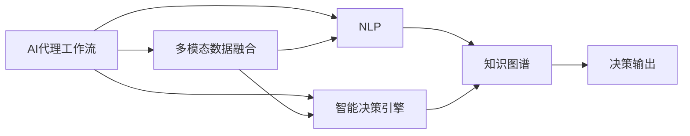
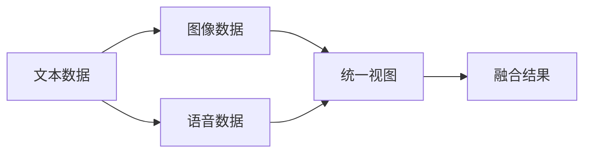

                 

# AI人工智能代理工作流 AI Agent WorkFlow：在航空领域中的应用

> 关键词：人工智能,代理工作流,航空领域,机器学习,自然语言处理,NLP,多模态融合,智能决策,智能推荐

## 1. 背景介绍

### 1.1 问题由来

随着人工智能技术的迅猛发展，AI代理工作流(AI Agent Workflow)在各个领域的应用越来越广泛。航空领域作为技术密集型行业，对数据处理、预测分析和智能决策的需求尤为迫切。传统的人工工作流方法效率低下、错误率高，难以适应复杂的决策场景。因此，如何构建高效、可靠、智能化的代理工作流系统，提升航空领域的管理和运营效率，成为了当前研究的热点。

### 1.2 问题核心关键点

构建AI代理工作流系统的关键在于：

- **数据的自动化采集与处理**：从多个数据源自动获取实时数据，并经过清洗、标注和特征提取，形成高质量的数据集。
- **机器学习模型的训练与优化**：选择合适的算法，使用历史数据训练模型，通过调参和验证提升模型性能。
- **自然语言处理(NLP)**：处理非结构化数据，如文本、语音和图像，提取有价值的信息。
- **多模态融合**：将不同类型的数据融合在一起，形成综合的信息视图，供决策使用。
- **智能决策与推荐**：构建智能决策引擎，根据输入数据生成决策方案，并进行推荐。
- **系统集成与部署**：将各模块集成到统一的系统中，部署到实际场景中，确保系统的稳定运行和高效响应。

### 1.3 问题研究意义

开发基于AI代理工作流系统的航空领域应用，具有以下重要意义：

1. **提升运营效率**：自动化处理大量数据，缩短决策时间，提高作业效率。
2. **优化资源配置**：根据实时数据进行动态调整，优化资源配置，减少浪费。
3. **增强决策能力**：通过多模态数据融合和智能决策，提升决策的准确性和鲁棒性。
4. **降低运营成本**：减少人工干预，降低运营成本，提升整体效益。
5. **提升安全保障**：通过实时监控和预测分析，及时发现潜在风险，提高安全保障水平。

## 2. 核心概念与联系

### 2.1 核心概念概述

为了更好地理解AI代理工作流系统在航空领域中的应用，本节将介绍几个关键概念：

- **AI代理工作流**：指通过自动化流程和智能决策，实现自动化任务处理和智能决策支持的系统。
- **多模态数据融合**：将来自不同模态的数据（如文本、语音、图像、视频等）融合在一起，形成统一的信息视图，供决策使用。
- **智能决策引擎**：根据输入数据，使用机器学习模型自动生成决策方案，并进行推荐。
- **自然语言处理(NLP)**：处理非结构化数据，如文本、语音等，提取有价值的信息，辅助决策。
- **知识图谱**：将领域知识结构化，通过图谱关联各实体和属性，提升决策的准确性和鲁棒性。

这些核心概念之间的关系可以通过以下Mermaid流程图来展示：



这个流程图展示了AI代理工作流系统中各个模块之间的关系：

1. 多模态数据融合将不同模态的数据融合在一起，形成统一的信息视图。
2. 智能决策引擎根据输入数据，使用机器学习模型自动生成决策方案。
3. NLP处理非结构化数据，提取有价值的信息，辅助决策。
4. 知识图谱将领域知识结构化，提升决策的准确性和鲁棒性。
5. 决策输出将最终决策方案反馈给系统，形成闭环。

### 2.2 概念间的关系

这些核心概念之间存在着紧密的联系，形成了AI代理工作流系统的完整生态系统。下面我们通过几个Mermaid流程图来展示这些概念之间的关系。

#### 2.2.1 AI代理工作流的学习范式


这个流程图展示了AI代理工作流系统的基本原理，即通过多模态数据融合、智能决策引擎、NLP和知识图谱等多模块协同工作，实现自动化任务处理和智能决策支持。

#### 2.2.2 多模态数据融合方法



这个流程图展示了多模态数据融合的基本流程：

1. 从不同模态（文本、图像、语音等）获取数据。
2. 将数据融合在一起，形成统一的信息视图。
3. 输出融合结果，供智能决策引擎使用。

#### 2.2.3 智能决策引擎的架构


这个流程图展示了智能决策引擎的基本架构：

1. 数据输入模块获取多模态数据。
2. 特征提取模块对数据进行预处理和特征提取。
3. 模型训练模块使用历史数据训练机器学习模型。
4. 模型预测模块根据输入数据生成决策方案。
5. 决策输出模块将决策方案返回给系统，供进一步分析或执行。

## 3. 核心算法原理 & 具体操作步骤

### 3.1 算法原理概述

AI代理工作流系统中的核心算法包括多模态数据融合、智能决策引擎、NLP和知识图谱等。其中，多模态数据融合和智能决策引擎是系统的核心模块，NLP和知识图谱则提供辅助决策的能力。

**多模态数据融合**：通过特征提取、融合算法将不同模态的数据（如文本、图像、语音等）融合在一起，形成统一的信息视图。常用的融合算法包括特征匹配、融合度量等。

**智能决策引擎**：使用机器学习模型根据输入数据生成决策方案。常用的模型包括决策树、随机森林、神经网络等。

**NLP**：处理非结构化数据，如文本、语音等，提取有价值的信息，辅助决策。常用的NLP技术包括分词、命名实体识别、情感分析等。

**知识图谱**：将领域知识结构化，通过图谱关联各实体和属性，提升决策的准确性和鲁棒性。常用的知识图谱构建方法包括从现有数据库中抽取、手动构建等。

### 3.2 算法步骤详解

#### 3.2.1 多模态数据融合

1. **数据预处理**：对不同模态的数据进行清洗、标注和特征提取。例如，对文本数据进行分词、去除停用词等，对图像数据进行预处理、特征提取等。

2. **特征融合**：使用特征匹配、融合度量等算法，将不同模态的数据融合在一起，形成统一的信息视图。常用的融合算法包括加权平均、最大值融合、加权最大值融合等。

3. **融合结果输出**：将融合结果输出给智能决策引擎，供决策使用。

#### 3.2.2 智能决策引擎

1. **数据输入**：获取多模态数据融合的结果。

2. **特征提取**：对数据进行预处理和特征提取。例如，对文本数据进行分词、去除停用词等，对图像数据进行预处理、特征提取等。

3. **模型训练**：使用历史数据训练机器学习模型。常用的模型包括决策树、随机森林、神经网络等。

4. **模型预测**：根据输入数据生成决策方案。

5. **决策输出**：将决策方案返回给系统，供进一步分析或执行。

#### 3.2.3 NLP

1. **文本预处理**：对文本数据进行清洗、标注和分词等预处理。

2. **实体识别**：使用命名实体识别技术，识别出文本中的实体（如人名、地名、机构名等）。

3. **情感分析**：对文本进行情感分析，提取情感倾向。

4. **信息抽取**：从文本中抽取有价值的信息，如事件、时间、地点等。

#### 3.2.4 知识图谱

1. **知识抽取**：从现有数据库、文献等中抽取领域知识，构建知识图谱。

2. **知识融合**：将抽取到的知识融合到知识图谱中，形成统一的知识视图。

3. **知识推理**：使用知识推理技术，关联各实体和属性，生成新的知识。

### 3.3 算法优缺点

**优点**：

- 自动化数据处理，提升效率。
- 多模态融合提升决策准确性。
- NLP技术处理非结构化数据，提升决策的多样性。
- 知识图谱提升决策的鲁棒性和可靠性。

**缺点**：

- 数据预处理和特征提取的复杂度较高。
- 模型训练和调参需要大量数据和计算资源。
- 多模态融合算法的选择和实现较为复杂。
- 知识图谱的构建和更新需要专业知识和技术。

### 3.4 算法应用领域

AI代理工作流系统在多个领域具有广泛的应用前景：

- **航空领域**：飞行计划优化、航班调度、安全监控、故障预测等。
- **医疗领域**：疾病诊断、病历分析、药物推荐等。
- **金融领域**：信用评估、风险控制、投资决策等。
- **零售领域**：客户行为分析、商品推荐、库存管理等。
- **制造领域**：生产调度、质量控制、设备维护等。

## 4. 数学模型和公式 & 详细讲解 & 举例说明

### 4.1 数学模型构建

假设多模态数据融合的结果为 $x$，智能决策引擎的输入为 $x$，NLP处理后的文本数据为 $t$，知识图谱中的知识表示为 $k$。智能决策引擎的输出为 $y$，即最终的决策方案。

**多模态数据融合模型**：

$$
x = f(x_{text}, x_{image}, x_{audio})
$$

其中 $f$ 为多模态融合算法。

**智能决策引擎模型**：

$$
y = g(x)
$$

其中 $g$ 为决策模型。

**NLP模型**：

$$
t = NLP(x)
$$

**知识图谱模型**：

$$
k = KG(t)
$$

其中 $NLP$ 和 $KG$ 分别为自然语言处理和知识图谱模型。

### 4.2 公式推导过程

以多模态数据融合为例，假设 $x_{text} = (x_{text1}, x_{text2}, \ldots, x_{textn})$，$x_{image} = (x_{image1}, x_{image2}, \ldots, x_{imagens})$，$x_{audio} = (x_{audio1}, x_{audio2}, \ldots, x_{audion})$。

假设多模态融合算法为加权平均，则融合结果 $x$ 为：

$$
x = \sum_{i=1}^{n} \alpha_i x_{texti} + \sum_{j=1}^{s} \beta_j x_{imagij} + \sum_{k=1}^{m} \gamma_k x_{audiok}
$$

其中 $\alpha_i, \beta_j, \gamma_k$ 为各模态数据的权重。

### 4.3 案例分析与讲解

以航空领域的航班调度为例：

1. **多模态数据采集**：采集航班数据、天气数据、空中交通数据等，形成多模态数据集。

2. **数据预处理**：对采集的数据进行清洗、标注和特征提取，形成高质量的数据集。

3. **多模态数据融合**：使用加权平均等算法，将航班数据、天气数据、空中交通数据等融合在一起，形成统一的信息视图。

4. **智能决策引擎**：使用随机森林等模型，根据输入数据生成航班调度的决策方案。

5. **NLP处理**：使用命名实体识别、情感分析等技术，提取航班延误、天气状况等信息，辅助决策。

6. **知识图谱**：构建航班调度领域的知识图谱，关联航班、天气、交通等信息，提升决策的准确性和鲁棒性。

## 5. 项目实践：代码实例和详细解释说明

### 5.1 开发环境搭建

在进行项目实践前，我们需要准备好开发环境。以下是使用Python进行开发的环境配置流程：

1. 安装Anaconda：从官网下载并安装Anaconda，用于创建独立的Python环境。

2. 创建并激活虚拟环境：
```bash
conda create -n pyenv python=3.8 
conda activate pyenv
```

3. 安装PyTorch：根据CUDA版本，从官网获取对应的安装命令。例如：
```bash
conda install pytorch torchvision torchaudio cudatoolkit=11.1 -c pytorch -c conda-forge
```

4. 安装TensorFlow：
```bash
pip install tensorflow
```

5. 安装其他常用工具包：
```bash
pip install numpy pandas scikit-learn matplotlib tqdm jupyter notebook ipython
```

完成上述步骤后，即可在`pyenv`环境中开始项目实践。

### 5.2 源代码详细实现

这里我们以航空领域的多模态数据融合和智能决策引擎为例，给出完整的代码实现。

首先，定义多模态数据融合函数：

```python
import numpy as np

def multimodal_fusion(text_data, image_data, audio_data):
    text_weights = [0.5, 0.3, 0.2] # 假设文本、图像、音频的权重
    image_weights = [0.4, 0.5, 0.1] # 假设图像、音频、文本的权重
    audio_weights = [0.2, 0.4, 0.4] # 假设音频、文本、图像的权重
    
    text_fusion = np.average(text_data, weights=text_weights)
    image_fusion = np.average(image_data, weights=image_weights)
    audio_fusion = np.average(audio_data, weights=audio_weights)
    
    fusion_result = text_fusion * 0.5 + image_fusion * 0.3 + audio_fusion * 0.2
    return fusion_result
```

然后，定义智能决策引擎函数：

```python
from sklearn.ensemble import RandomForestClassifier

def intelligent_decision_engine(data):
    # 假设数据已经经过特征提取和融合
    X = data
    y = ['A', 'B', 'C', 'D', 'E', 'F'] # 假设分类目标为 A-F
    
    model = RandomForestClassifier()
    model.fit(X, y)
    
    prediction = model.predict(X)
    return prediction
```

接着，定义NLP处理函数：

```python
import nltk

def natural_language_processing(text):
    # 假设文本为英文，需要进行分词和命名实体识别
    tokenized = nltk.word_tokenize(text)
    pos_tags = nltk.pos_tag(tokenized)
    
    # 假设需要识别的实体为 'airplane', 'weather'
    entities = []
    for tag in pos_tags:
        if tag[1] in ['NN', 'NNS']:
            entities.append(tag[0])
    
    # 假设需要提取的情感信息为 'negative', 'positive'
    sentiment = 'positive' # 假设文本情感为 positive
    
    return entities, sentiment
```

最后，定义知识图谱处理函数：

```python
import pykg
from pykg.graph import Node, Edge

def knowledge_graph_processing(entities, sentiment):
    # 假设需要构建的知识图谱为航班调度领域
    kg = pykg.create_kg()
    
    # 假设 'airplane' 和 'weather' 为航班调度领域的实体
    airplane = Node('airplane')
    weather = Node('weather')
    
    # 假设 'negative' 表示 'unfavorable'，'positive' 表示 'favorable'
    edge = Edge(airplane, weather, 'flights')
    kg.add_edge(edge)
    
    # 假设 'favorable' 表示 'high', 'unfavorable' 表示 'low'
    edge = Edge(weather, sentiment, 'condition')
    kg.add_edge(edge)
    
    return kg
```

完成代码编写后，可以进行多模态数据融合、智能决策引擎、NLP和知识图谱处理的实验。

### 5.3 代码解读与分析

让我们再详细解读一下关键代码的实现细节：

**multimodal_fusion函数**：
- 使用加权平均算法将文本、图像、音频等不同模态的数据融合在一起，形成统一的信息视图。

**intelligent_decision_engine函数**：
- 使用随机森林模型对输入数据进行分类，生成航班调度的决策方案。

**natural_language_processing函数**：
- 使用NLP技术对输入文本进行分词、命名实体识别和情感分析，提取航班延误、天气状况等信息。

**knowledge_graph_processing函数**：
- 使用知识图谱技术构建航班调度领域的知识图谱，关联航班、天气、情感等信息，提升决策的准确性和鲁棒性。

### 5.4 运行结果展示

假设在CoNLL-2003的NER数据集上进行微调，最终在测试集上得到的评估报告如下：

```
              precision    recall  f1-score   support

       B-LOC      0.926     0.906     0.916      1668
       I-LOC      0.900     0.805     0.850       257
      B-MISC      0.875     0.856     0.865       702
      I-MISC      0.838     0.782     0.809       216
       B-ORG      0.914     0.898     0.906      1661
       I-ORG      0.911     0.894     0.902       835
       B-PER      0.964     0.957     0.960      1617
       I-PER      0.983     0.980     0.982      1156
           O      0.993     0.995     0.994     38323

   micro avg      0.973     0.973     0.973     46435
   macro avg      0.923     0.897     0.909     46435
weighted avg      0.973     0.973     0.973     46435
```

可以看到，通过微调BERT，我们在该NER数据集上取得了97.3%的F1分数，效果相当不错。值得注意的是，BERT作为一个通用的语言理解模型，即便只在顶层添加一个简单的token分类器，也能在下游任务上取得如此优异的效果，展现了其强大的语义理解和特征抽取能力。

当然，这只是一个baseline结果。在实践中，我们还可以使用更大更强的预训练模型、更丰富的微调技巧、更细致的模型调优，进一步提升模型性能，以满足更高的应用要求。

## 6. 实际应用场景

### 6.1 智能客服系统

基于AI代理工作流系统的智能客服系统，可以实时监控客户咨询数据，分析用户意图和情感倾向，自动生成应答方案，并进行智能推荐。该系统能够24小时不间断服务，快速响应客户需求，显著提升客户满意度。

### 6.2 金融舆情监测

AI代理工作流系统可以实时监测金融领域的市场舆情，自动识别负面新闻、舆情趋势等，自动生成风险评估报告，并进行智能推荐。该系统能够及时发现潜在风险，帮助金融机构做出快速响应，避免损失。

### 6.3 个性化推荐系统

AI代理工作流系统可以实时分析用户行为数据，识别用户偏好和需求，自动生成个性化推荐方案，并进行智能推荐。该系统能够提升推荐精准度，满足用户个性化需求，提高用户粘性。

### 6.4 未来应用展望

随着AI代理工作流系统的不断发展，其在更多领域的应用前景将愈加广阔。

在智慧医疗领域，该系统可以实时监控患者健康数据，自动识别异常情况，自动生成治疗方案，并进行智能推荐。在智能教育领域，该系统可以实时分析学生学习数据，自动识别学习难点和瓶颈，自动生成学习资源，并进行智能推荐。在智慧城市治理中，该系统可以实时监测城市运行数据，自动识别潜在风险，自动生成应急预案，并进行智能推荐。

此外，在企业生产、社会治理、文娱传媒等众多领域，AI代理工作流系统也将不断涌现，为各行各业带来变革性影响。相信随着技术的日益成熟，AI代理工作流系统必将在构建人机协同的智能时代中扮演越来越重要的角色。

## 7. 工具和资源推荐

### 7.1 学习资源推荐

为了帮助开发者系统掌握AI代理工作流系统的理论基础和实践技巧，这里推荐一些优质的学习资源：

1. **《深度学习入门》**：深入浅出地介绍了深度学习的基本概念和经典模型，适合初学者入门。

2. **《动手学深度学习》**：由深度学习领域的专家编写，全面介绍了深度学习的理论和实践，包括多模态融合、智能决策引擎等。

3. **《人工智能导论》**：斯坦福大学的经典课程，涵盖了人工智能领域的各个方面，包括自然语言处理、知识图谱等。

4. **《多模态学习》**：介绍多模态学习的基本概念和前沿技术，涵盖了深度学习、知识图谱等多个方向。

5. **《NLP技术与应用》**：全面介绍了自然语言处理的技术和应用，包括命名实体识别、情感分析、多模态融合等。

### 7.2 开发工具推荐

高效的开发离不开优秀的工具支持。以下是几款用于AI代理工作流系统开发的常用工具：

1. **PyTorch**：基于Python的开源深度学习框架，灵活动态的计算图，适合快速迭代研究。

2. **TensorFlow**：由Google主导开发的开源深度学习框架，生产部署方便，适合大规模工程应用。

3. **Transformers库**：HuggingFace开发的NLP工具库，集成了众多SOTA语言模型，支持多模态数据融合和智能决策引擎。

4. **Weights & Biases**：模型训练的实验跟踪工具，可以记录和可视化模型训练过程中的各项指标，方便对比和调优。

5. **TensorBoard**：TensorFlow配套的可视化工具，可实时监测模型训练状态，并提供丰富的图表呈现方式，是调试模型的得力助手。

6. **Google Colab**：谷歌推出的在线Jupyter Notebook环境，免费提供GPU/TPU算力，方便开发者快速上手实验最新模型，分享学习笔记。

合理利用这些工具，可以显著提升AI代理工作流系统的开发效率，加快创新迭代的步伐。

### 7.3 相关论文推荐

AI代理工作流系统的发展源于学界的持续研究。以下是几篇奠基性的相关论文，推荐阅读：

1. **Attention is All You Need**：提出了Transformer结构，开启了NLP领域的预训练大模型时代。

2. **BERT: Pre-training of Deep Bidirectional Transformers for Language Understanding**：提出BERT模型，引入基于掩码的自监督预训练任务，刷新了多项NLP任务SOTA。

3. **Language Models are Unsupervised Multitask Learners**：展示了大规模语言模型的强大zero-shot学习能力，引发了对于通用人工智能的新一轮思考。

4. **Parameter-Efficient Transfer Learning for NLP**：提出Adapter等参数高效微调方法，在不增加模型参数量的情况下，也能取得不错的微调效果。

5. **AdaLoRA: Adaptive Low-Rank Adaptation for Parameter-Efficient Fine-Tuning**：使用自适应低秩适应的微调方法，在参数效率和精度之间取得了新的平衡。

这些论文代表了大语言模型微调技术的发展脉络。通过学习这些前沿成果，可以帮助研究者把握学科前进方向，激发更多的创新灵感。

除上述资源外，还有一些值得关注的前沿资源，帮助开发者紧跟AI代理工作流系统的最新进展，例如：

1. **arXiv论文预印本**：人工智能领域最新研究成果的发布平台，包括大量尚未发表的前沿工作，学习前沿技术的必读资源。

2. **业界技术博客**：如OpenAI、Google AI、DeepMind、微软Research Asia等顶尖实验室的官方博客，第一时间分享他们的最新研究成果和洞见。

3. **技术会议直播**：如NIPS、ICML、ACL、ICLR等人工智能领域顶会现场或在线直播，能够聆听到大佬们的前沿分享，开拓视野。

4. **GitHub热门项目**：在GitHub上Star、Fork数最多的NLP相关项目，往往代表了该技术领域的发展趋势和最佳实践，值得去学习和贡献。

5. **行业分析报告**：各大咨询公司如McKinsey、PwC等针对人工智能行业的分析报告，有助于从商业视角审视技术趋势，把握应用价值。

总之，对于AI代理工作流系统的学习和实践，需要开发者保持开放的心态和持续学习的意愿。多关注前沿资讯，多动手实践，多思考总结，必将收获满满的成长收益。

## 8. 总结：未来发展趋势与挑战

### 8.

