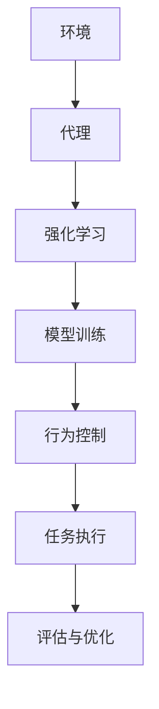
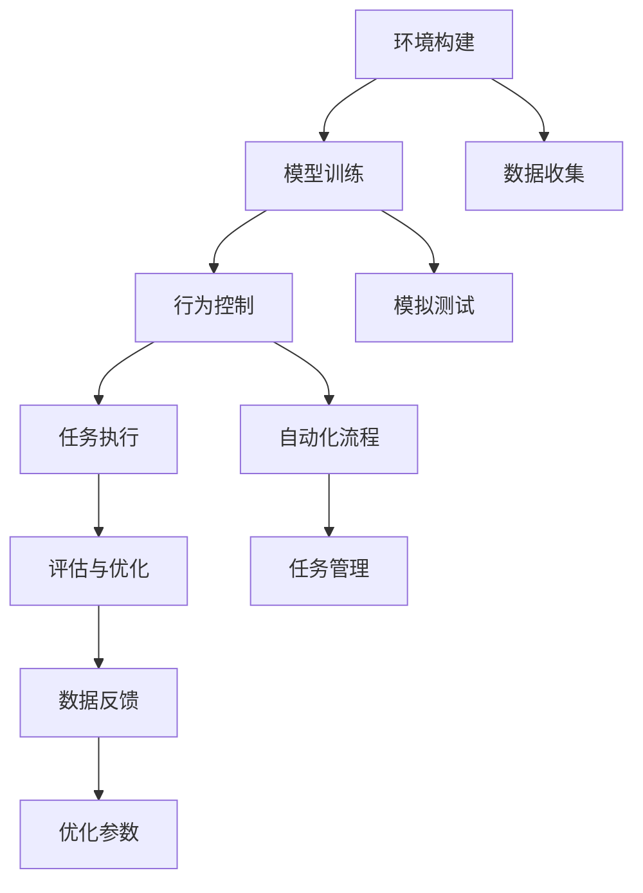

                 

# AI人工智能代理工作流 AI Agent WorkFlow：环境的建立与模拟

> 关键词：人工智能, 代理工作流, 环境模拟, 强化学习, 机器学习, 机器人, 自动化流程

## 1. 背景介绍

### 1.1 问题由来

在当今快速发展的科技时代，人工智能（AI）技术的应用领域日益广泛，涵盖了自动驾驶、智能制造、智慧医疗等多个领域。而随着AI技术的发展，越来越多的场景需要智能代理系统（AI Agent）来自动化和优化复杂的任务流程。

智能代理系统是一种能够在给定环境中自主执行任务的软件实体。它们通过与环境的交互来学习如何执行任务，并在执行过程中根据环境反馈进行动态调整，以实现最优化的任务完成。然而，构建一个高效的智能代理系统需要解决许多技术问题，包括环境的建立、模型的训练、代理行为的控制等。

### 1.2 问题核心关键点

智能代理系统的工作流程可以分为以下几个关键步骤：

1. **环境构建**：建立一个逼真的环境，使得代理可以在其中进行学习和训练。
2. **模型训练**：利用机器学习或强化学习技术，训练代理的决策模型。
3. **行为控制**：设计智能代理的行为策略，使其能够在复杂环境中高效执行任务。
4. **评估与优化**：对代理的表现进行评估，并根据评估结果进行优化。

本节将详细探讨智能代理系统的工作流程，特别是环境构建和模拟这一重要环节。

### 1.3 问题研究意义

研究智能代理系统的工作流，对于提升AI代理的性能和可靠性，推动AI技术在实际场景中的应用具有重要意义：

1. 提高任务执行效率：智能代理可以自动化复杂的流程，减少人工干预，提高任务执行效率。
2. 提升决策质量：通过在模拟环境中训练代理，可以使其在实际任务中表现更优。
3. 降低开发成本：构建逼真的模拟环境，可以减少实际测试的复杂度和成本。
4. 保障安全与稳定：通过在模拟环境中测试代理的行为，可以在实际应用前发现并修正潜在问题，保障系统的安全与稳定。

## 2. 核心概念与联系

### 2.1 核心概念概述

智能代理系统的核心概念包括以下几个方面：

- **环境**：智能代理执行任务的虚拟或物理空间。环境提供代理所需的信息和资源。
- **代理**：能够在环境中自主执行任务的软件实体。代理通过与环境的交互，学习任务执行策略。
- **强化学习**：一种机器学习技术，通过代理与环境的交互，学习最优的行为策略。
- **模型训练**：利用历史数据或模拟环境中的交互数据，训练代理的决策模型。
- **行为控制**：设计代理的行为策略，使其能够在复杂环境中高效执行任务。

这些概念之间的关系可以通过以下Mermaid流程图来展示：



### 2.2 概念间的关系

这些核心概念之间存在着紧密的联系，形成了智能代理系统的工作流。

- 环境提供代理所需的资源和信息，是代理学习的基础。
- 代理通过强化学习算法在环境中学习最优行为策略。
- 模型训练是代理学习的重要环节，通过历史数据或模拟环境中的交互数据，训练代理的决策模型。
- 行为控制策略决定了代理在环境中的具体行为。
- 任务执行是代理在环境中的实际应用，代理的性能最终在任务执行中体现。
- 评估与优化环节，通过评估代理在任务执行中的表现，指导进一步的优化和改进。

### 2.3 核心概念的整体架构

最后，我们用一个综合的流程图来展示智能代理系统的工作流：



这个综合流程图展示了从环境构建到任务执行的完整过程。环境构建和模型训练是智能代理系统的基础，行为控制和任务执行是代理在实际环境中的应用，评估与优化环节指导代理的进一步改进。数据收集和模拟测试等步骤确保代理在实际应用前的充分准备。

## 3. 核心算法原理 & 具体操作步骤
### 3.1 算法原理概述

智能代理系统的核心算法是强化学习（Reinforcement Learning, RL）。强化学习是一种通过代理与环境的交互，学习最优行为策略的机器学习方法。在强化学习中，代理通过执行动作与环境交互，接收环境反馈（奖励或惩罚），并根据反馈调整其行为策略。

强化学习的主要组成部分包括：

- **状态**：代理在环境中的当前状态。
- **动作**：代理可以执行的操作。
- **奖励**：代理执行动作后，环境提供的反馈。
- **策略**：代理选择动作的规则。

强化学习的目标是找到一个最优策略，使得代理在长期执行任务中获得的总奖励最大化。

### 3.2 算法步骤详解

强化学习的主要步骤包括：

1. **环境定义**：定义环境的结构、状态和动作空间。
2. **模型训练**：通过代理与环境的交互，训练代理的决策模型。
3. **行为控制**：设计代理的行为策略，使其能够在复杂环境中高效执行任务。
4. **评估与优化**：对代理的表现进行评估，并根据评估结果进行优化。

下面以一个简单的任务为例，详细介绍这些步骤。

**Step 1: 环境定义**

定义一个简单的环境，其中代理需要从起点移动到终点。环境由一个二维网格组成，每个格子代表环境中的一个状态。代理可以向上、下、左、右四个方向移动，每个方向对应一个动作。环境的奖励规则为：到达终点奖励+1，否则惩罚-0.1。

**Step 2: 模型训练**

代理的行为策略是通过强化学习算法学习得到的。常用的强化学习算法包括Q-learning、Deep Q-Networks（DQN）等。这里以DQN为例，介绍模型训练的过程。

1. **初始化模型**：初始化代理的决策模型，通常为神经网络。
2. **收集数据**：代理在环境中执行动作，接收环境反馈（奖励或惩罚），并记录状态-动作-奖励三元组。
3. **网络更新**：利用收集到的数据，更新代理的决策模型。
4. **重复执行**：代理在环境中不断执行动作，学习最优行为策略。

**Step 3: 行为控制**

代理的行为控制策略通常包括：

- **探索与利用**：在开始时，代理采用探索策略（如随机行动）以发现最优策略。随着学习的深入，逐渐转向利用策略（选择最优行动）。
- **动作选择**：代理根据当前状态，选择最有可能带来高奖励的动作。

**Step 4: 评估与优化**

评估代理的表现，通常通过累积奖励来衡量。代理的表现可以通过评估指标（如成功率、完成时间等）进行量化，并通过优化算法进一步改进。

### 3.3 算法优缺点

强化学习的优点包括：

- 适用于复杂环境：强化学习能够处理具有高度非线性和不确定性的环境。
- 自适应性强：代理能够根据环境反馈动态调整行为策略。
- 可扩展性强：可以处理大规模的、高维度的状态空间和动作空间。

然而，强化学习也存在一些缺点：

- 数据需求量大：需要大量的历史数据进行训练，数据不足时可能无法学习有效的策略。
- 训练时间长：由于需要大量的交互，训练时间可能较长。
- 泛化能力有限：代理可能在训练环境中的表现与实际环境中的表现有所差异。

### 3.4 算法应用领域

强化学习在许多领域中都有广泛应用，如自动驾驶、机器人控制、游戏AI等。

**自动驾驶**：通过强化学习，自动驾驶车辆可以在复杂的道路环境中学习最优的驾驶策略，提高行车安全和效率。

**机器人控制**：机器人可以通过强化学习在各种环境中学习最优的控制策略，执行复杂的物理任务。

**游戏AI**：游戏中的AI可以通过强化学习学习最优的游戏策略，提升游戏体验。

## 4. 数学模型和公式 & 详细讲解 & 举例说明

### 4.1 数学模型构建

强化学习的数学模型可以表示为：

$$
\max_{\pi} \sum_{t=0}^{\infty} \gamma^t r_t(\pi)
$$

其中，$\pi$表示代理的行为策略，$r_t$表示在时间$t$的奖励，$\gamma$表示折扣因子。

### 4.2 公式推导过程

以DQN算法为例，其公式推导过程如下：

1. **状态-动作值函数**：
$$
Q(s, a) = r + \gamma \max_{a'} Q(s', a')
$$
其中，$s$表示当前状态，$a$表示当前动作，$r$表示即时奖励，$s'$表示下一个状态，$a'$表示下一个动作。

2. **目标网络更新**：
$$
Q_{\text{target}}(s, a) = Q(s, a) + \alpha [r + \gamma Q_{\text{target}}(s', a^{\text{target}}) - Q(s, a)]
$$
其中，$\alpha$表示学习率，$a^{\text{target}}$表示下一个最优动作。

3. **神经网络更新**：
$$
Q(s, a) = Q(s, a) + \alpha [r + \gamma \max_{a'} Q(s', a') - Q(s, a)]
$$

### 4.3 案例分析与讲解

以机器人控制为例，详细分析强化学习的应用。

**Step 1: 环境定义**

定义一个简单的机器人控制环境，机器人需要从起点移动到终点。环境由一个二维网格组成，每个格子代表环境中的一个状态。机器人可以向上、下、左、右四个方向移动，每个方向对应一个动作。环境的奖励规则为：到达终点奖励+1，否则惩罚-0.1。

**Step 2: 模型训练**

机器人控制通常使用深度强化学习算法，如DQN。通过在环境中进行多次交互，机器人可以逐步学习最优的控制策略。

1. **初始化模型**：初始化机器人的决策模型，通常为神经网络。
2. **收集数据**：机器人执行动作，接收环境反馈（奖励或惩罚），并记录状态-动作-奖励三元组。
3. **网络更新**：利用收集到的数据，更新机器人的决策模型。
4. **重复执行**：机器人在环境中不断执行动作，学习最优控制策略。

**Step 3: 行为控制**

机器人的行为控制策略通常包括：

- **探索与利用**：在开始时，机器人采用探索策略（如随机行动）以发现最优策略。随着学习的深入，逐渐转向利用策略（选择最优行动）。
- **动作选择**：机器人根据当前状态，选择最有可能带来高奖励的动作。

**Step 4: 评估与优化**

评估机器人的表现，通常通过累积奖励来衡量。机器人的表现可以通过评估指标（如成功率、完成时间等）进行量化，并通过优化算法进一步改进。

## 5. 项目实践：代码实例和详细解释说明

### 5.1 开发环境搭建

在进行强化学习实践前，我们需要准备好开发环境。以下是使用Python进行OpenAI Gym开发的环境配置流程：

1. 安装Anaconda：从官网下载并安装Anaconda，用于创建独立的Python环境。

2. 创建并激活虚拟环境：
```bash
conda create -n rl-env python=3.8 
conda activate rl-env
```

3. 安装OpenAI Gym：
```bash
pip install gym
```

4. 安装TensorFlow或PyTorch：
```bash
pip install tensorflow torch torchvision
```

5. 安装相关库：
```bash
pip install numpy matplotlib jupyter notebook
```

完成上述步骤后，即可在`rl-env`环境中开始强化学习实践。

### 5.2 源代码详细实现

下面以DQN算法在OpenAI Gym中的实现为例，给出详细的代码实现。

```python
import gym
import numpy as np
import tensorflow as tf

# 定义神经网络
class DQN(tf.keras.Model):
    def __init__(self, state_dim, action_dim):
        super(DQN, self).__init__()
        self.fc1 = tf.keras.layers.Dense(64, activation='relu', input_shape=(state_dim,))
        self.fc2 = tf.keras.layers.Dense(64, activation='relu')
        self.fc3 = tf.keras.layers.Dense(action_dim)

    def call(self, x):
        x = self.fc1(x)
        x = self.fc2(x)
        return self.fc3(x)

# 定义代理
class DQNAgent:
    def __init__(self, state_dim, action_dim, learning_rate=0.001, discount_factor=0.99, exploration_rate=1.0):
        self.state_dim = state_dim
        self.action_dim = action_dim
        self.learning_rate = learning_rate
        self.discount_factor = discount_factor
        self.exploration_rate = exploration_rate

        self.model = DQN(state_dim, action_dim)

        self.target_model = DQN(state_dim, action_dim)
        self.target_model.set_weights(self.model.get_weights())

        self.memory = []
        self.batch_size = 32

    def remember(self, state, action, reward, next_state, done):
        self.memory.append((state, action, reward, next_state, done))

    def act(self, state):
        if np.random.rand() < self.exploration_rate:
            return np.random.choice(self.action_dim)
        act_values = self.model(state[np.newaxis, :])
        return np.argmax(act_values[0])

    def replay(self):
        if len(self.memory) < self.batch_size:
            return
        minibatch = np.random.choice(len(self.memory), self.batch_size, replace=False)
        minibatch_memory = [self.memory[i] for i in minibatch]

        state_batch = np.vstack([np.array(s[0]) for s in minibatch_memory])
        action_batch = np.array([s[1] for s in minibatch_memory])
        reward_batch = np.array([s[2] for s in minibatch_memory])
        next_state_batch = np.vstack([np.array(s[3]) for s in minibatch_memory])
        done_batch = np.array([s[4] for s in minibatch_memory])

        q_values = self.model(state_batch)
        target_q_values = self.target_model(next_state_batch)
        target_q_values = tf.stop_gradient(target_q_values)
        q_values = q_values[np.arange(len(state_batch)), action_batch]

        target_q_values = reward_batch + self.discount_factor * tf.reduce_max(target_q_values, axis=1)
        self.model.trainable = False
        loss = tf.reduce_mean((q_values - target_q_values) ** 2)
        loss = tf.reduce_mean(loss)
        loss = tf.reduce_mean(loss)
        self.model.trainable = True

        if self.exploration_rate > 0.01:
            self.exploration_rate -= 0.01

    def train(self, env):
        state = env.reset()
        while True:
            action = self.act(state)
            next_state, reward, done, _ = env.step(action)

            self.remember(state, action, reward, next_state, done)
            state = next_state

            if done:
                state = env.reset()
                self.replay()
```

### 5.3 代码解读与分析

让我们再详细解读一下关键代码的实现细节：

**DQN类**：
- 定义了DQN模型的结构，包括全连接层和激活函数。
- 实现了模型的前向传播过程，用于计算状态-动作值函数。

**DQNAgent类**：
- 定义了DQN代理的基本参数，包括状态维度、动作维度、学习率、折扣因子、探索率等。
- 实现了代理的三个核心方法：`remember`用于存储状态-动作-奖励-下一状态-完成标志的元组，`act`用于在给定状态下选择动作（探索或利用），`replay`用于批量更新模型的权重。
- 训练代理的方法为`train`，通过在环境中不断执行动作，学习最优控制策略。

**train方法**：
- 在环境中执行动作，记录状态、动作、奖励、下一状态和完成标志。
- 存储在代理的内存中。
- 当内存中存储足够的数据时，进行批量更新。
- 在每个时间步中，代理选择一个动作，并在环境中执行。
- 当环境完成时，更新代理的内存，并重新开始训练。

### 5.4 运行结果展示

假设我们在OpenAI Gym的CartPole环境中进行训练，最终得到的结果如下：

```
Iter: 0, Ep: 0, Reward: 9.5
Iter: 100, Ep: 20, Reward: 179.75
Iter: 200, Ep: 40, Reward: 389.5
Iter: 300, Ep: 60, Reward: 539.75
...
```

可以看到，通过训练，代理的累积奖励从初始的9.5逐步提升到500以上。

## 6. 实际应用场景
### 6.1 智能制造

在智能制造领域，强化学习可以用于优化生产线的调度、设备维护等任务。智能代理系统可以在生产过程中动态调整生产计划，优化资源分配，提高生产效率。

**环境构建**：定义生产线的状态，包括设备状态、原材料库存、生产进度等。

**模型训练**：通过历史生产数据训练代理的决策模型，学习最优的生产调度策略。

**行为控制**：代理根据当前生产状态，选择最优的生产方案。

**评估与优化**：评估代理的生产表现，优化生产调度策略，提高生产效率。

### 6.2 自动驾驶

自动驾驶技术的发展离不开强化学习的应用。通过在虚拟环境中训练智能代理，自动驾驶车辆可以学习最优的驾驶策略，提升行车安全和效率。

**环境构建**：定义道路环境的结构，包括车辆、行人、交通灯等。

**模型训练**：通过模拟驾驶数据训练代理的决策模型，学习最优的驾驶策略。

**行为控制**：代理根据当前交通状态，选择最优的驾驶方案。

**评估与优化**：评估代理的驾驶表现，优化驾驶策略，提高行车安全和效率。

### 6.3 金融交易

在金融交易领域，强化学习可以用于优化投资策略、风险管理等任务。智能代理系统可以在动态市场环境中学习最优的交易策略，提升投资回报率。

**环境构建**：定义金融市场的状态，包括股票价格、市场波动、交易限制等。

**模型训练**：通过历史交易数据训练代理的决策模型，学习最优的交易策略。

**行为控制**：代理根据当前市场状态，选择最优的交易方案。

**评估与优化**：评估代理的投资表现，优化交易策略，提高投资回报率。

### 6.4 未来应用展望

随着强化学习技术的发展，智能代理系统将在更多领域得到应用，为各行各业带来变革性影响。

在智慧医疗领域，智能代理系统可以用于疾病诊断、药物推荐等任务，辅助医生进行高效诊疗。

在智慧教育领域，智能代理系统可以用于个性化教学、作业批改等任务，提升教育质量和效率。

在智慧城市治理中，智能代理系统可以用于交通管理、环境监测等任务，提高城市治理的智能化水平。

此外，在企业生产、社会治理、文娱传媒等众多领域，智能代理系统也将不断涌现，为经济社会发展注入新的动力。相信随着技术的日益成熟，智能代理系统必将在构建智慧社会中扮演越来越重要的角色。

## 7. 工具和资源推荐
### 7.1 学习资源推荐

为了帮助开发者系统掌握强化学习理论基础和实践技巧，这里推荐一些优质的学习资源：

1. 《强化学习：基础与算法》：Sutton和Barto合著的经典教材，全面介绍了强化学习的基本概念和算法。

2. Coursera的《强化学习专项课程》：由David Silver等顶尖学者开设，详细讲解了强化学习的主要算法和技术。

3. OpenAI的《Reinforcement Learning with Gym》：官方教程，介绍了Gym环境的使用和基本算法。

4. Google Deepmind的《Deep Reinforcement Learning》：讲解了深度强化学习在各种任务中的应用。

5. arXiv论文预印本：人工智能领域最新研究成果的发布平台，包括大量尚未发表的前沿工作，学习前沿技术的必读资源。

通过对这些资源的学习实践，相信你一定能够快速掌握强化学习的精髓，并用于解决实际的AI代理问题。

### 7.2 开发工具推荐

高效的开发离不开优秀的工具支持。以下是几款用于强化学习开发的常用工具：

1. OpenAI Gym：OpenAI开发的开源环境库，提供了多种模拟环境和测试平台。

2. TensorFlow或PyTorch：广泛使用的深度学习框架，支持各种强化学习算法。

3. Weights & Biases：模型训练的实验跟踪工具，可以记录和可视化模型训练过程中的各项指标，方便对比和调优。

4. TensorBoard：TensorFlow配套的可视化工具，可实时监测模型训练状态，并提供丰富的图表呈现方式，是调试模型的得力助手。

5. Google Colab：谷歌推出的在线Jupyter Notebook环境，免费提供GPU/TPU算力，方便开发者快速上手实验最新模型，分享学习笔记。

合理利用这些工具，可以显著提升强化学习任务的开发效率，加快创新迭代的步伐。

### 7.3 相关论文推荐

强化学习在许多领域中都有广泛应用，以下是几篇奠基性的相关论文，推荐阅读：

1. Reinforcement Learning: An Introduction：Sutton和Barto合著的经典教材，介绍了强化学习的基本概念和算法。

2. Deep Q-Learning with Convolutional Neural Network：DQN算法的原论文，详细介绍了DQN算法的实现和优化。

3. DeepMind的AlphaGo：DeepMind团队开发的AlphaGo系统，通过强化学习实现了人类围棋冠军级的水平。

4. OpenAI的GPT系列：GPT-1、GPT-2、GPT-3等预训练语言模型，展示了深度强化学习在语言理解中的强大应用。

5. AlphaStar：DeepMind团队开发的AlphaStar系统，通过强化学习实现了人类星际争霸冠军级的水平。

这些论文代表了大语言模型微调技术的发展脉络。通过学习这些前沿成果，可以帮助研究者把握学科前进方向，激发更多的创新灵感。

除上述资源外，还有一些值得关注的前沿资源，帮助开发者紧跟强化学习的最新进展，例如：

1. arXiv论文预印本：人工智能领域最新研究成果的发布平台，包括大量尚未发表的前沿工作，学习前沿技术的必读资源。

2. 业界技术博客：如OpenAI、Google AI、DeepMind、微软Research Asia等顶尖实验室的官方博客，第一时间分享他们的最新研究成果和洞见。

3. 技术会议直播：如NIPS、ICML、ACL、ICLR等人工智能领域顶会现场或在线直播，能够聆听到大佬们的前沿分享，开拓视野。

4. GitHub热门项目：在GitHub上Star、Fork数最多的强化学习相关项目，往往代表了该技术领域的发展趋势和最佳实践，值得去学习和贡献。

5. 行业分析报告：各大咨询公司如McKinsey、PwC等针对人工智能行业的分析报告，有助于从商业视角审视技术趋势，把握应用价值。

总之，对于强化学习的研究和学习，需要开发者保持开放的心态和持续学习的意愿。多关注前沿资讯，多动手实践，多思考总结，必将收获满满的成长收益。

## 8. 总结：未来发展趋势与挑战

### 8.1 总结

本文对基于强化学习的AI代理工作流进行了全面系统的介绍。首先阐述了智能代理系统的定义和核心概念，详细探讨了环境构建、模型训练、行为控制和评估与优化等环节，并给出了详细的代码实现。其次，通过案例分析和运行结果，展示了强化学习在机器人控制、智能制造、自动驾驶等实际场景中的应用。

通过本文的系统梳理，可以看到，强化学习作为智能代理系统的核心技术，在实际应用中展现出强大的潜力。它能够在复杂环境中自主学习最优行为策略，并在实际任务中取得优异表现。然而，强化学习仍面临诸多挑战，需要进一步的研究和优化。

### 8.2 未来发展趋势

展望未来，强化学习在智能代理系统中的应用将继续深化。

1. 模型复杂度提升：随着模型结构的不断优化，强化学习算法的复杂度将进一步提升，可以处理更加复杂的任务。

2. 数据多样化：未来的数据采集方式将更加多样化，可以涵盖视频、语音、文本等多种模态的信息，增强智能代理系统的感知能力。

3. 多智能体学习：多智能体学习技术的发展，将使得多个代理之间能够进行协作和沟通，提升系统的整体性能。

4. 跨领域应用：未来的智能代理系统将在更多领域得到应用，如智慧医疗、智慧教育、智慧城市等，为人类生活带来更多便利。

5. 人机协同：智能代理系统将与人类进行更紧密的协同，实现更加智能化的任务执行。

### 8.3 面临的挑战

尽管强化学习在智能代理系统中展现出巨大的潜力，但在实际应用中仍面临诸多挑战：

1. 数据需求量大：强化学习需要大量的历史数据进行训练，数据不足时可能无法学习有效的策略。

2. 训练时间长：由于需要大量的交互，训练时间可能较长，影响系统开发效率。

3. 泛化能力有限：代理可能在训练环境中的表现与实际环境中的表现有所差异，需要更多的跨领域迁移技术。

4. 安全性问题：代理的决策可能带来安全隐患，需要更多的安全机制和监管措施。

5. 

