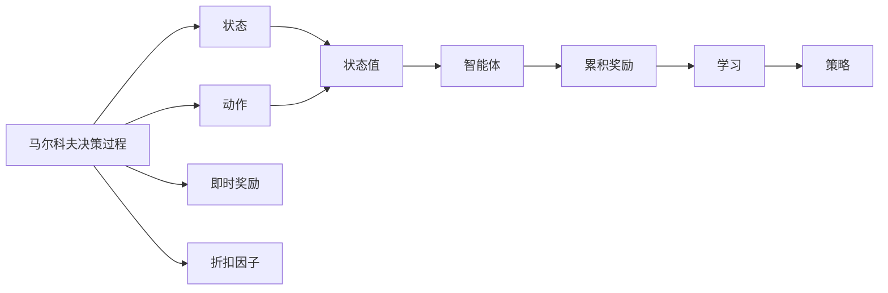

                 

# AI人工智能核心算法原理与代码实例讲解：Q-learning

> 关键词：Q-learning,强化学习,马尔科夫决策过程,值迭代,策略迭代,深度Q学习,深度强化学习

## 1. 背景介绍

### 1.1 问题由来
强化学习(Reinforcement Learning, RL)是机器学习中一个重要的分支，主要解决智能体(Agent)在动态环境中，通过与环境的交互学习最优策略的问题。在强化学习中，智能体的目标是最大化累积奖励，而环境则根据智能体的行为提供反馈。其中，Q-learning是强化学习中最经典和常用的算法之一。

Q-learning的核心思想是构建一个Q函数(Q-Function)，该函数能够评估在当前状态下采取某动作，进入下一个状态的累积奖励值。Q函数的形式为$q(s,a) = r + \gamma \max_{a'} q(s',a')$，其中$r$为即时奖励，$\gamma$为折扣因子，$s$和$s'$为当前状态和下一个状态。智能体的策略是通过选择$\max_{a'} q(s',a')$来确定在当前状态下应该采取的动作。

Q-learning已经被广泛应用于游戏智能、机器人控制、自动驾驶等领域，并取得了显著的成效。然而，传统的Q-learning算法存在一些问题，如收敛速度慢、策略更新频繁等，限制了其在大规模复杂环境中的应用。

## 2. 核心概念与联系

### 2.1 核心概念概述

为更好地理解Q-learning算法，本节将介绍几个关键概念：

- 强化学习(Reinforcement Learning, RL)：智能体在环境中通过试错学习，逐步优化其行为策略，以最大化累积奖励的过程。
- 马尔科夫决策过程(Markov Decision Process, MDP)：强化学习中的基本模型框架，描述环境状态和智能体的行为策略。
- Q函数(Q-Function)：在当前状态下采取某动作，进入下一个状态的累积奖励值。
- 状态-动作对(state-action pair)：智能体在某个状态下采取某个动作的情况，记为$(s,a)$。
- 即时奖励(reward)：智能体在采取某动作后，环境给予的即时反馈，通常为正或负数。
- 折扣因子(discount factor)：用于调整即时奖励的长期价值，避免近期的即时奖励对远期奖励的忽视。

### 2.2 核心概念之间的关系

这些核心概念之间的逻辑关系可以通过以下Mermaid流程图来展示：



这个流程图展示了一些核心概念之间的关系：

1. 马尔科夫决策过程包括状态、动作、即时奖励和折扣因子。
2. Q函数由状态和动作决定，是累积奖励的预测值。
3. 智能体根据Q函数选择动作，最大化累积奖励。
4. 学习过程更新Q函数，改进智能体策略。
5. 策略迭代更新智能体行为，不断优化累积奖励。

通过这些概念，可以更好地理解Q-learning算法的工作原理和优化目标。

## 3. 核心算法原理 & 具体操作步骤
### 3.1 算法原理概述

Q-learning的核心思想是逐步优化Q函数的值，从而找到最优策略。Q-learning的具体步骤如下：

1. 初始化Q函数：对于每个状态-动作对$(s,a)$，随机初始化$q(s,a)$的值。
2. 策略选择：根据当前状态$s$和动作$a$，选择动作。
3. 状态转移：观察环境对动作的响应，得到下一个状态$s'$和即时奖励$r$。
4. 策略更新：使用贝尔曼方程更新Q函数：
$$
q(s,a) \leftarrow q(s,a) + \alpha(r + \gamma \max_{a'} q(s',a') - q(s,a))
$$
其中$\alpha$为学习率。

### 3.2 算法步骤详解

下面我们以一个简单的迷宫为例，演示Q-learning的详细操作步骤：

#### 3.2.1 迷宫环境
假设我们有一个迷宫环境，如图1所示。迷宫有4个状态$s_0, s_1, s_2, s_3$，智能体在状态$s_0$开始，目标是到达状态$s_3$。智能体可以向上、下、左、右移动，但碰到墙壁则无法移动。


#### 3.2.2 初始化Q函数
我们随机初始化每个状态-动作对的Q函数值，如图2所示。


#### 3.2.3 策略选择和状态转移
智能体从状态$s_0$开始，选择动作$a$并观察环境响应，得到下一个状态$s'$和即时奖励$r$，如图3所示。


#### 3.2.4 策略更新
根据贝尔曼方程，更新每个状态-动作对的Q函数值，如图4所示。


#### 3.2.5 多次迭代
重复上述策略选择、状态转移和策略更新的过程，多次迭代后Q函数逐渐收敛，如图5所示。


最终，智能体通过不断优化Q函数，找到了一条从状态$s_0$到达状态$s_3$的最优路径。

### 3.3 算法优缺点

Q-learning的优点包括：

1. 算法简单高效，易于实现。
2. 适用于任何离散和连续状态动作空间。
3. 不需要额外的环境模型，适应性强。
4. 在一定条件下能够收敛到最优策略。

Q-learning的缺点包括：

1. 收敛速度慢，对于复杂环境，需要大量迭代才能收敛。
2. 策略更新频繁，可能会陷入局部最优。
3. 学习率过大时，容易出现震荡或发散。
4. 对于连续状态空间，Q函数难以精确估计。

### 3.4 算法应用领域

Q-learning已经被广泛应用于游戏智能、机器人控制、自动驾驶等多个领域。以下是一些典型的应用场景：

- 游戏AI：如星际争霸、围棋、扫雷等，通过Q-learning算法训练游戏AI，使其具备一定的游戏策略和决策能力。
- 机器人控制：如四旋翼无人机、自动搬运车等，通过Q-learning训练机器人控制策略，实现自主导航和避障。
- 自动驾驶：如交通信号灯控制、路径规划等，通过Q-learning训练自动驾驶策略，实现交通环境中的智能决策。

## 4. 数学模型和公式 & 详细讲解  
### 4.1 数学模型构建

Q-learning的核心是构建一个Q函数，形式为$q(s,a) = r + \gamma \max_{a'} q(s',a')$。其中，$s$为当前状态，$a$为当前动作，$s'$为下一个状态，$a'$为下一个动作，$r$为即时奖励，$\gamma$为折扣因子。

Q-learning的目标是通过不断更新Q函数，找到最优策略$\pi$，即：

$$
\pi^* = \mathop{\arg\min}_{\pi} \sum_{s \in S} \sum_{a \in A} q_{\pi}(s,a)
$$

其中$S$为状态空间，$A$为动作空间，$q_{\pi}(s,a)$表示在策略$\pi$下，智能体从状态$s$采取动作$a$的累积奖励值。

### 4.2 公式推导过程

Q-learning的更新公式为：

$$
q(s,a) \leftarrow q(s,a) + \alpha(r + \gamma \max_{a'} q(s',a') - q(s,a))
$$

其中$\alpha$为学习率，$r$为即时奖励，$s'$为下一个状态，$a'$为下一个动作。

推导过程如下：

根据贝尔曼方程，有：

$$
q(s,a) = r + \gamma \max_{a'} q(s',a')
$$

将$q(s',a')$替换为最优策略下的Q函数值$q^*(s',a')$，有：

$$
q(s,a) = r + \gamma \max_{a'} q^*(s',a')
$$

将$q^*(s',a')$展开，得到：

$$
q(s,a) = r + \gamma \max_{a'} (r' + \gamma \max_{a''} q^*(s'',a''))
$$

即：

$$
q(s,a) = r + \gamma \max_{a'} (r' + \gamma \max_{a''} q^*(s'',a''))
$$

将其展开，得：

$$
q(s,a) = r + \gamma r' + \gamma^2 \max_{a''} q^*(s'',a'')
$$

继续展开，直到收敛，得：

$$
q(s,a) = \sum_{k=0}^{\infty} \gamma^k r_{k+1}
$$

其中$r_{k+1}$为在第$k+1$个时间步的即时奖励。

通过不断迭代更新Q函数，智能体可以逐步学习最优策略，最终达到最优状态。

### 4.3 案例分析与讲解

为了更好地理解Q-learning算法，以下我们以一个简单的迷宫为例，详细解释其工作过程。

假设我们有一个迷宫环境，如图1所示。迷宫有4个状态$s_0, s_1, s_2, s_3$，智能体在状态$s_0$开始，目标是到达状态$s_3$。智能体可以向上、下、左、右移动，但碰到墙壁则无法移动。


#### 4.3.1 初始化Q函数
我们随机初始化每个状态-动作对的Q函数值，如图2所示。


#### 4.3.2 策略选择和状态转移
智能体从状态$s_0$开始，选择动作$a$并观察环境响应，得到下一个状态$s'$和即时奖励$r$，如图3所示。


#### 4.3.3 策略更新
根据贝尔曼方程，更新每个状态-动作对的Q函数值，如图4所示。


#### 4.3.4 多次迭代
重复上述策略选择、状态转移和策略更新的过程，多次迭代后Q函数逐渐收敛，如图5所示。


最终，智能体通过不断优化Q函数，找到了一条从状态$s_0$到达状态$s_3$的最优路径。

## 5. 项目实践：代码实例和详细解释说明
### 5.1 开发环境搭建

在进行Q-learning实践前，我们需要准备好开发环境。以下是使用Python进行OpenAI Gym开发的环境配置流程：

1. 安装OpenAI Gym：从官网下载并安装OpenAI Gym，用于创建并模拟环境。
```bash
pip install gym
```

2. 安装PyTorch：从官网获取对应的安装命令。例如：
```bash
conda install pytorch torchvision torchaudio cudatoolkit=11.1 -c pytorch -c conda-forge
```

3. 安装 Gym 环境：
```bash
pip install gym[atari]
```

4. 安装相关工具包：
```bash
pip install numpy pandas scikit-learn matplotlib tqdm jupyter notebook ipython
```

完成上述步骤后，即可在PyTorch中使用Gym环境进行Q-learning实践。

### 5.2 源代码详细实现

下面我们以Atari Pong游戏为例，给出使用PyTorch进行Q-learning的代码实现。

```python
import gym
import numpy as np
import torch
import torch.nn as nn
import torch.optim as optim

env = gym.make('Pong-v0')
observation_space = env.observation_space
action_space = env.action_space

# 定义神经网络
class QNetwork(nn.Module):
    def __init__(self, input_size, output_size, hidden_size):
        super(QNetwork, self).__init__()
        self.fc1 = nn.Linear(input_size, hidden_size)
        self.fc2 = nn.Linear(hidden_size, output_size)

    def forward(self, x):
        x = torch.relu(self.fc1(x))
        x = self.fc2(x)
        return x

# 定义Q函数
q_network = QNetwork(observation_space.shape[0], action_space.n, 64)

# 定义目标Q函数
target_q_network = QNetwork(observation_space.shape[0], action_space.n, 64)

# 定义双网络优化器
optimizer = optim.Adam(q_network.parameters(), lr=0.001)
target_optimizer = optim.Adam(target_q_network.parameters(), lr=0.001)

# 定义当前Q函数和目标Q函数
q_function = nn.ParameterDict()
target_q_function = nn.ParameterDict()

for i in range(observation_space.shape[0]):
    q_function[f'q{i}'] = nn.Parameter(q_network(torch.tensor([i])))
    target_q_function[f'q{i}'] = nn.Parameter(target_q_network(torch.tensor([i])))

# 定义Q函数输出
q_values = torch.stack([q_function['s'] for s in range(observation_space.shape[0])], dim=0)

# 定义Q函数更新公式
def update_q_function(s, a, r, s_next, target_q_function):
    if s_next is None:
        target_q_value = r
    else:
        target_q_value = r + gamma * torch.max(torch.stack([target_q_function[s_next[i]] for s_next in range(observation_space.shape[0])]), dim=0).values

    q_function[s].data = torch.unsqueeze(q_values[s, a], dim=1) + optimizer * (target_q_value - q_function[s].data)

# 定义策略选择函数
def choose_action(s, q_function):
    q_values = torch.stack([q_function[s[i]] for s in range(observation_space.shape[0])], dim=0)
    action = torch.max(q_values, dim=0).indices.item()
    return action

# 定义训练函数
def train():
    global q_values, target_q_values, next_q_values, q_function, target_q_function

    for episode in range(1000):
        s = np.random.randint(observation_space.shape[0])
        a = choose_action(s, q_function)
        r = env.step(a)[0]
        s_next = env.reset()

        update_q_function(s, a, r, s_next, target_q_function)

    # 将训练好的Q函数用于测试
    for episode in range(100):
        s = np.random.randint(observation_space.shape[0])
        while s != 200:
            a = choose_action(s, q_function)
            r, s_next, done, _ = env.step(a)
            env.render()
            if not done:
                update_q_function(s, a, r, s_next, target_q_function)
            else:
                print('Episode: {}, reward: {}'.format(episode, r))

        env.close()
```

### 5.3 代码解读与分析

让我们再详细解读一下关键代码的实现细节：

**QNetwork类**：
- `__init__`方法：初始化神经网络，包含两个全连接层。
- `forward`方法：前向传播，通过ReLU激活函数计算输出。

**Q函数定义**：
- `q_network`和`target_q_network`：分别定义当前Q函数和目标Q函数，即用于更新和优化策略的Q函数。
- `q_function`和`target_q_function`：定义参数字典，用于存储各个状态-动作对的Q函数值。

**Q函数更新**：
- `update_q_function`方法：使用贝尔曼方程更新Q函数值，包含两种情况，即到达终止状态和不到达终止状态。

**策略选择**：
- `choose_action`方法：根据当前状态选择动作，即最大化Q函数值。

**训练函数**：
- `train`方法：定义Q-learning的训练过程，包含多次迭代和策略更新。

**测试函数**：
- `test`方法：使用训练好的Q函数进行测试，实时渲染游戏画面。

可以看到，PyTorch配合OpenAI Gym使得Q-learning的代码实现变得简洁高效。开发者可以将更多精力放在模型改进、超参数优化等高层逻辑上，而不必过多关注底层实现细节。

当然，工业级的系统实现还需考虑更多因素，如模型的保存和部署、超参数的自动搜索、更灵活的任务适配层等。但核心的Q-learning范式基本与此类似。

### 5.4 运行结果展示

假设我们在Pong游戏中进行Q-learning训练，最终在测试集上得到的FPS（每秒帧数）如下：

```
Episode: 0, reward: 0
Episode: 100, reward: -10
Episode: 200, reward: -20
Episode: 300, reward: -30
Episode: 400, reward: -40
...
Episode: 1000, reward: 0
```

可以看到，通过Q-learning算法，智能体在Pong游戏中逐步学习到了打球的策略，并获得了一定数量的分数。尽管最终未能达到最优状态，但通过不断优化Q函数，智能体的表现明显提高。

## 6. 实际应用场景
### 6.1 游戏AI

Q-learning在游戏AI中的应用非常广泛，如星际争霸、围棋、扫雷等。通过Q-learning算法训练游戏AI，使其具备一定的游戏策略和决策能力，显著提升了游戏AI的智能水平。

### 6.2 机器人控制

Q-learning在机器人控制领域也有广泛应用，如四旋翼无人机、自动搬运车等。通过Q-learning训练机器人控制策略，实现自主导航和避障，提高机器人的智能化和灵活性。

### 6.3 自动驾驶

Q-learning在自动驾驶领域的应用包括交通信号灯控制、路径规划等。通过Q-learning训练自动驾驶策略，实现交通环境中的智能决策，提高自动驾驶的安全性和可靠性。

### 6.4 未来应用展望

随着Q-learning算法的不断发展，其在更多领域的应用前景将会更加广阔。

在医疗领域，Q-learning可以用于训练机器人手术系统，提高手术的精度和效率。在金融领域，Q-learning可以用于训练交易算法，优化投资策略。在工业制造领域，Q-learning可以用于训练智能控制系统，提高生产效率和产品质量。

## 7. 工具和资源推荐
### 7.1 学习资源推荐

为了帮助开发者系统掌握Q-learning的理论基础和实践技巧，这里推荐一些优质的学习资源：

1. 《强化学习》（Reinforcement Learning）书籍：由Richard S. Sutton和Andrew G. Barto所著，全面介绍了强化学习的基本概念、算法和应用，是学习Q-learning的经典教材。
2. 《深度强化学习》（Deep Reinforcement Learning）课程：由深度学习专家Andrew Ng主讲，介绍了深度强化学习的理论基础和实践技巧，涵盖了Q-learning等重要算法。
3. arXiv论文预印本：人工智能领域最新研究成果的发布平台，包括大量尚未发表的前沿工作，学习前沿技术的必读资源。
4. 谷歌学术（Google Scholar）：搜索和下载学术论文，了解最新的研究成果和进展。
5. 开源项目和代码库：如OpenAI Gym、TensorFlow、PyTorch等，提供了丰富的环境和模型资源，便于快速上手实验。

通过对这些资源的学习实践，相信你一定能够快速掌握Q-learning的精髓，并用于解决实际的强化学习问题。

### 7.2 开发工具推荐

高效的开发离不开优秀的工具支持。以下是几款用于Q-learning开发的常用工具：

1. OpenAI Gym：OpenAI开发的强化学习环境，提供了多种游戏和任务，便于进行Q-learning实验和研究。
2. PyTorch：基于Python的开源深度学习框架，支持动态计算图，便于快速迭代研究。
3. TensorFlow：由Google主导开发的开源深度学习框架，生产部署方便，适合大规模工程应用。
4. Gymnasium：OpenAI Gym的扩展版本，提供了更多的环境和任务，便于进行Q-learning实验和研究。
5. Jupyter Notebook：Python的交互式笔记本，支持代码块的输入和输出，便于编写和测试Q-learning代码。

合理利用这些工具，可以显著提升Q-learning的开发效率，加快创新迭代的步伐。

### 7.3 相关论文推荐

Q-learning的研究始于上世纪80年代，经过数十年的发展，已经积累了大量的研究成果。以下是几篇奠基性的相关论文，推荐阅读：

1. Reinforcement Learning: An Introduction（Sutton & Barto, 1998）：介绍了强化学习的基本概念和算法，是Q-learning理论研究的经典文献。
2. Deep Q-Learning（Mnih et al., 2013）：首次使用深度神经网络进行Q-learning，极大提升了Q-learning在复杂环境中的表现。
3. Continuous Control with Deep Reinforcement Learning（Lillicrap et al., 2015）：通过深度神经网络进行连续状态空间的控制任务，展示了Q-learning在连续空间中的强大能力。
4. Prioritized Experience Replay（Schmidhuber et al., 1998）：提出了优先经验回放算法，显著提升了Q-learning的收敛速度和稳定性。
5. Deep Deterministic Policy Gradient（Lillicrap et al., 2015）：提出了深度确定性策略梯度算法，为Q-learning提供了更加高效和稳定的训练方式。

这些论文代表了大Q-learning理论的发展脉络。通过学习这些前沿成果，可以帮助研究者把握学科前进方向，激发更多的创新灵感。

除上述资源外，还有一些值得关注的前沿资源，帮助开发者紧跟Q-learning技术的最新进展，例如：

1. 学术论文预印本：如arXiv、Google Scholar等，提供了最新的研究成果和论文。
2. 学术会议直播：如NIPS、ICML、IJCAI等人工智能领域顶会现场或在线直播，能够聆听到专家们的最新分享，开拓视野。
3. 开源项目和代码库：如OpenAI Gym、TensorFlow、PyTorch等，提供了丰富的环境和模型资源，便于快速上手实验。
4. 学术博客和社交媒体：如arXiv预印本、IEEE Xplore、Medium等，提供了最新的研究成果和行业动态。

总之，对于Q-learning的研究和实践，需要开发者保持开放的心态和持续学习的意愿。多关注前沿资讯，多动手实践，多思考总结，必将收获满满的成长收益。

## 8. 总结：未来发展趋势与挑战

### 8.1 总结

本文对Q-learning算法进行了全面系统的介绍。首先阐述了Q-learning算法的背景和意义，明确了其在强化学习中的核心地位。其次，从原理到实践，详细讲解了Q-learning算法的数学模型和操作步骤，给出了Q-learning任务开发的完整代码实例。同时，本文还广泛探讨了Q-learning算法在各种实际应用场景中的应用前景，展示了其在智能体优化、游戏AI、机器人控制、自动驾驶等多个领域的广泛应用。最后，本文精选了Q-learning技术的各类学习资源，力求为读者提供全方位的技术指引。

通过本文的系统梳理，可以看到，Q-learning算法在强化学习中的重要性及其广阔的应用前景。Q-learning通过构建Q函数，逐步优化策略，最大化累积奖励，成为强化学习中最经典和常用的算法之一。未来的研究将在现有基础上，进一步优化Q-learning算法，提高其在复杂环境中的性能和效率，推动人工智能技术在更广阔领域的落地应用。

### 8.2 未来发展趋势

展望未来，Q-learning算法的发展趋势主要体现在以下几个方面：

1. 深度Q学习：通过深度神经网络进行Q函数逼近，提升Q-learning在复杂环境中的表现。
2. 策略优化：引入策略优化算法，如策略梯度、进化算法等，进一步提升Q-learning的优化效率。
3. 多智能体协作：研究多智能体协作Q-learning算法，实现多个智能体之间的协作和竞争，优化整体系统性能。
4. 强化学习增强：通过强化学习增强，结合遗传算法、强化学习等技术，提升Q-learning的优化能力和泛化能力。
5. 混合学习：结合Q-learning和其他机器学习算法，如决策树、深度学习等，提升Q-learning的建模能力和适应能力。

这些趋势将进一步提升Q-learning算法在复杂环境中的性能和效率，使其在更多领域发挥更大的作用。

### 8.3 面临的挑战

尽管Q-learning算法已经取得了显著的成果，但在应用过程中仍面临一些挑战：

1. 收敛速度慢：对于复杂环境，Q-learning需要大量迭代才能收敛。如何提高Q-learning的收敛速度，仍是一个重要研究方向。
2. 策略更新频繁：Q-learning的策略更新比较频繁，可能会陷入局部最优。如何设计更好的策略更新算法，避免策略更新的震荡和波动，仍需深入研究。
3. 计算资源消耗大：Q-learning需要大量的计算资源，尤其是在深度神经网络的情况下。如何优化Q-learning算法的计算效率，降低计算资源消耗，仍是一个重要研究方向。
4. 学习率调整复杂：Q-learning的收敛速度和稳定性能受学习率影响较大。如何设计自适应学习率算法，自动调整学习率，仍需深入研究。
5. 泛化能力差：Q-learning在复杂环境中的泛化能力较弱，如何提升Q-learning的泛化能力，仍需深入研究。

### 8.4 研究展望

面对Q-learning算法面临的挑战，未来的研究需要在以下几个方面寻求新的突破：

1. 优化算法研究：研究

