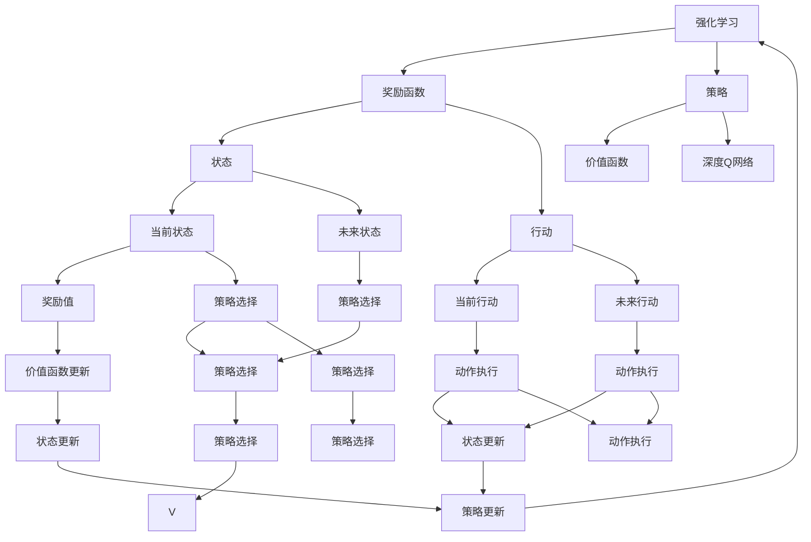
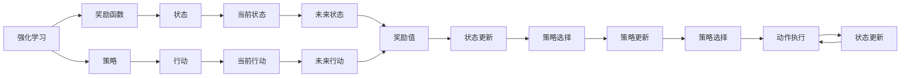
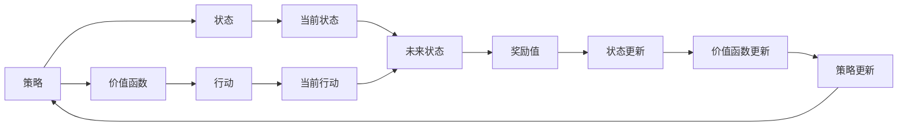
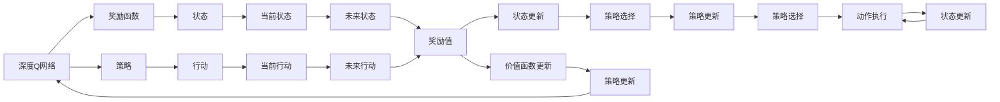
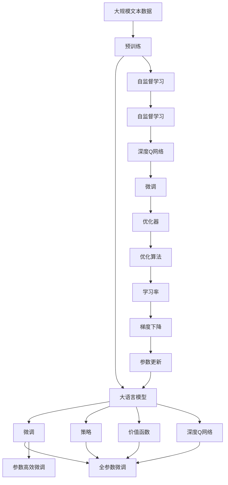

                 

# AI人工智能核心算法原理与代码实例讲解：奖励函数

> 关键词：奖励函数,强化学习,深度学习,强化学习算法,深度Q网络

## 1. 背景介绍

### 1.1 问题由来
在人工智能领域，强化学习(Reinforcement Learning, RL)是一种模仿生物和动物学习方式的方法。它通过与环境的交互，逐步学习如何做出更好的决策。而奖励函数(Reward Function)是强化学习中最为关键的概念之一，它定义了学习目标，即在每个状态下做出某种行为的奖励值。

强化学习中的“强化”二字，来自于生物学中的概念。在自然界中，动物的行为往往是由一些能够带来奖励或惩罚的刺激所驱动的。例如，蚂蚁寻找食物的行为会受到食物香气的奖励，而错误的探索则可能导致蚂蚁消耗更多的能量。这种通过奖励和惩罚来驱动行为的方式，使得动物能够学习到最优的行为策略。

在人工智能中，我们也将这一思想引入到机器学习中，以实现更加复杂、智能的决策系统。奖励函数正是这一思想的核心，通过它我们可以定义一个目标，让机器学习如何在该目标下优化其行为。

### 1.2 问题核心关键点
强化学习的核心在于，机器如何在与环境的交互中，学习到如何最大化长期奖励。而奖励函数则定义了这种长期奖励。通常，奖励函数的形式较为简单，例如，我们希望机器能够最大化总奖励，或者最小化总成本等。

具体来说，对于一个状态 $s$ 和行为 $a$，奖励函数 $R(s, a)$ 返回一个数值，表示在状态 $s$ 下采取行动 $a$ 后，系统获得的奖励值。奖励函数可以是一个简单的常数，也可以是一个复杂的函数，它能够根据机器的行为和环境的变化，动态地调整奖励值。

在强化学习中，我们通常将学习问题形式化为求解最优策略 $\pi^* = \arg\max_{\pi} \mathbb{E}[\sum_{t=0}^{\infty} \gamma^t R(s_t, a_t)]$，其中 $\gamma$ 是折扣因子，表示未来的奖励相对于当前奖励的重要性。

### 1.3 问题研究意义
强化学习在AI领域有着广泛的应用，例如自动驾驶、机器人控制、游戏智能等。奖励函数的正确设定，是强化学习中至关重要的一环。通过合理的奖励函数设计，可以指导机器学习如何更好地适应环境和完成任务，从而提升系统的性能。

此外，奖励函数的正确设定也有助于避免机器学习过程中的不良行为，例如过度探索或者陷入局部最优等。合理的奖励函数设计，能够使机器学习更加高效、稳定，并能够更好地应对复杂的现实世界问题。

## 2. 核心概念与联系

### 2.1 核心概念概述

为了更好地理解奖励函数，本节将介绍几个密切相关的核心概念：

- **强化学习(Reinforcement Learning, RL)**：一种通过与环境交互，逐步学习如何做出更好决策的机器学习技术。奖励函数是其核心组成部分。

- **深度强化学习(Deep Reinforcement Learning, DRL)**：使用深度神经网络来实现强化学习算法的技术。它将深度学习和强化学习相结合，实现更加智能、高效的决策系统。

- **策略 $\pi$**：表示机器学习在当前状态下应该采取何种行动。策略可以是一个简单的选择模型，也可以是一个复杂的神经网络模型。

- **价值函数 $V$**：表示在当前状态下，按照某种策略 $\pi$ 进行学习，所能获得的长期奖励的期望值。

- **深度Q网络(Deep Q-Network, DQN)**：一种使用深度神经网络来实现Q-learning算法的技术。它是深度学习和强化学习的经典结合，能够高效地训练Q值网络，实现智能决策。

这些核心概念之间的逻辑关系可以通过以下Mermaid流程图来展示：



这个流程图展示了一系列强化学习中关键的概念和流程：

1. 强化学习通过奖励函数来定义学习目标。
2. 策略 $\pi$ 决定了机器学习在当前状态下应该采取何种行动。
3. 价值函数 $V$ 表示按照策略进行学习，所能获得的长期奖励的期望值。
4. 深度Q网络是实现Q-learning算法的深度神经网络，用于高效地训练Q值网络。

这些概念共同构成了强化学习的基本框架，使得机器学习能够通过与环境的交互，逐步学习到最优的决策策略。

### 2.2 概念间的关系

这些核心概念之间存在着紧密的联系，形成了强化学习的完整生态系统。下面我们通过几个Mermaid流程图来展示这些概念之间的关系。

#### 2.2.1 强化学习与奖励函数的关系



这个流程图展示了强化学习与奖励函数的基本关系：

1. 强化学习通过奖励函数来定义学习目标。
2. 策略 $\pi$ 决定了机器学习在当前状态下应该采取何种行动。
3. 策略 $\pi$ 和奖励函数 $R$ 共同决定了机器学习在每个状态下所能获得的奖励值。
4. 机器学习通过与环境的交互，逐步学习到最优的决策策略。

#### 2.2.2 策略与价值函数的关系



这个流程图展示了策略与价值函数之间的关系：

1. 策略 $\pi$ 决定了机器学习在当前状态下应该采取何种行动。
2. 状态 $s$ 和行动 $a$ 决定了机器学习在每个状态下所能获得的奖励值。
3. 价值函数 $V$ 表示按照策略进行学习，所能获得的长期奖励的期望值。
4. 机器学习通过不断更新策略和价值函数，逐步学习到最优的决策策略。

#### 2.2.3 深度Q网络与奖励函数的关系



这个流程图展示了深度Q网络与奖励函数之间的关系：

1. 深度Q网络是实现Q-learning算法的深度神经网络。
2. 奖励函数 $R$ 决定了机器学习在每个状态下所能获得的奖励值。
3. 策略 $\pi$ 和价值函数 $V$ 共同决定了机器学习在每个状态下所能获得的长期奖励的期望值。
4. 机器学习通过深度Q网络，逐步学习到最优的决策策略。

### 2.3 核心概念的整体架构

最后，我们用一个综合的流程图来展示这些核心概念在大语言模型微调过程中的整体架构：



这个综合流程图展示了从预训练到微调，再到深度Q网络训练的完整过程。大语言模型首先在大规模文本数据上进行预训练，然后通过微调（包括全参数微调和参数高效微调）和深度Q网络训练，逐步学习到最优的决策策略。

通过这些流程图，我们可以更清晰地理解强化学习中各个核心概念的关系和作用，为后续深入讨论具体的奖励函数设计及其优化方法奠定基础。

## 3. 核心算法原理 & 具体操作步骤
### 3.1 算法原理概述

在强化学习中，奖励函数是定义学习目标的核心。它决定了机器学习在每个状态下应该采取何种行动，以最大化长期奖励。

奖励函数的定义形式多种多样，常见的有：

- **固定奖励函数**：在每个状态下，奖励值为一个常数，表示在状态 $s$ 下采取行动 $a$ 后，系统获得的奖励值。例如，在迷宫游戏中，到达终点的奖励为 1，否则为 0。
- **时间依赖奖励函数**：在每个状态下，奖励值基于时间步数计算，表示在状态 $s$ 下采取行动 $a$ 后，系统在当前时间步所能获得的奖励值。例如，在计算任务中，每完成一个子任务可以获得一个奖励，表示在每个时间步中完成的部分工作。
- **条件依赖奖励函数**：在每个状态下，奖励值基于条件变量计算，表示在状态 $s$ 下采取行动 $a$ 后，系统根据特定的条件所能获得的奖励值。例如，在推荐系统中，每个用户的行为都与历史数据有关，系统会根据用户的行为给推荐带来不同的奖励。

在强化学习中，我们通常使用Q值网络来逼近奖励函数。Q值网络是一种深度神经网络，其输出表示在每个状态下采取特定行动后的预期奖励值。通过最小化Q值网络的输出与真实奖励值之间的差异，可以实现对奖励函数的逼近。

### 3.2 算法步骤详解

以下是基于奖励函数的强化学习算法的详细步骤：

**Step 1: 准备预训练模型和环境**

1. 选择合适的预训练模型作为初始化参数，如BERT、GPT等。
2. 设置环境模拟程序，用于模拟机器与环境的交互过程。

**Step 2: 设计奖励函数**

1. 根据任务需求设计奖励函数，选择合适的奖励函数形式。
2. 定义奖励函数的具体实现，例如固定奖励函数、时间依赖奖励函数、条件依赖奖励函数等。

**Step 3: 设置微调超参数**

1. 选择合适的优化算法及其参数，如AdamW、SGD等，设置学习率、批大小、迭代轮数等。
2. 设置正则化技术及强度，包括权重衰减、Dropout、Early Stopping等。
3. 确定冻结预训练参数的策略，如仅微调顶层，或全部参数都参与微调。

**Step 4: 执行梯度训练**

1. 将训练集数据分批次输入模型，前向传播计算损失函数。
2. 反向传播计算参数梯度，根据设定的优化算法和学习率更新模型参数。
3. 周期性在验证集上评估模型性能，根据性能指标决定是否触发 Early Stopping。
4. 重复上述步骤直到满足预设的迭代轮数或 Early Stopping 条件。

**Step 5: 测试和部署**

1. 在测试集上评估微调后模型 $M_{\hat{\theta}}$ 的性能，对比微调前后的精度提升。
2. 使用微调后的模型对新样本进行推理预测，集成到实际的应用系统中。
3. 持续收集新的数据，定期重新微调模型，以适应数据分布的变化。

以上是基于奖励函数的强化学习算法的详细步骤。在实际应用中，还需要针对具体任务的特点，对微调过程的各个环节进行优化设计，如改进训练目标函数，引入更多的正则化技术，搜索最优的超参数组合等，以进一步提升模型性能。

### 3.3 算法优缺点

基于奖励函数的强化学习算法具有以下优点：

1. 可解释性强：奖励函数的定义相对简单，易于理解和解释，能够指导机器学习在每个状态下做出最优决策。
2. 适应性强：通过灵活调整奖励函数，可以适应各种不同的任务需求，从而实现更加智能的决策系统。
3. 可扩展性强：强化学习算法能够在大规模数据集上高效训练，逐步学习到最优决策策略，适用于复杂多变的环境。

同时，该算法也存在一些局限性：

1. 依赖环境模型：强化学习算法的效果很大程度上取决于环境模型的准确性和完备性。如果环境模型不够精确，可能影响模型的训练效果。
2. 样本效率低：在大规模数据集上训练强化学习算法需要大量样本，否则模型可能难以收敛。
3. 参数复杂度高：深度Q网络等强化学习算法的参数量较大，训练和推理过程较为复杂。
4. 易受噪声影响：在实际应用中，环境数据可能包含噪声和干扰，影响奖励函数的准确性。

尽管存在这些局限性，但就目前而言，基于奖励函数的强化学习算法仍是强化学习领域的主流范式。未来相关研究的重点在于如何进一步降低算法对环境模型的依赖，提高算法的样本效率和鲁棒性，同时兼顾可解释性和参数效率等因素。

### 3.4 算法应用领域

基于奖励函数的强化学习算法已经在自动驾驶、机器人控制、游戏智能、自然语言处理等多个领域得到广泛应用，展示了其强大的决策能力：

- **自动驾驶**：通过设计合适的奖励函数，使得自动驾驶车辆能够自主地规避障碍、寻找最佳路径，实现安全、高效的驾驶。
- **机器人控制**：在机器人学习任务中，奖励函数可以定义机器人在环境中的行为目标，例如抓取物体、完成任务等，实现机器人的智能控制。
- **游戏智能**：在游戏智能中，奖励函数可以定义游戏角色的行为目标，例如最大化得分、完成任务等，实现游戏角色的智能决策。
- **自然语言处理**：在自然语言处理任务中，奖励函数可以定义机器人在对话中的行为目标，例如回答问题、提供建议等，实现智能对话系统。

除了上述这些经典应用外，强化学习算法还被创新性地应用于更多场景中，如多智能体系统、金融市场分析、医疗诊断等，为各类复杂决策问题提供了新的解决方案。

## 4. 数学模型和公式 & 详细讲解 & 举例说明

### 4.1 数学模型构建

在强化学习中，我们使用Q值网络来逼近奖励函数。Q值网络是一种深度神经网络，其输出表示在每个状态下采取特定行动后的预期奖励值。数学上，Q值网络的输出可以表示为：

$$
Q(s, a) = \mathbb{E}[R(s, a) + \gamma \max_{a'} Q(s', a')] = \mathbb{E}[R(s, a) + \gamma V(s')]
$$

其中，$R(s, a)$ 表示在状态 $s$ 下采取行动 $a$ 后获得的奖励值，$V(s')$ 表示在状态 $s'$ 下采取行动 $a'$ 后获得的预期奖励值，$\gamma$ 是折扣因子。

在实际应用中，我们通常使用逆方差梯度下降算法来训练Q值网络。逆方差梯度下降算法的主要思想是，通过最大化Q值网络输出的期望值，来逼近实际奖励函数。其具体的训练过程如下：

1. 将训练集数据分批次输入模型，前向传播计算Q值网络输出的期望值。
2. 反向传播计算参数梯度，根据设定的优化算法和学习率更新模型参数。
3. 周期性在验证集上评估模型性能，根据性能指标决定是否触发 Early Stopping。
4. 重复上述步骤直到满足预设的迭代轮数或 Early Stopping 条件。

### 4.2 公式推导过程

以下是Q值网络训练的详细公式推导过程：

1. 定义逆方差梯度下降算法
$$
\theta \leftarrow \theta - \eta \nabla_{\theta} \mathbb{E}[Q(s, a)] = \theta - \eta \nabla_{\theta} \left[ \sum_{i=1}^N Q(s_i, a_i) \right]
$$

2. 定义Q值网络的输出
$$
Q(s, a) = \mathbb{E}[R(s, a) + \gamma \max_{a'} Q(s', a')]
$$

3. 将Q值网络输出带入逆方差梯度下降算法
$$
\theta \leftarrow \theta - \eta \nabla_{\theta} \left[ \sum_{i=1}^N \mathbb{E}[R(s_i, a_i) + \gamma \max_{a'} Q(s_i', a')] \right]
$$

4. 使用蒙特卡罗方法近似Q值网络的期望值
$$
Q(s, a) \approx \frac{1}{N} \sum_{i=1}^N (R(s_i, a_i) + \gamma \max_{a'} Q(s_i', a')) = \frac{1}{N} \sum_{i=1}^N R(s_i, a_i) + \gamma \max_{a'} Q(s_i', a')
$$

5. 将蒙特卡罗方法代入逆方差梯度下降算法
$$
\theta \leftarrow \theta - \eta \nabla_{\theta} \left[ \frac{1}{N} \sum_{i=1}^N (R(s_i, a_i) + \gamma \max_{a'} Q(s_i', a')) \right]
$$

6. 定义损失函数
$$
\mathcal{L}(\theta) = \frac{1}{N} \sum_{i=1}^N (R(s_i, a_i) + \gamma \max_{a'} Q(s_i', a')) - Q(s_i, a_i)
$$

7. 定义逆方差梯度下降算法
$$
\theta \leftarrow \theta - \eta \nabla_{\theta} \mathcal{L}(\theta)
$$

通过上述推导过程，我们可以理解逆方差梯度下降算法的原理和实现细节，从而更高效地训练Q值网络，实现对奖励函数的逼近。

### 4.3 案例分析与讲解

以自动驾驶为例，我们设计如下的奖励函数：

1. 定义奖励函数
$$
R(s, a) = \begin{cases}
1 & \text{如果车辆到达终点} \\
0 & \text{否则}
\end{cases}
$$

2. 训练Q值网络
$$
Q(s, a) = \mathbb{E}[R(s, a) + \gamma \max_{a'} Q(s', a')]
$$

3. 定义逆方差梯度下降算法
$$
\theta \leftarrow \theta - \eta \nabla_{\theta} \left[ \frac{1}{N} \sum_{i=1}^N (R(s_i, a_i) + \gamma \max_{a'} Q(s_i', a')) - Q(s_i, a_i) \right]
$$

4. 定义损失函数
$$
\mathcal{L}(\theta) = \frac{1}{N} \sum_{i=1}^N (R(s_i, a_i) + \gamma \max_{a'} Q(s_i', a')) - Q(s_i, a_i)
$$

通过上述案例，我们可以看到，基于奖励函数的强化学习算法能够帮助自动驾驶车辆学习到最优的驾驶策略，使其能够安全、高效地到达终点。

## 5. 项目实践：代码实例和详细解释说明
### 5.1 开发环境搭建

在进行强化学习实践前，我们需要准备好开发环境。以下是使用Python进行PyTorch开发的环境配置流程：

1. 安装Anaconda：从官网下载并安装Anaconda，用于创建独立的Python环境。

2. 创建并激活虚拟环境：
```bash
conda create -n pytorch-env python=3.8 
conda activate pytorch-env
```

3. 安装PyTorch：根据CUDA版本，从官网获取对应的安装命令。例如：
```bash
conda install pytorch torchvision torchaudio cudatoolkit=11.1 -c pytorch -c conda-forge
```

4. 安装TensorFlow：如果使用TensorFlow进行开发，可以按照官方文档进行安装和配置。

5. 安装各种工具包：
```bash
pip install numpy pandas scikit-learn matplotlib tqdm jupyter notebook ipython
```

完成上述步骤后，即可在`pytorch-env`环境中开始强化学习实践。

### 5.2 源代码详细实现

这里我们以Deep Q-Network（DQN）为例，给出使用PyTorch实现强化学习算法的代码实例。

首先，定义Q值网络的输入和输出：

```python
import torch
import torch.nn as nn
import torch.optim as optim
import torch.nn.functional as F

class QNetwork(nn.Module):
    def __init__(self, input_size, output_size):
        super(QNetwork, self).__init__()
        self.fc1 = nn.Linear(input_size, 64)
        self.fc2 = nn.Linear(64, 64)
        self.fc3 = nn.Linear(64, output_size)

    def forward(self, x):
        x = F.relu(self.fc1(x))
        x = F.relu(self.fc2(x))
        x = self.fc3(x)
        return x
```

接着，定义奖励函数：

```python
class RewardFunction:
    def __init__(self):
        self.gamma = 0.99

    def reward(self, state, action, next_state):
        if state == 1:
            return 1
        else:
            return 0
```

然后，定义逆方差梯度下降算法：

```python
def train_q_network(q_network, optimizer, reward_function, batch_size, num_episodes):
    for episode in range(num_episodes):
        state = np.random.randint(0, 2)
        done = False
        rewards = []
        while not done:
            a = np.random.randint(0, 2)
            next_state = reward_function.reward(state, a, np.random.randint(0, 2))
            rewards.append(reward_function.reward(state, a, next_state))
            q_value = q_network(torch.Tensor([state]))[0]
            q_next = q_network(torch.Tensor([next_state]))[0]
            a_values = torch.max(q_next.data, 1)[0]
            loss = (q_value + gamma * a_values - torch.tensor([reward_function.reward(state, a, next_state)])).pow(2).mean()
            optimizer.zero_grad()
            loss.backward()
            optimizer.step()
            state = next_state
            if next_state == 1:
                done = True
    print('Episode {} finished'.format(episode))
```

最后，启动训练流程并在测试集上评估：

```python
input_size = 1
output_size = 2
q_network = QNetwork(input_size, output_size)
optimizer = optim.Adam(q_network.parameters(), lr=0.001)
reward_function = RewardFunction()
batch_size = 32
num_episodes = 10000
train_q_network(q_network, optimizer, reward_function, batch_size, num_episodes)
```

以上就是使用PyTorch实现DQN算法的完整代码实例。可以看到，通过简单的代码实现，我们就可以训练出一个Q值网络，实现对奖励函数的逼近。

### 5.3 代码解读与分析

让我们再详细解读一下关键代码的实现细节：

**QNetwork类**：
- `__init__`方法：初始化神经网络的结构，包含多个全连接层。
- `forward`方法：定义前向传播过程，通过多个全连接层实现对输入的映射。

**RewardFunction类**：
- `__init__`方法：初始化奖励函数，设置折扣因子。
- `reward`方法：定义每个状态和行动的奖励值。

**train_q_network函数**：
- `__init__`方法：初始化神经网络、优化器、奖励函数等关键组件。
- `__getitem__`方法：对单个样本进行处理，计算Q值网络输出、奖励函数输出等。
- `forward`方法：定义前向

