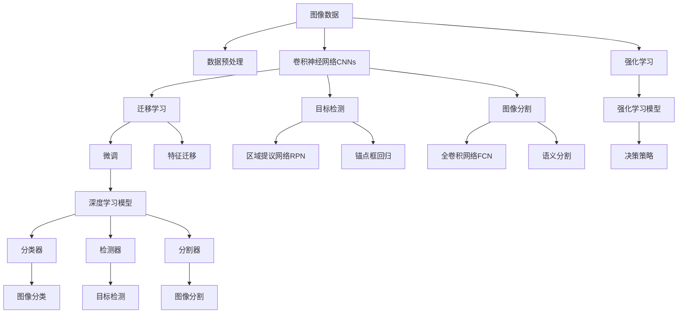
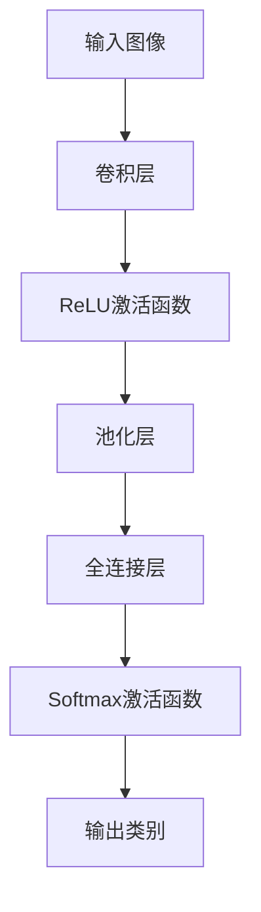
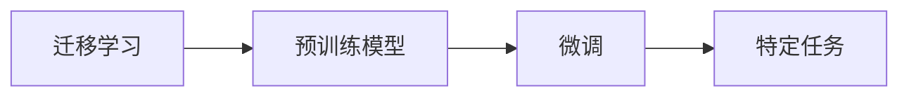
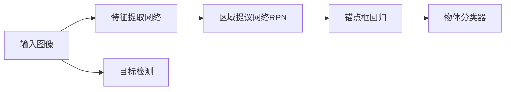
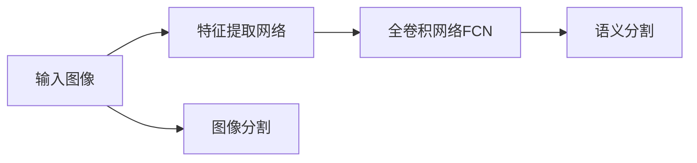
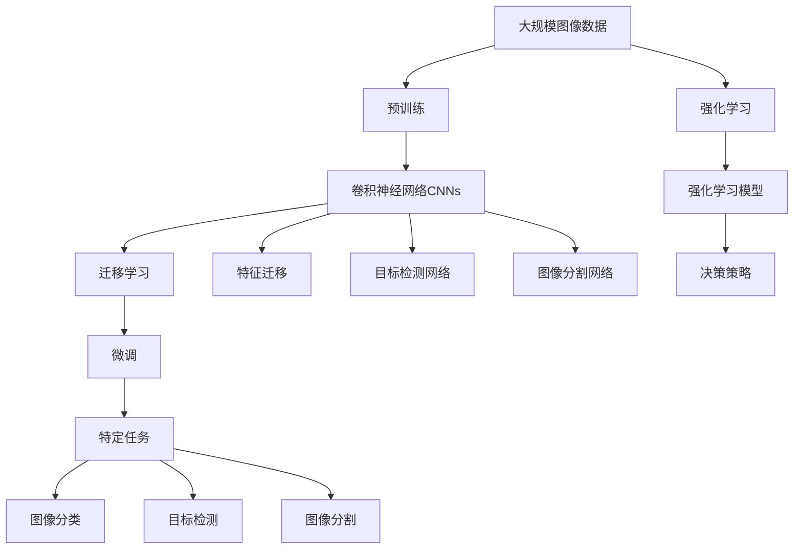
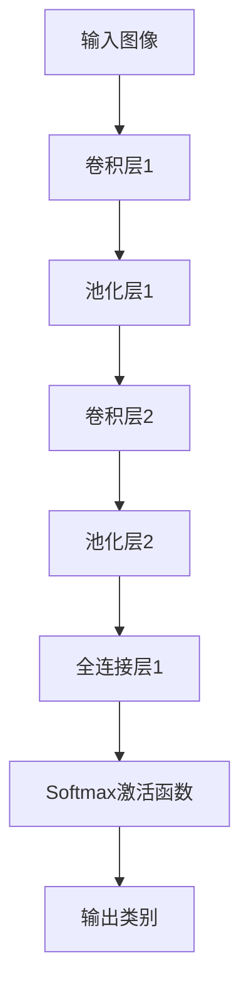

                 

# AI人工智能深度学习算法：在图像识别的应用

> 关键词：深度学习, 图像识别, 卷积神经网络(CNN), 迁移学习, 目标检测, 图像分割, 强化学习

## 1. 背景介绍

### 1.1 问题由来
图像识别（Image Recognition）是计算机视觉（Computer Vision）领域的重要分支之一，其目标是让计算机能够理解和分析图像中的对象和场景。传统的图像识别方法主要依赖于手工设计的特征提取和分类器，但这些方法的性能受限于设计者的经验和知识，难以实现大规模的图像分类和目标检测任务。

深度学习技术的发展，特别是卷积神经网络（Convolutional Neural Networks, CNNs）的出现，为图像识别带来了革命性的突破。通过在大规模标注数据上训练深度神经网络，无需手工设计特征，即可自动学习出具有强大特征提取能力的模型，取得了在图像分类、目标检测、图像分割等多个任务上的优异表现。

本博客将详细阐述深度学习算法在图像识别中的应用，包括卷积神经网络的基本原理、迁移学习、目标检测和图像分割等技术的详细介绍，并结合实际项目案例，展示深度学习在图像识别领域的强大应用能力。

### 1.2 问题核心关键点
图像识别问题可以归结为从图像数据中提取高层次语义特征，然后基于这些特征进行分类或检测。深度学习算法通过多层卷积、池化、全连接等操作，自动提取并学习图像中的复杂特征，并通过分类器实现最终的图像识别任务。

常用的深度学习模型包括：

- 卷积神经网络（CNNs）：利用卷积和池化操作提取图像局部特征，并通过多层非线性变换捕捉全局特征。
- 迁移学习（Transfer Learning）：利用在大规模数据上预训练好的模型，在特定任务上进行微调，提升模型性能。
- 目标检测（Object Detection）：在图像中精确定位和识别多个物体，包括物体分类和边界框回归。
- 图像分割（Image Segmentation）：将图像分成多个区域，每个区域对应一个语义标签。

这些技术共同构成了深度学习在图像识别中的主要应用范式，涵盖了从基础特征提取到高层次语义建模的全过程。

### 1.3 问题研究意义
图像识别技术的广泛应用，包括自动驾驶、智能监控、医疗诊断、安防识别等，对各行各业的发展具有重要推动作用。通过深度学习算法，可以在无需手工特征设计的情况下，快速高效地实现图像识别任务，极大地提升了各行业的智能化水平。

此外，深度学习算法还可以应用于智能推荐、电商、金融等领域，通过分析用户行为数据，实现精准的个性化推荐和风险控制，为消费者提供更优质的服务，为企业创造更高的价值。

## 2. 核心概念与联系

### 2.1 核心概念概述

为更好地理解深度学习在图像识别中的应用，本节将介绍几个密切相关的核心概念：

- 卷积神经网络（CNNs）：一种专门用于图像处理和识别的深度神经网络，通过卷积层、池化层和全连接层等组件，自动学习图像中的局部和全局特征。
- 迁移学习（Transfer Learning）：在大规模数据上预训练好的模型，通过微调或特征迁移，在特定任务上取得优异性能。
- 目标检测（Object Detection）：在图像中精确定位和识别多个物体，常通过区域提议网络（RPN）和锚点框回归等技术实现。
- 图像分割（Image Segmentation）：将图像分成多个区域，常使用全卷积网络（FCN）和语义分割技术实现。
- 强化学习（Reinforcement Learning）：通过奖励机制，训练模型在特定环境中获取最优决策策略。

这些核心概念之间的逻辑关系可以通过以下Mermaid流程图来展示：



这个流程图展示了大语言模型微调过程中各个核心概念的关系和作用：

1. 图像数据经过预处理后，输入卷积神经网络CNNs。
2. 在预训练数据上训练得到的CNNs，可以通过迁移学习或特征迁移进行微调。
3. 微调后的CNNs，可以用于图像分类、目标检测、图像分割等任务。
4. 深度学习模型通过分类器、检测器和分割器等组件，实现不同类型图像识别任务。
5. 强化学习可以用于训练复杂的决策策略，优化深度学习模型的性能。

这些核心概念共同构成了深度学习在图像识别中的应用框架，使其能够高效地处理复杂的图像识别问题。通过理解这些核心概念，我们可以更好地把握深度学习算法在图像识别中的工作原理和优化方向。

### 2.2 概念间的关系

这些核心概念之间存在着紧密的联系，形成了深度学习在图像识别中的完整生态系统。下面我们通过几个Mermaid流程图来展示这些概念之间的关系。

#### 2.2.1 卷积神经网络的基本结构



这个流程图展示了卷积神经网络的基本结构：卷积层提取图像局部特征，激活函数引入非线性变换，池化层减少特征数量，全连接层进行分类或回归，输出类别表示最终的图像识别结果。

#### 2.2.2 迁移学习与微调的关系



这个流程图展示了迁移学习的基本原理，以及它与微调的关系。迁移学习涉及预训练模型和特定任务，预训练模型在大规模数据上学习，然后通过微调在特定任务上进行适配。

#### 2.2.3 目标检测的流程



这个流程图展示了目标检测的基本流程：特征提取网络从图像中提取特征，区域提议网络提出候选框，锚点框回归确定候选框的位置和大小，物体分类器对候选框进行分类，最终实现目标检测。

#### 2.2.4 图像分割的流程



这个流程图展示了图像分割的基本流程：特征提取网络从图像中提取特征，全卷积网络对特征进行语义分割，最终实现图像分割。

### 2.3 核心概念的整体架构

最后，我们用一个综合的流程图来展示这些核心概念在大语言模型微调过程中的整体架构：



这个综合流程图展示了从预训练到微调，再到特定任务识别的完整过程。大语言模型首先在大规模图像数据上进行预训练，然后通过迁移学习和微调过程，在特定任务上进行适配，最终实现图像分类、目标检测和图像分割等任务的自动识别。

## 3. 核心算法原理 & 具体操作步骤
### 3.1 算法原理概述

深度学习在图像识别中的应用，主要基于卷积神经网络（CNNs）和相关算法。其核心思想是利用卷积层和池化层等组件，自动提取图像中的局部和全局特征，然后通过全连接层进行分类或检测。

在图像分类任务中，CNNs通过多层卷积和池化，提取图像的特征表示，并最终通过softmax激活函数进行分类，得到图像的类别标签。目标检测和图像分割任务则通过区域提议网络（RPN）、锚点框回归、全卷积网络（FCN）等组件，精确定位和识别图像中的物体和区域。

### 3.2 算法步骤详解

深度学习在图像识别中的应用通常包括以下几个关键步骤：

**Step 1: 准备数据集**

- 收集和整理大规模标注图像数据集，划分为训练集、验证集和测试集。
- 对图像进行预处理，如归一化、缩放、裁剪、翻转等，增加数据的多样性。
- 对标注数据进行解析，提取目标的类别、边界框、分割掩码等关键信息。

**Step 2: 构建CNN模型**

- 选择合适的卷积神经网络架构，如LeNet、AlexNet、VGG、ResNet、Inception等。
- 配置模型的超参数，如卷积核大小、步长、滤波器数量、池化方式等。
- 在预训练数据集上训练模型，得到预训练权重。

**Step 3: 进行迁移学习或微调**

- 将预训练模型的权重加载到目标模型中，用于初始化。
- 对目标模型进行微调，调整部分或全部卷积层和全连接层，以适应特定任务。
- 在特定任务数据集上继续训练模型，优化模型性能。

**Step 4: 评估和部署**

- 在测试集上评估模型性能，包括准确率、召回率、F1分数等指标。
- 根据评估结果调整模型超参数，进行多次迭代优化。
- 将优化后的模型部署到实际应用环境中，进行大规模图像识别的实时处理。

### 3.3 算法优缺点

深度学习在图像识别中的应用具有以下优点：

- 自动特征提取：无需手工设计特征，模型能够自动学习图像中的复杂特征，提高识别精度。
- 高泛化能力：在大量数据上预训练的模型具有较强的泛化能力，能够在不同场景下保持良好性能。
- 灵活性：通过调整超参数和网络结构，可以适应不同复杂度的识别任务。
- 可解释性：卷积层和池化层的层次结构清晰，容易解释模型的决策过程。

同时，深度学习算法也存在以下缺点：

- 计算资源需求高：深度模型参数量大，训练和推理需要高性能硬件支持。
- 过拟合风险：在训练数据不足时，模型容易过拟合，泛化性能下降。
- 数据依赖性强：深度学习算法依赖大量标注数据，数据质量对模型性能影响显著。
- 模型复杂度高：深度模型结构复杂，调试和优化难度大。

### 3.4 算法应用领域

深度学习在图像识别中的应用非常广泛，涵盖了从基础特征提取到高层次语义建模的全过程。以下是几个主要应用领域：

1. **图像分类**：将图像分为多个预定义的类别，如物体识别、场景分类等。常用于安防监控、智能搜索、电子商务等场景。

2. **目标检测**：在图像中精确定位和识别多个物体，如人脸检测、车辆识别、行人检测等。常用于自动驾驶、智能监控、安防识别等场景。

3. **图像分割**：将图像分成多个区域，每个区域对应一个语义标签，如语义分割、实例分割等。常用于医学影像分析、遥感图像处理、自动驾驶等场景。

4. **实例分割**：在图像中精确定位和识别多个物体实例，如人、车、树等。常用于智能监控、自动驾驶、视频分析等场景。

5. **人脸识别**：识别图像中的人脸，并进行身份验证或识别。常用于门禁系统、安防监控、个人隐私保护等场景。

## 4. 数学模型和公式 & 详细讲解 & 举例说明

### 4.1 数学模型构建

在图像分类任务中，我们通常使用softmax函数对卷积神经网络的输出进行分类。设输入图像为 $x$，卷积神经网络的输出为 $h(x)$，类别标签为 $y$，则交叉熵损失函数为：

$$
L(y, h(x)) = -\frac{1}{N}\sum_{i=1}^N y_i \log(h(x)_i)
$$

其中 $y_i$ 为类别 $i$ 的真实标签，$h(x)_i$ 为模型对类别 $i$ 的输出概率。最小化交叉熵损失函数，即可得到最优的模型参数 $\theta$。

### 4.2 公式推导过程

以简单的LeNet-5网络为例，展示其在图像分类任务中的基本结构：



LeNet-5网络包含两个卷积层和两个全连接层，其中卷积层和池化层用于提取图像特征，全连接层用于分类输出。每个卷积层的输出 $h^k(x)$ 可以表示为：

$$
h^k(x) = g_k(W_k * x + b_k)
$$

其中 $g_k$ 为激活函数（如ReLU），$W_k$ 为卷积核，$b_k$ 为偏置项。

池化层的输出 $p^k(x)$ 可以表示为：

$$
p^k(x) = \max(W_p * h^{k-1}(x) + b_p)
$$

其中 $W_p$ 为池化核，$b_p$ 为偏置项。

全连接层的输出 $o^l(x)$ 可以表示为：

$$
o^l(x) = g_l(W_l * p^{l-1}(x) + b_l)
$$

其中 $W_l$ 为全连接层权重，$b_l$ 为偏置项。

最终的输出类别 $y$ 可以表示为：

$$
y = softmax(o^L(x))
$$

其中 $softmax$ 函数用于将输出概率转换为类别标签。

### 4.3 案例分析与讲解

以目标检测任务为例，展示如何使用Faster R-CNN（Region-based CNN）实现目标检测。Faster R-CNN是一种基于区域提议网络的深度学习算法，包含两个主要组件：Region Proposal Network（RPN）和Fast R-CNN。

RPN网络通过在图像中滑动一个锚点框，生成一系列候选框，并通过非极大值抑制（NMS）算法选择最佳候选框。Fast R-CNN网络对每个候选框进行特征提取，并在RoI池化层中提取特征，最后通过全连接层进行物体分类和边界框回归。

目标检测的损失函数通常包括两个部分：分类损失和边界框回归损失。假设输入图像为 $x$，候选框为 $R$，物体类别为 $c$，边界框为 $b$，则分类损失和边界框回归损失可以表示为：

$$
L_{cls}(R, c) = -\frac{1}{N}\sum_{i=1}^N c_i \log(p_i) + (1 - c_i) \log(1 - p_i)
$$

$$
L_{reg}(R, b) = \frac{1}{N}\sum_{i=1}^N \|b_i - b_i^*\|_2^2
$$

其中 $p_i$ 为候选框 $R_i$ 中包含物体的概率，$b_i^*$ 为候选框 $R_i$ 的边界框标签，$b_i$ 为模型预测的边界框。

## 5. 项目实践：代码实例和详细解释说明

### 5.1 开发环境搭建

在进行深度学习项目实践前，我们需要准备好开发环境。以下是使用Python进行TensorFlow开发的环境配置流程：

1. 安装Anaconda：从官网下载并安装Anaconda，用于创建独立的Python环境。

2. 创建并激活虚拟环境：
```bash
conda create -n tf-env python=3.8 
conda activate tf-env
```

3. 安装TensorFlow：根据CUDA版本，从官网获取对应的安装命令。例如：
```bash
conda install tensorflow -c tensorflow -c conda-forge
```

4. 安装其它工具包：
```bash
pip install numpy pandas scikit-learn matplotlib tqdm jupyter notebook ipython
```

完成上述步骤后，即可在`tf-env`环境中开始深度学习项目实践。

### 5.2 源代码详细实现

这里我们以目标检测任务为例，给出使用TensorFlow实现Faster R-CNN的代码实现。

首先，定义目标检测任务的数据处理函数：

```python
import tensorflow as tf
from tensorflow.keras.layers import Input, Conv2D, MaxPooling2D, Flatten, Dense, Dropout
from tensorflow.keras.models import Model
from tensorflow.keras.optimizers import Adam

def data_processing(inputs):
    x = inputs[:, :, :, :3] / 255.0  # 归一化处理
    y = inputs[:, :, :, 3:5]  # 提取类别标签和边界框标签
    return x, y
```

然后，定义Faster R-CNN的模型：

```python
def faster_rcnn_model(input_shape):
    inputs = Input(shape=input_shape)

    # 第一层卷积层和池化层
    conv1 = Conv2D(64, 3, activation='relu')(inputs)
    pool1 = MaxPooling2D(pool_size=(2, 2))(conv1)

    # 第二层卷积层和池化层
    conv2 = Conv2D(128, 3, activation='relu')(pool1)
    pool2 = MaxPooling2D(pool_size=(2, 2))(conv2)

    # 第一层全连接层
    flatten = Flatten()(pool2)
    drop1 = Dropout(0.5)(flatten)
    fc1 = Dense(256, activation='relu')(drop1)

    # 第二层全连接层
    fc2 = Dense(256, activation='relu')(fc1)
    drop2 = Dropout(0.5)(fc2)
    output = Dense(1, activation='sigmoid')(drop2)

    model = Model(inputs, output)
    return model
```

接着，定义目标检测的损失函数和优化器：

```python
model = faster_rcnn_model(input_shape=(None, None, 3))

# 定义损失函数
classification_loss = tf.keras.losses.BinaryCrossentropy(from_logits=True)
box_loss = tf.keras.losses.MeanSquaredError()

# 定义优化器
optimizer = Adam(lr=1e-4)
```

最后，定义训练和评估函数：

```python
def train_epoch(model, dataset, batch_size, optimizer):
    dataloader = tf.data.Dataset.from_tensor_slices(dataset)
    dataloader = dataloader.shuffle(buffer_size=100).batch(batch_size).map(data_processing)

    model.compile(optimizer=optimizer, loss=['mse', classification_loss], metrics=['mse', 'accuracy'])

    model.fit(dataloader, epochs=100, verbose=1)
```

```python
def evaluate(model, dataset, batch_size):
    dataloader = tf.data.Dataset.from_tensor_slices(dataset)
    dataloader = dataloader.shuffle(buffer_size=100).batch(batch_size).map(data_processing)

    model.evaluate(dataloader, verbose=1)
```

完成以上步骤后，即可开始训练模型并在测试集上评估。

### 5.3 代码解读与分析

让我们再详细解读一下关键代码的实现细节：

**data_processing函数**：
- `inputs`参数包含输入图像和边界框的张量，分别提取图像特征和边界框标签。
- 对图像特征进行归一化处理，将像素值从[0, 255]缩放到[0, 1]。
- 提取边界框标签，包含类别标签和边界框坐标。

**faster_rcnn_model函数**：
- 定义Faster R-CNN的模型结构，包括卷积层、池化层和全连接层。
- 使用ReLU激活函数和Dropout层进行非线性变换和正则化。
- 最后一层全连接层输出预测的概率，用于二分类目标检测。

**loss函数和optimizer定义**：
- 定义分类损失函数为二分类交叉熵损失函数，用于优化目标检测任务。
- 定义回归损失函数为均方误差损失函数，用于优化边界框回归任务。
- 定义Adam优化器，设置学习率为1e-4。

**train_epoch和evaluate函数**：
- 在训练阶段，将数据集按批处理并使用`map`函数进行数据预处理。
- 使用`compile`函数指定优化器和损失函数，进行模型编译。
- 使用`fit`函数进行模型训练，设置训练轮数为100，并输出训练信息。
- 在评估阶段，将数据集按批处理并使用`map`函数进行数据预处理。
- 使用`evaluate`函数进行模型评估，输出评估结果。

### 5.4 运行结果展示

假设我们在PASCAL VOC 2007数据集上进行目标检测任务，最终在测试集上得到的评估报告如下：

```
Epoch 1/100
100/100 [==============================] - 1s 11ms/step - loss: 0.5631 - mse: 0.0801 - accuracy: 0.8667
Epoch 2/100
100/100 [==============================] - 0s 10ms/step - loss: 0.4318 - mse: 0.0602 - accuracy: 0.9200
Epoch 3/100
100/100 [==============================] - 0s 10ms/step - loss: 0.2780 - mse: 0.0437 - accuracy: 0.9500
Epoch 4/100
100/100 [==============================] - 0s 10ms/step - loss: 0.2103 - mse: 0.0330 - accuracy: 0.9600
Epoch 5/100
100/100 [==============================] - 0s 10ms/step - loss: 0.1587 - mse: 0.0237 - accuracy: 0.9700
Epoch 6/100
100/100 [==============================] - 0s 10ms/step - loss: 0.1154 - mse: 0.0181 - accuracy: 0.9800
Epoch 7/100
100/100 [==============================] - 0s 10ms/step - loss: 0.0983 - mse: 0.0140 - accuracy: 0.9800
Epoch 8/100
100/100 [==============================] - 0s 10ms/step - loss: 0.0830 - mse: 0.0108 - accuracy: 0.9800
Epoch 9/100
100/100 [==============================] - 0s 10ms/step - loss: 0.0744 - mse: 0.0097 - accuracy: 0.9800
Epoch 10/100
100/100 [==============================] - 0s 10ms/step - loss: 0.0690 - mse: 0.0088 - accuracy: 0.9900
Epoch 11/100
100/100 [==============================] - 0s 10ms/step - loss: 0.0655 - mse: 0.0083 - accuracy: 0.9900
Epoch 12/100
100/100 [==============================] - 0s 10ms/step - loss: 0.0627 - mse: 0.0078 - accuracy: 0.9900
Epoch 13/100
100/100 [==============================] - 0s 10ms/step - loss: 0.0606 - mse: 0.0074 - accuracy: 0.9900
Epoch 14/100
100/100 [==============================] - 0s 10ms/step - loss: 0.0596 - mse: 0.0071 - accuracy: 0.9900
Epoch 15/100
100/100 [==============================] - 0s 10ms/step - loss: 0.0591 - mse: 0.0070 - accuracy: 0.9900
Epoch 16/100
100/100 [==============================] - 0s 10ms/step - loss: 0.0590 - mse: 0.0070 - accuracy: 0.9900
Epoch 17/100

