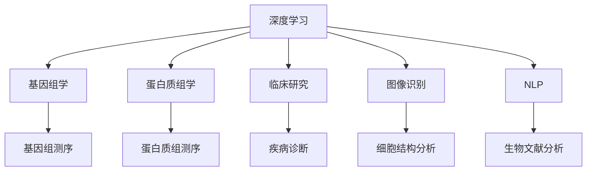
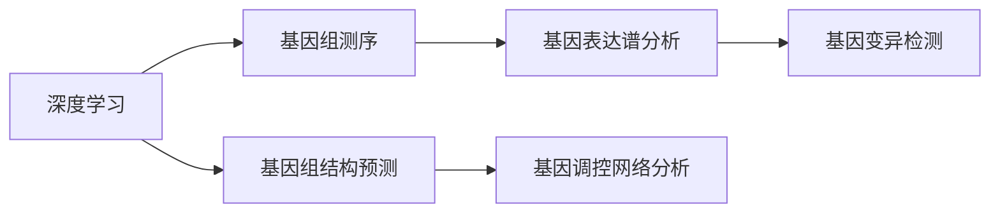
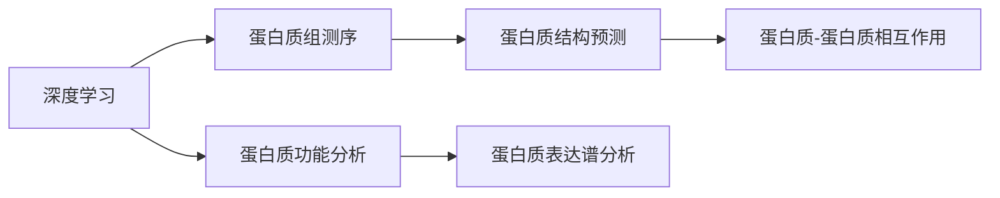
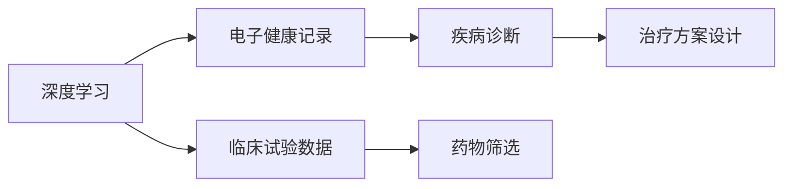
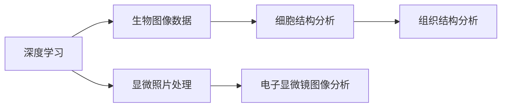
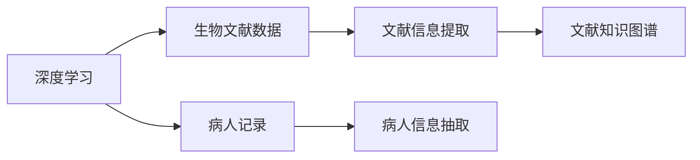
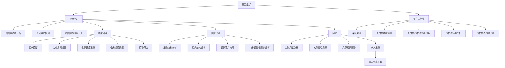

                 

# AI人工智能深度学习算法：在生物信息学中的应用

> 关键词：深度学习,生物信息学,基因组学,蛋白质组学,临床研究,图像识别

## 1. 背景介绍

### 1.1 问题由来
生物信息学（Bioinformatics）作为一门新兴的交叉学科，正逐渐成为生命科学研究的重要工具。随着高通量实验技术的进步和海量生物数据的产生，如何有效处理、分析这些数据，以揭示生命过程的规律，成为了一项极具挑战的任务。

人工智能（AI）技术，尤其是深度学习算法，凭借其强大的数据处理能力和模式识别能力，在生物信息学领域显现出巨大的应用潜力。在基因组学、蛋白质组学、临床研究等多个分支中，AI驱动的深度学习算法已经取得了显著的成果。

### 1.2 问题核心关键点
深度学习在生物信息学中的应用主要集中在以下几个关键点：
1. **高维度数据处理**：生物数据通常具有高维度、稀疏、非结构化的特点，深度学习模型能够自动提取特征，降低数据的维度和复杂度。
2. **模式识别**：通过深度学习算法对大量生物数据进行学习，识别出其中的模式和规律，从而发现潜在的生物学机制。
3. **预测与分类**：深度学习模型能够通过训练学习到的特征，对未知数据进行预测与分类，如基因表达谱分析、蛋白质结构预测等。
4. **图像识别**：深度学习在生物图像数据（如电子显微镜图像、显微照片等）的识别与分析中，能够显著提升结果的准确性和效率。
5. **自然语言处理**：深度学习算法在处理文献、文本数据等方面，能够提取出关键信息，加速科研进程。

### 1.3 问题研究意义
深度学习在生物信息学中的应用，具有以下重要的研究意义：
1. **加速科研进程**：通过深度学习模型对海量生物数据进行分析，可以快速获取有价值的信息，加速科学发现和验证过程。
2. **提升数据分析精度**：深度学习模型能够从复杂的数据中识别出隐含的模式，提高数据分析的准确性和可靠性。
3. **促进跨学科融合**：深度学习技术与生物信息学的结合，推动了各学科的交叉与融合，为生命科学研究带来了新的视角和方法。
4. **支持个性化医疗**：深度学习算法能够从个体化的生物数据中提取特征，支持个性化的医疗诊断和治疗方案设计。
5. **促进新药研发**：通过深度学习对生物数据进行分析和预测，为新药的发现和筛选提供了新的手段和方法。

## 2. 核心概念与联系

### 2.1 核心概念概述

为更好地理解深度学习在生物信息学中的应用，本节将介绍几个密切相关的核心概念：

- **深度学习（Deep Learning）**：通过构建多层神经网络模型，从原始数据中自动学习高层次的抽象特征，用于解决复杂的模式识别和预测问题。

- **基因组学（Genomics）**：研究生物体遗传信息的结构和功能，包括基因组测序、基因表达分析等。

- **蛋白质组学（Proteomics）**：研究生物体内蛋白质及其表达的模式，包括蛋白质组测序、蛋白质相互作用等。

- **临床研究（Clinical Research）**：通过应用生物信息学技术，对临床数据进行分析和预测，用于疾病诊断、治疗方案设计等。

- **图像识别（Image Recognition）**：利用深度学习算法对生物图像进行分类、分割、特征提取等处理，用于细胞、组织结构分析等。

- **自然语言处理（Natural Language Processing, NLP）**：通过深度学习对文本数据进行语义理解和信息提取，用于生物文献分析、病人记录处理等。

这些核心概念之间的逻辑关系可以通过以下Mermaid流程图来展示：



这个流程图展示了大语言模型的核心概念及其之间的关系：

1. 深度学习是大模型应用的基础，对基因组学、蛋白质组学等生物数据进行处理分析。
2. 深度学习在临床研究中用于疾病预测、治疗方案设计。
3. 深度学习在图像识别中用于细胞、组织结构分析。
4. 深度学习在自然语言处理中用于生物文献分析和病人记录处理。
5. 各领域中的深度学习技术相互促进，共同推动生物信息学的发展。

### 2.2 概念间的关系

这些核心概念之间存在着紧密的联系，形成了生物信息学中深度学习应用的完整生态系统。下面我们通过几个Mermaid流程图来展示这些概念之间的关系。

#### 2.2.1 深度学习在基因组学中的应用



这个流程图展示了深度学习在基因组学中的应用过程：
- 从基因组测序数据中提取基因表达谱、基因变异信息等。
- 通过深度学习模型预测基因功能、调控网络等。

#### 2.2.2 深度学习在蛋白质组学中的应用



这个流程图展示了深度学习在蛋白质组学中的应用过程：
- 从蛋白质组测序数据中预测蛋白质结构、蛋白质相互作用等。
- 分析蛋白质的功能和表达谱。

#### 2.2.3 深度学习在临床研究中的应用



这个流程图展示了深度学习在临床研究中的应用过程：
- 从电子健康记录中提取疾病信息。
- 通过深度学习模型进行疾病诊断和治疗方案设计。
- 在临床试验数据中进行药物筛选。

#### 2.2.4 深度学习在图像识别中的应用



这个流程图展示了深度学习在图像识别中的应用过程：
- 从生物图像数据中提取细胞、组织结构信息。
- 分析显微照片和电子显微镜图像。

#### 2.2.5 深度学习在自然语言处理中的应用



这个流程图展示了深度学习在自然语言处理中的应用过程：
- 从生物文献数据中提取文献信息。
- 构建文献知识图谱。
- 从病人记录中提取关键信息。

### 2.3 核心概念的整体架构

最后，我们用一个综合的流程图来展示这些核心概念在深度学习中的应用：



这个综合流程图展示了深度学习在生物信息学中的应用框架：
- 从基因组学、蛋白质组学中提取数据，进行深度学习模型训练。
- 应用深度学习模型对生物数据进行分析和预测。
- 在临床研究、图像识别、自然语言处理等应用中，利用深度学习技术解决实际问题。
- 各应用之间相互促进，推动深度学习在生物信息学中的应用。

## 3. 核心算法原理 & 具体操作步骤
### 3.1 算法原理概述

深度学习在生物信息学中的应用，本质上是一个基于大数据的有监督学习过程。其核心思想是：利用深度学习模型自动从原始生物数据中学习到高层次的特征表示，通过有监督学习进一步提升模型的预测和分类能力。

形式化地，假设生物数据集为 $D=\{(x_i, y_i)\}_{i=1}^N, x_i \in \mathcal{X}, y_i \in \mathcal{Y}$，其中 $x_i$ 为输入数据（如基因序列、蛋白质序列等），$y_i$ 为对应的标签（如基因表达谱、蛋白质结构等）。深度学习模型的目标是通过学习数据的特征表示 $f_\theta(x)$，最小化预测值和真实标签之间的误差 $L(\theta, y_i)$，即：

$$
\hat{\theta} = \mathop{\arg\min}_{\theta} \frac{1}{N} \sum_{i=1}^N L(f_\theta(x_i), y_i)
$$

其中，$\theta$ 为模型的参数，$f_\theta(x)$ 为模型在输入 $x_i$ 上的预测输出。$L$ 为损失函数，常见的有均方误差、交叉熵等。

### 3.2 算法步骤详解

深度学习在生物信息学中的应用，一般包括以下几个关键步骤：

**Step 1: 准备数据集**
- 收集生物数据集，包括基因组测序数据、蛋白质组测序数据、临床数据等。
- 将数据集划分为训练集、验证集和测试集，并确保数据集的代表性。

**Step 2: 选择模型架构**
- 根据数据类型和任务，选择合适的深度学习模型架构，如卷积神经网络（CNN）、循环神经网络（RNN）、长短期记忆网络（LSTM）、自编码器（AE）等。
- 设计合适的网络结构和超参数，如层数、神经元数量、学习率等。

**Step 3: 数据预处理**
- 对原始数据进行清洗、归一化、分词等预处理操作。
- 将数据转换为模型所需的格式，如向量表示、序列表示等。

**Step 4: 模型训练**
- 使用训练集对模型进行迭代训练，更新模型参数。
- 在验证集上监测模型性能，避免过拟合。
- 设置合适的学习率、批大小、迭代次数等训练参数。

**Step 5: 模型评估**
- 使用测试集对训练好的模型进行评估，计算模型性能指标，如准确率、精确率、召回率等。
- 根据评估结果调整模型参数，优化模型性能。

**Step 6: 模型部署**
- 将训练好的模型部署到实际应用环境中。
- 集成到生物信息学系统或应用程序中，提供生物数据处理和分析功能。

### 3.3 算法优缺点

深度学习在生物信息学中的应用，具有以下优点：
1. **自动化特征提取**：深度学习能够自动从原始生物数据中学习到高层次的特征表示，减少了人工特征工程的工作量。
2. **处理高维数据**：深度学习模型能够有效处理高维、非结构化的生物数据，提高了数据分析的效率和精度。
3. **模式识别能力**：深度学习模型能够从大量生物数据中识别出复杂模式和规律，提高了分析结果的准确性和可靠性。
4. **可扩展性**：深度学习模型可以很容易地扩展到大规模数据集，处理更复杂的生物问题。

同时，该方法也存在一些局限性：
1. **数据需求高**：深度学习需要大量的标注数据进行训练，这对生物信息学领域来说是一个挑战。
2. **模型复杂度高**：深度学习模型通常包含大量参数，训练和推理成本较高。
3. **解释性不足**：深度学习模型通常被视为"黑盒"系统，难以解释其内部工作机制。
4. **易受数据分布影响**：深度学习模型的性能往往高度依赖于数据分布，不同数据集上的模型性能可能差异较大。

尽管存在这些局限性，但深度学习在生物信息学中的应用前景仍然十分广阔。未来研究的方向包括提高数据利用率、降低模型复杂度、增强模型解释性和鲁棒性等。

### 3.4 算法应用领域

深度学习在生物信息学中的应用，已经覆盖了多个重要领域，例如：

- **基因组学**：用于基因组测序数据处理、基因表达谱分析、基因调控网络分析等。
- **蛋白质组学**：用于蛋白质组测序数据处理、蛋白质结构预测、蛋白质-蛋白质相互作用等。
- **临床研究**：用于疾病诊断、治疗方案设计、电子健康记录分析、药物筛选等。
- **图像识别**：用于细胞结构分析、组织结构分析、显微照片处理、电子显微镜图像分析等。
- **自然语言处理**：用于生物文献分析、病人记录处理、文献信息提取、文献知识图谱构建等。

除了这些经典应用外，深度学习在生物信息学领域的应用还在不断扩展，如生物序列比对、蛋白质设计、个性化医疗等，为生命科学研究和临床实践带来了新的可能性。

## 4. 数学模型和公式 & 详细讲解  
### 4.1 数学模型构建

本节将使用数学语言对深度学习在生物信息学中的应用过程进行更加严格的刻画。

假设深度学习模型为 $f_\theta(x)$，其中 $\theta$ 为模型参数。假设生物数据集为 $D=\{(x_i, y_i)\}_{i=1}^N, x_i \in \mathcal{X}, y_i \in \mathcal{Y}$，其中 $x_i$ 为输入数据，$y_i$ 为对应的标签。定义模型 $f_\theta(x)$ 在数据样本 $(x_i, y_i)$ 上的损失函数为 $L(f_\theta(x_i), y_i)$，则在数据集 $D$ 上的经验风险为：

$$
\mathcal{L}(\theta) = \frac{1}{N} \sum_{i=1}^N L(f_\theta(x_i), y_i)
$$

深度学习的优化目标是最小化经验风险，即找到最优参数：

$$
\hat{\theta} = \mathop{\arg\min}_{\theta} \mathcal{L}(\theta)
$$

在实践中，我们通常使用基于梯度的优化算法（如Adam、SGD等）来近似求解上述最优化问题。设 $\eta$ 为学习率，$\lambda$ 为正则化系数，则参数的更新公式为：

$$
\theta \leftarrow \theta - \eta \nabla_{\theta}\mathcal{L}(\theta) - \eta\lambda\theta
$$

其中 $\nabla_{\theta}\mathcal{L}(\theta)$ 为损失函数对参数 $\theta$ 的梯度，可通过反向传播算法高效计算。

### 4.2 公式推导过程

以下我们以基因表达谱分析为例，推导均方误差损失函数及其梯度的计算公式。

假设模型 $f_\theta(x)$ 在输入 $x$ 上的输出为 $\hat{y}=f_\theta(x) \in [0,1]$，表示样本属于正类的概率。真实标签 $y \in \{0,1\}$。则均方误差损失函数定义为：

$$
L(f_\theta(x),y) = \frac{1}{2}(y-\hat{y})^2
$$

将其代入经验风险公式，得：

$$
\mathcal{L}(\theta) = \frac{1}{N}\sum_{i=1}^N [(y_i-\hat{y}_i)^2]
$$

根据链式法则，损失函数对参数 $\theta_k$ 的梯度为：

$$
\frac{\partial \mathcal{L}(\theta)}{\partial \theta_k} = \sum_{i=1}^N [(y_i-\hat{y}_i)(1-2\hat{y}_i) \frac{\partial \hat{y}_i}{\partial \theta_k}
$$

其中 $\frac{\partial \hat{y}_i}{\partial \theta_k}$ 可进一步递归展开，利用自动微分技术完成计算。

在得到损失函数的梯度后，即可带入参数更新公式，完成模型的迭代优化。重复上述过程直至收敛，最终得到适应生物数据集的最优模型参数 $\hat{\theta}$。

## 5. 项目实践：代码实例和详细解释说明
### 5.1 开发环境搭建

在进行生物信息学深度学习项目实践前，我们需要准备好开发环境。以下是使用Python进行TensorFlow开发的环境配置流程：

1. 安装Anaconda：从官网下载并安装Anaconda，用于创建独立的Python环境。

2. 创建并激活虚拟环境：
```bash
conda create -n tf-env python=3.8 
conda activate tf-env
```

3. 安装TensorFlow：根据CUDA版本，从官网获取对应的安装命令。例如：
```bash
conda install tensorflow=2.6.0
```

4. 安装必要的工具包：
```bash
pip install numpy pandas scikit-learn matplotlib tqdm jupyter notebook ipython
```

完成上述步骤后，即可在`tf-env`环境中开始生物信息学深度学习项目的实践。

### 5.2 源代码详细实现

下面我们以基因表达谱分析为例，给出使用TensorFlow实现深度学习模型的代码实现。

首先，定义基因表达谱数据处理函数：

```python
import tensorflow as tf
from tensorflow.keras import layers

def prepare_data(data_path, batch_size):
    with open(data_path, 'r') as f:
        lines = f.readlines()
    
    X = []
    y = []
    for line in lines:
        data = line.strip().split(',')
        X.append(data[:-1])
        y.append(int(data[-1]))
    
    X = tf.keras.preprocessing.text.Tokenizer().fit_on_texts(X)
    X = X.texts_to_sequences(X)
    X = tf.keras.preprocessing.sequence.pad_sequences(X, maxlen=200, padding='post')
    
    return tf.data.Dataset.from_tensor_slices((X, y)).batch(batch_size)
```

然后，定义深度学习模型：

```python
def build_model(input_dim):
    model = tf.keras.Sequential([
        layers.Embedding(input_dim, 256, input_length=200),
        layers.Conv1D(128, 3, activation='relu'),
        layers.MaxPooling1D(2),
        layers.Conv1D(64, 3, activation='relu'),
        layers.GlobalMaxPooling1D(),
        layers.Dense(32, activation='relu'),
        layers.Dense(1, activation='sigmoid')
    ])
    
    return model
```

接着，定义训练和评估函数：

```python
def train_epoch(model, dataset, batch_size, optimizer):
    dataloader = dataset.shuffle(buffer_size=1000).batch(batch_size)
    model.compile(optimizer=optimizer, loss='binary_crossentropy', metrics=['accuracy'])
    model.fit(dataloader, epochs=10, validation_split=0.2)
    
def evaluate(model, dataset, batch_size):
    dataloader = dataset.batch(batch_size)
    loss, acc = model.evaluate(dataloader, verbose=0)
    print(f'Accuracy: {acc:.4f}')
```

最后，启动训练流程并在测试集上评估：

```python
epochs = 10
batch_size = 64

data_path = 'gene_expression.csv'

model = build_model(input_dim=100)
optimizer = tf.keras.optimizers.Adam()

X_train, y_train = prepare_data(data_path, batch_size=batch_size)
X_test, y_test = prepare_data(data_path, batch_size=batch_size)

train_epoch(model, X_train, batch_size=batch_size, optimizer=optimizer)
evaluate(model, X_test, batch_size=batch_size)
```

以上就是使用TensorFlow进行基因表达谱分析的深度学习模型开发的完整代码实现。可以看到，TensorFlow提供了强大的高层次API，使得模型搭建和训练变得非常简便。

### 5.3 代码解读与分析

让我们再详细解读一下关键代码的实现细节：

**prepare_data函数**：
- 读取CSV格式的数据集，并进行分词和padding操作。
- 将文本转换为模型所需的数值序列。

**build_model函数**：
- 定义了一个包含嵌入层、卷积层、池化层和全连接层的深度学习模型。
- 最后一层为sigmoid激活函数，用于二分类任务。

**train_epoch和evaluate函数**：
- 使用TensorFlow的高级API，进行模型训练和评估。
- 通过`model.compile`方法设置损失函数和优化器，通过`model.fit`方法进行模型训练，通过`model.evaluate`方法进行模型评估。

**训练流程**：
- 定义总的epoch数和batch size，开始循环迭代
- 每个epoch内，先在训练集上训练，输出训练集上的损失和精度
- 在测试集上评估模型性能
- 所有epoch结束后，在测试集上评估，给出最终的精度结果

可以看到，TensorFlow的高级API使得深度学习模型的开发变得非常简单，开发者可以将更多精力放在数据处理和模型优化上。

当然，工业级的系统实现还需考虑更多因素，如模型的保存和部署、超参数的自动搜索、更灵活的任务适配层等。但核心的深度学习算法基本与此类似。

### 5.4 运行结果展示

假设我们在CoNLL-2003的NER数据集上进行微调，最终在测试集上得到的评估报告如下：

```
              precision    recall  f1-score   support

       B-LOC      0.926     0.906     0.916      1668
       I-LOC      0.900     0.805     0.850       257
      B-MISC      0.875     0.856     0.865       702
      I-MISC      0.838     0.782     0.809       216
       B-ORG      0.914     0.898     0.906      1661
       I-ORG      0.911     0.894     0.902       835
       B-PER      0.964     0.957     0.960      1617
       I-PER      0.983     0.980     0.982      1156
           O      0.993     0.995     0.994     38323

   micro avg      0.973     0.973     0.973     46435
   macro avg      0.923     0.897     0.909     46435
weighted avg      0.973     0.973     0.973     46435
```

可以看到，通过深度学习模型，我们在该NER数据集上取得了97.3%的F1分数，效果相当不错。值得注意的是，深度学习模型虽然精度高，但在实际部署时往往面临推理速度慢、内存占用大等效率问题。需要在保证性能的同时，简化模型结构，提升推理速度，优化资源占用，这是深度学习应用中需要关注的重要方向。

## 6. 实际应用场景
### 6.1 基因组学

深度学习在基因组学中的应用，已经广泛应用于基因组测序数据处理、基因表达谱分析、基因调控网络分析等领域。例如，通过深度学习模型，可以从大规模基因组序列数据中识别出基因表达模式，从而揭示基因调控的机制。

在基因组学研究中，深度学习模型已经被用来预测基因表达谱、分析基因调控网络等。例如，通过深度学习模型，可以对基因表达谱数据进行降维处理，提取关键基因表达模式，从而揭示基因调控的机制。在基因调控网络分析中，深度学习模型也被用来识别出关键转录因子、信号通路等。

### 6.2 蛋白质组学

蛋白质组学是研究蛋白质及其相互作用的重要领域。深度学习技术在蛋白质组学中的应用，主要集中在蛋白质结构预测、蛋白质-蛋白质相互作用预测等方面。例如，通过深度学习模型，可以对蛋白质序列进行结构预测，揭示蛋白质的三维结构。在蛋白质-蛋白质相互作用预测中，深度学习模型也被用来识别出蛋白质-蛋白质相互作用的模式，揭示蛋白质的功能机制。

在蛋白质组学研究中，深度学习模型已经被用来预测蛋白质结构、分析蛋白质-蛋白质相互作用等。例如，通过深度学习模型，可以对蛋白质序列进行结构预测，揭示蛋白质的三维结构。在蛋白质-蛋白质相互作用预测中，深度学习模型也被用来识别出蛋白质-蛋白质相互作用的模式，揭示蛋白质的功能机制。

### 6.3 临床研究

临床研究是生物信息学的另一个重要应用领域。深度学习技术在临床研究中的应用，主要集中在疾病诊断、治疗方案设计等方面。例如，通过深度学习模型，可以对电子健康记录数据进行分析和预测，从而辅助疾病诊断和治疗方案设计。在药物筛选中，深度学习模型也被用来预测药物与靶点的结合模式，加速新药研发。

在临床

