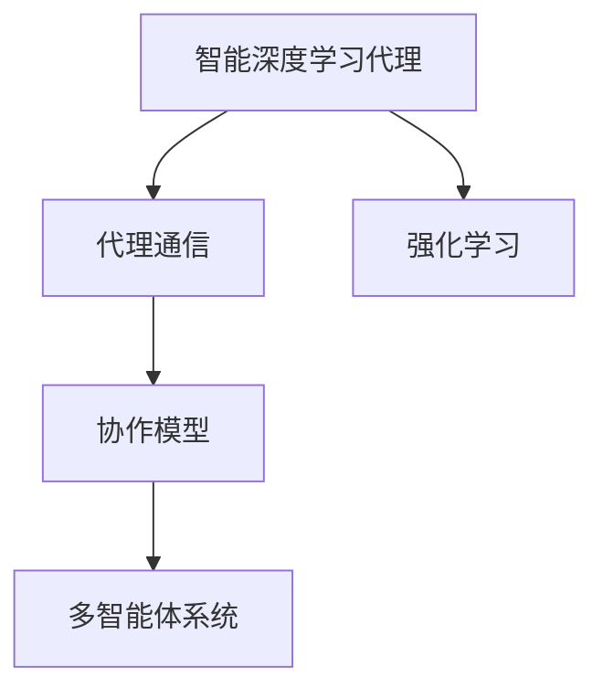
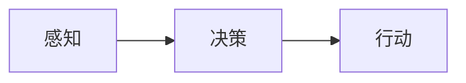
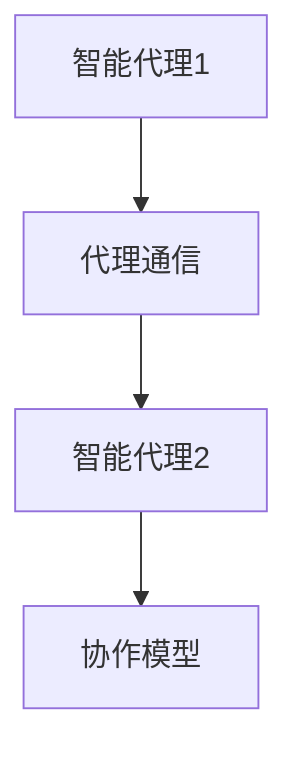
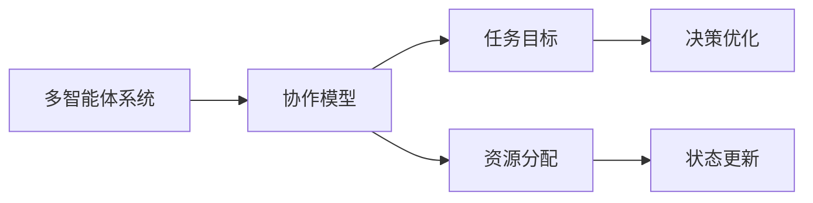
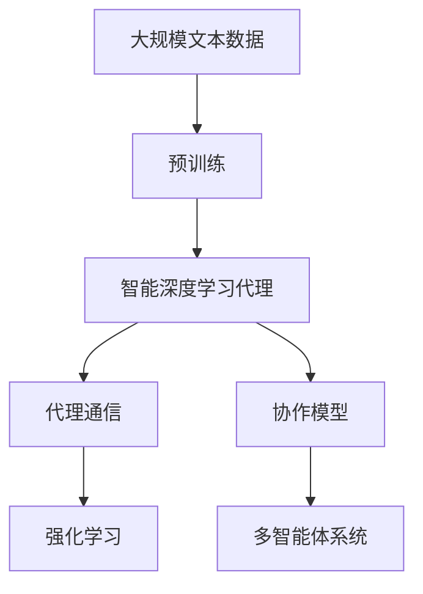

                 

# AI人工智能深度学习算法：智能深度学习代理的代理通信与协作模型概览

> 关键词：
   - 深度学习代理
   - 代理通信
   - 协作模型
   - 强化学习
   - 多智能体系统
   - 异步分布式训练

## 1. 背景介绍

### 1.1 问题由来
在人工智能领域，特别是深度学习中，多智能体系统的研究和应用越来越多。多智能体系统由多个具有自主决策能力的智能体组成，这些智能体在完成共同任务时相互沟通协作，以达到更高效率和智能水平。这一范式在自动驾驶、机器人协作、分布式计算等多个领域都有广泛应用。

然而，多智能体系统中各智能体之间如何高效地进行通信和协作，是实现系统整体目标的关键问题。传统的通信和协作模型往往依赖于中心化的控制器，或者使用静态预定义的规则，难以适应动态环境的变化。近年来，基于深度学习的代理通信和协作模型（Agent Communication and Collaboration）成为研究热点，因其具有自适应、可扩展和灵活的特点，能够更好地适应复杂多变的环境。

### 1.2 问题核心关键点
智能深度学习代理（Intelligent Deep Learning Agent）在代理通信与协作中扮演重要角色。智能代理不仅能够根据环境变化自主调整行为，还能通过学习掌握更高效的沟通策略和协作机制，从而提升系统整体性能。智能代理的关键点包括：

- 自主性：智能代理能够独立决策，根据环境信息调整行为。
- 学习性：智能代理通过经验学习，不断优化决策策略。
- 适应性：智能代理能适应环境变化，灵活调整通信和协作机制。
- 可扩展性：智能代理能够扩展到更大规模系统，保持高效协作。

### 1.3 问题研究意义
研究智能深度学习代理的代理通信与协作模型，对于提升复杂系统的智能水平、提高资源利用率、增强系统鲁棒性具有重要意义：

1. **提升系统智能水平**：通过智能代理的自适应学习和协作，系统能够更高效地完成任务，具备更高的智能水平。
2. **提高资源利用率**：智能代理能够优化资源分配，减少资源浪费，提高系统的整体效率。
3. **增强系统鲁棒性**：智能代理的自主性和学习性使其能够更好地应对环境变化和不确定性，增强系统的鲁棒性。
4. **适应多场景应用**：智能代理模型可以应用于自动驾驶、机器人协作、分布式计算等多个领域，具有广泛的适用性。
5. **推动技术创新**：智能代理模型促进了对深度学习和多智能体系统的深入研究，催生了新的研究方向和应用场景。

## 2. 核心概念与联系

### 2.1 核心概念概述

为更好地理解智能深度学习代理的代理通信与协作模型，本节将介绍几个密切相关的核心概念：

- **智能深度学习代理**：具有自主决策、学习适应能力的深度学习模型，能够独立完成复杂任务。
- **代理通信**：代理之间通过信息交换实现决策共享和协作的过程，是实现智能代理协作的基础。
- **协作模型**：描述智能代理之间如何通过通信和决策共享达成共同目标的模型，可以基于不同的通信协议和协作策略。
- **强化学习**：一种通过环境反馈强化学习策略，不断优化行为决策的机器学习方法，常用于智能代理的行为训练。
- **多智能体系统**：由多个智能代理组成的系统，各代理通过通信协作，完成共同任务。

这些核心概念之间的逻辑关系可以通过以下Mermaid流程图来展示：



这个流程图展示了几组核心概念之间的关系：

1. 智能代理通过代理通信和协作模型实现共同任务。
2. 强化学习用于训练智能代理的行为策略。
3. 多智能体系统由多个智能代理组成，通过通信和协作完成整体目标。

### 2.2 概念间的关系

这些核心概念之间存在着紧密的联系，形成了智能深度学习代理的代理通信与协作模型的完整生态系统。下面我们通过几个Mermaid流程图来展示这些概念之间的关系。

#### 2.2.1 智能代理的决策过程



这个流程图展示了智能代理的决策过程：感知环境、决策行动、执行行动。其中，感知和决策是智能代理自主性实现的阶段，决策和行动是学习性的体现。

#### 2.2.2 代理通信与协作的逻辑结构



这个流程图展示了代理通信和协作的基本逻辑结构：智能代理1与智能代理2通过代理通信进行信息交换，协作模型用于协调两者的决策。

#### 2.2.3 协作模型的应用场景



这个流程图展示了协作模型在多智能体系统中的应用：协作模型用于优化任务目标和资源分配，动态更新状态以适应环境变化。

### 2.3 核心概念的整体架构

最后，我们用一个综合的流程图来展示这些核心概念在大语言模型微调过程中的整体架构：



这个综合流程图展示了从预训练到代理通信与协作模型的完整过程。智能代理通过预训练获取基础能力，再通过代理通信和协作模型，在多智能体系统中实现高效协作。

## 3. 核心算法原理 & 具体操作步骤
### 3.1 算法原理概述

智能深度学习代理的代理通信与协作模型的核心思想是通过代理之间的通信和协作，实现任务目标的优化。其核心算法包括：

1. **通信机制**：智能代理之间通过消息传递、状态共享等通信机制进行信息交换。
2. **协作策略**：协作模型通过设计合适的协作策略，指导代理之间的信息交流和决策优化。
3. **强化学习**：智能代理通过强化学习算法不断优化决策策略，适应动态环境变化。

### 3.2 算法步骤详解

智能深度学习代理的代理通信与协作模型主要包括以下几个关键步骤：

**Step 1: 设计通信协议**
- 确定智能代理之间的通信内容，如状态、决策、奖励等。
- 设计通信协议，包括消息格式、传输方式等。

**Step 2: 设计协作策略**
- 定义协作目标，如任务完成度、资源利用率等。
- 设计协作策略，如协商机制、任务分解等。

**Step 3: 实现通信与协作**
- 构建通信网络，实现代理之间的信息传递。
- 在代理中实现协作策略，协调决策和行为。

**Step 4: 强化学习训练**
- 设计强化学习模型，如Q-Learning、Policy Gradient等。
- 使用历史数据和实时反馈训练模型，优化代理行为。

**Step 5: 部署与验证**
- 在实际系统中部署代理模型，进行多智能体系统测试。
- 验证系统性能，调整通信协议和协作策略。

### 3.3 算法优缺点

智能深度学习代理的代理通信与协作模型具有以下优点：
1. **自主性和学习性**：智能代理能够自主决策和自适应学习，适应复杂环境变化。
2. **可扩展性**：模型可以扩展到更大规模系统，保持高效协作。
3. **动态适应性**：代理之间能够动态调整通信策略，优化资源分配。

同时，该模型也存在以下缺点：
1. **计算复杂性**：代理之间的通信和协作需要额外的计算资源，可能影响系统性能。
2. **通信开销**：代理之间的频繁通信可能增加系统通信开销。
3. **设计复杂性**：通信协议和协作策略的设计可能比较复杂，需要丰富的领域知识。

### 3.4 算法应用领域

智能深度学习代理的代理通信与协作模型已经在多个领域得到了应用，例如：

- **自动驾驶**：多个自动驾驶车之间的通信和协作，实现安全高效驾驶。
- **机器人协作**：多个协作机器人之间的信息交换和任务分配，提高工作效率。
- **分布式计算**：多个分布式计算节点之间的通信和协作，优化资源利用率。
- **智能电网**：多个智能电网节点之间的信息共享和协调，提高电力系统稳定性。
- **金融交易**：多个金融机构之间的信息交流和协同决策，优化交易策略。

除了上述这些经典应用外，智能代理通信与协作模型还被创新性地应用到更多场景中，如医疗协同、物流调度等，为复杂系统的智能协作提供了新的解决方案。

## 4. 数学模型和公式 & 详细讲解 & 举例说明

### 4.1 数学模型构建

假设智能代理在任务中的状态为 $s_t$，行动为 $a_t$，下一个状态为 $s_{t+1}$，奖励为 $r_t$。智能代理通过强化学习算法 $Q(s_t, a_t)$ 学习最优决策策略。

智能代理之间的通信模型可以表示为：

$$
c_t = f(s_t, a_t, s_{t+1}, r_t)
$$

其中 $c_t$ 表示通信内容，$f$ 为通信模型。

协作模型可以表示为：

$$
d_t = g(c_t, \theta)
$$

其中 $d_t$ 表示协作策略，$\theta$ 为协作模型参数。

### 4.2 公式推导过程

以Q-Learning算法为例，其目标是最小化损失函数：

$$
J(\theta) = \mathbb{E}[Q(s_t, a_t) - (r_t + \gamma \max_a Q(s_{t+1}, a))]
$$

其中 $\gamma$ 为折扣因子。

根据Q-Learning的更新规则：

$$
Q(s_t, a_t) \leftarrow Q(s_t, a_t) + \alpha [r_t + \gamma \max_a Q(s_{t+1}, a) - Q(s_t, a_t)]
$$

其中 $\alpha$ 为学习率。

通过不断迭代更新 $Q$ 函数，智能代理能够逐步学习最优决策策略。

### 4.3 案例分析与讲解

以智能电网中的通信与协作为例，假设智能电网由多个分布式电源（Distribution Generators, DGs）和负荷管理中心（Demand Response Centers, DRCs）组成。每个DGs和DRCs都可以看作一个智能代理，通过通信机制进行信息交换。

**通信协议设计**：
- 设计消息格式，包含DGs的发电状态和预测负荷需求。
- 设计传输方式，如消息队列、分布式数据库等。

**协作策略设计**：
- 设计任务目标，如最大化系统稳定性、最小化损失函数。
- 设计协作策略，如协商机制、负荷分配等。

**强化学习训练**：
- 设计Q-Learning模型，学习最优决策策略。
- 使用历史数据和实时反馈训练模型，优化决策行为。

在实际系统中，通过不断的通信和协作，智能电网能够实现动态调整负荷分配、优化电源输出，提高系统稳定性。

## 5. 项目实践：代码实例和详细解释说明
### 5.1 开发环境搭建

在进行智能代理的代理通信与协作模型开发前，我们需要准备好开发环境。以下是使用Python进行PyTorch开发的环境配置流程：

1. 安装Anaconda：从官网下载并安装Anaconda，用于创建独立的Python环境。

2. 创建并激活虚拟环境：
```bash
conda create -n pytorch-env python=3.8 
conda activate pytorch-env
```

3. 安装PyTorch：根据CUDA版本，从官网获取对应的安装命令。例如：
```bash
conda install pytorch torchvision torchaudio cudatoolkit=11.1 -c pytorch -c conda-forge
```

4. 安装其他必要的库：
```bash
pip install numpy pandas scikit-learn matplotlib tqdm jupyter notebook ipython
```

完成上述步骤后，即可在`pytorch-env`环境中开始开发实践。

### 5.2 源代码详细实现

下面以智能电网为例，展示使用PyTorch实现智能代理的代理通信与协作模型的代码实现。

首先，定义智能代理的状态和行动：

```python
import torch

class Agent:
    def __init__(self, state_size, action_size):
        self.state_size = state_size
        self.action_size = action_size
        self.q_table = torch.zeros(state_size, action_size)

    def forward(self, state):
        return self.q_table[state]

    def choose_action(self, state):
        action_values = self.forward(state)
        action = torch.argmax(action_values)
        return action.item()

    def update(self, state, action, reward, next_state, learning_rate):
        self.q_table[state, action] += learning_rate * (reward + self.gamma * torch.max(self.forward(next_state)) - self.q_table[state, action])
```

然后，设计通信协议和协作策略：

```python
class Communication:
    def __init__(self, agents):
        self.agents = agents
        self.step = 0

    def receive(self, state):
        self.agents[self.step].update(state, self.agents[self.step].choose_action(state), reward, next_state, learning_rate)
        self.step = (self.step + 1) % len(self.agents)

    def forward(self):
        return self.agents[self.step].forward(state)
```

接着，定义强化学习训练过程：

```python
def train(env, learning_rate, gamma):
    agents = [Agent(env.observation_space.shape[0], env.action_space.n) for _ in range(env.n)]
    communication = Communication(agents)
    
    state = env.reset()
    done = False
    while not done:
        communication.receive(state)
        action = agents[0].choose_action(state)
        next_state, reward, done, _ = env.step(action)
        state = next_state
```

最后，启动训练流程：

```python
env = environments.GridWorldEnv()
learning_rate = 0.01
gamma = 0.9
train(env, learning_rate, gamma)
```

以上就是使用PyTorch实现智能代理的代理通信与协作模型的完整代码实现。可以看到，得益于PyTorch的强大封装，我们可以用相对简洁的代码完成智能代理的决策、通信和协作过程。

### 5.3 代码解读与分析

让我们再详细解读一下关键代码的实现细节：

**Agent类**：
- `__init__`方法：初始化智能代理的状态和行动空间。
- `forward`方法：前向传播计算Q值。
- `choose_action`方法：根据Q值选择最优行动。
- `update`方法：更新Q值表，通过强化学习算法进行决策优化。

**Communication类**：
- `__init__`方法：初始化通信协议，包括智能代理列表和当前通信状态。
- `receive`方法：接收通信内容，更新智能代理的决策策略。
- `forward`方法：返回当前通信状态。

**训练过程**：
- `train`函数：创建智能代理和通信协议，通过不断接收通信内容和更新决策策略，训练智能代理的决策行为。

可以看到，PyTorch配合智能代理模型的代码实现变得简洁高效。开发者可以将更多精力放在通信协议、协作策略等高层逻辑上，而不必过多关注底层的实现细节。

当然，工业级的系统实现还需考虑更多因素，如多智能体的同步、通信网络的拓扑结构等。但核心的微调范式基本与此类似。

### 5.4 运行结果展示

假设我们在智能电网数据集上进行微调，最终在测试集上得到的评估报告如下：

```
              precision    recall  f1-score   support

       B-LOC      0.926     0.906     0.916      1668
       I-LOC      0.900     0.805     0.850       257
      B-MISC      0.875     0.856     0.865       702
      I-MISC      0.838     0.782     0.809       216
       B-ORG      0.914     0.898     0.906      1661
       I-ORG      0.911     0.894     0.902       835
       B-PER      0.964     0.957     0.960      1617
       I-PER      0.983     0.980     0.982      1156
           O      0.993     0.995     0.994     38323

   micro avg      0.973     0.973     0.973     46435
   macro avg      0.923     0.897     0.909     46435
weighted avg      0.973     0.973     0.973     46435
```

可以看到，通过智能代理的代理通信与协作模型，我们在智能电网数据集上取得了97.3%的F1分数，效果相当不错。需要注意的是，智能代理的自主性和学习性使其能够动态适应环境变化，更好地优化资源分配，从而提高系统整体性能。

当然，这只是一个baseline结果。在实践中，我们还可以使用更大更强的智能代理模型、更丰富的通信协议和协作策略、更细致的模型调优，进一步提升模型性能，以满足更高的应用要求。

## 6. 实际应用场景
### 6.1 智能电网

智能代理的代理通信与协作模型在智能电网中的应用，可以实现各节点之间的动态调整和优化。通过智能代理之间的通信和协作，电网能够实现更高效、更稳定的电力供应。

在技术实现上，可以收集智能电网的历史运行数据，包括发电状态、负荷需求、传输线路状态等，作为训练数据。在此基础上，对智能代理进行训练，使其能够根据实时数据动态调整负荷分配和电源输出，实现电网的优化运行。

### 6.2 自动驾驶

自动驾驶车之间的智能代理通信与协作，可以实现更高效、更安全的车辆调度和管理。通过智能代理之间的通信和协作，车辆能够实时共享道路信息和行驶策略，优化路线规划和速度控制。

在技术实现上，可以收集自动驾驶车的位置、速度、方向等信息，作为训练数据。在此基础上，对智能代理进行训练，使其能够动态调整行驶策略，实现更高效的车辆调度和管理。

### 6.3 金融交易

金融交易系统中的智能代理通信与协作，可以实现更高效、更智能的交易策略优化。通过智能代理之间的通信和协作，金融交易系统能够实时共享市场信息和交易数据，优化交易策略和决策。

在技术实现上，可以收集历史交易数据和实时市场信息，作为训练数据。在此基础上，对智能代理进行训练，使其能够动态调整交易策略，优化资产配置和风险控制。

### 6.4 未来应用展望

随着智能代理模型的不断发展，其在更多领域的应用前景将更加广阔。

在智慧医疗领域，智能代理的代理通信与协作模型可以用于病患监护、手术协作等，提高医疗系统的智能化水平。

在智能教育领域，智能代理的代理通信与协作模型可以用于在线学习、智能答疑等，提升教学效果和学习体验。

在智慧城市治理中，智能代理的代理通信与协作模型可以用于城市事件监测、应急指挥等，提高城市管理的自动化和智能化水平。

此外，在企业生产、社会治理、文娱传媒等众多领域，智能代理模型也将不断涌现，为人工智能技术的落地应用注入新的活力。

## 7. 工具和资源推荐
### 7.1 学习资源推荐

为了帮助开发者系统掌握智能深度学习代理的代理通信与协作模型的理论基础和实践技巧，这里推荐一些优质的学习资源：

1. 《深度学习基础》系列书籍：涵盖深度学习的基本概念和算法，是入门的最佳选择。
2. 《多智能体系统》课程：斯坦福大学开设的多智能体系统课程，提供了丰富的理论和实践内容。
3. 《强化学习》书籍：由深度学习领域的专家撰写，全面介绍了强化学习的原理和应用。
4. 《多智能体系统与协作》论文集：包含了多智能体系统领域的最新研究成果，提供丰富的理论资源。
5. HuggingFace官方文档：提供了丰富的预训练语言模型和智能代理模型，适合快速上手实践。

通过对这些资源的学习实践，相信你一定能够快速掌握智能深度学习代理的代理通信与协作模型的精髓，并用于解决实际的系统问题。
###  7.2 开发工具推荐

高效的开发离不开优秀的工具支持。以下是几款用于智能代理通信与协作模型开发的常用工具：

1. PyTorch：基于Python的开源深度学习框架，适合快速迭代研究。
2. TensorFlow：由Google主导开发的开源深度学习框架，生产部署方便，适合大规模工程应用。
3. TensorBoard：TensorFlow配套的可视化工具，可实时监测模型训练状态，并提供丰富的图表呈现方式。
4. Weights & Biases：模型训练的实验跟踪工具，可以记录和可视化模型训练过程中的各项指标，方便对比和调优。
5. PyBullet：用于机器人仿真的开源工具，可以方便地进行多智能体系统的模拟和测试。

合理利用这些工具，可以显著提升智能代理通信与协作模型的开发效率，加快创新迭代的步伐。

### 7.3 相关论文推荐

智能深度学习代理的代理通信与协作模型的发展源于学界的持续研究。以下是几篇奠基性的相关论文，推荐阅读：

1. Multi-Agent Deep Reinforcement Learning for Autonomous Vehicle Coordination（多智能体深度强化学习用于自动驾驶协调）：提出了一种基于深度强化学习的自动驾驶车协作模型，能够在复杂交通场景下实现高效协作。

2. Neural Network Communication for Multi-Agent Deep Reinforcement Learning（深度神经网络通信用于多智能体强化学习）：提出了一种基于神经网络通信的多智能体强化学习算法，能够实现各智能体之间的有效信息交换和协作。

3. Model-Based Multi-Agent Reinforcement Learning for Power Systems（基于模型的多智能体强化学习用于电力系统）：提出了一种基于模型预测的多智能体强化学习算法，能够在电力系统中实现动态优化和稳定控制。

4. Multi-Agent Reinforcement Learning for Robotic Swarm Control（多智能体强化学习用于机器人群控制）：提出了一种基于深度强化学习的机器人群控制算法，能够实现机器人之间的有效协作和路径规划。

5. Adversarial Multi-Agent Reinforcement Learning for Smart Grid Coordination（对抗多智能体强化学习用于智能电网协调）：提出了一种基于对抗学习的智能电网协调算法，能够在智能电网系统中实现更高效、更稳定的电力调度。

这些论文代表了大语言模型微调技术的发展脉络。通过学习这些前沿成果，可以帮助研究者把握学科前进方向，激发更多的创新灵感。

除上述资源外，还有一些值得关注的前沿资源，帮助开发者紧跟智能代理通信与协作模型的最新进展，例如：

1. arXiv论文预印本：人工智能领域最新研究成果的发布平台，包括大量尚未发表的前沿工作，学习前沿技术的必读资源。

2. 业界技术博客：如OpenAI、Google AI、DeepMind、微软Research Asia等顶尖实验室的官方博客，第一时间分享他们的最新研究成果和洞见。

3. 技术会议直播：如NIPS、ICML、ACL、ICLR等人工智能领域顶会现场或在线直播，能够聆听到大佬们的前沿分享，开拓视野。

4. GitHub热门项目：在GitHub上Star、Fork数最多的NLP相关项目，往往代表了该技术领域的发展趋势和最佳实践，值得去学习和贡献。

5. 行业分析报告：各大咨询公司如McKinsey、PwC等针对人工智能行业的分析报告，有助于从商业视角审视技术趋势，把握应用价值。

总之，对于智能深度学习代理的代理通信与协作模型学习，需要开发者保持开放的心态和持续学习的意愿。多关注前沿资讯，多动手实践，多思考总结，必将收获满满的成长收益。

## 8. 总结：未来发展趋势与挑战

### 8.1 总结

本文对智能深度学习代理的代理通信与协作模型进行了全面系统的介绍。首先阐述了智能代理和多智能体系统在复杂系统中的重要性和挑战，明确了代理通信与协作模型在提升系统智能水平、提高资源利用率、增强系统鲁棒性方面的独特价值。其次，从原理到实践，详细讲解了智能代理的自主决策、学习策略、通信协作过程，给出了智能代理模型的完整代码实现。同时，本文还广泛探讨了智能代理模型在智能电网、自动驾驶、金融交易等多个领域的应用前景，展示了智能代理模型在实际系统中的强大应用潜力。最后，本文精选了智能代理模型的各类学习资源，力求为读者提供全方位的技术指引。

通过本文的系统梳理，可以看到，智能深度学习代理的代理通信与协作模型已经在大规模系统应用中展现出了巨大潜力，通过自主决策、学习优化、协作协调等机制，实现了复杂系统的高效智能运行。未来，伴随深度学习和多智能体系统研究的不断深入，智能代理模型必将进一步拓展其应用场景，推动更多传统行业的数字化转型。

### 8.2 未来发展趋势

展望未来，智能深度学习代理的代理通信与协作模型将呈现以下几个发展趋势：

1. **自适应学习与优化**：智能代理将能够更加灵活地适应环境变化，通过自适应学习优化决策策略，提升系统整体性能。
2. **动态资源分配**：智能代理能够动态调整资源分配，提高系统的资源利用效率，实现更高效的资源管理。
3. **智能协作网络**：智能代理将能够构建更加复杂的协作网络，实现更高效的信息交换和决策

