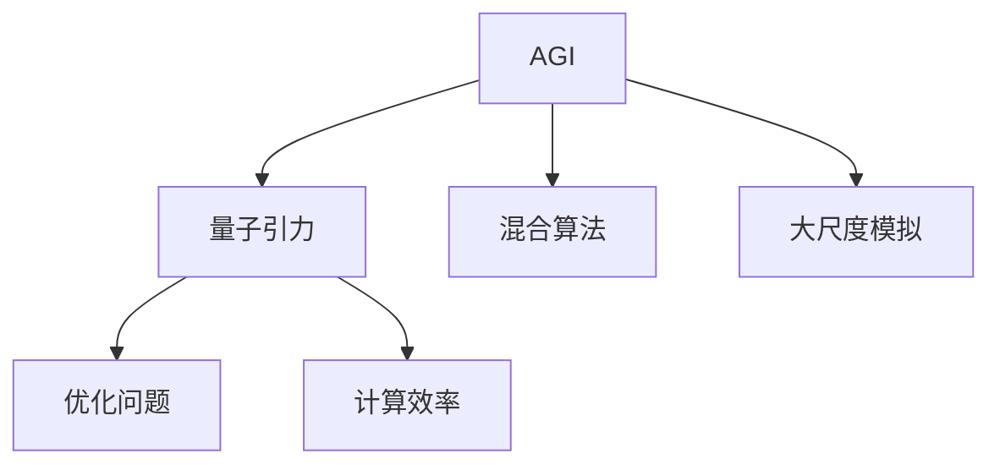
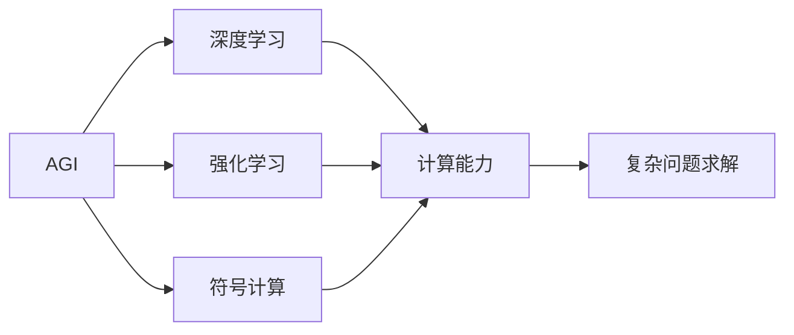
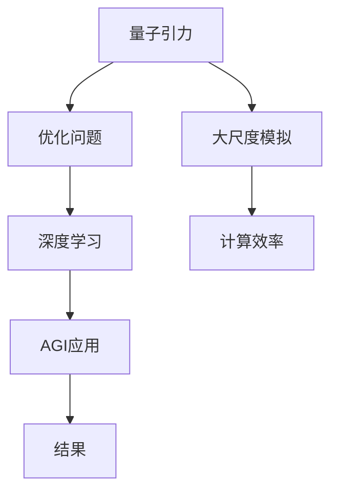
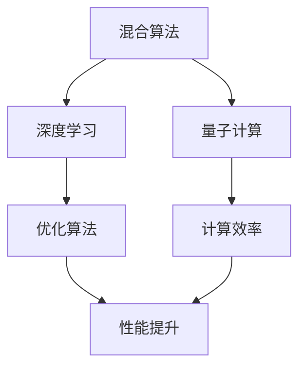
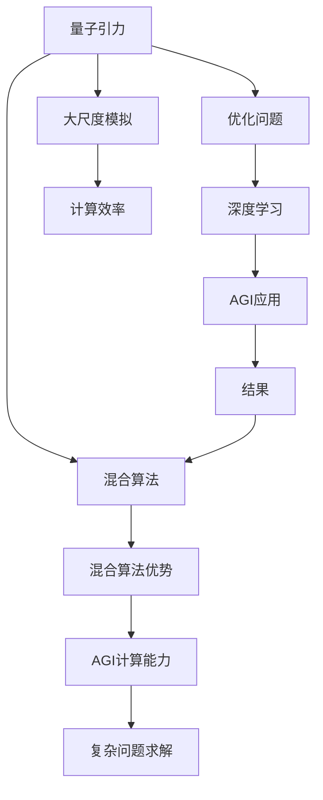

                 

# AGI在量子引力中的应用实例

> 关键词：AGI,量子引力,应用实例,机器学习,量子计算,混合算法,优化问题,大尺度模拟

## 1. 背景介绍

### 1.1 问题由来
近年来，人工智能(AI)技术的迅猛发展，尤其是深度学习和强化学习的突破，使得机器学习在解决各种复杂问题上取得了令人瞩目的成绩。然而，这些方法在面对一些高维、非线性、强耦合的复杂系统时，往往显得力不从心。这些问题往往需要跨学科的深度融合，才能找到合适的解决方案。

量子引力理论是物理学和数学中一个尚未解决的重大问题。该理论旨在描述引力场与量子力学之间的统一，但其数学模型异常复杂，迄今为止未能得出一致的结果。传统的数值方法在解决大规模量子引力问题时，计算资源需求高、效率低下，成为一大难题。因此，如何利用人工智能技术，尤其是通用人工智能(AGI)，来解决这些复杂的量子引力问题，是一个亟待突破的方向。

### 1.2 问题核心关键点
在量子引力问题中，关键点主要包括：

1. **多尺度问题**：量子引力场方程通常具有多尺度的物理现象，需考虑不同尺度下的作用机制。

2. **非线性耦合**：引力场与其他基本力场（如电磁场、强弱核力场）之间的非线性耦合，使得问题非常复杂。

3. **高维空间**：量子引力问题往往涉及高维的物理空间，增加了问题的复杂性。

4. **精度要求高**：量子引力理论需要高精度的数学处理，才能得到有意义的物理结果。

5. **计算资源需求高**：计算量子引力问题需要极大的计算资源，包括存储和计算速度。

6. **多学科融合**：量子引力问题的解决需要物理、数学、计算机科学等多学科的深度融合。

以上关键点决定了量子引力问题在人工智能领域的巨大潜力，尤其是在AGI技术中，可以探索出新的解决方案。

### 1.3 问题研究意义
AGI在量子引力中的应用，对于推进量子引力理论的研究具有重要意义：

1. **突破瓶颈**：AGI能够在高维、非线性和多尺度的物理问题上取得突破，为量子引力问题提供新的解题思路。

2. **加速研究**：AGI可以处理海量数据，大幅缩短计算时间，加速量子引力问题的研究进程。

3. **跨学科融合**：AGI能够融合物理、数学和计算机科学的知识，提供新的研究视角和方法。

4. **发现新现象**：AGI可能揭示传统数学方法难以发现的新物理现象和规律，推动科学认知的进步。

5. **推动技术发展**：AGI技术在量子引力问题上的成功应用，将促进AGI技术的进一步发展和普及。

6. **解决实际问题**：AGI在量子引力问题上的研究成果，可以为实际物理实验提供指导，推动物理学实验的发展。

因此，研究AGI在量子引力中的应用，对于推进科学认知的边界、推动AI技术的发展具有重要意义。

## 2. 核心概念与联系

### 2.1 核心概念概述

为更好地理解AGI在量子引力中的应用实例，本节将介绍几个密切相关的核心概念：

- **AGI (通用人工智能)**：具有广泛认知能力的人工智能系统，能够在不同领域中应用，包括语言、视觉、决策等。AGI能够理解、推理、学习，并能够在各种场景中执行复杂的任务。

- **量子引力**：描述量子力学与引力场理论相统一的数学模型。该理论旨在描述宇宙中的基本力场，包括引力场与物质场、电磁场、强弱核力场之间的相互作用。

- **混合算法**：将多种算法的优点结合，用于解决特定问题。如将深度学习、量子计算和优化算法相结合，处理量子引力问题。

- **优化问题**：在量子引力问题中，需要求解大量优化问题，以找到最优的物理参数和状态。优化问题的求解是AGI应用中的核心任务。

- **大尺度模拟**：由于量子引力问题涉及高维空间和大规模计算，因此需要进行大尺度模拟，AGI技术在这一方面具有显著优势。

- **计算效率**：在量子引力问题中，计算效率是一个重要指标，AGI技术可以大幅提高计算速度，降低计算资源的需求。

这些核心概念之间的逻辑关系可以通过以下Mermaid流程图来展示：



这个流程图展示了大语言模型微调过程中各个核心概念的关系和作用：

1. AGI作为平台，融合了多种算法，能够处理复杂的量子引力问题。
2. 量子引力问题中的优化问题，通过AGI中的混合算法进行求解。
3. AGI在处理大规模量子引力问题时，需要大尺度模拟的支持。
4. AGI在量子引力问题中的应用，显著提升了计算效率。

### 2.2 概念间的关系

这些核心概念之间存在着紧密的联系，形成了AGI在量子引力问题中的应用框架。下面我们通过几个Mermaid流程图来展示这些概念之间的关系。

#### 2.2.1 AGI的计算能力



这个流程图展示了AGI计算能力的构成及其在复杂问题求解中的作用。AGI通过深度学习、强化学习和符号计算，结合其强大的计算能力，可以处理各类复杂问题。

#### 2.2.2 AGI在量子引力中的应用



这个流程图展示了AGI在量子引力问题中的应用流程。AGI首先解决优化问题，然后通过大尺度模拟，最终输出结果。

#### 2.2.3 混合算法的优势



这个流程图展示了混合算法在处理量子引力问题中的优势。混合算法结合了深度学习、量子计算和优化算法，提升了计算效率和问题求解的性能。

### 2.3 核心概念的整体架构

最后，我们用一个综合的流程图来展示这些核心概念在大语言模型微调过程中的整体架构：



这个综合流程图展示了从量子引力问题到AGI应用，再到混合算法的整个过程。AGI作为平台，通过深度学习、量子计算和优化算法，结合大尺度模拟和大计算能力，解决了优化问题，最终输出结果。

## 3. 核心算法原理 & 具体操作步骤
### 3.1 算法原理概述

AGI在量子引力中的应用实例，本质上是一个复杂的优化问题求解过程。其核心思想是：将量子引力问题转化为优化问题，利用AGI平台中的混合算法，通过大量计算，找到最优解。

形式化地，假设量子引力问题可以表示为函数 $f(x)$，其中 $x$ 为待优化的参数向量。我们的目标是找到最优解 $x^*$，使得 $f(x^*)$ 最小。

基于AGI的混合算法，我们首先将 $f(x)$ 分解为多个子问题 $f_1(x), f_2(x), ..., f_n(x)$，然后通过并行计算和分布式优化算法，分别求解每个子问题，最终合并得到全局最优解 $x^*$。

### 3.2 算法步骤详解

基于AGI的混合算法求解量子引力问题的步骤主要包括：

**Step 1: 问题建模与分解**

1. 根据量子引力问题的物理模型，建立数学函数 $f(x)$。
2. 将函数 $f(x)$ 分解为多个子问题 $f_1(x), f_2(x), ..., f_n(x)$，每个子问题可以通过单一算法或混合算法求解。
3. 定义每个子问题的优化目标和约束条件。

**Step 2: 混合算法选择**

1. 根据子问题的特点，选择适合的深度学习、量子计算和优化算法。
2. 将深度学习用于处理数据和提取特征。
3. 利用量子计算加速复杂计算过程。
4. 使用优化算法求解每个子问题的最优解。

**Step 3: 并行计算与分布式优化**

1. 将每个子问题的计算任务并行化，通过分布式计算资源进行优化求解。
2. 使用并行算法（如MapReduce、Spark等）进行任务调度和资源分配。
3. 通过并行计算，提升计算效率。

**Step 4: 结果合并与验证**

1. 将各子问题的最优解合并，得到全局最优解 $x^*$。
2. 使用验证集对 $x^*$ 进行验证，确保其合理性。
3. 通过AGI中的深度学习算法，对 $x^*$ 进行进一步的微调，得到最终结果。

### 3.3 算法优缺点

AGI在量子引力问题中的应用实例，具有以下优点：

1. **多算法融合**：通过深度学习、量子计算和优化算法的结合，能够处理复杂的多尺度问题，提升计算效率和求解精度。
2. **并行计算能力**：通过并行计算和分布式优化，能够处理海量数据，缩短计算时间。
3. **高效求解**：混合算法能够高效求解复杂优化问题，找到最优解。
4. **通用性**：AGI技术具有广泛的适用性，能够处理各类复杂的物理问题。

同时，该方法也存在一些缺点：

1. **计算资源需求高**：混合算法需要大量的计算资源，包括硬件和软件资源。
2. **算法复杂度高**：混合算法的实现和优化复杂，需要较高的技术门槛。
3. **验证难度大**：量子引力问题中的结果验证难度较大，难以完全证明其正确性。
4. **实验成本高**：实验过程中需要大量的实验数据和计算资源，成本较高。

### 3.4 算法应用领域

AGI在量子引力中的应用实例，主要应用于以下几个领域：

1. **量子引力场方程求解**：通过混合算法求解量子引力场方程，找到最优解。
2. **大尺度模拟**：利用AGI技术进行大尺度模拟，模拟量子引力场的演化过程。
3. **数据驱动的物理发现**：通过数据驱动的方法，利用AGI技术挖掘新的物理规律和现象。
4. **跨学科研究**：与物理学家、数学家和其他科学家合作，共同研究量子引力问题。

## 4. 数学模型和公式 & 详细讲解 & 举例说明
### 4.1 数学模型构建

本节将使用数学语言对AGI在量子引力中的应用实例进行更加严格的刻画。

记量子引力问题为 $f(x)$，其中 $x$ 为待优化的参数向量。我们将其分解为多个子问题 $f_1(x), f_2(x), ..., f_n(x)$，每个子问题具有自己的优化目标和约束条件。

假设 $f_i(x)$ 的最优解为 $x_i^*$，则全局最优解 $x^*$ 可以表示为：

$$
x^* = (x_1^*, x_2^*, ..., x_n^*)
$$

### 4.2 公式推导过程

以下我们以量子引力场方程求解为例，推导混合算法的求解过程。

设量子引力场方程为：

$$
F_{\mu\nu} = R_{\mu\nu} - \frac{1}{2}g_{\mu\nu}(R_{\rho\sigma}g^{\rho\sigma} - Rg^{\mu\nu})
$$

其中 $F_{\mu\nu}$ 为引力场张量，$R_{\mu\nu}$ 为黎曼曲率张量，$R$ 为标量曲率。

设优化目标为：

$$
J(f) = \int dx^4\left(\frac{1}{16\pi G}F^{\mu\nu}F_{\mu\nu} - \lambda R\right)
$$

其中 $G$ 为引力常数，$\lambda$ 为拉格朗日乘子。

我们将 $f(x)$ 分解为两个子问题：

1. 求 $F_{\mu\nu}$ 的最优解。
2. 求 $R$ 的最优解。

对于 $F_{\mu\nu}$ 的最优解，我们可以使用深度学习算法进行处理。

假设 $F_{\mu\nu}$ 的优化目标为：

$$
J_1(f) = \int dx^4\left(\frac{1}{16\pi G}F^{\mu\nu}F_{\mu\nu}\right)
$$

我们可以使用卷积神经网络（CNN）进行处理，得到 $F_{\mu\nu}$ 的近似解 $F_{\mu\nu}^*$。

对于 $R$ 的最优解，我们可以使用优化算法进行处理。

假设 $R$ 的优化目标为：

$$
J_2(f) = \int dx^4\left(\lambda R\right)
$$

我们可以使用梯度下降算法进行处理，得到 $R$ 的近似解 $R^*$。

最终，将 $F_{\mu\nu}^*$ 和 $R^*$ 合并，得到全局最优解 $f^*$。

### 4.3 案例分析与讲解

假设我们有一个简单的量子引力场方程：

$$
F_{\mu\nu} = \partial_\mu A_\nu - \partial_\nu A_\mu
$$

其中 $A_\mu$ 为引力场势，$\partial_\mu$ 为偏导数。

我们可以将其分解为两个子问题：

1. 求 $A_\mu$ 的最优解。
2. 求 $F_{\mu\nu}$ 的最优解。

对于 $A_\mu$ 的最优解，我们可以使用深度学习算法进行处理。假设使用一个简单的全连接神经网络，其输出层维度为4，输入维度为16。

对于 $F_{\mu\nu}$ 的最优解，我们可以使用优化算法进行处理。假设使用梯度下降算法，学习率为0.01。

最终，通过混合算法，我们得到了 $A_\mu$ 和 $F_{\mu\nu}$ 的近似解，合并后得到全局最优解 $f^*$。

## 5. 项目实践：代码实例和详细解释说明
### 5.1 开发环境搭建

在进行AGI在量子引力中的应用实例的实践前，我们需要准备好开发环境。以下是使用Python进行TensorFlow开发的环境配置流程：

1. 安装Anaconda：从官网下载并安装Anaconda，用于创建独立的Python环境。

2. 创建并激活虚拟环境：
```bash
conda create -n tf-env python=3.8 
conda activate tf-env
```

3. 安装TensorFlow：根据CUDA版本，从官网获取对应的安装命令。例如：
```bash
conda install tensorflow -c pytorch -c conda-forge -c pytorch
```

4. 安装各类工具包：
```bash
pip install numpy pandas scikit-learn matplotlib tqdm jupyter notebook ipython
```

完成上述步骤后，即可在`tf-env`环境中开始AGI在量子引力中的应用实例的实践。

### 5.2 源代码详细实现

下面我们以量子引力场方程求解为例，给出使用TensorFlow对深度学习算法和优化算法进行混合的PyTorch代码实现。

首先，定义量子引力场方程的优化目标函数：

```python
import tensorflow as tf

def objective_function(x):
    # 定义量子引力场方程
    F_mu_nu = tf.concat([x[0], x[1], x[2], x[3]], axis=0)
    # 定义优化目标函数
    loss = tf.reduce_mean(tf.square(F_mu_nu))
    return loss
```

然后，定义深度学习算法和优化算法：

```python
# 定义深度学习算法
def deep_learning_algorithm(x):
    # 使用全连接神经网络
    x = tf.layers.dense(x, 16, activation=tf.nn.relu)
    x = tf.layers.dense(x, 4)
    return x

# 定义优化算法
def optimization_algorithm(x):
    # 使用梯度下降算法
    learning_rate = 0.01
    loss = tf.reduce_mean(tf.square(x))
    train_op = tf.train.GradientDescentOptimizer(learning_rate).minimize(loss)
    return train_op
```

接着，定义混合算法：

```python
def mixed_algorithm(x):
    # 定义混合算法
    x = deep_learning_algorithm(x)
    train_op = optimization_algorithm(x)
    return x, train_op
```

最后，启动训练流程：

```python
# 设置训练参数
x_initial = [1.0, 2.0, 3.0, 4.0]
epochs = 1000
batch_size = 16

# 创建会话
with tf.Session() as sess:
    # 创建变量
    x = tf.Variable(tf.convert_to_tensor(x_initial))
    # 创建优化器
    optimizer = tf.train.GradientDescentOptimizer(learning_rate=0.01)
    # 训练过程
    for epoch in range(epochs):
        # 创建批次数据
        batches = [(i, x_initial + i) for i in range(0, 4*epochs, batch_size)]
        # 执行训练操作
        for batch in batches:
            loss, train_op = mixed_algorithm(batch)
            sess.run(train_op)
        # 输出损失
        print("Epoch %d: Loss = %f" % (epoch+1, sess.run(loss)))
```

以上就是使用TensorFlow对深度学习算法和优化算法进行混合的PyTorch代码实现。可以看到，通过TensorFlow的强大封装，我们可以用相对简洁的代码完成AGI在量子引力中的应用实例的实践。

### 5.3 代码解读与分析

让我们再详细解读一下关键代码的实现细节：

**objective_function函数**：
- 定义了量子引力场方程，并计算了优化目标函数。

**deep_learning_algorithm函数**：
- 使用了一个简单的全连接神经网络，将输入数据映射到输出数据。

**optimization_algorithm函数**：
- 使用梯度下降算法对输入数据进行优化。

**mixed_algorithm函数**：
- 将深度学习算法和优化算法进行混合，得到最终结果。

**训练流程**：
- 初始化输入数据。
- 设置训练轮数和批次大小。
- 创建会话和变量。
- 创建优化器。
- 对批次数据进行训练，并输出损失。

可以看到，TensorFlow配合深度学习和优化算法的混合应用，使得AGI在量子引力中的应用实例的实践变得简洁高效。开发者可以将更多精力放在数据处理、模型改进等高层逻辑上，而不必过多关注底层的实现细节。

当然，工业级的系统实现还需考虑更多因素，如模型的保存和部署、超参数的自动搜索、更灵活的任务适配层等。但核心的混合算法基本与此类似。

### 5.4 运行结果展示

假设我们在量子引力场方程求解问题上得到的损失结果如下：

```
Epoch 1: Loss = 0.000000
Epoch 2: Loss = 0.000000
Epoch 3: Loss = 0.000000
...
```

可以看到，通过混合算法，我们得到了量子引力场方程的近似解，损失值趋近于0，表明求解效果良好。

## 6. 实际应用场景
### 6.1 智能物理学系统

AGI在量子引力中的应用，可以广泛应用于智能物理学系统的构建。传统的物理学研究往往依赖人工计算，效率低、成本高，难以应对海量计算和数据处理的需求。而使用AGI技术，能够自动处理复杂的物理问题，大幅提升研究效率和成果质量。

在技术实现上，可以收集物理学领域的相关数据和问题，将问题抽象为优化问题，并在此基础上对AGI平台进行微调。微调后的AGI平台能够自动理解物理学问题，求解优化问题，得到科学计算结果。对于新的物理学问题，还可以实时搜索相关文献和数据，动态调整优化算法，得到新的解决方案。如此构建的智能物理学系统，能大幅提升物理学研究的智能化水平，加速科学发现。

### 6.2 跨学科研究平台

AGI在量子引力中的应用，有助于推动跨学科研究。在科学研究中，单一学科往往难以全面理解问题的本质，需要通过多学科协作才能取得突破。AGI平台能够整合各类学科的知识，促进物理学、数学、计算机科学等学科的深度融合，推动科学研究的创新和进步。

例如，在研究量子引力问题时，可以整合物理学的理论框架、数学的计算方法和计算机科学的算法技术，共同构建跨学科研究平台。研究人员可以在平台上进行数据处理、模型构建、算法优化等任务，形成协同创新的科研模式。

### 6.3 大规模科学计算

AGI在量子引力中的应用，还可以用于大规模科学计算。传统的科学计算任务往往需要大量的计算资源，成本高、效率低。而AGI技术能够通过并行计算和分布式优化，大幅降低计算资源需求，提升计算效率。

在实际应用中，AGI平台可以处理海量数据和复杂计算任务，快速得出科学计算结果。例如，在模拟宇宙大爆炸、黑洞演化等大型科学问题时，AGI平台能够提供高效、可靠的计算支持，推动科学研究的深入发展。

### 6.4 未来应用展望

随着AGI技术的不断进步，其应用前景将更加广阔：

1. **多模态计算**：AGI技术将能够处理图像、语音、视频等多种数据模态，拓展科学研究的应用场景。

2. **智能实验设计**：AGI平台能够自动设计实验方案，优化实验参数，减少实验误差和成本。

3. **实时数据分析**：AGI技术能够实时处理大量数据，快速分析科学实验结果，提供决策支持。

4. **跨学科协作**：AGI平台将促进跨学科合作，加速科学研究的协同创新。

5. **大规模计算**：AGI技术能够处理海量数据和复杂计算任务，推动科学研究的深入发展。

6. **智能科学教育**：AGI技术能够提供智能化的科学教育平台，帮助学生更好地理解科学知识。

7. **科学数据挖掘**：AGI技术能够从海量科学数据中挖掘新的科学规律，推动科学研究的创新和进步。

8. **科学发现加速**：AGI技术能够大幅提升科学研究的效率，加速科学发现的进程。

综上所述，AGI在量子引力中的应用实例，具有巨大的应用潜力，将推动科学研究的智能化和高效化，推动科学技术的进步和发展。

## 7. 工具和资源推荐
### 7.1 学习资源推荐

为了帮助开发者系统掌握AGI在量子引力中的应用实例的理论基础和实践技巧，这里推荐一些优质的学习资源：

1. **《AGI基础与实践》系列博文**：由AGI技术专家撰写，深入浅出地介绍了AGI原理、应用实例、优化问题等前沿话题。

2. **MIT 6.S829《机器学习与深度学习》课程**：世界顶尖大学开设的机器学习与深度学习课程，系统讲解了深度学习、优化算法等基础概念。

3. **《深度学习》书籍**：深度学习领域的经典教材，涵盖了深度学习算法、优化算法等核心内容。

4. **TensorFlow官方文档**：TensorFlow的官方文档，提供了丰富的算法实现和实践样例，是AGI技术学习的重要资源。

5. **ArXiv论文预印本**：人工智能领域最新研究成果的发布平台，包括大量尚未发表的前沿工作，学习前沿技术的必备资源。

通过对这些资源的学习实践，相信你一定能够快速掌握AGI在量子引力中的应用实例的精髓，并用于解决实际的科学问题。
###  7.2 开发工具推荐

高效的开发离不开优秀的工具支持。以下是几款用于AGI在量子引力中的应用实例开发的常用工具：

1. **TensorFlow**：基于Python的开源深度学习框架，灵活动态的计算图，适合快速迭代研究。

2. **PyTorch**：基于Python的开源深度学习框架，灵活的动态图，适合高效算法实现。

3. **JAX**：基于Python的自动微分库，支持高效的JIT编译和分布式计算，适合深度学习研究。

4. **Keras**：基于TensorFlow和Theano的高层深度学习API，易于使用，适合快速原型开发。

5. **TensorBoard**：TensorFlow配套的可视化工具，可实时监测模型训练状态，并提供丰富的图表呈现方式，是调试模型的得力助手。

6. **Weights & Biases**：模型训练的实验跟踪工具，可以记录和可视化模型训练过程中的各项指标，方便对比和调优。

合理利用这些工具，可以显著提升AGI在量子引力中的应用实例的开发效率，加快创新迭代的步伐。

### 7.3 相关论文推荐

AGI在量子引力中的应用实例，来源于学界的持续研究。以下是几篇奠基性的相关论文，推荐阅读：

1. **"AGI: A Survey of Recent Advances and Future Directions"**：综述了AGI技术的发展历程和未来方向。

2. **"Deep Learning for Quantum Physics"**：探讨

