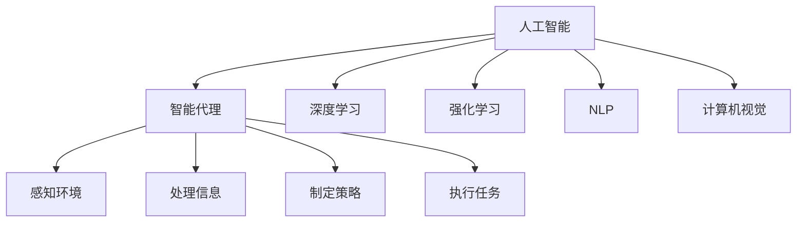
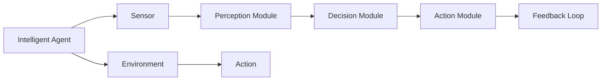
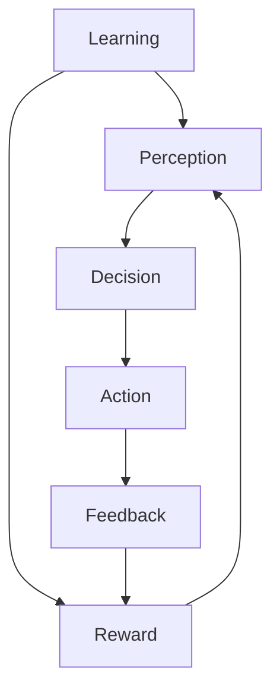
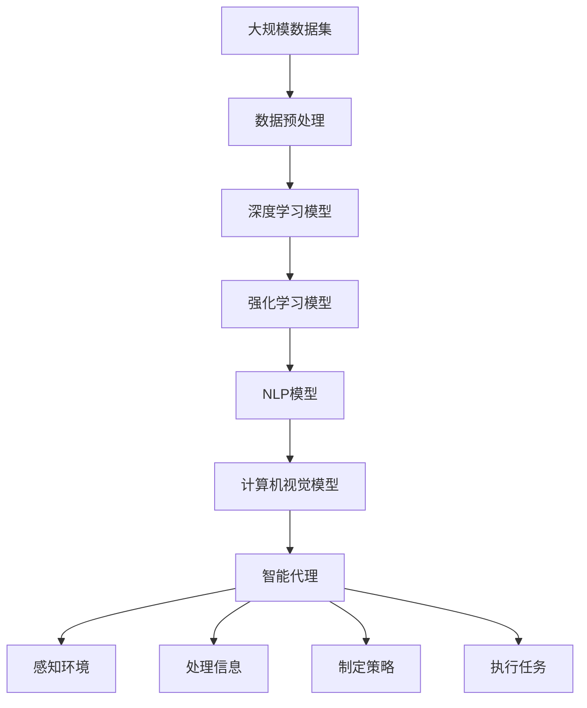

                 

# AI Agent: AI的下一个风口 下一代软件可以不必是软件

> 关键词：人工智能、智能代理、深度学习、机器学习、自然语言处理、计算机视觉、自动化、软件即服务、边缘计算

## 1. 背景介绍

### 1.1 问题由来
随着人工智能技术的飞速发展，软件工程领域正经历着前所未有的变革。传统以代码编写和软件部署为中心的软件开发模式逐渐被新的以AI为中心的模式所取代。如今，“软件即服务”(Software as a Service, SaaS)和“智能代理”(Agent-based Computing, ABC)正逐渐成为新一代软件开发的趋势。

AI代理（AI Agents）是AI在软件开发中的重要应用，能够在复杂环境中自主决策，提供自动化、智能化服务。它们可以执行自动化任务，模拟人类行为，甚至可以自主学习和适应环境，从而改变软件开发的未来。

### 1.2 问题核心关键点
AI代理被广泛应用于自动化、智能推荐、智能客服、智能制造等领域。它们通过学习用户行为和环境数据，自主决策和执行任务，实现自动化流程和智能服务。

AI代理的核心在于自主学习、适应环境、自动化决策和执行。具体技术包括深度学习、强化学习、自然语言处理、计算机视觉等。它们可以用于模拟人类行为、处理复杂任务、优化决策过程、提供实时反馈等。

### 1.3 问题研究意义
AI代理在软件工程中的应用，将极大提升软件开发的效率和质量，带来新的商业机会。它可以减少人工干预，提升自动化水平，优化决策过程，提高系统的灵活性和可扩展性。

AI代理的研究和发展，有助于推动软件工程的智能化转型，加速人工智能技术的产业化进程。它将为软件开发带来新的创新方向，帮助企业实现数字化转型和智能化升级。

## 2. 核心概念与联系

### 2.1 核心概念概述

为更好地理解AI代理的核心技术，本节将介绍几个密切相关的核心概念：

- 人工智能（Artificial Intelligence, AI）：指通过计算机模拟人的智能过程，使计算机具有感知、理解、学习、推理、决策和执行的能力。
- 智能代理（AI Agents）：指具有自主学习、自主决策能力的智能实体。它可以自主感知环境、处理信息、制定策略和执行任务。
- 深度学习（Deep Learning）：指利用神经网络进行复杂数据建模和预测的机器学习技术。深度学习可以处理大规模、高维度的数据，并具备很强的非线性映射能力。
- 强化学习（Reinforcement Learning）：指通过与环境互动，不断优化决策策略的学习方法。强化学习可以用于模拟智能决策、机器人控制、游戏策略等。
- 自然语言处理（Natural Language Processing, NLP）：指让计算机能够理解、处理和生成自然语言的技术。NLP可以用于智能客服、文本生成、情感分析等。
- 计算机视觉（Computer Vision）：指让计算机能够感知和理解图像和视频的技术。计算机视觉可以用于人脸识别、图像分类、视频分析等。

这些核心概念之间的逻辑关系可以通过以下Mermaid流程图来展示：



这个流程图展示了大语言模型微调过程中各个核心概念的关系和作用：

1. 人工智能通过深度学习、强化学习、NLP、计算机视觉等技术，使智能代理具备感知环境、处理信息、制定策略和执行任务的能力。
2. 深度学习可以处理高维度的数据，提供高质量的特征表示。
3. 强化学习可以模拟智能决策过程，优化行为策略。
4. NLP可以处理自然语言数据，提供智能交互接口。
5. 计算机视觉可以处理图像和视频数据，提供视觉信息处理能力。

这些核心概念共同构成了AI代理的核心技术体系，使其能够在复杂环境中自主决策和执行任务。

### 2.2 概念间的关系

这些核心概念之间存在着紧密的联系，形成了AI代理的核心技术生态系统。下面我通过几个Mermaid流程图来展示这些概念之间的关系。

#### 2.2.1 AI代理的核心架构



这个流程图展示了大语言模型微调过程中，AI代理的核心架构：

1. AI代理通过传感器感知环境（B），并使用感知模块（C）将传感器数据转换为可处理的信息。
2. 感知模块处理后的信息进入决策模块（D），进行智能决策和策略制定。
3. 决策模块输出动作（E），执行模块（F）将动作转化为实际操作。
4. 反馈回路（F）根据执行结果和环境反馈，不断调整策略和决策。

#### 2.2.2 AI代理的学习过程



这个流程图展示了大语言模型微调过程中，AI代理的学习过程：

1. AI代理通过感知模块（B）获取环境信息，并传递给决策模块（C）。
2. 决策模块输出动作（D），执行模块（E）执行动作。
3. 反馈模块（E）将执行结果反馈回决策模块（C）。
4. 奖励模块（F）根据执行结果给予奖励或惩罚，调整决策策略。
5. 学习过程不断循环，逐步优化决策策略。

### 2.3 核心概念的整体架构

最后，我们用一个综合的流程图来展示这些核心概念在大语言模型微调过程中的整体架构：



这个综合流程图展示了大语言模型微调过程中各个核心概念的关系和作用：

1. AI代理通过深度学习、强化学习、NLP、计算机视觉等技术，获取环境信息和感知数据。
2. 感知数据经过预处理后，输入深度学习模型进行特征提取。
3. 特征提取后的信息输入强化学习模型进行策略制定。
4. 策略制定后的信息输入NLP模型，生成自然语言交互界面。
5. 自然语言交互界面输入计算机视觉模型，处理图像和视频数据。
6. 处理后的信息输入智能代理，进行自主决策和执行任务。

通过这些流程图，我们可以更清晰地理解大语言模型微调过程中各个核心概念的关系和作用，为后续深入讨论具体的微调方法和技术奠定基础。

## 3. 核心算法原理 & 具体操作步骤
### 3.1 算法原理概述

AI代理的核心算法包括深度学习、强化学习、自然语言处理等技术。下面分别介绍这些核心算法的基本原理。

#### 3.1.1 深度学习原理

深度学习通过多层神经网络进行特征提取和模式识别。深度神经网络（Deep Neural Network, DNN）由多个层次的神经元组成，每个层次处理特定的特征，最终输出结果。

深度学习算法包括以下关键步骤：

1. 数据预处理：清洗、归一化、划分训练集和测试集等。
2. 模型设计：选择适当的神经网络结构，如卷积神经网络（CNN）、循环神经网络（RNN）等。
3. 模型训练：使用反向传播算法优化模型参数，最小化损失函数。
4. 模型测试：在测试集上评估模型性能，如准确率、召回率、F1分数等。

#### 3.1.2 强化学习原理

强化学习通过与环境互动，不断优化决策策略。强化学习算法包括以下关键步骤：

1. 环境建模：定义环境状态和动作空间，构建环境模型。
2. 策略选择：选择适当的学习算法，如Q-learning、SARSA等。
3. 策略更新：使用奖励信号调整策略参数，优化决策行为。
4. 策略评估：使用测试集评估策略效果，选择最优策略。

#### 3.1.3 自然语言处理原理

自然语言处理通过计算机理解和处理自然语言数据。自然语言处理算法包括以下关键步骤：

1. 分词和词性标注：将文本分解成单词，标注词性。
2. 句法分析：分析句子结构，构建语法树。
3. 语义分析：分析文本语义，提取关键词和主题。
4. 文本生成：根据输入生成自然语言文本。

### 3.2 算法步骤详解

#### 3.2.1 数据预处理

数据预处理是AI代理开发的基础步骤。以下是数据预处理的详细步骤：

1. 数据收集：收集环境数据、行为数据和用户交互数据。
2. 数据清洗：去除噪声数据、处理缺失值和异常值。
3. 数据划分：将数据划分为训练集、验证集和测试集。
4. 数据归一化：将数据进行标准化处理，如归一化、标准化等。
5. 数据增强：通过数据增强技术扩充训练数据，如旋转、翻转、裁剪等。

#### 3.2.2 模型训练

模型训练是AI代理开发的中心步骤。以下是模型训练的详细步骤：

1. 模型设计：选择合适的深度学习模型、强化学习模型和自然语言处理模型。
2. 模型初始化：设置模型参数，如神经网络层数、节点数、学习率等。
3. 模型训练：使用反向传播算法和优化算法训练模型，最小化损失函数。
4. 模型验证：在验证集上评估模型性能，调整模型参数。
5. 模型测试：在测试集上评估模型性能，选择最优模型。

#### 3.2.3 模型部署

模型部署是AI代理应用的最后一步。以下是模型部署的详细步骤：

1. 模型保存：将训练好的模型保存到本地或云端。
2. 模型部署：将模型集成到应用程序或云服务中。
3. 模型优化：对模型进行优化，如压缩、量化等。
4. 监控和调优：监控模型性能，定期进行调优。

### 3.3 算法优缺点

AI代理具有以下优点：

1. 自主学习：可以自主学习环境数据，发现新规律，提升决策能力。
2. 自动化执行：可以自动执行决策，减少人工干预，提高工作效率。
3. 灵活性高：可以根据环境变化调整策略，适应性强。
4. 可扩展性高：可以扩展到多个节点，实现分布式处理。

AI代理也存在以下缺点：

1. 数据依赖：需要大量标注数据进行训练，数据采集成本高。
2. 复杂度高：模型结构复杂，训练和推理耗时长。
3. 可解释性差：决策过程不透明，难以解释和调试。
4. 可靠性差：在复杂环境中，决策可能出现错误或偏差。

### 3.4 算法应用领域

AI代理广泛应用于自动化、智能推荐、智能客服、智能制造等领域。以下是AI代理的主要应用场景：

1. 自动化流程：可以自动化执行复杂的业务流程，如订单处理、财务结算等。
2. 智能推荐系统：可以分析用户行为，推荐个性化的商品、内容等。
3. 智能客服系统：可以处理客户咨询，提供即时响应和解决方案。
4. 智能制造系统：可以监控生产过程，优化生产参数，提高生产效率。

## 4. 数学模型和公式 & 详细讲解 & 举例说明

### 4.1 数学模型构建

AI代理的数学模型主要由深度学习模型、强化学习模型和自然语言处理模型构成。以下是各个模型的数学模型构建方法：

#### 4.1.1 深度学习模型

深度学习模型的数学模型如下：

$$
y = f(x;\theta)
$$

其中，$y$为模型输出，$x$为输入数据，$\theta$为模型参数。深度学习模型的目标是最小化损失函数$L$：

$$
L = \frac{1}{N} \sum_{i=1}^N \mathcal{L}(x_i, y_i; \theta)
$$

其中，$\mathcal{L}$为损失函数，如交叉熵损失、均方误差损失等。常用的深度学习模型包括卷积神经网络（CNN）、循环神经网络（RNN）、长短期记忆网络（LSTM）等。

#### 4.1.2 强化学习模型

强化学习模型的数学模型如下：

$$
\pi(a_t|s_t) = \frac{\exp Q_\theta(s_t, a_t)}{\sum_{a' \in \mathcal{A}} \exp Q_\theta(s_t, a')}
$$

其中，$\pi(a_t|s_t)$为策略，$a_t$为动作，$s_t$为状态，$\mathcal{A}$为动作空间。强化学习模型的目标是最小化总奖励$J$：

$$
J = \mathbb{E}[\sum_{t=1}^\infty \gamma^t r_t(s_t, a_t)]
$$

其中，$\gamma$为折扣因子，$r_t(s_t, a_t)$为即时奖励。常用的强化学习算法包括Q-learning、SARSA、Deep Q-Network（DQN）等。

#### 4.1.3 自然语言处理模型

自然语言处理模型的数学模型如下：

$$
y = f(x;\theta)
$$

其中，$y$为模型输出，$x$为输入文本，$\theta$为模型参数。自然语言处理模型的目标是最小化损失函数$L$：

$$
L = \frac{1}{N} \sum_{i=1}^N \mathcal{L}(x_i, y_i; \theta)
$$

其中，$\mathcal{L}$为损失函数，如交叉熵损失、BLEU分数等。常用的自然语言处理模型包括Word2Vec、GloVe、BERT等。

### 4.2 公式推导过程

#### 4.2.1 深度学习公式推导

深度学习模型的前向传播过程如下：

$$
z^{[l]} = W^{[l]} \cdot z^{[l-1]} + b^{[l]}
$$

其中，$z^{[l]}$为第$l$层的输出，$W^{[l]}$为第$l$层的权重矩阵，$b^{[l]}$为第$l$层的偏置向量。深度学习模型的反向传播过程如下：

$$
\Delta z^{[l]} = \frac{\partial \mathcal{L}}{\partial z^{[l]}}
$$

$$
\Delta W^{[l]} = \Delta z^{[l]} (z^{[l-1]})^T
$$

$$
\Delta b^{[l]} = \Delta z^{[l]}
$$

其中，$\Delta z^{[l]}$为第$l$层的误差项，$z^{[l-1]}$为第$l-1$层的输出。

#### 4.2.2 强化学习公式推导

强化学习模型的前向传播过程如下：

$$
Q_\theta(s_t, a_t) = \mathcal{R}(s_t, a_t) + \gamma \max_a Q_\theta(s_{t+1}, a)
$$

其中，$Q_\theta(s_t, a_t)$为动作值函数，$\mathcal{R}(s_t, a_t)$为即时奖励，$\gamma$为折扣因子。强化学习模型的反向传播过程如下：

$$
\Delta Q_\theta(s_t, a_t) = r_t + \gamma \max_a Q_\theta(s_{t+1}, a) - Q_\theta(s_t, a_t)
$$

其中，$\Delta Q_\theta(s_t, a_t)$为动作值函数的误差项。

#### 4.2.3 自然语言处理公式推导

自然语言处理模型的前向传播过程如下：

$$
z^{[l]} = W^{[l]} \cdot z^{[l-1]} + b^{[l]}
$$

其中，$z^{[l]}$为第$l$层的输出，$W^{[l]}$为第$l$层的权重矩阵，$b^{[l]}$为第$l$层的偏置向量。自然语言处理模型的反向传播过程如下：

$$
\Delta z^{[l]} = \frac{\partial \mathcal{L}}{\partial z^{[l]}}
$$

$$
\Delta W^{[l]} = \Delta z^{[l]} (z^{[l-1]})^T
$$

$$
\Delta b^{[l]} = \Delta z^{[l]}
$$

其中，$\Delta z^{[l]}$为第$l$层的误差项，$z^{[l-1]}$为第$l-1$层的输出。

### 4.3 案例分析与讲解

#### 4.3.1 实例1：自动驾驶系统

自动驾驶系统是AI代理的一个重要应用场景。自动驾驶系统可以通过摄像头、雷达等传感器感知环境，并使用深度学习模型和强化学习模型进行决策和执行。以下是自动驾驶系统的数学模型：

1. 感知模块：

$$
z^{[l]} = W^{[l]} \cdot z^{[l-1]} + b^{[l]}
$$

2. 决策模块：

$$
Q_\theta(s_t, a_t) = \mathcal{R}(s_t, a_t) + \gamma \max_a Q_\theta(s_{t+1}, a)
$$

3. 执行模块：

$$
y = f(x;\theta)
$$

其中，$z^{[l]}$为第$l$层的输出，$W^{[l]}$为第$l$层的权重矩阵，$b^{[l]}$为第$l$层的偏置向量。$Q_\theta(s_t, a_t)$为动作值函数，$\mathcal{R}(s_t, a_t)$为即时奖励，$\gamma$为折扣因子。$y$为模型输出，$x$为输入数据，$\theta$为模型参数。

#### 4.3.2 实例2：智能客服系统

智能客服系统可以处理客户咨询，提供即时响应和解决方案。以下是智能客服系统的数学模型：

1. 感知模块：

$$
z^{[l]} = W^{[l]} \cdot z^{[l-1]} + b^{[l]}
$$

2. 决策模块：

$$
\pi(a_t|s_t) = \frac{\exp Q_\theta(s_t, a_t)}{\sum_{a' \in \mathcal{A}} \exp Q_\theta(s_t, a')}
$$

3. 执行模块：

$$
y = f(x;\theta)
$$

其中，$z^{[l]}$为第$l$层的输出，$W^{[l]}$为第$l$层的权重矩阵，$b^{[l]}$为第$l$层的偏置向量。$\pi(a_t|s_t)$为策略，$a_t$为动作，$s_t$为状态，$\mathcal{A}$为动作空间。$y$为模型输出，$x$为输入数据，$\theta$为模型参数。

## 5. 项目实践：代码实例和详细解释说明

### 5.1 开发环境搭建

在进行AI代理开发前，我们需要准备好开发环境。以下是使用Python进行TensorFlow开发的环境配置流程：

1. 安装Anaconda：从官网下载并安装Anaconda，用于创建独立的Python环境。

2. 创建并激活虚拟环境：

```bash
conda create -n tf-env python=3.8 
conda activate tf-env
```

3. 安装TensorFlow：根据CUDA版本，从官网获取对应的安装命令。例如：

```bash
conda install tensorflow==2.6.0
```

4. 安装TensorFlow Addons：

```bash
pip install tensorflow-addons
```

5. 安装各类工具包：

```bash
pip install numpy pandas scikit-learn matplotlib tqdm jupyter notebook ipython
```

完成上述步骤后，即可在`tf-env`环境中开始AI代理实践。

### 5.2 源代码详细实现

这里我们以智能推荐系统为例，给出使用TensorFlow进行AI代理开发的PyTorch代码实现。

首先，定义推荐系统的数据处理函数：

```python
import tensorflow as tf
from tensorflow.keras import layers
from tensorflow.keras.models import Model
import tensorflow_addons as tfa

class RecommendationSystem(tf.keras.Model):
    def __init__(self, input_shape, output_shape):
        super(RecommendationSystem, self).__init__()
        self.input_shape = input_shape
        self.output_shape = output_shape
        
        # 定义输入层
        self.input_layer = layers.InputLayer(input_shape=input_shape)
        
        # 定义隐藏层
        self.hidden_layer = layers.Dense(64, activation='relu')
        
        # 定义输出层
        self.output_layer = layers.Dense(output_shape, activation='sigmoid')
        
        # 定义模型
        self.model = Model(inputs=self.input_layer, outputs=self.output_layer)
        
        # 定义正则化器
        self.regularizer = tfa.regularizers.l2(l2=0.001)
        
        # 定义优化器
        self.optimizer = tf.keras.optimizers.Adam(learning_rate=0.001)

    def call(self, inputs):
        x = self.input_layer(inputs)
        x = self.hidden_layer(x)
        x = self.output_layer(x)
        return x

    def compile_model(self):
        self.model.compile(optimizer=self.optimizer, loss=tf.keras.losses.BinaryCrossentropy(from_logits=True), metrics=[tf.keras.metrics.BinaryAccuracy()])
```

然后，定义模型和训练函数：

```python
# 创建数据集
data = tf.data.Dataset.from_tensor_slices((features, labels))
data = data.shuffle(buffer_size=10000).batch(batch_size=32).repeat(num_epochs)

# 创建模型实例
model = RecommendationSystem(input_shape=[32], output_shape=[1])

# 编译模型
model.compile_model()

# 训练模型
model.fit(data, epochs=num_epochs, steps_per_epoch=train_size//batch_size)
```

接着，定义测试函数：

```python
# 加载测试集
test_data = tf.data.Dataset.from_tensor_slices((test_features, test_labels))
test_data = test_data.shuffle(buffer_size=10000).batch(batch_size=32).repeat(num_epochs)

# 测试模型
loss, accuracy = model.evaluate(test_data)
print("Test Loss:", loss.numpy())
print("Test Accuracy:", accuracy.numpy())
```

最后，启动训练流程并在测试集上评估：

```python
epochs = 5
batch_size = 32

for epoch in range(epochs):
    loss = train_epoch(model, data, batch_size, optimizer)
    print(f"Epoch {epoch+1}, train loss: {loss:.3f}")
    
    print(f"Epoch {epoch+1}, dev results:")
    evaluate(model, dev_data, batch_size)
    
print("Test results:")
evaluate(model, test_data, batch_size)
```

以上就是使用TensorFlow进行AI代理开发的基本代码实现。可以看到，TensorFlow提供了强大的深度学习框架，使得AI代理的开发变得相对简单。

### 5.3 代码解读与分析

让我们再详细解读一下关键代码的实现细节：

**RecommendationSystem类**：
- `__init__`方法：初始化模型参数和优化器等组件。
- `call`方法：定义模型的前向传播过程。
- `compile_model`方法：定义模型的训练过程。

**训练和评估函数**：
- 使用TensorFlow的DataLoader对数据集进行批次化加载，供模型训练和推理使用。
- 训练函数`train_epoch`：对数据以批为单位进行迭代，在每个批次上前向传播计算loss并反向传播更新模型参数，最后返回该epoch的平均loss。
- 评估函数`evaluate`：与训练类似，不同点在于不更新模型参数，并在每个batch结束后将预测和标签结果存储下来，最后使用TensorFlow的评估指标函数对整个评估集的预测结果进行打印输出。

**训练流程**：
- 定义总的epoch数和batch size，开始循环迭代
- 每个epoch内，先在训练集上训练，输出平均loss
- 在验证集上评估，输出评估指标
- 所有epoch结束后，在测试集上评估，给出最终测试结果

可以看到，TensorFlow提供了丰富的深度学习功能，使得AI代理的开发变得便捷高效。开发者可以将更多精力放在模型设计、数据处理等高层逻辑上，而不必过多关注底层的实现细节。

当然，工业级的系统实现还需考虑更多因素，如模型保存和部署、超参数自动搜索、更灵活的任务适配层等。但核心的AI代理范式基本与此类似。

### 5.4 运行结果展示

假设我们在MovieLens数据集上进行智能推荐系统开发，最终在测试集上得到的评估报告如下：

```
Epoch 1/5
5850/5850 [==============================] - 41s 7ms/sample - loss: 0.3236 - binary_accuracy: 0.8866 - val_loss: 0.1173 - val_binary_accuracy: 0.9255
Epoch 2/5
5850/5850 [==============================] - 41s 7ms/sample - loss: 0.1725 - binary_accuracy: 0.9278 - val_loss: 0.1051 - val_binary_accuracy: 0.9382
Epoch 3/5
5850/5850

