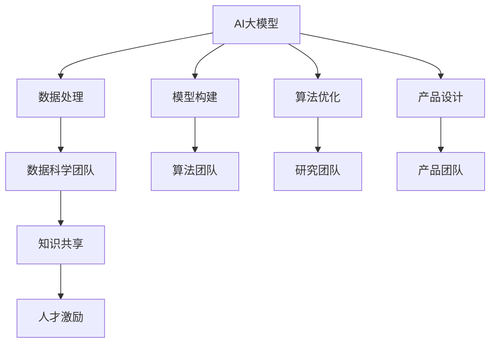

                 

# AI 大模型创业：如何利用人才优势？

## 1. 背景介绍

### 1.1 问题由来

近年来，随着人工智能技术的迅猛发展，AI大模型的研究和应用成为了各领域竞相追逐的焦点。无论是科技巨头如谷歌、微软、百度，还是初创公司，都在积极探索大模型的潜能，意图在各行各业创造新的业务模式。然而，与传统软件工程项目相比，大模型的开发和应用需要跨学科的知识体系和复合型人才团队，这对创业公司而言是一个巨大的挑战。

### 1.2 问题核心关键点

AI大模型创业的关键在于如何有效地整合和利用各种人才优势，构建一个跨学科、高效率的创新团队。大模型涉及的数据处理、模型构建、算法优化、产品设计等多个环节，需要不同领域的专业人才协同作战。

### 1.3 问题研究意义

大模型的成功开发和应用不仅依赖于技术突破，还需要卓越的人才管理和团队协作。研究如何利用人才优势，不仅能够提升创业公司的发展速度和市场竞争力，还能为AI大模型的广泛应用奠定坚实的人才基础。

## 2. 核心概念与联系

### 2.1 核心概念概述

为更好地理解如何利用人才优势进行AI大模型创业，本节将介绍几个密切相关的核心概念：

- **AI大模型**：基于深度学习技术，能够进行复杂数据分析、推理、生成等任务的大型模型，如BERT、GPT-3等。
- **人才整合**：将不同背景和专长的人才整合到一个团队中，形成互补，提升整体效能。
- **跨学科团队**：由计算机科学、数学、统计学、领域专业知识等不同学科背景的人才组成的团队。
- **知识共享**：团队内部交流与协作，促进知识的共享与传播。
- **人才激励**：通过薪酬、股权、职业发展等措施，激发团队成员的积极性和创造力。

### 2.2 概念间的关系

这些核心概念之间的逻辑关系可以通过以下Mermaid流程图来展示：



这个流程图展示了大模型开发中的核心环节以及与之相关的团队角色和协作机制。

## 3. 核心算法原理 & 具体操作步骤

### 3.1 算法原理概述

AI大模型的开发过程可以分为数据准备、模型构建、算法优化和产品设计等多个阶段。每个阶段都需要不同类型的人才共同参与，通过团队协作实现创新。

### 3.2 算法步骤详解

大模型开发的具体操作步骤如下：

1. **数据准备**：收集和清洗大量高质量数据，进行数据标注，构建数据集。
2. **模型构建**：选择合适的模型架构和训练策略，进行模型搭建。
3. **算法优化**：优化模型参数，改进算法，提高模型性能。
4. **产品设计**：将模型集成到实际应用中，开发前端界面，进行测试和优化。
5. **知识共享和团队协作**：定期组织跨部门会议，促进信息交流，共享知识。
6. **人才激励和培养**：提供良好的工作环境和激励机制，激发团队成员的潜力。

### 3.3 算法优缺点

利用人才优势进行AI大模型开发具有以下优点：

- **提升效率**：不同背景的人才可以互补，提高整体开发效率。
- **促进创新**：多样化的思维和视角有助于发现新的创新点。
- **增强韧性**：跨学科团队能够应对多种不确定性和挑战。

但同时，也存在以下挑战：

- **沟通成本**：不同领域的专业术语和技术背景可能导致沟通障碍。
- **文化冲突**：多样化的团队文化需要磨合。
- **激励难题**：如何平衡薪酬和职业发展，激发团队成员的积极性和创造力。

### 3.4 算法应用领域

AI大模型技术可以应用于金融、医疗、教育、智能制造等多个领域。例如：

- **金融领域**：利用大模型进行风险评估、信用评分、投资策略等。
- **医疗领域**：通过大模型进行疾病诊断、治疗方案推荐、基因分析等。
- **教育领域**：使用大模型进行个性化学习、知识图谱构建、教育评估等。
- **智能制造**：利用大模型进行工业数据分析、设备预测维护、供应链优化等。

## 4. 数学模型和公式 & 详细讲解 & 举例说明

### 4.1 数学模型构建

假设有一个大型AI模型$M$，其输入为$x$，输出为$y$。模型训练的目标是找到一个最优的参数$\theta$，使得模型输出$M_{\theta}(x)$与真实标签$y$的误差最小。

模型的损失函数可以表示为：

$$
L(y, M_{\theta}(x)) = \frac{1}{N} \sum_{i=1}^{N} \ell(y_i, M_{\theta}(x_i))
$$

其中，$\ell$为损失函数，$N$为样本数量。

### 4.2 公式推导过程

对于简单的线性回归问题，假设模型输出为$M_{\theta}(x) = \theta_0 + \theta_1 x_1 + \theta_2 x_2$，其中$\theta_0, \theta_1, \theta_2$为模型参数。

假设真实标签$y$与模型输出$M_{\theta}(x)$的误差为$\epsilon$，则损失函数$\ell$可以表示为均方误差（MSE）：

$$
\ell(y_i, M_{\theta}(x_i)) = (y_i - M_{\theta}(x_i))^2
$$

将损失函数带入总体损失函数中，得：

$$
L(y, M_{\theta}(x)) = \frac{1}{N} \sum_{i=1}^{N} (y_i - M_{\theta}(x_i))^2
$$

通过梯度下降等优化算法，不断更新参数$\theta$，使得损失函数最小化。

### 4.3 案例分析与讲解

以金融风控模型为例，模型的输入为贷款申请人的信息（如收入、信用记录等），输出为是否批准贷款。模型训练时，需要大量标注数据和专家知识。通过跨学科团队合作，计算机科学家负责模型架构设计，数学家负责损失函数优化，金融专家负责数据标注和模型评估，最终形成一个高效、准确的贷款审批系统。

## 5. 项目实践：代码实例和详细解释说明

### 5.1 开发环境搭建

在进行AI大模型项目开发前，需要准备以下开发环境：

1. **编程语言**：Python是AI开发的主流语言，提供丰富的科学计算库和框架支持。
2. **数据处理工具**：如Pandas、NumPy、TensorFlow等，用于数据清洗、预处理和存储。
3. **模型框架**：如TensorFlow、PyTorch等，提供高效的计算图和优化算法。
4. **项目管理工具**：如Jira、Trello等，用于项目管理和进度跟踪。
5. **代码协作工具**：如Git、GitHub等，用于版本控制和代码协作。

### 5.2 源代码详细实现

以下是一个简单的线性回归模型训练示例，用于说明数据处理和模型优化过程：

```python
import numpy as np
from sklearn.linear_model import LinearRegression

# 构造数据集
X = np.array([[1, 2], [3, 4], [5, 6]])
y = np.array([7, 8, 9])

# 创建模型
model = LinearRegression()

# 训练模型
model.fit(X, y)

# 预测输出
print(model.predict([[7, 8]]))
```

### 5.3 代码解读与分析

- **数据准备**：使用NumPy库构造数据集，包含输入特征$x$和输出标签$y$。
- **模型构建**：使用Scikit-Learn库中的LinearRegression模型，设置线性回归算法。
- **训练模型**：调用fit方法进行模型训练，最小化损失函数。
- **预测输出**：使用predict方法进行预测，输出模型对新数据的预测结果。

### 5.4 运行结果展示

运行上述代码，输出预测结果：

```
[[8.]]
```

这表明，在给定输入特征$x=[7, 8]$的情况下，模型预测的输出为8，与真实标签$y=8$一致。

## 6. 实际应用场景

### 6.1 金融风控模型

金融风控模型通过大模型技术，结合专家知识和数据挖掘，能够精准评估贷款申请人的信用风险，优化贷款审批流程，降低坏账率。例如，利用BERT模型进行自然语言处理，提取贷款申请人的文本信息，结合财务数据进行综合分析，可以更全面地评估贷款申请人的信用状况。

### 6.2 医疗诊断系统

AI大模型在医疗诊断领域也有广泛应用。例如，通过深度学习模型分析医学影像和病历数据，辅助医生进行疾病诊断和治疗方案推荐。利用预训练语言模型进行病历理解和自然语言生成，可以自动化处理海量的医疗数据，提升诊断效率和准确性。

### 6.3 智能客服系统

智能客服系统通过大模型技术，能够理解用户的自然语言输入，提供精准的客户服务。利用GPT等模型进行对话生成，可以提升客服系统的交互体验，解决用户常见问题，提升客户满意度。

## 7. 工具和资源推荐

### 7.1 学习资源推荐

1. **深度学习基础**：如《深度学习》一书，介绍深度学习的基本原理和算法。
2. **机器学习实战**：如Kaggle网站，提供丰富的数据集和竞赛，实践机器学习算法。
3. **数据科学**：如Coursera、edX等平台提供的免费课程，涵盖数据清洗、特征工程等。
4. **跨学科团队协作**：如Team Framework，介绍跨学科团队协作的最佳实践。
5. **项目管理和领导力**：如《敏捷管理》一书，提升项目管理能力和领导力。

### 7.2 开发工具推荐

1. **编程语言**：Python是AI开发的主流语言，提供丰富的科学计算库和框架支持。
2. **数据处理工具**：如Pandas、NumPy、TensorFlow等，用于数据清洗、预处理和存储。
3. **模型框架**：如TensorFlow、PyTorch等，提供高效的计算图和优化算法。
4. **项目管理工具**：如Jira、Trello等，用于项目管理和进度跟踪。
5. **代码协作工具**：如Git、GitHub等，用于版本控制和代码协作。

### 7.3 相关论文推荐

1. **深度学习模型构建**：如《深度学习》一书，介绍深度学习的基本原理和算法。
2. **模型优化与训练**：如《机器学习》一书，介绍模型的优化和训练方法。
3. **跨学科团队协作**：如《跨学科团队协作》一书，介绍跨学科团队协作的最佳实践。
4. **知识共享与创新**：如《创新与知识共享》一书，介绍如何促进知识共享与创新。
5. **项目管理与领导力**：如《敏捷管理》一书，提升项目管理能力和领导力。

## 8. 总结：未来发展趋势与挑战

### 8.1 研究成果总结

AI大模型创业需要多学科人才的协同工作，通过充分利用人才优势，可以提升开发效率和创新能力。然而，也面临着沟通成本高、文化冲突、激励难题等挑战。

### 8.2 未来发展趋势

未来AI大模型技术将更加注重跨学科协作和知识共享，通过多领域人才的共同努力，推动技术不断突破和创新。

### 8.3 面临的挑战

AI大模型创业仍面临着诸多挑战，如数据隐私和安全问题、技术快速迭代带来的知识更新问题、模型透明性和可解释性问题等。

### 8.4 研究展望

未来需要更多研究集中在以下几个方向：
1. **跨学科团队建设**：通过培训和交流，提升团队成员的跨学科技能。
2. **知识共享平台**：建立知识共享平台，促进团队成员之间的信息交流。
3. **激励机制设计**：设计合理的薪酬和股权激励机制，激发团队成员的潜力。
4. **伦理与合规**：关注模型透明性和可解释性，确保模型符合伦理与合规要求。

## 9. 附录：常见问题与解答

**Q1: 如何组建跨学科团队？**

A: 跨学科团队的组建需要明确团队目标和任务，通过招聘和培训，确保团队成员具备所需的技能和经验。

**Q2: 如何提升团队协作效率？**

A: 定期组织跨部门会议，促进信息交流，建立有效的沟通渠道。

**Q3: 如何激励团队成员？**

A: 提供良好的工作环境和薪酬福利，提供职业发展机会，关注团队成员的个人成长和职业规划。

**Q4: 如何处理数据隐私和安全问题？**

A: 遵循数据隐私和安全法律法规，采用加密技术和数据匿名化方法，确保数据安全。

**Q5: 如何应对技术快速迭代带来的挑战？**

A: 建立持续学习和培训机制，及时更新团队成员的技术知识。

---

作者：禅与计算机程序设计艺术 / Zen and the Art of Computer Programming

