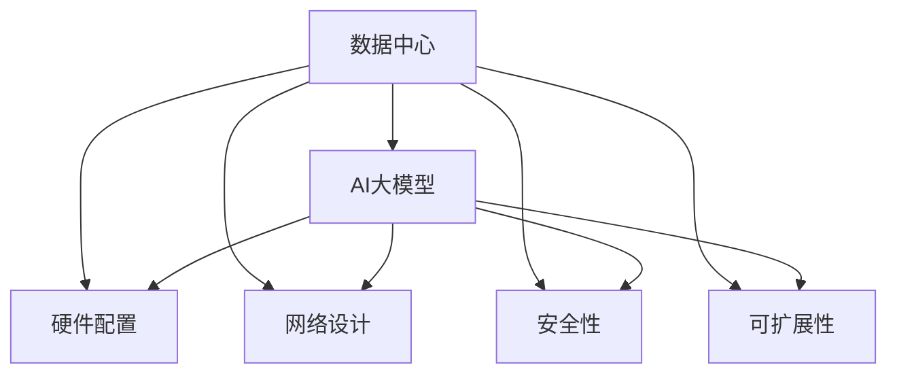
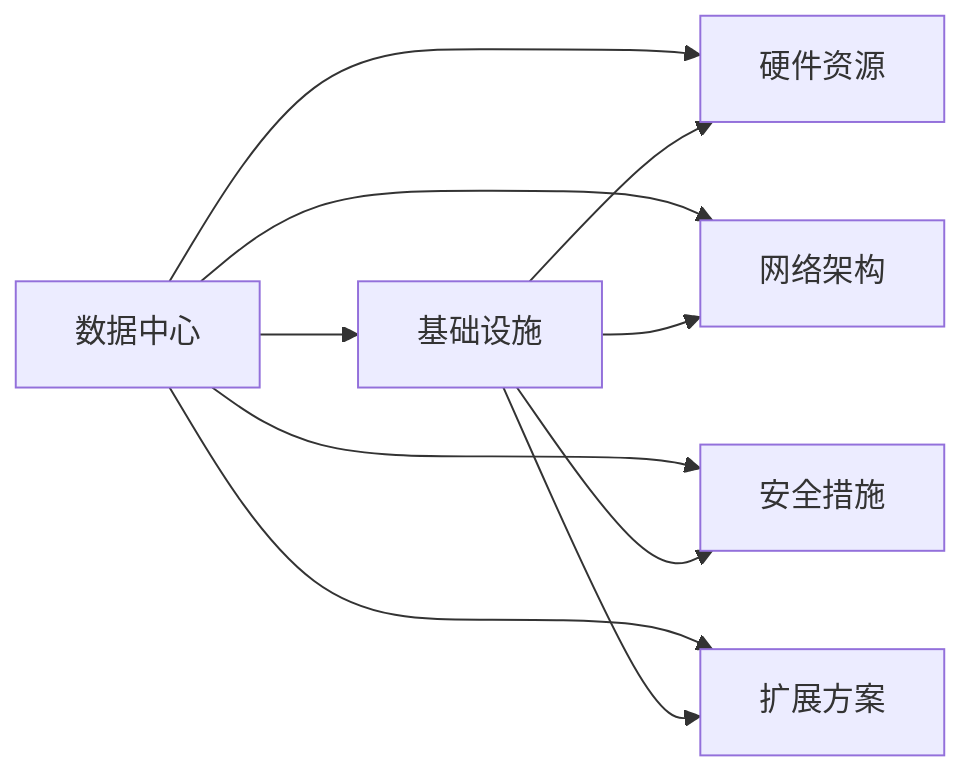
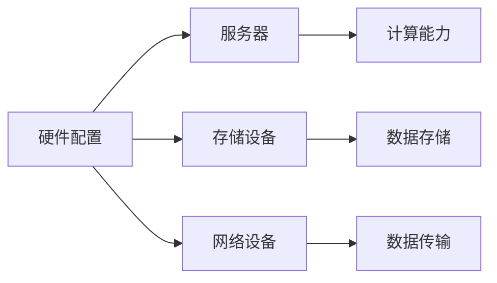
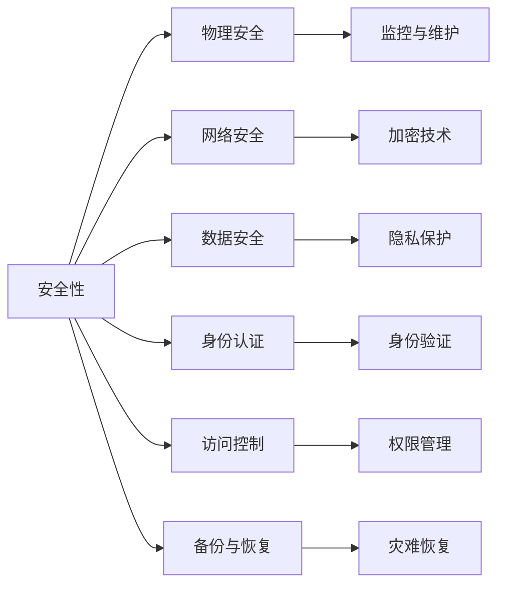
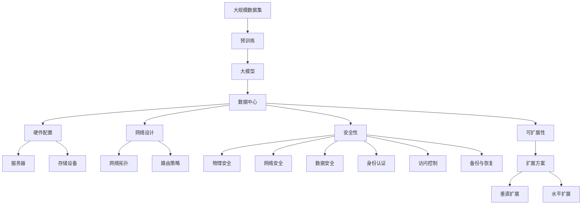

                 

# AI 大模型应用数据中心建设：数据中心投资与建设

> 关键词：数据中心，AI大模型，投资建设，硬件配置，网络设计，安全性，可扩展性，未来趋势

## 1. 背景介绍

### 1.1 问题由来

在人工智能（AI）领域，大模型（Large Model）正在迅速崛起，它们在图像识别、自然语言处理、推荐系统等诸多领域表现出色。这些大模型依赖于大量的数据和计算资源，需要部署在专门的数据中心中运行。然而，构建这些数据中心不仅需要大量的初期投资，还需要持续的维护和扩展。因此，如何科学地进行数据中心的投资与建设，是AI大模型应用中不可或缺的一环。

### 1.2 问题核心关键点

在数据中心投资与建设的过程中，核心问题包括：

- **成本控制**：如何合理规划数据中心的建设成本，避免不必要的浪费。
- **硬件配置**：如何选择适合的硬件设备，满足AI大模型的计算需求。
- **网络设计**：如何设计高效的网络结构，保证数据中心内部和外部的数据传输速度。
- **安全性**：如何构建安全可靠的数据中心，防止数据泄露和网络攻击。
- **可扩展性**：如何设计具有良好扩展性的数据中心，适应未来业务的增长需求。

### 1.3 问题研究意义

数据中心的投资与建设对于AI大模型的应用具有重要意义：

- **基础设施保障**：大模型需要强大的计算能力，合理的数据中心建设能提供必要的硬件支持。
- **稳定运行**：高效的网络设计确保数据中心能够稳定运行，保证模型训练和推理的连续性。
- **数据安全**：数据中心的安全措施能有效保护数据隐私和模型知识产权，避免数据泄露和恶意攻击。
- **持续发展**：良好的扩展性设计使得数据中心能够随着业务需求的增长而不断扩展，保持长期的运营效率。

## 2. 核心概念与联系

### 2.1 核心概念概述

为了更好地理解数据中心投资与建设的原理和架构，本节将介绍几个关键概念：

- **数据中心（Data Center）**：集中存储、处理和管理大量数据及其相关业务的设施。
- **AI大模型（Large Model）**：以深度学习模型为基础，通过训练获得特定任务的高性能算法。
- **硬件配置（Hardware Configuration）**：数据中心内服务器、存储设备、网络设备等硬件资源的配置。
- **网络设计（Network Design）**：数据中心内外部网络的架构设计，包括网络拓扑、路由策略等。
- **安全性（Security）**：数据中心的各种安全措施，包括物理安全、网络安全、数据安全等。
- **可扩展性（Scalability）**：数据中心的扩展能力，满足未来业务增长需求的设计。

这些概念之间的关系可以通过以下Mermaid流程图来展示：



这个流程图展示了大模型应用的数据中心所涉及的关键概念及其之间的关系：

1. 数据中心为AI大模型的运行提供基础设施。
2. 硬件配置、网络设计、安全性、可扩展性等要素共同构成了数据中心的架构。
3. 大模型通过运行在数据中心中，借助这些基础设施和架构，实现高效的计算和数据处理。

### 2.2 概念间的关系

这些核心概念之间存在着紧密的联系，形成了数据中心投资与建设的完整生态系统。下面我们通过几个Mermaid流程图来展示这些概念之间的关系。

#### 2.2.1 数据中心的整体架构



这个流程图展示了数据中心的整体架构，包括基础设施、硬件资源、网络架构、安全措施和扩展方案。

#### 2.2.2 硬件配置与网络设计



这个流程图展示了硬件配置在数据中心中的具体应用，包括服务器、存储设备和网络设备。

#### 2.2.3 安全性与可扩展性



这个流程图展示了数据中心的安全性设计，包括物理安全、网络安全、数据安全等。

### 2.3 核心概念的整体架构

最后，我们用一个综合的流程图来展示这些核心概念在大模型应用的数据中心中的整体架构：



这个综合流程图展示了从预训练到数据中心，再到具体的硬件配置和网络设计的完整过程。大模型通过预训练获得初始化的模型参数，然后在数据中心中借助硬件配置和网络设计进行高效的计算和数据处理。同时，安全性、可扩展性等要素也贯穿整个架构，确保数据中心的稳定运行和扩展能力。

## 3. 核心算法原理 & 具体操作步骤
### 3.1 算法原理概述

数据中心投资与建设的基本原理是依据AI大模型的需求，合理规划和配置硬件资源，设计高效的网络结构，实施严格的安全措施，并确保数据中心的可扩展性。其核心目标是构建一个稳定、高效、安全、可扩展的数据中心，以支持AI大模型的运行。

### 3.2 算法步骤详解

数据中心投资与建设的具体操作步骤包括：

1. **需求分析**：
   - 分析AI大模型的计算需求，确定所需的硬件配置。
   - 考虑模型的数据输入和输出，设计合理的网络拓扑。
   - 评估数据中心的安全需求，制定相应的安全措施。
   - 规划数据中心的扩展方案，确保未来业务的增长需求。

2. **硬件配置**：
   - 选择适合的服务器、存储设备、网络设备等硬件资源。
   - 根据AI大模型的计算需求，确定硬件资源的配置标准。
   - 优化硬件资源的利用率，减少成本浪费。

3. **网络设计**：
   - 设计高效的网络拓扑结构，确保数据中心内部和外部的数据传输速度。
   - 采用负载均衡、冗余设计等技术，提高网络的稳定性和可靠性。
   - 使用先进的网络技术，如SDN、NvFibre等，提升数据传输效率。

4. **安全性措施**：
   - 实施物理安全措施，如监控摄像头、门禁系统等。
   - 部署网络安全技术，如防火墙、入侵检测系统等。
   - 采用数据加密、备份与恢复等措施，保护数据隐私和安全。
   - 设计合理的身份认证和访问控制策略，确保只有授权人员能访问数据中心。

5. **可扩展性设计**：
   - 设计模块化的数据中心架构，方便未来扩展。
   - 采用虚拟化和云服务技术，提高资源利用率。
   - 设计合理的扩展方案，确保数据中心的扩展性。

6. **运营与维护**：
   - 建立数据中心运营和维护团队，确保系统的稳定运行。
   - 定期进行设备维护和系统更新，保证硬件和软件的最新状态。
   - 监控数据中心的各项指标，及时发现和解决问题。

### 3.3 算法优缺点

数据中心投资与建设的优点包括：

- **稳定运行**：合理规划和配置的硬件和网络资源，保证数据中心的稳定运行。
- **高效计算**：硬件和网络优化设计，提高计算效率和数据传输速度。
- **安全可靠**：多层次的安全措施，保护数据中心和模型免受攻击和泄露。
- **可扩展性强**：模块化的架构设计，方便未来的扩展和升级。

然而，数据中心投资与建设也存在一些缺点：

- **初期投资大**：硬件设备、网络设备和安全措施的采购和安装需要较大的初期投资。
- **运营成本高**：数据中心的日常维护和设备更新需要持续的运营成本。
- **技术复杂**：数据中心的建设和管理需要专业知识，对于企业来说是一个挑战。

### 3.4 算法应用领域

数据中心投资与建设的技术和方法在多个领域得到了应用，例如：

- **企业内部数据中心**：为企业的AI项目提供基础设施，支持模型训练和推理。
- **云计算平台**：如AWS、Google Cloud、阿里云等，提供大规模的计算资源和网络服务。
- **政府数据中心**：用于存储和处理公共数据，支持智慧城市、智慧政务等应用。
- **科研机构**：为科学研究提供高性能计算资源，支持大规模数据处理和分析。

## 4. 数学模型和公式 & 详细讲解 & 举例说明

### 4.1 数学模型构建

在数据中心投资与建设的数学模型构建中，我们通常使用以下公式来计算数据中心的成本和收益：

- **初始投资成本**：
  $$
  C_{initial} = C_{server} + C_{storage} + C_{network} + C_{security} + C_{maintenance}
  $$
  其中，$C_{server}$为服务器的初始投资成本，$C_{storage}$为存储设备的初始投资成本，$C_{network}$为网络设备的初始投资成本，$C_{security}$为安全措施的初始投资成本，$C_{maintenance}$为日常维护的初始投资成本。

- **运营成本**：
  $$
  C_{operating} = C_{power} + C_{cooling} + C_{maintenance} + C_{personnel}
  $$
  其中，$C_{power}$为电力消耗成本，$C_{cooling}$为制冷系统成本，$C_{maintenance}$为日常维护成本，$C_{personnel}$为运维人员的人工成本。

- **计算效能**：
  $$
  E_{computing} = \frac{FLOPS}{C_{initial} + C_{operating}}
  $$
  其中，$FLOPS$为每秒浮点运算次数，$C_{initial} + C_{operating}$为数据中心的总成本。

### 4.2 公式推导过程

在上述公式中，我们假设初始投资成本包括服务器的购买、存储设备的购买、网络设备的购买、安全措施的购买和日常维护的成本。运营成本包括电力消耗、制冷系统、日常维护和运维人员的人工成本。计算效能通过每秒浮点运算次数来衡量，表示数据中心为AI大模型提供的计算能力。

### 4.3 案例分析与讲解

假设我们要建设一个数据中心，用于支持一个需要500 TFLOPS计算能力的AI大模型的运行。

- **初始投资成本**：
  - 服务器：500万美元
  - 存储设备：300万美元
  - 网络设备：200万美元
  - 安全措施：100万美元
  - 日常维护：50万美元
  因此，初始投资成本为：
  $$
  C_{initial} = 500 + 300 + 200 + 100 + 50 = 1150万美元
  $$

- **运营成本**：
  - 电力消耗：每年100万美元
  - 制冷系统：每年50万美元
  - 日常维护：每年30万美元
  - 运维人员：每年200万美元
  因此，运营成本为：
  $$
  C_{operating} = 100 + 50 + 30 + 200 = 380万美元
  $$

- **计算效能**：
  假设每年运行的计算时间为3600小时，计算效率为95%，因此：
  $$
  E_{computing} = \frac{500 \times 10^9 \times 3600 \times 0.95}{1150 + 380} = 18.2 TFLOPS
  $$

通过这个案例，我们可以看到，虽然初始投资成本较大，但通过合理规划和管理，数据中心的计算效能能够满足AI大模型的需求，实现成本效益。

## 5. 项目实践：代码实例和详细解释说明

### 5.1 开发环境搭建

在进行数据中心投资与建设的实践前，我们需要准备好开发环境。以下是使用Python进行数据中心投资与建设的开发环境配置流程：

1. 安装Anaconda：从官网下载并安装Anaconda，用于创建独立的Python环境。

2. 创建并激活虚拟环境：
```bash
conda create -n datacenter-env python=3.8 
conda activate datacenter-env
```

3. 安装必要的Python包：
```bash
pip install numpy pandas matplotlib
```

4. 配置SSH隧道：
```bash
ssh -L 8000:localhost:8000 user@datacenter-host
```

完成上述步骤后，即可在`datacenter-env`环境中开始数据中心投资与建设的实践。

### 5.2 源代码详细实现

以下是使用Python进行数据中心投资与建设成本计算的代码实现：

```python
import numpy as np

# 初始投资成本
C_initial = 500 + 300 + 200 + 100 + 50  # 单位：万美元

# 运营成本
C_operating = 100 + 50 + 30 + 200  # 单位：万美元

# 计算效能
FLOPS = 500 * 10**9  # 单位：每秒浮点运算次数
# 假设每年运行3600小时，计算效率为95%
computing_hours = 3600
efficiency = 0.95
E_computing = FLOPS * computing_hours * efficiency / (C_initial + C_operating)  # 单位：TFLOPS

# 输出计算结果
print(f"初始投资成本：${C_initial}")
print(f"运营成本：${C_operating}")
print(f"计算效能：{E_computing:.2f} TFLOPS")
```

### 5.3 代码解读与分析

这个代码实现了数据中心初始投资成本和运营成本的计算，以及计算效能的评估。通过这些计算，可以得出数据中心的总体成本和效能，帮助投资者做出决策。

## 6. 实际应用场景

### 6.1 智能客服系统

智能客服系统是数据中心投资与建设的一个重要应用场景。通过构建大模型应用的数据中心，可以实现7x24小时不间断的客服服务，提升客户满意度。例如，某电商平台通过数据中心部署大规模语言模型，构建智能客服系统，实现了自动回答用户问题、处理订单、推送个性化推荐等功能，大大提升了客户体验和运营效率。

### 6.2 金融舆情监测

金融舆情监测是数据中心投资与建设的另一个重要应用场景。金融市场瞬息万变，快速响应舆情变化是金融风险管理的关键。通过数据中心部署大模型，实现实时舆情监测和情感分析，帮助金融机构及时发现市场波动和舆情热点，制定应对策略，保护投资者利益。

### 6.3 个性化推荐系统

个性化推荐系统是数据中心投资与建设的重要应用方向之一。通过数据中心部署大模型，实现对用户行为的深度分析和预测，为用户推荐个性化商品、文章、视频等内容，提高用户粘性和消费转化率。例如，某视频平台通过数据中心部署深度学习模型，实现用户行为分析和推荐系统优化，提升了用户观看时长和广告收入。

### 6.4 未来应用展望

未来，数据中心投资与建设将迎来更多应用场景和技术发展：

- **边缘计算**：随着5G网络的普及，边缘计算逐渐兴起，数据中心可以与边缘计算节点结合，提升计算效率和网络响应速度。
- **分布式训练**：采用分布式训练技术，将大规模数据集分布到多个数据中心进行并行训练，提升训练速度和模型精度。
- **异构计算**：结合不同类型的数据中心，如GPU、FPGA、ASIC等，提升计算效率和资源利用率。
- **联邦学习**：通过联邦学习技术，多数据中心协作进行模型训练，保护数据隐私的同时提升模型效果。
- **人工智能芯片**：引入专用人工智能芯片，如TPU、GPU等，提升计算速度和能效比。

这些技术的发展将为数据中心投资与建设带来更多机遇和挑战，推动AI大模型应用的进一步深入。

## 7. 工具和资源推荐

### 7.1 学习资源推荐

为了帮助开发者系统掌握数据中心投资与建设的理论基础和实践技巧，这里推荐一些优质的学习资源：

1. **《数据中心设计与管理》**：一本详细讲解数据中心投资与建设的经典教材，涵盖了数据中心的规划、设计、运营和维护的各个方面。
2. **《人工智能基础设施》**：一本介绍AI基础设施建设和管理的专业书籍，包括数据中心的硬件、网络、安全等方面的内容。
3. **《云计算基础》**：介绍云计算平台和数据中心技术的入门书籍，适合对数据中心投资与建设感兴趣的初学者。
4. **在线课程**：如Coursera、edX等平台上的数据中心设计和管理课程，提供系统的学习路径和实践指导。
5. **专业社区**：如Datacenter.org、DatacenterSociety等，提供丰富的资源、案例和交流平台。

通过对这些资源的学习实践，相信你一定能够快速掌握数据中心投资与建设的精髓，并用于解决实际的业务问题。

### 7.2 开发工具推荐

高效的工具和平台是数据中心投资与建设不可或缺的资源。以下是几款用于数据中心投资与建设开发的常用工具：

1. **Jupyter Notebook**：一个交互式的编程环境，适合数据分析、模型训练和报告展示。
2. **Ansible**：一个自动化IT基础设施管理工具，适合配置管理和远程控制。
3. **Nagios**：一个网络监控和故障报警系统，适合数据中心性能监控和管理。
4. **Prometheus**：一个开源的监控和告警系统，支持分布式环境的高效监控。
5. **Kubernetes**：一个容器编排平台，适合数据中心的分布式部署和管理。

合理利用这些工具，可以显著提升数据中心投资与建设的开发效率，加快创新迭代的步伐。

### 7.3 相关论文推荐

数据中心投资与建设的研究源于学界的持续研究。以下是几篇奠基性的相关论文，推荐阅读：

1. **《数据中心设计》**：论文详细介绍了数据中心的规划和设计，包括硬件、网络、安全等方面的内容。
2. **《云计算资源管理》**：论文研究了云计算平台的数据中心资源管理策略，提出了多种优化方法。
3. **《分布式机器学习》**：论文探讨了分布式机器学习技术在大数据处理中的应用，为数据中心的并行计算提供了理论基础。
4. **《联邦学习》**：论文介绍了联邦学习技术的基本原理和应用场景，为数据中心的协作训练提供了新思路。

这些论文代表了大数据中心投资与建设的研究方向，通过学习这些前沿成果，可以帮助研究者把握学科前进方向，激发更多的创新灵感。

除上述资源外，还有一些值得关注的前沿资源，帮助开发者紧跟数据中心投资与建设的最新进展，例如：

1. **arXiv论文预印本**：人工智能领域最新研究成果的发布平台，包括大量尚未发表的前沿工作，学习前沿技术的必读资源。
2. **业界技术博客**：如AWS、Google AI、DeepMind、微软Research Asia等顶尖实验室的官方博客，第一时间分享他们的最新研究成果和洞见。
3. **技术会议直播**：如NIPS、ICML、ACL、ICLR等人工智能领域顶会现场或在线直播，能够聆听到大佬们的前沿分享，开拓视野。
4. **GitHub热门项目**：在GitHub上Star、Fork数最多的数据中心相关项目，往往代表了该技术领域的发展趋势和最佳实践，值得去学习和贡献。
5. **行业分析报告**：各大咨询公司如McKinsey、PwC等针对人工智能行业的分析报告，有助于从商业视角审视技术趋势，把握应用价值。

总之，对于数据中心投资与建设技术的学习和实践，需要开发者保持开放的心态和持续学习的意愿。多关注前沿资讯，多动手实践，多思考总结，必将收获满满的成长收益。

## 8. 总结：未来发展趋势与挑战

### 8.1 研究成果总结

本文对数据中心投资与建设进行了全面系统的介绍。首先阐述了数据中心投资与建设的研究背景和意义，明确了数据中心在大模型应用中的重要性。其次，从原理到实践，详细讲解了数据中心投资与建设的数学模型和操作步骤，给出了具体实现代码。同时，本文还广泛探讨了数据中心在智能客服、金融舆情、个性化推荐等领域的实际应用场景，展示了数据中心投资与建设的巨大潜力。最后，本文精选了数据中心建设的各类学习资源，力求为读者提供全方位的技术指引。

通过本文的系统梳理，可以看到，数据中心投资与建设在大模型应用中扮演着重要角色。合理的硬件配置、网络设计、安全性措施和可扩展性设计，使得数据中心能够为AI大模型提供稳定的运行环境，保证其高效计算和数据处理。未来，伴随数据中心技术的持续演进，AI大模型应用将更加广泛，数据中心也将成为推动人工智能发展的关键基础设施。

### 8.2 未来发展趋势

展望未来，数据中心投资与建设将呈现以下几个发展趋势：

1. **智能化管理**：通过AI和大数据分析，实现数据中心智能化管理，提升运营效率和资源利用率。
2. **绿色节能**：采用高效节能技术，减少数据中心的碳排放和能源消耗。
3. **模块化设计**：设计模块化、可扩展的数据中心架构，方便未来扩展和升级。
4. **跨数据中心协同**：通过多数据中心协同，提升计算能力和数据处理速度，支持分布式训练和联邦学习。
5. **边缘计算融合**：将数据中心与边缘计算相结合，提升计算效率和网络响应速度。

### 8.3 面临的挑战

尽管数据中心投资与建设技术已经取得了不小的进展，但在迈向更加智能化、绿色化的应用过程中，仍面临诸多挑战：

1. **初期投资大**：数据中心建设需要较大的初期投资，包括硬件设备、网络设备和安全措施的采购和安装。
2. **运营成本高**：数据中心的日常维护和设备更新需要持续的运营成本，可能对企业财务造成压力。
3. **技术复杂**：数据中心的建设和管理需要专业知识，对于企业来说是一个挑战。
4. **资源利用率低**：数据中心的资源利用率可能较低，导致计算效能和能效比不高。

### 8.4 研究展望

面对数据中心投资与建设所面临的挑战，未来的研究需要在以下几个方面寻求新的突破：

1. **智能化管理**：通过AI和大数据分析，优化数据中心的管理和运营，提升资源利用率。
2. **绿色节能**：研发高效节能技术，减少数据中心的碳排放和能源消耗，实现可持续发展。
3. **模块化设计**：设计模块化、可扩展的数据中心架构，方便未来扩展和升级。
4. **跨数据中心协同**：通过多数据中心协同，提升计算能力和数据处理速度，支持分布式训练和联邦学习。
5. **边缘计算融合**：将数据中心与边缘计算相结合，提升计算效率和网络响应速度。

这些研究方向的探索，必将引领数据中心投资与建设技术迈向更高的台阶，为AI大模型应用的规模化落地提供有力支持。相信随着技术的发展和应用的深入，数据中心将成为人工智能发展的关键基础设施，推动AI大模型应用的不断创新和突破。

## 9. 附录：常见问题与解答

**Q1：数据中心投资与建设是否需要考虑环境影响？**

A: 是的，数据中心的建设和运营对环境影响很大，特别是电力消耗和碳排放。因此，在数据中心投资与建设时，需要考虑环境因素，采用节能减排技术，减少对环境的影响。

**Q2：数据中心投资与建设需要考虑哪些安全措施？**

A: 数据中心的安全措施包括物理安全、网络安全、数据安全和身份认证等方面。物理安全措施包括监控摄像头、门禁系统等；网络安全措施包括防火墙、入侵检测系统等；数据安全措施包括加密技术、备份与恢复等；身份认证措施包括身份验证、访问控制等。

**Q3：数据中心投资与建设是否需要考虑可扩展性？**

A: 是的，数据中心的可扩展性是保证未来业务增长需求的关键。因此，在数据中心投资与建设时，需要设计模块化的架构，方便未来扩展和升级。

**Q4：数据中心投资与建设需要考虑哪些运营成本？**

A: 数据中心的运营成本包括电力消耗、制冷系统、日常维护和运维人员的人工成本等。合理规划和优化这些成本，可以提高数据中心的运营效率。

**Q5：数据中心投资与建设需要考虑哪些经济效益？**

A: 数据

