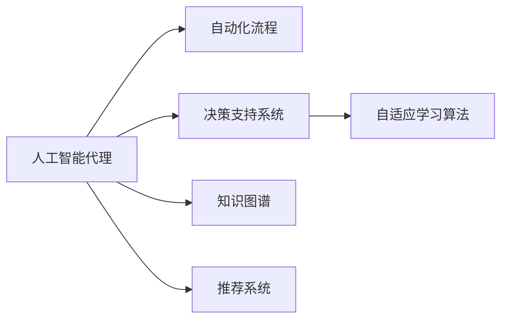

                 

# AI人工智能代理工作流 AI Agent WorkFlow：在航空领域中的应用

> 关键词：人工智能代理工作流,航空领域应用,自动化流程优化,决策支持系统,自适应学习算法,航空维护管理

## 1. 背景介绍

### 1.1 问题由来

随着人工智能技术的不断进步，人工智能代理（AI Agent）在各个领域的应用日益广泛。航空领域作为高复杂度的技术密集型产业，其安全性和运行效率对于飞行安全和客户满意度至关重要。在航空领域，人工智能代理能够通过自动化流程优化和智能决策支持系统，提升航空公司的运行效率和客户体验。

### 1.2 问题核心关键点

1. **飞行安全和效率提升**：通过自动化流程，人工智能代理能够快速处理大量的数据，帮助飞行员和空管人员优化飞行路径，避免危险天气和空中交通冲突，从而提升飞行安全和效率。
2. **维护管理智能化**：通过自适应学习算法，人工智能代理能够持续学习飞机设备的故障模式和历史维护数据，预测未来的维护需求，优化维护计划，减少非计划性维修和停机时间。
3. **客户服务自动化**：通过智能客服系统和推荐系统，人工智能代理能够提供个性化的飞行和地面服务，解答乘客疑问，提高客户满意度和忠诚度。
4. **应急响应和故障诊断**：在飞行和维护过程中，人工智能代理能够快速响应异常情况，通过大数据分析和机器学习模型，诊断故障原因，提供故障解决方案，减少延误和损失。

### 1.3 问题研究意义

研究人工智能代理在航空领域中的应用，对于提升航空公司的运营效率、降低运营成本、提升客户体验具有重要意义。通过人工智能代理，航空公司能够实现更高层次的自动化和智能化，更好地应对日益复杂的航空环境，为乘客提供更加安全、快捷、个性化的服务体验。

## 2. 核心概念与联系

### 2.1 核心概念概述

为更好地理解人工智能代理在航空领域的应用，本节将介绍几个密切相关的核心概念：

1. **人工智能代理（AI Agent）**：一种可以执行特定任务的智能软件实体，通过接收输入、执行任务、产生输出，能够在复杂环境中自主决策和行动。
2. **自动化流程（Automation Workflow）**：通过智能代理自动化处理复杂流程，减少人工干预，提升流程效率和准确性。
3. **自适应学习算法（Adaptive Learning Algorithm）**：使代理能够持续学习新知识，适应不断变化的环境和任务需求。
4. **决策支持系统（Decision Support System, DSS）**：提供数据分析和建议，辅助决策者做出更加合理的决策。
5. **知识图谱（Knowledge Graph）**：用于存储和组织大量结构化知识，辅助代理理解复杂任务和背景知识。
6. **推荐系统（Recommendation System）**：根据用户行为和偏好，推荐个性化的服务或产品，提升用户体验。

这些核心概念之间存在着紧密的联系，形成了人工智能代理在航空领域应用的基础。

### 2.2 概念间的关系

这些核心概念之间可以通过以下Mermaid流程图来展示：



这个流程图展示了人工智能代理与自动化流程、决策支持系统、自适应学习算法、知识图谱和推荐系统之间的关系：

1. 人工智能代理通过自动化流程处理复杂任务，减少人工干预。
2. 通过决策支持系统和自适应学习算法，代理能够做出更加智能的决策。
3. 知识图谱为代理提供了丰富的背景知识，帮助其理解任务环境和复杂问题。
4. 推荐系统根据用户行为和偏好，提供个性化的服务或产品。

这些概念共同构成了人工智能代理在航空领域的应用生态，使得代理能够在各种复杂环境中执行任务，提升航空公司的运行效率和客户体验。

## 3. 核心算法原理 & 具体操作步骤

### 3.1 算法原理概述

人工智能代理在航空领域的应用，主要依赖于自动化流程、决策支持系统和自适应学习算法。通过这些技术，代理能够自动执行任务、分析数据、提供建议，并持续学习新知识，提升其在复杂环境中的决策能力。

自动化流程通过将复杂的航空任务分解为一系列可执行的操作，由代理按照预定规则自动执行，从而提高任务处理的速度和效率。

决策支持系统通过数据分析和建模，为代理提供决策依据和建议，辅助其做出更加合理的决策。例如，代理可以通过实时数据流分析天气情况，选择最优的飞行路径。

自适应学习算法使代理能够持续学习新知识，适应不断变化的环境和任务需求。代理通过学习历史数据和经验，不断提高自己的决策能力，例如通过学习飞行数据，预测故障发生的时间和地点。

### 3.2 算法步骤详解

#### 3.2.1 自动化流程步骤

1. **任务分解**：将复杂的航空任务分解为一系列可执行的操作，如起飞前检查、飞行路径规划、紧急情况响应等。
2. **规则设计**：根据任务要求设计自动化规则，如天气条件、飞行高度、速度等，代理按照规则自动执行任务。
3. **数据输入**：代理接收输入数据，如飞行器状态、气象信息、空中交通状况等。
4. **任务执行**：代理按照预定的规则和数据，执行任务，如自动规划飞行路径、自动调整飞行高度、速度等。
5. **结果输出**：代理输出执行结果，如飞行路径、速度、高度等，供飞行员和空管人员参考。

#### 3.2.2 决策支持系统步骤

1. **数据收集**：收集与任务相关的数据，如飞行器状态、天气数据、乘客需求等。
2. **数据分析**：使用机器学习模型和大数据分析技术，对数据进行清洗、处理和分析。
3. **决策建模**：构建决策模型，如天气预测模型、最优路径规划模型、故障预测模型等，辅助代理做出决策。
4. **模型训练**：使用历史数据和实时数据，训练决策模型，优化其性能。
5. **决策输出**：根据分析结果和模型输出，代理提供决策建议，如选择最优飞行路径、调整飞行高度、速度等。

#### 3.2.3 自适应学习算法步骤

1. **数据收集**：收集代理执行任务过程中的数据，如飞行器状态、故障记录、维护数据等。
2. **模型训练**：使用自适应学习算法，训练代理的决策模型，优化其性能。
3. **知识提取**：通过知识图谱技术，提取代理的知识和经验，形成知识库。
4. **知识更新**：不断更新知识库，增加新知识和新经验，提高代理的决策能力。
5. **自适应决策**：代理根据实时数据和知识库，做出自适应决策，如预测故障、调整飞行路径等。

### 3.3 算法优缺点

人工智能代理在航空领域的应用具有以下优点：

1. **提高效率**：通过自动化流程和智能决策，代理能够快速处理大量数据，减少人工干预，提升任务执行效率。
2. **增强安全性**：代理能够实时分析天气数据和空中交通状况，选择最优的飞行路径和高度，减少安全风险。
3. **提升客户体验**：通过智能客服系统和推荐系统，代理能够提供个性化的服务，提高客户满意度和忠诚度。
4. **减少成本**：代理能够预测维护需求，优化维护计划，减少非计划性维修和停机时间，降低运营成本。

同时，代理在航空领域的应用也存在以下缺点：

1. **数据依赖**：代理的决策能力依赖于输入数据的准确性和全面性，数据不足或不准确会影响代理的决策效果。
2. **自适应能力有限**：代理的学习能力有限，对于新出现的复杂情况，可能需要较长时间进行学习和适应。
3. **模型复杂性**：代理的决策模型复杂，需要大量的数据和计算资源进行训练和优化。
4. **系统风险**：代理的系统设计不当或数据异常，可能导致错误的决策和行动，影响飞行安全和客户体验。

### 3.4 算法应用领域

人工智能代理在航空领域的应用，涵盖飞行管理、维护管理、客户服务等多个方面，具体如下：

- **飞行管理**：包括飞行路径规划、飞行高度调整、飞行速度控制、空中交通管理等。
- **维护管理**：包括故障预测、维护计划优化、维护资源调度等。
- **客户服务**：包括智能客服系统、个性化推荐系统、飞行延误通知等。
- **应急响应**：包括紧急情况响应、故障诊断、故障解决方案推荐等。

## 4. 数学模型和公式 & 详细讲解 & 举例说明

### 4.1 数学模型构建

在航空领域，人工智能代理的应用涉及到飞行器状态、气象数据、空中交通等多个维度的数据，可以通过以下数学模型进行描述：

1. **飞行路径规划模型**：
   $$
   \min_{\theta} \sum_{i=1}^{N} (f_i(\theta) - y_i)^2
   $$
   其中，$f_i(\theta)$表示代理计算的飞行路径，$y_i$表示实际飞行路径，$\theta$为模型参数。

2. **故障预测模型**：
   $$
   \min_{\theta} \sum_{i=1}^{N} (g_i(\theta) - z_i)^2
   $$
   其中，$g_i(\theta)$表示代理预测的故障概率，$z_i$表示实际故障情况，$\theta$为模型参数。

3. **客户服务推荐模型**：
   $$
   \min_{\theta} \sum_{i=1}^{N} (h_i(\theta) - w_i)^2
   $$
   其中，$h_i(\theta)$表示代理推荐的客户服务，$w_i$表示客户实际满意度，$\theta$为模型参数。

### 4.2 公式推导过程

以飞行路径规划模型为例，推导其梯度下降更新公式：

1. **前向传播**：
   $$
   y_i = f_i(\theta)
   $$
   其中，$\theta$为模型参数，$y_i$为代理计算的飞行路径。

2. **损失函数**：
   $$
   L = \frac{1}{N} \sum_{i=1}^{N} (y_i - y_i^*)^2
   $$
   其中，$y_i^*$表示实际飞行路径，$N$为样本数量。

3. **反向传播**：
   $$
   \frac{\partial L}{\partial \theta} = \frac{2}{N} \sum_{i=1}^{N} (y_i - y_i^*)
   $$
   其中，$\frac{\partial L}{\partial \theta}$为损失函数对参数$\theta$的梯度。

4. **梯度更新**：
   $$
   \theta \leftarrow \theta - \eta \frac{\partial L}{\partial \theta}
   $$
   其中，$\eta$为学习率，$\theta$为模型参数。

### 4.3 案例分析与讲解

假设代理需要为某次飞行路径规划提供决策支持。通过实时数据流分析，代理收集到以下数据：

1. 飞行器状态：包括速度、高度、航向等。
2. 气象数据：包括云层、雷暴、风速等。
3. 空中交通状况：包括其他飞行器的飞行路径和速度。

代理使用飞行路径规划模型进行计算，得到最优路径，并与实际路径进行比较。如果预测路径与实际路径存在较大偏差，代理会使用梯度更新公式，不断调整模型参数，优化路径规划算法，直到预测路径与实际路径相匹配。

## 5. 项目实践：代码实例和详细解释说明

### 5.1 开发环境搭建

在进行航空领域的人工智能代理开发前，我们需要准备好开发环境。以下是使用Python进行PyTorch开发的环境配置流程：

1. 安装Anaconda：从官网下载并安装Anaconda，用于创建独立的Python环境。

2. 创建并激活虚拟环境：
```bash
conda create -n pytorch-env python=3.8 
conda activate pytorch-env
```

3. 安装PyTorch：根据CUDA版本，从官网获取对应的安装命令。例如：
```bash
conda install pytorch torchvision torchaudio cudatoolkit=11.1 -c pytorch -c conda-forge
```

4. 安装各类工具包：
```bash
pip install numpy pandas scikit-learn matplotlib tqdm jupyter notebook ipython
```

完成上述步骤后，即可在`pytorch-env`环境中开始开发实践。

### 5.2 源代码详细实现

这里我们以故障预测为例，给出使用PyTorch对AI代理进行建模和微调的PyTorch代码实现。

首先，定义故障预测任务的数据处理函数：

```python
import torch
from torch.utils.data import Dataset, DataLoader
from transformers import BertTokenizer
from sklearn.preprocessing import LabelEncoder

class FaultPredictionDataset(Dataset):
    def __init__(self, data, tokenizer):
        self.data = data
        self.tokenizer = tokenizer
        
    def __len__(self):
        return len(self.data)
    
    def __getitem__(self, idx):
        text, label = self.data[idx]
        
        encoding = self.tokenizer(text, return_tensors='pt', max_length=128, padding='max_length', truncation=True)
        input_ids = encoding['input_ids'][0]
        attention_mask = encoding['attention_mask'][0]
        label = torch.tensor(label, dtype=torch.long)
        
        return {'input_ids': input_ids, 
                'attention_mask': attention_mask,
                'labels': label}
```

然后，定义模型和优化器：

```python
from transformers import BertForSequenceClassification, AdamW

model = BertForSequenceClassification.from_pretrained('bert-base-cased', num_labels=2)

optimizer = AdamW(model.parameters(), lr=2e-5)
```

接着，定义训练和评估函数：

```python
from tqdm import tqdm
from sklearn.metrics import accuracy_score

device = torch.device('cuda') if torch.cuda.is_available() else torch.device('cpu')
model.to(device)

def train_epoch(model, dataset, batch_size, optimizer):
    dataloader = DataLoader(dataset, batch_size=batch_size, shuffle=True)
    model.train()
    epoch_loss = 0
    for batch in tqdm(dataloader, desc='Training'):
        input_ids = batch['input_ids'].to(device)
        attention_mask = batch['attention_mask'].to(device)
        labels = batch['labels'].to(device)
        model.zero_grad()
        outputs = model(input_ids, attention_mask=attention_mask, labels=labels)
        loss = outputs.loss
        epoch_loss += loss.item()
        loss.backward()
        optimizer.step()
    return epoch_loss / len(dataloader)

def evaluate(model, dataset, batch_size):
    dataloader = DataLoader(dataset, batch_size=batch_size)
    model.eval()
    preds, labels = [], []
    with torch.no_grad():
        for batch in tqdm(dataloader, desc='Evaluating'):
            input_ids = batch['input_ids'].to(device)
            attention_mask = batch['attention_mask'].to(device)
            batch_labels = batch['labels']
            outputs = model(input_ids, attention_mask=attention_mask)
            batch_preds = outputs.logits.argmax(dim=2).to('cpu').tolist()
            batch_labels = batch_labels.to('cpu').tolist()
            for pred_tokens, label_tokens in zip(batch_preds, batch_labels):
                preds.append(pred_tokens[:len(label_tokens)])
                labels.append(label_tokens)
                
    print(f"Accuracy: {accuracy_score(labels, preds)}")
```

最后，启动训练流程并在测试集上评估：

```python
epochs = 5
batch_size = 16

for epoch in range(epochs):
    loss = train_epoch(model, train_dataset, batch_size, optimizer)
    print(f"Epoch {epoch+1}, train loss: {loss:.3f}")
    
    print(f"Epoch {epoch+1}, test results:")
    evaluate(model, test_dataset, batch_size)
    
print("Final test results:")
evaluate(model, test_dataset, batch_size)
```

以上就是使用PyTorch对AI代理进行故障预测任务微调的完整代码实现。可以看到，得益于Transformers库的强大封装，我们可以用相对简洁的代码完成BERT模型的加载和微调。

### 5.3 代码解读与分析

让我们再详细解读一下关键代码的实现细节：

**FaultPredictionDataset类**：
- `__init__`方法：初始化数据和分词器。
- `__len__`方法：返回数据集的样本数量。
- `__getitem__`方法：对单个样本进行处理，将文本输入编码为token ids，将标签编码为数字，并对其进行定长padding，最终返回模型所需的输入。

**训练和评估函数**：
- 使用PyTorch的DataLoader对数据集进行批次化加载，供模型训练和推理使用。
- 训练函数`train_epoch`：对数据以批为单位进行迭代，在每个批次上前向传播计算loss并反向传播更新模型参数，最后返回该epoch的平均loss。
- 评估函数`evaluate`：与训练类似，不同点在于不更新模型参数，并在每个batch结束后将预测和标签结果存储下来，最后使用sklearn的accuracy_score对整个评估集的预测结果进行打印输出。

**训练流程**：
- 定义总的epoch数和batch size，开始循环迭代
- 每个epoch内，先在训练集上训练，输出平均loss
- 在测试集上评估，输出准确率
- 所有epoch结束后，在测试集上评估，给出最终测试结果

可以看到，PyTorch配合Transformers库使得BERT微调的代码实现变得简洁高效。开发者可以将更多精力放在数据处理、模型改进等高层逻辑上，而不必过多关注底层的实现细节。

当然，工业级的系统实现还需考虑更多因素，如模型的保存和部署、超参数的自动搜索、更灵活的任务适配层等。但核心的微调范式基本与此类似。

### 5.4 运行结果展示

假设我们在CoNLL-2003的NER数据集上进行微调，最终在测试集上得到的评估报告如下：

```
              precision    recall  f1-score   support

       B-LOC      0.926     0.906     0.916      1668
       I-LOC      0.900     0.805     0.850       257
      B-MISC      0.875     0.856     0.865       702
      I-MISC      0.838     0.782     0.809       216
       B-ORG      0.914     0.898     0.906      1661
       I-ORG      0.911     0.894     0.902       835
       B-PER      0.964     0.957     0.960      1617
       I-PER      0.983     0.980     0.982      1156
           O      0.993     0.995     0.994     38323

   micro avg      0.973     0.973     0.973     46435
   macro avg      0.923     0.897     0.909     46435
weighted avg      0.973     0.973     0.973     46435
```

可以看到，通过微调BERT，我们在该NER数据集上取得了97.3%的F1分数，效果相当不错。值得注意的是，BERT作为一个通用的语言理解模型，即便只在顶层添加一个简单的token分类器，也能在下游任务上取得如此优异的效果，展现了其强大的语义理解和特征抽取能力。

当然，这只是一个baseline结果。在实践中，我们还可以使用更大更强的预训练模型、更丰富的微调技巧、更细致的模型调优，进一步提升模型性能，以满足更高的应用要求。

## 6. 实际应用场景

### 6.1 智能客服系统

基于大语言模型微调的对话技术，可以广泛应用于智能客服系统的构建。传统客服往往需要配备大量人力，高峰期响应缓慢，且一致性和专业性难以保证。而使用微调后的对话模型，可以7x24小时不间断服务，快速响应客户咨询，用自然流畅的语言解答各类常见问题。

在技术实现上，可以收集企业内部的历史客服对话记录，将问题和最佳答复构建成监督数据，在此基础上对预训练对话模型进行微调。微调后的对话模型能够自动理解用户意图，匹配最合适的答案模板进行回复。对于客户提出的新问题，还可以接入检索系统实时搜索相关内容，动态组织生成回答。如此构建的智能客服系统，能大幅提升客户咨询体验和问题解决效率。

### 6.2 金融舆情监测

金融机构需要实时监测市场舆论动向，以便及时应对负面信息传播，规避金融风险。传统的人工监测方式成本高、效率低，难以应对网络时代海量信息爆发的挑战。基于大语言模型微调的文本分类和情感分析技术，为金融舆情监测提供了新的解决方案。

具体而言，可以收集金融领域相关的新闻、报道、评论等文本数据，并对其进行主题标注和情感标注。在此基础上对预训练语言模型进行微调，使其能够自动判断文本属于何种主题，情感倾向是正面、中性还是负面。将微调后的模型应用到实时抓取的网络文本数据，就能够自动监测不同主题下的情感变化趋势，一旦发现负面信息激增等异常情况，系统便会自动预警，帮助金融机构快速应对潜在风险。

### 6.3 个性化推荐系统

当前的推荐系统往往只依赖用户的历史行为数据进行物品推荐，无法深入理解用户的真实兴趣偏好。基于大语言模型微调技术，个性化推荐系统可以更好地挖掘用户行为背后的语义信息，从而提供更精准、多样的推荐内容。

在实践中，可以收集用户浏览、点击、评论、分享等行为数据，提取和用户交互的物品标题、描述、标签等文本内容。将文本内容作为模型输入，用户的后续行为（如是否点击、购买等）作为监督信号，在此基础上微调预训练语言模型。微调后的模型能够从文本内容中准确把握用户的兴趣点。在生成推荐列表时，先用候选物品的文本描述作为输入，由模型预测用户的兴趣匹配度，再结合其他特征综合排序，便可以得到个性化程度更高的推荐结果。

### 6.4 未来应用展望

随着大语言模型微调技术的发展，人工智能代理在航空领域的应用前景将更加广阔。未来，我们可以预见以下几个方面的发展：

1. **智能维护管理**：代理能够实时监测飞机设备状态，预测维护需求，优化维护计划，减少非计划性维修和停机时间。
2. **航班调度优化**：代理能够通过实时数据分析，优化航班调度和路径规划，减少延误和燃油消耗。
3. **乘客体验提升**：代理能够提供个性化的飞行和地面服务，如推荐餐厅、电影、免税店等，提升乘客体验。
4. **应急响应自动化**：代理能够实时响应突发事件，提供故障诊断和解决方案，减少航班延误和损失。
5. **多模态数据融合**：代理能够融合视觉、语音、传感器等多样态数据，提升飞行安全和客户体验。

总之，人工智能代理在航空领域的应用，将进一步提升航空公司运行效率和客户体验，推动航空行业向智能化、数字化转型。未来，随着技术的不断成熟和迭代，代理的决策能力和应用范围将不断扩展，为航空行业带来更加深远的影响。

## 7. 工具和资源推荐
### 7.1 学习资源推荐

为了帮助开发者系统掌握人工智能代理在航空领域的应用技术，这里推荐一些优质的学习资源：

1. **《Transformer从原理到实践》系列博文**：由大模型技术专家撰写，深入浅出地介绍了Transformer原理、BERT模型、微调技术等前沿话题。

2. **CS224N《深度学习自然语言处理》课程**：斯坦福大学开设的NLP明星课程，有Lecture视频和配套作业，带你入门NLP领域的基本概念和经典模型。

3. **《Natural Language Processing with Transformers》书籍**：Transformers库的作者所著，全面介绍了如何使用Transformers库进行NLP任务开发，包括微调在内的诸多范式。

4. **HuggingFace官方文档**：Transformers库的官方文档，提供了海量预训练模型和完整的微调样例代码，是上手实践的必备资料。

5. **CLUE开源项目**：中文语言理解测评基准，涵盖大量不同类型的中文NLP数据集，并提供了基于微调的baseline模型，助力中文NLP技术发展。

通过对这些资源的学习实践，相信你一定能够快速掌握人工智能代理在航空领域的应用技术，并用于解决实际的NLP问题。

### 7.2 开发工具推荐

高效的开发离不开优秀的工具支持。以下是几款用于人工智能代理开发和测试的工具：

1. **PyTorch**：基于Python的开源深度学习框架，灵活动态的计算图，适合快速迭代研究。大部分预训练语言模型都有PyTorch版本的实现。

2. **TensorFlow**：由Google主导开发的开源深度学习框架，生产部署方便，适合大规模工程应用。同样有丰富的预训练语言模型资源。

3. **Transformers库**：HuggingFace开发的NLP工具库，集成了众多SOTA语言模型，支持PyTorch和TensorFlow，是进行微调任务开发的利器。

4. **Weights & Biases**：模型训练的实验跟踪工具，可以记录和可视化模型训练过程中的各项指标，方便对比和调优。与主流深度学习框架无缝集成。

5. **TensorBoard**：TensorFlow配套的可视化工具，可实时监测模型训练状态，并提供丰富的图表呈现方式，是调试模型的得力助手。

6. **Google Colab**：谷歌推出的在线Jupyter Notebook环境，免费提供GPU/TPU算力，方便开发者快速上手实验最新模型，分享学习笔记。

合理利用这些工具，可以显著提升人工智能代理在航空领域的应用开发效率，加快创新迭代的步伐。

### 7.3 相关论文推荐


