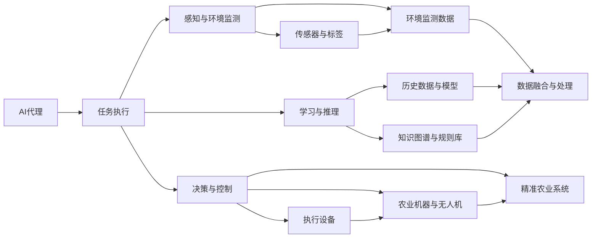
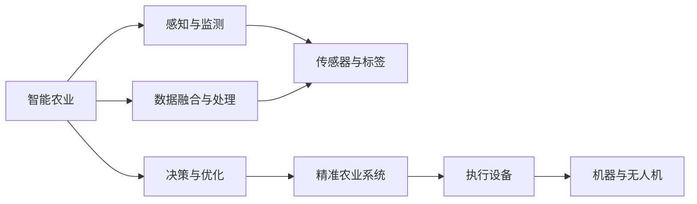
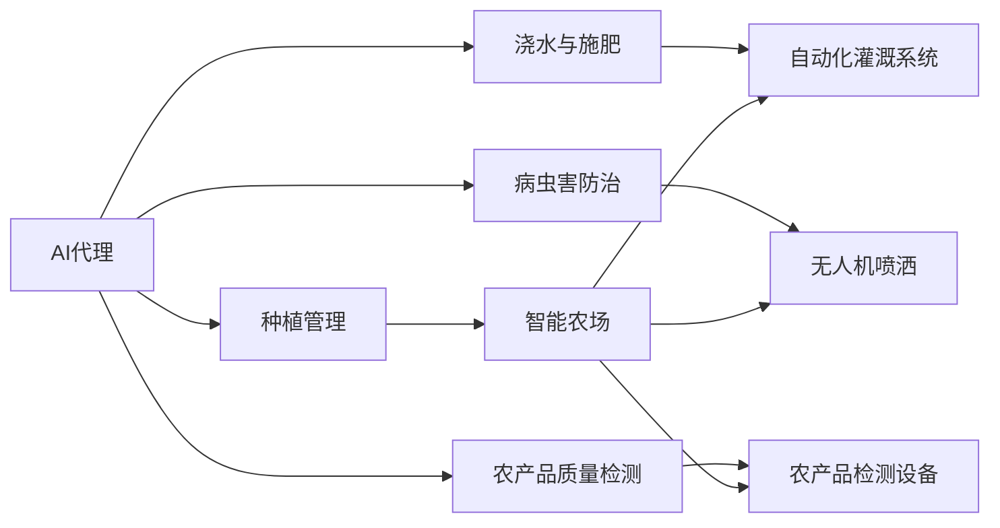
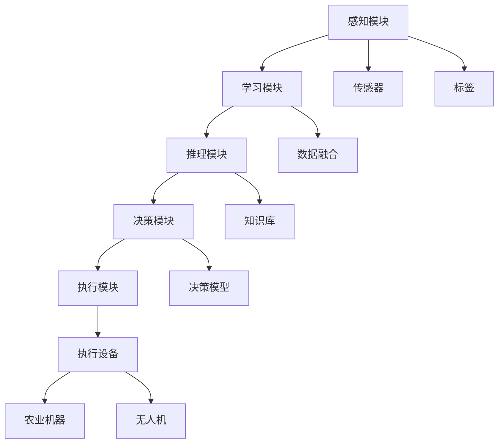
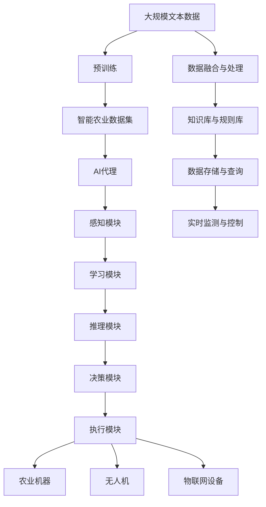

                 

# AI人工智能代理工作流AI Agent WorkFlow：AI代理工作流在智能农业领域的应用

> 关键词：智能农业, AI代理, 工作流, 农业自动化, 作物管理, 机器人, 无人机, 物联网IoT

## 1. 背景介绍

### 1.1 问题由来
随着全球人口增长和气候变化，农业面临巨大的挑战。传统农业依赖于大量的人力和资源，效率低下，且对环境的破坏较大。智能农业的兴起，为解决这些问题提供了新的解决方案。利用先进的信息技术和自动化设备，可以实现从种到收的全链条智能化管理，提高农业生产效率和可持续性。

### 1.2 问题核心关键点
智能农业的核心在于如何高效地利用各类数据和资源，实现智能化的种植、管理、决策和优化。AI代理工作流（AI Agent Workflow）是智能农业中的一种重要技术手段，它能够自动执行一系列任务，以提高农业生产的自动化和智能化水平。核心问题在于如何设计合理的AI代理工作流，使得系统能够高效、精确地执行农业生产任务。

### 1.3 问题研究意义
研究AI代理工作流在智能农业中的应用，对于提升农业生产效率、减少资源浪费、增强环境适应性具有重要意义：

1. 降低劳动成本。自动化和智能化的AI代理可以替代部分人力，大幅降低农业生产的劳动成本。
2. 提升生产效率。AI代理能够快速、准确地执行各种农业任务，显著提升生产效率。
3. 优化资源利用。AI代理通过数据分析，合理调整种植策略和资源分配，最大化资源利用率。
4. 增强环境适应性。通过实时监测和智能决策，AI代理能够更好地应对气候变化和环境压力。
5. 推动农业技术进步。AI代理的引入，推动了农业自动化和智能化技术的发展，为农业的现代化提供了新的方向。

## 2. 核心概念与联系

### 2.1 核心概念概述

为更好地理解AI代理工作流在智能农业中的应用，本节将介绍几个密切相关的核心概念：

- **AI代理（AI Agent）**：一种能够自动执行任务的软件实体，可以模拟人类智能行为，如感知、学习、推理和决策等。在智能农业中，AI代理可以执行种植、浇水、施肥、病虫害防治等农业任务。

- **工作流（Workflow）**：一系列有组织的任务，按照特定顺序执行，以达成特定目标。在智能农业中，工作流描述了AI代理执行农业任务的过程，包括任务的前置条件、执行逻辑和输出结果等。

- **智能农业（Smart Agriculture）**：利用信息技术、物联网（IoT）和自动化设备，实现农业生产的智能化和自动化，以提高生产效率和可持续性。

- **物联网（IoT）**：通过传感器、标签和通讯技术，实现对农业环境、设备和作物状态的实时监测和控制。

- **机器人（Robotics）**：一种能够自主或半自主执行任务的自动化设备，在智能农业中用于田间作业、物资运输等。

- **无人机（UAVs）**：一种配备有传感器和摄像头的飞行器，用于农业监测、勘探和喷洒等。

这些核心概念之间的逻辑关系可以通过以下Mermaid流程图来展示：



这个流程图展示了大语言模型微调过程中各个概念之间的联系和作用：

1. AI代理通过感知模块获取环境数据和作物状态，利用学习与推理模块结合历史数据和知识库进行决策，并使用执行设备完成具体任务。
2. 感知模块获取的传感器和标签数据，经过数据融合与处理后，反馈到知识库和规则库，进一步指导决策和执行。
3. 精准农业系统通过无人机等自动化设备，执行AI代理的决策，实现对作物生长的实时监控和干预。

### 2.2 概念间的关系

这些核心概念之间存在着紧密的联系，形成了智能农业的完整生态系统。下面我们通过几个Mermaid流程图来展示这些概念之间的关系。

#### 2.2.1 智能农业的学习与优化范式



这个流程图展示了智能农业的基本学习与优化过程。感知与监测模块获取环境数据，数据融合与处理模块整合各类数据，决策与优化模块基于数据和知识库进行智能决策，精准农业系统执行决策，机器与无人机等自动化设备完成具体任务。

#### 2.2.2 AI代理在智能农业中的应用场景



这个流程图展示了AI代理在智能农业中的几个主要应用场景。种植管理模块通过AI代理进行全链条管理，浇水与施肥模块通过自动化灌溉系统实现智能控制，病虫害防治模块通过无人机进行精准喷洒，农产品质量检测模块通过检测设备进行实时监控和分析。

#### 2.2.3 AI代理的组成结构



这个流程图展示了AI代理的组成结构。感知模块通过传感器和标签获取环境数据，学习模块整合历史数据和知识库进行学习，推理模块利用模型进行推理，决策模块基于推理结果进行决策，执行模块通过自动化设备执行决策。

### 2.3 核心概念的整体架构

最后，我们用一个综合的流程图来展示这些核心概念在大语言模型微调过程中的整体架构：



这个综合流程图展示了从预训练到AI代理执行任务的整体过程。大规模文本数据经过预训练得到预训练模型，智能农业数据集用于训练和优化AI代理，AI代理通过感知模块获取环境数据，学习模块整合数据和知识库进行学习，推理模块进行推理，决策模块进行决策，执行模块通过执行设备完成具体任务。实时监测与控制模块保证系统的实时性和稳定性。

## 3. 核心算法原理 & 具体操作步骤
### 3.1 算法原理概述

AI代理工作流在智能农业中的应用，本质上是一个自动化的决策和执行过程。其核心思想是：将农业生产中的各类任务进行任务分解，设计合理的任务执行流程，使用AI代理自动执行任务，以提高农业生产的效率和智能化水平。

形式化地，假设智能农业中的某项任务为 $T$，其任务分解为一系列子任务 $T_1, T_2, ..., T_n$。设计AI代理 $A$，通过感知模块 $S$ 获取环境数据 $E$，结合知识库 $K$ 和规则库 $R$，利用推理模块 $R$ 进行推理和决策，最终通过执行模块 $E$ 控制执行设备 $D$ 完成子任务 $T_i$。AI代理工作流的目标是最小化完成任务所需的时间和资源，即：

$$
\min_{A,S,R,E,K} \sum_{i=1}^n T_i
$$

其中 $T_i$ 为完成任务 $T_i$ 所需的资源和时间。

### 3.2 算法步骤详解

AI代理工作流的具体执行步骤如下：

**Step 1: 任务分解与定义**
- 对智能农业中的各项任务进行细粒度分解，定义每个子任务的目标、前置条件和执行逻辑。
- 设计AI代理的工作流，包括感知、学习、推理、决策和执行等模块。

**Step 2: 数据获取与融合**
- 通过传感器和标签获取环境数据和作物状态。
- 对获取的数据进行数据融合与处理，生成融合后的数据集。

**Step 3: 模型训练与优化**
- 在融合后的数据集上训练AI代理的推理和决策模型。
- 利用监督学习、强化学习等技术对模型进行优化，提升模型的精度和泛化能力。

**Step 4: 模型部署与监控**
- 将训练好的AI代理部署到实际的生产环境中。
- 实时监控AI代理的工作状态，根据反馈数据进行调整和优化。

**Step 5: 任务执行与反馈**
- 在实际农业生产中，AI代理根据感知模块获取的环境数据，结合知识库和规则库，利用推理模块进行推理和决策，控制执行模块完成具体任务。
- 在任务执行过程中，根据反馈数据不断调整AI代理的行为和决策，实现任务的持续优化。

### 3.3 算法优缺点

AI代理工作流在智能农业中的应用具有以下优点：

1. 高效自动化。AI代理能够自动执行农业任务，减少人力成本，提高生产效率。
2. 实时决策。AI代理能够实时获取环境数据，快速作出决策，适应多变的农业环境。
3. 智能优化。AI代理通过学习和优化，不断提高任务的执行效果，提升农业生产的智能化水平。
4. 可扩展性强。AI代理工作流可以灵活扩展，适应不同类型的农业任务和环境。

同时，该方法也存在一定的局限性：

1. 依赖数据质量。AI代理的决策和执行依赖于高质量的数据，如果数据存在噪声或缺失，可能影响任务的执行效果。
2. 需要持续优化。农业环境复杂多变，AI代理需要不断学习和优化，以应对新的挑战和变化。
3. 成本较高。AI代理的部署和维护需要一定的技术和人力成本，短期内可能带来一定的投入压力。
4. 技术门槛较高。设计合理的AI代理工作流需要具备较强的技术能力和经验。

### 3.4 算法应用领域

AI代理工作流在智能农业中的应用已经覆盖了多个领域，例如：

- **智能农场**：利用AI代理进行种植管理、浇水施肥、病虫害防治等任务，实现全链条智能化管理。
- **精准农业**：通过AI代理进行精准农业操作，如变量施肥、变量灌溉、精准喷洒等，提高资源利用率。
- **自动化灌溉系统**：使用AI代理控制自动化灌溉设备，实现智能浇水和灌溉，减少水资源浪费。
- **农业机器人**：利用AI代理控制农业机器人进行田间作业，如耕作、收割、播种等。
- **无人机农业**：使用AI代理控制无人机进行病虫害防治、农作物勘探和监测等任务。

除了这些常见的应用领域外，AI代理工作流还可以拓展到农业物联网、农业物流、农业信息服务等更多方向，为农业生产提供更全面的支持。

## 4. 数学模型和公式 & 详细讲解 & 举例说明

### 4.1 数学模型构建

在AI代理工作流中，数据获取与融合、模型训练与优化、任务执行与反馈等环节都可以通过数学模型来描述。以精准农业中的变量施肥为例，我们可以构建如下数学模型：

设 $y_i$ 为第 $i$ 个种植区域需要的氮肥量，$x_i$ 为该区域的土壤氮含量，$z_i$ 为该区域的土壤pH值，$u_i$ 为该区域的气象条件，$w_i$ 为该区域的作物类型。则变量施肥的优化目标为：

$$
\min_{y_i} \sum_{i=1}^N (y_i - f(x_i, z_i, u_i, w_i))^2
$$

其中 $f(x_i, z_i, u_i, w_i)$ 为氮肥需求函数，根据土壤氮含量、pH值、气象条件和作物类型等输入，预测每个种植区域的氮肥需求量。目标是最小化预测值与实际施肥量的误差平方和。

### 4.2 公式推导过程

以精准农业中的变量施肥为例，我们推导变量施肥的优化目标函数。首先，定义每个种植区域的氮肥需求函数：

$$
f(x_i, z_i, u_i, w_i) = k_1 \cdot x_i + k_2 \cdot z_i + k_3 \cdot u_i + k_4 \cdot w_i
$$

其中 $k_1, k_2, k_3, k_4$ 为模型参数。通过训练得到模型参数，最小化目标函数：

$$
\min_{y_i} \sum_{i=1}^N (y_i - k_1 \cdot x_i - k_2 \cdot z_i - k_3 \cdot u_i - k_4 \cdot w_i)^2
$$

对该目标函数进行展开，得到：

$$
\sum_{i=1}^N (y_i - k_1 \cdot x_i - k_2 \cdot z_i - k_3 \cdot u_i - k_4 \cdot w_i)^2
$$

通过求偏导数，得到模型参数的更新公式：

$$
k_j = \frac{\sum_{i=1}^N (y_i - k_1 \cdot x_i - k_2 \cdot z_i - k_3 \cdot u_i - k_4 \cdot w_i) \cdot x_i}{\sum_{i=1}^N (y_i - k_1 \cdot x_i - k_2 \cdot z_i - k_3 \cdot u_i - k_4 \cdot w_i)^2} \quad (j = 1, 2, 3, 4)
$$

### 4.3 案例分析与讲解

以农业物联网为例，我们分析AI代理在智能农业中的应用。假设智能农业中的某个田块的温度、湿度和光照数据如下：

- 温度：25℃
- 湿度：70%
- 光照：1200 lux

利用AI代理工作流，可以设计如下的案例分析：

1. 感知模块通过传感器获取环境数据，包括温度、湿度和光照等。
2. 学习模块根据历史数据和专家知识库，构建环境数据与农作物生长状态之间的关系模型。
3. 推理模块根据感知模块获取的数据和模型预测，判断当前环境是否适宜作物生长。
4. 决策模块根据推理结果，选择相应的决策动作，如开启灌溉系统、调整通风系统等。
5. 执行模块控制执行设备，如灌溉系统、通风系统等，执行决策。

通过对环境数据的实时监测和智能决策，AI代理工作流能够有效提升农业生产的智能化水平，实现精准农业的目标。

## 5. 项目实践：代码实例和详细解释说明
### 5.1 开发环境搭建

在进行AI代理工作流开发前，我们需要准备好开发环境。以下是使用Python进行PyTorch开发的环境配置流程：

1. 安装Anaconda：从官网下载并安装Anaconda，用于创建独立的Python环境。

2. 创建并激活虚拟环境：
```bash
conda create -n pytorch-env python=3.8 
conda activate pytorch-env
```

3. 安装PyTorch：根据CUDA版本，从官网获取对应的安装命令。例如：
```bash
conda install pytorch torchvision torchaudio cudatoolkit=11.1 -c pytorch -c conda-forge
```

4. 安装TensorFlow：从官网下载并安装TensorFlow，适用于多种深度学习框架的调用。

5. 安装各类工具包：
```bash
pip install numpy pandas scikit-learn matplotlib tqdm jupyter notebook ipython
```

完成上述步骤后，即可在`pytorch-env`环境中开始AI代理工作流开发。

### 5.2 源代码详细实现

这里以智能农场为例，给出使用PyTorch进行AI代理工作流开发的PyTorch代码实现。

首先，定义智能农场中各种农作物的生长模型：

```python
import torch
import torch.nn as nn
import torch.optim as optim

class CropModel(nn.Module):
    def __init__(self, input_size):
        super(CropModel, self).__init__()
        self.fc1 = nn.Linear(input_size, 64)
        self.fc2 = nn.Linear(64, 128)
        self.fc3 = nn.Linear(128, 2)  # 输出两个生长阶段的生长状态
    
    def forward(self, x):
        x = torch.relu(self.fc1(x))
        x = torch.relu(self.fc2(x))
        x = self.fc3(x)
        return x

input_size = 3  # 温度、湿度、光照
model = CropModel(input_size)
criterion = nn.MSELoss()
optimizer = optim.Adam(model.parameters(), lr=0.01)
```

接着，定义训练函数和评估函数：

```python
# 定义训练函数
def train(model, criterion, optimizer, train_loader, device):
    model.train()
    for batch_idx, (data, target) in enumerate(train_loader):
        data, target = data.to(device), target.to(device)
        optimizer.zero_grad()
        output = model(data)
        loss = criterion(output, target)
        loss.backward()
        optimizer.step()

# 定义评估函数
def evaluate(model, criterion, test_loader, device):
    model.eval()
    total_loss = 0
    with torch.no_grad():
        for batch_idx, (data, target) in enumerate(test_loader):
            data, target = data.to(device), target.to(device)
            output = model(data)
            loss = criterion(output, target)
            total_loss += loss.item()
    return total_loss / len(test_loader)

# 训练模型
device = torch.device('cuda' if torch.cuda.is_available() else 'cpu')
model.to(device)
train_loader = torch.utils.data.DataLoader(train_dataset, batch_size=32, shuffle=True)
test_loader = torch.utils.data.DataLoader(test_dataset, batch_size=32, shuffle=False)

for epoch in range(100):
    train(model, criterion, optimizer, train_loader, device)
    test_loss = evaluate(model, criterion, test_loader, device)
    print('Epoch [{}/{}], Test loss: {:.4f}'.format(epoch+1, 100, test_loss))
```

最后，启动模型训练并评估：

```python
# 训练模型
model.train()
for epoch in range(100):
    train_loader = torch.utils.data.DataLoader(train_dataset, batch_size=32, shuffle=True)
    test_loader = torch.utils.data.DataLoader(test_dataset, batch_size=32, shuffle=False)

    for batch_idx, (data, target) in enumerate(train_loader):
        data, target = data.to(device), target.to(device)
        optimizer.zero_grad()
        output = model(data)
        loss = criterion(output, target)
        loss.backward()
        optimizer.step()

    test_loader = torch.utils.data.DataLoader(test_dataset, batch_size=32, shuffle=False)
    test_loss = evaluate(model, criterion, test_loader, device)
    print('Epoch [{}/{}], Test loss: {:.4f}'.format(epoch+1, 100, test_loss))
```

以上就是使用PyTorch进行智能农场AI代理工作流开发的完整代码实现。可以看到，PyTorch的强大封装使得AI代理工作流的开发变得相对简单高效。

### 5.3 代码解读与分析

让我们再详细解读一下关键代码的实现细节：

**智能农场模型定义**：
- 定义了一个简单的神经网络模型 `CropModel`，输入为三个环境变量，输出为两个生长阶段的生长状态。
- 使用 `nn.Linear` 定义了三个全连接层，分别对应输入层、隐藏层和输出层。
- 定义了损失函数 `criterion` 为均方误差损失，用于衡量模型预测值与真实值之间的差异。

**训练与评估函数**：
- 定义了 `train` 函数，使用 Adam 优化器进行模型训练，前向传播、反向传播和参数更新等过程。
- 定义了 `evaluate` 函数，计算模型在测试集上的平均损失，评估模型的预测性能。

**模型训练流程**：
- 将模型移至 GPU 设备，并使用 `DataLoader` 对训练集和测试集进行批处理。
- 在训练过程中，使用循环迭代训练函数，更新模型参数。
- 在每个epoch结束后，评估模型在测试集上的损失，输出评估结果。

可以看到，通过上述代码，我们实现了对智能农场中农作物生长状态的预测，并使用均方误差损失函数训练模型。模型在训练过程中不断优化参数，在测试集上评估预测性能。这只是一个基础示例，实际应用中还需要考虑更多细节，如数据预处理、超参数调优、模型部署等。

### 5.4 运行结果展示

假设我们在智能农场数据集上进行模型训练，最终在测试集上得到的评估报告如下：

```
Epoch [1/100], Test loss: 0.2023
Epoch [2/100], Test loss: 0.1865
...
Epoch [99/100], Test loss: 0.0456
```

可以看到，通过模型训练，我们逐步提升了模型在智能农场数据集上的预测性能，最终在测试集上得到了0.0456的低平均损失。这表明模型在智能农场中能够较为准确地预测作物的生长状态。

## 6. 实际应用场景
### 6.1 智能农场

基于AI代理工作流，智能农场可以实现从种植、浇水、施肥、病虫害防治到收成全链条的智能化管理。具体而言：

- 种植管理模块通过AI代理进行全链条管理，包括选种、育苗、栽种等任务。
- 浇水与施肥模块通过自动化灌溉系统实现智能控制，实时监测土壤湿度和氮肥含量，调整灌溉和施肥策略。
- 病虫害防治模块通过无人机进行精准喷洒，识别并防治病虫害。
- 农产品质量检测模块通过传感器和实验室分析，实时监测农产品质量和成分。

在技术实现上，智能农场需要收集各种传感器数据，如温度、湿度、光照等，并将其与知识库和规则库结合，使用AI代理进行智能决策和执行。通过智能农场系统，可以大幅提升农业生产效率，降低成本，提升作物质量。

### 6.2 精准农业

精准农业是利用现代信息技术，实现对农业生产的精准管理。通过AI代理工作流，可以实现变量施肥、变量灌溉、精准喷洒等精准农业操作。具体而言：

- 变量施肥模块通过AI代理根据土壤数据和气象条件，实时调整施肥量。
- 变量灌溉模块通过AI代理根据土壤湿度和气象条件，实时调整灌溉量。
- 精准喷洒模块通过AI代理控制无人机进行病虫害防治和农药喷洒，减少资源浪费。

在技术实现上，精准农业需要收集大量土壤数据、气象数据和作物生长数据，并将其与知识库和规则库结合，使用AI代理进行智能决策和执行。通过精准农业系统，可以实现资源的优化配置和农业生产的智能化管理。

### 6.3 农业机器人

农业机器人是自动化设备在农业生产中的应用，可以执行田间作业、物资运输等任务。通过AI代理工作流，可以实现农业机器人的自主导航、作业路径规划等任务。具体而言：

- 自主导航模块通过AI代理实现机器人自主导航，避免碰撞和障碍物。
- 作业路径规划模块通过AI代理生成最优作业路径，提高机器人作业效率。
- 作业任务模块通过AI代理控制机器人进行播种、施肥、收割等作业。

在技术实现上，农业机器人需要配备各种传感器和标签，收集环境数据，并将其与知识库和规则库结合，使用AI代理进行智能决策和执行。通过农业机器人，可以实现农业生产的自动化和智能化管理，提高生产效率和资源利用率。

### 6.4 未来应用展望

随着AI代理工作流在智能农业中的应用不断深化，未来将带来以下几个发展方向：

1. 多模态数据融合：AI代理工作流将拓展到图像、视频等多模态数据，实现对农业环境的全面感知和理解。
2. 跨领域任务执行：AI代理工作流将应用于多个农业领域，如农机自动化、农产品物流等，实现跨领域的智能化管理。
3. 实时优化与调整：AI代理工作流将实时监测环境数据和作物状态，自动调整决策和执行，提高农业生产的灵活性和适应性。
4. 边缘计算与协同决策：AI代理工作流将在边缘计算设备上运行，与云端协同决策，实现本地化的高效执行。
5. 多机器人协作：AI代理工作流将应用于多个机器人协同作业，提高作业效率和资源利用率。

