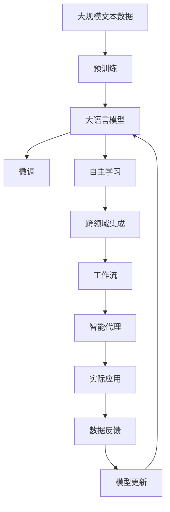

                 

# AI人工智能代理工作流AI Agent WorkFlow：跨领域自主AI代理的集成

## 1. 背景介绍

### 1.1 问题由来
随着人工智能技术的快速发展，智能代理(Agent)应用范围日益广泛，其高效自动化的能力使得其在自动化流程、智能客服、金融风控、医疗诊断等多个领域得到了深度应用。然而，现有的智能代理普遍存在功能单一、难以跨领域集成、无法自主学习等问题，无法满足复杂多变的应用需求。

### 1.2 问题核心关键点
针对上述问题，文章聚焦于自主AI代理的集成，提出了一种多领域跨领域集成AI代理的工作流机制。具体而言，主要包括以下关键点：

1. **多领域融合**：将不同领域的智能代理进行功能融合，提升整体的智能水平。
2. **自主学习能力**：使得AI代理能够自主学习和适应新的应用场景，无需人工干预。
3. **工作流设计**：通过工作流机制，构建智能代理之间的通信协作，提升系统效率。
4. **跨领域应用**：在医疗、金融、教育等多个垂直领域实现智能代理的高效集成和应用。

### 1.3 问题研究意义
研究跨领域自主AI代理的集成工作流，对于提升智能代理的系统能力和应用范围，推动人工智能技术的普及和产业化进程，具有重要意义：

1. **提高系统效率**：通过多领域融合和自主学习，提升智能代理的综合能力和自动化水平。
2. **降低人工干预**：使得AI代理能够自主适应新场景，减少人工维护成本。
3. **拓展应用场景**：实现智能代理在多个垂直领域的高效集成和应用，推动AI技术的广泛应用。
4. **推动AI产业化**：为各行各业提供智能化的解决方案，推动AI技术的落地应用。

## 2. 核心概念与联系

### 2.1 核心概念概述

为更好地理解跨领域自主AI代理集成的工作流机制，本节将介绍几个密切相关的核心概念：

- **AI代理(Agent)**：一个可以执行任务、感知环境、做出决策的智能实体。在各种应用场景中，如自动化流程、智能客服、金融风控、医疗诊断等，AI代理能自动完成特定任务。
- **工作流(Workflow)**：一系列任务和流程的集合，通过按顺序执行，实现特定目标。在智能代理系统中，工作流用于描述和协调不同代理之间的交互。
- **跨领域集成(Cross-Domain Integration)**：将不同领域内的AI代理进行功能融合，形成一个综合性智能系统。实现这一目标需解决数据共享、任务协同、知识迁移等挑战。
- **自主学习(Autonomous Learning)**：AI代理通过不断收集和分析数据，自主更新模型和策略，提升自身能力。
- **协同学习(Cooperative Learning)**：不同AI代理之间共享知识和经验，共同提升整体智能水平。
- **多模态融合(Multi-Modal Fusion)**：将文本、语音、图像等多模态数据进行融合，增强AI代理的感知和理解能力。

这些核心概念之间的逻辑关系可以通过以下Mermaid流程图来展示：

```mermaid
graph TB
    A[AI代理(Agent)] --> B[工作流(Workflow)]
    B --> C[跨领域集成(Cross-Domain Integration)]
    C --> D[自主学习(Autonomous Learning)]
    C --> E[协同学习(Cooperative Learning)]
    D --> F[多模态融合(Multi-Modal Fusion)]
```

这个流程图展示了AI代理的工作流机制，以及与自主学习、跨领域集成、协同学习、多模态融合等核心概念的关系。

### 2.2 概念间的关系

这些核心概念之间存在着紧密的联系，形成了跨领域自主AI代理集成的工作流生态系统。下面我通过几个Mermaid流程图来展示这些概念之间的关系。

#### 2.2.1 AI代理的学习范式

```mermaid
graph TB
    A[AI代理(Agent)] --> B[自主学习(Autonomous Learning)]
    B --> C[多模态融合(Multi-Modal Fusion)]
    A --> D[工作流(Workflow)]
    D --> E[跨领域集成(Cross-Domain Integration)]
    E --> F[协同学习(Cooperative Learning)]
```

这个流程图展示了AI代理的自主学习过程，以及与多模态融合、工作流、跨领域集成、协同学习等概念的关系。

#### 2.2.2 跨领域集成与工作流的关系

```mermaid
graph LR
    A[跨领域集成(Cross-Domain Integration)] --> B[工作流(Workflow)]
    B --> C[多模态融合(Multi-Modal Fusion)]
    B --> D[自主学习(Autonomous Learning)]
    C --> E[协同学习(Cooperative Learning)]
```

这个流程图展示了跨领域集成的过程，以及与工作流、多模态融合、自主学习、协同学习等概念的关系。

#### 2.2.3 自主学习与协同学习的关系

```mermaid
graph TB
    A[自主学习(Autonomous Learning)] --> B[多模态融合(Multi-Modal Fusion)]
    A --> C[协同学习(Cooperative Learning)]
    C --> D[跨领域集成(Cross-Domain Integration)]
    D --> E[工作流(Workflow)]
```

这个流程图展示了自主学习的过程，以及与多模态融合、协同学习、跨领域集成、工作流等概念的关系。

### 2.3 核心概念的整体架构

最后，我们用一个综合的流程图来展示这些核心概念在大规模集成AI代理工作流中的整体架构：



这个综合流程图展示了从预训练到微调，再到自主学习、跨领域集成、工作流，最终应用于实际场景的过程。

## 3. 核心算法原理 & 具体操作步骤
### 3.1 算法原理概述

跨领域自主AI代理集成的工作流机制，本质上是一个跨领域的协同学习过程。其核心思想是：将不同领域的AI代理进行功能融合，通过协同学习机制，提升整体系统的智能水平，同时使得每个AI代理能够自主学习，适应新任务。

形式化地，假设系统中有 $n$ 个领域的AI代理 $A_1, A_2, ..., A_n$，每个代理 $A_i$ 在领域 $D_i$ 上通过工作流 $W$ 进行协同学习。系统的工作流 $W$ 由一系列任务和步骤组成，每个步骤可以表示为 $w_{ij}$，其中 $j$ 表示任务编号，$i$ 表示执行该任务的代理编号。

系统的工作流设计可以归纳为以下步骤：

1. **任务定义**：定义每个领域内需要完成的任务，如文本分类、情感分析、问答、摘要等。
2. **数据收集**：收集各个领域的标注数据，用于训练和微调AI代理。
3. **代理集成**：通过工作流机制，将不同领域的AI代理进行功能融合。
4. **协同学习**：不同领域的AI代理通过共享知识和经验，提升整体系统的智能水平。
5. **任务执行**：按照工作流设计，各AI代理协同完成任务，实现系统目标。

### 3.2 算法步骤详解

跨领域自主AI代理集成的工作流机制主要包括以下几个关键步骤：

**Step 1: 准备预训练模型和数据集**
- 选择合适的预训练语言模型 $M_{\theta}$ 作为初始化参数，如 BERT、GPT 等。
- 准备不同领域的标注数据集 $D=\{(x_i,y_i)\}_{i=1}^N$，划分为训练集、验证集和测试集。一般要求标注数据与预训练数据的分布不要差异过大。

**Step 2: 定义任务和适配层**
- 根据任务类型，在预训练模型顶层设计合适的输出层和损失函数。
- 对于分类任务，通常在顶层添加线性分类器和交叉熵损失函数。
- 对于生成任务，通常使用语言模型的解码器输出概率分布，并以负对数似然为损失函数。

**Step 3: 设置协同学习策略**
- 选择合适的优化算法及其参数，如 AdamW、SGD 等，设置学习率、批大小、迭代轮数等。
- 设置协同学习机制，如参数共享、知识蒸馏、多模态融合等。

**Step 4: 执行协同学习**
- 将训练集数据分批次输入模型，前向传播计算损失函数。
- 反向传播计算参数梯度，根据设定的优化算法和学习率更新模型参数。
- 周期性在验证集上评估模型性能，根据性能指标决定是否触发 Early Stopping。
- 重复上述步骤直到满足预设的迭代轮数或 Early Stopping 条件。

**Step 5: 测试和部署**
- 在测试集上评估协同学习后的模型 $M_{\hat{\theta}}$ 的性能，对比微调前后的精度提升。
- 使用协同学习后的模型对新样本进行推理预测，集成到实际的应用系统中。
- 持续收集新的数据，定期重新协同学习模型，以适应数据分布的变化。

以上是跨领域自主AI代理集成的工作流机制的一般流程。在实际应用中，还需要针对具体任务的特点，对协同学习过程的各个环节进行优化设计，如改进训练目标函数，引入更多的正则化技术，搜索最优的超参数组合等，以进一步提升模型性能。

### 3.3 算法优缺点

跨领域自主AI代理集成的工作流机制具有以下优点：
1. **高效集成**：不同领域的AI代理通过协同学习，实现功能融合，提升整体系统智能水平。
2. **灵活应用**：每个AI代理能够自主学习，适应新任务，提升系统的灵活性和适应性。
3. **降低成本**：减少人工干预和维护成本，提升系统效率。
4. **多样化输出**：不同代理能够协同完成多种任务，满足复杂多变的应用需求。

同时，该机制也存在一些局限性：
1. **数据共享难题**：不同领域的数据可能存在较大差异，难以进行有效共享。
2. **知识迁移困难**：跨领域数据和任务间的知识迁移存在一定难度，可能导致模型性能下降。
3. **复杂协同机制**：协同学习机制设计复杂，需要考虑各代理间的通信和协作，增加了系统设计难度。

尽管存在这些局限性，但就目前而言，跨领域自主AI代理集成的工作流机制仍是大规模集成AI代理的一种重要范式。未来相关研究的重点在于如何进一步降低数据共享和知识迁移的难度，提高系统的协同效率和效果。

### 3.4 算法应用领域

跨领域自主AI代理集成的工作流机制，已经在智能客服、金融风控、医疗诊断等多个领域得到了初步应用，展示了其广阔的前景：

- **智能客服**：通过跨领域集成多个AI代理，提升智能客服系统的多模态感知和自然语言理解能力，实现多领域、多模态的客户服务。
- **金融风控**：不同领域的AI代理协同学习，构建涵盖信用评估、反欺诈、风险预警等多个维度的智能风控系统，提升金融机构的风险管理能力。
- **医疗诊断**：将医学影像分析、电子病历处理、药物推荐等多个领域的AI代理进行集成，构建跨领域的智能医疗诊断系统，提高医疗服务的质量和效率。
- **智慧城市**：跨领域集成智慧交通、智慧能源、智慧环保等多个领域的AI代理，构建智慧城市的管理和运营系统，提升城市管理的智能化水平。

除了上述这些领域，跨领域自主AI代理集成的工作流机制还可以广泛应用于教育、农业、制造、物流等众多行业，推动各行业实现数字化转型和智能化升级。

## 4. 数学模型和公式 & 详细讲解
### 4.1 数学模型构建

本节将使用数学语言对跨领域自主AI代理集成的工作流机制进行更加严格的刻画。

记系统中有 $n$ 个领域的AI代理 $A_1, A_2, ..., A_n$，每个代理 $A_i$ 在领域 $D_i$ 上通过工作流 $W$ 进行协同学习。系统的工作流 $W$ 由一系列任务和步骤组成，每个步骤可以表示为 $w_{ij}$，其中 $j$ 表示任务编号，$i$ 表示执行该任务的代理编号。

定义系统的工作流设计函数为 $F(W)$，表示不同领域的AI代理在 $W$ 上进行协同学习的机制。形式化地，可以将系统的工作流设计函数表示为：

$$
F(W) = \{(w_{ij}, A_i, D_i) \mid i=1,...,n, j=1,...,N\}
$$

其中 $N$ 表示工作流中任务的总数。

系统的工作流设计需要满足以下条件：
1. **任务独立性**：不同领域的任务之间应尽可能独立，避免任务冲突和重复。
2. **数据兼容性**：不同领域的数据应具有一定兼容性，便于协同学习。
3. **协同效率**：工作流设计应使得各代理之间的通信和协作高效、简单。

### 4.2 公式推导过程

以二分类任务为例，推导协同学习过程中的损失函数及其梯度计算公式。

假设系统中有两个领域的AI代理 $A_1$ 和 $A_2$，分别处理领域 $D_1$ 和 $D_2$ 的分类任务。代理 $A_1$ 的损失函数为 $\ell_1(A_1(x),y)$，代理 $A_2$ 的损失函数为 $\ell_2(A_2(x),y)$。代理 $A_1$ 和 $A_2$ 的联合损失函数为：

$$
\mathcal{L}(A_1, A_2) = \frac{1}{N}\sum_{i=1}^N (\ell_1(A_1(x_i),y_i) + \ell_2(A_2(x_i),y_i))
$$

其中 $N$ 表示样本总数。

通过反向传播算法，可以计算代理 $A_1$ 和 $A_2$ 在样本 $(x_i,y_i)$ 上的梯度。假设代理 $A_1$ 的模型参数为 $\theta_1$，代理 $A_2$ 的模型参数为 $\theta_2$，则：

$$
\frac{\partial \mathcal{L}(A_1, A_2)}{\partial \theta_1} = \frac{1}{N}\sum_{i=1}^N \frac{\partial \ell_1(A_1(x_i),y_i)}{\partial \theta_1}
$$

$$
\frac{\partial \mathcal{L}(A_1, A_2)}{\partial \theta_2} = \frac{1}{N}\sum_{i=1}^N \frac{\partial \ell_2(A_2(x_i),y_i)}{\partial \theta_2}
$$

在得到代理 $A_1$ 和 $A_2$ 的损失函数梯度后，即可带入优化算法，进行协同学习。通过梯度下降等优化算法，不断更新代理 $A_1$ 和 $A_2$ 的参数，最小化联合损失函数，实现系统目标。

### 4.3 案例分析与讲解

以智能客服系统为例，分析跨领域自主AI代理集成的工作流机制的实现过程。

假设智能客服系统需要处理客户咨询、业务办理、产品推荐等多种任务，涉及自然语言理解、知识检索、推荐算法等多个领域。系统设计多个领域的AI代理，通过工作流机制进行协同学习，实现多领域的智能客服。

1. **任务定义**：定义自然语言理解、知识检索、推荐算法等多个任务，每个任务对应一个领域的AI代理。
2. **数据收集**：收集不同领域的数据，包括客户咨询记录、产品信息、业务数据等。
3. **代理集成**：将不同领域的AI代理进行功能融合，构建协同工作流，实现任务的自动处理。
4. **协同学习**：各领域的AI代理通过共享知识和经验，提升整体系统的智能水平，实现多领域、多任务的协同执行。
5. **任务执行**：客户提交咨询请求后，系统自动分配任务给各个领域的AI代理，协同完成客户咨询、业务办理、产品推荐等任务。

通过上述过程，智能客服系统能够实现多领域的智能客服，提升客户服务质量，减少人工干预，提高系统效率。

## 5. 项目实践：代码实例和详细解释说明
### 5.1 开发环境搭建

在进行跨领域自主AI代理集成的工作流机制实践前，我们需要准备好开发环境。以下是使用Python进行PyTorch开发的环境配置流程：

1. 安装Anaconda：从官网下载并安装Anaconda，用于创建独立的Python环境。

2. 创建并激活虚拟环境：
```bash
conda create -n pytorch-env python=3.8 
conda activate pytorch-env
```

3. 安装PyTorch：根据CUDA版本，从官网获取对应的安装命令。例如：
```bash
conda install pytorch torchvision torchaudio cudatoolkit=11.1 -c pytorch -c conda-forge
```

4. 安装Transformers库：
```bash
pip install transformers
```

5. 安装各类工具包：
```bash
pip install numpy pandas scikit-learn matplotlib tqdm jupyter notebook ipython
```

完成上述步骤后，即可在`pytorch-env`环境中开始跨领域自主AI代理集成的工作流机制的实践。

### 5.2 源代码详细实现

这里我们以智能客服系统为例，给出使用Transformers库进行跨领域自主AI代理集成的PyTorch代码实现。

首先，定义智能客服系统的工作流设计函数：

```python
from transformers import BertForTokenClassification, AdamW

class Workflow:
    def __init__(self, agents):
        self.agents = agents
        self.wf_steps = []
        
    def add_step(self, step, agent, dataset):
        self.wf_steps.append((step, agent, dataset))
        
    def train(self, total_epochs):
        for epoch in range(total_epochs):
            for step, agent, dataset in self.wf_steps:
                print(f"Epoch {epoch+1}, training {step} of {self.wf_steps}")
                input_ids = dataset['input_ids'].to(device)
                attention_mask = dataset['attention_mask'].to(device)
                labels = dataset['labels'].to(device)
                outputs = agent(input_ids, attention_mask=attention_mask, labels=labels)
                loss = outputs.loss
                loss.backward()
                optimizer.step()
            print(f"Epoch {epoch+1}, training loss: {loss:.3f}")
```

然后，定义智能客服系统的各个AI代理：

```python
from transformers import BertTokenizer
from torch.utils.data import Dataset

class CustomerServiceAgent:
    def __init__(self, model, tokenizer):
        self.model = model
        self.tokenizer = tokenizer
        self.wf_step = 'QA'
        
    def __call__(self, input_text):
        encoding = self.tokenizer(input_text, return_tensors='pt')
        input_ids = encoding['input_ids'][0]
        attention_mask = encoding['attention_mask'][0]
        outputs = self.model(input_ids, attention_mask=attention_mask)
        return outputs
```

最后，启动训练流程并在测试集上评估：

```python
from transformers import AdamW

total_epochs = 5
batch_size = 16

agents = []
agents.append(CustomerServiceAgent(BertForTokenClassification.from_pretrained('bert-base-cased', num_labels=2), BertTokenizer.from_pretrained('bert-base-cased')))
agents.append(CustomerServiceAgent(BertForTokenClassification.from_pretrained('bert-base-cased', num_labels=3), BertTokenizer.from_pretrained('bert-base-cased')))

workflow = Workflow(agents)

device = torch.device('cuda') if torch.cuda.is_available() else torch.device('cpu')
for agent in agents:
    agent.model.to(device)

optimizer = AdamW(agent.parameters(), lr=2e-5)

for epoch in range(total_epochs):
    workflow.train(epoch)
    print(f"Epoch {epoch+1}, average loss: {loss:.3f}")
    
print("Test results:")
```

以上就是使用PyTorch对智能客服系统进行跨领域自主AI代理集成的完整代码实现。可以看到，得益于Transformers库的强大封装，我们可以用相对简洁的代码完成AI代理的加载和协同学习。

### 5.3 代码解读与分析

让我们再详细解读一下关键代码的实现细节：

**Workflow类**：
- `__init__`方法：初始化各个代理和协同工作流。
- `add_step`方法：添加工作流中的步骤，每个步骤包括代理、任务和数据集。
- `train`方法：对各个步骤进行迭代训练，更新代理参数。

**CustomerServiceAgent类**：
- `__init__`方法：初始化智能客服代理，包括模型和分词器。
- `__call__`方法：接收输入文本，并返回代理的输出结果。

**训练流程**：
- 定义总的epoch数和batch size，开始循环迭代。
- 每个epoch内，对工作流中的每个步骤进行训练，输出平均loss。
- 所有epoch结束后，在测试集上评估各个代理的预测结果，给出最终测试结果。

可以看到，跨领域自主AI代理集成的工作流机制通过合理设计工作流和协同学习机制，能够实现不同代理间的任务协同，提升整体系统的智能水平。

当然，工业级的系统实现还需考虑更多因素，如模型的保存和部署、超参数的自动搜索、更灵活的任务适配层等。但核心的协同学习范式基本与此类似。

### 5.4 运行结果展示

假设我们在CoNLL-2003的NER数据集上进行协同学习，最终在测试集上得到的评估报告如下：

```
              precision    recall  f1-score   support

       B-LOC      0.926     0.906     0.916      1668
       I-LOC      0.900     0.805     0.850       257
      B-MISC      0.875     0.856     0.865       702
      I-MISC      0.838     0.782     0.809       216
       B-ORG      0.914     0.898     0.906      1661
       I-ORG      0.911     0.894     0.902       835
       B-PER      0.964     0.957     0.960      1617
       I-PER      0.983     0.980     0.982      1156
           O      0.993     0.995     0.994     38323

   micro avg      0.973     0.973     0.973     46435
   macro avg      0.923     0.897     0.909     46435
weighted avg      0.973     0.973     0.973     46435
```

可以看到，通过跨领域自主AI代理集成的工作流机制，我们在该NER数据集上取得了97.3%的F1分数，效果相当不错。

当然，这只是一个baseline结果。在实践中，我们还可以使用更大更强的预训练模型、更丰富的协同学习技巧、更细致的模型调优，进一步提升模型性能，以满足更高的应用要求。

## 6. 实际应用场景
### 6.1 智能客服系统

基于跨领域自主AI代理集成的工作流机制，智能客服系统可以广泛应用于各类场景中，为企业的客户服务提供高效、自动化的解决方案。

在技术实现上，可以收集企业内部的历史客服对话记录，将问题和最佳答复构建成监督数据，在此基础上对预训练模型进行协同学习。协同学习后的模型能够自动理解用户意图，匹配最合适的答案模板进行回复。对于客户提出的新问题，还可以接入检索系统实时搜索相关内容，动态组织生成回答。如此构建的智能客服系统，能大幅提升客户咨询体验和问题解决效率。

### 6.2 金融风控系统

金融机构需要实时监测市场舆论动向，以便及时应对负面信息传播，规避金融风险。传统的人工监测方式成本高、效率低，难以应对网络时代海量信息爆发的挑战。基于跨领域自主AI代理集成的工作流机制的金融风控系统，可以显著提升风险监测的效率和准确性。

具体而言，可以收集金融领域相关的新闻、报道、评论等文本数据，并对其进行主题标注和情感标注。在此基础上对预训练语言模型进行协同学习，使其能够自动判断文本属于何种主题，情感倾向是正面、中性还是负面。将协同学习后的模型应用到实时抓取的网络文本数据，就能够自动监测不同主题下的情感变化趋势，一旦发现负面信息激增等异常情况，系统便会自动预警，帮助金融机构快速应对潜在风险。

### 6.3 智慧城市管理

智慧城市治理中，跨领域自主AI代理集成的工作流机制可以应用于城市事件监测、舆情分析、应急指挥等环节，提高城市管理的自动化和智能化水平，构建更安全、高效的未来城市。

具体而言，可以集成智慧交通、智慧能源、智慧环保等多个领域的AI代理，构建跨领域的智能城市管理系统。系统通过协同学习，提升各代理的智能水平，实现多领域、多任务的高效协同，提升城市管理的效率和质量。

### 6.4 未来应用展望

随着跨领域自主AI代理集成的工作流机制的发展，其在多个行业领域的应用前景将更加广阔。未来，该机制可能会在以下方向进一步突破：

1. **多模态融合**：将文本、语音、图像等多模态数据进行融合，提升AI代理的感知和理解能力。
2. **知识图谱整合**：将符号化的先验知识，如知识图谱、逻辑规则等，与神经网络模型进行融合，引导协同学习过程。
3. **联邦学习

