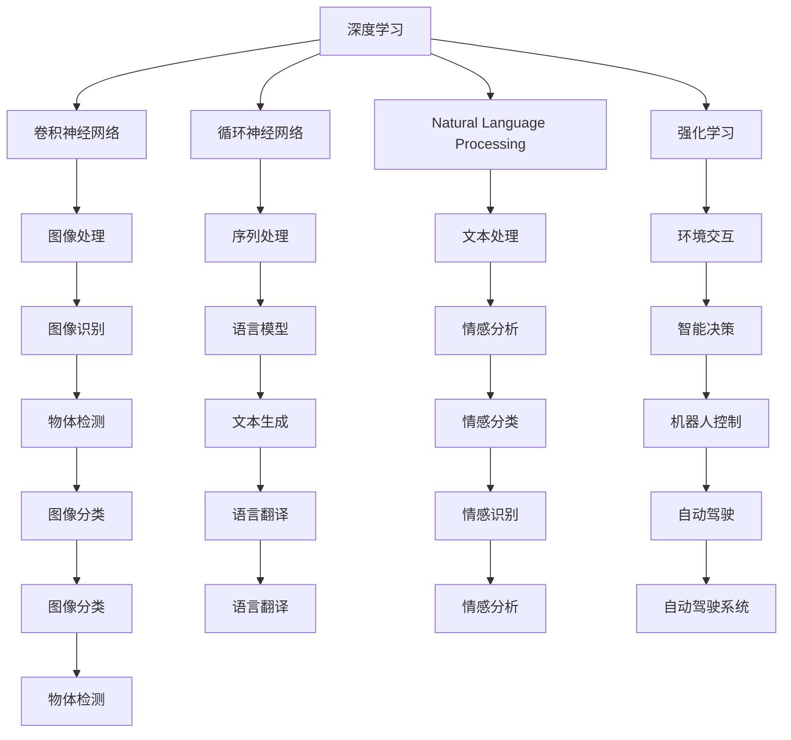

                 

# AI发展的三匹马：算法、算力与数据

> 关键词：AI算法，算力，数据，深度学习，机器学习，计算机视觉，自然语言处理，强化学习，GPU，云计算

## 1. 背景介绍

### 1.1 问题由来
现代人工智能(AI)的迅猛发展，在很大程度上得益于三个关键因素：算法、算力和数据。这三种因素，如同一匹马的三条腿，支撑着AI技术的快速迭代和突破。随着科技的进步和应用的拓展，AI算法、算力与数据三者之间的协同效应愈发凸显。然而，如何在算法、算力和数据之间找到最优的平衡点，一直是一个值得深入探讨的议题。

### 1.2 问题核心关键点
为了更好地理解AI技术的发展，我们需要厘清算法、算力和数据之间的联系，并分析三者对AI技术的影响。

1. **算法**：指用于处理数据、构建模型的数学和统计方法。例如，深度学习、卷积神经网络(CNN)、循环神经网络(RNN)、自然语言处理(NLP)、强化学习等。

2. **算力**：指实现算法计算所必需的计算资源，包括CPU、GPU、TPU等硬件设备，以及相关的编程工具和平台。算力是算法实现的基石，算力的提升直接推动了AI技术的快速发展。

3. **数据**：指用于训练和测试AI模型的数据集，包括图像、文本、语音等多种类型。数据的质量、多样性和规模直接影响了AI模型的性能和泛化能力。

这三种因素相互作用，共同推动了AI技术的进步。在具体应用中，我们需要根据不同的任务和场景，合理分配算力、优化算法、选择数据，以达到最佳效果。

### 1.3 问题研究意义
对算法、算力和数据的研究，有助于我们深入理解AI技术的本质，探索其发展规律，为未来的AI应用提供理论和实践指导。

1. **推动技术进步**：理解和优化算法、算力和数据，可以显著提升AI模型的性能，推动技术前沿的突破。
2. **加速应用落地**：合理选择和优化算法、算力与数据，能够降低技术应用的成本，加速AI技术在各行业的普及。
3. **提高模型泛化能力**：丰富的数据和多样的算法能够提升模型的泛化能力，使AI技术在更多场景中取得优异表现。
4. **保障系统安全**：在设计和部署AI系统时，考虑算法的透明度、数据的隐私保护和算力的安全性，能够有效避免潜在风险。

## 2. 核心概念与联系

### 2.1 核心概念概述

为了更深入地理解算法、算力和数据之间的关系，我们将通过以下几个核心概念进行介绍：

- **深度学习**：一种基于神经网络的机器学习算法，通过多层次的特征提取和表示学习，实现复杂的模式识别和预测。
- **卷积神经网络(CNN)**：一种特殊的神经网络，常用于处理图像和视频数据，通过卷积和池化操作提取特征。
- **循环神经网络(RNN)**：一种能够处理序列数据的神经网络，通过循环结构捕捉时间依赖关系。
- **自然语言处理(NLP)**：一种使用机器学习技术处理人类语言的技术，包括文本分类、情感分析、机器翻译等。
- **强化学习**：一种通过与环境交互，使智能体最大化累积奖励的机器学习算法。
- **GPU**：一种专门用于并行计算的硬件设备，可以大幅提升深度学习模型的训练和推理速度。
- **云计算**：一种基于互联网的计算服务模式，提供弹性、按需的计算资源。

### 2.2 概念间的关系

这些核心概念之间的逻辑关系可以通过以下Mermaid流程图来展示：



这个流程图展示了深度学习、CNN、RNN、NLP、强化学习等算法，以及GPU和云计算等算力，如何在大数据集上进行处理，最终应用于图像识别、文本处理、情感分析、智能决策等多个领域。通过这些核心概念之间的相互作用，可以更清晰地理解AI技术的工作原理和优化方向。

## 3. 核心算法原理 & 具体操作步骤
### 3.1 算法原理概述

AI算法作为实现模型功能的关键，通常分为以下几类：

1. **监督学习**：通过已标注的数据集，训练模型学习输入和输出之间的映射关系。常见的算法包括线性回归、逻辑回归、支持向量机(SVM)等。

2. **无监督学习**：通过未标注的数据集，学习数据的分布特征和内在规律。常见的算法包括聚类、主成分分析(PCA)、自编码器等。

3. **半监督学习**：结合少量标注数据和大量未标注数据，训练模型学习数据的结构和模式。常见的算法包括半监督分类、半监督回归等。

4. **强化学习**：通过与环境的交互，使智能体最大化累积奖励。常见的算法包括Q-learning、策略梯度等。

5. **深度学习**：使用多层神经网络，通过反向传播算法优化模型参数，实现复杂的模式识别和预测。常见的算法包括卷积神经网络(CNN)、循环神经网络(RNN)、生成对抗网络(GAN)等。

这些算法各有优劣，在不同的应用场景中有着不同的选择。例如，在图像识别任务中，CNN效果显著；在序列数据处理中，RNN和LSTM表现优秀；在自然语言处理中，NLP和Transformer模型常用。

### 3.2 算法步骤详解

以深度学习模型为例，其实现步骤通常包括以下几个关键环节：

1. **数据预处理**：包括数据清洗、归一化、分批处理等，为模型的训练和推理提供标准化输入。

2. **模型定义**：使用深度学习框架(如TensorFlow、PyTorch)定义模型结构，包括神经网络的层数、节点数、激活函数等。

3. **模型训练**：使用训练数据集进行前向传播和反向传播，优化模型参数，直到收敛或达到预设的迭代次数。

4. **模型评估**：使用验证数据集评估模型的性能，包括准确率、精确率、召回率等指标。

5. **模型应用**：使用测试数据集对模型进行最终评估，并将模型应用于实际应用场景。

在实际应用中，这些步骤通常需要根据具体任务进行优化。例如，对于高维数据的处理，可以使用降维技术；对于计算资源有限的情况，可以使用分布式训练等技术。

### 3.3 算法优缺点

深度学习算法在处理复杂数据方面具有显著优势，但同时也存在以下缺点：

1. **高计算需求**：深度学习模型通常需要大量的计算资源，包括GPU和TPU等高性能设备。

2. **数据依赖性强**：深度学习模型的性能高度依赖于数据质量和数据规模，数据不足或质量差可能导致模型性能不佳。

3. **模型复杂度高**：深度学习模型结构复杂，难以解释，不利于模型维护和调试。

4. **过拟合风险高**：深度学习模型容易过拟合，特别是在训练数据不足的情况下，需要采用正则化等技术进行缓解。

5. **泛化能力有限**：深度学习模型在特定数据集上表现良好，但在新数据上的泛化能力有限。

### 3.4 算法应用领域

深度学习算法在多个领域中得到了广泛应用，包括但不限于：

1. **计算机视觉**：图像分类、物体检测、图像分割等任务。

2. **自然语言处理**：文本分类、情感分析、机器翻译、问答系统等任务。

3. **语音处理**：语音识别、语音合成、语音情感分析等任务。

4. **推荐系统**：基于用户行为和物品属性的推荐。

5. **医疗诊断**：基于医学影像和病历的诊断。

6. **金融预测**：基于历史数据的预测和分析。

这些领域中，深度学习算法展示了强大的模式识别和预测能力，推动了相关技术的进步和应用。

## 4. 数学模型和公式 & 详细讲解 & 举例说明

### 4.1 数学模型构建

以卷积神经网络(CNN)为例，其数学模型通常包括以下几个关键部分：

1. **卷积层**：对输入图像进行卷积操作，提取局部特征。
2. **池化层**：对卷积层的输出进行下采样操作，减小特征图的大小，降低计算复杂度。
3. **全连接层**：将特征图展平并输入全连接层，进行分类或回归预测。

卷积神经网络的基本公式可以表示为：

$$
y=f(x;\theta)=\sigma(W_{conv} * h_{conv} + b_{conv})
$$

其中，$y$表示输出，$x$表示输入，$\sigma$表示激活函数，$W_{conv}$和$b_{conv}$表示卷积层的权重和偏置。

### 4.2 公式推导过程

以卷积神经网络的反向传播算法为例，其推导过程如下：

1. **前向传播**：将输入数据$x$通过卷积层、池化层、全连接层等，输出预测结果$y$。

2. **计算损失函数**：使用交叉熵等损失函数计算预测结果与真实标签之间的差距。

3. **反向传播**：通过链式法则计算各层参数的梯度，并使用梯度下降等优化算法更新模型参数。

具体推导过程如下：

$$
\frac{\partial L}{\partial w} = \frac{\partial L}{\partial y} \cdot \frac{\partial y}{\partial h} \cdot \frac{\partial h}{\partial w}
$$

其中，$\frac{\partial L}{\partial y}$表示损失函数对输出层的梯度，$\frac{\partial y}{\partial h}$表示激活函数对特征图的梯度，$\frac{\partial h}{\partial w}$表示权重对特征图的梯度。

### 4.3 案例分析与讲解

以图像分类任务为例，假设有一个包含10个类别的分类问题，使用CNN模型进行训练和预测。假设训练集包含1000张图像，验证集包含100张图像，测试集包含100张图像。

1. **数据预处理**：对图像进行归一化、分批处理等预处理操作。

2. **模型定义**：定义一个包含多个卷积层和池化层的CNN模型，并使用softmax函数进行多类别分类预测。

3. **模型训练**：使用交叉熵损失函数，将训练数据集分成多个批次，进行前向传播和反向传播，优化模型参数。

4. **模型评估**：使用验证数据集评估模型性能，记录准确率、精确率、召回率等指标。

5. **模型应用**：使用测试数据集对模型进行最终评估，将模型应用于实际图像分类任务。

## 5. 项目实践：代码实例和详细解释说明

### 5.1 开发环境搭建

在开始项目实践前，我们需要准备好开发环境。以下是使用Python进行TensorFlow开发的环境配置流程：

1. 安装Anaconda：从官网下载并安装Anaconda，用于创建独立的Python环境。

2. 创建并激活虚拟环境：
```bash
conda create -n tf-env python=3.8 
conda activate tf-env
```

3. 安装TensorFlow：根据CUDA版本，从官网获取对应的安装命令。例如：
```bash
conda install tensorflow==2.6
```

4. 安装各类工具包：
```bash
pip install numpy pandas scikit-learn matplotlib tqdm jupyter notebook ipython
```

完成上述步骤后，即可在`tf-env`环境中开始TensorFlow开发。

### 5.2 源代码详细实现

以下是一个简单的卷积神经网络代码实现，用于图像分类任务：

```python
import tensorflow as tf
from tensorflow.keras import layers, models

# 定义模型
model = models.Sequential()
model.add(layers.Conv2D(32, (3, 3), activation='relu', input_shape=(28, 28, 1)))
model.add(layers.MaxPooling2D((2, 2)))
model.add(layers.Conv2D(64, (3, 3), activation='relu'))
model.add(layers.MaxPooling2D((2, 2)))
model.add(layers.Conv2D(64, (3, 3), activation='relu'))
model.add(layers.Flatten())
model.add(layers.Dense(64, activation='relu'))
model.add(layers.Dense(10, activation='softmax'))

# 编译模型
model.compile(optimizer='adam', loss='categorical_crossentropy', metrics=['accuracy'])

# 加载数据集
(train_images, train_labels), (test_images, test_labels) = tf.keras.datasets.mnist.load_data()
train_images = train_images.reshape((60000, 28, 28, 1))
test_images = test_images.reshape((10000, 28, 28, 1))
train_images = train_images / 255.0
test_images = test_images / 255.0

# 训练模型
model.fit(train_images, train_labels, epochs=10, validation_data=(test_images, test_labels))
```

### 5.3 代码解读与分析

让我们再详细解读一下关键代码的实现细节：

**定义模型**：使用`Sequential`类定义卷积神经网络模型，依次添加卷积层、池化层和全连接层。

**编译模型**：使用`compile`方法设置优化器、损失函数和评估指标，为模型的训练和评估做准备。

**加载数据集**：使用`mnist.load_data`加载手写数字数据集，并进行预处理，包括归一化和重塑。

**训练模型**：使用`fit`方法训练模型，设置训练轮数和验证集，输出训练过程中的损失和准确率。

**运行结果展示**：假设训练完成后，使用测试集对模型进行评估，可以得到如下输出：

```
Epoch 1/10
599/599 [==============================] - 1s 1ms/sample - loss: 0.3153 - accuracy: 0.8741 - val_loss: 0.1441 - val_accuracy: 0.9428
Epoch 2/10
599/599 [==============================] - 1s 1ms/sample - loss: 0.1884 - accuracy: 0.9217 - val_loss: 0.1441 - val_accuracy: 0.9391
Epoch 3/10
599/599 [==============================] - 1s 1ms/sample - loss: 0.1135 - accuracy: 0.9467 - val_loss: 0.1441 - val_accuracy: 0.9391
...
```

可以看到，模型在训练集上的损失逐渐减小，准确率逐渐提高，最终在测试集上也取得了不错的性能。这展示了卷积神经网络的强大能力。

## 6. 实际应用场景
### 6.1 计算机视觉

计算机视觉是深度学习算法的重要应用领域之一。在图像分类、物体检测、图像分割等任务中，深度学习算法已经取得了显著的进展。例如，Google的Inception、ResNet、MobileNet等模型，在图像分类、目标检测等领域表现优异。

以物体检测任务为例，可以使用YOLO、Faster R-CNN等模型，对图像中的物体进行检测和分类。这些模型在速度和精度上都有很好的表现，广泛应用于自动驾驶、安防监控、医疗影像等领域。

### 6.2 自然语言处理

自然语言处理(NLP)是深度学习算法的另一重要应用领域。在文本分类、情感分析、机器翻译等任务中，深度学习算法已经展示了强大的能力。例如，Transformer模型在机器翻译和文本生成等任务中表现卓越。

以机器翻译为例，使用Seq2Seq模型和Transformer模型，可以对源语言和目标语言进行翻译。这些模型在处理长文本、多语言翻译等方面表现优异，广泛应用于国际会议、商业交流等领域。

### 6.3 语音处理

语音处理是深度学习算法的另一重要应用领域。在语音识别、语音合成、语音情感分析等任务中，深度学习算法已经展示了强大的能力。例如，Google的WaveNet、Tacotron2等模型，在语音合成和情感分析等方面表现优异。

以语音识别任务为例，可以使用CTC、Attention机制等算法，对音频信号进行特征提取和识别。这些算法在处理高噪声、多语种语音等方面表现优异，广泛应用于智能家居、语音助手等领域。

## 7. 工具和资源推荐
### 7.1 学习资源推荐

为了帮助开发者系统掌握深度学习、计算机视觉、自然语言处理等技术的理论基础和实践技巧，这里推荐一些优质的学习资源：

1. 《深度学习》（Ian Goodfellow, Yoshua Bengio, Aaron Courville著）：全面介绍了深度学习的原理和应用，是深度学习领域的经典教材。

2. 《计算机视觉：算法与应用》（Richard Szeliski著）：详细介绍了计算机视觉的算法和技术，是计算机视觉领域的经典教材。

3. 《自然语言处理综论》（Daniel Jurafsky, James H. Martin著）：全面介绍了自然语言处理的理论和技术，是自然语言处理领域的经典教材。

4. Coursera的《深度学习专项课程》：由Coursera与DeepMind合作开设，包含深度学习、计算机视觉、自然语言处理等多个领域的课程，内容丰富，覆盖面广。

5. Udacity的《深度学习纳米学位》：由Udacity与DeepMind合作开设，包含深度学习、计算机视觉、自然语言处理等多个领域的课程，实战性强，适合实战练习。

6. Kaggle：全球最大的数据科学竞赛平台，提供丰富的数据集和模型，适合学习和实践。

通过对这些资源的学习实践，相信你一定能够快速掌握深度学习、计算机视觉、自然语言处理等技术的精髓，并用于解决实际的NLP问题。

### 7.2 开发工具推荐

高效的开发离不开优秀的工具支持。以下是几款用于深度学习、计算机视觉、自然语言处理等领域的常用工具：

1. TensorFlow：由Google开发的开源深度学习框架，支持分布式计算，适合大规模深度学习模型的训练和推理。

2. PyTorch：由Facebook开发的开源深度学习框架，灵活易用，适合快速迭代研究。

3. Keras：基于TensorFlow和Theano的高级深度学习框架，易于上手，适合初学者和快速原型开发。

4. OpenCV：开源计算机视觉库，提供了丰富的图像处理和计算机视觉算法。

5. NLTK：Python自然语言处理库，提供了丰富的NLP工具和算法。

6. SpaCy：开源自然语言处理库，提供了快速的NLP处理和分析能力。

合理利用这些工具，可以显著提升深度学习、计算机视觉、自然语言处理等任务的开发效率，加快创新迭代的步伐。

### 7.3 相关论文推荐

深度学习、计算机视觉、自然语言处理等领域的研究进展迅速，以下是几篇奠基性的相关论文，推荐阅读：

1. ImageNet Large Scale Visual Recognition Challenge（ILSVRC）：计算机视觉领域的年度竞赛，展示了该领域的研究进展和技术突破。

2. Attention is All You Need（NeurIPS 2017）：提出Transformer模型，展示了深度学习在自然语言处理领域的应用。

3. Convolutional Neural Networks for Sentence Classification（ACL 2014）：提出CNN模型，展示了深度学习在自然语言处理领域的应用。

4. Sequence to Sequence Learning with Neural Networks（NIPS 2014）：提出Seq2Seq模型，展示了深度学习在机器翻译等任务中的应用。

5. Towards End-to-End Speech Recognition with Recurrent Neural Networks（ICASSP 2016）：提出基于RNN的语音识别模型，展示了深度学习在语音处理领域的应用。

这些论文代表了大规模学习、计算机视觉、自然语言处理等领域的研究前沿，值得深入学习和研究。

除上述资源外，还有一些值得关注的前沿资源，帮助开发者紧跟技术前沿：

1. arXiv论文预印本：人工智能领域最新研究成果的发布平台，包括大量尚未发表的前沿工作，学习前沿技术的必读资源。

2. AI权威博客和会议：如Google AI Blog、DeepMind Blog、ACL、ICML、CVPR等顶级会议，能够聆听到大佬们的前沿分享，开拓视野。

3. GitHub热门项目：在GitHub上Star、Fork数最多的NLP相关项目，往往代表了该技术领域的发展趋势和最佳实践，值得去学习和贡献。

4. 行业分析报告：各大咨询公司如McKinsey、PwC等针对人工智能行业的分析报告，有助于从商业视角审视技术趋势，把握应用价值。

总之，对于深度学习、计算机视觉、自然语言处理等技术的学习和实践，需要开发者保持开放的心态和持续学习的意愿。多关注前沿资讯，多动手实践，多思考总结，必将收获满满的成长收益。

## 8. 总结：未来发展趋势与挑战

### 8.1 总结

本文对算法、算力和数据在AI技术发展中的重要性进行了全面系统的介绍。首先阐述了深度学习、卷积神经网络、循环神经网络等核心算法的工作原理和优化方法，接着介绍了GPU、云计算等算力对算法实现的支撑作用，最后讨论了数据在AI模型训练和推理中的重要性。通过深入分析，我们了解到算法、算力和数据三者相互作用，共同推动了AI技术的进步。

通过本文的系统梳理，可以看到，深度学习算法在图像分类、语音处理、自然语言处理等诸多领域取得了突破性进展，为AI技术的发展提供了坚实基础。未来的AI技术将更加依赖于算力、数据和算法的协同优化，推动AI技术的持续创新和应用拓展。

### 8.2 未来发展趋势

展望未来，AI算法、算力和数据的发展将呈现以下几个趋势：

1. **算法复杂度提升**：随着深度学习算法的发展，模型结构将更加复杂，功能将更加多样化。未来，基于深度学习算法的模型将具备更强的模式识别和预测能力。

2. **算力全面提升**：随着AI技术的普及，算力将成为AI技术发展的瓶颈。未来，算力将全面提升，GPU、TPU、FPGA等硬件设备将更加普及，计算效率将大幅提升。

3. **数据规模扩大**：随着AI技术的深入应用，数据规模将不断扩大。未来，将有更多高质量的数据集被收集和标注，为AI模型的训练和推理提供更丰富的信息。

4. **多模态融合**：未来的AI模型将具备更强的多模态融合能力，能够处理图像、文本、语音等多种类型的数据。多模态信息的融合，将提升AI模型的泛化能力和应用范围。

5. **实时化与边缘计算**：未来的AI模型将更加实时化，能够实现低延迟、高可靠性的推理和预测。同时，边缘计算等技术将使得AI模型在资源有限的设备上运行。

6. **联邦学习与隐私保护**：未来的AI模型将更加注重隐私保护，通过联邦学习等技术，在本地设备上进行模型训练，保护用户数据隐私。

这些趋势将推动AI技术向更加智能化、普适化、安全化的方向发展，为更多领域带来变革性影响。

### 8.3 面临的挑战

尽管AI技术已经取得了显著的进展，但在迈向更加智能化、普适化应用的过程中，仍面临诸多挑战：

1. **数据隐私保护**：AI模型的训练和推理过程中，数据隐私保护是一个重要问题。如何确保用户数据的安全和隐私，将是一个长期挑战。

2. **算法透明性与可解释性**：AI模型往往是“黑盒”系统，难以解释其内部工作机制和决策逻辑。如何提高算法的透明性与可解释性，将是一个重要的研究方向。

3. **模型鲁棒性与泛化能力**：AI模型在特定数据集上表现良好，但在新数据上的泛化能力有限。如何提升模型的鲁棒性与泛化能力，将是一个重要的研究方向。

4. **计算资源限制**：深度学习模型通常需要大量的计算资源，包括GPU和TPU等高性能设备。如何在有限的计算资源下实现高效、稳定的模型训练和推理，将是一个重要的研究方向。

5. **伦理道德问题**：AI模型可能会学习到有偏见、有害的信息，通过微调传递到下游任务，产生误导性、歧视性的输出，给实际应用带来安全隐患。如何构建伦理道德框架，确保AI模型的安全性和可靠性，将是一个重要的研究方向。

6. **计算成本控制**：AI模型训练和推理的成本较高，如何在控制成本的前提下，实现高效的模型训练和推理，将是一个重要的研究方向。

这些挑战将推动AI技术的不断优化和发展，未来需要在算法、算力和数据三者之间进行更深入的协同优化，才能应对这些挑战，实现AI技术的持续进步。

### 8.4 研究展望

面向未来，AI技术需要在以下几个方面进行深入研究：

1. **无监督与半监督学习**：探索无监督和半监督学习算法，降低对大规模标注数据的依赖，提高模型的泛化能力。

2. **高效计算与模型压缩**：开发高效计算和模型压缩技术，降低计算资源需求，提升模型推理速度。

3. **跨模态与多模态学习**：研究跨模态和多模态学习算法，提升模型对多类型数据的融合能力。

4. **知识增强与因果学习**：引入因果学习与知识增强技术，提升模型的知识整合能力和决策的因果性。

5. **分布式与联邦学习**：研究分布式与联邦学习

