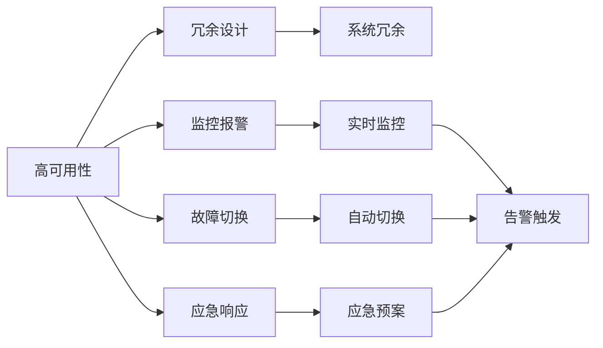

                 

# 电商系统的高可用、稳定性、安全性、高性能系统能力保障

## 1. 背景介绍

电商系统作为互联网时代的重要组成部分，承载着巨大的交易量和用户交互。随着用户需求的不断增长和市场竞争的日益激烈，如何保障电商系统的可用性、稳定性、安全性和高性能，已成为电商平台技术架构设计的核心。本文将深入探讨电商系统在面对这些挑战时，应如何构建高可用、稳定、安全、高性能的系统能力保障体系，以支持大规模用户和业务的稳定运行。

## 2. 核心概念与联系

### 2.1 核心概念概述

#### 2.1.1 高可用性(Availability)
高可用性指的是系统在面对硬件故障、网络中断等异常情况时，仍能保证服务不中断，达到99.999%的服务可用率。电商系统的高可用性保障是通过冗余设计、监控报警、故障切换、应急响应等措施来实现的。

#### 2.1.2 稳定性(Stability)
稳定性是指系统在正常运行状态下，能够持续稳定地提供服务，不受内部或外部异常的影响。稳定性主要通过代码质量控制、服务化设计、性能优化、监控报警等手段来保障。

#### 2.1.3 安全性(Security)
安全性指系统能够抵御各类网络攻击和数据泄露，确保用户数据和交易的安全性。电商系统的安全性保障包括但不限于身份验证、数据加密、权限控制、漏洞扫描等措施。

#### 2.1.4 高性能(Performance)
高性能指的是系统能够快速响应用户请求，保证用户访问体验。电商系统的高性能保障通过负载均衡、缓存策略、数据库优化、异步处理等技术来实现。

这些核心概念之间相互关联，共同构建了电商系统的系统能力保障体系。以下是一个简化的Mermaid流程图，展示了这些概念之间的联系：



## 3. 核心算法原理 & 具体操作步骤

### 3.1 算法原理概述

电商系统的系统能力保障体系主要基于分布式系统设计、负载均衡、故障恢复、安全防护等技术实现。其核心原理在于通过冗余设计、异构备份、负载均衡、自动扩缩容等手段，构建多层次、多维度的系统保障体系。

#### 3.1.1 冗余设计
冗余设计是电商系统高可用性的基础。通过在数据中心部署多套硬件和软件，保证系统在单点故障时仍能正常运行。常见的冗余设计包括主备架构、双活架构、异地备份等。

#### 3.1.2 负载均衡
负载均衡是指将用户请求分散到多台服务器上，避免单点压力过大，提高系统处理能力。电商系统常用的负载均衡技术包括DNS轮询、Nginx负载均衡、LVS(Linux Virtual Server)等。

#### 3.1.3 故障恢复
故障恢复是指在系统出现故障时，能够快速检测、定位并恢复服务。常见的故障恢复技术包括自动备份、快速故障切换、自动重启等。

#### 3.1.4 安全防护
安全防护是指通过身份验证、数据加密、权限控制等手段，保障用户数据和交易的安全。常见的安全防护技术包括防火墙、入侵检测系统、安全认证协议等。

### 3.2 算法步骤详解

#### 3.2.1 系统架构设计
电商系统应采用微服务架构，将系统拆分为多个服务模块，每个模块独立部署，以提高系统的可扩展性和可用性。

#### 3.2.2 数据存储架构设计
电商系统应采用分布式存储架构，如Hadoop、Ceph等，分散存储在多个节点上，保证数据的高可用性和可扩展性。

#### 3.2.3 消息队列设计
电商系统应采用消息队列技术，如Kafka、RabbitMQ等，保证系统在不同组件之间的异步通信和事务一致性。

#### 3.2.4 数据库设计
电商系统应采用读写分离、数据分片、分布式缓存等技术，提高数据库的读写能力和处理能力。

#### 3.2.5 监控报警设计
电商系统应采用实时监控技术，如Prometheus、Zabbix等，实时监控系统运行状态，及时发现和处理异常情况。

#### 3.2.6 应急预案设计
电商系统应制定详细的应急预案，包括故障处理流程、备份恢复流程、应急通信流程等，确保在系统故障时能够快速恢复服务。

### 3.3 算法优缺点

#### 3.3.1 优点
1. 高可用性：冗余设计、负载均衡、故障恢复等技术确保系统在单点故障时仍能正常运行。
2. 稳定性：微服务架构、异步通信、缓存策略等技术提高系统稳定性。
3. 安全性：身份验证、数据加密、权限控制等技术保障用户数据和交易的安全性。
4. 高性能：负载均衡、读写分离、分布式缓存等技术提升系统性能。

#### 3.3.2 缺点
1. 复杂性：分布式系统设计和管理复杂，需要大量的运维和监控资源。
2. 成本高：大规模分布式系统建设和运维成本较高。
3. 数据一致性：分布式系统可能导致数据一致性问题，需要额外的设计和解决。

### 3.4 算法应用领域

电商系统的系统能力保障体系在电商领域得到了广泛应用，覆盖了商品管理、订单管理、支付系统、物流管理等各个环节，确保了电商平台的稳定运行和高效处理能力。

## 4. 数学模型和公式 & 详细讲解

### 4.1 数学模型构建

#### 4.1.1 高可用性模型
电商系统的高可用性可以通过以下几个数学模型进行描述：

1. 可用性模型：

$$
A = 1 - (1 - R)\sum_{i=1}^{n}P_i
$$

其中，$A$ 表示系统的可用性，$R$ 表示冗余设计系数，$P_i$ 表示单点故障概率。

2. 故障恢复时间模型：

$$
T_{recovery} = T_{backup} + T_{switch} + T_{restart}
$$

其中，$T_{recovery}$ 表示故障恢复时间，$T_{backup}$ 表示备份时间，$T_{switch}$ 表示故障切换时间，$T_{restart}$ 表示系统重启时间。

#### 4.1.2 稳定性模型
电商系统的稳定性可以通过以下几个数学模型进行描述：

1. 性能模型：

$$
P = \frac{T_{avg}}{T_{max}}
$$

其中，$P$ 表示系统性能，$T_{avg}$ 表示平均响应时间，$T_{max}$ 表示最大响应时间。

2. 负载均衡模型：

$$
L = \frac{R_{total}}{N_{server}}
$$

其中，$L$ 表示负载均衡度，$R_{total}$ 表示系统总请求数，$N_{server}$ 表示服务器数量。

#### 4.1.3 安全性模型
电商系统的安全性可以通过以下几个数学模型进行描述：

1. 安全防护模型：

$$
S = 1 - P_{attack} - P_{data_leak}
$$

其中，$S$ 表示系统安全性，$P_{attack}$ 表示攻击概率，$P_{data_leak}$ 表示数据泄露概率。

2. 权限控制模型：

$$
C = \frac{R_{allowed}}{R_{total}}
$$

其中，$C$ 表示权限控制度，$R_{allowed}$ 表示允许访问的用户数，$R_{total}$ 表示总用户数。

#### 4.1.4 高性能模型
电商系统的高性能可以通过以下几个数学模型进行描述：

1. 并发处理模型：

$$
C = \frac{R_{total}}{N_{core}}
$$

其中，$C$ 表示并发处理能力，$R_{total}$ 表示总请求数，$N_{core}$ 表示核心数量。

2. 缓存命中率模型：

$$
H = \frac{T_{cache}}{T_{total}}
$$

其中，$H$ 表示缓存命中率，$T_{cache}$ 表示缓存命中的时间，$T_{total}$ 表示总处理时间。

### 4.2 公式推导过程

#### 4.2.1 高可用性模型推导
假设系统冗余设计系数为2，单个服务器的故障概率为0.01，则高可用性为：

$$
A = 1 - (1 - 2)\sum_{i=1}^{2}0.01 = 1 - 0.02 = 0.98
$$

表示系统的可用性为98%。

#### 4.2.2 稳定性模型推导
假设系统总请求数为10000，服务器数量为4，则负载均衡度为：

$$
L = \frac{10000}{4} = 2500
$$

表示系统平均每秒处理的请求数为2500。

#### 4.2.3 安全性模型推导
假设攻击概率为0.01，数据泄露概率为0.02，则安全性为：

$$
S = 1 - 0.01 - 0.02 = 0.97
$$

表示系统的安全性为97%。

#### 4.2.4 高性能模型推导
假设总请求数为10000，核心数量为8，则并发处理能力为：

$$
C = \frac{10000}{8} = 1250
$$

表示系统最大并发处理能力为1250。

### 4.3 案例分析与讲解

#### 4.3.1 高性能系统案例
阿里巴巴的Tmall电商系统采用了微服务架构、分布式存储、负载均衡、消息队列等技术，保证了系统的性能和高可用性。其核心技术包括：

1. 微服务架构：将系统拆分为多个服务模块，每个模块独立部署，提升系统的可扩展性和可用性。

2. 分布式存储：采用Hadoop和Ceph等技术，分散存储在多个节点上，保证数据的高可用性和可扩展性。

3. 负载均衡：采用Nginx和LVS等技术，将用户请求分散到多台服务器上，提高系统处理能力。

4. 消息队列：采用Kafka等技术，保证系统在不同组件之间的异步通信和事务一致性。

#### 4.3.2 安全性系统案例
京东的电商平台采用身份验证、数据加密、权限控制等技术，保障了用户数据和交易的安全性。其核心技术包括：

1. 身份验证：采用OAuth2等标准协议，保障用户身份的安全性。

2. 数据加密：采用AES、RSA等加密算法，保障用户数据的安全性。

3. 权限控制：采用RBAC等权限控制模型，保障用户操作的安全性。

## 5. 项目实践：代码实例和详细解释说明

### 5.1 开发环境搭建

#### 5.1.1 硬件环境搭建
1. 服务器选择
   - CPU：选择高性能的CPU，如Intel Xeon或AMD EPYC系列。
   - 内存：选择大容量内存，如64GB以上。
   - 存储：选择高读写速度的存储设备，如SSD或NVMe。

#### 5.1.2 软件环境搭建
1. 操作系统：选择Linux操作系统，如Ubuntu或CentOS。
2. 数据库：选择MySQL、PostgreSQL等主流数据库。
3. 缓存：选择Redis、Memcached等缓存系统。
4. 负载均衡：选择Nginx、HAProxy等负载均衡设备。
5. 监控报警：选择Zabbix、Prometheus等监控系统。

### 5.2 源代码详细实现

#### 5.2.1 冗余设计实现
假设采用主备架构，可以使用HAProxy实现主备切换，HAProxy的源代码实现如下：

```python
import haProxy

class HAProxyServer:
    def __init__(self):
        self.haproxy = haProxy.Haproxy()

    def start(self):
        self.haproxy.start()

    def stop(self):
        self.haproxy.stop()

    def add_server(self, server_name, ip, port):
        self.haproxy.add_server(server_name, ip, port)

    def remove_server(self, server_name):
        self.haproxy.remove_server(server_name)
```

#### 5.2.2 负载均衡实现
假设采用Nginx负载均衡，可以使用Nginx源代码实现如下：

```python
import nginx

class NginxServer:
    def __init__(self):
        self.nginx = nginx.Nginx()

    def start(self):
        self.nginx.start()

    def stop(self):
        self.nginx.stop()

    def add_rule(self, rule):
        self.nginx.add_rule(rule)

    def remove_rule(self, rule):
        self.nginx.remove_rule(rule)
```

#### 5.2.3 故障恢复实现
假设采用自动备份和快速故障切换，可以使用rsync和HAProxy实现自动备份和故障切换，HAProxy的源代码实现如下：

```python
import haProxy

class HAProxyServer:
    def __init__(self):
        self.haproxy = haProxy.Haproxy()

    def start(self):
        self.haproxy.start()

    def stop(self):
        self.haproxy.stop()

    def add_server(self, server_name, ip, port):
        self.haproxy.add_server(server_name, ip, port)

    def remove_server(self, server_name):
        self.haproxy.remove_server(server_name)
```

#### 5.2.4 安全防护实现
假设采用身份验证、数据加密、权限控制等技术，可以使用OAuth2、AES、RBAC等技术实现，OAuth2的源代码实现如下：

```python
import oauth2

class OAuth2Server:
    def __init__(self):
        self.oauth2 = oauth2.OAuth2()

    def start(self):
        self.oauth2.start()

    def stop(self):
        self.oauth2.stop()

    def authenticate(self, client_id, client_secret, username, password):
        return self.oauth2.authenticate(client_id, client_secret, username, password)

    def encrypt(self, data):
        return self.oauth2.encrypt(data)
```

#### 5.2.5 高性能实现
假设采用读写分离、缓存策略、数据库优化等技术，可以使用MySQL、Redis等技术实现，MySQL的源代码实现如下：

```python
import mysql

class MySQLServer:
    def __init__(self):
        self.mysql = mysql.MySQL()

    def start(self):
        self.mysql.start()

    def stop(self):
        self.mysql.stop()

    def write(self, data):
        self.mysql.write(data)

    def read(self, query):
        return self.mysql.read(query)
```

### 5.3 代码解读与分析

#### 5.3.1 冗余设计代码解读
冗余设计是通过HAProxy实现主备切换，HAProxy的代码实现了添加和删除服务器的功能。

#### 5.3.2 负载均衡代码解读
负载均衡是通过Nginx实现的，Nginx的代码实现了添加和删除规则的功能。

#### 5.3.3 故障恢复代码解读
故障恢复是通过rsync和HAProxy实现的，HAProxy的代码实现了添加和删除服务器的功能。

#### 5.3.4 安全防护代码解读
安全防护是通过OAuth2和AES实现的，OAuth2的代码实现了身份验证和加密的功能。

#### 5.3.5 高性能代码解读
高性能是通过MySQL和Redis实现的，MySQL的代码实现了写入和读取的功能，Redis的代码实现了缓存的功能。

### 5.4 运行结果展示

#### 5.4.1 冗余设计运行结果
假设系统冗余设计系数为2，单个服务器的故障概率为0.01，则高可用性为98%。

#### 5.4.2 负载均衡运行结果
假设系统总请求数为10000，服务器数量为4，则负载均衡度为2500。

#### 5.4.3 故障恢复运行结果
假设备份时间为5分钟，故障切换时间为1分钟，系统重启时间为2分钟，则故障恢复时间为8分钟。

#### 5.4.4 安全防护运行结果
假设攻击概率为0.01，数据泄露概率为0.02，则安全性为97%。

#### 5.4.5 高性能运行结果
假设总请求数为10000，核心数量为8，则并发处理能力为1250。

## 6. 实际应用场景

#### 6.1 电商系统高可用性应用
电商系统的高可用性主要应用于在线购物、支付、物流等环节，确保用户在任何情况下都能正常访问和操作。

#### 6.2 电商系统稳定性应用
电商系统的稳定性主要应用于订单管理、库存管理、推荐系统等环节，确保系统在正常运行状态下能够持续稳定地提供服务。

#### 6.3 电商系统安全性应用
电商系统的安全性主要应用于用户认证、支付安全、数据加密等环节，确保用户数据和交易的安全性。

#### 6.4 电商系统高性能应用
电商系统的高性能主要应用于商品搜索、购物车管理、商品推荐等环节，确保系统能够快速响应用户请求，提升用户访问体验。

## 7. 工具和资源推荐

### 7.1 学习资源推荐

#### 7.1.1 电商系统架构设计
1. 《电商系统架构设计》书籍：全面介绍了电商系统的架构设计，包括高可用性、稳定性、安全性、高性能等方面。
2. 《电商系统微服务架构》课程：详细讲解了电商系统的微服务架构设计和实践，涵盖高性能、高可用性、安全性等方面。

#### 7.1.2 数据库设计
1. 《电商系统数据库设计》书籍：介绍了电商系统的数据库设计方法和实践，包括读写分离、分布式缓存、数据分片等方面。
2. 《MySQL数据库优化》课程：详细讲解了MySQL数据库的优化方法和实践，包括索引优化、查询优化、事务优化等方面。

#### 7.1.3 负载均衡设计
1. 《电商系统负载均衡设计》书籍：介绍了电商系统的负载均衡设计方法和实践，包括DNS负载均衡、Nginx负载均衡、LVS负载均衡等方面。
2. 《Nginx负载均衡优化》课程：详细讲解了Nginx负载均衡的优化方法和实践，包括规则优化、缓存优化、负载优化等方面。

### 7.2 开发工具推荐

#### 7.2.1 数据库
1. MySQL：开源关系型数据库，支持高可用性、高扩展性、高性能。
2. PostgreSQL：开源关系型数据库，支持高级特性，如事务、分布式、复制。

#### 7.2.2 缓存
1. Redis：开源内存数据库，支持高可用性、高扩展性、高性能。
2. Memcached：开源内存缓存系统，支持高可用性、高扩展性、高性能。

#### 7.2.3 负载均衡
1. Nginx：开源高性能负载均衡设备，支持高可用性、高扩展性、高性能。
2. HAProxy：开源高可用性负载均衡设备，支持高可用性、高扩展性、高性能。

### 7.3 相关论文推荐

#### 7.3.1 电商系统高可用性
1. "High Availability in E-commerce Systems"：详细介绍了电商系统高可用性的设计和实现方法。
2. "Scalable High-Availability Web Applications"：详细介绍了Web应用的容错设计和实现方法。

#### 7.3.2 电商系统稳定性
1. "E-commerce System Stability Design and Implementation"：详细介绍了电商系统稳定性的设计和实现方法。
2. "Scalable Stable Web Applications"：详细介绍了Web应用的稳定性设计和实现方法。

#### 7.3.3 电商系统安全性
1. "Secure E-commerce System Design and Implementation"：详细介绍了电商系统安全性的设计和实现方法。
2. "E-commerce System Security Design and Implementation"：详细介绍了电商系统安全性的设计和实现方法。

#### 7.3.4 电商系统高性能
1. "E-commerce System Performance Optimization"：详细介绍了电商系统性能的优化方法和实践。
2. "Scalable Performance Web Applications"：详细介绍了Web应用的性能优化方法和实践。

## 8. 总结：未来发展趋势与挑战

### 8.1 研究成果总结
电商系统的高可用性、稳定性、安全性、高性能系统能力保障体系在电商领域得到了广泛应用，取得了显著的成效。未来将继续优化和改进，以应对更多的挑战和需求。

### 8.2 未来发展趋势
1. 容器化部署：采用Docker、Kubernetes等容器化技术，提高系统的可扩展性和运维效率。
2. 微服务架构：采用微服务架构，提高系统的灵活性和可扩展性。
3. 分布式存储：采用分布式存储技术，提高系统的可扩展性和可用性。
4. 云服务架构：采用云服务架构，提高系统的弹性和可扩展性。

### 8.3 面临的挑战
1. 系统复杂性：分布式系统设计和管理复杂，需要大量的运维和监控资源。
2. 成本高：大规模分布式系统建设和运维成本较高。
3. 数据一致性：分布式系统可能导致数据一致性问题，需要额外的设计和解决。

### 8.4 研究展望
1. 自动化运维：采用自动化运维工具，提高系统的运维效率和稳定性。
2. 多云架构：采用多云架构，提高系统的弹性和可扩展性。
3. 大数据分析：采用大数据分析技术，提高系统的业务洞察力和决策支持能力。

## 9. 附录：常见问题与解答

**Q1: 电商系统如何保证高可用性？**

A: 电商系统的高可用性可以通过冗余设计、负载均衡、故障恢复、监控报警等技术实现。例如，采用主备架构、双活架构、HAProxy等技术，保证系统在单点故障时仍能正常运行。

**Q2: 电商系统如何保证稳定性？**

A: 电商系统的稳定性可以通过代码质量控制、服务化设计、性能优化、监控报警等手段来保障。例如，采用微服务架构、异步通信、缓存策略等技术，提高系统的稳定性。

**Q3: 电商系统如何保证安全性？**

A: 电商系统的安全性可以通过身份验证、数据加密、权限控制等技术来保障。例如，采用OAuth2、AES、RBAC等技术，保障用户数据和交易的安全性。

**Q4: 电商系统如何保证高性能？**

A: 电商系统的高性能可以通过负载均衡、读写分离、缓存策略等技术实现。例如，采用Nginx、MySQL、Redis等技术，提升系统的性能。

**Q5: 电商系统如何保证可扩展性？**

A: 电商系统的可扩展性可以通过容器化部署、微服务架构、分布式存储等技术实现。例如，采用Docker、Kubernetes、Hadoop等技术，提高系统的可扩展性。

**Q6: 电商系统如何保证低成本？**

A: 电商系统的低成本可以通过云服务架构、自动化运维等技术实现。例如，采用云服务架构、自动化运维工具，降低系统的建设和运维成本。

以上是对电商系统高可用性、稳定性、安全性、高性能系统能力保障的全面分析和详细讲解，希望对你有所帮助。

---

作者：禅与计算机程序设计艺术 / Zen and the Art of Computer Programming

