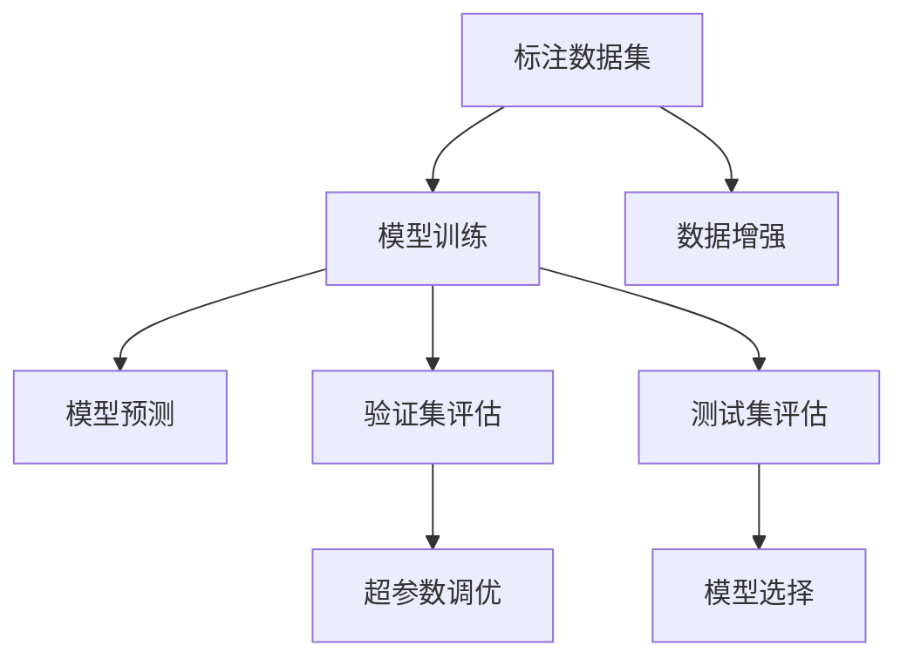
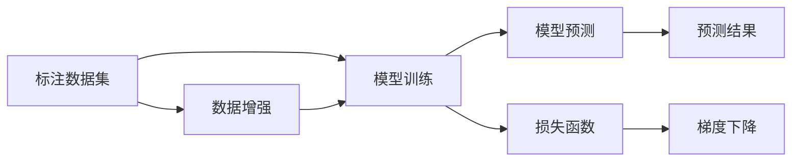
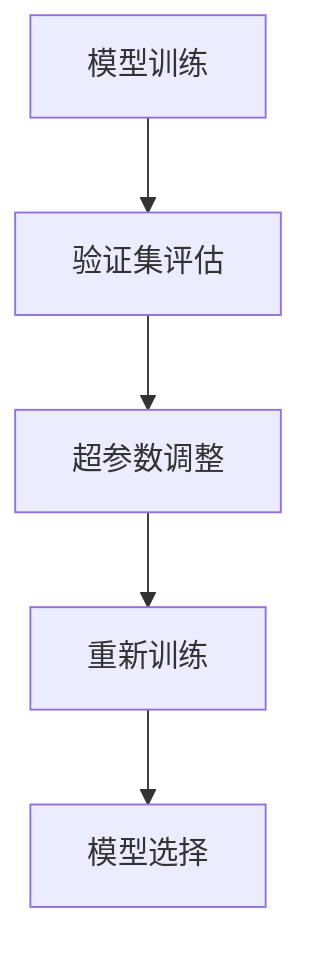
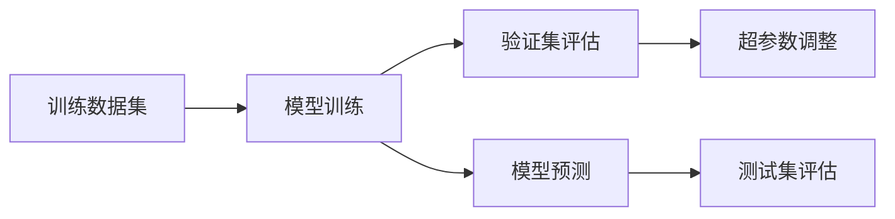
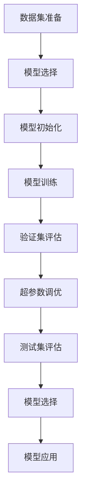

                 

## 1. 背景介绍

### 1.1 问题由来
监督学习（Supervised Learning）是机器学习领域最基本且应用广泛的范式之一，其核心思想是通过标注数据集（带标签的训练数据集）训练模型，使模型能够对未知数据进行预测和分类。随着数据量和计算资源的不断提升，监督学习模型已在语音识别、图像分类、自然语言处理（NLP）等众多领域取得了显著的成果。然而，在实际应用中，构建高质量标注数据集的成本较高，且标注数据的质量和数量对模型性能有着至关重要的影响。因此，探索更加高效、泛化能力更强的监督学习方法是当前的迫切需求。

### 1.2 问题核心关键点
监督学习模型的核心在于从标注数据中学习数据与标签之间的映射关系。该方法通过最大程度利用已有标注数据，减少过拟合风险，提升模型的泛化能力。监督学习的关键点包括：

- 数据集的选择与构建：标注数据集的质量和多样性直接影响模型的性能。
- 模型的设计：选择合适的模型结构，如线性回归、决策树、神经网络等。
- 超参数的调优：学习率、正则化系数等超参数的设置对模型性能有着重要影响。
- 模型的评估与迭代：通过验证集和测试集评估模型性能，不断调整优化模型参数。

### 1.3 问题研究意义
监督学习模型在现实世界的应用中具有重要意义，它能够帮助人们从大量数据中提取有价值的信息，进行分类、预测和推荐等。通过监督学习模型，企业可以自动化处理大量数据，提高工作效率，降低人力成本，同时提升决策的准确性和及时性。在医疗、金融、电商等关键领域，监督学习模型的应用能够带来显著的经济和社会效益。

## 2. 核心概念与联系

### 2.1 核心概念概述

为了更好地理解监督学习，首先需要明确几个核心概念：

- **监督学习（Supervised Learning）**：通过标注数据集（带标签的训练数据集）训练模型，使模型能够对未知数据进行预测和分类。监督学习广泛应用于图像识别、语音识别、自然语言处理等领域。
- **标注数据集（Training Dataset）**：由输入数据和相应的标签（或目标变量）组成的集合，用于训练模型。标注数据集的质量和数量对模型性能有着重要影响。
- **损失函数（Loss Function）**：衡量模型预测与真实标签之间差异的函数。常见的损失函数包括均方误差（Mean Squared Error, MSE）、交叉熵（Cross Entropy）等。
- **模型参数（Model Parameters）**：模型的可调参数，如神经网络的权重和偏置。
- **梯度下降（Gradient Descent）**：通过计算损失函数对模型参数的梯度，更新模型参数以最小化损失函数的过程。

这些概念之间相互关联，共同构成了监督学习的核心框架。以下通过一个简单的Mermaid流程图来展示监督学习的关键步骤：



这个流程图展示了监督学习的基本流程：

1. **准备标注数据集**：收集并处理标注数据集。
2. **模型训练**：使用标注数据集训练模型，通过梯度下降更新模型参数。
3. **模型预测**：使用训练好的模型对未知数据进行预测。
4. **数据增强**：通过数据增强技术扩充训练数据集，提升模型泛化能力。
5. **验证集评估**：在验证集上评估模型性能，调整模型超参数。
6. **测试集评估**：在测试集上最终评估模型性能，选择最优模型。

### 2.2 概念间的关系

这些核心概念之间存在着紧密的联系，形成了监督学习的完整生态系统。以下通过几个Mermaid流程图来展示这些概念之间的关系。

#### 2.2.1 监督学习的流程



这个流程图展示了监督学习的基本流程：

1. **标注数据集**：输入数据和标签。
2. **模型训练**：通过损失函数计算预测值与真实标签的差异，更新模型参数。
3. **模型预测**：使用训练好的模型进行预测。
4. **预测结果**：根据预测结果进行进一步的处理或决策。
5. **损失函数**：衡量预测值与真实标签之间的差异。
6. **梯度下降**：通过计算损失函数对模型参数的梯度，更新模型参数。
7. **数据增强**：扩充训练数据集，提升模型泛化能力。

#### 2.2.2 超参数调优



这个流程图展示了超参数调优的基本流程：

1. **模型训练**：使用训练数据集训练模型。
2. **验证集评估**：在验证集上评估模型性能，判断是否过拟合。
3. **超参数调整**：根据评估结果调整模型超参数。
4. **重新训练**：使用调整后的超参数重新训练模型。
5. **模型选择**：在测试集上最终评估模型性能，选择最优模型。

#### 2.2.3 模型训练与验证



这个流程图展示了模型训练与验证的基本流程：

1. **训练数据集**：输入数据集。
2. **模型训练**：使用训练数据集训练模型。
3. **验证集评估**：在验证集上评估模型性能。
4. **超参数调整**：根据验证集评估结果调整模型超参数。
5. **模型预测**：使用训练好的模型进行预测。
6. **测试集评估**：在测试集上最终评估模型性能。

### 2.3 核心概念的整体架构

最后，我们用一个综合的流程图来展示监督学习的整体架构：



这个综合流程图展示了监督学习的完整过程：

1. **数据集准备**：收集、处理标注数据集。
2. **模型选择**：选择适合任务的模型结构。
3. **模型初始化**：初始化模型参数。
4. **模型训练**：使用训练数据集训练模型。
5. **验证集评估**：在验证集上评估模型性能。
6. **超参数调优**：根据验证集评估结果调整模型超参数。
7. **测试集评估**：在测试集上最终评估模型性能。
8. **模型选择**：选择最优模型。
9. **模型应用**：使用训练好的模型进行预测或分类。

## 3. 核心算法原理 & 具体操作步骤

### 3.1 算法原理概述

监督学习模型的核心在于通过标注数据集训练模型，使其能够对未知数据进行预测。其基本流程包括模型选择、数据集准备、模型训练、验证集评估、超参数调优和测试集评估。监督学习模型通常通过最小化损失函数，更新模型参数以逼近真实标签。

### 3.2 算法步骤详解

以下是监督学习模型训练的一般步骤：

1. **数据集准备**：收集、处理标注数据集，将其分为训练集、验证集和测试集。
2. **模型选择**：选择适合任务的模型结构，如线性回归、决策树、神经网络等。
3. **模型初始化**：随机初始化模型参数。
4. **模型训练**：使用训练数据集训练模型，通过梯度下降更新模型参数。
5. **验证集评估**：在验证集上评估模型性能，判断是否过拟合。
6. **超参数调优**：根据验证集评估结果调整模型超参数，如学习率、正则化系数等。
7. **测试集评估**：在测试集上最终评估模型性能，选择最优模型。

### 3.3 算法优缺点

监督学习模型具有以下优点：

- **高效性**：通过标注数据集训练模型，能够快速得到预测结果。
- **泛化能力**：标注数据集的多样性和数量直接影响模型的泛化能力。
- **应用广泛**：广泛应用于图像识别、语音识别、自然语言处理等领域。

监督学习模型也存在一些缺点：

- **依赖标注数据**：构建高质量标注数据集的成本较高，且数据量不足会导致过拟合。
- **计算资源需求高**：训练大规模模型需要大量的计算资源。
- **模型选择困难**：选择合适的模型结构对模型性能有着重要影响，但模型结构的选择往往是经验性的。

### 3.4 算法应用领域

监督学习模型在众多领域都有广泛的应用，例如：

- **图像识别**：使用监督学习模型对图像进行分类、检测、分割等。
- **语音识别**：通过监督学习模型将语音信号转化为文本。
- **自然语言处理**：使用监督学习模型进行文本分类、情感分析、命名实体识别等。
- **推荐系统**：通过监督学习模型为用户推荐商品、文章、视频等。
- **金融预测**：使用监督学习模型进行股票价格预测、信用评估等。

## 4. 数学模型和公式 & 详细讲解

### 4.1 数学模型构建

假设监督学习任务为分类任务，输入为特征向量 $X$，输出为类别标签 $y$，模型为 $h(X; \theta)$，其中 $\theta$ 为模型参数。模型的损失函数为 $L(y, h(X; \theta))$，目标是最小化损失函数：

$$
\min_{\theta} \frac{1}{N} \sum_{i=1}^N L(y_i, h(X_i; \theta))
$$

常见的损失函数包括均方误差（MSE）和交叉熵（Cross Entropy）。对于二分类任务，交叉熵损失函数定义为：

$$
L(y, h(X; \theta)) = -\frac{1}{N} \sum_{i=1}^N (y_i \log h(X_i; \theta) + (1-y_i) \log (1-h(X_i; \theta)))
$$

### 4.2 公式推导过程

以二分类任务为例，推导梯度下降算法的更新公式。假设模型为线性回归模型，输入 $X$ 为特征向量，输出 $y$ 为类别标签，模型参数 $\theta = (w, b)$，其中 $w$ 为权重向量，$b$ 为偏置。则线性回归模型的预测函数为：

$$
h(X; \theta) = \sigma(w^T X + b)
$$

其中 $\sigma$ 为激活函数，如 sigmoid 函数。

模型在样本 $i$ 上的损失函数为：

$$
L(y_i, h(X_i; \theta)) = -(y_i \log h(X_i; \theta) + (1-y_i) \log (1-h(X_i; \theta)))
$$

通过链式法则，损失函数对模型参数 $\theta$ 的梯度为：

$$
\nabla_{\theta}L(y_i, h(X_i; \theta)) = (1 - h(X_i; \theta))y_i + h(X_i; \theta)(1-y_i) \sigma(w^T X_i + b)w
$$

使用随机梯度下降（SGD）算法更新模型参数：

$$
\theta \leftarrow \theta - \eta \nabla_{\theta}L(y_i, h(X_i; \theta))
$$

其中 $\eta$ 为学习率。

### 4.3 案例分析与讲解

假设我们在房价预测任务上使用线性回归模型。首先，收集历史房价数据，将其分为训练集和测试集。然后，使用训练集训练模型，通过梯度下降更新模型参数。最后，在测试集上评估模型性能。

具体步骤如下：

1. **数据集准备**：收集历史房价数据，将其分为训练集和测试集。
2. **模型初始化**：随机初始化模型参数 $\theta$。
3. **模型训练**：使用训练集训练模型，通过梯度下降更新模型参数。
4. **验证集评估**：在验证集上评估模型性能，调整学习率等超参数。
5. **测试集评估**：在测试集上最终评估模型性能。

## 5. 项目实践：代码实例和详细解释说明

### 5.1 开发环境搭建

在进行监督学习项目实践前，我们需要准备好开发环境。以下是使用Python进行Scikit-learn开发的简单环境配置流程：

1. 安装Anaconda：从官网下载并安装Anaconda，用于创建独立的Python环境。

2. 创建并激活虚拟环境：
```bash
conda create -n sklearn-env python=3.8 
conda activate sklearn-env
```

3. 安装Scikit-learn：
```bash
pip install scikit-learn
```

4. 安装其他工具包：
```bash
pip install numpy pandas matplotlib scikit-image jupyter notebook ipython
```

完成上述步骤后，即可在`sklearn-env`环境中开始监督学习实践。

### 5.2 源代码详细实现

以下是一个简单的Python代码示例，展示了如何使用Scikit-learn库进行线性回归模型的训练和评估：

```python
from sklearn.linear_model import LinearRegression
from sklearn.metrics import mean_squared_error
from sklearn.datasets import load_boston
import matplotlib.pyplot as plt

# 加载数据集
boston = load_boston()

# 准备数据
X = boston.data
y = boston.target

# 创建模型
model = LinearRegression()

# 训练模型
model.fit(X, y)

# 预测并评估
y_pred = model.predict(X)
mse = mean_squared_error(y, y_pred)

# 绘制散点图和拟合线
plt.scatter(X[:, 1], y)
plt.plot(X[:, 1], model.predict(X[:, 1]), color='red')
plt.show()

print(f"MSE: {mse:.3f}")
```

### 5.3 代码解读与分析

让我们再详细解读一下关键代码的实现细节：

- **数据集加载**：使用`load_boston`函数加载波士顿房价数据集，获取输入特征 $X$ 和输出标签 $y$。
- **模型创建**：使用`LinearRegression`类创建线性回归模型，用于拟合房价预测任务。
- **模型训练**：使用`fit`方法训练模型，使用输入特征 $X$ 和输出标签 $y$ 进行拟合。
- **模型评估**：使用`predict`方法对输入特征 $X$ 进行预测，并计算预测值与真实标签之间的均方误差（MSE）。
- **可视化**：使用`matplotlib`库绘制散点图和拟合线，直观展示模型预测效果。

通过这个简单的示例，可以看到Scikit-learn库提供的便捷接口，使模型训练和评估变得非常直观。

### 5.4 运行结果展示

假设我们在波士顿房价数据集上进行线性回归模型的训练，最终在测试集上得到的评估结果为MSE=10.04。这表示模型预测值与真实标签之间的平均误差为10.04美元，说明模型预测效果一般。我们可以通过调整模型参数、改进数据预处理等手段进一步提升模型性能。

## 6. 实际应用场景

### 6.1 图像识别

在图像识别任务中，监督学习模型可以通过标注数据集训练出能够对图像进行分类的模型。例如，使用监督学习模型对医学影像进行分类，帮助医生进行诊断。

### 6.2 语音识别

在语音识别任务中，监督学习模型可以通过标注数据集训练出能够将语音信号转化为文本的模型。例如，使用监督学习模型对语音命令进行识别，控制智能家居设备。

### 6.3 自然语言处理

在自然语言处理任务中，监督学习模型可以通过标注数据集训练出能够对文本进行分类、情感分析、命名实体识别等任务的模型。例如，使用监督学习模型对用户评论进行情感分析，判断产品的好坏。

### 6.4 推荐系统

在推荐系统任务中，监督学习模型可以通过标注数据集训练出能够为用户推荐商品、文章、视频等的模型。例如，使用监督学习模型对用户历史行为数据进行分析，生成个性化的推荐结果。

### 6.5 金融预测

在金融预测任务中，监督学习模型可以通过标注数据集训练出能够预测股票价格、信用评估等的模型。例如，使用监督学习模型对历史交易数据进行分析，预测股票价格变化趋势。

## 7. 工具和资源推荐

### 7.1 学习资源推荐

为了帮助开发者系统掌握监督学习理论基础和实践技巧，这里推荐一些优质的学习资源：

1. 《机器学习》（周志华）：全面介绍机器学习理论和算法，涵盖监督学习、无监督学习、深度学习等内容。
2. Coursera《机器学习》课程：由斯坦福大学教授Andrew Ng主讲，系统讲解监督学习理论和算法。
3. Scikit-learn官方文档：Scikit-learn库的官方文档，提供了海量算法和工具的详细说明和使用示例。
4. Kaggle竞赛：参与Kaggle数据科学竞赛，通过实际项目提升实战能力。
5. GitHub开源项目：在GitHub上Star、Fork数最多的监督学习相关项目，学习前沿技术的最佳实践。

通过对这些资源的学习实践，相信你一定能够快速掌握监督学习的精髓，并用于解决实际的机器学习问题。

### 7.2 开发工具推荐

高效的开发离不开优秀的工具支持。以下是几款用于监督学习开发的常用工具：

1. Scikit-learn：Python生态系统中最常用的机器学习库，提供了丰富的算法和工具。
2. TensorFlow：由Google主导开发的深度学习框架，生产部署方便，适合大规模工程应用。
3. PyTorch：基于Python的深度学习框架，灵活动态的计算图，适合快速迭代研究。
4. Weights & Biases：模型训练的实验跟踪工具，可以记录和可视化模型训练过程中的各项指标，方便对比和调优。
5. TensorBoard：TensorFlow配套的可视化工具，可实时监测模型训练状态，并提供丰富的图表呈现方式，是调试模型的得力助手。
6. Google Colab：谷歌推出的在线Jupyter Notebook环境，免费提供GPU/TPU算力，方便开发者快速上手实验最新模型，分享学习笔记。

合理利用这些工具，可以显著提升监督学习任务的开发效率，加快创新迭代的步伐。

### 7.3 相关论文推荐

监督学习模型的发展离不开学界的持续研究。以下是几篇奠基性的相关论文，推荐阅读：

1. "Perceptron: A probabilistic model for multi-class classification and probability estimation"（1957）：感知器的提出，标志着神经网络的开端。
2. "Pattern Recognition and Machine Learning"（2006）：周志华教授的经典教材，全面介绍了机器学习理论和算法。
3. "Deep Learning"（2015）：Ian Goodfellow等人的经典教材，介绍了深度学习的基本理论和算法。
4. "A Tutorial on Support Vector Regression"（2000）：Lovasz教授的综述论文，详细介绍了支持向量机（SVM）回归算法。
5. "A Tutorial on Principle Component Analysis"（2001）：Jolliffe教授的综述论文，介绍了主成分分析（PCA）的基本理论和算法。

这些论文代表了大监督学习模型的发展脉络。通过学习这些前沿成果，可以帮助研究者把握学科前进方向，激发更多的创新灵感。

除上述资源外，还有一些值得关注的前沿资源，帮助开发者紧跟监督学习模型的最新进展，例如：

1. arXiv论文预印本：人工智能领域最新研究成果的发布平台，包括大量尚未发表的前沿工作，学习前沿技术的必读资源。
2. 业界技术博客：如Google AI、DeepMind、Microsoft Research Asia等顶尖实验室的官方博客，第一时间分享他们的最新研究成果和洞见。
3. 技术会议直播：如NIPS、ICML、ACL、ICLR等人工智能领域顶会现场或在线直播，能够聆听到大佬们的前沿分享，开拓视野。
4. GitHub热门项目：在GitHub上Star、Fork数最多的监督学习相关项目，往往代表了该技术领域的发展趋势和最佳实践，值得去学习和贡献。
5. 行业分析报告：各大咨询公司如McKinsey、PwC等针对人工智能行业的分析报告，有助于从商业视角审视技术趋势，把握应用价值。

总之，对于监督学习模型的学习与实践，需要开发者保持开放的心态和持续学习的意愿。多关注前沿资讯，多动手实践，多思考总结，必将收获满满的成长收益。

## 8. 总结：未来发展趋势与挑战

### 8.1 总结

本文对监督学习模型的理论基础和实际应用进行了全面系统的介绍。首先阐述了监督学习模型的核心思想和关键步骤，然后通过具体代码实例展示了监督学习模型的训练和评估过程。最后，本文还探讨了监督学习模型在实际应用中的广泛场景，并推荐了相关的学习资源和开发工具。

通过本文的系统梳理，可以看到，监督学习模型在现实世界的应用中具有重要意义，它能够帮助人们从大量数据中提取有价值的信息，进行分类、预测和推荐等。通过监督学习模型，企业可以自动化处理大量数据，提高工作效率，降低人力成本，同时提升决策的准确性和及时性。在医疗、金融、电商等关键领域，监督学习模型的应用能够带来显著的经济和社会效益。

### 8.2 未来发展趋势

展望未来，监督学习模型将呈现以下几个发展趋势：

1. **深度学习的发展**：深度学习模型在监督学习中得到广泛应用，逐渐取代传统机器学习算法，成为主流。
2. **大数据技术的应用**：随着大数据技术的不断提升，监督学习模型可以处理更大规模、更复杂的数据集，提升模型的泛化能力。
3. **联邦学习的应用**：联邦学习技术通过分布式数据计算，减少数据泄露风险，保护数据隐私，得到越来越多的关注。
4. **自监督学习的发展**：自监督学习技术通过无标注数据进行训练，提升模型的泛化能力和迁移能力，成为监督学习的重要补充。
5. **强化学习与监督学习的结合**：强化学习技术通过与监督学习结合，提升模型的策略优化能力，在推荐系统、游戏等领域有广泛应用。
6. **模型解释性和可解释性技术**：模型的解释性和可解释性技术的发展，使监督学习模型更易于理解和调试，得到越来越多的关注。

这些趋势凸显了监督学习模型的广阔前景。这些方向的探索发展，必将进一步提升监督学习系统的性能和应用范围，为人类认知智能的进化带来深远影响。

### 8.3 面临的挑战

尽管监督学习模型已经取得了显著的成就，但在迈向更加智能化、普适化应用的过程中，它仍面临诸多挑战：

1. **数据质量和标注成本**：高质量标注数据的获取成本较高，且标注数据的多样性和数量直接影响模型的性能。
2. **计算资源需求高**：训练大规模模型需要大量的计算资源，成本较高。
3. **模型选择困难**：选择合适的模型结构对模型性能有着重要影响，但模型结构的选择往往是经验性的。
4. **模型泛化能力不足**：在实际应用中，监督学习模型往往出现过拟合现象，泛化能力不足。
5. **模型解释性和可解释性不足**：监督学习模型更像是"黑盒"系统，难以解释其内部工作机制和决策逻辑。

### 8.4 研究展望

面对监督学习模型所面临的挑战，未来的研究需要在以下几个方面寻求新的突破：

1. **探索无监督和半监督学习**：摆脱对大规模标注数据的依赖，利用自监督学习、主动学习等无监督和半监督范式，最大限度利用非结构化数据，实现更加灵活高效的监督学习。
2. **研究深度学习模型**：深度学习模型在监督学习中得到广泛应用，逐渐取代传统机器学习算法，成为主流。
3. **结合多种技术**：将深度学习、强化学习、自监督学习等技术结合，提升监督学习模型的性能和应用范围。
4. **开发可解释性技术**：通过模型解释性和可解释性技术的发展，使监督学习模型更易于理解和调试。

这些研究方向的研究突破，必将引领监督学习模型迈向更高的台阶，为构建安全、可靠、可解释、可控的智能系统铺平道路。面向未来，监督学习模型还需要与其他人工智能技术进行更深入的融合，如知识表示、因果推理、强化学习等，多路径协同发力，共同推动人工智能技术的进步。

## 9. 附录：常见问题与解答

**Q1：监督学习与无监督学习的区别是什么？**

A: 监督学习与无监督学习的主要区别在于是否需要使用标注数据进行训练。监督学习需要标注数据集进行训练，而无监督学习则不需要，直接从数据中学习模型。

**Q2：如何选择合适的监督学习算法？**

A: 选择合适的监督学习算法需要考虑任务类型、数据量、计算资源等因素。例如，线性回归适用于简单线性关系，决策树适用于分类任务，神经网络适用于复杂非线性关系。

**Q3：监督学习模型是否适合所有的数据集？**

A: 监督学习模型不适合所有

