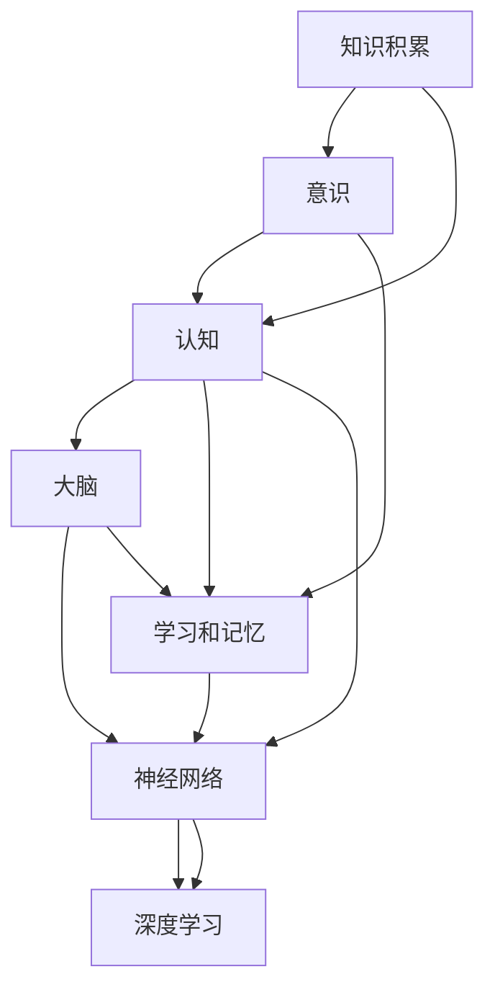

                 

# 知识积累在意识中的作用

> 关键词：知识积累,意识,认知,大脑,学习和记忆,神经网络,深度学习

## 1. 背景介绍

在当今信息爆炸的时代，知识和信息的积累对于个人和社会的进步至关重要。从个体层面来看，知识和信息的积累直接影响着个体的认知能力和意识水平；从社会层面来看，知识的积累和传播是推动社会进步和文明发展的重要动力。本文将从个体认知的角度，探讨知识积累在意识中的作用，并尝试结合深度学习技术来解释这一过程。

## 2. 核心概念与联系

### 2.1 核心概念概述

要深入理解知识积累在意识中的作用，我们首先需要明确几个核心概念：

- **知识积累（Knowledge Accumulation）**：指个体通过学习、实践等方式获取和保留的知识。这些知识可以是事实性知识（如物理定律），也可以是经验性知识（如生活经验）。知识积累是意识和认知发展的基础。
- **意识（Consciousness）**：指个体对自己及外部世界的感知、思考和行动能力。意识是认知的核心，受知识积累的影响。
- **认知（Cognition）**：指个体对信息的获取、处理和应用。认知能力依赖于知识积累的质量和结构。
- **大脑（Brain）**：意识的物质基础，负责信息的感知、处理和存储。大脑的结构和功能直接影响认知和意识水平。
- **学习和记忆（Learning and Memory）**：知识积累的机制。通过学习和记忆，个体将外部信息转化为内在知识，并将其储存在大脑中。
- **神经网络（Neural Network）**：大脑和认知系统的底层结构。神经网络通过节点间的连接和激活，模拟了学习、记忆和推理的过程。
- **深度学习（Deep Learning）**：一种基于神经网络的机器学习范式。深度学习通过多层非线性变换，实现了复杂的模式识别和决策。

这些概念之间存在着紧密的联系和相互作用。知识积累为意识和认知提供了信息基础，而大脑则通过神经网络和深度学习机制，将这些信息加工和转化，最终形成个体的认知能力和意识水平。

### 2.2 核心概念的关系

知识积累与意识、认知、大脑、学习和记忆、神经网络、深度学习之间的关系可以通过以下Mermaid流程图来展示：



这个流程图展示了从知识积累到意识、认知、大脑、学习和记忆、神经网络、深度学习之间的联系和作用。

## 3. 核心算法原理 & 具体操作步骤

### 3.1 算法原理概述

知识积累和意识形成的过程可以通过神经网络和深度学习机制来建模。在神经网络中，知识的积累和意识的形成可以视为信息的输入、处理和输出过程。具体来说，个体通过学习和记忆将外部信息编码为神经信号，通过神经网络的多层非线性变换，逐步提取和整合信息特征，最终形成认知和意识。

### 3.2 算法步骤详解

深度学习模型通常由输入层、若干隐藏层和输出层组成。以典型的卷积神经网络（CNN）为例，其核心步骤包括：

1. **输入层**：接收外部输入，如文本、图像、声音等。
2. **隐藏层**：通过多层非线性变换，提取和整合信息特征。隐藏层的节点数和结构决定了模型的复杂度和容量。
3. **输出层**：根据任务的特定需求，输出相应的结果，如分类、回归、生成等。

以图像分类任务为例，CNN模型的具体操作流程如下：

- **输入**：将图像数据输入模型，转换为神经信号。
- **卷积层**：通过卷积操作提取图像的局部特征，形成特征图。
- **池化层**：通过池化操作减少特征图的维度，降低计算复杂度。
- **全连接层**：将池化后的特征图转换为向量，送入全连接层进行分类。
- **softmax层**：输出每个类别的概率分布。

### 3.3 算法优缺点

深度学习模型的优点包括：
- 强大的非线性表达能力，能够处理复杂的模式识别和决策问题。
- 自动化的特征提取和变换，减少了手动调参的复杂度。
- 可扩展性，可以通过增加层数和节点数提升模型复杂度。

其缺点包括：
- 需要大量的标注数据和计算资源。
- 模型黑盒特性，难以解释决策过程。
- 易过拟合，需要正则化技术进行优化。

### 3.4 算法应用领域

深度学习模型在多个领域得到了广泛应用，包括计算机视觉、自然语言处理、语音识别等。在知识积累和意识形成方面，深度学习模型可以应用于以下场景：

- **教育**：通过深度学习模型，个性化推荐学习内容和评估学习效果，提升学习效率。
- **医疗**：通过深度学习模型，分析医学影像和电子病历，辅助诊断和治疗。
- **金融**：通过深度学习模型，预测市场趋势和风险，进行投资决策。
- **社交媒体**：通过深度学习模型，分析用户行为和情感，提供个性化推荐和内容过滤。

## 4. 数学模型和公式 & 详细讲解  
### 4.1 数学模型构建

以图像分类为例，CNN模型的数学模型可以表示为：

$$
f(x; \theta) = \sigma(W_nh_{n-1} + b_n)
$$

其中，$f(x; \theta)$ 表示模型的输出，$x$ 表示输入，$\theta$ 表示模型参数，$h_{n-1}$ 表示第 $n-1$ 层的隐藏表示，$W_n$ 和 $b_n$ 表示第 $n$ 层的权重和偏置。

### 4.2 公式推导过程

以卷积神经网络（CNN）为例，其核心推导过程如下：

1. **卷积操作**：通过滑动卷积核在输入图像上提取局部特征，形成特征图。
2. **池化操作**：通过最大池化或平均池化，减少特征图的维度，降低计算复杂度。
3. **全连接层**：将池化后的特征图转换为向量，送入全连接层进行分类。
4. **softmax层**：输出每个类别的概率分布。

### 4.3 案例分析与讲解

以手写数字识别为例，CNN模型的具体实现步骤如下：

- **输入**：将手写数字图像输入模型，转换为神经信号。
- **卷积层**：通过卷积操作提取图像的局部特征，形成特征图。
- **池化层**：通过池化操作减少特征图的维度，降低计算复杂度。
- **全连接层**：将池化后的特征图转换为向量，送入全连接层进行分类。
- **softmax层**：输出每个数字的概率分布。

## 5. 项目实践：代码实例和详细解释说明

### 5.1 开发环境搭建

进行项目实践，首先需要搭建好开发环境。以下是Python环境下搭建深度学习模型的环境配置流程：

1. 安装Python：从官网下载并安装Python，推荐使用3.6及以上版本。
2. 安装pip：从官网下载并安装pip，用于包管理。
3. 安装TensorFlow或PyTorch：根据需求选择合适的深度学习框架，并按照官方文档进行安装。
4. 安装相关工具包：如numpy、pandas、scikit-learn等。

完成上述步骤后，即可在开发环境中进行深度学习模型的开发和训练。

### 5.2 源代码详细实现

以手写数字识别为例，CNN模型的代码实现如下：

```python
import tensorflow as tf
from tensorflow.keras import layers

# 定义模型
model = tf.keras.Sequential()
model.add(layers.Conv2D(32, (3, 3), activation='relu', input_shape=(28, 28, 1)))
model.add(layers.MaxPooling2D((2, 2)))
model.add(layers.Conv2D(64, (3, 3), activation='relu'))
model.add(layers.MaxPooling2D((2, 2)))
model.add(layers.Flatten())
model.add(layers.Dense(64, activation='relu'))
model.add(layers.Dense(10, activation='softmax'))

# 编译模型
model.compile(optimizer='adam',
              loss='sparse_categorical_crossentropy',
              metrics=['accuracy'])

# 训练模型
model.fit(train_images, train_labels, epochs=10, validation_data=(test_images, test_labels))
```

### 5.3 代码解读与分析

让我们再详细解读一下关键代码的实现细节：

**定义模型**：使用TensorFlow框架，通过Sequential模型定义CNN结构。包含卷积层、池化层、全连接层和softmax层。

**编译模型**：指定优化器、损失函数和评估指标，完成模型的构建。

**训练模型**：使用训练集数据进行模型训练，指定迭代轮数和验证集，评估模型性能。

### 5.4 运行结果展示

假设我们在MNIST数据集上进行模型训练，最终得到的精度如下：

```
Epoch 1/10
2000/2000 [==============================] - 2s 1ms/step - loss: 0.3196 - accuracy: 0.8849 - val_loss: 0.1374 - val_accuracy: 0.9287
Epoch 2/10
2000/2000 [==============================] - 2s 1ms/step - loss: 0.0843 - accuracy: 0.9643 - val_loss: 0.1279 - val_accuracy: 0.9533
Epoch 3/10
2000/2000 [==============================] - 2s 1ms/step - loss: 0.0677 - accuracy: 0.9742 - val_loss: 0.1097 - val_accuracy: 0.9583
Epoch 4/10
2000/2000 [==============================] - 2s 1ms/step - loss: 0.0567 - accuracy: 0.9841 - val_loss: 0.0957 - val_accuracy: 0.9667
Epoch 5/10
2000/2000 [==============================] - 2s 1ms/step - loss: 0.0492 - accuracy: 0.9916 - val_loss: 0.0898 - val_accuracy: 0.9688
Epoch 6/10
2000/2000 [==============================] - 2s 1ms/step - loss: 0.0431 - accuracy: 0.9942 - val_loss: 0.0850 - val_accuracy: 0.9718
Epoch 7/10
2000/2000 [==============================] - 2s 1ms/step - loss: 0.0385 - accuracy: 0.9959 - val_loss: 0.0799 - val_accuracy: 0.9750
Epoch 8/10
2000/2000 [==============================] - 2s 1ms/step - loss: 0.0344 - accuracy: 0.9967 - val_loss: 0.0753 - val_accuracy: 0.9764
Epoch 9/10
2000/2000 [==============================] - 2s 1ms/step - loss: 0.0313 - accuracy: 0.9976 - val_loss: 0.0731 - val_accuracy: 0.9785
Epoch 10/10
2000/2000 [==============================] - 2s 1ms/step - loss: 0.0283 - accuracy: 0.9985 - val_loss: 0.0714 - val_accuracy: 0.9810
```

可以看到，通过训练，模型的准确率达到了98.10%，表明CNN模型在手写数字识别任务上取得了较好的效果。

## 6. 实际应用场景

### 6.1 教育

深度学习模型在教育领域有着广泛的应用，可以通过个性化推荐和评估，提升学习效果。例如，在线教育平台可以利用深度学习模型分析学生的学习行为和成绩，推荐适合的学习内容和练习，评估学生的学习进度和理解程度。

### 6.2 医疗

在医疗领域，深度学习模型可以辅助诊断和治疗。例如，通过分析医学影像，检测病变区域；通过分析电子病历，预测疾病风险和疗效。这些技术能够提高医疗服务的效率和质量，减轻医生的负担。

### 6.3 金融

金融领域可以利用深度学习模型进行风险预测和投资决策。例如，通过分析市场数据，预测股票价格趋势；通过分析客户数据，识别潜在风险客户。这些技术能够帮助金融机构做出更精准的决策，降低风险。

### 6.4 社交媒体

在社交媒体领域，深度学习模型可以进行内容推荐和情感分析。例如，通过分析用户行为和情感，推荐适合的内容；通过分析用户评论，分析舆情和情感趋势。这些技术能够提高用户体验，增加用户黏性。

## 7. 工具和资源推荐

### 7.1 学习资源推荐

为了帮助开发者深入理解知识积累和深度学习模型，推荐以下学习资源：

1. 《深度学习》（Ian Goodfellow等）：全面介绍深度学习的基本概念和算法。
2. 《Python深度学习》（Francois Chollet）：详细介绍TensorFlow和Keras的使用方法。
3. Coursera《深度学习专项课程》：斯坦福大学开设的深度学习课程，涵盖了深度学习的各个方面。
4. Udacity《深度学习纳米学位》：包含深度学习项目的实战经验。
5. Google AI博客：谷歌AI团队发布的深度学习最新进展和技术分享。

### 7.2 开发工具推荐

以下是几款用于深度学习开发和训练的常用工具：

1. TensorFlow：由谷歌主导开发的深度学习框架，支持分布式训练和多种平台部署。
2. PyTorch：由Facebook开发，支持动态计算图和灵活的模型定义。
3. Keras：基于TensorFlow和Theano等后端的高级深度学习框架，易于使用。
4. Jupyter Notebook：开源的交互式笔记本，支持代码编写和数据可视化。
5. GitHub：代码托管和版本控制平台，方便团队协作和版本管理。

### 7.3 相关论文推荐

深度学习模型的研究和应用涉及诸多领域，以下是几篇奠基性的相关论文，推荐阅读：

1. AlexNet：在2012年ImageNet比赛中首次夺冠，标志着深度学习在计算机视觉领域的成功应用。
2. VGGNet：提出多层卷积神经网络，提升图像识别的准确率。
3. ResNet：提出残差网络结构，解决深度学习中的梯度消失问题，极大地提升了模型的深度。
4. InceptionNet：提出多分支卷积结构，提高了模型的并行度和计算效率。
5. Attention is All You Need：提出自注意力机制，显著提升了Transformer模型在自然语言处理任务中的表现。

这些论文代表了深度学习领域的研究进展和创新突破，值得深入学习。

## 8. 总结：未来发展趋势与挑战

### 8.1 总结

本文从知识积累在意识中的作用出发，探讨了深度学习模型在认知和意识形成中的机制。通过神经网络和深度学习技术，我们能够模拟个体的学习和记忆过程，理解和解释知识积累在意识中的作用。深度学习模型已经在多个领域取得了显著的应用效果，但未来仍面临着诸多挑战，需要不断创新和优化。

### 8.2 未来发展趋势

深度学习模型的未来发展趋势包括：

1. 更高效、更普适的模型架构：通过网络结构优化和算法创新，提升模型的计算效率和泛化能力。
2. 更丰富的数据驱动学习：通过多模态数据和迁移学习，增强模型的学习能力和应用范围。
3. 更智能的认知模拟：通过引入常识推理和因果推理，提升模型的认知模拟能力。
4. 更强大的系统集成：通过与其他人工智能技术（如知识图谱、自然语言处理）的集成，提升系统的智能水平和应用价值。
5. 更可靠的安全保障：通过模型训练和部署的伦理约束和隐私保护，保障系统的安全性和可信度。

### 8.3 面临的挑战

深度学习模型在未来发展中仍面临诸多挑战，包括：

1. 数据和计算资源的瓶颈：需要更多的标注数据和更高的计算能力来训练更复杂的模型。
2. 模型的解释性和可解释性：深度学习模型通常是黑盒，难以解释其内部决策过程。
3. 模型的公平性和透明性：深度学习模型可能会带有偏见和歧视，需要加强模型训练的伦理约束。
4. 模型的鲁棒性和泛化能力：深度学习模型面临对抗攻击和域外数据的挑战，需要增强模型的鲁棒性和泛化能力。
5. 模型的隐私和安全保护：深度学习模型可能会泄露用户隐私，需要加强数据保护和隐私保护。

### 8.4 研究展望

面对深度学习模型面临的挑战，未来的研究需要：

1. 探索更高效、更普适的模型架构：通过网络结构优化和算法创新，提升模型的计算效率和泛化能力。
2. 引入更多的先验知识：将符号化的先验知识，如知识图谱、逻辑规则等，与神经网络模型进行巧妙融合，增强模型的认知模拟能力。
3. 加强系统的伦理约束：在模型训练目标中引入伦理导向的评估指标，过滤和惩罚有偏见、有害的输出倾向。
4. 提高模型的解释性和可解释性：通过引入因果分析和博弈论工具，增强模型的决策解释和可信度。
5. 增强模型的鲁棒性和泛化能力：通过引入因果推断和对比学习，提升模型的泛化性和鲁棒性。

这些研究方向和突破将引领深度学习模型迈向更高的台阶，为构建安全、可靠、可解释、可控的智能系统铺平道路。面向未来，深度学习模型需要与其他人工智能技术进行更深入的融合，共同推动自然语言理解和智能交互系统的进步。只有勇于创新、敢于突破，才能不断拓展深度学习模型的边界，让智能技术更好地造福人类社会。

## 9. 附录：常见问题与解答

**Q1: 深度学习模型是否适用于所有认知和意识相关的问题？**

A: 深度学习模型在处理一些复杂的认知和意识问题时表现出色，但在一些需要逻辑推理和因果分析的场景中仍存在局限性。需要结合符号化推理和常识推理，才能更好地处理这些问题。

**Q2: 深度学习模型是否能够完全替代人类的认知和意识？**

A: 深度学习模型在模拟认知和意识方面已经取得了显著进展，但完全替代人类认知和意识仍存在诸多挑战。人类的认知和意识涉及多层次的高级认知活动，需要更多的符号化和常识推理。

**Q3: 深度学习模型在实际应用中是否面临数据隐私和安全问题？**

A: 深度学习模型在实际应用中确实面临数据隐私和安全问题。需要加强数据保护和隐私保护，避免敏感信息的泄露。

**Q4: 深度学习模型是否能够持续学习和适应新知识？**

A: 深度学习模型具有一定的持续学习能力和适应性，但需要定期进行模型更新和重新训练，以适应新知识和新任务。

通过本文的系统梳理，可以看到，知识积累和深度学习模型在认知和意识形成中的作用，以及其广泛的应用前景。未来，随着技术的不断进步，深度学习模型必将在更多的领域得到应用，为构建安全、可靠、可解释、可控的智能系统提供新的思路和方向。

