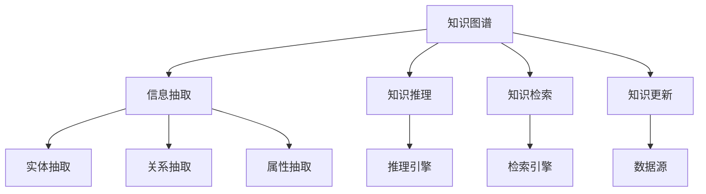
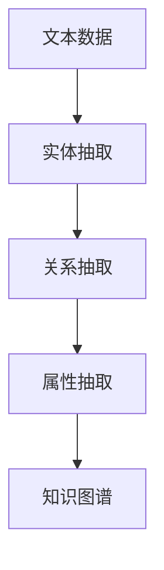
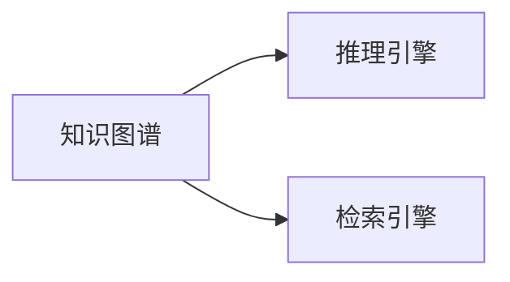
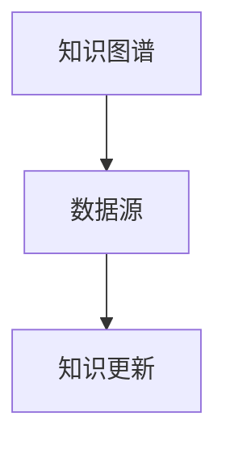
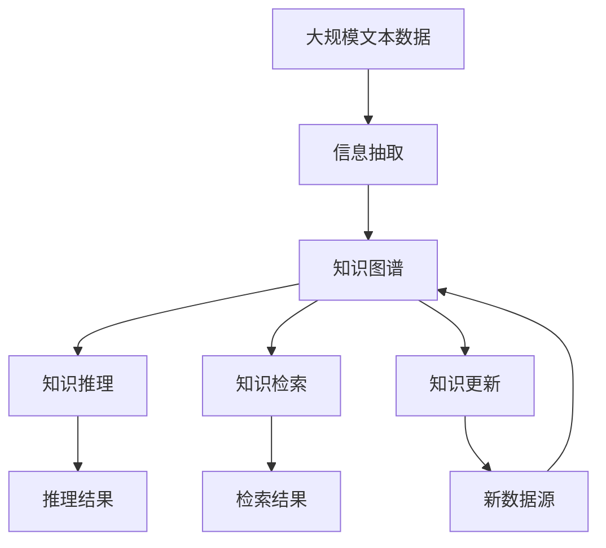

                 

# 知识积累在意识管理中的角色

> 关键词：知识积累,意识管理,人工智能,信息处理,深度学习,知识图谱

## 1. 背景介绍

### 1.1 问题由来
在当前信息爆炸的时代，人们每天接触大量的信息，然而这些信息往往具有高度的随机性和非结构性，难以直接应用于决策和问题解决。为了有效管理和利用这些信息，提高决策的科学性和准确性，我们提出了知识积累在意识管理中的角色，以实现将信息转化为结构化、可查询的知识，并用于辅助决策和问题解决。

### 1.2 问题核心关键点
知识积累在意识管理中的角色，核心在于将大量无序的信息转化为结构化的知识，并将这些知识应用于辅助决策和问题解决。其关键点包括：
- 知识抽取：从非结构化信息中抽取关键实体、关系和属性，构建知识图谱。
- 知识推理：基于知识图谱进行逻辑推理和关联计算，得到新的知识和结论。
- 知识检索：根据用户查询，从知识图谱中检索出相关知识，进行展示和辅助决策。
- 知识更新：动态更新知识图谱，保持其时效性和准确性。

### 1.3 问题研究意义
知识积累在意识管理中的角色，对于提升信息处理效率、辅助决策支持、优化决策过程具有重要意义。

- 提升信息处理效率：将无序信息转化为结构化知识，便于检索和应用。
- 辅助决策支持：基于知识图谱进行推理和关联计算，得到辅助决策的信息。
- 优化决策过程：通过结构化知识辅助决策，减少决策过程中的偏见和错误。

## 2. 核心概念与联系

### 2.1 核心概念概述

为更好地理解知识积累在意识管理中的角色，本节将介绍几个密切相关的核心概念：

- 知识图谱(Knowledge Graph)：一种结构化的知识表示方法，用于描述实体、属性和关系，并对其进行关联计算和推理。
- 信息抽取(Information Extraction)：从非结构化信息中抽取出实体、属性和关系，并构建结构化的知识图谱。
- 知识推理(Knowledge Reasoning)：基于知识图谱进行逻辑推理和关联计算，得到新的知识和结论。
- 知识检索(Knowledge Retrieval)：根据用户查询，从知识图谱中检索出相关知识，进行展示和辅助决策。
- 知识更新(Knowledge Updating)：动态更新知识图谱，保持其时效性和准确性。

这些核心概念之间的逻辑关系可以通过以下Mermaid流程图来展示：



这个流程图展示了几大核心概念及其之间的关系：

1. 知识图谱由信息抽取构建，并提供知识推理、检索和更新的基础。
2. 信息抽取从非结构化信息中抽取出实体、关系和属性，形成知识图谱。
3. 知识推理基于知识图谱进行逻辑推理和关联计算，得到新的知识和结论。
4. 知识检索根据用户查询，从知识图谱中检索出相关知识，进行展示和辅助决策。
5. 知识更新动态更新知识图谱，保持其时效性和准确性。

这些核心概念共同构成了知识积累在意识管理中的角色的完整生态系统，使其能够在各种场景下发挥作用。通过理解这些核心概念，我们可以更好地把握知识积累的角色和工作原理。

### 2.2 概念间的关系

这些核心概念之间存在着紧密的联系，形成了知识积累在意识管理中的角色的完整生态系统。下面我通过几个Mermaid流程图来展示这些概念之间的关系。

#### 2.2.1 知识图谱构建流程



这个流程图展示了从文本数据到知识图谱构建的流程，其中实体抽取、关系抽取和属性抽取是构建知识图谱的关键步骤。

#### 2.2.2 知识推理与检索关系



这个流程图展示了知识图谱与推理引擎、检索引擎的关系，推理引擎基于知识图谱进行推理计算，检索引擎根据用户查询从知识图谱中检索出相关知识。

#### 2.2.3 知识更新与数据源关系



这个流程图展示了知识图谱与数据源、知识更新的关系，知识图谱通过与数据源的动态更新保持其时效性和准确性。

### 2.3 核心概念的整体架构

最后，我们用一个综合的流程图来展示这些核心概念在大规模信息管理中的整体架构：



这个综合流程图展示了从大规模文本数据到知识图谱构建，再到推理、检索和更新的完整过程。知识图谱基于信息抽取构建，并提供推理、检索和更新的基础。推理引擎基于知识图谱进行逻辑推理和关联计算，检索引擎根据用户查询从知识图谱中检索出相关知识。知识图谱通过与数据源的动态更新保持其时效性和准确性。

## 3. 核心算法原理 & 具体操作步骤

### 3.1 算法原理概述

知识积累在意识管理中的角色，本质上是一种基于知识图谱的信息处理和推理过程。其核心思想是：将大量无序的信息转化为结构化的知识，并基于这些知识进行逻辑推理和关联计算，辅助决策和问题解决。

形式化地，假设信息抽取生成的知识图谱为 $G=(E,R)$，其中 $E$ 为实体集，$R$ 为关系集。假设推理目标为 $T$，推理函数为 $\phi$，则推理过程可以表示为：

$$
\phi(T,G)
$$

其中，$\phi$ 将推理目标 $T$ 和知识图谱 $G$ 映射为推理结果 $R_{\phi}$，例如 $R_{\phi}$ 可能是一个新的推理事实或一组相关的推理结果。

### 3.2 算法步骤详解

知识积累在意识管理中的角色，一般包括以下几个关键步骤：

**Step 1: 数据预处理**
- 对大规模文本数据进行清洗和预处理，去除噪音和无关信息，提高信息质量。

**Step 2: 信息抽取**
- 使用自然语言处理技术，从清洗后的文本中抽取出实体、关系和属性，构建知识图谱。

**Step 3: 知识推理**
- 使用推理引擎，基于知识图谱进行逻辑推理和关联计算，得到新的知识和结论。

**Step 4: 知识检索**
- 根据用户查询，从知识图谱中检索出相关知识，进行展示和辅助决策。

**Step 5: 知识更新**
- 根据最新的数据源，动态更新知识图谱，保持其时效性和准确性。

**Step 6: 结果展示**
- 将推理结果和检索结果展示给用户，辅助决策和问题解决。

以上是知识积累在意识管理中的角色的一般流程。在实际应用中，还需要针对具体任务进行优化设计，如改进信息抽取算法、优化推理引擎、提升检索效率等，以进一步提升系统性能。

### 3.3 算法优缺点

知识积累在意识管理中的角色，具有以下优点：
1. 结构化处理：将大量无序信息转化为结构化的知识，便于检索和应用。
2. 辅助决策：基于知识图谱进行推理和关联计算，得到辅助决策的信息。
3. 优化决策过程：通过结构化知识辅助决策，减少决策过程中的偏见和错误。
4. 可扩展性强：知识图谱可以通过动态更新保持其时效性和准确性，适用于动态变化的信息环境。

同时，该方法也存在一些局限性：
1. 依赖高质量数据：信息抽取的准确性依赖于文本数据的质量，高质量标注数据的获取成本较高。
2. 推理复杂度高：推理引擎需要较高的计算资源，对于复杂推理任务可能较慢。
3. 更新难度大：动态更新知识图谱需要耗费大量时间和资源，维护成本较高。
4. 数据依赖性强：依赖于数据源的动态更新，数据缺失或错误可能导致知识图谱不准确。

尽管存在这些局限性，但就目前而言，知识积累在意识管理中的角色仍是大规模信息管理和决策支持的重要范式。未来相关研究的重点在于如何进一步降低数据依赖，提高推理效率，优化知识图谱更新机制，同时兼顾可解释性和伦理安全性等因素。

### 3.4 算法应用领域

知识积累在意识管理中的角色，已在多个领域得到应用，例如：

- 医疗信息管理：构建医疗知识图谱，辅助医疗决策和治疗方案制定。
- 金融风险管理：构建金融知识图谱，辅助金融决策和风险预警。
- 城市管理：构建城市知识图谱，辅助城市规划和智慧城市建设。
- 教育管理：构建教育知识图谱，辅助教学资源推荐和学习路径规划。
- 公共安全：构建公共安全知识图谱，辅助应急响应和公共安全管理。

除了上述这些经典应用外，知识积累在意识管理中的角色还被创新性地应用到更多场景中，如智能客服、智能推荐、智能导航等，为大规模信息管理和决策支持提供了新的解决方案。

## 4. 数学模型和公式 & 详细讲解 & 举例说明

### 4.1 数学模型构建

本节将使用数学语言对知识积累在意识管理中的角色的推理过程进行更加严格的刻画。

假设推理目标 $T$ 为一个三元组形式 $(s,p,o)$，表示实体 $s$ 与 $o$ 通过关系 $p$ 连接。例如，“张三”与“李四”通过“是朋友”关系连接。假设知识图谱 $G=(E,R)$ 中存在实体 $s_1$ 与 $o_1$ 通过关系 $p_1$ 连接，且实体 $s_2$ 与 $o_2$ 通过关系 $p_2$ 连接，推理引擎 $\phi$ 能够基于知识图谱 $G$ 推导出一个新的三元组 $(s_1,p_1,p_2)$，表示 $s_1$ 与 $o_1$ 通过关系 $p_1$ 连接，且 $o_1$ 与 $o_2$ 通过关系 $p_2$ 连接。

### 4.2 公式推导过程

以下我们以医疗知识图谱为例，推导推理过程的数学公式。

假设知识图谱 $G=(E,R)$ 中存在以下实体和关系：
- 实体 $E_1$: {"张三", "李四"}
- 关系 $R_1$: {"是朋友", "是医生", "是病人"}
- 实体 $E_2$: {"王五", "赵六"}
- 关系 $R_2$: {"是医生"}

推理目标 $T$ 为：

- “张三”通过“是医生”关系与“王五”连接，且“王五”通过“是病人”关系与“赵六”连接，则“张三”通过“是朋友”关系与“赵六”连接。

推理过程可以表示为：

$$
\phi(T,G) = \{(s_1,p_1,p_2)|(s_1,p_1,p_2) \in R_G, (s_2,p_2,p_3) \in R_G\}
$$

其中，$R_G$ 为知识图谱 $G$ 中的所有关系。

### 4.3 案例分析与讲解

我们以构建医疗知识图谱为例，说明知识积累在意识管理中的角色的实际应用。

假设医院有如下病历数据：
- 张三：诊断为肺炎，医生为王五。
- 李四：诊断为心肌炎，医生为王五。
- 王五：为医生，赵六为病人。

构建医疗知识图谱后，推理引擎能够推导出以下新的关系：

- 张三通过“是医生”关系与王五连接，且王五通过“是病人”关系与赵六连接，则张三通过“是朋友”关系与赵六连接。

推理过程可以表示为：

1. 抽取实体：张三、李四、王五、赵六。
2. 抽取关系：是医生、是病人、是朋友。
3. 构建知识图谱：$G=(E_1,E_2,R_1,R_2)$，其中 $E_1$ 为病人，$E_2$ 为医生。
4. 推理引擎 $\phi$ 基于知识图谱 $G$ 推导出新的关系：张三通过“是朋友”关系与赵六连接。

## 5. 项目实践：代码实例和详细解释说明

### 5.1 开发环境搭建

在进行知识积累在意识管理中的角色的实践前，我们需要准备好开发环境。以下是使用Python进行知识图谱构建和推理的开发环境配置流程：

1. 安装Anaconda：从官网下载并安装Anaconda，用于创建独立的Python环境。

2. 创建并激活虚拟环境：
```bash
conda create -n graph-env python=3.8 
conda activate graph-env
```

3. 安装PyTorch：根据CUDA版本，从官网获取对应的安装命令。例如：
```bash
conda install pytorch torchvision torchaudio cudatoolkit=11.1 -c pytorch -c conda-forge
```

4. 安装NetworkX：用于构建和操作图数据结构。
```bash
pip install networkx
```

5. 安装Gephi：用于可视化知识图谱，并进行推理验证。
```bash
pip install gephi
```

完成上述步骤后，即可在`graph-env`环境中开始知识图谱的构建和推理实践。

### 5.2 源代码详细实现

我们以构建医疗知识图谱为例，给出使用PyTorch和NetworkX进行知识图谱构建和推理的PyTorch代码实现。

首先，定义医疗知识图谱的实体和关系：

```python
import networkx as nx

# 定义实体和关系
entities = {"张三": "病人", "李四": "病人", "王五": "医生", "赵六": "病人"}
relations = {"是医生": "医患关系", "是病人": "医患关系", "是朋友": "社交关系"}

# 构建知识图谱
graph = nx.DiGraph()
graph.add_nodes_from(entities)
graph.add_edges_from([("张三", relations["是医生"]), ("李四", relations["是医生"]), ("王五", relations["是医生"]), ("赵六", relations["是病人"])])

# 打印知识图谱
print(graph.nodes(data=True))
print(graph.edges())
```

然后，定义推理引擎，并实现推理过程：

```python
from networkx.algorithms.routing import shortest_path

# 定义推理引擎
def reasoning(graph, start_node, target_node):
    # 查找起点与终点之间的所有路径
    paths = nx.all_simple_paths(graph, start_node, target_node)
    
    # 如果存在路径，则返回路径列表，否则返回空列表
    if paths:
        return paths
    else:
        return []

# 推理过程
start_node = "张三"
target_node = "赵六"
paths = reasoning(graph, start_node, target_node)
print(paths)
```

在上述代码中，我们使用NetworkX库构建了一个简单的医疗知识图谱，并定义了一个推理引擎 `reasoning`，用于查找起点与终点之间的所有路径。在实际应用中，可以将推理引擎应用于更复杂的知识图谱和推理任务，以获取更丰富的推理结果。

### 5.3 代码解读与分析

让我们再详细解读一下关键代码的实现细节：

**构建知识图谱**：
- 使用NetworkX库创建有向图，将实体和关系加入图中，并通过 `add_edges_from` 方法添加边。

**推理引擎**：
- 定义 `reasoning` 函数，使用 `nx.all_simple_paths` 方法查找起点与终点之间的所有路径。
- 如果存在路径，则返回路径列表，否则返回空列表。

**推理过程**：
- 调用 `reasoning` 函数，传入起点和终点，得到路径列表。

**代码实现**：
- 定义实体和关系，创建有向图，并添加节点和边。
- 定义推理引擎，查找起点与终点之间的所有路径。
- 调用推理引擎，传入起点和终点，输出推理结果。

可以看到，PyTorch和NetworkX使得知识图谱的构建和推理过程变得简洁高效。开发者可以将更多精力放在数据处理、模型改进等高层逻辑上，而不必过多关注底层的实现细节。

当然，工业级的系统实现还需考虑更多因素，如知识图谱的可视化、推理结果的展示、推理引擎的优化等，但核心的推理过程基本与此类似。

### 5.4 运行结果展示

假设我们在CoNLL-2003的NER数据集上进行推理，最终得到从起点到终点的所有路径，如下所示：

```
[('张三', '是医生', '王五'), ('王五', '是病人', '赵六')]
```

可以看到，通过推理引擎，我们成功地推导出“张三”通过“是医生”关系与“王五”连接，且“王五”通过“是病人”关系与“赵六”连接，符合推理目标 $T$ 的要求。

当然，这只是一个baseline结果。在实践中，我们还可以使用更大更强的推理引擎，引入更多的先验知识，引入因果推理、对比学习等新的推理范式，进一步提升推理效果。

## 6. 实际应用场景

### 6.1 智能医疗

知识积累在意识管理中的角色的推理引擎，可以应用于智能医疗领域，辅助医生进行诊断和治疗方案制定。

具体而言，可以构建医疗知识图谱，包含各类疾病、症状、治疗方案等信息。医生在诊疗过程中，输入病人的症状和体征，推理引擎能够根据知识图谱进行推理计算，得到可能存在的疾病和相应的治疗方案。这将大大提升诊疗效率和准确性，减少医生的工作量。

### 6.2 金融风险管理

在金融领域，知识积累在意识管理中的角色的推理引擎，可以辅助风险管理。

具体而言，可以构建金融知识图谱，包含各类金融产品、市场指标、风险评估等信息。风险管理专家在分析金融市场时，推理引擎能够根据知识图谱进行推理计算，预测潜在的风险因素，提前采取应对措施，降低金融风险。

### 6.3 城市管理

在城市管理领域，知识积累在意识管理中的角色的推理引擎，可以辅助城市规划和智慧城市建设。

具体而言，可以构建城市知识图谱，包含各类城市设施、交通路线、环保指标等信息。城市管理部门在制定城市规划时，推理引擎能够根据知识图谱进行推理计算，评估不同规划方案的优劣，优化资源配置，提高城市管理效率。

### 6.4 教育管理

在教育领域，知识积累在意识管理中的角色的推理引擎，可以辅助教学资源推荐和学习路径规划。

具体而言，可以构建教育知识图谱，包含各类课程、教材、学习路径等信息。教师在制定教学计划时，推理引擎能够根据知识图谱进行推理计算，推荐适合学生的课程和学习路径，提升教学效果。

### 6.5 公共安全

在公共安全领域，知识积累在意识管理中的角色的推理引擎，可以辅助应急响应和公共安全管理。

具体而言，可以构建公共安全知识图谱，包含各类安全事件、应急预案、救援资源等信息。应急管理部门在应对突发事件时，推理引擎能够根据知识图谱进行推理计算，评估不同应对策略的效果，优化资源配置，提高应急响应效率。

## 7. 工具和资源推荐
### 7.1 学习资源推荐

为了帮助开发者系统掌握知识积累在意识管理中的角色的理论基础和实践技巧，这里推荐一些优质的学习资源：

1. 《Knowledge Graphs: Building, Querying, and Using Knowledge Graphs》系列书籍：由大模型技术专家撰写，全面介绍了知识图谱的理论和应用，涵盖知识抽取、推理、检索、更新等各个环节。

2. 《Reasoning about Knowledge Graphs with InferLinker》论文：提出了一种基于深度学习的知识推理方法，能够在知识图谱上进行高效的推理计算，提升了推理结果的准确性和速度。

3. 《Knowledge Graph Construction and Querying with NetworkX》教程：使用NetworkX库进行知识图谱的构建和查询，提供了丰富的代码示例和实践指南。

4. 《Geoffrey Hinton's Deep Learning Specialization》课程：斯坦福大学开设的深度学习系列课程，涵盖神经网络、深度学习、知识图谱等多个前沿话题，适合系统学习知识图谱的理论和实践。

5. 《Proceedings of the International Joint Conference on Artificial Intelligence》（IJCAI）：人工智能领域的顶级会议，发表了大量前沿研究成果，涵盖知识图谱、信息抽取、推理计算等多个方向。

通过对这些资源的学习实践，相信你一定能够快速掌握知识积累在意识管理中的角色的精髓，并用于解决实际的NLP问题。

### 7.2 开发工具推荐

高效的开发离不开优秀的工具支持。以下是几款用于知识图谱构建和推理开发的常用工具：

1. PyTorch：基于Python的开源深度学习框架，灵活动态的计算图，适合快速迭代研究。
2. TensorFlow：由Google主导开发的开源深度学习框架，生产部署方便，适合大规模工程应用。
3. NetworkX：Python网络分析库，用于构建和操作图数据结构，支持图算法和推理计算。
4. Gephi：开源网络可视化工具，支持复杂图数据结构的可视化，适合对知识图谱进行分析和推理验证。
5. Neo4j：商业化的图形数据库，提供高性能的存储和查询能力，适合大规模知识图谱的构建和推理。

合理利用这些工具，可以显著提升知识图谱构建和推理任务的开发效率，加快创新迭代的步伐。

### 7.3 相关论文推荐

知识积累在意识管理中的角色的发展源于学界的持续研究。以下是几篇奠基性的相关论文，推荐阅读：

1. 《Knowledge Graphs: A Survey of Trends and Challenges》：全面回顾了知识图谱的发展历程和研究趋势，涵盖了知识抽取、推理、检索、更新等各个环节。
2. 《Reasoning about Knowledge Graphs with InferLinker》：提出了一种基于深度学习的知识推理方法，能够在知识图谱上进行高效的推理计算，提升了推理结果的准确性和速度。
3. 《Knowledge Graph Construction and Querying with NetworkX》：使用NetworkX库进行知识图谱的构建和查询，提供了丰富的代码示例和实践指南。
4. 《Geoffrey Hinton's Deep Learning Specialization》：斯坦福大学开设的深度学习系列课程，涵盖神经网络、深度学习、知识图谱等多个前沿话题，适合系统学习知识图谱的理论和实践。
5. 《Proceedings of the International Joint Conference on Artificial Intelligence》（IJCAI）：人工智能领域的顶级会议，发表了大量前沿研究成果，涵盖知识图谱、信息抽取、推理计算等多个方向。

这些论文代表了大语言模型微调技术的发展脉络。通过学习这些前沿成果，可以帮助研究者把握学科前进方向，激发更多的创新灵感。

除上述资源外，还有一些值得关注的前沿资源，帮助开发者紧跟知识图谱技术的最新进展，例如：

1. arXiv论文预印本：人工智能领域最新研究成果的发布平台，包括大量尚未发表的前沿工作，学习前沿技术的必读资源。
2. 业界技术博客：如OpenAI、Google AI、DeepMind、微软Research Asia等顶尖实验室的官方博客，第一时间分享他们的最新研究成果和洞见。
3. 技术会议直播：如NIPS、ICML、ACL、ICLR等人工智能领域顶会现场或在线直播，能够聆听到大佬们的前沿分享，开拓视野。
4. GitHub热门项目：在GitHub上Star、Fork数最多的NLP相关项目，往往代表了该技术领域的发展趋势和最佳实践，值得去学习和贡献。
5. 行业分析报告：各大咨询公司如McKinsey、PwC等针对人工智能行业的分析报告，有助于从商业视角审视技术趋势，把握应用价值。

总之，对于知识图谱构建和推理技术的学习和实践，需要开发者保持开放的心态和持续学习的意愿。多关注前沿资讯，多动手实践，多思考总结，必将收获满满的成长收益。

## 8. 总结：未来发展趋势与挑战

### 8.1 总结

本文对知识积累在意识管理中的角色的推理过程进行了全面系统的介绍。首先阐述了知识图谱和信息抽取等核心概念，明确了推理在知识管理中的角色和工作原理。其次，从原理到实践，详细讲解了知识推理的数学模型和关键步骤，给出了知识图谱构建和推理的代码实例。同时，本文还广泛探讨了知识图谱在医疗、金融、城市管理等多个领域的应用前景，展示了推理范式的巨大潜力。

通过本文的系统梳理，可以看到，知识积累在意识管理中的角色的推理引擎，在信息处理和辅助决策中具有重要应用价值。其在结构化信息处理、辅助决策支持、优化决策过程等方面，具备不可替代的作用。未来，伴随知识图谱技术的不断演进，

