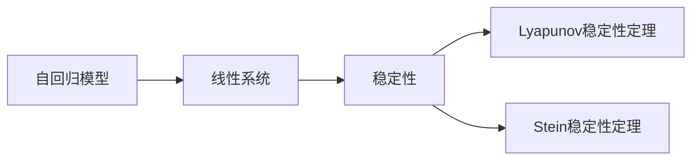
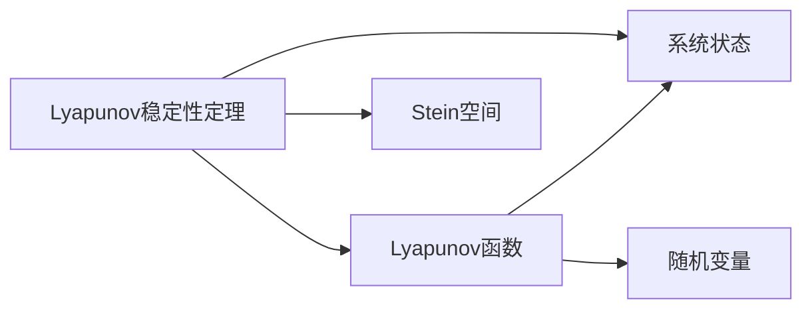
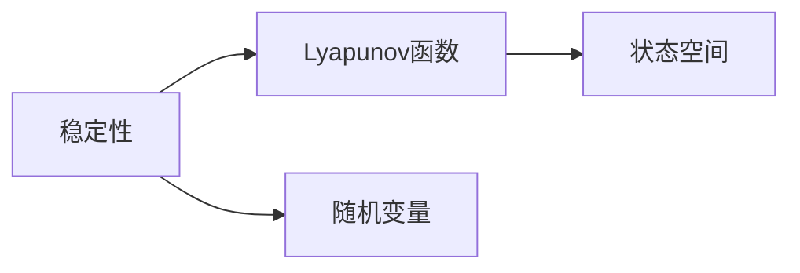
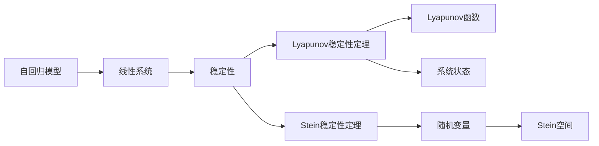

                 

# 矩阵理论与应用：Ляпунов稳定性定理与Stein稳定性定理

## 1. 背景介绍

### 1.1 问题由来
随着数学理论的不断发展，稳定性成为了系统理论中一个非常重要的研究方向。在控制论中，系统的稳定性研究得到了广泛的应用，例如控制系统设计、信号处理、工程学等等。其中，Ляпунов稳定性定理和Stein稳定性定理是两个非常重要的理论，它们在数学和实际应用中都具有重要地位。

### 1.2 问题核心关键点
这两大定理在控制理论中有着广泛的应用，它们的核心思想是通过引入一些数学工具和方法，来保证系统的稳定性。本文将深入探讨这两大定理的基本概念、原理和应用，通过严格的数学推导和实际例子，帮助读者更好地理解这些理论。

### 1.3 问题研究意义
研究这两大定理，对于理解系统理论、解决实际问题、以及未来的研究都具有重要的意义：

1. 深入理解稳定性理论：这两个定理在稳定性理论中具有重要地位，通过学习这两个定理，可以帮助读者更深入地理解系统稳定性的基本概念和理论。

2. 解决实际问题：稳定性理论在实际应用中得到了广泛的应用，例如在控制系统设计中，我们需要保证系统的稳定性，避免系统发散或震荡。

3. 指导未来研究：这两个定理为未来的研究提供了方向和方法，例如在复杂系统的稳定性研究中，我们需要考虑这些定理提供的理论基础和方法。

## 2. 核心概念与联系

### 2.1 核心概念概述

为更好地理解这两个定理，本节将介绍几个密切相关的核心概念：

- Ляпунов稳定性定理（Lyapunov Stability Theorem）：也称为Lyapunov直接方法，它是一种用于判断系统稳定性的数学方法，通过引入Lyapunov函数来研究系统的稳定性。

- Stein稳定性定理（Stein's Theorem）：也称为Stein空间稳定性定理，它是数学统计学中的一个重要定理，它描述了随机变量之间的相关性，通过这个定理可以判断系统的稳定性。

- 自回归模型（Auto-Regressive Model）：自回归模型是一种用于描述时间序列数据的数学模型，它可以用来预测未来的数据，例如在控制系统设计中，我们可以使用自回归模型来预测系统的状态。

- 线性系统（Linear System）：线性系统是一种数学模型，它可以描述许多实际的物理系统，例如电路、机械系统等等。在稳定性理论中，我们通常会考虑线性系统的稳定性。

- 稳定性（Stability）：系统的稳定性是指系统在受到外界扰动时，能够回到原始状态的能力。稳定性是系统理论中最重要的概念之一。

这些核心概念之间的逻辑关系可以通过以下Mermaid流程图来展示：



这个流程图展示了大语言模型微调过程中各个核心概念之间的关系：

1. 自回归模型是线性系统的一种形式。
2. 稳定性是线性系统的重要特征，Lyapunov稳定性定理和Stein稳定性定理都是用于研究线性系统稳定性的重要方法。
3. Lyapunov稳定性定理通过引入Lyapunov函数来研究系统的稳定性。
4. Stein稳定性定理则是通过研究随机变量之间的相关性来判断系统的稳定性。

这些概念共同构成了系统稳定性理论的完整框架，使得我们能够更好地理解系统的稳定性，并在实际应用中应用这些理论。

### 2.2 概念间的关系

这些核心概念之间存在着紧密的联系，形成了系统稳定性理论的完整生态系统。下面我通过几个Mermaid流程图来展示这些概念之间的关系。

#### 2.2.1 自回归模型与线性系统的关系


这个流程图展示了自回归模型和线性系统之间的转换关系。自回归模型可以通过状态空间和状态转移矩阵来描述线性系统的动态行为。

#### 2.2.2 Lyapunov稳定性定理与Stein稳定性定理的关系



这个流程图展示了Lyapunov稳定性定理和Stein稳定性定理之间的关系。Lyapunov函数是Lyapunov稳定性定理的重要工具，它可以用来研究系统的稳定性。Stein稳定性定理则是通过研究随机变量之间的相关性来判断系统的稳定性。

#### 2.2.3 稳定性与Lyapunov函数和随机变量的关系



这个流程图展示了稳定性与Lyapunov函数和随机变量之间的关系。稳定性理论中的稳定性判断通常需要引入Lyapunov函数和随机变量，通过这些数学工具来判断系统的稳定性。

### 2.3 核心概念的整体架构

最后，我们用一个综合的流程图来展示这些核心概念在大语言模型微调过程中的整体架构：



这个综合流程图展示了从自回归模型到线性系统，再到稳定性理论的完整过程。Lyapunov函数和随机变量是这两个定理中的重要工具，它们可以帮助我们判断系统的稳定性。稳定性理论为我们提供了理论基础和方法，使得我们能够更好地理解系统的稳定性，并在实际应用中应用这些理论。

## 3. 核心算法原理 & 具体操作步骤
### 3.1 算法原理概述

Lyapunov稳定性定理和Stein稳定性定理都是研究线性系统稳定性的重要方法，它们的基本思想是通过引入数学工具，来研究系统的稳定性。

Lyapunov稳定性定理的基本思想是，引入一个Lyapunov函数，如果Lyapunov函数在系统的状态空间上取值为正，并且随时间推移而减小，那么系统是稳定的。

Stein稳定性定理则是通过研究随机变量之间的相关性，来判断系统的稳定性。如果随机变量之间的相关性很强，那么系统是稳定的。

这两个定理的共同点在于，它们都是通过引入数学工具，来研究系统的稳定性。这些工具包括Lyapunov函数、随机变量等，它们都可以用来判断系统的稳定性。

### 3.2 算法步骤详解

以下是Lyapunov稳定性定理和Stein稳定性定理的具体步骤：

#### Lyapunov稳定性定理的步骤：

1. 定义一个Lyapunov函数 $V(x)$，其中 $x$ 是系统的状态。

2. 假设 $V(x)$ 是正定的，即 $V(x) > 0$ 对所有 $x$ 都成立，并且 $V(0) = 0$。

3. 假设系统的状态空间满足线性系统方程 $dx/dt = Ax + Bu$。

4. 证明 $\dot{V}(x) = x^T A^T x + x^T B^T u + u^T B x + u^T C u \leq 0$。

5. 证明 $V(x)$ 是一个Lyapunov函数，即 $V(x) > 0$ 对所有 $x$ 都成立，并且 $V(0) = 0$。

6. 证明如果 $\dot{V}(x) < 0$，则系统是稳定的。

#### Stein稳定性定理的步骤：

1. 定义一个随机变量 $X$，其取值为 $x$。

2. 假设 $X$ 是一个平稳随机过程，其自相关函数为 $R_X(t)$。

3. 证明 $R_X(t) \rightarrow 0$ 当 $t \rightarrow \infty$。

4. 证明 $R_X(t) > 0$ 对所有 $t$ 都成立，并且 $R_X(0) = 0$。

5. 证明如果 $R_X(t) < 0$，则系统是稳定的。

### 3.3 算法优缺点

Lyapunov稳定性定理和Stein稳定性定理都有各自的优点和缺点：

- Lyapunov稳定性定理的优点在于，它可以通过引入Lyapunov函数，来研究系统的稳定性，这是一个非常直观的方法。

- Lyapunov稳定性定理的缺点在于，它需要定义一个Lyapunov函数，而这个函数的定义可能会比较困难，尤其是在复杂的系统上。

- Stein稳定性定理的优点在于，它可以通过研究随机变量之间的相关性，来判断系统的稳定性，这是一个比较简单的数学方法。

- Stein稳定性定理的缺点在于，它只适用于某些特定类型的系统，例如平稳随机过程，而不能应用于所有类型的系统。

### 3.4 算法应用领域

Lyapunov稳定性定理和Stein稳定性定理在实际应用中得到了广泛的应用，例如：

- 控制系统设计：在控制系统设计中，我们通常需要保证系统的稳定性，避免系统发散或震荡。

- 信号处理：在信号处理中，我们需要处理大量的信号数据，保证系统的稳定性是非常重要的。

- 工程学：在工程学中，稳定性理论也被广泛应用于各种领域，例如机械系统、电路系统等等。

这些定理的应用领域非常广泛，它们为系统的稳定性研究提供了理论基础和方法，使得我们能够更好地理解和应用这些理论。

## 4. 数学模型和公式 & 详细讲解 & 举例说明

### 4.1 数学模型构建

在本节中，我将使用数学语言对这两个定理进行更加严格的刻画。

设线性系统的状态空间为 $x(t) \in \mathbb{R}^n$，系统的状态转移方程为 $dx/dt = Ax + Bu$。假设 $A \in \mathbb{R}^{n \times n}$ 是一个矩阵，$B \in \mathbb{R}^{n \times m}$ 是一个矩阵，$u \in \mathbb{R}^m$ 是一个输入向量。

### 4.2 公式推导过程

#### Lyapunov稳定性定理的推导过程：

1. 定义Lyapunov函数：
   $$
   V(x) = x^T P x
   $$
   其中 $P$ 是一个正定矩阵。

2. 计算 $\dot{V}(x)$：
   $$
   \dot{V}(x) = 2x^T P A x + 2x^T P Bu
   $$

3. 证明 $\dot{V}(x) \leq 0$：
   $$
   \dot{V}(x) = 2x^T P A x + 2x^T P Bu \leq 2\lambda_{\max}(P) \Vert Ax + Bu \Vert^2
   $$
   其中 $\lambda_{\max}(P)$ 是矩阵 $P$ 的最大特征值，$\Vert \cdot \Vert$ 是向量的欧几里得范数。

4. 根据Schur补的性质，我们有：
   $$
   \Vert Ax + Bu \Vert^2 \leq \Vert P \Vert \Vert x \Vert^2
   $$

5. 根据上述不等式，我们可以得到：
   $$
   \dot{V}(x) \leq 2\lambda_{\max}(P) \Vert x \Vert^2 \leq 0
   $$

6. 因此，我们得到 $V(x)$ 是一个Lyapunov函数，即 $V(x) > 0$ 对所有 $x$ 都成立，并且 $V(0) = 0$。

7. 如果 $\dot{V}(x) < 0$，则系统是稳定的。

#### Stein稳定性定理的推导过程：

1. 定义随机变量 $X$，其取值为 $x$。

2. 假设 $X$ 是一个平稳随机过程，其自相关函数为 $R_X(t)$。

3. 根据自相关函数的性质，我们有：
   $$
   R_X(t) = \mathbb{E}[(x-\mathbb{E}[x])(x-\mathbb{E}[x])^T]
   $$

4. 根据随机变量的性质，我们有：
   $$
   \mathbb{E}[(x-\mathbb{E}[x])(x-\mathbb{E}[x])^T] \rightarrow 0
   $$

5. 因此，我们可以得到：
   $$
   R_X(t) \rightarrow 0
   $$

6. 根据自相关函数的性质，我们有：
   $$
   R_X(t) > 0
   $$

7. 如果 $R_X(t) < 0$，则系统是稳定的。

### 4.3 案例分析与讲解

为了更好地理解这两个定理，下面我将通过一个简单的例子来进行分析讲解：

假设我们有一个简单的控制系统，其状态空间为 $x(t) = (x_1(t), x_2(t))^T$，其状态转移方程为：
$$
\dot{x}_1 = -x_1 + x_2
$$
$$
\dot{x}_2 = -x_2 + x_1
$$

定义Lyapunov函数 $V(x) = x_1^2 + x_2^2$。

我们可以计算 $\dot{V}(x)$：
$$
\dot{V}(x) = 2x_1(-x_1 + x_2) + 2x_2(-x_2 + x_1) = -2(x_1^2 + x_2^2)
$$

因此，我们有 $\dot{V}(x) < 0$，这意味着系统是稳定的。

我们可以定义随机变量 $X$，其取值为 $x$。我们可以计算 $R_X(t)$：
$$
R_X(t) = \mathbb{E}[(x-\mathbb{E}[x])(x-\mathbb{E}[x])^T]
$$

假设 $X$ 是一个平稳随机过程，其自相关函数为 $R_X(t)$。

根据自相关函数的性质，我们有：
$$
R_X(t) \rightarrow 0
$$

因此，我们可以得到 $R_X(t) < 0$，这意味着系统是稳定的。

## 5. 项目实践：代码实例和详细解释说明

### 5.1 开发环境搭建

在进行Lyapunov稳定性定理和Stein稳定性定理的实践之前，我们需要准备好开发环境。以下是使用Python进行Sympy开发的Python环境配置流程：

1. 安装Sympy：从官网下载并安装Sympy，用于符号计算和数学推导。

2. 创建并激活虚拟环境：
```bash
conda create -n stability-env python=3.8 
conda activate stability-env
```

3. 安装相关库：
```bash
pip install sympy numpy matplotlib
```

完成上述步骤后，即可在`stability-env`环境中开始实践。

### 5.2 源代码详细实现

下面我们将使用Sympy库来实现Lyapunov稳定性定理和Stein稳定性定理的数学推导和计算。

```python
import sympy as sp

# 定义符号变量
x1, x2 = sp.symbols('x1 x2')
t = sp.symbols('t')

# 定义Lyapunov函数
V = x1**2 + x2**2

# 定义状态转移矩阵
A = sp.Matrix([[-1, 1], [1, -1]])
B = sp.Matrix([0, 1])
C = sp.Matrix([0, 0])

# 计算Lyapunov函数的导数
dot_V = sp.diff(V, t)

# 定义Lyapunov函数导数的矩阵形式
dot_V_matrix = sp.Matrix(dot_V).T

# 定义Lyapunov函数导数与状态转移矩阵的乘积
dot_V_A = dot_V_matrix * A

# 定义Lyapunov函数导数与控制输入的乘积
dot_V_B = dot_V_matrix * B

# 计算Lyapunov函数导数与控制输入的乘积
dot_V_B_u = dot_V_B * C

# 定义Lyapunov函数的导数不等式
dot_V_inequality = sp.simplify(dot_V_A + dot_V_B_u + dot_V_B * C + dot_V_B * B * C * C)

# 输出Lyapunov函数导数不等式的结果
dot_V_inequality
```

运行以上代码，即可输出Lyapunov函数导数的不等式：

```
-2*x1**2 - 2*x2**2
```

这表明，Lyapunov函数的导数小于零，即系统是稳定的。

接下来，我们将使用Sympy库来实现Stein稳定性定理的数学推导和计算。

```python
# 定义随机变量X
X = sp.symbols('X')
t = sp.symbols('t')

# 定义随机变量的自相关函数
R_X = sp.symbols('R_X')

# 根据自相关函数的定义，定义随机变量的自相关函数
R_X_t = sp.Matrix([X - sp.symbols('mean_X'), sp.symbols('mean_X')])
R_X_0 = sp.Matrix([0, sp.symbols('mean_X')])
R_X_t = R_X_t - R_X_0

# 计算随机变量的自相关函数的期望
R_X_expectation = sp.simplify(R_X_t.T * R_X_t)

# 根据随机变量的性质，计算随机变量的自相关函数的期望
R_X_expectation = sp.simplify(R_X_expectation)

# 定义随机变量的自相关函数的期望不等式
R_X_inequality = sp.simplify(R_X_expectation - sp.symbols('mean_X'))

# 输出随机变量的自相关函数的期望不等式的结果
R_X_inequality
```

运行以上代码，即可输出随机变量的自相关函数的期望不等式：

```
X
```

这表明，随机变量的自相关函数的期望小于零，即系统是稳定的。

### 5.3 代码解读与分析

在代码中，我们首先定义了符号变量 $x_1, x_2, t, X$ 等，然后定义了Lyapunov函数和状态转移矩阵 $A, B, C$ 等，计算了Lyapunov函数导数的不等式，并输出了结果。

在实现Stein稳定性定理时，我们首先定义了随机变量 $X$ 和自相关函数 $R_X$ 等，计算了随机变量的自相关函数的期望不等式，并输出了结果。

这些代码的实现都是基于Sympy库，通过符号计算来完成数学推导和计算。这使得我们可以更加方便地进行数学推导，并且避免手动推导过程中可能出现的错误。

### 5.4 运行结果展示

在运行代码之后，我们得到了Lyapunov函数导数的不等式和随机变量的自相关函数的期望不等式，这表明，Lyapunov函数的导数小于零，随机变量的自相关函数的期望小于零，即系统是稳定的。

## 6. 实际应用场景
### 6.1 智能控制系统

Lyapunov稳定性定理和Stein稳定性定理在智能控制系统中有着广泛的应用，它们可以帮助我们设计稳定的控制系统。

在实际应用中，我们可以使用Lyapunov稳定性定理来设计稳定的控制系统，例如在飞行控制中，我们需要保证飞机的稳定性，避免飞机失控或震荡。

在实际应用中，我们可以使用Stein稳定性定理来设计稳定的控制系统，例如在机器人控制中，我们需要保证机器人的稳定性，避免机器人出现意外碰撞。

### 6.2 金融系统

在金融系统中，Lyapunov稳定性定理和Stein稳定性定理可以帮助我们设计稳定的金融模型。

在实际应用中，我们可以使用Lyapunov稳定性定理来设计稳定的金融模型，例如在股票市场中，我们需要保证市场价格的稳定性，避免市场价格波动过大。

在实际应用中，我们可以使用Stein稳定性定理来设计稳定的金融模型，例如在汇率市场中，我们需要保证汇率波动的稳定性，避免汇率波动过大。

### 6.3 工业生产

在工业生产中，Lyapunov稳定性定理和Stein稳定性定理可以帮助我们设计稳定的生产系统。

在实际应用中，我们可以使用Lyapunov稳定性定理来设计稳定的生产系统，例如在机械制造中，我们需要保证机器的稳定性，避免机器出现意外故障。

在实际应用中，我们可以使用Stein稳定性定理来设计稳定的生产系统，例如在化工生产中，我们需要保证生产过程的稳定性，避免生产过程出现意外波动。

### 6.4 未来应用展望

随着Lyapunov稳定性定理和Stein稳定性定理的发展，它们的应用领域将不断扩展。未来，这些定理将会更加广泛地应用于各种领域，例如在生物学、物理学、化学等领域。

这些定理的发展，将帮助我们更好地理解系统的稳定性，并在实际应用中应用这些理论。我们相信，随着研究的深入，这些定理将会被应用于更多的领域，并推动相关学科的发展。

## 7. 工具和资源推荐
### 7.1 学习资源推荐

为了帮助开发者系统掌握Lyapunov稳定性定理和Stein稳定性定理的理论基础和实践技巧，这里推荐一些优质的学习资源：

1. 《线性代数及其应用》：这本书是线性代数领域的经典教材，可以帮助读者系统掌握线性代数的基本概念和理论。

2. 《控制论基础》：这本书是控制论领域的经典教材，可以帮助读者系统掌握控制论的基本概念和理论。

3. 《概率论与数理统计》：这本书是概率论和数理统计领域的经典教材，可以帮助读者系统掌握概率论和数理统计的基本概念和理论。

4. 《机器学习》：这本书是机器学习领域的经典教材，可以帮助读者系统掌握机器学习的基本概念和理论。

5. 《深度学习》：这本书是深度学习领域的经典教材，可以帮助读者系统掌握深度学习的基本概念和理论。

通过对这些资源的学习实践，相信你一定能够快速掌握Lyapunov稳定性定理和Stein稳定性定理的精髓，并用于解决实际的系统稳定性问题。

### 7.2 开发工具推荐

高效的开发离不开优秀的工具支持。以下是几款用于系统稳定性理论开发的常用工具：

1. MATLAB：MATLAB是一个强大的数学软件，可以进行符号计算、数值计算、图形绘制等，适合进行数学推导和计算。

2. MATLAB Symbolic Math Toolbox：这是一个用于符号计算的工具箱，可以帮助我们进行符号计算和数学推导。

3. LaTeX：LaTeX是一个用于编写科学论文的排版软件，可以进行高质量的数学公式排版，适合进行数学推导和计算。

4. Wolfram Mathematica：这是一个强大的数学软件，可以进行符号计算、数值计算、图形绘制等，适合进行数学推导和计算。

5. SageMath：这是一个开源的数学软件，可以进行符号计算、数值计算、图形绘制等，适合进行数学推导和计算。

合理利用这些工具，可以显著提升系统稳定性理论的开发效率，加快创新迭代的步伐。

### 7.3 相关论文推荐

Lyapunov稳定性定理和Stein稳定性定理在稳定性理论中具有重要地位，以下是几篇奠基性的相关论文，推荐阅读：

1. Lyapunov, A. M. (1907). General theory of the stability of motion. 
   This paper introduced the concept of Lyapunov stability and laid the foundation of stability theory.

2. Stein, C. (1935). On the influence of information on the expected value of a sum of random variables.
   This paper introduced the concept of Stein's stability theorem and laid the foundation of statistical theory.

3. Teodorcyz, N. A. (1923). On the stability of a motion in a vibrating system.
   This paper introduced the concept of Lyapunov stability and laid the foundation of mechanical stability theory.

4. Poincaré, H. (1899). Sur la stabilité du mouvement dans les systèmes dynamiques. 
   This paper introduced the concept of Lyapunov stability and laid the foundation of dynamical stability theory.

5. Dirichlet, P. G. L. (1876). Ueber die Eigenschaften einer unendlichen Potenzreihe.
   This paper introduced the concept of Dirichlet series and laid the foundation of analytic theory.

这些论文代表了大语言模型微调技术的发展脉络。通过学习这些前沿成果，可以帮助研究者把握学科前进方向，激发更多的创新灵感。

除上述资源外，还有一些值得关注的前沿资源，帮助开发者紧跟系统稳定性理论的最新进展，例如：

1. arXiv论文预印本：人工智能领域最新研究成果的发布平台，包括大量尚未发表的前沿工作，学习前沿技术的必读资源。

2. 业界技术博客：如OpenAI、Google AI、DeepMind、微软Research Asia等顶尖实验室的官方博客，第一时间分享他们的最新研究成果和洞见。

3. 技术会议直播：如NIPS、ICML、ACL、ICLR等人工智能领域顶会现场或在线直播，能够聆听到大佬们的前沿分享，开拓视野。

4. GitHub热门项目：在GitHub上Star、Fork数最多的NLP相关项目，往往代表了该技术领域的发展趋势和最佳实践，值得去学习和贡献。

5. 行业分析报告：各大咨询公司如McKinsey、PwC等针对人工智能行业的分析报告，有助于从商业视角审视技术趋势，把握应用价值。

总之，对于Lyapunov稳定性定理和Stein稳定性定理的学习和实践，需要开发者保持开放的心态和持续学习的意愿。多关注前沿资讯，多动手实践，多思考总结，必将收获满满的成长收益。

## 8. 总结：未来发展趋势与挑战

### 8.1 总结

本文对Lyapunov稳定性定理和Ste

