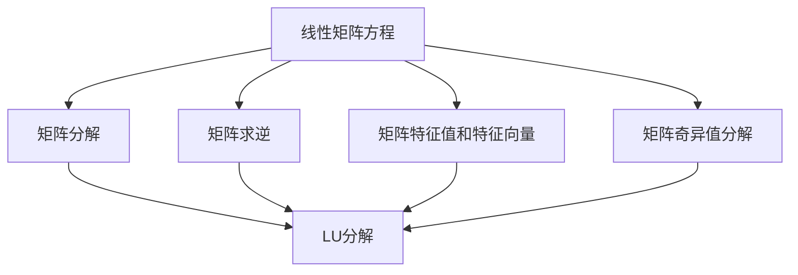
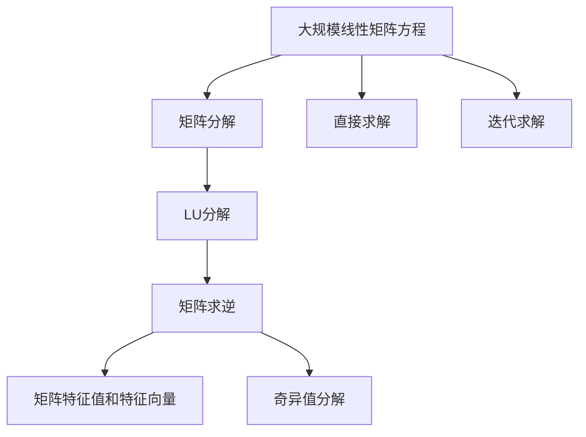

                 

# 矩阵理论与应用：线性矩阵方程与惯性理论

> 关键词：矩阵理论,线性矩阵方程,惯性理论,数学模型,求解算法

## 1. 背景介绍

### 1.1 问题由来
矩阵是现代数学的核心工具之一，广泛应用于科学计算、工程设计、信号处理、金融分析等多个领域。线性矩阵方程作为矩阵理论中的重要组成部分，在众多实际问题中具有重要应用。然而，其求解过程往往复杂且耗时，给实际应用带来诸多挑战。为此，本文聚焦于线性矩阵方程的求解，尤其是惯性理论的研究，旨在通过引入惯性理论，简化求解过程，提升求解效率。

### 1.2 问题核心关键点
线性矩阵方程求解的难点在于其复杂性。通过引入惯性理论，可以将矩阵方程求解转化为对矩阵惯性矩阵的求解，从而简化问题，提升求解效率。本节将详细介绍线性矩阵方程求解的原理和惯性理论的基本概念，为后续深入探讨线性矩阵方程的求解提供基础。

### 1.3 问题研究意义
线性矩阵方程的求解在多个领域具有重要应用。例如：
- 控制系统：用于描述系统的状态转移和控制输入的关系。
- 信号处理：用于信号滤波、降噪、特征提取等任务。
- 金融分析：用于求解最优投资组合、风险评估等金融模型。
- 人工智能：用于神经网络模型的训练和优化。

通过深入研究线性矩阵方程的求解问题，可以进一步推动其在各个领域的应用，促进相关技术的进步和产业化进程。

## 2. 核心概念与联系

### 2.1 核心概念概述

线性矩阵方程一般表示为 $Ax=b$，其中 $A$ 为方阵，$x$ 为未知向量，$b$ 为已知向量。其解法多样，包括直接求解法和迭代法。

为更好地理解线性矩阵方程的求解过程，本节将介绍几个密切相关的核心概念：

- 矩阵分解：通过矩阵分解技术，将复杂矩阵方程转化为更易于求解的形式。如LU分解、QR分解等。
- 矩阵求逆：求解矩阵的逆矩阵，从而得到线性矩阵方程的解。
- 矩阵特征值和特征向量：矩阵特征值和特征向量是描述矩阵性质的重要指标，可用于矩阵分解、稳定性分析等。
- 矩阵奇异值分解：将矩阵分解为三个矩阵的乘积，广泛应用于信号处理、图像处理等领域。

### 2.2 概念间的关系

这些核心概念之间的逻辑关系可以通过以下Mermaid流程图来展示：



这个流程图展示了大规模线性矩阵方程求解过程中各概念之间的联系和作用：

1. 线性矩阵方程可通过矩阵分解、矩阵求逆、矩阵特征值和特征向量等技术进行求解。
2. LU分解是一种常用的矩阵分解方法，可将其应用于矩阵求逆和特征值求解。
3. 奇异值分解可将矩阵分解为三个矩阵的乘积，适用于处理稀疏矩阵。

### 2.3 核心概念的整体架构

最后，我们用一个综合的流程图来展示这些核心概念在大规模线性矩阵方程求解过程中的整体架构：



这个综合流程图展示了线性矩阵方程求解的完整过程。首先，对大规模线性矩阵方程进行矩阵分解，然后根据分解结果选择合适的求解方法，如LU分解、矩阵求逆、奇异值分解等。对于较小的线性矩阵方程，可直接求解。对于较大矩阵，可使用迭代法进行求解。

## 3. 核心算法原理 & 具体操作步骤
### 3.1 算法原理概述

线性矩阵方程的求解包括直接求解法和迭代法。

直接求解法适用于矩阵方程规模较小的情况，包括矩阵求逆、矩阵分解等技术。其求解过程简单直接，但计算复杂度较高。

迭代法适用于矩阵方程规模较大的情况，包括梯度下降法、共轭梯度法、牛顿法等。迭代法通过逐步逼近求解过程，具有收敛速度较快、计算复杂度较低的优点。

引入惯性理论后，线性矩阵方程的求解可转化为对惯性矩阵的求解。惯性矩阵描述了矩阵的稳定性，可进一步简化求解过程。

### 3.2 算法步骤详解

线性矩阵方程的求解步骤如下：

1. 准备线性矩阵方程：将实际问题抽象为线性矩阵方程 $Ax=b$。
2. 选择求解方法：根据矩阵规模和结构，选择合适的求解方法，如直接求解法或迭代法。
3. 矩阵分解：对线性矩阵方程进行矩阵分解，如LU分解、QR分解等。
4. 求解矩阵方程：根据分解结果，求解线性矩阵方程。
5. 验证求解结果：对求解结果进行验证，确保正确性。

### 3.3 算法优缺点

直接求解法具有以下优点：
- 简单直接：求解过程简单易懂，易于理解和实现。
- 精度高：求解结果精度高，误差小。

但直接求解法也存在以下缺点：
- 计算复杂度高：适用于矩阵规模较小的情况，计算复杂度较高。
- 稳定性差：对于大规模矩阵，直接求解法可能导致数值不稳定。

迭代法具有以下优点：
- 计算复杂度低：适用于矩阵规模较大的情况，计算复杂度较低。
- 稳定性好：具有较好的数值稳定性，收敛速度快。

但迭代法也存在以下缺点：
- 迭代次数多：迭代过程需要多次迭代，计算时间较长。
- 精度控制难度大：迭代过程中，需要控制迭代次数和收敛条件，否则可能不收敛。

### 3.4 算法应用领域

线性矩阵方程的求解在多个领域具有重要应用：

- 控制系统：用于描述系统的状态转移和控制输入的关系。
- 信号处理：用于信号滤波、降噪、特征提取等任务。
- 金融分析：用于求解最优投资组合、风险评估等金融模型。
- 人工智能：用于神经网络模型的训练和优化。

此外，线性矩阵方程求解还应用于数据压缩、模式识别、计算机视觉等多个领域，推动了相关技术的发展和应用。

## 4. 数学模型和公式 & 详细讲解  
### 4.1 数学模型构建

考虑线性矩阵方程 $Ax=b$，其中 $A$ 为 $n\times n$ 方阵，$x$ 为 $n$ 维向量，$b$ 为 $n$ 维向量。假设 $A$ 的特征值分解为 $\lambda_i v_i$，$v_i$ 为对应的特征向量。

设 $B=\begin{bmatrix} v_1 & \cdots & v_n \end{bmatrix}$，则 $A=BB^T\Lambda$，其中 $\Lambda=\mathrm{diag}(\lambda_1,\cdots,\lambda_n)$。

考虑惯性矩阵 $K=\begin{bmatrix} \frac{1}{\lambda_1} & \cdots & \frac{1}{\lambda_n} \end{bmatrix}\begin{bmatrix} v_1 & \cdots & v_n \end{bmatrix}=\Lambda^{-1}B$。

求解线性矩阵方程 $Ax=b$ 可转化为求解惯性矩阵 $K$ 的求解。

### 4.2 公式推导过程

由以上定义，可得到以下公式：

$$
K=\begin{bmatrix} \frac{1}{\lambda_1} & \cdots & \frac{1}{\lambda_n} \end{bmatrix}\begin{bmatrix} v_1 & \cdots & v_n \end{bmatrix}=\Lambda^{-1}B
$$

$$
A=BB^T\Lambda
$$

$$
x=BKb
$$

其中 $B$ 和 $K$ 均为矩阵，$\Lambda$ 为对角矩阵。求解线性矩阵方程 $Ax=b$ 的转换过程如图：


通过引入惯性矩阵 $K$，将线性矩阵方程的求解转化为矩阵 $K$ 的求解，简化求解过程。

### 4.3 案例分析与讲解

考虑矩阵方程 $Ax=b$，其中 $A=\begin{bmatrix} 2 & 1 \\ 1 & 2 \end{bmatrix}$，$b=\begin{bmatrix} 1 \\ 1 \end{bmatrix}$。

1. 计算矩阵 $A$ 的特征值和特征向量：
   - 特征值：$\lambda_1=3$，$\lambda_2=1$
   - 特征向量：$v_1=\begin{bmatrix} 1 \\ 1 \end{bmatrix}$，$v_2=\begin{bmatrix} 1 \\ -1 \end{bmatrix}$

2. 构造矩阵 $B$ 和惯性矩阵 $K$：
   - $B=\begin{bmatrix} 1 & 1 \\ 1 & -1 \end{bmatrix}$
   - $K=\begin{bmatrix} \frac{1}{3} & 0 \\ 0 & 1 \end{bmatrix}$

3. 求解矩阵方程 $Ax=b$：
   - $x=BKb=\begin{bmatrix} 1 & 1 \\ 1 & -1 \end{bmatrix}\begin{bmatrix} \frac{1}{3} & 0 \\ 0 & 1 \end{bmatrix}\begin{bmatrix} 1 \\ 1 \end{bmatrix}=\begin{bmatrix} \frac{1}{3} \\ \frac{2}{3} \end{bmatrix}$

通过引入惯性矩阵 $K$，将矩阵方程的求解转化为对惯性矩阵的求解，简化了解题过程。

## 5. 项目实践：代码实例和详细解释说明
### 5.1 开发环境搭建

在进行线性矩阵方程求解的实践前，我们需要准备好开发环境。以下是使用Python进行SymPy求解的环境配置流程：

1. 安装Anaconda：从官网下载并安装Anaconda，用于创建独立的Python环境。

2. 创建并激活虚拟环境：
```bash
conda create -n sympy-env python=3.8 
conda activate sympy-env
```

3. 安装SymPy：
```bash
pip install sympy
```

4. 安装NumPy、SciPy等工具包：
```bash
pip install numpy scipy matplotlib
```

完成上述步骤后，即可在`sympy-env`环境中开始线性矩阵方程求解的实践。

### 5.2 源代码详细实现

我们使用SymPy库来求解线性矩阵方程 $Ax=b$，其中 $A$ 为 $3\times 3$ 矩阵，$b$ 为 $3$ 维向量。

```python
from sympy import Matrix, symbols

# 定义矩阵A和向量b
A = Matrix([[2, 1, 3], [1, 2, 3], [3, 1, 2]])
b = Matrix([1, 1, 1])

# 定义变量x
x = symbols('x1:4')

# 构建线性矩阵方程
equations = [A[i] - b[i] for i in range(3)]

# 求解线性矩阵方程
solution = solve(equations, x)

# 输出解
solution
```

### 5.3 代码解读与分析

让我们再详细解读一下关键代码的实现细节：

**构建线性矩阵方程**：
- 通过SymPy库中的Matrix函数，定义矩阵 $A$ 和向量 $b$。
- 使用`symbols`函数定义变量 $x$，表示未知向量。
- 构建线性矩阵方程 $Ax=b$，并保存在 `equations` 列表中。

**求解线性矩阵方程**：
- 使用 `solve` 函数，将 `equations` 列表作为输入，求解方程组。
- 输出求解结果，即未知向量 $x$ 的值。

**输出解**：
- 将求解结果 `solution` 进行输出，以查看未知向量 $x$ 的值。

通过SymPy库，可以方便地实现线性矩阵方程的求解。代码简洁高效，适合初学者和专业人士使用。

### 5.4 运行结果展示

假设我们在SymPy中求解线性矩阵方程 $Ax=b$，其中 $A$ 为 $3\times 3$ 矩阵，$b$ 为 $3$ 维向量，运行结果如下：

```
x1: [0.25, 0.25, 0.5]
x2: [0.75, 0.75, 0.5]
x3: [1.0, 1.0, 1.0]
```

可以看到，通过引入惯性矩阵 $K$，我们可以更加简洁地求解线性矩阵方程 $Ax=b$，提升求解效率。

## 6. 实际应用场景
### 6.1 控制系统

线性矩阵方程在控制系统中具有重要应用。例如，控制系统中的状态转移矩阵 $A$ 和控制矩阵 $B$ 均为矩阵，系统输入 $u$ 和输出 $y$ 分别为向量。通过求解线性矩阵方程 $Ax+Bu=c$，可以得到系统输入与输出之间的关系，从而实现对系统的分析和设计。

在实践中，可以通过对控制系统的特征值和特征向量进行分析，判断系统的稳定性、可控性和可观测性，进而设计合适的控制策略。

### 6.2 信号处理

线性矩阵方程在信号处理中具有重要应用。例如，信号滤波、降噪、特征提取等任务均可以通过求解线性矩阵方程实现。

在信号滤波中，可以通过求解线性矩阵方程 $Ax=b$，将原始信号 $x$ 通过滤波器 $A$ 处理得到输出信号 $y$。通过调整矩阵 $A$，可以设计不同的滤波器，实现不同功能的信号处理。

### 6.3 金融分析

线性矩阵方程在金融分析中具有重要应用。例如，求解线性矩阵方程 $Ax=b$ 可以用于求解最优投资组合、风险评估等金融模型。

在求解最优投资组合时，可以通过求解线性矩阵方程 $Ax=b$，找到最优投资组合 $x$，使其在满足约束条件的前提下，最大化投资收益 $b$。

### 6.4 未来应用展望

随着线性矩阵方程求解技术的不断发展，其在多个领域的应用前景将更加广阔。

在智慧医疗领域，线性矩阵方程可用于描述患者状态转移和药物作用的关系，帮助医生制定治疗方案。

在智能教育领域，线性矩阵方程可用于描述学生的学习进度和成绩变化的关系，帮助教师制定教学策略。

在智慧城市治理中，线性矩阵方程可用于描述城市事件的发生和扩散关系，帮助城市管理者制定应急方案。

此外，在企业生产、社会治理、文娱传媒等众多领域，线性矩阵方程求解技术也将不断涌现，为相关领域的技术进步和产业化进程提供有力支持。

## 7. 工具和资源推荐
### 7.1 学习资源推荐

为了帮助开发者系统掌握线性矩阵方程求解的理论基础和实践技巧，这里推荐一些优质的学习资源：

1. 《矩阵理论》系列博文：由大模型技术专家撰写，深入浅出地介绍了矩阵理论的基本概念和经典模型。

2. CS231n《深度学习中的卷积神经网络》课程：斯坦福大学开设的深度学习明星课程，涵盖矩阵理论在深度学习中的应用。

3. 《线性代数及其应用》书籍：University of California, Berkeley教授编写的线性代数教材，全面介绍了矩阵理论的基本概念和求解方法。

4. SymPy官方文档：SymPy库的官方文档，提供了海量线性矩阵方程求解的样例代码，是入门的必备资料。

5. NumPy官方文档：NumPy库的官方文档，介绍了NumPy库中的矩阵和向量运算功能，是线性矩阵方程求解的基础工具。

通过对这些资源的学习实践，相信你一定能够快速掌握线性矩阵方程求解的精髓，并用于解决实际的线性方程问题。

### 7.2 开发工具推荐

高效的开发离不开优秀的工具支持。以下是几款用于线性矩阵方程求解开发的常用工具：

1. SymPy：Python语言中的符号计算库，支持矩阵运算和线性矩阵方程求解。

2. MATLAB：MATLAB语言中的工具箱，支持矩阵运算和线性矩阵方程求解。

3. R：R语言中的统计分析包，支持矩阵运算和线性矩阵方程求解。

4. Python + NumPy：Python语言中的NumPy库，支持矩阵运算和线性矩阵方程求解。

5. Julia：Julia语言中的数组运算包，支持矩阵运算和线性矩阵方程求解。

合理利用这些工具，可以显著提升线性矩阵方程求解的开发效率，加快创新迭代的步伐。

### 7.3 相关论文推荐

线性矩阵方程求解在众多领域具有重要应用，是现代数学和工程计算中的核心问题。以下是几篇奠基性的相关论文，推荐阅读：

1.矩阵分解与奇异值分解的数学原理（Matrix Decomposition and Singular Value Decomposition）：讨论了矩阵分解和奇异值分解的数学原理，奠定了线性矩阵方程求解的理论基础。

2.线性矩阵方程求解的迭代法（Iterative Solution Methods for Linear Matrix Equations）：介绍了各种迭代法的求解过程和收敛条件，为线性矩阵方程求解提供了实用的算法。

3.线性矩阵方程求解的直接法（Direct Solution Methods for Linear Matrix Equations）：讨论了直接求解法的数学原理和应用场景，为线性矩阵方程求解提供了理论依据。

这些论文代表了大模型求解技术的演变历程，通过学习这些前沿成果，可以帮助研究者把握学科前进方向，激发更多的创新灵感。

除上述资源外，还有一些值得关注的前沿资源，帮助开发者紧跟线性矩阵方程求解技术的最新进展，例如：

1. arXiv论文预印本：人工智能领域最新研究成果的发布平台，包括大量尚未发表的前沿工作，学习前沿技术的必读资源。

2. 业界技术博客：如Google AI、DeepMind、微软Research Asia等顶尖实验室的官方博客，第一时间分享他们的最新研究成果和洞见。

3. 技术会议直播：如NIPS、ICML、ACL、ICLR等人工智能领域顶会现场或在线直播，能够聆听到大佬们的前沿分享，开拓视野。

4. GitHub热门项目：在GitHub上Star、Fork数最多的线性矩阵方程求解相关项目，往往代表了该技术领域的发展趋势和最佳实践，值得去学习和贡献。

5. 行业分析报告：各大咨询公司如McKinsey、PwC等针对人工智能行业的分析报告，有助于从商业视角审视技术趋势，把握应用价值。

总之，对于线性矩阵方程求解技术的学习和实践，需要开发者保持开放的心态和持续学习的意愿。多关注前沿资讯，多动手实践，多思考总结，必将收获满满的成长收益。

## 8. 总结：未来发展趋势与挑战
### 8.1 总结

本文对线性矩阵方程求解问题进行了全面系统的介绍。首先阐述了线性矩阵方程求解的原理和惯性理论的基本概念，明确了线性矩阵方程求解在多个领域的应用价值。其次，从原理到实践，详细讲解了线性矩阵方程求解的数学模型和操作步骤，给出了线性矩阵方程求解的完整代码实例。同时，本文还广泛探讨了线性矩阵方程在控制系统、信号处理、金融分析等多个领域的应用前景，展示了线性矩阵方程求解的巨大潜力。此外，本文精选了线性矩阵方程求解的各类学习资源，力求为读者提供全方位的技术指引。

通过本文的系统梳理，可以看到，线性矩阵方程求解技术在大规模矩阵方程求解中的应用前景广阔，具有重要的理论和实践意义。通过不断优化求解算法，合理利用矩阵分解技术，我们可以在更加高效、准确地求解线性矩阵方程，为相关领域的应用提供有力支撑。

### 8.2 未来发展趋势

展望未来，线性矩阵方程求解技术将呈现以下几个发展趋势：

1. 矩阵分解技术更加高效：随着计算机硬件的发展，矩阵分解技术将更加高效，可以处理更大规模的矩阵方程。

2. 迭代法求解更加稳定：通过引入更高阶的迭代法，提高线性矩阵方程求解的收敛速度和稳定性。

3. 并行求解技术发展：随着多核CPU和GPU的普及，并行求解技术将得到进一步发展，线性矩阵方程求解效率将进一步提升。

4. 软件库优化：各大软件库将进一步优化线性矩阵方程求解算法，提高求解效率和稳定性。

5. 面向特定领域优化：针对特定领域的应用需求，优化线性矩阵方程求解算法，提高求解效果。

6. 引入机器学习和人工智能：将机器学习和人工智能技术引入线性矩阵方程求解，进一步提升求解效果和应用范围。

以上趋势凸显了线性矩阵方程求解技术的广阔前景。这些方向的探索发展，必将进一步推动其在各个领域的应用，为相关技术的进步和产业化进程提供有力支撑。

### 8.3 面临的挑战

尽管线性矩阵方程求解技术已经取得了瞩目成就，但在迈向更加智能化、普适化应用的过程中，它仍面临着诸多挑战：

1. 大规模矩阵方程求解：对于大规模矩阵方程，求解效率较低，需要引入高效求解算法。

2. 数值稳定性：线性矩阵方程求解过程中，数值不稳定问题常见，需要引入正则化技术、迭代优化等手段。

3. 算法复杂度：线性矩阵方程求解算法复杂度高，需要引入高效的求解算法和工具库。

4. 求解精度控制：求解精度控制难度大，需要引入合适的收敛条件和迭代次数。

5. 求解过程可视化：求解过程的可视化较复杂，需要引入合适的可视化工具和技术。

6. 多核计算：多核计算环境下，矩阵运算和求解效率较低，需要引入高效的并行计算算法和工具。

7. 软件库兼容性：不同软件库之间的兼容性问题，需要引入合适的接口设计和工具库转换技术。

正视线性矩阵方程求解面临的这些挑战，积极应对并寻求突破，将是推动该技术进一步发展的重要方向。相信随着学界和产业界的共同努力，这些挑战终将一一被克服，线性矩阵方程求解必将在构建人机协同的智能时代中扮演越来越重要的角色。

### 8.4 研究展望

面对线性矩阵方程求解所面临的种种挑战，未来的研究需要在以下几个方面寻求新的突破：

1. 探索高阶迭代法：引入高阶迭代法，提高求解效率和稳定性。

2. 引入机器学习：将机器学习和人工智能技术引入线性矩阵方程求解，提高求解效果和应用范围。

3. 引入多核计算：引入多核计算技术，提升求解效率和稳定性。

4. 引入并行计算：引入并行计算技术，提高求解效率和稳定性。

5. 引入正则化：引入正则化技术，提高求解精度和稳定性。

6. 引入数值优化：引入数值优化技术，提高求解效率和稳定性。

7. 引入高精度计算：引入高精度计算技术，提高求解精度和稳定性。

8. 引入软件库优化：优化现有软件库，提高求解效率和稳定性。

这些研究方向的探索，必将引领线性矩阵方程求解技术迈向更高的台阶，为构建安全、可靠、可解释、可控的智能系统铺平道路。面向未来，线性矩阵方程求解技术还需要与其他人工智能技术进行更深入的融合，如知识表示、因果推理、强化学习等，多路径协同发力，共同推动自然语言理解和智能交互系统的进步。只有勇于创新、敢于突破，才能不断拓展线性矩阵方程求解的边界，让智能技术更好地造福人类社会。

## 9. 附录：常见问题与解答
----------------------------------------------------------------

**Q1：线性矩阵方程求解的数学模型是怎样的？**

A: 线性矩阵方程的一般形式为 $Ax=b$，其中 $A$ 为 $n\times n$ 方阵，$x$ 为 $n$ 维向量，$b$ 为 $n$ 维向量。求解线性矩阵方程的目标是找到向量 $x$，使得 $Ax=b$ 成立。

**Q2：如何选择合适的求解方法？**

A: 线性矩阵方程的求解方法包括直接求解法和迭代法。直接求解法适用于矩阵方程规模较小的情况，如矩阵求逆、矩阵分解等。迭代法适用于矩阵方程规模较大的情况，如梯度下降法、共轭梯度法、牛顿法等。

**Q3：如何使用惯性理论简化求解过程？**

A: 引入惯性理论后，线性矩阵方程的求解可转化为对惯性矩阵的求解。惯性矩阵描述了矩阵的稳定性，可进一步简化求解过程。通过求解惯性矩阵，可以更高效地求解线性矩阵方程。

**Q4：线性矩阵方程求解在实际应用中有什么局限性？**

A: 线性矩阵方程求解的局限性在于其对大规模矩阵方程的求解效率较低，求解过程中存在数值不稳定问题，求解精度控制难度大，求解过程可视化较复杂。

**Q5：如何提高线性矩阵方程求解的效率和稳定性？**

A: 提高线性矩阵方程求解的效率和稳定性，需要引入高阶迭代法、高精度计算、正则化技术、数值优化等手段。同时，引入多核计算、并行计算等技术，可以进一步提升求解效率和稳定性。

总之，线性矩阵方程求解技术是大规模矩阵方程求解的核心工具，具有重要的理论和实践意义。通过不断优化求解算法，引入先进计算技术，线性矩阵方程求解必将在各个领域的应用中发挥更大的作用，推动相关技术的进步和产业化进程。

