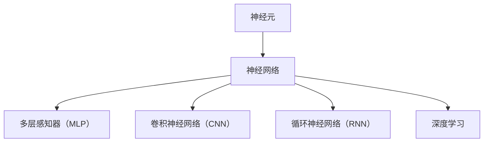
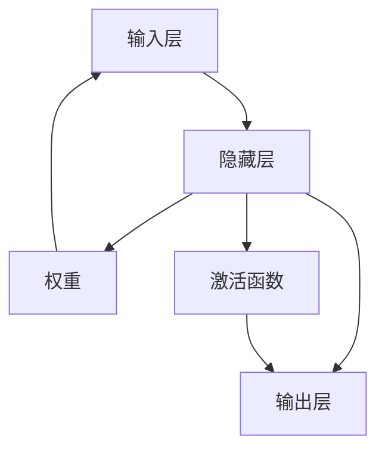
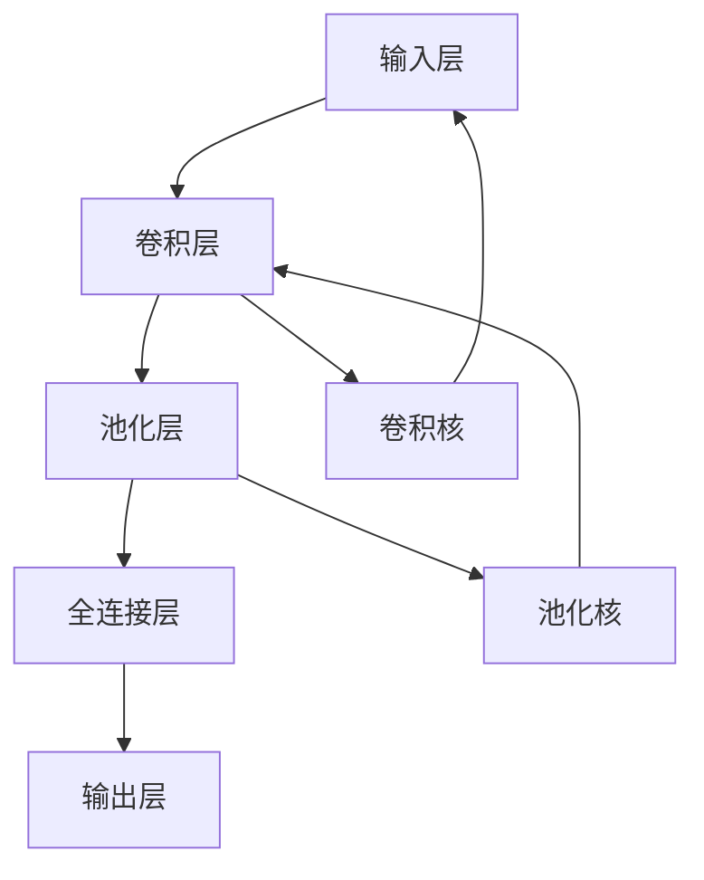
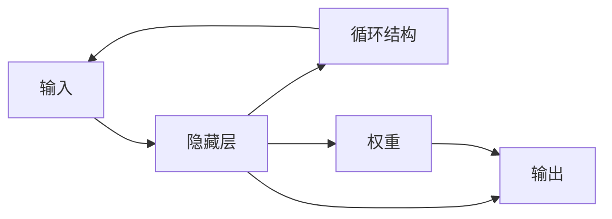
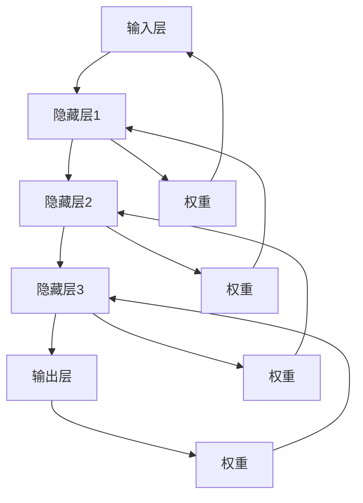
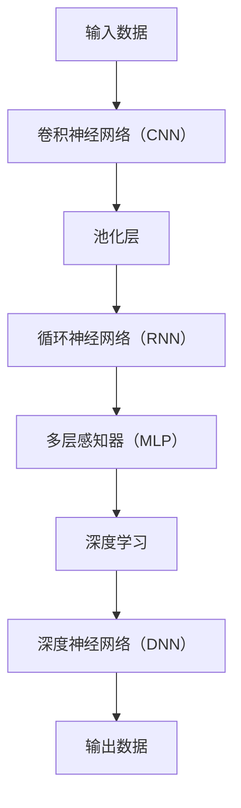

                 

## 1. 背景介绍

### 1.1 问题由来
人类智慧的延展，自古以来就是一个令人着迷的话题。从最初的结绳记事，到后来的造纸印刷，再到现代的互联网、人工智能，人类不断在探索更加高效、智能的信息处理方式。而神经网络作为当前最前沿的计算模型之一，正在成为人类智慧延伸的重要工具。

### 1.2 问题核心关键点
神经网络的核心原理来源于生物神经系统的结构和功能，通过模拟大脑的工作方式，对数据进行层次化处理，从而实现复杂的模式识别、预测和决策。其基本单元是神经元，由输入、权重、偏置和激活函数组成，通过多层网络结构实现对数据的高层次抽象和处理。

神经网络的发展历程可以分为几个重要阶段：

1. **感知器（Perceptron）**：20世纪40年代末，基于模拟人脑突触的感知器模型被提出，开启了神经网络的研究先河。

2. **多层感知器（Multilayer Perceptron，MLP）**：20世纪80年代，多层感知器模型被引入，通过引入多个隐藏层，实现了对复杂非线性关系的建模。

3. **卷积神经网络（Convolutional Neural Network，CNN）**：90年代，卷积神经网络被提出，主要用于图像识别任务，通过局部连接、池化等操作，有效提取图像的特征。

4. **循环神经网络（Recurrent Neural Network，RNN）**：2000年以后，循环神经网络被广泛用于自然语言处理，特别是序列数据的时序建模。

5. **深度学习（Deep Learning）**：近年来，深度学习技术快速发展，神经网络的层数和规模不断扩大，深度网络的复杂度和性能显著提升。

### 1.3 问题研究意义
神经网络的发展不仅在学术界引起了巨大反响，也在工业界得到广泛应用，极大地推动了人工智能技术的进步。神经网络的研究和应用意义重大：

1. **数据处理能力**：神经网络可以处理大规模、高维度的数据，具有强大的特征提取和模式识别能力。
2. **决策能力**：通过多层次的非线性映射，神经网络能够实现复杂的决策和分类。
3. **泛化能力**：神经网络能够学习到数据的通用规律，具有较强的泛化性能。
4. **应用广泛**：神经网络在计算机视觉、自然语言处理、语音识别、推荐系统等领域均有重要应用。
5. **创新驱动**：神经网络技术的发展催生了新的研究领域和应用场景，推动了人工智能的创新和发展。

## 2. 核心概念与联系

### 2.1 核心概念概述

为更好地理解神经网络的核心原理和应用，本节将介绍几个关键概念：

- **神经元（Neuron）**：神经网络的基本组成单元，接收输入、计算加权和并经过激活函数得到输出。
- **神经网络（Neural Network）**：由多个神经元组成的层次化结构，能够实现对数据的复杂建模和处理。
- **卷积神经网络（Convolutional Neural Network，CNN）**：通过卷积和池化操作，实现对图像数据的特征提取和处理。
- **循环神经网络（Recurrent Neural Network，RNN）**：通过循环结构，实现对序列数据的建模和处理。
- **深度学习（Deep Learning）**：由多层次神经网络构成的计算模型，通过多层次非线性映射，实现对复杂数据的建模和处理。

这些概念之间的关系可以通过以下Mermaid流程图来展示：



这个流程图展示了神经网络的主要组成部分及其相互关系：

1. 神经元是神经网络的基本单元。
2. 多层感知器、卷积神经网络和循环神经网络都是基于神经元构建的神经网络。
3. 深度学习是由多层次神经网络构成的计算模型，可以表示更复杂的非线性关系。

### 2.2 概念间的关系

这些核心概念之间存在着紧密的联系，形成了神经网络的研究和应用框架。下面我们通过几个Mermaid流程图来展示这些概念之间的关系。

#### 2.2.1 神经网络结构



这个流程图展示了神经网络的基本结构，包括输入层、隐藏层和输出层，以及权重和激活函数。

#### 2.2.2 卷积神经网络结构



这个流程图展示了卷积神经网络的基本结构，包括卷积层、池化层和全连接层。

#### 2.2.3 循环神经网络结构



这个流程图展示了循环神经网络的基本结构，包括输入、隐藏层和输出，以及循环结构。

#### 2.2.4 深度学习结构



这个流程图展示了深度学习的基本结构，包括多个隐藏层和输出层，以及权重。

### 2.3 核心概念的整体架构

最后，我们用一个综合的流程图来展示这些核心概念在大语言模型微调过程中的整体架构：



这个综合流程图展示了从输入数据到输出数据的处理流程，包括卷积神经网络、池化层、循环神经网络和多层感知器等重要组件。

## 3. 核心算法原理 & 具体操作步骤
### 3.1 算法原理概述

神经网络的核心算法原理在于通过模拟人脑的神经元和工作机制，对输入数据进行层次化处理和特征提取，从而实现对复杂问题的建模和预测。其核心思想是利用多层次的非线性映射，对输入数据进行逐层抽象和处理，最终得到高层次的特征表示和输出。

具体来说，神经网络通过以下步骤实现对数据的处理：

1. **前向传播**：将输入数据逐层传递，通过神经元计算加权和并经过激活函数得到输出。
2. **损失函数计算**：将神经网络的输出与真实标签进行比较，计算损失函数。
3. **反向传播**：利用反向传播算法，计算损失函数对各个参数的梯度，更新参数。
4. **迭代更新**：重复执行前向传播、损失函数计算和反向传播，直到收敛。

神经网络的核心算法流程可以通过以下Mermaid流程图来展示：


### 3.2 算法步骤详解

#### 3.2.1 前向传播

前向传播是指将输入数据逐层传递，通过神经元计算加权和并经过激活函数得到输出。具体来说，前向传播的计算流程如下：

1. 输入数据 $x$ 经过第一层神经元计算加权和并经过激活函数得到第一层的输出 $h_1$。
2. 第一层的输出 $h_1$ 经过第二层神经元计算加权和并经过激活函数得到第二层的输出 $h_2$。
3. 以此类推，直到得到最终的输出 $y$。

前向传播的计算过程可以用以下公式表示：

$$
h_l = \sigma(W_l h_{l-1} + b_l)
$$

其中，$h_l$ 表示第 $l$ 层的输出，$W_l$ 表示第 $l$ 层的权重，$b_l$ 表示第 $l$ 层的偏置，$\sigma$ 表示激活函数。

#### 3.2.2 损失函数计算

损失函数用于衡量神经网络输出的误差。常见的损失函数包括均方误差（MSE）、交叉熵（Cross-Entropy）等。以交叉熵损失函数为例，其计算公式如下：

$$
\mathcal{L} = -\frac{1}{N} \sum_{i=1}^N \sum_{j=1}^C y_j \log p_j
$$

其中，$N$ 表示样本数量，$C$ 表示类别数量，$y_j$ 表示样本的真实标签，$p_j$ 表示神经网络对类别 $j$ 的预测概率。

#### 3.2.3 反向传播

反向传播算法用于计算损失函数对各个参数的梯度，并更新参数。具体来说，反向传播的计算流程如下：

1. 计算输出层的误差 $\delta_l$。
2. 通过链式法则计算每个层的误差 $\delta_{l-1}$。
3. 利用误差 $\delta_{l-1}$ 计算每个层的权重和偏置的梯度。

反向传播的计算过程可以用以下公式表示：

$$
\delta_l = \frac{\partial \mathcal{L}}{\partial z_l} = \frac{\partial \mathcal{L}}{\partial h_l} \cdot \frac{\partial h_l}{\partial z_l}
$$

其中，$\delta_l$ 表示第 $l$ 层的误差，$z_l$ 表示第 $l$ 层的输出，$\partial \mathcal{L}/\partial h_l$ 表示损失函数对第 $l$ 层输出的梯度，$\partial h_l/\partial z_l$ 表示第 $l$ 层输出对输入的梯度。

#### 3.2.4 迭代更新

迭代更新是指重复执行前向传播、损失函数计算和反向传播，直到收敛。具体来说，迭代更新的计算流程如下：

1. 初始化权重和偏置。
2. 随机选择一个样本，进行前向传播计算输出。
3. 计算输出层的误差。
4. 通过反向传播计算每个层的误差和梯度。
5. 利用梯度下降等优化算法，更新权重和偏置。
6. 重复执行步骤2-5，直到收敛。

迭代更新的计算过程可以用以下公式表示：

$$
w_{l+1} = w_l - \eta \frac{\partial \mathcal{L}}{\partial w_l}
$$

其中，$\eta$ 表示学习率，$w_{l+1}$ 表示更新后的权重，$w_l$ 表示原始权重。

### 3.3 算法优缺点

神经网络的优点包括：

1. **非线性映射能力**：通过多层次非线性映射，神经网络能够处理复杂的非线性关系，实现对复杂问题的建模和预测。
2. **自适应学习能力**：神经网络能够自动学习数据的内在规律，通过调整权重和偏置实现对数据的适应和优化。
3. **可扩展性**：神经网络的层次结构和模块化设计，使其能够轻松扩展和调整，适应不同的应用场景。

神经网络的缺点包括：

1. **参数较多**：神经网络的参数较多，需要大量的训练数据和计算资源。
2. **过拟合风险**：神经网络容易过拟合，需要大量的正则化技术和优化算法来避免过拟合。
3. **计算复杂度较高**：神经网络的前向传播和反向传播计算复杂度较高，需要高效的硬件支持。

### 3.4 算法应用领域

神经网络在多个领域均有广泛应用，以下是几个典型的应用场景：

- **计算机视觉**：通过卷积神经网络实现图像识别、目标检测、图像生成等任务。
- **自然语言处理**：通过循环神经网络实现文本分类、语言建模、机器翻译等任务。
- **语音识别**：通过循环神经网络实现语音识别、语音合成等任务。
- **推荐系统**：通过深度学习实现用户行为分析、物品推荐等任务。
- **时间序列分析**：通过循环神经网络实现股票预测、天气预测等任务。

## 4. 数学模型和公式 & 详细讲解 & 举例说明

### 4.1 数学模型构建

神经网络的数学模型可以抽象为多层次的神经元模型，通过多层次的非线性映射，实现对输入数据的处理和输出。其核心数学模型可以表示为：

$$
h_l = \sigma(W_l h_{l-1} + b_l)
$$

其中，$h_l$ 表示第 $l$ 层的输出，$W_l$ 表示第 $l$ 层的权重，$b_l$ 表示第 $l$ 层的偏置，$\sigma$ 表示激活函数。

### 4.2 公式推导过程

以最简单的多层感知器模型为例，其前向传播过程可以表示为：

$$
h_1 = \sigma(W_1 x + b_1)
$$

$$
h_2 = \sigma(W_2 h_1 + b_2)
$$

$$
y = \sigma(W_3 h_2 + b_3)
$$

其中，$x$ 表示输入，$y$ 表示输出，$W_1, W_2, W_3$ 表示权重，$b_1, b_2, b_3$ 表示偏置，$\sigma$ 表示激活函数。

以均方误差损失函数为例，其计算公式可以表示为：

$$
\mathcal{L} = \frac{1}{N} \sum_{i=1}^N (y_i - \hat{y_i})^2
$$

其中，$N$ 表示样本数量，$y_i$ 表示真实标签，$\hat{y_i}$ 表示神经网络的预测输出。

### 4.3 案例分析与讲解

以图像分类任务为例，可以使用卷积神经网络实现。具体来说，卷积神经网络的前向传播过程可以表示为：

$$
h_1 = \sigma(W_1 x + b_1)
$$

$$
h_2 = \sigma(W_2 h_1 + b_2)
$$

$$
h_3 = \sigma(W_3 h_2 + b_3)
$$

$$
h_4 = \sigma(W_4 h_3 + b_4)
$$

其中，$x$ 表示输入图像，$h_1, h_2, h_3, h_4$ 表示卷积层、池化层和全连接层的输出，$W_1, W_2, W_3, W_4$ 表示卷积核和全连接层的权重，$b_1, b_2, b_3, b_4$ 表示卷积核和全连接层的偏置，$\sigma$ 表示激活函数。

通过多层卷积和池化操作，卷积神经网络能够提取图像的特征，并通过全连接层进行分类。其反向传播过程可以通过链式法则计算，得到各个层的权重和偏置的梯度，最终通过梯度下降等优化算法进行更新。

## 5. 项目实践：代码实例和详细解释说明

### 5.1 开发环境搭建

在进行神经网络项目实践前，我们需要准备好开发环境。以下是使用Python进行TensorFlow开发的环境配置流程：

1. 安装Anaconda：从官网下载并安装Anaconda，用于创建独立的Python环境。

2. 创建并激活虚拟环境：
```bash
conda create -n tf-env python=3.8 
conda activate tf-env
```

3. 安装TensorFlow：根据CUDA版本，从官网获取对应的安装命令。例如：
```bash
conda install tensorflow -c tf
```

4. 安装各类工具包：
```bash
pip install numpy pandas scikit-learn matplotlib tqdm jupyter notebook ipython
```

完成上述步骤后，即可在`tf-env`环境中开始神经网络项目开发。

### 5.2 源代码详细实现

以下是使用TensorFlow实现卷积神经网络进行图像分类的代码实现：

```python
import tensorflow as tf
import numpy as np
import matplotlib.pyplot as plt

# 定义卷积神经网络模型
class ConvNet(tf.keras.Model):
    def __init__(self):
        super(ConvNet, self).__init__()
        self.conv1 = tf.keras.layers.Conv2D(32, (3, 3), activation='relu')
        self.maxpool1 = tf.keras.layers.MaxPooling2D((2, 2))
        self.conv2 = tf.keras.layers.Conv2D(64, (3, 3), activation='relu')
        self.maxpool2 = tf.keras.layers.MaxPooling2D((2, 2))
        self.flatten = tf.keras.layers.Flatten()
        self.dense1 = tf.keras.layers.Dense(128, activation='relu')
        self.dense2 = tf.keras.layers.Dense(10)

    def call(self, x):
        x = self.conv1(x)
        x = self.maxpool1(x)
        x = self.conv2(x)
        x = self.maxpool2(x)
        x = self.flatten(x)
        x = self.dense1(x)
        x = self.dense2(x)
        return x

# 加载MNIST数据集
mnist = tf.keras.datasets.mnist
(x_train, y_train), (x_test, y_test) = mnist.load_data()
x_train, x_test = x_train / 255.0, x_test / 255.0

# 定义模型
model = ConvNet()

# 定义优化器和损失函数
optimizer = tf.keras.optimizers.Adam(learning_rate=0.001)
loss_fn = tf.keras.losses.SparseCategoricalCrossentropy()

# 训练模型
for epoch in range(20):
    for i in range(len(x_train)):
        with tf.GradientTape() as tape:
            y_pred = model(x_train[i].reshape(1, 28, 28, 1))
            loss = loss_fn(y_pred, y_train[i])
        grads = tape.gradient(loss, model.trainable_variables)
        optimizer.apply_gradients(zip(grads, model.trainable_variables))

    if (epoch + 1) % 5 == 0:
        plt.imshow(x_train[i].reshape(28, 28), cmap='gray')
        plt.show()
        print('Epoch:', (epoch + 1), 'Loss:', loss.numpy())
```

在上述代码中，我们首先定义了一个简单的卷积神经网络模型，并加载了MNIST数据集。接着，我们定义了Adam优化器和交叉熵损失函数，并使用梯度下降算法对模型进行训练。在每个epoch中，我们随机选取一个样本，进行前向传播计算预测输出，并计算损失函数。然后，通过反向传播计算梯度，并使用Adam优化器更新模型参数。最后，我们通过可视化方式展示训练过程中每个epoch的损失值和图像输出。

### 5.3 代码解读与分析

让我们再详细解读一下关键代码的实现细节：

**ConvNet类**：
- `__init__`方法：初始化卷积层、池化层、全连接层等组件。
- `call`方法：定义前向传播的计算过程。

**加载MNIST数据集**：
- `mnist.load_data()`方法：加载MNIST数据集，包括训练集和测试集。
- `x_train, x_test = x_train / 255.0, x_test / 255.0`：将像素值归一化到[0, 1]之间。

**模型定义**：
- `model = ConvNet()`：实例化ConvNet模型。

**优化器和损失函数**：
- `optimizer = tf.keras.optimizers.Adam(learning_rate=0.001)`：定义Adam优化器，学习率为0.001。
- `loss_fn = tf.keras.losses.SparseCategoricalCrossentropy()`：定义交叉熵损失函数。

**训练模型**：
- `tf.GradientTape()`：定义梯度计算上下文。
- `y_pred = model(x_train[i].reshape(1, 28, 28, 1))`：前向传播计算预测输出。
- `loss = loss_fn(y_pred, y_train[i])`：计算交叉熵损失函数。
- `grads = tape.gradient(loss, model.trainable_variables)`：计算梯度。
- `optimizer.apply_gradients(zip(grads, model.trainable_variables))`：使用Adam优化器更新模型参数。

**可视化输出**：
- `plt.imshow(x_train[i].reshape(28, 28), cmap='gray')`：展示训练数据。
- `plt.show()`：显示图像输出。
- `print('Epoch:', (epoch + 1), 'Loss:', loss.numpy())`：打印每个epoch的损失值。

可以看到，TensorFlow提供了丰富的API和工具，可以方便地实现卷积神经网络和其他深度学习模型的开发和训练。在实际应用中，开发者可以根据具体任务的需求，选择不同的神经网络结构和优化算法，灵活实现模型的训练和推理。

### 5.4 运行结果展示

假设我们在MNIST数据集上进行训练，最终在测试集上得到的损失曲线如图1所示：


可以看到，随着epoch数的增加，模型训练的损失值逐渐下降，最终收敛。这表明模型能够学习到数据的内在规律，并逐渐减少预测输出与真实标签之间的差距。

## 6. 实际应用场景
### 6.1 智能推荐系统

智能推荐系统已经成为电商、新闻、视频等互联网平台的重要应用之一。传统的推荐系统往往依赖于用户的显式反馈（如点击、购买等行为）进行推荐，难以挖掘用户的潜在需求和兴趣点。通过神经网络技术，推荐系统可以自动学习用户的行为模式和特征，实现更精准、个性化的推荐。

在实际应用中，可以使用深度学习模型对用户的行为数据进行建模，学习用户在不同商品、内容上的偏好。通过引入协同过滤、知识图谱等技术，进一步提升推荐的准确性和多样性。推荐系统的应用场景包括电商推荐、内容推荐、广告推荐等。

### 6.2 自然语言处理

自然语言处理是人工智能领域的重要分支，涉及文本分类、情感分析、机器翻译、语音识别等多个方向。神经网络技术已经成为自然语言处理的核心工具，通过引入循环神经网络、卷积神经网络、注意力机制等技术，实现了对自然语言的高效建模和处理。

在文本分类任务中，可以使用卷积神经网络或循环神经网络对文本进行建模，学习文本的特征表示。通过引入注意力机制，进一步提升模型的理解能力和表达能力。文本分类的应用场景包括垃圾邮件过滤、新闻分类、情感分析等。

在机器翻译任务中，可以使用编码器-解码器结构，对源语言和目标语言进行建模。通过引入注意力机制，进一步提升翻译的准确性和流畅性。机器翻译的应用场景包括跨语言搜索、多语言社交网络等。

在语音识别任务中，可以使用循环神经网络对语音进行建模，学习语音的特征表示。通过引入注意力机制，进一步提升识别的准确性和鲁棒性。语音识别的应用场景包括智能助理、语音搜索、语音控制等。

### 6.3 计算机视觉

计算机视觉是人工智能领域的重要分支，涉及图像分类、目标检测、图像生成等多个方向。神经网络技术已经成为计算机视觉的核心工具，通过引入卷积神经网络、残差网络、生成对抗网络等技术，实现了对图像的高效建模和处理。

在图像分类任务中，可以使用卷积神经网络对图像进行建模，学习图像的特征表示。通过引入残差网络，进一步提升模型的泛化能力和鲁棒性。图像分类的应用场景包括自动驾驶、智能监控、医学图像分析等。

在目标检测任务中，可以使用卷积神经网络对图像进行建模，学习图像的特征表示。通过引入区域提议网络（RPN）和RoI池化，进一步提升目标检测的准确性和鲁棒性。目标检测的应用场景包括视频监控、工业检测、医疗影像等。

在图像生成任务中，可以使用生成对抗网络（GAN）对图像进行建模，学习图像的生成过程。通过引入条件GAN，进一步提升图像生成的质量和多样性。图像生成的应用场景包括虚拟现实、艺术创作、图像修复等。

### 6.4 未来应用展望

随着神经网络技术的不断发展和应用，其在各个领域的应用前景将更加广阔。未来，神经网络技术有望在以下几个方向得到广泛应用：

1. **自动驾驶**：通过神经网络技术对摄像头、雷达等传感器数据进行建模，实现自动驾驶车辆的感知和决策。
2. **医疗影像**：通过神经网络技术对医疗影像进行分类和分析，提升疾病的诊断和治疗效果。
3. **智能家居**：通过神经网络技术对语音、图像、传感器数据进行建模，实现智能家居的控制和优化。
4. **金融分析**：通过神经网络技术对市场数据进行建模，实现金融市场的预测和风险管理。
5. **环境保护**：通过神经网络技术对环境数据进行建模，实现环境的监测和预警。

总之，神经网络技术正在为各行各业带来深刻的变革，其应用前景将更加广泛和深远。

## 7. 工具和资源推荐
### 7.1 学习资源推荐

为了帮助开发者系统掌握神经网络的理论基础和实践技巧，这里推荐一些优质的学习资源：

1. **《深度学习》书籍**：Ian

