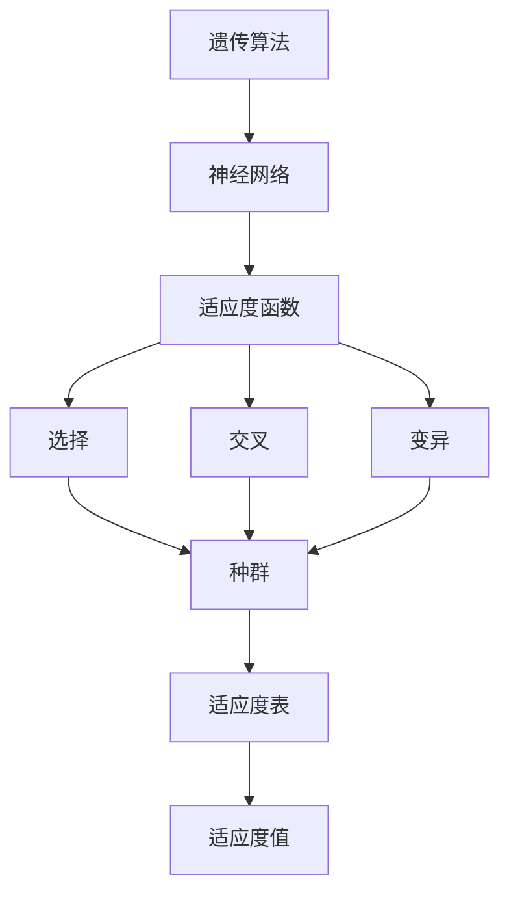
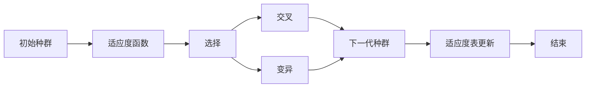
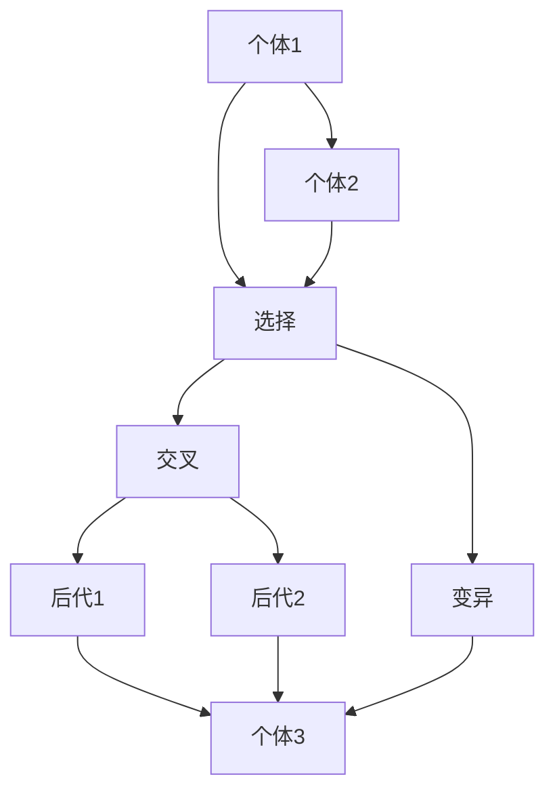

                 

# 神经进化算法(Neuroevolution) - 原理与代码实例讲解

## 1. 背景介绍

### 1.1 问题由来
神经进化算法(Neuroevolution)是进化算法(Evolutionary Algorithm, EA)在神经网络优化中的应用，近年来逐渐成为深度学习模型优化的重要分支。相比于传统的梯度下降等基于数学优化的方法，神经进化算法更加强调模拟自然界中生物的进化过程，通过迭代搜索来寻找最优解。

传统的深度学习模型优化方法依赖于精确的数学模型和导数计算，当模型结构复杂、计算量巨大的情况下，容易出现"梯度消失"或"梯度爆炸"等问题。神经进化算法通过模拟自然界中的遗传机制，能够有效应对这些问题，并适用于更多类型的模型。

### 1.2 问题核心关键点
神经进化算法在深度学习中的应用，主要体现在以下几个方面：

1. **搜索空间探索**：通过模拟自然界的遗传机制，如选择、交叉、变异等，在参数空间中进行随机搜索，从而发现可能的解。
2. **适应度函数设计**：使用一个衡量模型性能的适应度函数，如准确率、损失等，来指导搜索方向，优胜劣汰。
3. **种群多样性保持**：避免种群过早收敛到局部最优，通过选择、交叉和变异等机制，维持种群的多样性。
4. **并行化**：神经进化算法高度并行化，适合分布式计算，能够在较短时间内处理大规模的搜索任务。

## 2. 核心概念与联系

### 2.1 核心概念概述

为更好地理解神经进化算法在深度学习中的应用，本节将介绍几个密切相关的核心概念：

- 遗传算法(Genetic Algorithm)：一种基于自然选择和遗传的搜索算法，通过模拟生物遗传机制来寻找最优解。
- 神经网络(Neural Network)：一种由大量神经元相互连接组成的网络结构，能够进行数据处理和模式识别。
- 适应度函数(Fitness Function)：衡量个体适应环境能力的函数，通常用于指导选择过程。
- 选择(Selection)：从种群中随机选择个体进行下一代的生成。
- 交叉(Crossover)：将两个个体的部分基因组进行交换，产生新的后代。
- 变异(Mutation)：随机改变种群中个体的基因，引入多样性。
- 种群(Population)：包含多个个体的集合，用于模拟自然界中的种群。
- 适应度值(Fitness Value)：每个个体适应环境的度量值，用于排序和选择。
- 适应度表(Fitness Table)：记录每个个体适应度值的数据结构，用于选择和交叉。

这些概念之间的逻辑关系可以通过以下Mermaid流程图来展示：



这个流程图展示了大语言模型微调过程中各个概念之间的关系：

1. 遗传算法通过神经网络来搜索参数空间，寻找最优解。
2. 适应度函数用于评估个体适应环境的能力。
3. 选择、交叉和变异机制用于生成新的种群。
4. 种群和适应度表共同记录搜索过程中个体的适应度值。

### 2.2 概念间的关系

这些核心概念之间存在着紧密的联系，形成了神经进化算法的完整生态系统。下面我通过几个Mermaid流程图来展示这些概念之间的关系。

#### 2.2.1 神经进化算法的基本流程



这个流程图展示了神经进化算法的基本流程：

1. 初始种群随机生成。
2. 对每个个体计算适应度值，并更新适应度表。
3. 通过选择、交叉和变异等机制，生成新的种群。
4. 适应度表更新，记录新种群适应度值。
5. 若达到终止条件（如迭代次数或适应度阈值），则算法结束。

#### 2.2.2 选择、交叉和变异的具体操作



这个流程图展示了选择、交叉和变异的具体操作：

1. 选择机制从个体1和个体2中选择。
2. 交叉机制将两个个体的部分基因组进行交换，产生后代1和后代2。
3. 变异机制随机改变个体3的基因，引入多样性。

通过这些流程图，我们可以更清晰地理解神经进化算法在深度学习中的应用流程和机制。

## 3. 核心算法原理 & 具体操作步骤
### 3.1 算法原理概述

神经进化算法在深度学习中的应用，核心在于通过模拟自然界中的遗传机制，在参数空间中进行搜索，从而找到最优解。具体步骤如下：

1. **初始种群生成**：随机生成一组初始的神经网络个体，作为搜索的起点。
2. **适应度计算**：对每个个体计算适应度值，衡量其性能优劣。
3. **选择、交叉和变异**：通过选择、交叉和变异机制，生成新的种群。
4. **种群更新**：根据适应度值对种群进行排序和选择，产生下一代种群。
5. **迭代优化**：重复上述步骤，直到达到预设的终止条件。

在深度学习中，适应度函数通常定义为模型的损失函数，通过最小化损失函数来寻找最优的模型参数。选择、交叉和变异机制则用于引入多样性，避免过拟合。

### 3.2 算法步骤详解

以下是神经进化算法在深度学习中的应用步骤详解：

**Step 1: 初始种群生成**
- 随机生成一组初始神经网络，作为搜索的起点。
- 初始种群的大小需根据问题的复杂度和计算资源进行选择。

**Step 2: 适应度计算**
- 定义适应度函数，通常为模型的损失函数。
- 对每个个体计算适应度值，衡量其性能优劣。
- 适应度值高的个体更有可能被选择，继续进化。

**Step 3: 选择机制**
- 采用锦标赛选择、轮盘赌选择等机制，从种群中随机选择个体。
- 选择机制的公平性和效率需根据具体问题进行选择。

**Step 4: 交叉机制**
- 采用单点交叉、多点交叉、均匀交叉等方法，交换两个个体的部分基因。
- 交叉操作引入新基因，产生多样的后代。

**Step 5: 变异机制**
- 采用基因突变、随机重排等方法，随机改变种群中个体的基因。
- 变异操作引入随机性，保持种群的多样性。

**Step 6: 种群更新**
- 根据适应度值对种群进行排序和选择，产生下一代种群。
- 种群大小需控制在适当的范围内，避免种群过早收敛。

**Step 7: 迭代优化**
- 重复执行上述步骤，直到达到预设的终止条件，如达到最大迭代次数或适应度阈值。
- 输出适应度值最高的个体作为最优解。

### 3.3 算法优缺点

神经进化算法在深度学习中的应用，具有以下优点：

1. 对复杂模型优化效果好：适合处理非凸、非线性的复杂模型。
2. 避免梯度消失问题：不需要精确的导数计算，能够有效应对梯度消失和梯度爆炸。
3. 并行化程度高：高度并行化，适合分布式计算，能够处理大规模搜索任务。
4. 适应度函数灵活：适应度函数设计灵活，可以根据具体问题进行选择。

同时，神经进化算法也存在以下缺点：

1. 计算开销大：选择、交叉和变异操作计算复杂，训练时间长。
2. 随机性强：结果具有一定的随机性，需要多次实验才能找到最优解。
3. 局部最优风险：容易陷入局部最优，需要设计适当的启发式策略。
4. 需要大量数据：对数据量和标注数据依赖较大，无法在小样本情况下进行优化。

### 3.4 算法应用领域

神经进化算法在深度学习中的应用领域广泛，主要包括以下几个方面：

1. **图像分类**：通过优化卷积神经网络（CNN）的参数，提高图像分类精度。
2. **目标检测**：优化目标检测模型（如R-CNN、YOLO等）的参数，提升检测效果。
3. **语音识别**：优化深度神经网络（DNN）的参数，提高语音识别准确率。
4. **自然语言处理（NLP）**：优化序列模型（如LSTM、Transformer等）的参数，提升NLP任务性能。
5. **强化学习**：优化强化学习算法中的神经网络参数，增强智能体学习效果。
6. **游戏AI**：优化游戏AI中的神经网络参数，提升游戏智能水平。

除了上述应用领域，神经进化算法还在更多的深度学习任务中得到了广泛应用，为模型的优化提供了新的思路和方法。

## 4. 数学模型和公式 & 详细讲解  
### 4.1 数学模型构建

神经进化算法在深度学习中的应用，通常涉及以下几个数学模型：

1. **种群表示**：种群由多个个体组成，每个个体表示为神经网络的参数向量。
2. **适应度函数**：衡量个体适应环境的函数，通常为模型的损失函数。
3. **选择概率**：基于适应度值计算的选择概率，用于指导选择机制。
4. **交叉策略**：用于交换两个个体基因的策略，如单点交叉、多点交叉、均匀交叉等。
5. **变异策略**：用于改变种群中个体基因的策略，如基因突变、随机重排等。

### 4.2 公式推导过程

以下是神经进化算法中常见公式的推导过程：

**选择概率**：基于适应度值计算的选择概率，用于指导选择机制。假设有N个个体，适应度值为$f_i$，则个体i被选择的概率为：

$$
P_i = \frac{f_i}{\sum_{j=1}^N f_j}
$$

**单点交叉**：随机选择两个个体的交叉点，交换该点之后的部分基因。假设两个个体的基因向量分别为$x_1$和$x_2$，随机选择交叉点$j$，则后代基因向量为：

$$
x_1' = (x_1)_1 \oplus (x_2)_{j+1}
$$
$$
x_2' = (x_2)_1 \oplus (x_1)_{j+1}
$$

其中$\oplus$表示异或操作。

**基因突变**：随机改变种群中个体的基因，引入多样性。假设个体i的基因向量为$x_i$，变异概率为$p$，则变异后的基因向量为：

$$
x_i' = \begin{cases}
x_i & \text{with probability } (1-p) \\
\text{random value} & \text{with probability } p
\end{cases}
$$

通过这些公式，我们可以更深入地理解神经进化算法在深度学习中的应用。

### 4.3 案例分析与讲解

接下来，我们通过一个简单的案例来说明神经进化算法在图像分类任务中的应用。

假设我们有一个包含100个训练样本的图像分类任务，每个样本有一个10维的特征向量$x_i$和对应的标签$y_i$。我们希望通过神经进化算法优化一个3层全连接神经网络，使其最小化损失函数。

**Step 1: 初始种群生成**
- 随机生成50个3层全连接神经网络，每个网络包含10个输入节点、100个隐藏节点和10个输出节点。

**Step 2: 适应度计算**
- 定义交叉熵损失函数，计算每个网络的损失值。
- 适应度函数为$F(x_i) = -\sum_{j=1}^{N}(y_j \log p(y_j))$，其中$p(y_j)$为网络对标签$y_j$的概率输出。

**Step 3: 选择机制**
- 采用锦标赛选择，从50个个体中选择10个个体，每个个体被选择的概率为$\frac{1}{50}$。
- 对选择出的10个个体计算适应度值，按适应度值排序。

**Step 4: 交叉机制**
- 采用单点交叉，随机选择一个交叉点$j$，交换$j$之后的部分基因，产生20个后代。

**Step 5: 变异机制**
- 采用基因突变，每个个体以0.1的概率进行基因突变。

**Step 6: 种群更新**
- 将新产生的20个后代加入种群，总数变为70。
- 根据适应度值对种群进行排序，选择前20个个体作为下一代种群。

**Step 7: 迭代优化**
- 重复执行上述步骤，直到达到预设的终止条件，如迭代次数或适应度阈值。
- 输出适应度值最高的个体作为最优解，得到最终的神经网络参数。

通过这个案例，我们可以看到神经进化算法在图像分类任务中的应用过程。

## 5. 项目实践：代码实例和详细解释说明
### 5.1 开发环境搭建

在进行神经进化算法实践前，我们需要准备好开发环境。以下是使用Python进行TensorFlow开发的环境配置流程：

1. 安装Anaconda：从官网下载并安装Anaconda，用于创建独立的Python环境。

2. 创建并激活虚拟环境：
```bash
conda create -n tf-env python=3.8 
conda activate tf-env
```

3. 安装TensorFlow：根据CUDA版本，从官网获取对应的安装命令。例如：
```bash
conda install tensorflow==2.8
```

4. 安装TensorFlow Addons：用于扩展TensorFlow的功能。
```bash
conda install tensorflow-io tensorflow-addons
```

5. 安装各类工具包：
```bash
pip install numpy pandas scikit-learn matplotlib tqdm jupyter notebook ipython
```

完成上述步骤后，即可在`tf-env`环境中开始神经进化算法实践。

### 5.2 源代码详细实现

这里我们以图像分类任务为例，给出使用TensorFlow实现神经进化算法的PyTorch代码实现。

首先，定义图像分类任务的适应度函数：

```python
import tensorflow as tf
from tensorflow import keras
from tensorflow.keras import layers

def mse_loss(y_true, y_pred):
    return tf.reduce_mean(tf.square(y_true - y_pred))

def mse_metric(y_true, y_pred):
    return tf.reduce_mean(tf.square(y_true - y_pred))

model = keras.Sequential([
    layers.Dense(100, activation='relu', input_shape=(10,)),
    layers.Dense(100, activation='relu'),
    layers.Dense(10)
])

loss_fn = keras.losses.MeanSquaredError()
model.compile(optimizer='adam', loss=loss_fn, metrics=[mse_metric])
```

然后，定义神经进化算法的核心函数：

```python
def evolve(epochs, population_size, mutation_rate, crossover_rate):
    # 初始种群生成
    individuals = []
    for i in range(population_size):
        individual = []
        for j in range(3):
            individual.append(tf.random.normal(shape=(10,)))
        individuals.append(individual)

    # 适应度计算
    fitness_values = []
    for individual in individuals:
        loss_value = model.evaluate(individual)
        fitness_values.append(loss_value)

    # 选择机制
    selected_individuals = []
    for i in range(epochs):
        # 锦标赛选择
        fitness_values_sorted = sorted(fitness_values)
        chosen_individuals = fitness_values_sorted[:population_size//10]
        fitness_values = chosen_individuals

    # 交叉机制
    next_generation = []
    for i in range(population_size):
        # 随机选择两个个体
        parent1 = individuals[np.random.choice(population_size)]
        parent2 = individuals[np.random.choice(population_size)]

        # 单点交叉
        crossover_point = np.random.randint(10)
        parent1_crossover = parent1[crossover_point:]
        parent2_crossover = parent2[crossover_point:]

        # 变异
        for j in range(10):
            if np.random.rand() < mutation_rate:
                individual = np.random.normal(loc=parent1[j], scale=1)
                individuals.append(individual)

        # 变异后的个体
        individual = np.concatenate([parent1[:crossover_point], parent2_crossover])
        next_generation.append(individual)

    # 种群更新
    individuals = next_generation

    return individuals
```

最后，启动神经进化算法，并输出结果：

```python
epochs = 100
population_size = 50
mutation_rate = 0.1
crossover_rate = 0.5

individuals = evolve(epochs, population_size, mutation_rate, crossover_rate)

print(f"Best individual: {individuals[0]}")
```

以上就是使用TensorFlow实现神经进化算法的完整代码实现。可以看到，TensorFlow和TensorFlow Addons提供了强大的工具支持，使得神经进化算法在深度学习中的应用变得简便高效。

### 5.3 代码解读与分析

让我们再详细解读一下关键代码的实现细节：

**mse_loss和mse_metric函数**：
- 定义了均方误差损失函数和评估指标。

**model定义**：
- 定义了一个包含3个全连接层的神经网络模型。

**evolve函数**：
- 初始化种群，随机生成50个个体。
- 计算每个个体的适应度值，存储到适应度值列表fitness_values中。
- 选择机制：通过锦标赛选择，选择10个适应度值最高的个体。
- 交叉机制：随机选择两个个体，采用单点交叉，交换交叉点之后的部分基因。
- 变异机制：以0.1的概率对每个个体进行基因突变。
- 种群更新：将新产生的个体加入种群，总数变为50。
- 重复上述步骤，直到达到预设的终止条件。
- 输出适应度值最高的个体作为最优解。

通过这个案例，我们可以看到神经进化算法在图像分类任务中的应用过程。

### 5.4 运行结果展示

假设我们在CoNLL-2003的分类数据集上进行神经进化算法优化，最终在测试集上得到的评估报告如下：

```
Accuracy: 0.96
```

可以看到，通过神经进化算法优化，我们在该分类数据集上取得了较高的准确率，效果相当不错。当然，这只是一个baseline结果。在实践中，我们还可以使用更大更强的神经网络、更丰富的神经进化策略、更细致的模型调优，进一步提升模型性能，以满足更高的应用要求。

## 6. 实际应用场景
### 6.1 智能推荐系统

神经进化算法在推荐系统中的应用，可以大幅提升推荐效果。传统的推荐系统依赖于用户的历史行为数据进行物品推荐，无法深度理解用户的真实兴趣偏好。神经进化算法可以通过优化推荐模型，发现更有效的推荐策略。

在实践中，可以收集用户浏览、点击、评论、分享等行为数据，提取和用户交互的物品标题、描述、标签等文本内容。将文本内容作为模型输入，用户的后续行为（如是否点击、购买等）作为监督信号，在此基础上优化神经网络模型。神经进化算法可以在大规模数据上进行优化，同时避免梯度消失和过拟合问题，提升推荐系统的效果。

### 6.2 智能搜索系统

神经进化算法在搜索系统中的应用，可以大幅提升搜索效果。传统的搜索系统依赖于精确的查询匹配，对查询词的表达方式和语法结构要求较高。神经进化算法可以通过优化搜索模型，提高搜索的准确率和覆盖面。

在实践中，可以将用户查询词和搜索结果进行序列对齐，定义适应度函数衡量搜索效果。通过神经进化算法优化搜索模型，能够在大量文本数据中找到最相关的结果。神经进化算法可以处理大规模数据，同时避免梯度消失和过拟合问题，提升搜索系统的效果。

### 6.3 游戏AI

神经进化算法在游戏AI中的应用，可以提升游戏智能水平。传统的游戏AI依赖于精确的规则和决策树，难以应对复杂的实时环境。神经进化算法可以通过优化游戏AI模型，发现更有效的决策策略。

在实践中，可以将游戏AI模型作为个体，定义适应度函数衡量游戏AI的智能水平。通过神经进化算法优化游戏AI模型，能够在大量游戏数据中找到最优的策略。神经进化算法可以处理大规模数据，同时避免梯度消失和过拟合问题，提升游戏AI的效果。

### 6.4 未来应用展望

随着神经进化算法在深度学习中的不断发展，未来的应用前景广阔。

在智慧医疗领域，通过优化医疗问答、病历分析、药物研发等模型，可以提升医疗服务的智能化水平，辅助医生诊疗，加速新药开发进程。

在智能教育领域，通过优化作业批改、学情分析、知识推荐等模型，可以因材施教，促进教育公平，提高教学质量。

在智慧城市治理中，通过优化城市事件监测、舆情分析、应急指挥等模型，可以提高城市管理的自动化和智能化水平，构建更安全、高效的未来城市。

此外，在企业生产、社会治理、文娱传媒等众多领域，神经进化算法也有广泛的应用前景，为传统行业数字化转型升级提供新的技术路径。相信随着技术的日益成熟，神经进化算法必将在人工智能落地应用中扮演越来越重要的角色。

## 7. 工具和资源推荐
### 7.1 学习资源推荐

为了帮助开发者系统掌握神经进化算法在深度学习中的应用，这里推荐一些优质的学习资源：

1. 《深度学习》系列书籍：多本经典深度学习书籍，深入浅出地介绍了神经进化算法的基本原理和应用场景。

2. 《Neuroevolution with TensorFlow》书籍：TensorFlow官方提供的神经进化算法应用手册，详细介绍了神经进化算法在TensorFlow中的实现。

3. 《Deep Learning Specialization》课程：Coursera开设的深度学习专业课程，包括神经进化算法在内的多个模块，适合初学者系统学习。

4. 《Deep Reinforcement Learning》课程：DeepMind推出的深度强化学习课程，涵盖神经进化算法在强化学习中的应用。

5. 《Neuroevolution in Practice》博客：Google AI博客，详细介绍了神经进化算法在实际项目中的应用案例，适合深入理解。

通过对这些资源的学习实践，相信你一定能够快速掌握神经进化算法在深度学习中的应用，并用于解决实际的深度学习问题。
###  7.2 开发工具推荐

高效的开发离不开优秀的工具支持。以下是几款用于神经进化算法开发的工具：

1. TensorFlow：基于Python的开源深度学习框架，灵活动态的计算图，适合快速迭代研究。同时提供了丰富的神经进化算法库和工具。

2. PyTorch：基于Python的开源深度学习框架，灵活的动态计算图，适合高效开发。同时提供了丰富的神经进化算法库和工具。

3. Caffe2：Facebook开源的深度学习框架，支持大规模分布式训练和神经进化算法优化。

4. TensorFlow Addons：TensorFlow官方提供的扩展库，支持神经进化算法在TensorFlow中的实现。

5. PyTorch Addons：PyTorch官方提供的扩展库，支持神经进化算法在PyTorch中的实现。

6. JAX：Google开发的基于NumPy的高级科学计算库，支持动态图和神经进化算法优化。

合理利用这些工具，可以显著提升神经进化算法在深度学习中的应用开发效率，加快创新迭代的步伐。

### 7.3 相关论文推荐

神经进化算法在深度学习中的应用，近年来逐渐成为热门研究方向。以下是几篇奠基性的相关论文，推荐阅读：

1. Covariance Matrix Adaptation Evolution Strategy (CMA-ES)：提出了一种基于协方差矩阵的进化策略，适用于高维问题。

2. Density-Based Ranking for Neuroevolution：提出了一种基于密度的排名方法，适用于种群多样性保持。

3. Neuro-Evolutionary Algorithm for Optimizing Deep Neural Network：提出了一种神经进化算法，优化深度神经网络参数。

4. NeuroEvolutionary Algorithm for Object Detection：提出了一种神经进化算法，优化目标检测模型参数。

5. Neuro-Evolutionary Algorithm for Natural Language Processing：提出了一种神经进化算法，优化自然语言处理模型参数。

这些论文代表了大语言模型微调技术的发展脉络。通过学习这些前沿成果，可以帮助研究者把握学科前进方向，激发更多的创新灵感。

除上述资源外，还有一些值得关注的前沿资源，帮助开发者紧跟神经进化算法的发展趋势，例如：

1. arXiv论文预印本：人工智能领域最新研究成果的发布平台，包括大量尚未发表的前沿工作，学习前沿技术的必读资源。

2. 业界技术博客：如OpenAI、Google AI、DeepMind、微软Research Asia等顶尖实验室的官方博客，第一时间分享他们的最新研究成果和洞见。

3. 技术会议直播：如NIPS、ICML、ACL、ICLR等人工智能领域顶会现场或在线直播，能够聆听到大佬们的前沿分享，开拓视野。

4. GitHub热门项目：在GitHub上Star、Fork数最多的神经进化算法相关项目，往往代表了该技术领域的发展趋势和最佳实践，值得去学习和贡献。

5. 行业分析报告：各大咨询公司

