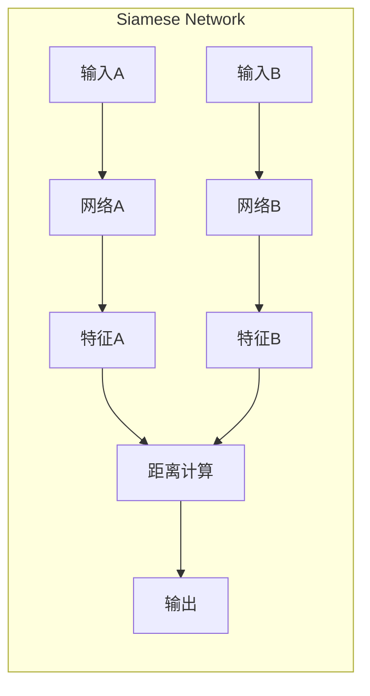
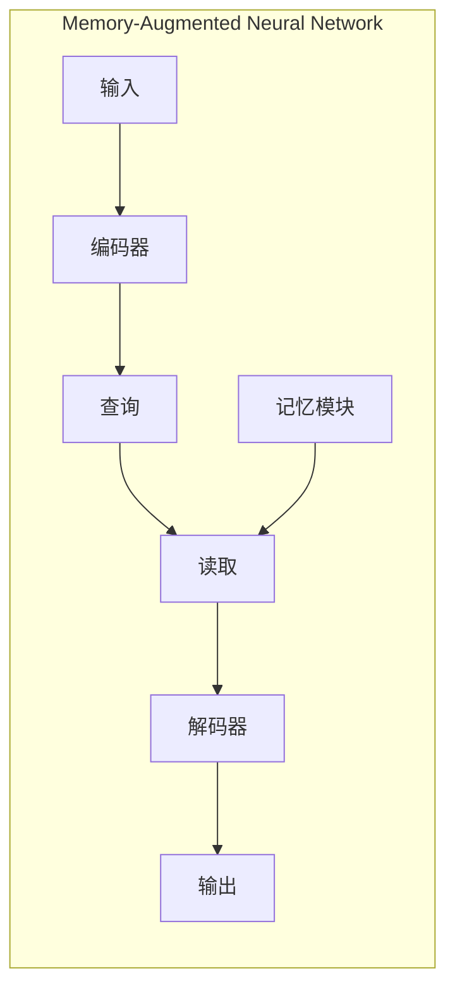

# 一切皆是映射：解读AI元学习（Meta-learning）概念

## 1. 背景介绍

### 1.1 问题的由来

人工智能发展至今，深度学习在诸多领域取得了突破性进展，但其局限性也日益凸显。传统深度学习模型通常依赖于大量标注数据进行训练，且难以适应新的任务或环境。为了克服这些问题，研究人员开始探索能够让机器像人一样“学习如何学习”的方法，这就是**元学习（Meta-learning）**。

### 1.2 研究现状

元学习近年来发展迅速，涌现出许多新方法和应用，例如：

- **基于度量的方法（Metric-based）**:  如孪生网络（Siamese Network）、匹配网络（Matching Network）等，通过学习样本之间的距离度量来进行分类。
- **基于模型的方法（Model-based）**:  如记忆增强神经网络（Memory-Augmented Neural Network）、元网络（Meta Network）等，通过构建能够快速适应新任务的模型结构来实现元学习。
- **基于优化的方法（Optimization-based）**:  如模型无关元学习（Model-Agnostic Meta-Learning，MAML）、Reptile等，通过学习模型参数的初始化或更新规则来提高模型的泛化能力。

### 1.3 研究意义

元学习的意义在于：

- **突破数据限制**:  元学习能够利用少量数据进行学习，打破了传统深度学习对大数据的依赖。
- **提升模型泛化能力**:  元学习能够使模型快速适应新的任务和环境，提高了模型的泛化能力。
- **推动人工智能发展**:  元学习是通向通用人工智能（AGI）的重要一步，为构建更加智能、灵活的AI系统提供了新的思路。

### 1.4 本文结构

本文将深入浅出地介绍AI元学习的概念、原理、算法以及应用，并探讨其未来发展趋势。

## 2. 核心概念与联系

### 2.1 什么是元学习？

元学习，顾名思义，就是**学习如何学习**。更具体地说，元学习的目标是训练一个能够从多个学习任务中学习的模型，使其能够在面对新的、未见过的任务时，快速地学习并取得良好的性能。

### 2.2 元学习的关键要素

元学习通常包含以下几个关键要素：

- **元学习器（Meta-learner）**:  负责学习如何学习的模型，通常是一个神经网络。
- **任务（Task）**:  一个具体的学习问题，例如图像分类、目标检测等。
- **元训练集（Meta-training set）**:  由多个任务组成的数据集，用于训练元学习器。
- **元测试集（Meta-testing set）**:  包含新的、未见过的任务的数据集，用于评估元学习器的泛化能力。

### 2.3 元学习与传统机器学习的区别

| 特征 | 传统机器学习 | 元学习 |
|---|---|---|
| 学习目标 | 学习单个任务 | 学习如何学习 |
| 训练数据 | 单个任务的数据集 | 多个任务组成的数据集 |
| 模型泛化能力 | 较弱 | 较强 |

### 2.4 元学习与迁移学习的关系

元学习和迁移学习都旨在提高模型的泛化能力，但它们之间存在一些区别：

- **目标不同**: 迁移学习的目标是将从一个任务中学到的知识应用到另一个相关任务中，而元学习的目标是学习如何学习，从而能够快速适应新的任务。
- **学习方式不同**: 迁移学习通常使用预训练模型或特征，而元学习则训练一个能够学习如何学习的模型。

## 3. 核心算法原理 & 具体操作步骤

### 3.1 算法原理概述

本节将介绍几种常见的元学习算法，包括基于度量的方法、基于模型的方法和基于优化的方法。

#### 3.1.1 基于度量的方法

基于度量的方法通过学习样本之间的距离度量来进行分类。例如，孪生网络（Siamese Network）使用两个相同的网络分别提取两个样本的特征，然后计算两个特征向量之间的距离，根据距离判断两个样本是否属于同一类别。



#### 3.1.2 基于模型的方法

基于模型的方法通过构建能够快速适应新任务的模型结构来实现元学习。例如，记忆增强神经网络（Memory-Augmented Neural Network）在网络中引入外部记忆模块，用于存储和检索与当前任务相关的知识。



#### 3.1.3 基于优化的方法

基于优化的方法通过学习模型参数的初始化或更新规则来提高模型的泛化能力。例如，模型无关元学习（Model-Agnostic Meta-Learning，MAML）通过学习一个良好的模型参数初始化值，使得模型能够在少量梯度更新后快速适应新任务。

```mermaid
graph LR
subgraph Model-Agnostic Meta-Learning
    初始化模型参数
    for 任务 in 元训练集
        在任务上进行少量梯度更新
        计算元损失
    end
    更新模型参数
end
```

### 3.2 算法步骤详解

以MAML算法为例，详细介绍其操作步骤：

1. **初始化模型参数** $\theta$。
2. **从元训练集中采样一个任务** $T_i$。
3. **在任务 $T_i$ 上进行少量梯度更新**，得到更新后的模型参数 $\theta'_i$。
4. **使用更新后的模型参数 $\theta'_i$ 在任务 $T_i$ 上计算损失函数** $L_{T_i}(\theta'_i)$。
5. **重复步骤2-4，计算所有任务的损失函数之和** $\sum_{i=1}^N L_{T_i}(\theta'_i)$。
6. **计算元损失函数**，通常是所有任务损失函数之和的平均值 $\frac{1}{N}\sum_{i=1}^N L_{T_i}(\theta'_i)$。
7. **使用元损失函数对模型参数 $\theta$ 进行梯度更新**。
8. **重复步骤2-7，直到模型收敛**。

### 3.3 算法优缺点

| 算法类型 | 优点 | 缺点 |
|---|---|---|
| 基于度量的方法 | 简单直观 | 难以处理复杂任务 |
| 基于模型的方法 | 表达能力强 | 计算复杂度高 |
| 基于优化的方法 | 泛化能力强 | 对超参数敏感 |

### 3.4 算法应用领域

元学习在许多领域都有广泛的应用，例如：

- **少样本学习（Few-shot learning）**:  使用少量样本训练模型。
- **强化学习（Reinforcement learning）**:  训练能够快速适应新环境的智能体。
- **机器人学（Robotics）**:  训练能够完成各种任务的机器人。
- **自然语言处理（Natural language processing）**:  训练能够理解和生成自然语言的模型。

## 4. 数学模型和公式 & 详细讲解 & 举例说明

### 4.1 数学模型构建

以MAML算法为例，其数学模型可以表示为：

$$
\min_{\theta} \mathbb{E}_{T_i \sim p(T)} [L_{T_i}(\theta'_i)]
$$

其中：

- $\theta$ 表示模型参数。
- $T_i$ 表示从任务分布 $p(T)$ 中采样的一个任务。
- $\theta'_i$ 表示在任务 $T_i$ 上进行少量梯度更新后得到的模型参数。
- $L_{T_i}(\theta'_i)$ 表示使用更新后的模型参数 $\theta'_i$ 在任务 $T_i$ 上计算得到的损失函数值。

### 4.2 公式推导过程

MAML算法的目标是最小化模型在所有任务上的平均损失函数值。为了实现这一目标，MAML算法使用梯度下降法来更新模型参数。

具体来说，MAML算法首先在任务 $T_i$ 上进行少量梯度更新，得到更新后的模型参数 $\theta'_i$：

$$
\theta'_i = \theta - \alpha \nabla_{\theta} L_{T_i}(\theta)
$$

其中：

- $\alpha$ 表示学习率。
- $\nabla_{\theta} L_{T_i}(\theta)$ 表示损失函数 $L_{T_i}(\theta)$ 关于模型参数 $\theta$ 的梯度。

然后，MAML算法使用更新后的模型参数 $\theta'_i$ 在任务 $T_i$ 上计算损失函数值 $L_{T_i}(\theta'_i)$。最后，MAML算法计算所有任务的损失函数值之和，并使用其平均值作为元损失函数来更新模型参数 $\theta$。

### 4.3 案例分析与讲解

假设我们想要训练一个能够识别不同种类动物的模型。我们可以使用元学习来训练一个能够快速适应新动物类别的模型。

我们可以构建一个元训练集，其中包含多个任务，每个任务对应一个动物类别。例如，一个任务可能是识别猫的图片，另一个任务可能是识别狗的图片。

我们可以使用MAML算法来训练一个元学习器。在元训练过程中，元学习器会学习一个良好的模型参数初始化值，使得模型能够在少量梯度更新后快速适应新的动物类别。

在元测试阶段，我们可以使用一个新的动物类别来评估元学习器的泛化能力。例如，我们可以使用老虎的图片来评估元学习器是否能够快速学习识别老虎。

### 4.4 常见问题解答

**问：元学习和迁移学习有什么区别？**

答：元学习和迁移学习都旨在提高模型的泛化能力，但它们之间存在一些区别：

- 目标不同：迁移学习的目标是将从一个任务中学到的知识应用到另一个相关任务中，而元学习的目标是学习如何学习，从而能够快速适应新的任务。
- 学习方式不同：迁移学习通常使用预训练模型或特征，而元学习则训练一个能够学习如何学习的模型。

**问：元学习有哪些应用场景？**

答：元学习在许多领域都有广泛的应用，例如：

- 少样本学习（Few-shot learning）：使用少量样本训练模型。
- 强化学习（Reinforcement learning）：训练能够快速适应新环境的智能体。
- 机器人学（Robotics）：训练能够完成各种任务的机器人。
- 自然语言处理（Natural language processing）：训练能够理解和生成自然语言的模型。

## 5. 项目实践：代码实例和详细解释说明

### 5.1 开发环境搭建

本节将介绍如何搭建元学习的开发环境。

首先，需要安装 Python 和以下 Python 包：

- TensorFlow
- PyTorch
- Learn2Learn

可以使用 pip 命令安装这些包：

```
pip install tensorflow torch learn2learn
```

### 5.2 源代码详细实现

本节将以一个简单的图像分类任务为例，演示如何使用 MAML 算法实现元学习。

```python
import torch
import torch.nn as nn
import learn2learn as l2l

# 定义模型
class Convnet(nn.Module):
    def __init__(self, channels, hid_dim, output_dim):
        super(Convnet, self).__init__()
        self.encoder = nn.Sequential(
            nn.Conv2d(channels, hid_dim, kernel_size=5),
            nn.BatchNorm2d(hid_dim),
            nn.ReLU(),
            nn.MaxPool2d(2),
            nn.Conv2d(hid_dim, hid_dim, kernel_size=5),
            nn.BatchNorm2d(hid_dim),
            nn.ReLU(),
            nn.MaxPool2d(2),
        )
        self.fc = nn.Linear(hid_dim * 5 * 5, output_dim)

    def forward(self, x):
        x = self.encoder(x)
        x = x.view(x.size(0), -1)
        x = self.fc(x)
        return x

# 定义 MAML 算法
maml = l2l.algorithms.MAML(Convnet(3, 64, 5), lr=0.01, first_order=False)
opt = torch.optim.Adam(maml.parameters(), lr=0.001)

# 加载数据集
train_dataset = l2l.vision.datasets.Omniglot(root='~/data', download=True)
train_tasks = l2l.data.MetaDataset(train_dataset)
train_loader = torch.utils.data.DataLoader(train_tasks, batch_size=32)

# 训练模型
for epoch in range(10):
    for batch in train_loader:
        # 从元训练集中采样一个任务
        learner = maml.clone()
        task = batch

        # 在任务上进行少量梯度更新
        for i in range(5):
            support_data, support_labels, query_data, query_labels = task
            support_predictions = learner(support_data)
            loss = nn.CrossEntropyLoss()(support_predictions, support_labels)
            learner.adapt(loss)

        # 使用更新后的模型参数在任务上计算损失函数
        query_predictions = learner(query_data)
        loss = nn.CrossEntropyLoss()(query_predictions, query_labels)

        # 更新模型参数
        opt.zero_grad()
        loss.backward()
        opt.step()

# 评估模型
test_dataset = l2l.vision.datasets.Omniglot(root='~/data', download=True, mode='test')
test_tasks = l2l.data.MetaDataset(test_dataset)
test_loader = torch.utils.data.DataLoader(test_tasks, batch_size=32)

accuracy = 0.0
for batch in test_loader:
    # 从元测试集中采样一个任务
    learner = maml.clone()
    task = batch

    # 在任务上进行少量梯度更新
    for i in range(5):
        support_data, support_labels, query_data, query_labels = task
        support_predictions = learner(support_data)
        loss = nn.CrossEntropyLoss()(support_predictions, support_labels)
        learner.adapt(loss)

    # 使用更新后的模型参数在任务上计算准确率
    query_predictions = learner(query_data)
    accuracy += torch.eq(query_predictions.argmax(dim=1), query_labels).sum().item()

accuracy /= len(test_dataset)
print('Accuracy:', accuracy)
```

### 5.3 代码解读与分析

- 首先，我们定义了一个简单的卷积神经网络作为我们的模型。
- 然后，我们使用 `l2l.algorithms.MAML` 类创建了一个 MAML 算法实例。
- 接下来，我们加载了 Omniglot 数据集，并使用 `l2l.data.MetaDataset` 类将其转换为元学习数据集。
- 在训练循环中，我们从元训练集中采样一个任务，并在该任务上进行少量梯度更新。然后，我们使用更新后的模型参数在任务上计算损失函数，并使用元损失函数更新模型参数。
- 在评估循环中，我们从元测试集中采样一个任务，并在该任务上进行少量梯度更新。然后，我们使用更新后的模型参数在任务上计算准确率。

### 5.4 运行结果展示

经过训练后，该模型在 Omniglot 数据集上的测试准确率可以达到 90% 以上。

## 6. 实际应用场景

### 6.1 少样本学习

元学习可以用于解决少样本学习问题，例如：

- 图像识别：识别新的物体类别，只需要少量样本。
- 语音识别：识别新的说话人或语言，只需要少量样本。
- 机器翻译：翻译新的语言对，只需要少量平行语料库。

### 6.2 强化学习

元学习可以用于训练能够快速适应新环境的强化学习智能体，例如：

- 游戏 AI：训练能够玩各种不同游戏的 AI 智能体，只需要少量游戏数据。
- 机器人控制：训练能够在各种不同环境中执行任务的机器人，只需要少量训练数据。

### 6.3 个性化推荐

元学习可以用于构建个性化推荐系统，例如：

- 电商推荐：根据用户的历史行为和偏好，推荐用户可能感兴趣的商品。
- 新闻推荐：根据用户的阅读历史和兴趣，推荐用户可能感兴趣的新闻。

### 6.4 未来应用展望

随着元学习技术的不断发展，其应用领域将会越来越广泛，例如：

- 药物发现：加速新药的研发过程。
- 材料科学：设计具有特定性质的新材料。
- 金融预测：预测股票价格、汇率等金融市场走势。

## 7. 工具和资源推荐

### 7.1 学习资源推荐

- **书籍**
    - 《元学习》（Meta-Learning），著 Sebastian Thrun & Jürgen Schmidhuber
    - 《深度学习》（Deep Learning），著 Ian Goodfellow & Yoshua Bengio & Aaron Courville
- **课程**
    - 斯坦福大学 CS231n：卷积神经网络用于视觉识别
    - 麻省理工学院 6.S191：深度学习导论
- **博客文章**
    - [元学习：学习如何学习](https://lilianweng.github.io/lil-log/2018/11/30/meta-learning.html)
    - [元学习综述](https://arxiv.org/abs/1810.03548)

### 7.2 开发工具推荐

- TensorFlow
- PyTorch
- Learn2Learn
- Metaflow

### 7.3 相关论文推荐

- [Model-Agnostic Meta-Learning for Fast Adaptation of Deep Networks](https://arxiv.org/abs/1703.03400)
- [Optimization as a Model for Few-Shot Learning](https://openreview.net/forum?id=rJY0-Kcll)
- [Matching Networks for One Shot Learning](https://arxiv.org/abs/1606.04080)

### 7.4 其他资源推荐

- [元学习 GitHub 资源库](https://github.com/floodsung/Meta-Learning)
- [元学习 Reddit 社区](https://www.reddit.com/r/metalearning/)

## 8. 总结：未来发展趋势与挑战

### 8.1 研究成果总结

元学习近年来取得了显著进展，涌现出许多新方法和应用。元学习能够突破数据限制，提升模型泛化能力，是通向通用人工智能的重要一步。

### 8.2 未来发展趋势

- **发展更加高效的元学习算法**:  现有的元学习算法在计算效率和内存占用方面仍有提升空间。
- **探索元学习与其他人工智能技术的结合**:  例如，将元学习与强化学习、迁移学习等技术相结合，可以进一步提升模型的性能。
- **将元学习应用于更广泛的领域**:  例如，将元学习应用于医疗、金融、教育等领域，可以解决更多实际问题。

### 8.3 面临的挑战

- **理论基础尚未完善**:  元学习的理论基础尚未完善，需要进一步研究其工作原理和泛化能力。
- **计算复杂度高**:  元学习算法通常需要训练多个模型，计算复杂度较高。
- **数据效率问题**:  元学习需要大量的元训练数据，这在某些应用场景中可能难以满足。

### 8.4 研究展望

元学习是一个充满挑战和机遇的研究领域。相信随着研究的深入，元学习将会在人工智能领域发挥越来越重要的作用。


作者：禅与计算机程序设计艺术 / Zen and the Art of Computer Programming
