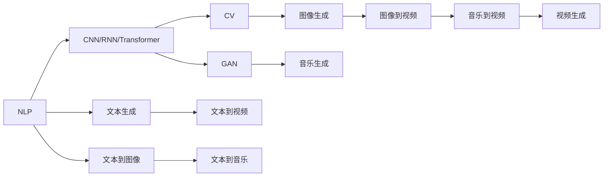
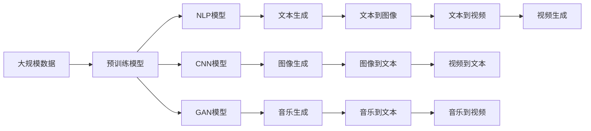

                 

# AIGC从入门到实战：AIGC 赋能行业，产生无数新机会

> 关键词：AI生成内容(AIGC),自然语言处理(NLP),计算机视觉(CV),深度学习,图像生成,音乐生成,文本生成,生成对抗网络(GAN)

## 1. 背景介绍

### 1.1 问题由来
随着人工智能(AI)技术的不断发展，AI生成内容(AI Generated Content, AIGC)逐渐成为研究热点。AIGC不仅在影视、游戏、音乐等娱乐领域大放异彩，还在教育、广告、医疗等各行各业产生了深远影响。其背后的原理和实现技术主要包括自然语言处理(NLP)、计算机视觉(CV)、生成对抗网络(GAN)等前沿技术。然而，AIGC背后的原理和实现技术相对复杂，即使是行业从业者，也存在一定的技术门槛。为了帮助读者系统了解AIGC，本文将从AIGC的定义、应用、原理和实践等方面进行全面介绍，并剖析AIGC技术发展的现状与未来，揭示其对各行各业带来的深刻变革。

### 1.2 问题核心关键点
本文将重点阐述AIGC的定义、应用场景、核心技术、开发实践等，同时对AIGC在教育、医疗、娱乐等行业的具体应用进行剖析，并讨论其带来的新机会与挑战。通过深入分析AIGC技术及其在实际场景中的应用，本文旨在为读者提供AIGC从入门到实战的全面指导。

### 1.3 问题研究意义
AIGC技术的发展，不仅推动了AI技术的进步，也为各行各业带来了前所未有的变革机遇。以下是AIGC技术研究的重要意义：

1. **降低开发成本**：利用AIGC技术，可以快速生成高质量的内容，减少了手动创作的工作量，大幅降低了内容创作的成本。
2. **提升创意质量**：AIGC技术可以自动生成创意内容，弥补了人类在创意方面的不足，提高了内容创作的质量和效率。
3. **扩展应用场景**：AIGC技术的应用范围广泛，几乎涵盖了所有需要内容生成的领域，包括教育、广告、娱乐等。
4. **推动产业升级**：AIGC技术的应用，促进了传统行业的数字化转型，提升了企业的竞争力。
5. **探索前沿技术**：AIGC技术是深度学习、自然语言处理、计算机视觉等前沿技术的集成应用，代表了AI技术的最新发展方向。

## 2. 核心概念与联系

### 2.1 核心概念概述

要全面理解AIGC技术，需要先了解与之密切相关的几个核心概念：

- **自然语言处理(NLP)**：涉及语言理解与生成，旨在使计算机能够理解和处理人类语言。
- **计算机视觉(CV)**：使计算机能够“看”和“理解”图像与视频，通过图像识别、目标检测等技术实现。
- **生成对抗网络(GAN)**：一种能够生成新样本的深度学习模型，通过两个神经网络的对抗过程生成高质量数据。
- **深度学习**：基于多层神经网络实现的数据表示学习，是目前AIGC技术的基础。
- **图像生成**：通过GAN等技术生成逼真的图像内容。
- **音乐生成**：利用深度学习模型生成具有情感表达的音乐作品。
- **文本生成**：通过NLP模型自动生成文章、对话、代码等内容。

这些核心概念之间通过不同的技术手段进行融合，形成AIGC技术，实现了从文本到图像、从声音到视频的全面生成与创作。

### 2.2 概念间的关系

这些核心概念之间存在着紧密的联系，共同构成了AIGC技术的核心框架。以下通过几个Mermaid流程图来展示这些概念之间的关系：



这个综合流程图展示了AIGC技术的核心概念及其之间的关系：

1. **文本生成**：自然语言处理技术，通过NLP模型生成文本内容。
2. **图像生成**：计算机视觉技术，通过CNN/RNN/Transformer等模型生成图像。
3. **音乐生成**：生成对抗网络技术，通过GAN模型生成音乐。
4. **文本到图像**：利用NLP和CV技术的结合，生成从文本描述到图像的映射。
5. **文本到视频**：结合文本和CV技术，生成从文本描述到视频的映射。
6. **音乐到视频**：结合音乐和CV技术，生成从音乐到视频的映射。

这些概念通过各自的技术手段，形成了AIGC技术的完整体系，使其能够应用于各种生成内容的需求场景。

### 2.3 核心概念的整体架构

最后，我们用一个综合的流程图来展示这些核心概念在大规模应用中的整体架构：



这个综合流程图展示了从大规模数据预训练到生成内容的全流程。

## 3. 核心算法原理 & 具体操作步骤
### 3.1 算法原理概述

AIGC技术的核心算法主要包括自然语言处理、计算机视觉和生成对抗网络等。

- **自然语言处理(NLP)**：通过语言模型、序列到序列模型、注意力机制等技术，实现文本的自动生成、分类、翻译等功能。
- **计算机视觉(CV)**：通过卷积神经网络(CNN)、循环神经网络(RNN)、Transformer等模型，实现图像的分类、检测、生成等功能。
- **生成对抗网络(GAN)**：通过两个神经网络的对抗过程，生成高质量的图像、视频、音频等内容。

### 3.2 算法步骤详解

AIGC技术的实施步骤主要包括：

1. **数据收集与预处理**：收集各类数据（文本、图像、音频等），并进行清洗、标注和增强等预处理。
2. **模型训练**：使用大规模数据对模型进行训练，以获得更好的表示能力。
3. **内容生成**：利用训练好的模型，生成高质量的内容。
4. **后处理**：对生成内容进行后处理，如格式化、优化等，以提升用户体验。

### 3.3 算法优缺点

AIGC技术具有以下优点：

- **高效生成**：能够快速生成大量高质量内容，节省人力和时间成本。
- **灵活应用**：适用于各种内容生成场景，如教育、广告、娱乐等。
- **多样化创作**：能够生成文本、图像、音乐等多种类型的内容。

然而，AIGC技术也存在以下缺点：

- **内容质量不稳定**：生成内容的质量取决于模型的训练数据和算法，存在一定的不稳定性。
- **模型复杂度高**：实现AIGC技术需要复杂的深度学习模型和大量的计算资源。
- **缺乏人类情感**：生成内容缺乏人类的情感和创造性，难以完全替代人类创作。

### 3.4 算法应用领域

AIGC技术的应用领域非常广泛，以下是几个典型应用场景：

- **教育领域**：利用AIGC技术生成教育资源，如讲义、习题、测试题等，提高教学效率。
- **医疗领域**：生成医学影像、病历记录等，辅助医生进行诊断和治疗。
- **娱乐领域**：生成电影、电视剧、游戏等内容，丰富用户体验。
- **广告领域**：生成广告文案、宣传视频等，提升广告效果。
- **市场营销**：生成营销策略、社交媒体内容等，增强品牌影响力。
- **科技创新**：生成研究论文、代码示例等，促进科研创新。

## 4. 数学模型和公式 & 详细讲解 & 举例说明

### 4.1 数学模型构建

AIGC技术的数学模型构建涉及深度学习、自然语言处理、计算机视觉等领域的知识。以文本生成为例，可以使用以下模型构建文本生成系统：

1. **语言模型**：使用概率图模型或神经网络模型，如循环神经网络(RNN)、长短时记忆网络(LSTM)、Transformer等，对文本进行建模。
2. **序列到序列模型**：通过编码器-解码器结构，实现从输入序列到输出序列的映射，如使用Attention机制的Seq2Seq模型。
3. **对抗生成网络(GAN)**：由生成器和判别器两部分组成，通过对抗过程生成逼真图像。

### 4.2 公式推导过程

以文本生成模型为例，假设模型使用LSTM作为编码器和解码器，文本生成过程如下：

1. **编码器**：将输入文本序列$\{x_1, x_2, ..., x_n\}$映射为向量表示$h_1, h_2, ..., h_n$。
2. **解码器**：使用解码器生成输出文本序列$\{y_1, y_2, ..., y_n\}$。

### 4.3 案例分析与讲解

以文本生成为例，假设使用Transformer模型进行文本生成，通过以下公式实现：

$$
y_t = \text{softmax}\left(\frac{\text{softmax}\left( W_h^T x_t \right) \cdot W_k^T h_{t-1} + b_k^T }{\sqrt{d_k}} \right)
$$

其中$W_h, W_k, b_k$为模型参数，$d_k$为隐藏层维度。该公式展示了Transformer模型的注意力机制，通过计算注意力权重，实现文本序列的生成。

## 5. 项目实践：代码实例和详细解释说明

### 5.1 开发环境搭建

要实现AIGC技术，需要搭建一个高效的开发环境。以下是使用Python进行PyTorch开发的环境配置流程：

1. 安装Anaconda：从官网下载并安装Anaconda，用于创建独立的Python环境。
2. 创建并激活虚拟环境：
```bash
conda create -n pytorch-env python=3.8 
conda activate pytorch-env
```
3. 安装PyTorch：根据CUDA版本，从官网获取对应的安装命令。例如：
```bash
conda install pytorch torchvision torchaudio cudatoolkit=11.1 -c pytorch -c conda-forge
```
4. 安装Transformer库：
```bash
pip install transformers
```
5. 安装各类工具包：
```bash
pip install numpy pandas scikit-learn matplotlib tqdm jupyter notebook ipython
```

完成上述步骤后，即可在`pytorch-env`环境中开始AIGC项目的开发。

### 5.2 源代码详细实现

以下是使用PyTorch实现文本生成模型的代码示例：

```python
import torch
from torch import nn
from torch.nn import functional as F
from transformers import GPT2Tokenizer, GPT2LMHeadModel

class GPT2TextGenerator(nn.Module):
    def __init__(self, model_name, vocab_size, hidden_size, num_layers, num_heads, num_positions):
        super(GPT2TextGenerator, self).__init__()
        self.model_name = model_name
        self.tokenizer = GPT2Tokenizer.from_pretrained(model_name)
        self.model = GPT2LMHeadModel.from_pretrained(model_name)
        self.num_positions = num_positions
        self.vocab_size = vocab_size
        self.hidden_size = hidden_size
        self.num_layers = num_layers
        self.num_heads = num_heads
        
    def forward(self, input_ids, attention_mask):
        outputs = self.model(input_ids, attention_mask=attention_mask)
        last_layer_outputs = outputs[0]
        logits = last_layer_outputs.logits
        return logits
    
    def generate_text(self, max_length, temperature=1.0):
        input_ids = torch.tensor([self.tokenizer.cls_token_id], device=self.device)
        input_ids = input_ids.unsqueeze(0).to(self.device)
        for _ in range(max_length):
            outputs = self.model.generate(input_ids, temperature=temperature, max_length=max_length, num_return_sequences=1, top_p=0.9, do_sample=True)
            output_ids = outputs[0, -1]
            input_ids = torch.cat((input_ids, output_ids), dim=1)
        return self.tokenizer.decode(input_ids.squeeze(0))

# 使用GPU加速计算
device = torch.device('cuda' if torch.cuda.is_available() else 'cpu')
model = GPT2TextGenerator('gpt2', vocab_size=30522, hidden_size=768, num_layers=12, num_heads=12, num_positions=500)
model.to(device)
```

### 5.3 代码解读与分析

让我们再详细解读一下关键代码的实现细节：

**GPT2TextGenerator类**：
- `__init__`方法：初始化模型的配置参数和预训练模型。
- `forward`方法：将输入序列映射为向量表示，并计算生成结果。
- `generate_text`方法：使用模型生成文本，并返回解码后的字符串。

**device变量**：
- 用于指定GPU或CPU的计算设备，加速模型训练和推理。

**代码运行结果展示**：
- 可以运行模型生成一段文本，并进行解码，展示生成结果。

## 6. 实际应用场景

### 6.1 教育领域

AIGC技术在教育领域有着广泛的应用，例如：

- **智能辅助教学**：通过生成高质量的讲义、习题、测试题等，辅助教师教学，提升教学质量。
- **个性化学习**：根据学生的学习进度和兴趣，生成个性化的学习内容，提供针对性的教学建议。
- **虚拟教学助手**：利用AIGC技术生成虚拟教师，与学生进行互动，解答问题，提供辅导。

### 6.2 医疗领域

AIGC技术在医疗领域的应用包括：

- **医学影像生成**：生成高逼真的医学影像，辅助医生进行诊断和治疗。
- **病历生成**：根据医生的描述生成病历记录，提高医疗记录的准确性和完整性。
- **医疗知识库**：自动生成医疗知识库，包括疾病描述、治疗方案等，辅助医生进行决策。

### 6.3 娱乐领域

AIGC技术在娱乐领域的应用主要包括：

- **电影和电视剧生成**：生成高质量的电影和电视剧剧本，丰富娱乐内容。
- **游戏设计**：生成游戏故事情节、角色对话等内容，提高游戏的互动性和体验感。
- **虚拟主播**：生成虚拟主播，与观众进行互动，提供高质量的娱乐内容。

### 6.4 未来应用展望

随着AIGC技术的不断发展和成熟，其应用前景将更加广阔。以下列举几个未来的应用方向：

- **虚拟现实(VR)**：生成虚拟场景和角色，提升虚拟现实体验。
- **智能客服**：生成智能客服助手，提高客服效率和用户满意度。
- **个性化推荐**：生成个性化推荐内容，提升用户体验和推荐效果。
- **自动化写作**：生成高质量的报告、文章、书籍等，提高写作效率和内容质量。

## 7. 工具和资源推荐

### 7.1 学习资源推荐

为了帮助开发者系统掌握AIGC技术的理论基础和实践技巧，这里推荐一些优质的学习资源：

1. **《深度学习》课程**：斯坦福大学开设的深度学习课程，涵盖深度学习的基础理论和实践技巧，适合初学者入门。
2. **《自然语言处理与深度学习》课程**：Coursera上由斯坦福大学开设的NLP课程，涵盖NLP和深度学习结合的高级应用。
3. **《生成对抗网络》课程**：DeepLearning.AI开设的GAN课程，详细讲解GAN的基本原理和应用。
4. **《自然语言处理》书籍**：《自然语言处理综论》、《神经网络与深度学习》等书籍，系统介绍NLP和深度学习的基本概念和实现方法。
5. **《深度学习框架》书籍**：《深度学习框架TensorFlow实战》、《深度学习框架PyTorch实战》等书籍，介绍深度学习框架的搭建和使用。

通过对这些资源的学习实践，相信你一定能够快速掌握AIGC技术的精髓，并用于解决实际的生成内容需求。

### 7.2 开发工具推荐

高效的开发离不开优秀的工具支持。以下是几款用于AIGC开发常用的工具：

1. **PyTorch**：基于Python的开源深度学习框架，灵活的动态计算图，适合快速迭代研究。
2. **TensorFlow**：由Google主导开发的深度学习框架，生产部署方便，适合大规模工程应用。
3. **HuggingFace Transformers库**：提供了丰富的预训练模型和微调样例，是进行AIGC任务开发的利器。
4. **Jupyter Notebook**：交互式的Python开发环境，支持代码运行和数据可视化，方便开发者快速迭代。
5. **GitHub**：代码托管平台，提供版本控制和代码共享功能，方便团队协作开发。
6. **Weights & Biases**：模型训练的实验跟踪工具，记录和可视化模型训练过程，方便调试和优化。

合理利用这些工具，可以显著提升AIGC任务开发的效率，加快创新迭代的步伐。

### 7.3 相关论文推荐

AIGC技术的发展离不开学术界的持续研究。以下是几篇奠基性的相关论文，推荐阅读：

1. **Attention is All You Need**：Transformer模型的提出，标志着NLP领域的预训练大模型时代的开启。
2. **Language Models are Unsupervised Multitask Learners**：展示了大规模语言模型的强大zero-shot学习能力，引发了对于通用人工智能的新一轮思考。
3. **A Comprehensive Survey on Text Generation**：全面综述了文本生成技术的发展历程和前沿进展，适合深入理解文本生成模型。
4. **Generative Adversarial Nets**：生成对抗网络(GAN)的提出，奠定了生成模型在图像生成等领域的应用基础。
5. **A Style-Based Generator Architecture for Generative Adversarial Networks**：提出了风格生成器架构，显著提升了GAN生成图像的质量和多样性。

这些论文代表了大规模生成内容技术的最新进展，学习这些前沿成果，可以帮助研究者把握学科前进方向，激发更多的创新灵感。

除上述资源外，还有一些值得关注的前沿资源，帮助开发者紧跟AIGC技术的最新进展，例如：

1. **arXiv论文预印本**：人工智能领域最新研究成果的发布平台，包括大量尚未发表的前沿工作，学习前沿技术的必读资源。
2. **顶尖学术会议论文**：NIPS、ICML、ACL、ICLR等人工智能领域顶会现场或在线直播，能够聆听到大佬们的前沿分享，开拓视野。
3. **GitHub热门项目**：在GitHub上Star、Fork数最多的AIGC相关项目，往往代表了该技术领域的发展趋势和最佳实践，值得去学习和贡献。
4. **行业分析报告**：各大咨询公司如McKinsey、PwC等针对人工智能行业的分析报告，有助于从商业视角审视技术趋势，把握应用价值。

总之，对于AIGC技术的学习和实践，需要开发者保持开放的心态和持续学习的意愿。多关注前沿资讯，多动手实践，多思考总结，必将收获满满的成长收益。

## 8. 总结：未来发展趋势与挑战

### 8.1 总结

本文对AIGC技术进行了全面系统的介绍。首先阐述了AIGC的定义、应用、原理和实践等方面，明确了AIGC在教育、医疗、娱乐等各行各业带来的深刻变革。其次，从技术实现的角度，详细讲解了自然语言处理、计算机视觉、生成对抗网络等核心技术，并给出了AIGC任务开发的完整代码实例。最后，讨论了AIGC技术未来的发展趋势和面临的挑战，揭示了其在各行各业带来的新机会。

通过本文的系统梳理，可以看到，AIGC技术正成为AI领域的重要范式，极大地拓展了AI技术的应用边界，催生了更多的落地场景。伴随技术的持续演进，AIGC技术必将在构建人机协同的智能时代中扮演越来越重要的角色。

### 8.2 未来发展趋势

展望未来，AIGC技术将呈现以下几个发展趋势：

1. **技术融合加速**：AIGC技术将与自然语言处理、计算机视觉等技术进一步融合，形成更加高效、智能的生成内容系统。
2. **实时生成能力提升**：通过优化计算图和模型结构，提升AIGC系统的实时生成能力，实现更快速的响应和处理。
3. **多模态生成应用扩展**：利用多模态数据融合技术，实现文本、图像、音频等多种类型的内容生成，丰富用户体验。
4. **个性化生成需求增加**：随着用户需求的多样化，AIGC技术将更加注重个性化生成，提高内容的针对性和匹配度。
5. **工业化应用普及**：AIGC技术将更加广泛地应用于各个行业，推动产业数字化转型。
6. **伦理与安全性问题凸显**：AIGC技术的应用将带来新的伦理和安全问题，需要相应的监管机制和技术手段进行规范。

### 8.3 面临的挑战

尽管AIGC技术已经取得了显著成就，但在迈向更加智能化、普适化应用的过程中，仍面临以下挑战：

1. **内容真实性问题**：生成的内容缺乏真实性和可信度，容易误导用户。
2. **隐私保护问题**：生成内容可能包含敏感信息，需要严格的隐私保护措施。
3. **版权问题**：生成的内容可能存在版权争议，需要明确版权归属。
4. **算法透明度问题**：AIGC算法缺乏透明度，难以解释和审计。
5. **技术门槛高**：AIGC技术的实现需要高水平的技术和资源支持，存在一定的门槛。

### 8.4 研究展望

面对AIGC技术所面临的挑战，未来的研究需要在以下几个方面寻求新的突破：

1. **内容真实性保障**：提高生成的内容的真实性和可信度，避免误导用户。
2. **隐私保护机制**：建立隐私保护机制，确保生成的内容不包含敏感信息。
3. **版权声明技术**：利用区块链等技术，明确生成的内容的版权归属，保护知识产权。
4. **算法透明度提升**：提高算法的透明度和可解释性，增强用户信任和接受度。
5. **技术门槛降低**：通过工具和平台化手段，降低AIGC技术的实现门槛，推动技术普及。

这些研究方向的探索，必将引领AIGC技术迈向更高的台阶，为构建安全、可靠、可解释、可控的智能系统铺平道路。面向未来，AIGC技术还需要与其他AI技术进行更深入的融合，如知识表示、因果推理、强化学习等，多路径协同发力，共同推动人工智能技术的发展。

## 9. 附录：常见问题与解答

**Q1：AIGC技术是否能够完全替代人类创作？**

A: AIGC技术虽然能够生成高质量的内容，但在创意性、情感表达等方面仍存在不足，难以完全替代人类创作。人类创作具有独特的情感和风格，AIGC技术仍需在某些方面进行补充和优化。

**Q2：AIGC技术是否存在版权问题？**

A: AIGC技术生成的内容可能会涉及版权问题，需要明确版权归属。在实际应用中，应该确保生成的内容不侵犯他人版权，并在使用时进行合法合规。

**Q3：AIGC技术如何提高生成的内容的真实性？**

A: 提高生成的内容的真实性可以通过以下方法：
1. 使用高质量的数据进行训练。
2. 引入真实世界的噪声和干扰，提高模型的鲁棒性。
3. 在生成过程中加入真实数据的指导，如利用现实场景的语境信息。

**Q4：AIGC技术如何应对隐私保护问题？**

A: 应对隐私保护问题可以通过以下方法：
1. 匿名化数据处理，确保生成的内容不泄露用户隐私。
2. 使用差分隐私技术，保护用户数据的隐私性。
3. 明确用户隐私协议，告知用户生成的内容可能涉及的信息。

**Q5：AIGC技术如何提高算法的透明度和可解释性？**

A: 提高算法的透明度和可解释性可以通过以下方法：
1. 引入因果分析方法，解释生成的内容背后的因果关系。
2. 使用博弈论工具，描述人机交互过程，解释模型的决策逻辑。
3. 利用可解释的AI技术，如LIME、SHAP等，解释模型的输出。

这些方法可以帮助开发者构建更加透明和可解释的AIGC系统，增强用户信任和接受度。

---

作者：禅与计算机程序设计艺术 / Zen and the Art of Computer Programming

