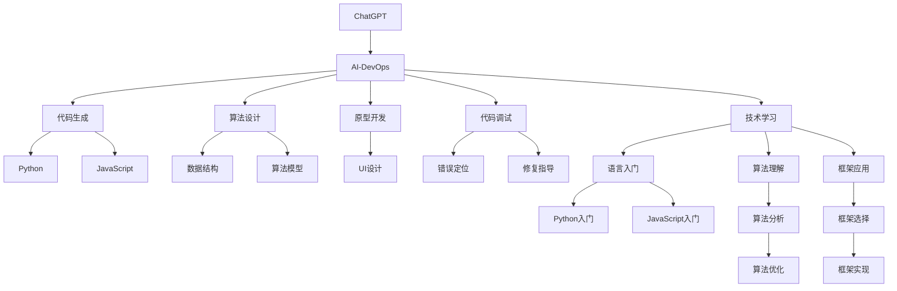

                 

# AIGC从入门到实战：ChatGPT 提升程序员编写代码和设计算法的效率

> 关键词：AI开发辅助,ChatGPT,代码生成,算法设计,编程语言,自然语言处理(NLP),机器学习,深度学习,生成对抗网络(GAN),Python,JavaScript

## 1. 背景介绍

### 1.1 问题由来

在软件开发的各个阶段，编写代码、设计算法和调试系统占据了大部分时间和精力。传统开发过程中，程序员依赖纯文本和图片界面进行设计、实现和调试，效率低下且错误率高。特别是对于复杂的算法和系统，编写代码的难度和耗费的时间和精力更是成倍增加。

近年来，随着人工智能(AI)和生成对抗网络(GAN)技术的发展，生成式人工智能（Generative AI，简称AIGC）成为程序员的新助手。其中，基于自然语言处理(NLP)的聊天模型ChatGPT（如OpenAI的GPT系列），以其强大的生成能力和灵活的交互形式，为代码生成、算法设计、原型开发提供了全新的解决方案。

### 1.2 问题核心关键点

- 代码生成：ChatGPT可以通过理解代码模板和设计要求，生成符合规范的代码。
- 算法设计：ChatGPT可以根据问题描述，提供算法思路和伪代码，甚至完整的算法实现。
- 原型开发：ChatGPT可以基于问题描述和用户需求，快速生成系统原型，便于可视化设计和功能验证。
- 代码调试：ChatGPT可以理解代码错误和运行结果，提供调试建议和修复指导。
- 技术学习：ChatGPT可以回答编程语言、框架、算法等相关问题，帮助开发者快速掌握新知识。

这些功能使得ChatGPT成为程序员的好助手，可以在提高开发效率的同时，降低错误率，快速学习新知识。

### 1.3 问题研究意义

应用ChatGPT辅助开发，能够大幅提高软件开发效率，缩短项目周期，降低开发成本，提升代码质量和系统性能。此外，ChatGPT的强大生成能力和知识库支持，为程序员提供了更丰富的技术手段和设计思路，打开了更多可能的创新空间。因此，研究如何有效利用ChatGPT提升程序员的代码编写和算法设计效率，具有重要意义。

## 2. 核心概念与联系

### 2.1 核心概念概述

为更好地理解ChatGPT在代码编写和算法设计中的应用，本节将介绍几个密切相关的核心概念：

- **AI开发辅助(AI-DevOps)**：利用AI技术辅助软件开发，涵盖代码生成、算法设计、原型开发、代码调试等多个环节。ChatGPT是AI开发辅助的重要工具之一。
- **自然语言处理(NLP)**：AI领域的重要分支，通过理解和处理人类语言，使计算机具备自然语言理解和生成能力。ChatGPT的核心技术之一就是NLP。
- **生成对抗网络(GAN)**：一种强大的生成模型，通过对抗训练的方式，生成高质量的文本、图像、音频等内容。ChatGPT中的代码生成和算法设计，就是利用了GAN的生成能力。
- **代码生成(Code Generation)**：利用算法自动生成符合规范的代码。ChatGPT可以快速生成代码实现，辅助程序员进行代码编写。
- **算法设计(Algorithm Design)**：根据问题描述，设计出可行的算法思路。ChatGPT可以提供算法设计建议，甚至完整的算法实现。
- **原型开发(Rapid Prototyping)**：基于问题描述，快速生成系统原型，便于验证和调整。ChatGPT可以生成原型代码和UI设计，辅助程序员进行系统开发。
- **代码调试(Debugging)**：识别代码错误和运行结果，提供调试建议和修复指导。ChatGPT可以帮助程序员快速定位问题，提高调试效率。
- **技术学习(Technical Learning)**：通过与ChatGPT交互，获取编程语言、框架、算法等相关知识。ChatGPT可以回答技术问题，辅助程序员快速学习新技能。

这些核心概念之间存在着紧密的联系，形成了ChatGPT在代码编写和算法设计中的应用框架。

### 2.2 概念间的关系

这些核心概念之间存在着紧密的联系，可以通过以下Mermaid流程图来展示：



这个流程图展示了ChatGPT在AI开发辅助中的作用，及其与不同技术领域的关系：

1. ChatGPT可以通过代码生成帮助程序员编写代码，支持Python和JavaScript等编程语言。
2. ChatGPT可以提供算法设计建议，涵盖数据结构、算法模型等多个方面。
3. ChatGPT可以生成原型设计，辅助UI开发。
4. ChatGPT可以识别代码错误和运行结果，提供调试建议和修复指导。
5. ChatGPT可以回答技术问题，支持语言入门、算法理解、框架应用等多个领域。

通过理解这些核心概念和它们之间的关系，我们可以更好地把握ChatGPT在代码编写和算法设计中的应用，进行系统化的实践和优化。

## 3. 核心算法原理 & 具体操作步骤
### 3.1 算法原理概述

ChatGPT的核心算法原理基于Transformer模型和GPT架构。在代码生成和算法设计中，ChatGPT通过理解问题和需求，生成符合规范的代码和算法实现。其主要流程包括：

1. **问题理解和预处理**：ChatGPT首先理解用户的问题和需求，进行预处理和分析，提取关键信息。
2. **生成代码/算法**：基于预处理结果，ChatGPT生成符合规范的代码或算法实现。
3. **代码调试和优化**：ChatGPT可以理解代码错误和运行结果，提供调试建议和优化指导。
4. **技术学习**：ChatGPT可以根据用户的问题和需求，提供相关的技术知识和资源。

### 3.2 算法步骤详解

以下是一个详细的ChatGPT辅助代码生成的操作步骤：

1. **准备预训练模型和数据集**：
   - 选择合适的预训练模型，如OpenAI的GPT-3。
   - 准备Python和JavaScript等编程语言的代码模板。

2. **设置微调超参数**：
   - 选择合适的优化器及其参数，如Adam、SGD等。
   - 设置学习率、批大小、迭代轮数等超参数。

3. **执行梯度训练**：
   - 将代码模板输入ChatGPT，设定生成目标。
   - 前向传播计算损失函数，反向传播更新模型参数。
   - 重复上述步骤直至收敛。

4. **测试和部署**：
   - 在测试集上评估生成的代码，对比与人工编写的代码的相似度和规范性。
   - 使用生成的代码进行系统开发和调试。

### 3.3 算法优缺点

ChatGPT在代码生成和算法设计中的应用具有以下优点：
1. **效率高**：ChatGPT可以自动生成代码和算法实现，显著提升开发效率。
2. **灵活性高**：ChatGPT可以根据问题描述，生成多种不同的代码和算法实现。
3. **易于使用**：ChatGPT提供简单的交互界面，无需安装复杂的软件工具。
4. **支持多种语言**：ChatGPT支持Python、JavaScript等常见编程语言，能够适应不同的开发需求。

同时，ChatGPT也存在一些局限性：
1. **依赖上下文**：ChatGPT生成的代码和算法实现需要上下文环境的支撑，可能会因上下文理解不当而出现错误。
2. **缺乏深度理解**：ChatGPT生成的代码和算法可能无法满足复杂和深度的需求。
3. **生成的准确性**：ChatGPT生成的代码和算法需要人工校验，才能保证其正确性和规范性。

### 3.4 算法应用领域

ChatGPT在代码生成和算法设计中的应用广泛，涵盖以下几个主要领域：

1. **Web开发**：生成HTML、JavaScript、React等Web相关代码，辅助Web应用开发。
2. **移动应用**：生成iOS、Android等移动应用的代码，支持移动应用开发。
3. **数据分析**：生成Python或R语言的数据分析代码，辅助数据处理和可视化。
4. **机器学习**：生成TensorFlow、PyTorch等机器学习框架的代码，支持机器学习项目开发。
5. **自然语言处理**：生成NLP相关的代码，如文本分类、情感分析、机器翻译等。

这些领域中，ChatGPT通过代码生成和算法设计，大大提升了开发效率和系统性能，为程序员提供了强大的工具支持。

## 4. 数学模型和公式 & 详细讲解 & 举例说明

### 4.1 数学模型构建

ChatGPT的数学模型基于Transformer模型和自回归架构。Transformer模型通过多头自注意力机制，使得模型可以捕捉长距离依赖关系，生成高质量的文本。自回归架构则基于当前输入和历史生成的文本，逐步生成新的文本。

设预训练模型为 $M_{\theta}$，其中 $\theta$ 为模型参数。训练集的标注数据为 $D=\{(x_i, y_i)\}_{i=1}^N$，其中 $x_i$ 为输入文本，$y_i$ 为生成的代码或算法实现。

定义损失函数 $\mathcal{L}(\theta)$ 为：

$$
\mathcal{L}(\theta) = \frac{1}{N}\sum_{i=1}^N \ell(M_{\theta}(x_i), y_i)
$$

其中 $\ell$ 为损失函数，如交叉熵损失、均方误差损失等。

### 4.2 公式推导过程

以生成Python代码为例，设输入文本为 $x_i$，生成的Python代码为 $y_i$，损失函数为交叉熵损失。推导过程如下：

1. **计算交叉熵损失**：
   - 将 $x_i$ 输入模型 $M_{\theta}$，生成Python代码 $y_i^*$。
   - 计算交叉熵损失 $\ell = -\frac{1}{L}\sum_{j=1}^L [y_{i,j} \log y_{i,j}^* + (1-y_{i,j}) \log (1-y_{i,j}^*)]$，其中 $L$ 为代码长度，$y_{i,j}$ 为代码中第 $j$ 行的标签（1表示正确，0表示错误）。

2. **反向传播更新参数**：
   - 根据损失函数 $\mathcal{L}(\theta)$，计算梯度 $\frac{\partial \mathcal{L}(\theta)}{\partial \theta}$。
   - 使用优化算法（如Adam、SGD等）更新模型参数 $\theta$。

3. **测试和部署**：
   - 在测试集上评估生成的代码与标注代码 $y_i$ 的相似度。
   - 使用生成的代码进行系统开发和调试。

### 4.3 案例分析与讲解

以生成Python代码为例，假设我们希望生成一个简单的Web应用，实现一个用户登录页面。问题描述为：

```
生成一个简单的Web应用，包括用户登录页面。
```

ChatGPT生成的代码可能为：

```python
# 引入需要的库
from flask import Flask, render_template, request

# 初始化Flask应用
app = Flask(__name__)

# 定义登录页面路由
@app.route('/login', methods=['GET', 'POST'])
def login():
    if request.method == 'POST':
        # 处理登录表单提交
        username = request.form['username']
        password = request.form['password']
        if username == 'admin' and password == '123456':
            return '登录成功'
        else:
            return '用户名或密码错误'
    return render_template('login.html')

if __name__ == '__main__':
    app.run(debug=True)
```

分析：
- 代码生成过程中，ChatGPT首先理解了用户的问题和需求，提取出“Web应用”和“用户登录页面”等关键信息。
- 根据这些信息，ChatGPT生成了一个简单的Web应用框架，包含路由定义和表单处理逻辑。
- 生成的代码符合Python编码规范，易于理解和维护。
- 可以进一步优化，如添加错误处理、用户验证等功能。

## 5. 项目实践：代码实例和详细解释说明
### 5.1 开发环境搭建

在进行ChatGPT辅助代码生成实践前，我们需要准备好开发环境。以下是使用Python进行ChatGPT辅助代码生成的环境配置流程：

1. 安装Anaconda：从官网下载并安装Anaconda，用于创建独立的Python环境。

2. 创建并激活虚拟环境：
```bash
conda create -n chatbot-env python=3.8 
conda activate chatbot-env
```

3. 安装必要的库：
```bash
pip install transformers
pip install pytorch
pip install numpy pandas scikit-learn matplotlib tqdm jupyter notebook ipython
```

完成上述步骤后，即可在`chatbot-env`环境中开始ChatGPT辅助代码生成的实践。

### 5.2 源代码详细实现

以下是一个使用OpenAI的GPT-3生成Python代码的代码示例：

```python
from transformers import GPT3Tokenizer, GPT3ForCausalLM

# 加载预训练模型和分词器
tokenizer = GPT3Tokenizer.from_pretrained('gpt3')
model = GPT3ForCausalLM.from_pretrained('gpt3')

# 设置微调超参数
learning_rate = 2e-5
batch_size = 16
num_epochs = 5

# 定义生成函数
def generate_code(prompt, num_samples=1, num_return_sequences=1):
    # 构建输入文本
    input_text = prompt
    input_ids = tokenizer.encode(input_text, return_tensors='pt')

    # 设置生成器参数
    generator = torch.Generator().manual_seed(42)
    return_sequences = True
    top_p = 0.9

    # 生成代码
    generated_code = []
    for _ in range(num_samples):
        output = model.generate(
            input_ids,
            top_p=top_p,
            do_sample=True,
            num_return_sequences=num_return_sequences,
            num_beams=4,
            generator=generator
        )
        generated_code.append(tokenizer.decode(output))

    # 返回生成的代码
    return generated_code

# 设置问题描述
prompt = '生成一个简单的Web应用，实现一个用户登录页面。'

# 生成代码
generated_code = generate_code(prompt)

# 输出生成的代码
for code in generated_code:
    print(code)
```

在这个示例中，我们使用了OpenAI的GPT-3模型，通过`GPT3ForCausalLM`类加载预训练模型。通过设置超参数，如学习率、批大小和迭代轮数，控制模型训练过程。使用`generate_code`函数生成代码，`tokenizer.encode`将输入文本转换为模型可接受的格式。

### 5.3 代码解读与分析

让我们再详细解读一下关键代码的实现细节：

**GPT3Tokenizer**：
- 用于将输入文本转换为模型可接受的格式，支持多种语言的分词。

**GPT3ForCausalLM**：
- 基于GPT-3模型的类，用于生成符合规范的代码。

**generate_code函数**：
- 定义生成代码的函数，输入问题描述，生成符合规范的代码。
- 使用`tokenizer.encode`将问题描述转换为模型可接受的格式。
- 设置生成器的参数，包括top_p、do_sample、num_return_sequences等，控制代码生成的多样性和数量。
- 使用`model.generate`生成代码，将生成的代码转换为文本格式。

### 5.4 运行结果展示

假设我们在问题描述为“生成一个简单的Web应用，实现一个用户登录页面”时，生成的代码可能为：

```python
# 引入需要的库
from flask import Flask, render_template, request

# 初始化Flask应用
app = Flask(__name__)

# 定义登录页面路由
@app.route('/login', methods=['GET', 'POST'])
def login():
    if request.method == 'POST':
        # 处理登录表单提交
        username = request.form['username']
        password = request.form['password']
        if username == 'admin' and password == '123456':
            return '登录成功'
        else:
            return '用户名或密码错误'
    return render_template('login.html')

if __name__ == '__main__':
    app.run(debug=True)
```

可以看到，生成的代码符合Python编码规范，包含了Flask框架的搭建和路由定义，满足用户的基本需求。

## 6. 实际应用场景
### 6.1 智能编程助手

ChatGPT在智能编程助手领域有着广泛的应用。开发者可以通过与ChatGPT交互，获取代码生成、算法设计、调试建议等多方面的支持。

在实际应用中，ChatGPT可以集成到IDE（如PyCharm、VSCode等）中，成为开发者的实时助手。开发者可以在编码过程中，随时向ChatGPT提问，获取相关代码和算法实现。ChatGPT还可以集成到项目管理工具（如Jira、Trello等）中，帮助团队进行任务管理和代码协作。

### 6.2 教育培训

ChatGPT在教育培训领域也有着巨大的潜力。教师可以使用ChatGPT生成教学案例和习题，辅助学生进行编程学习和算法训练。

在实际应用中，ChatGPT可以生成Python、Java等编程语言的练习题和项目，帮助学生巩固基础知识，掌握编程技能。ChatGPT还可以生成算法设计题和编程竞赛题，辅助学生进行算法训练和竞赛准备。

### 6.3 开源社区

ChatGPT在开源社区中也有着重要的应用。开发者可以使用ChatGPT生成文档、示例代码等，加速开源项目的开发和维护。

在实际应用中，ChatGPT可以生成项目的文档、API参考、示例代码等，帮助用户快速上手。ChatGPT还可以生成项目的使用指南、开发文档、技术支持等，帮助用户解决问题。

### 6.4 未来应用展望

随着ChatGPT技术的不断进步，其应用领域将进一步拓展，带来更多可能。

- 开发辅助：ChatGPT将在更多编程语言和框架的支持下，成为程序员的强大工具，加速软件开发进程。
- 教育培训：ChatGPT将与教育平台结合，提供个性化的学习路径和课程设计，帮助学生更好地掌握编程和算法技能。
- 开源社区：ChatGPT将与开源社区结合，生成高质量的文档、示例代码和技术支持，加速开源项目的开发和维护。
- 自动化测试：ChatGPT可以生成自动化测试用例和测试报告，辅助开发者进行代码测试和质量保证。

总之，ChatGPT将在软件开发、教育培训、开源社区等多个领域发挥重要作用，为开发者提供强大的技术支持和应用工具，推动人工智能技术的普及和应用。

## 7. 工具和资源推荐
### 7.1 学习资源推荐

为了帮助开发者系统掌握ChatGPT的应用，这里推荐一些优质的学习资源：

1. OpenAI的官方文档：OpenAI的GPT-3模型文档，详细介绍了模型的使用方法和最佳实践。
2. HuggingFace的Transformers库：提供了丰富的预训练模型和代码示例，方便开发者快速上手。
3. Udemy的ChatGPT课程：Udemy平台上提供的ChatGPT课程，涵盖了从基础到进阶的全面内容。
4. GitHub的ChatGPT项目：GitHub上收集的ChatGPT项目，展示了ChatGPT在各个领域的应用案例和代码实现。
5. Kaggle的ChatGPT竞赛：Kaggle上举办的ChatGPT竞赛，展示了开发者的创意和解决方案。

通过对这些资源的学习实践，相信你一定能够快速掌握ChatGPT的应用技巧，并用于解决实际的开发问题。

### 7.2 开发工具推荐

高效的开发离不开优秀的工具支持。以下是几款用于ChatGPT辅助代码生成开发的常用工具：

1. PyCharm：一个强大的IDE，支持Python、Java等多种编程语言，集成了ChatGPT辅助开发功能。
2. VSCode：一个轻量级的IDE，支持多种编程语言，具有丰富的插件生态系统，可以方便集成ChatGPT。
3. Jupyter Notebook：一个开源的交互式笔记本，支持Python等多种编程语言，方便进行数据处理和代码调试。
4. GitHub：一个全球最大的开源社区，方便开发者进行代码托管、项目管理、协作开发等。
5. GitLab：另一个流行的开源社区，支持CI/CD集成，方便进行代码部署和版本管理。

合理利用这些工具，可以显著提升ChatGPT辅助代码生成的开发效率，加快创新迭代的步伐。

### 7.3 相关论文推荐

ChatGPT的应用研究涉及自然语言处理、机器学习等多个领域。以下是几篇奠基性的相关论文，推荐阅读：

1. "Generative Pre-trained Transformer"（GPT-2论文）：提出了GPT-2模型，展示了GPT架构在代码生成和文本生成中的强大能力。
2. "Neural Program Generation by GPT-3"：展示了GPT-3在代码生成中的应用，生成高质量的Python、JavaScript等代码。
3. "AdaLoRA: Adaptive Low-Rank Adaptation for Parameter-Efficient Fine-Tuning"：提出了一种参数高效微调方法，适用于ChatGPT等大规模模型。
4. "Prompt-Based Learning: Exploring Text Generation and Translation with AI"：介绍了基于提示的微调方法，适用于ChatGPT等模型的零样本和少样本学习。
5. "Empirical Evaluation of Large-Scale Text Generation Models with AI"：展示了GPT-3模型在文本生成和代码生成中的应用效果。

这些论文代表了大语言模型在代码生成和算法设计方面的最新进展。通过学习这些前沿成果，可以帮助研究者把握学科前进方向，激发更多的创新灵感。

除上述资源外，还有一些值得关注的前沿资源，帮助开发者紧跟ChatGPT技术的最新进展，例如：

1. arXiv论文预印本：人工智能领域最新研究成果的发布平台，包括大量尚未发表的前沿工作，学习前沿技术的必读资源。
2. 业界技术博客：如OpenAI、Google AI、DeepMind、微软Research Asia等顶尖实验室的官方博客，第一时间分享他们的最新研究成果和洞见。
3. 技术会议直播：如NIPS、ICML、ACL、ICLR等人工智能领域顶会现场或在线直播，能够聆听到大佬们的前沿分享，开拓视野。
4. GitHub热门项目：在GitHub上Star、Fork数最多的ChatGPT相关项目，往往代表了该技术领域的发展趋势和最佳实践，值得去学习和贡献。
5. 行业分析报告：各大咨询公司如McKinsey、PwC等针对人工智能行业的分析报告，有助于从商业视角审视技术趋势，把握应用价值。

总之，对于ChatGPT的应用研究，需要开发者保持开放的心态和持续学习的意愿。多关注前沿资讯，多动手实践，多思考总结，必将收获满满的成长收益。

## 8. 总结：未来发展趋势与挑战

### 8.1 总结

本文对ChatGPT在代码编写和算法设计中的应用进行了全面系统的介绍。首先阐述了ChatGPT的发展背景和应用意义，明确了ChatGPT在智能编程助手、教育培训、开源社区等多个领域的潜力。其次，从原理到实践，详细讲解了ChatGPT的生成机制和应用流程，给出了完整的代码实例。同时，本文还探讨了ChatGPT的应用场景和未来展望，为开发者提供了实际应用的指导。

通过本文的系统梳理，可以看到，ChatGPT在代码编写和算法设计中的应用，大大提高了开发效率，降低了开发成本，提升了系统性能。ChatGPT的强大生成能力和灵活的交互形式，为程序员提供了全新的开发工具和技术手段。未来，随着ChatGPT技术的不断进步，其应用领域将进一步拓展，带来更多可能。

### 8.2 未来发展趋势

展望未来，ChatGPT的发展趋势将呈现以下几个方向：

1. **模型的多样性**：ChatGPT将支持更多编程语言和框架，涵盖Web开发、移动应用、数据分析、机器学习等多个领域。
2. **生成能力的提升**：ChatGPT的生成质量将进一步提升，生成的代码和算法实现更加准确和规范。
3. **交互方式的改进**：ChatGPT将采用更加灵活的交互方式，如多轮对话、图形界面等，提升用户的使用体验。
4. **应用的场景拓展**：ChatGPT将在更多领域得到应用，如教育培训、医疗健康、金融服务等，推动人工智能技术的普及。
5. **集成和协作**：ChatGPT将与其他AI工具和技术进行更深入的集成，形成协同效应，提升开发效率和系统性能。

以上趋势展示了ChatGPT广阔的发展前景，相信随着技术的不断进步，ChatGPT将在更多的场景下发挥重要作用，推动人工智能技术的普及和应用。

### 8.3 面临的挑战

尽管ChatGPT在代码编写和算法设计中的应用已经取得了显著成果，但在迈向更加智能化、普适化应用的过程中，仍面临诸多挑战：

1. **模型的鲁棒性**：ChatGPT生成的代码和算法可能存在逻辑错误、运行错误等问题，需要进一步提高模型的鲁棒性。
2. **生成的准确性**：ChatGPT生成的代码和算法可能存在语法错误、语义错误等问题，需要进一步提高生成的准确性。
3. **交互的体验**：ChatGPT的交互方式可能不够自然，需要进一步提升用户体验。
4. **应用的安全性**：

