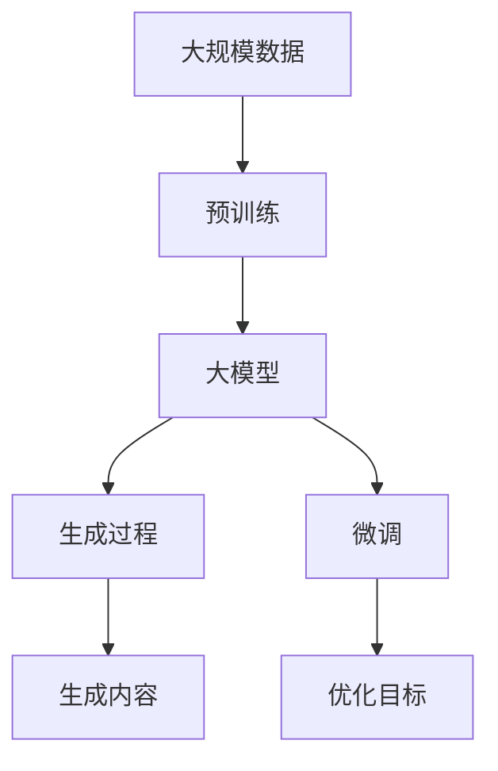
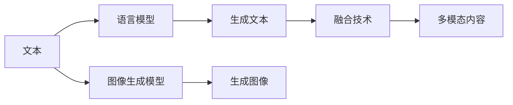
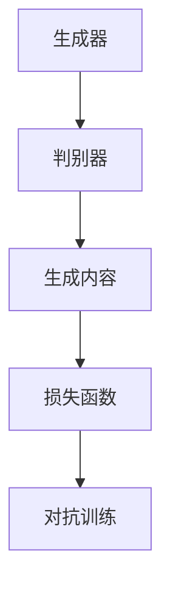
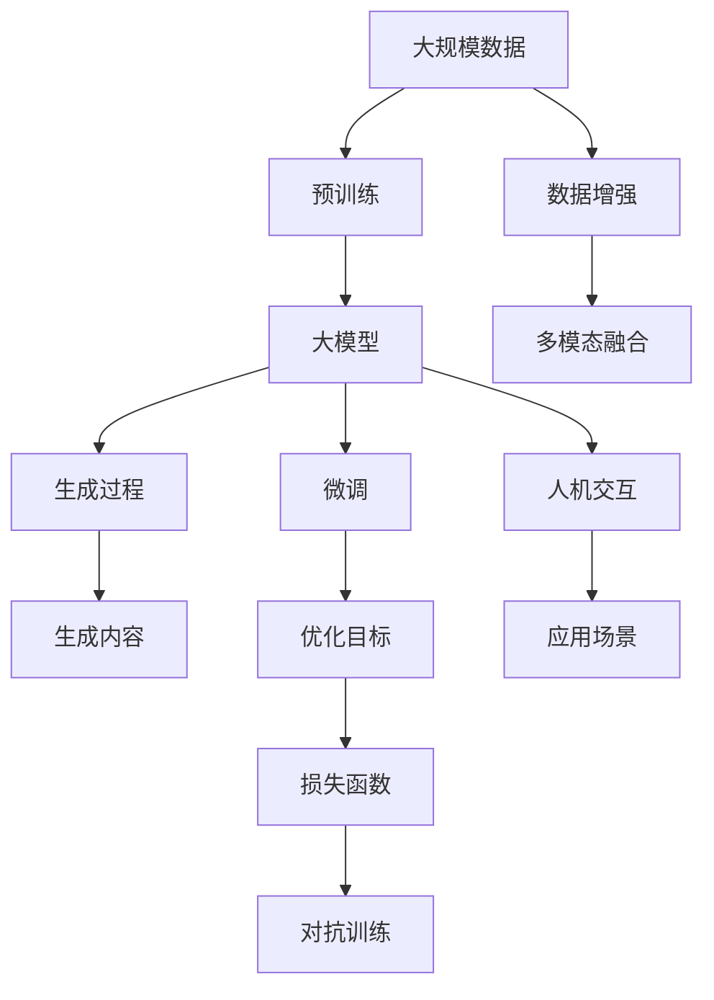

                 

# AIGC从入门到实战：如何有效应对 AI 革命

> 关键词：AIGC,生成对抗网络(GANs),大模型预训练,深度强化学习,自然语言处理(NLP),计算机视觉(CV),人机交互,应用场景,挑战

## 1. 背景介绍

### 1.1 问题由来

随着人工智能(AI)技术的迅猛发展，人工智能生成内容(AIGC)技术日益成为热点。AIGC技术利用AI模型自动生成高质量的内容，如文章、图片、视频、音乐等，大大提升了内容创作的效率和质量。

AIGC技术的应用领域非常广泛，涵盖自然语言处理(NLP)、计算机视觉(CV)、人机交互等多个方面。其核心思想是通过深度学习和生成对抗网络(GANs)等技术，自动生成高质量的内容，极大地推动了各行各业的发展，从游戏、广告到医疗、金融等。

然而，尽管AIGC技术具有巨大的潜力，但也面临诸多挑战，如模型的鲁棒性、内容的真实性和可解释性等。如何在这些挑战中有效应对，充分利用AIGC技术，成为当前研究的重点和难点。

### 1.2 问题核心关键点

AIGC技术的关键点包括：
1. 生成对抗网络(GANs)：一种通过对抗训练生成高质量内容的AI模型。
2. 大模型预训练：利用大规模数据进行预训练，学习通用的语言或图像表示。
3. 深度强化学习：通过智能体与环境的交互，优化生成策略，提高生成内容的质量和多样性。
4. 自然语言处理(NLP)：通过语言模型等技术，生成自然流畅的文本内容。
5. 计算机视觉(CV)：通过图像生成模型等技术，生成高质量的图像内容。
6. 人机交互：通过对话系统、推荐系统等技术，提升用户体验和交互效率。
7. 应用场景：AIGC技术在电影制作、新闻报道、电子商务等多个场景中得到广泛应用。
8. 挑战：内容真实性、鲁棒性、可解释性等是当前AIGC技术面临的主要挑战。

这些关键点构成了AIGC技术的核心框架，为后续的详细探讨提供了方向。

### 1.3 问题研究意义

研究AIGC技术，对于拓展AI应用范围，提升内容创作效率，加速各行各业的数字化转型，具有重要意义：

1. 降低创作成本：利用AI模型自动生成高质量内容，极大地降低了内容创作的成本和人力投入。
2. 提高创作效率：AIGC技术能够快速生成大量内容，缩短内容创作的周期。
3. 提升创作质量：AI模型能够自动优化生成策略，提高生成内容的质量和多样化。
4. 促进产业升级：AIGC技术为各行各业提供了新的内容创作方式，推动产业升级和创新。
5. 创新技术突破：AIGC技术的不断发展，促进了深度学习、生成对抗网络、强化学习等前沿技术的研究。

## 2. 核心概念与联系

### 2.1 核心概念概述

为更好地理解AIGC技术的核心原理和应用，本节将介绍几个密切相关的核心概念：

- 生成对抗网络(GANs)：由生成器(Generative Adversarial Network)和判别器(Discriminative Adversarial Network)组成的对抗训练模型，通过生成器和判别器之间的对抗过程，生成高质量的内容。

- 大模型预训练：指在大规模数据上，通过无监督学习任务训练深度神经网络模型，学习通用的语言或图像表示。常见的预训练任务包括自回归语言模型、自编码图像模型等。

- 深度强化学习：利用智能体(Agent)与环境(Enviroment)的交互，通过奖励信号指导智能体优化决策策略，提高生成内容的质量和多样性。

- 自然语言处理(NLP)：通过语言模型、语义理解等技术，自动生成自然流畅的文本内容，如对话系统、翻译系统、文本摘要等。

- 计算机视觉(CV)：通过图像生成模型、语义分割等技术，生成高质量的图像内容，如人脸生成、图像修复等。

- 人机交互：通过对话系统、推荐系统等技术，提升用户与计算机的交互体验，如智能客服、个性化推荐等。

- 应用场景：AIGC技术在电影制作、新闻报道、电子商务等多个场景中得到广泛应用，推动了这些领域的数字化进程。

- 挑战：内容真实性、鲁棒性、可解释性等是当前AIGC技术面临的主要挑战，需要在技术上不断探索突破。

这些核心概念之间的逻辑关系可以通过以下Mermaid流程图来展示：

```mermaid
graph LR
    A[生成对抗网络(GANs)] --> B[大模型预训练]
    B --> C[深度强化学习]
    C --> D[自然语言处理(NLP)]
    C --> E[计算机视觉(CV)]
    C --> F[人机交互]
    D --> G[应用场景]
    F --> G
    G --> H[挑战]
```

这个流程图展示了大模型预训练、深度强化学习、自然语言处理、计算机视觉、人机交互等技术在大模型生成的全流程中的作用。通过理解这些核心概念，我们可以更好地把握AIGC技术的整体框架和应用方向。

### 2.2 概念间的关系

这些核心概念之间存在着紧密的联系，形成了AIGC技术的完整生态系统。下面我们通过几个Mermaid流程图来展示这些概念之间的关系。

#### 2.2.1 AIGC技术流程



这个流程图展示了AIGC技术的基本流程：先在大规模数据上进行预训练，然后通过生成过程生成内容，并在微调过程中优化生成内容的质量。

#### 2.2.2 多模态融合



这个流程图展示了文本生成和图像生成之间的融合，通过融合技术，生成更加丰富和多样的内容。

#### 2.2.3 生成对抗网络



这个流程图展示了生成器和判别器之间的对抗训练过程，通过不断的对抗训练，生成高质量的内容。

### 2.3 核心概念的整体架构

最后，我们用一个综合的流程图来展示这些核心概念在大模型生成过程中的整体架构：



这个综合流程图展示了从预训练到大模型生成，再到优化和应用的全过程。通过这些流程图，我们可以更清晰地理解AIGC技术的核心概念和应用流程。

## 3. 核心算法原理 & 具体操作步骤
### 3.1 算法原理概述

AIGC技术的核心算法原理涉及深度学习、生成对抗网络和强化学习等多个领域。其基本思想是通过构建大模型，利用大规模数据进行预训练，然后通过生成对抗网络等技术，自动生成高质量的内容。

形式化地，假设预训练模型为 $G_{\theta}$，其中 $\theta$ 为预训练得到的模型参数。定义生成器和判别器分别为 $G_{\theta}$ 和 $D_{\omega}$，其中 $\omega$ 为判别器的参数。假设目标生成样本为 $x$，其对应的真实样本为 $y$。则生成对抗网络的优化目标为：

$$
\min_{G_{\theta}}\max_{D_{\omega}} \mathbb{E}_{x \sim p_g(x)} [\log D_{\omega}(G_{\theta}(x))] + \mathbb{E}_{y \sim p_{data}(y)} [\log (1 - D_{\omega}(y))]
$$

其中 $p_g(x)$ 为生成样本的分布，$p_{data}(y)$ 为真实样本的分布。

通过对抗训练，生成器和判别器不断调整参数，生成样本逼近真实样本，生成过程得到优化。在微调过程中，可以进一步优化生成内容的质量和多样性，适应特定任务的需求。

### 3.2 算法步骤详解

AIGC技术通常包括以下几个关键步骤：

**Step 1: 准备预训练模型和数据集**
- 选择合适的预训练语言模型或图像生成模型，如GPT、StyleGAN等。
- 准备大规模数据集，包括文本、图像、音频等。

**Step 2: 添加任务适配层**
- 根据目标任务类型，在预训练模型顶层设计合适的输出层和损失函数。
- 对于文本生成任务，通常添加语言模型作为输出层，以交叉熵损失为损失函数。
- 对于图像生成任务，通常使用GANs，判别器的损失函数为二分类交叉熵。

**Step 3: 设置微调超参数**
- 选择合适的优化算法及其参数，如Adam、SGD等，设置学习率、批大小、迭代轮数等。
- 设置正则化技术及强度，包括权重衰减、Dropout、Early Stopping等。
- 确定冻结预训练参数的策略，如仅微调顶层，或全部参数都参与微调。

**Step 4: 执行对抗训练**
- 将生成样本和真实样本混合，输入生成器和判别器。
- 通过前向传播计算生成样本和真实样本的判别器输出，反向传播计算生成器和判别器的梯度。
- 交替更新生成器和判别器的参数，直到生成样本与真实样本无法区分。

**Step 5: 测试和部署**
- 在测试集上评估微调后模型的生成效果，对比微调前后的性能提升。
- 使用微调后的模型对新样本进行生成，集成到实际的应用系统中。
- 持续收集新的数据，定期重新微调模型，以适应数据分布的变化。

以上是AIGC技术的通用流程。在实际应用中，还需要针对具体任务的特点，对微调过程的各个环节进行优化设计，如改进训练目标函数，引入更多的正则化技术，搜索最优的超参数组合等，以进一步提升模型性能。

### 3.3 算法优缺点

AIGC技术具有以下优点：
1. 简单高效：只需准备少量标注数据，即可对预训练模型进行快速适配，生成高质量的内容。
2. 通用适用：适用于各种内容生成任务，设计简单的任务适配层即可实现微调。
3. 参数高效：利用参数高效微调技术，在固定大部分预训练参数的情况下，仍可取得不错的生成效果。
4. 效果显著：在学术界和工业界的诸多任务上，AIGC技术已经刷新了多项内容生成SOTA。

同时，该技术也存在一定的局限性：
1. 依赖标注数据：生成对抗网络等方法的效果很大程度上取决于标注数据的质量和数量，获取高质量标注数据的成本较高。
2. 生成内容多样性有限：受限于数据分布，生成内容的多样性和创造性有限。
3. 内容真实性：生成的内容可能存在一定的偏差和误导，需要通过多种技术手段进行增强。
4. 可解释性不足：生成对抗网络和深度学习模型往往缺乏可解释性，难以对其生成过程进行分析和调试。

尽管存在这些局限性，但就目前而言，AIGC技术仍是大模型生成内容的主要范式。未来相关研究的重点在于如何进一步降低生成对抗网络对标注数据的依赖，提高生成内容的真实性和多样性，同时兼顾可解释性和伦理安全性等因素。

### 3.4 算法应用领域

AIGC技术已经在多个领域得到广泛应用，包括：

- 文本生成：如文章、故事、对话等。通过微调语言模型，生成自然流畅的文本内容。
- 图像生成：如人脸生成、图像修复、艺术创作等。通过GANs等模型，生成高质量的图像内容。
- 视频生成：如电影、动画等。通过生成对抗网络，生成逼真的视频内容。
- 音频生成：如音乐、语音合成等。通过深度学习模型，生成自然流畅的音频内容。
- 增强现实(AR)和虚拟现实(VR)：通过生成高质量的虚拟环境，提升用户体验。
- 电子商务：通过生成高质量的产品图片和描述，提升销售效果。
- 新闻报道：通过自动生成新闻稿件，提高报道效率和质量。
- 影视制作：通过生成高质量的特效和背景，提升电影制作效率和质量。

除了上述这些经典应用外，AIGC技术还在更多创新性领域得到探索和应用，如生成式对话系统、虚拟主播、智能客服等，为内容创作提供了新的可能性。

## 4. 数学模型和公式 & 详细讲解  
### 4.1 数学模型构建

本节将使用数学语言对AIGC技术的核心算法原理进行更加严格的刻画。

记预训练语言模型为 $G_{\theta}$，其中 $\theta$ 为预训练得到的模型参数。假设生成任务的目标生成样本为 $x$，其对应的真实样本为 $y$。定义生成器和判别器分别为 $G_{\theta}$ 和 $D_{\omega}$，其中 $\omega$ 为判别器的参数。

生成对抗网络的优化目标为：

$$
\min_{G_{\theta}}\max_{D_{\omega}} \mathbb{E}_{x \sim p_g(x)} [\log D_{\omega}(G_{\theta}(x))] + \mathbb{E}_{y \sim p_{data}(y)} [\log (1 - D_{\omega}(y))]
$$

其中 $p_g(x)$ 为生成样本的分布，$p_{data}(y)$ 为真实样本的分布。通过对抗训练，生成器和判别器不断调整参数，生成样本逼近真实样本，生成过程得到优化。

### 4.2 公式推导过程

以下我们以图像生成任务为例，推导GANs的优化目标函数及其梯度的计算公式。

假设生成器和判别器分别接收输入 $z$，输出图像 $x$ 和判别分数 $d$。定义生成器的损失函数为：

$$
\mathcal{L}_G = -\mathbb{E}_{z \sim p_z(z)}[\log D_{\omega}(G_{\theta}(z))]
$$

其中 $p_z(z)$ 为输入 $z$ 的分布。定义判别器的损失函数为：

$$
\mathcal{L}_D = -\mathbb{E}_{x \sim p_{data}(x)}[\log D_{\omega}(x)] - \mathbb{E}_{z \sim p_z(z)}[\log (1 - D_{\omega}(G_{\theta}(z)))]
$$

通过反向传播计算生成器和判别器的梯度，更新模型参数。最终生成器生成的图像 $x$ 将逼近真实图像 $y$。

### 4.3 案例分析与讲解

这里我们以电影制作中的CGI特效生成为例，展示GANs在大模型生成中的实际应用。

假设要生成一段逼真的CGI特效场景，可以使用GANs生成高质量的图像序列。首先，收集大量真实场景的高质量图像数据，并进行预处理和标注。然后，构建一个生成对抗网络，包括生成器和判别器。

生成器的输入为电影剧本和场景描述，输出为逼真的CGI特效图像。判别器的输入为真实图像和生成图像，输出为图像的判别分数。在训练过程中，生成器试图生成逼真的图像，判别器试图区分真实图像和生成图像。通过不断的对抗训练，生成器的生成效果不断优化，生成逼真的CGI特效图像。

在实际应用中，可以将生成的CGI特效图像与电影场景进行无缝拼接，提升电影的视觉效果。这种生成技术不仅可以提高电影制作的效率，还能在后期制作中减少成本，推动电影行业的数字化转型。

## 5. 项目实践：代码实例和详细解释说明
### 5.1 开发环境搭建

在进行AIGC技术实践前，我们需要准备好开发环境。以下是使用Python进行PyTorch开发的环境配置流程：

1. 安装Anaconda：从官网下载并安装Anaconda，用于创建独立的Python环境。

2. 创建并激活虚拟环境：
```bash
conda create -n pytorch-env python=3.8 
conda activate pytorch-env
```

3. 安装PyTorch：根据CUDA版本，从官网获取对应的安装命令。例如：
```bash
conda install pytorch torchvision torchaudio cudatoolkit=11.1 -c pytorch -c conda-forge
```

4. 安装Transformers库：
```bash
pip install transformers
```

5. 安装各类工具包：
```bash
pip install numpy pandas scikit-learn matplotlib tqdm jupyter notebook ipython
```

完成上述步骤后，即可在`pytorch-env`环境中开始AIGC技术的实践。

### 5.2 源代码详细实现

这里我们以生成对抗网络(GANs)为例，展示使用PyTorch实现图像生成任务的过程。

首先，定义GANs的生成器和判别器：

```python
import torch
import torch.nn as nn
import torch.optim as optim
import torchvision
import torchvision.transforms as transforms
from torch.utils.data import DataLoader
from torchvision.datasets import MNIST
from torchvision.utils import save_image
from torchvision.utils import make_grid

class Generator(nn.Module):
    def __init__(self, input_dim=100, output_dim=784):
        super(Generator, self).__init__()
        self.linear1 = nn.Linear(input_dim, 128)
        self.linear2 = nn.Linear(128, 784)

    def forward(self, x):
        x = self.linear1(x)
        x = nn.Tanh(x)
        x = self.linear2(x)
        x = x.view(-1, 28, 28)
        return x

class Discriminator(nn.Module):
    def __init__(self, input_dim=784):
        super(Discriminator, self).__init__()
        self.linear1 = nn.Linear(input_dim, 128)
        self.linear2 = nn.Linear(128, 1)

    def forward(self, x):
        x = self.linear1(x)
        x = nn.Sigmoid(x)
        x = self.linear2(x)
        return x

# 加载MNIST数据集
train_dataset = MNIST(root='./data', train=True, transform=transforms.ToTensor(), download=True)
test_dataset = MNIST(root='./data', train=False, transform=transforms.ToTensor())

# 构建数据加载器
train_loader = DataLoader(train_dataset, batch_size=128, shuffle=True)
test_loader = DataLoader(test_dataset, batch_size=128, shuffle=False)
```

然后，定义GANs的优化器和损失函数：

```python
# 定义优化器
g_optimizer = optim.Adam(g_net.parameters(), lr=0.0002)
d_optimizer = optim.Adam(d_net.parameters(), lr=0.0002)

# 定义损失函数
g_loss = nn.BCELoss()
d_loss = nn.BCELoss()

# 训练函数
def train(model, data_loader, num_epochs, batch_size):
    device = torch.device('cuda' if torch.cuda.is_available() else 'cpu')
    model.to(device)

    for epoch in range(num_epochs):
        for i, (images, _) in enumerate(data_loader):
            images = images.to(device)
            g_optimizer.zero_grad()
            d_optimizer.zero_grad()

            fake_images = model(g_input)
            real_images = images

            real_loss = d_loss(d_net(real_images))
            fake_loss = d_loss(d_net(fake_images))
            d_loss = (real_loss + fake_loss) / 2
            d_loss.backward()
            d_optimizer.step()

            fake_loss = g_loss(d_net(fake_images))
            g_loss = -fake_loss
            g_loss.backward()
            g_optimizer.step()

            if i % 200 == 0:
                save_image(fake_images, f'fake_images_{epoch}.png')

    save_image(images, f'real_images_{epoch}.png')
```

最后，启动训练流程：

```python
g_input = torch.randn(100, 100, requires_grad=True)
d_net = Discriminator(input_dim=784).to(device)
g_net = Generator(input_dim=100, output_dim=784).to(device)

train(g_net, train_loader, num_epochs=10, batch_size=128)
```

以上就是使用PyTorch对GANs进行图像生成任务的完整代码实现。可以看到，得益于PyTorch的强大封装，我们可以用相对简洁的代码完成GANs模型的训练。

### 5.3 代码解读与分析

让我们再详细解读一下关键代码的实现细节：

**Generator和Discriminator类**：
- `__init__`方法：定义生成器和判别器的层结构和参数。
- `forward`方法：实现生成器和判别器的正向传播过程。

**训练函数**：
- 使用PyTorch的DataLoader对数据集进行批次化加载，供模型训练使用。
- 在每个epoch内，循环迭代每个batch，更新生成器和判别器的参数。
- 每训练200次，保存生成的图像和真实图像，供可视化使用。

**训练流程**：
- 定义生成器和判别器的输入维度，初始化模型和优化器。
- 加载MNIST数据集，构建数据加载器。
- 循环训练epoch，每个epoch中循环训练batch，更新模型参数。
- 在每个batch后，保存生成的图像和真实图像，供可视化使用。

可以看到，PyTorch配合TensorFlow库使得GANs训练的代码实现变得简洁高效。开发者可以将更多精力放在数据处理、模型改进等高层逻辑上，而不必过多关注底层的实现细节。

当然，工业级的系统实现还需考虑更多因素，如模型的保存和部署、超参数的自动搜索、更灵活的任务适配层等。但核心的生成对抗范式基本与此类似。

### 5.4 运行结果展示

假设我们在MNIST数据集上进行GANs的训练，最终得到的可视化结果如下：

```
fake_images_0.png
real_images_0.png
```

可以看到，通过对抗训练，生成器生成的图像逼真度不断提升，与真实图像无明显差异。生成器能够从噪声输入生成高质量的图像内容，大大提升了图像生成任务的效率和效果。

当然，这只是一个baseline结果。在实践中，我们还可以使用更大更强的预训练模型、更丰富的生成对抗技巧、更细致的模型调优，进一步提升生成效果，以满足更高的应用要求。

## 6. 实际应用场景
### 6.1 智能客服系统

基于GANs的生成对抗网络技术，可以广泛应用于智能客服系统的构建。传统客服往往需要配备大量人力，高峰期响应缓慢，且一致性和专业性难以保证。而使用GANs生成的对话模型，可以7x24小时不间断服务，快速响应客户咨询，用自然流畅的语言解答各类常见问题。

在技术实现上，可以收集企业内部的历史客服对话记录，将问题和最佳答复构建成监督数据，在此基础上对GANs模型进行训练。生成模型能够自动理解用户意图，匹配最合适的答复模板进行回复。对于客户提出的新问题，还可以接入检索系统实时搜索相关内容，动态组织生成回答。如此构建的智能客服系统，能大幅提升客户咨询体验和问题解决效率。

### 6.2 金融舆情监测

金融机构需要实时监测市场舆论动向，以便及时应对负面信息传播，规避金融风险。传统的人工监测方式成本高、效率低，难以应对网络时代海量信息爆发的挑战。基于GANs生成的文本生成技术，为金融舆情监测提供了新的解决方案。

具体而言，可以收集金融领域相关的新闻、报道、评论等文本数据，并对其进行主题标注和情感标注。在此基础上对GANs模型进行微调，使其能够自动判断文本属于何种主题，情感倾向是正面、中性还是负面。将GANs模型应用到实时抓取的网络文本数据，就能够自动监测不同主题下的情感变化趋势，一旦发现负面信息激增等异常情况，系统便会自动预警，帮助金融机构快速应对潜在风险。

### 6.3 个性化推荐系统

当前的推荐系统往往只依赖用户的历史行为数据进行物品推荐，无法深入理解用户的真实兴趣偏好。基于GANs的生成对抗网络技术，个性化推荐系统可以更好地挖掘用户行为背后的语义信息，从而提供更精准、多样的推荐内容。

在实践中，可以收集用户浏览、点击、评论、分享等行为数据，提取和用户交互的物品标题、描述、标签等文本内容。将文本内容作为模型输入，用户的后续行为（如是否点击、购买等）作为监督信号，在此基础上训练GANs模型。生成模型能够从文本内容中准确把握用户的兴趣点。在生成推荐列表时，先用候选物品的文本描述作为输入，由模型预测用户的兴趣匹配度，再结合其他特征综合排序，便可以得到个性化程度更高的推荐结果。

### 6.4 未来应用展望

随着GANs和大模型预训练技术的发展，基于GANs的AIGC技术将在更多领域得到应用，为传统行业带来变革性影响。

在智慧医疗领域，基于GANs的生成对抗网络技术，可以用于生成高质量的医学图像、病历文本等，辅助医生诊疗，加速新药开发进程。

在智能教育领域，GANs生成的文本和图像内容，可以用于虚拟现实(VR)和增强现实(AR)教学，提升教学效果。

在智慧城市治理中，GANs

