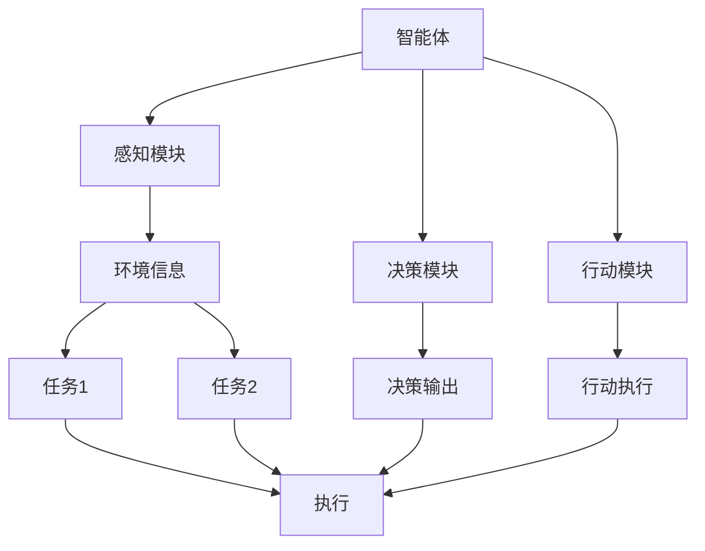
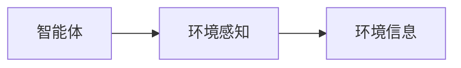
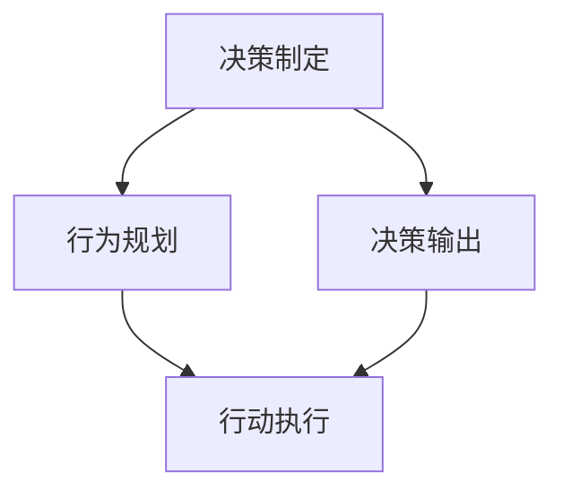
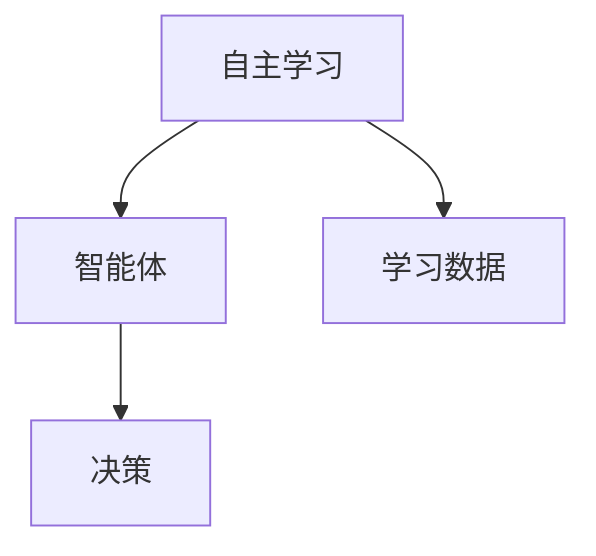
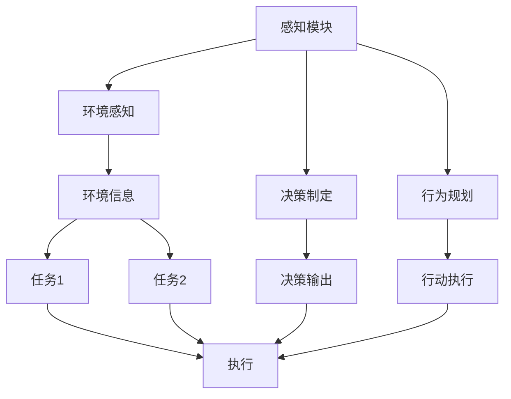

                 

# AI人工智能代理工作流 AI Agent WorkFlow：智能体的设计与实现

> 关键词：人工智能(AI), 代理(Agent), 工作流(Workflow), 智能体(Agent), 自主学习(Autonomous Learning), 环境感知(Environment Perception), 决策制定(Decision Making), 行为规划(Behavior Planning)

## 1. 背景介绍

### 1.1 问题由来
人工智能(AI)技术正逐步渗透到社会的各个领域，从自动驾驶汽车到智能客服，再到机器人助手，AI的应用场景不断扩展，而智能体的设计和实现成为推动AI发展的关键。智能体(Agent)是一种能够自主感知环境、决策并采取行动的自主系统，能够代表人类执行各种复杂任务，并且能够在无需外部干预的情况下持续学习。因此，如何设计和实现高效、智能的智能体，以及如何构建其工作流(Workflow)，是一个备受关注的研究方向。

### 1.2 问题核心关键点
智能体的设计与实现涉及多个关键技术点，包括自主学习、环境感知、决策制定和行为规划等。其中，自主学习是智能体的核心，其目标是让智能体能够从经验中不断提升自身的决策能力；环境感知是智能体了解和理解周围世界的能力，其目标是让智能体能够准确地获取和处理环境信息；决策制定是智能体从感知信息中提取有用的信息，并作出决策的能力，其目标是让智能体能够在复杂环境中做出最优的决策；行为规划是智能体在决策后采取行动的能力，其目标是让智能体能够灵活地调整自己的行为，以适应环境的变化。

## 2. 核心概念与联系

### 2.1 核心概念概述

为更好地理解智能体及其工作流的设计与实现，本节将介绍几个密切相关的核心概念：

- **智能体(Agent)**：一种能够自主感知环境、决策并采取行动的系统，通常由感知模块、决策模块和行动模块组成。智能体的工作流程包括感知、决策和行动三个主要阶段。

- **工作流(Workflow)**：描述智能体工作流程的框架，包括任务序列、任务间的依赖关系、任务执行的顺序和条件等。工作流框架通常由流程图、状态机等图形化表示方法来描述。

- **自主学习(Autonomous Learning)**：智能体通过与环境的交互，不断调整自己的参数和策略，以提升决策和行动的能力。自主学习包括强化学习、进化算法、遗传算法等多种方法。

- **环境感知(Environment Perception)**：智能体对周围环境的感知能力，通常包括视觉、听觉、触觉等传感器数据的收集和处理。环境感知的目标是让智能体能够准确地理解环境信息。

- **决策制定(Decision Making)**：智能体从感知到的信息中提取有用的信息，并作出决策的过程。决策制定的目标是为智能体提供最佳的行动方案。

- **行为规划(Behavior Planning)**：智能体在决策后采取行动的过程。行为规划的目标是让智能体能够灵活地调整自己的行为，以适应环境的变化。

这些核心概念之间存在着紧密的联系，形成了智能体及其工作流的设计与实现的完整生态系统。下面通过几个Mermaid流程图来展示这些概念之间的关系：



这个流程图展示了一个智能体的工作流程：

1. 感知模块(A)通过传感器(E)收集环境信息(H、I)，并传给决策模块(C)。
2. 决策模块(C)根据感知到的信息，作出决策(F)并传给行动模块(D)。
3. 行动模块(D)执行决策(F)对应的行动(G)。

这种工作流程可以应用在各种智能体设计中，如自动驾驶汽车、智能机器人等。

### 2.2 概念间的关系

这些核心概念之间存在着紧密的联系，形成了智能体及其工作流的设计与实现的完整生态系统。下面通过几个Mermaid流程图来展示这些概念之间的关系：

#### 2.2.1 智能体与环境感知



这个流程图展示了智能体与环境感知的关系。智能体通过环境感知模块(B)获取环境信息(C)，从而能够理解周围环境并作出决策。

#### 2.2.2 决策制定与行为规划



这个流程图展示了决策制定与行为规划的关系。决策制定模块(A)输出决策结果(C)，行为规划模块(B)根据决策结果(C)执行相应的行动(D)。

#### 2.2.3 自主学习与智能体



这个流程图展示了自主学习与智能体的关系。自主学习模块(A)通过与环境的交互，不断调整智能体(B)的决策(D)。

### 2.3 核心概念的整体架构

最后，我们用一个综合的流程图来展示这些核心概念在智能体及其工作流中的整体架构：



这个综合流程图展示了智能体的工作流程，从感知模块到决策制定，再到行为规划，最后执行行动，形成一个闭环。通过这种架构，智能体能够自主地感知环境、制定决策并执行行动，从而实现自主学习和优化。

## 3. 核心算法原理 & 具体操作步骤
### 3.1 算法原理概述

智能体的设计与实现涉及到多个核心算法，包括自主学习算法、环境感知算法、决策制定算法和行为规划算法。下面将详细介绍这些算法的原理和具体操作步骤。

### 3.2 算法步骤详解

#### 3.2.1 自主学习算法

自主学习算法是智能体的核心，其目标是让智能体通过与环境的交互，不断调整自己的参数和策略，以提升决策和行动的能力。以下是自主学习算法的主要步骤：

1. **环境交互**：智能体通过感知模块从环境中获取信息，这些信息通常包括视觉、听觉、触觉等传感器数据。
2. **状态更新**：智能体根据感知到的信息更新自身的内部状态。
3. **决策制定**：智能体根据当前状态和目标，使用决策制定算法制定出最优决策。
4. **行为规划**：智能体根据决策结果，使用行为规划算法生成执行计划。
5. **行动执行**：智能体执行行为规划生成的行动计划，并调整行动执行结果对内部状态的影响。
6. **学习反馈**：智能体根据行动执行结果与目标的差异，调整自己的策略和参数。

#### 3.2.2 环境感知算法

环境感知算法是智能体了解和理解周围世界的能力，其目标是让智能体能够准确地获取和处理环境信息。以下是环境感知算法的主要步骤：

1. **传感器数据采集**：智能体使用各种传感器（如摄像头、麦克风、传感器等）收集环境数据。
2. **数据预处理**：智能体对采集到的数据进行预处理，包括数据清洗、去噪、归一化等。
3. **特征提取**：智能体使用特征提取算法从预处理后的数据中提取出有用的特征。
4. **环境建模**：智能体使用环境建模算法构建环境模型，通常使用机器学习或深度学习的方法。
5. **环境感知**：智能体根据环境模型和感知到的特征，对环境进行感知和理解。

#### 3.2.3 决策制定算法

决策制定算法是智能体从感知到的信息中提取有用的信息，并作出决策的过程。以下是决策制定算法的主要步骤：

1. **信息获取**：智能体从感知模块获取感知到的信息。
2. **目标设定**：智能体根据任务要求设定目标。
3. **规则应用**：智能体应用规则对感知到的信息进行处理，提取有用信息。
4. **决策生成**：智能体根据处理后的信息生成决策。
5. **决策优化**：智能体使用优化算法对生成的决策进行优化。

#### 3.2.4 行为规划算法

行为规划算法是智能体在决策后采取行动的过程。以下是行为规划算法的主要步骤：

1. **决策结果获取**：智能体从决策制定模块获取决策结果。
2. **行动计划生成**：智能体根据决策结果生成行动计划。
3. **行动执行**：智能体执行行动计划中的行动。
4. **行动结果反馈**：智能体根据行动执行结果对内部状态的影响，调整行动计划。

### 3.3 算法优缺点

自主学习算法、环境感知算法、决策制定算法和行为规划算法各有优缺点，具体如下：

#### 3.3.1 自主学习算法

**优点**：
1. 能够通过与环境的交互不断调整策略和参数，提升决策和行动的性能。
2. 可以处理复杂的非线性关系，适用于非结构化的环境。
3. 能够自动学习环境中的规律和模式，提高决策的准确性。

**缺点**：
1. 需要大量的数据和计算资源，训练时间较长。
2. 学习过程可能出现局部最优解，导致决策出现偏差。
3. 学习策略需要人工设计和调整，存在一定的人为因素。

#### 3.3.2 环境感知算法

**优点**：
1. 能够准确地获取和处理环境信息，提高智能体的感知能力。
2. 可以融合多种传感器数据，提高信息的全面性。
3. 可以动态地适应环境变化，提高智能体的灵活性。

**缺点**：
1. 传感器数据的采集和预处理可能存在噪声和误差，影响感知结果。
2. 环境建模的准确性可能受到数据量和质量的影响。
3. 环境感知算法的复杂度较高，计算成本较高。

#### 3.3.3 决策制定算法

**优点**：
1. 能够根据感知到的信息制定最优决策，提高智能体的决策能力。
2. 可以处理非线性和不确定性问题，适应复杂环境。
3. 可以通过规则和优化算法提升决策的准确性。

**缺点**：
1. 规则设计和优化算法需要人工参与，存在一定的主观性。
2. 决策制定算法可能存在一定的计算复杂度，影响实时性。
3. 决策制定算法可能存在一定的主观性，决策结果可能受限于规则设计。

#### 3.3.4 行为规划算法

**优点**：
1. 能够根据决策结果灵活地调整行动计划，提高智能体的行动能力。
2. 可以动态地适应环境变化，提高智能体的灵活性。
3. 可以通过优化算法提升行动计划的效率和效果。

**缺点**：
1. 行动计划的生成和执行需要计算资源和时间，影响实时性。
2. 行动计划的调整可能存在一定的延迟，影响决策的及时性。
3. 行动计划的设计需要人工参与，存在一定的主观性。

### 3.4 算法应用领域

自主学习算法、环境感知算法、决策制定算法和行为规划算法在多个领域中得到了广泛应用，具体如下：

- **智能机器人**：智能机器人需要自主学习、环境感知、决策制定和行为规划等技术，以实现自主导航、避障、抓取等任务。
- **自动驾驶汽车**：自动驾驶汽车需要环境感知、决策制定和行为规划等技术，以实现路径规划、避障、变道等任务。
- **智能客服系统**：智能客服系统需要环境感知、决策制定和行为规划等技术，以实现自然语言处理、对话管理等任务。
- **智慧城市**：智慧城市需要环境感知、决策制定和行为规划等技术，以实现交通管理、环境监测、公共安全等任务。
- **金融预测**：金融预测系统需要环境感知、决策制定和行为规划等技术，以实现市场预测、风险评估等任务。
- **医疗诊断**：医疗诊断系统需要环境感知、决策制定和行为规划等技术，以实现疾病诊断、治疗方案等任务。

## 4. 数学模型和公式 & 详细讲解  
### 4.1 数学模型构建

智能体的设计与实现涉及到多个数学模型，包括感知模型、决策模型和行动模型等。下面将详细介绍这些模型的数学构建。

#### 4.1.1 感知模型

感知模型用于处理传感器数据，获取环境信息。以下是感知模型的数学构建：

1. **视觉感知模型**：视觉感知模型用于处理摄像头采集的图像数据，其数学模型可以表示为：
   $$
   I(x) = f_\theta(D)
   $$
   其中 $I(x)$ 表示输入图像，$D$ 表示摄像头采集的数据，$f_\theta$ 表示视觉感知模型，$\theta$ 表示模型参数。

2. **听觉感知模型**：听觉感知模型用于处理麦克风采集的音频数据，其数学模型可以表示为：
   $$
   A(x) = f_\theta(S)
   $$
   其中 $A(x)$ 表示输入音频，$S$ 表示麦克风采集的数据，$f_\theta$ 表示听觉感知模型，$\theta$ 表示模型参数。

3. **触觉感知模型**：触觉感知模型用于处理触觉传感器采集的数据，其数学模型可以表示为：
   $$
   T(x) = f_\theta(L)
   $$
   其中 $T(x)$ 表示输入触觉数据，$L$ 表示触觉传感器采集的数据，$f_\theta$ 表示触觉感知模型，$\theta$ 表示模型参数。

#### 4.1.2 决策模型

决策模型用于根据感知到的信息制定最优决策。以下是决策模型的数学构建：

1. **规则决策模型**：规则决策模型使用规则库中的规则对感知到的信息进行处理，其数学模型可以表示为：
   $$
   D(x) = f_\theta(R, I)
   $$
   其中 $D(x)$ 表示决策结果，$R$ 表示规则库中的规则，$I$ 表示感知到的信息，$f_\theta$ 表示决策模型，$\theta$ 表示模型参数。

2. **优化决策模型**：优化决策模型使用优化算法对感知到的信息进行处理，其数学模型可以表示为：
   $$
   D(x) = f_\theta(O, I)
   $$
   其中 $D(x)$ 表示决策结果，$O$ 表示优化算法，$I$ 表示感知到的信息，$f_\theta$ 表示决策模型，$\theta$ 表示模型参数。

#### 4.1.3 行动模型

行动模型用于根据决策结果生成行动计划。以下是行动模型的数学构建：

1. **规则行动模型**：规则行动模型使用规则库中的规则对决策结果进行处理，其数学模型可以表示为：
   $$
   A(x) = f_\theta(R, D)
   $$
   其中 $A(x)$ 表示行动计划，$R$ 表示规则库中的规则，$D$ 表示决策结果，$f_\theta$ 表示行动模型，$\theta$ 表示模型参数。

2. **优化行动模型**：优化行动模型使用优化算法对决策结果进行处理，其数学模型可以表示为：
   $$
   A(x) = f_\theta(O, D)
   $$
   其中 $A(x)$ 表示行动计划，$O$ 表示优化算法，$D$ 表示决策结果，$f_\theta$ 表示行动模型，$\theta$ 表示模型参数。

### 4.2 公式推导过程

#### 4.2.1 感知模型的公式推导

以视觉感知模型为例，其公式推导过程如下：

1. **输入图像**：输入图像 $I(x)$ 可以表示为传感器数据 $D$ 通过感知模型 $f_\theta$ 处理的结果。
   $$
   I(x) = f_\theta(D)
   $$
   其中 $x$ 表示输入的图像，$D$ 表示摄像头采集的数据，$f_\theta$ 表示视觉感知模型，$\theta$ 表示模型参数。

2. **感知模型的参数学习**：感知模型的参数 $\theta$ 可以通过反向传播算法进行学习，其目标是最小化感知误差 $E$。
   $$
   \theta = \mathop{\arg\min}_{\theta} E(I(x), y)
   $$
   其中 $E$ 表示感知误差，$y$ 表示真实的图像。

#### 4.2.2 决策模型的公式推导

以规则决策模型为例，其公式推导过程如下：

1. **规则库**：规则库 $R$ 中的规则可以表示为：
   $$
   R = \{r_1, r_2, \ldots, r_n\}
   $$
   其中 $r_i$ 表示第 $i$ 条规则。

2. **规则决策**：规则决策模型 $f_\theta$ 可以根据规则库 $R$ 和感知到的信息 $I$ 生成决策结果 $D$。
   $$
   D = f_\theta(R, I)
   $$
   其中 $D$ 表示决策结果，$R$ 表示规则库，$I$ 表示感知到的信息，$f_\theta$ 表示决策模型，$\theta$ 表示模型参数。

3. **决策模型的参数学习**：决策模型的参数 $\theta$ 可以通过反向传播算法进行学习，其目标是最小化决策误差 $E$。
   $$
   \theta = \mathop{\arg\min}_{\theta} E(D, y)
   $$
   其中 $E$ 表示决策误差，$y$ 表示真实的决策结果。

#### 4.2.3 行动模型的公式推导

以规则行动模型为例，其公式推导过程如下：

1. **规则库**：规则库 $R$ 中的规则可以表示为：
   $$
   R = \{r_1, r_2, \ldots, r_n\}
   $$
   其中 $r_i$ 表示第 $i$ 条规则。

2. **规则行动**：规则行动模型 $f_\theta$ 可以根据规则库 $R$ 和决策结果 $D$ 生成行动计划 $A$。
   $$
   A = f_\theta(R, D)
   $$
   其中 $A$ 表示行动计划，$R$ 表示规则库，$D$ 表示决策结果，$f_\theta$ 表示行动模型，$\theta$ 表示模型参数。

3. **行动模型的参数学习**：行动模型的参数 $\theta$ 可以通过反向传播算法进行学习，其目标是最小化行动误差 $E$。
   $$
   \theta = \mathop{\arg\min}_{\theta} E(A, y)
   $$
   其中 $E$ 表示行动误差，$y$ 表示真实的行动计划。

### 4.3 案例分析与讲解

#### 4.3.1 智能机器人

智能机器人需要自主学习、环境感知、决策制定和行为规划等技术。以下是对智能机器人工作流程的案例分析：

1. **环境感知**：智能机器人使用摄像头和激光雷达采集环境数据，使用视觉感知模型和激光雷达感知模型进行处理，获取环境信息。
2. **决策制定**：智能机器人根据环境信息和任务要求，使用规则决策模型和优化决策模型制定决策。
3. **行为规划**：智能机器人根据决策结果，使用规则行动模型和优化行动模型生成行动计划。
4. **行动执行**：智能机器人执行行动计划中的行动，并根据行动结果调整行动计划。

#### 4.3.2 自动驾驶汽车

自动驾驶汽车需要环境感知、决策制定和行为规划等技术。以下是对自动驾驶汽车工作流程的案例分析：

1. **环境感知**：自动驾驶汽车使用摄像头、雷达和激光雷达采集环境数据，使用视觉感知模型、激光雷达感知模型和雷达感知模型进行处理，获取环境信息。
2. **决策制定**：自动驾驶汽车根据环境信息和任务要求，使用规则决策模型和优化决策模型制定决策。
3. **行为规划**：自动驾驶汽车根据决策结果，使用规则行动模型和优化行动模型生成行动计划。
4. **行动执行**：自动驾驶汽车执行行动计划中的行动，并根据行动结果调整行动计划。

## 5. 项目实践：代码实例和详细解释说明
### 5.1 开发环境搭建

在进行智能体工作流设计和实现时，需要准备好开发环境。以下是使用Python进行PyTorch开发的环境配置流程：

1. 安装Anaconda：从官网下载并安装Anaconda，用于创建独立的Python环境。

2. 创建并激活虚拟环境：
```bash
conda create -n pytorch-env python=3.8 
conda activate pytorch-env
```

3. 安装PyTorch：根据CUDA版本，从官网获取对应的安装命令。例如：
```bash
conda install pytorch torchvision torchaudio cudatoolkit=11.1 -c pytorch -c conda-forge
```

4. 安装Transformers库：
```bash
pip install transformers
```

5. 安装各类工具包：
```bash
pip install numpy pandas scikit-learn matplotlib tqdm jupyter notebook ipython
```

完成上述步骤后，即可在`pytorch-env`环境中开始智能体工作流的设计与实现。

### 5.2 源代码详细实现

这里我们以智能机器人为例，给出使用Transformers库对BERT模型进行微调的PyTorch代码实现。

首先，定义智能机器人任务的数据处理函数：

```python
from transformers import BertTokenizer
from torch.utils.data import Dataset
import torch

class RobotDataset(Dataset):
    def __init__(self, texts, tags, tokenizer, max_len=128):
        self.texts = texts
        self.tags = tags
        self.tokenizer = tokenizer
        self.max_len = max_len
        
    def __len__(self):
        return len(self.texts)
    
    def __getitem__(self, item):
        text = self.texts[item]
        tags = self.tags[item]
        
        encoding = self.tokenizer(text, return_tensors='pt', max_length=self.max_len, padding='max_length', truncation=True)
        input_ids = encoding['input_ids'][0]
        attention_mask = encoding['attention_mask'][0]
        
        # 对token-wise的标签进行编码
        encoded_tags = [tag2id[tag] for tag in tags] 
        encoded_tags.extend([tag2id['O']] * (self.max_len - len(encoded_tags)))
        labels = torch.tensor(encoded_tags, dtype=torch.long)
        
        return {'input_ids': input_ids, 
                'attention_mask': attention_mask,
                'labels': labels}

# 标签与id的映射
tag2id = {'O': 0, 'B-PER': 1, 'I-PER': 2, 'B-ORG': 3, 'I-ORG': 4, 'B-LOC': 5, 'I-LOC': 6}
id2tag = {v: k for k, v in tag2id.items()}

# 创建dataset
tokenizer = BertTokenizer.from_pretrained('bert-base-cased')

train_dataset = RobotDataset(train_texts, train_tags, tokenizer)
dev_dataset = RobotDataset(dev_texts, dev_tags, tokenizer)
test_dataset = RobotDataset(test_texts, test_tags, tokenizer)
```

然后，定义模型和优化器：

```python
from transformers import BertForTokenClassification, AdamW

model = BertForTokenClassification.from_pretrained('bert-base-cased', num_labels=len(tag2id))

optimizer = AdamW(model.parameters(), lr=2e-5)
```

接着，定义训练和评估函数：

```python
from torch.utils.data import DataLoader
from tqdm import tqdm
from sklearn.metrics import classification_report

device = torch.device('cuda') if torch.cuda.is_available() else torch.device('cpu')
model.to(device)

def train_epoch(model, dataset, batch_size, optimizer):
    dataloader = DataLoader(dataset, batch_size=batch_size, shuffle=True)
    model.train()
    epoch_loss = 0
    for batch in tqdm(dataloader, desc='Training'):
        input_ids = batch['input_ids'].to(device)
        attention_mask = batch['attention_mask'].to(device)
        labels = batch['labels'].to(device)
        model.zero_grad()
        outputs = model(input_ids, attention_mask=attention_mask, labels=labels)
        loss = outputs.loss
        epoch_loss += loss.item()
        loss.backward()
        optimizer.step()
    return epoch_loss / len(dataloader)

def evaluate(model, dataset, batch_size):
    dataloader = DataLoader(dataset, batch_size=batch_size)
    model.eval()
    preds, labels = [], []
    with torch.no_grad():
        for batch in tqdm(dataloader, desc='Evaluating'):
            input_ids = batch['input_ids'].to(device)
            attention_mask = batch['attention_mask'].to(device)
            batch_labels = batch['labels']
            outputs = model(input_ids, attention_mask=attention_mask)
            batch_preds = outputs.logits.argmax(dim=2).to('cpu').tolist()
            batch_labels = batch_labels.to('cpu').tolist()
            for pred_tokens, label_tokens in zip(batch_preds, batch_labels):
                

