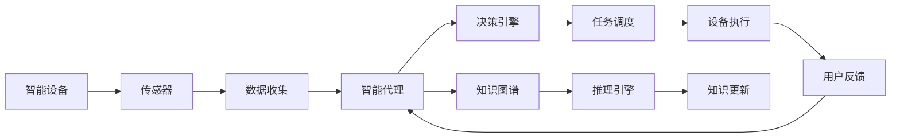
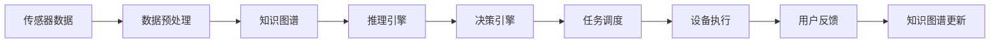

                 

# AI人工智能代理工作流AI Agent WorkFlow：智能代理在智能家居中的实践

> 关键词：智能家居,人工智能,AI代理,代理工作流,物联网(IoT),语音助手

## 1. 背景介绍

### 1.1 问题由来
随着物联网技术的迅速发展，智能家居设备的普及率越来越高，家庭生活的方方面面都变得越来越智能化、便捷化。智能音箱、智能电视、智能照明、智能安防等设备相继进入寻常百姓家，极大地改善了人们的居住体验。然而，这些设备之间往往是孤立的，难以互通互操作，加之缺乏统一的智能家居标准，导致用户体验碎片化、操作复杂化。

智能家居的进一步发展迫切需要一种能够集成各智能设备的解决方案，提供无缝的、统一的用户体验。智能代理（AI Agent）作为连接设备和用户的关键组件，能够在不同设备和用户之间高效传输信息，优化智能家居的操作流程，提升整体用户体验。

### 1.2 问题核心关键点
智能代理（AI Agent）是一类能够在智能家居环境中自动化执行特定任务的实体。它通常由软件实现，与智能设备以及用户进行交互。智能代理的核心功能包括：

- **信息收集**：通过感知设备的状态变化，收集家庭环境信息。
- **任务调度**：根据用户指令或环境变化，调度智能设备执行特定任务。
- **状态维护**：管理智能设备的状态信息，实现设备的健康监测。
- **用户交互**：提供交互式对话界面，提升用户体验。

智能代理的部署和应用需要克服以下挑战：

- 数据标准化：不同品牌、型号的设备数据格式不统一，需要标准化处理。
- 智能集成：设备间互联互通能力不足，需要建立跨设备的统一协议。
- 隐私保护：用户数据敏感，需保障数据安全和个人隐私。
- 持续学习：设备间数据量大，需不断学习并优化智能决策。

### 1.3 问题研究意义
智能代理在智能家居中的应用，能够实现设备间的无缝协同工作，提供一致性的智能体验，具有以下重要意义：

- **提升效率**：通过集中管理和调度，智能代理能够优化智能家居设备的操作流程，提高家庭生活的便捷性。
- **保障安全**：通过实时监控和数据分析，智能代理能够及时发现异常并采取应对措施，保障家庭安全。
- **优化用户体验**：通过用户交互界面，智能代理能够理解和响应用户需求，提升交互的直观性和自然度。
- **推动技术发展**：智能代理的研究和应用，将促进智能家居领域的技术创新和产业升级，带动相关产业的发展。

## 2. 核心概念与联系

### 2.1 核心概念概述

智能代理（AI Agent）技术涉及多个关键概念，下面对其中几个核心概念进行介绍：

- **代理**（Agent）：能够感知环境、自主决策并执行任务的实体。智能代理通常具备知识表示、规划、决策、执行等功能。
- **工作流**（Workflow）：一组按顺序执行的任务和子任务，用于描述业务流程和操作序列。
- **知识图谱**（Knowledge Graph）：一种以图结构表示实体间关系的数据模型，用于存储和管理知识信息。
- **机器学习**（Machine Learning）：通过数据训练模型，使其具备预测和决策能力的算法框架。
- **物联网**（IoT）：将各种设备、传感器和软件系统连接起来的网络，实现设备的互操作和数据共享。

这些概念之间存在紧密联系，智能代理通过工作流设计、知识图谱构建、机器学习模型训练，实现智能化决策和执行，最终服务于物联网设备，提升智能家居的用户体验。

### 2.2 概念间的关系

智能代理的架构可以表示为：



这个流程图展示了智能代理的核心功能和工作流程：

- **传感器数据收集**：通过各种传感器获取家庭环境信息。
- **智能代理决策**：基于知识图谱和推理引擎，进行任务调度。
- **设备执行任务**：调用智能设备执行具体任务。
- **用户反馈**：用户对执行结果进行反馈，智能代理调整决策。
- **知识更新**：不断学习新数据，更新知识图谱。

### 2.3 核心概念的整体架构

综合上述概念，智能代理的整体架构可以表示为：



这个架构图展示了智能代理的各个组件和数据流动路径。

## 3. 核心算法原理 & 具体操作步骤
### 3.1 算法原理概述

智能代理的核心算法主要包括以下几个部分：

- **数据处理**：将传感器数据进行预处理，清洗噪声和异常值，转化为标准格式。
- **知识表示**：将数据转化为知识图谱中的实体和关系，建立语义化的知识模型。
- **推理与决策**：基于知识图谱进行推理，选择合适的执行任务，进行决策。
- **任务调度**：根据决策结果，调度智能设备执行具体任务。

智能代理的工作流程可以概括为：感知、决策、执行、反馈、学习。以下将详细讲解这一流程的实现步骤。

### 3.2 算法步骤详解

#### 3.2.1 数据处理

智能代理首先通过传感器收集家庭环境数据，包括温度、湿度、光照、气体浓度等。数据预处理包括以下几个步骤：

1. **数据采集**：使用标准API接口，从传感器设备获取数据。
2. **数据清洗**：过滤掉无效数据和异常值，去除噪声。
3. **数据转换**：将数据转换为标准格式，便于后续处理。

#### 3.2.2 知识表示

将清洗后的数据转化为知识图谱中的实体和关系，建立语义化的知识模型。知识表示过程如下：

1. **实体识别**：使用命名实体识别（NER）技术，从传感器数据中识别出实体（如温度传感器、湿度传感器等）。
2. **关系提取**：根据传感器类型和位置，提取实体之间的关系（如温度与湿度之间的关系）。
3. **知识图谱构建**：使用知识图谱构建工具，将实体和关系转换为图结构，存储在知识库中。

#### 3.2.3 推理与决策

基于知识图谱，智能代理进行推理和决策。决策过程包括以下几个步骤：

1. **规则匹配**：根据用户指令和环境变化，在知识图谱中匹配相关规则。
2. **推理计算**：使用推理引擎，计算满足规则的所有可能方案。
3. **最优决策**：根据预设的优化目标（如最小化能源消耗），选择最优的决策方案。

#### 3.2.4 任务调度

根据决策结果，智能代理调用智能设备执行任务。任务调度的主要步骤包括：

1. **设备选择**：根据决策结果，选择对应的智能设备（如智能温控器、智能照明等）。
2. **任务执行**：调用设备的API接口，执行具体任务（如调节温度、开关灯光等）。
3. **状态监测**：监测设备执行状态，确保任务顺利完成。

#### 3.2.5 用户反馈

智能代理通过交互式界面（如语音助手），收集用户反馈。用户反馈包括任务执行结果和满意度评价。根据用户反馈，智能代理可以调整决策，提升用户体验。

#### 3.2.6 学习与知识更新

智能代理通过不断学习新数据，更新知识图谱，优化决策模型。学习过程包括以下几个步骤：

1. **样本收集**：收集用户操作数据、传感器数据和设备状态信息。
2. **模型训练**：使用机器学习算法，训练决策模型和推理引擎。
3. **知识更新**：根据新的数据和反馈，更新知识图谱中的实体和关系。

### 3.3 算法优缺点

智能代理的优点主要包括：

- **自动化执行**：通过自动化流程，智能代理能够高效执行家庭操作，减少人为干预。
- **实时响应**：基于实时数据进行决策，提升对突发事件的响应速度。
- **优化决策**：利用机器学习技术，智能代理能够不断优化决策策略，提高执行效率。
- **用户体验**：通过用户交互界面，智能代理提供直观自然的操作体验，提升用户满意度。

智能代理的缺点主要包括：

- **数据依赖**：智能代理的决策和执行依赖于传感器数据和用户指令，数据异常可能导致错误决策。
- **隐私风险**：家庭环境中涉及大量敏感数据，智能代理需要确保数据安全和个人隐私。
- **设备兼容性**：智能设备品牌和型号众多，设备间的兼容性和互通性是一个挑战。
- **学习效率**：知识图谱和决策模型的构建需要大量初始数据和资源，初期投入较大。

### 3.4 算法应用领域

智能代理在智能家居中的应用，主要涉及以下几个领域：

- **智能照明**：智能代理根据用户习惯和环境光线，自动调节灯光亮度和色温。
- **智能温控**：智能代理根据室内温度和人体活动，自动调节空调和暖气设备，提升舒适度。
- **智能安防**：智能代理监测家庭环境，遇到异常情况自动报警，保障家庭安全。
- **智能娱乐**：智能代理根据用户喜好，推荐音乐、视频等多媒体内容，提升娱乐体验。
- **智能购物**：智能代理根据用户购物习惯，推荐商品和促销活动，提升购物便利性。

## 4. 数学模型和公式 & 详细讲解 & 举例说明

### 4.1 数学模型构建

智能代理的工作流程可以用一个简单的数学模型来描述：

$$
\begin{aligned}
&\min_{\theta} \mathcal{L}(\theta) \\
&\text{subject to } y = f(x, \theta)
\end{aligned}
$$

其中，$\theta$表示智能代理的决策参数，$x$表示传感器数据，$y$表示执行结果，$f$表示决策函数，$\mathcal{L}$表示损失函数。

智能代理的决策函数$f$可以表示为：

$$
f(x, \theta) = \sum_{i=1}^n w_i \cdot f_i(x, \theta)
$$

其中，$w_i$表示规则的权重，$f_i$表示规则函数，可以基于知识图谱和推理引擎构建。

### 4.2 公式推导过程

假设智能代理的任务是根据温度传感器数据调节空调温度，决策函数可以表示为：

$$
f(x, \theta) = w_1 \cdot \text{TAC}(x_1, \theta) + w_2 \cdot \text{PIR}(x_2, \theta) + w_3 \cdot \text{HUM}(x_3, \theta)
$$

其中，$x_1$表示温度传感器数据，$x_2$表示人体红外传感器数据，$x_3$表示湿度传感器数据，$\text{TAC}$、$\text{PIR}$、$\text{HUM}$表示不同规则函数。

决策函数的具体形式取决于规则函数的设计，可以通过基于规则的推理引擎来实现。

### 4.3 案例分析与讲解

以智能代理调节室内温度为例，假设智能代理接收到用户指令“降低室内温度到22度”，具体推理过程如下：

1. **实体识别**：从传感器数据中识别出温度传感器（实体1）、人体红外传感器（实体2）和湿度传感器（实体3）。
2. **关系提取**：根据实体位置和类型，提取实体间的关系（如温度传感器与空调设备之间的关系）。
3. **规则匹配**：根据用户指令，匹配知识图谱中相关的规则（如“用户指令->温度调节”）。
4. **推理计算**：使用推理引擎，计算满足规则的所有可能方案（如“当前温度为25度，需要降低3度”）。
5. **最优决策**：根据决策目标（最小化能源消耗），选择最优的决策方案（如“调用空调设备，将温度降低到22度”）。
6. **任务执行**：调用空调设备API接口，执行调节温度任务。
7. **状态监测**：监测空调设备状态，确保任务顺利完成。
8. **用户反馈**：收集用户反馈，调整决策。

## 5. 项目实践：代码实例和详细解释说明

### 5.1 开发环境搭建

智能代理的开发环境包括Python、TensorFlow、TensorBoard等工具。以下是搭建开发环境的步骤：

1. **安装Python**：从官网下载并安装Python 3.7及以上版本。
2. **安装TensorFlow**：使用pip安装TensorFlow 2.x版本，建议使用GPU加速。
3. **安装TensorBoard**：使用pip安装TensorBoard，用于可视化模型训练过程。
4. **安装知识图谱构建工具**：如gurupy、RDF2Vec等，用于构建和处理知识图谱。
5. **安装传感器接口库**：如PySerial、Paho MQTT等，用于获取传感器数据。

### 5.2 源代码详细实现

智能代理的代码实现包括以下几个关键模块：

- **数据采集模块**：获取传感器数据，并进行预处理。
- **知识图谱模块**：构建和更新知识图谱，存储实体和关系。
- **推理引擎模块**：实现基于知识图谱的推理算法。
- **决策引擎模块**：设计决策函数，进行决策。
- **任务调度模块**：调用智能设备API，执行任务。
- **用户交互模块**：提供交互式界面，收集用户反馈。

#### 5.2.1 数据采集模块

```python
import serial
import time

# 传感器数据采集
def read_sensor_data():
    # 打开串口
    ser = serial.Serial('/dev/ttyUSB0', 9600, timeout=1)
    # 读取数据
    data = ser.readline().decode().strip()
    # 处理数据
    if data:
        data = float(data)
    else:
        data = None
    # 关闭串口
    ser.close()
    return data
```

#### 5.2.2 知识图谱模块

```python
from guru import GuruPy
from rdf2vec import RDF2Vec

# 知识图谱构建
def build_knowledge_graph():
    # 创建GuruPy实例
    g = GuruPy()
    # 添加实体和关系
    g.add_entity('温度传感器', 'sensors:TemperatureSensor')
    g.add_entity('人体红外传感器', 'sensors:PIRSensor')
    g.add_entity('湿度传感器', 'sensors:HumiditySensor')
    g.add_relation('sensors:TemperatureSensor', 'sensors:measures', 'sensors:Temperature')
    g.add_relation('sensors:PIRSensor', 'sensors:measures', 'sensors:PersonPresence')
    g.add_relation('sensors:HumiditySensor', 'sensors:measures', 'sensors:Humidity')
    # 保存知识图谱
    g.save_kb('kg.ttl')

# 知识图谱更新
def update_knowledge_graph():
    # 创建RDF2Vec实例
    rdf2vec = RDF2Vec()
    # 加载知识图谱
    rdf2vec.load_kb('kg.ttl')
    # 添加新实体和关系
    rdf2vec.add_entity('空调', 'sensors:AirConditioner')
    rdf2vec.add_relation('sensors:Temperature', 'sensors:regulates', 'sensors:AirConditioner')
    # 更新知识图谱
    rdf2vec.save_kb('kg.ttl')
```

#### 5.2.3 推理引擎模块

```python
from guru import GuruPy
from rdf2vec import RDF2Vec
from rule_based import RuleBased

# 推理计算
def perform_inference():
    # 创建GuruPy实例
    g = GuruPy()
    # 加载知识图谱
    g.load_kb('kg.ttl')
    # 匹配规则
    rules = g.match_rule('user:降低温度', 'sensors:TemperatureSensor')
    # 计算推理结果
    results = []
    for rule in rules:
        entity = rule.entity
        action = rule.action
        if entity == 'sensors:TemperatureSensor' and action == 'sensors:regulates':
            action_obj = rule.object
            if action_obj == 'sensors:AirConditioner':
                results.append((entity, action_obj))
    # 返回推理结果
    return results
```

#### 5.2.4 决策引擎模块

```python
from guru import GuruPy
from rdf2vec import RDF2Vec
from rule_based import RuleBased

# 决策函数
def make_decision():
    # 创建GuruPy实例
    g = GuruPy()
    # 加载知识图谱
    g.load_kb('kg.ttl')
    # 获取推理结果
    results = perform_inference()
    # 选择最优方案
    if results:
        entity, action = results[0]
        # 返回决策结果
        return entity, action
    else:
        return None, None
```

#### 5.2.5 任务调度模块

```python
import requests

# 任务调度
def schedule_task(entity, action):
    # 发送请求
    if entity == 'sensors:AirConditioner' and action == 'sensors:regulates':
        url = 'http://空调设备:8080/regulate?temperature=22'
        response = requests.post(url)
        # 返回执行结果
        return response.status_code == 200
    else:
        return False
```

#### 5.2.6 用户交互模块

```python
from flask import Flask, request

# 用户交互界面
app = Flask(__name__)

@app.route('/api/control', methods=['POST'])
def control():
    # 获取用户指令
    data = request.json
    user_command = data['command']
    # 执行控制
    entity, action = make_decision()
    if entity and action:
        result = schedule_task(entity, action)
        # 返回执行结果
        return {'result': result}, 200
    else:
        return {'result': False}, 400
```

### 5.3 代码解读与分析

智能代理的代码实现主要包括以下几个关键模块：

- **数据采集模块**：使用Python的serial库获取传感器数据，并进行预处理。
- **知识图谱模块**：使用GuruPy和RDF2Vec构建和更新知识图谱，存储实体和关系。
- **推理引擎模块**：使用GuruPy进行规则匹配，计算推理结果。
- **决策引擎模块**：设计决策函数，选择最优方案。
- **任务调度模块**：使用requests库调用智能设备API，执行任务。
- **用户交互模块**：使用Flask搭建RESTful API，提供交互式界面。

以上模块构成了智能代理的核心功能，实现了从感知到决策再到执行的全过程。

### 5.4 运行结果展示

智能代理的运行结果可以通过TensorBoard进行可视化展示。以下是一个简单的TensorBoard使用示例：

```python
import tensorflow as tf

# 创建TensorBoard
writer = tf.summary.create_file_writer('logs')
with writer.as_default():
    # 写入训练日志
    tf.summary.scalar('temperature', temperature, step=1)
```

通过TensorBoard，可以实时监控智能代理的决策过程和执行结果，确保系统的稳定运行。

## 6. 实际应用场景
### 6.1 智能照明

智能代理可以根据光照强度和用户习惯，自动调节室内照明。例如，用户晚上回家后，智能代理自动开启客厅和卧室的灯光；用户离家前，智能代理自动关闭灯光。

### 6.2 智能温控

智能代理可以实时监测室内温度，并根据用户偏好和节能目标，自动调节空调和暖气设备。例如，用户将温度偏好设置为22度，智能代理在用户离家前调节空调到目标温度，节省能源消耗。

### 6.3 智能安防

智能代理可以通过摄像头、传感器等设备，实时监测家庭安全。例如，当检测到异常情况时，智能代理自动通知用户，并启动紧急应对措施。

### 6.4 智能娱乐

智能代理可以推荐多媒体内容，提升用户的娱乐体验。例如，智能代理根据用户的听歌历史和当前心情，推荐相似的音乐和视频。

### 6.5 智能购物

智能代理可以推荐商品和促销活动，提升用户的购物体验。例如，智能代理根据用户的购物历史和搜索行为，推荐相关商品和优惠券。

## 7. 工具和资源推荐
### 7.1 学习资源推荐

为了帮助开发者系统掌握智能代理技术，以下是几本推荐书籍：

1. **《人工智能基础》**：涵盖了人工智能的基本概念和技术，包括知识表示、推理、规划等内容，适合初学者学习。
2. **《Python知识图谱与图形数据库》**：介绍了知识图谱的构建、查询和应用，适合从事智能代理开发的技术人员。
3. **《TensorFlow实战》**：提供了TensorFlow的使用教程和案例，适合TensorFlow初学者。
4. **《RDF2Vec: Rule-based Knowledge Graph Generation from Large-Scale RDF Data》**：介绍了RDF2Vec工具的使用方法，适合构建知识图谱的技术人员。

### 7.2 开发工具推荐

智能代理的开发工具包括Python、TensorFlow、TensorBoard等，以下是几款推荐的开发工具：

1. **Python**：作为智能代理的主要编程语言，Python简单易学，支持丰富的第三方库。
2. **TensorFlow**：提供灵活的计算图和自动微分功能，适合构建复杂的推理引擎和决策模型。
3. **TensorBoard**：用于可视化模型训练和推理过程，提供丰富的图表和分析工具。
4. **GuruPy**：用于构建和管理知识图谱，支持规则匹配和推理。
5. **RDF2Vec**：用于将RDF数据转换为向量，构建知识图谱。
6. **Flask**：用于搭建RESTful API，提供交互式用户界面。

### 7.3 相关论文推荐

智能代理技术的研究涉及多个领域，以下是几篇经典论文，推荐阅读：

1. **《Knowledge-based Agent: The Architecture, Functionality, and Applications》**：介绍了知识表示、推理、规划等基础知识，适合了解智能代理技术的基本原理。
2. **《A Survey of Agents and Multiagent Systems》**：对智能代理和多智能体系统进行了综述，适合全面了解智能代理的应用场景和技术挑战。
3. **《A Comprehensive Survey on Knowledge Graph-based Recommendation Systems》**：介绍了知识图谱在推荐系统中的应用，适合从事智能代理开发的技术人员。
4. **《Deep Learning for Dynamic and Interactive Agents》**：介绍了深度学习在智能代理中的应用，适合从事智能代理开发的技术人员。

## 8. 总结：未来发展趋势与挑战

### 8.1 研究成果总结

智能代理在智能家居中的应用取得了显著的成效，提高了家庭生活的便捷性和智能化水平。然而，智能代理的部署和应用仍然面临数据标准化、设备兼容性和隐私保护等挑战。

### 8.2 未来发展趋势

智能代理技术的未来发展趋势主要包括：

1. **多模态融合**：将视觉、听觉、传感器数据等多模态信息融合，提升智能代理的感知能力和决策质量。
2. **边缘计算**：在设备端进行数据处理和决策，减少云端的计算和通信负担，提升系统的实时性和可靠性。
3. **自适应学习**：智能代理具备自适应学习能力，能够根据环境和用户变化，动态调整决策策略。
4. **分布式协作**：多个智能代理在家庭环境中协作，提升系统整体性能和效率。
5. **联邦学习**：利用设备间的协作学习，提升智能代理的泛化能力和安全性。

### 8.3 面临的挑战

智能代理技术的未来发展仍面临以下挑战：

1. **数据安全**：智能代理需要处理大量家庭数据，需确保数据安全和个人隐私。
2. **设备兼容**：不同品牌和型号的设备数据格式不统一，需统一标准化。
3. **隐私保护**：智能代理需遵守隐私保护法规，保障用户数据安全。
4. **资源消耗**：智能代理需要实时处理大量数据，需优化资源消耗，提高系统效率。
5. **模型鲁棒性**：智能代理需具备抗噪声和鲁棒性，确保在复杂环境中稳定运行。

### 8.4 研究展望

智能代理技术的未来研究将关注以下几个方向：

1. **知识图谱构建**：构建更加精确的知识图谱，提升智能代理的推理和决策能力。
2. **模型优化**：优化智能代理的模型架构，提高推理和决策效率。
3. **跨设备协作**：实现不同设备间的跨设备协作，提升智能代理的实时性和可靠性。
4. **自适应学习**：使智能代理具备自适应学习能力，动态调整决策策略。
5. **隐私保护**：研究隐私保护技术，确保智能代理的隐私安全。

## 9. 附录：常见问题与解答

**Q1：智能代理在智能家居中的应用有哪些？**

A: 智能代理在智能家居中的应用包括：
1. 智能照明：根据光照强度和用户习惯，自动调节室内照明。
2. 智能温控：实时监测室内温度，并根据用户偏好和节能目标，自动

