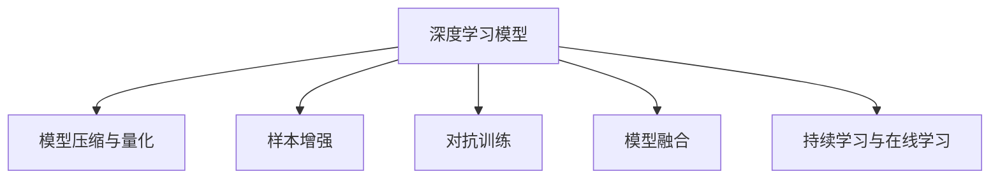
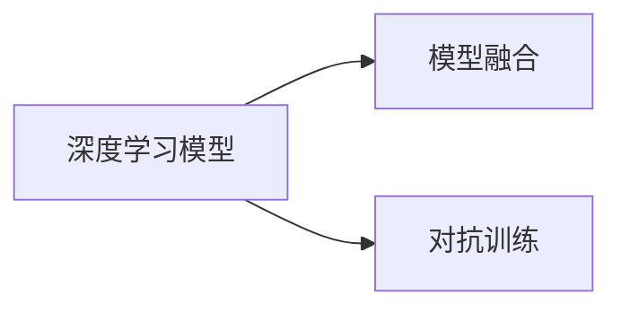
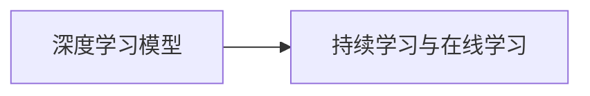

                 

# AI人工智能深度学习算法：利用机器学习提升深度学习模型的决策质量

## 1. 背景介绍

### 1.1 问题由来
深度学习技术自诞生以来，在图像识别、自然语言处理、语音识别等诸多领域取得了显著突破。特别是深度神经网络，以其强大的非线性拟合能力，在复杂模式识别和预测任务上表现优异。然而，深度学习的黑箱特性和模型泛化能力的不足，使得其在实际应用中仍面临诸多挑战。近年来，通过引入机器学习中的模型压缩、样本增强、对抗训练等技术，深度学习模型的决策质量得到了显著提升。

### 1.2 问题核心关键点
机器学习在大深度学习模型决策质量提升方面的核心关键点包括：
- 模型压缩与量化：通过剪枝、参数共享、权值剪枝等方法减小模型规模，提升模型推理速度和内存占用效率。
- 样本增强：通过数据增强、对抗样本生成等手段，丰富训练数据多样性，提升模型鲁棒性和泛化能力。
- 对抗训练：通过对抗样本训练提升模型对抗攻击的鲁棒性，确保模型在实际应用中的安全性。
- 模型融合：通过集成多个模型，利用模型间互补的优点，提高决策准确性和鲁棒性。
- 持续学习与在线学习：通过增量式学习不断更新模型，适应新数据和新任务，提升模型的时效性和适应性。

这些技术手段的引入，使得深度学习模型的决策质量得到了显著提升，在实际应用中表现更加稳定可靠。

### 1.3 问题研究意义
提升深度学习模型的决策质量，对于推动人工智能技术在各领域的广泛应用具有重要意义：

1. 降低应用成本。模型压缩和量化技术能够显著减小模型大小，降低计算和存储成本，使得复杂模型在边缘设备和移动端也能够高效运行。
2. 提升模型效果。样本增强和对抗训练技术使得模型更加鲁棒，能够处理更多样化的输入，提升在实际应用中的效果。
3. 提高可解释性。通过模型融合和持续学习技术，可以增强模型的可解释性，便于对其决策过程进行调试和优化。
4. 增强安全性。对抗训练技术能够增强模型对抗攻击的鲁棒性，保障模型的安全性。
5. 促进智能应用落地。模型的决策质量提升，使得其在诸如自动驾驶、金融风控、医疗诊断等高风险领域的应用更加可靠，加速智能应用的落地进程。

## 2. 核心概念与联系

### 2.1 核心概念概述

为了更好地理解利用机器学习提升深度学习模型决策质量的方法，本节将介绍几个密切相关的核心概念：

- 深度学习模型：以神经网络为代表，通过多层非线性变换，能够学习复杂映射关系的模型。深度学习在图像识别、自然语言处理、语音识别等领域展现了强大的学习能力。
- 模型压缩与量化：通过剪枝、参数共享、权值剪枝等方法减小模型规模，提升模型推理速度和内存占用效率。
- 样本增强：通过数据增强、对抗样本生成等手段，丰富训练数据多样性，提升模型鲁棒性和泛化能力。
- 对抗训练：通过对抗样本训练提升模型对抗攻击的鲁棒性，确保模型在实际应用中的安全性。
- 模型融合：通过集成多个模型，利用模型间互补的优点，提高决策准确性和鲁棒性。
- 持续学习与在线学习：通过增量式学习不断更新模型，适应新数据和新任务，提升模型的时效性和适应性。

这些核心概念之间的逻辑关系可以通过以下Mermaid流程图来展示：



这个流程图展示了大深度学习模型决策质量提升过程中各个关键概念之间的关系：

1. 深度学习模型通过多层非线性变换，学习复杂映射关系。
2. 模型压缩与量化减小模型规模，提升模型推理速度和内存占用效率。
3. 样本增强丰富训练数据多样性，提升模型鲁棒性和泛化能力。
4. 对抗训练提升模型对抗攻击的鲁棒性，确保模型安全性。
5. 模型融合利用模型间互补的优点，提高决策准确性和鲁棒性。
6. 持续学习与在线学习不断更新模型，适应新数据和新任务，提升模型时效性和适应性。

这些核心概念共同构成了提升深度学习模型决策质量的完整框架，使得深度学习模型在实际应用中能够更好地应对复杂场景和多样化需求。

### 2.2 概念间的关系

这些核心概念之间存在着紧密的联系，形成了提升深度学习模型决策质量的整体生态系统。下面我通过几个Mermaid流程图来展示这些概念之间的关系。

#### 2.2.1 深度学习模型与模型压缩量化


这个流程图展示了深度学习模型与模型压缩量化的关系。通过模型压缩与量化，深度学习模型的参数量和推理速度得到了优化，使得模型更加高效、灵活。

#### 2.2.2 模型融合与对抗训练



这个流程图展示了模型融合与对抗训练的关系。模型融合通过集成多个模型的优点，提升决策准确性和鲁棒性，而对抗训练通过增强模型鲁棒性，确保模型在面对对抗攻击时依然能够保持稳定。

#### 2.2.3 持续学习与在线学习



这个流程图展示了持续学习与在线学习的关系。持续学习与在线学习通过不断更新模型，使其能够适应新数据和新任务，保持模型的时效性和适应性。

### 2.3 核心概念的整体架构

最后，我们用一个综合的流程图来展示这些核心概念在大深度学习模型决策质量提升过程中的整体架构：


这个综合流程图展示了从深度学习模型到决策质量提升的完整过程。深度学习模型通过多层非线性变换学习复杂映射关系，然后通过模型压缩与量化减小模型规模，提升推理速度和内存效率。通过样本增强丰富训练数据多样性，提升模型鲁棒性和泛化能力。通过对抗训练提升模型对抗攻击的鲁棒性，确保模型安全性。通过模型融合利用模型间互补的优点，提高决策准确性和鲁棒性。最后通过持续学习与在线学习不断更新模型，使其能够适应新数据和新任务，提升模型时效性和适应性。 通过这些流程图，我们可以更清晰地理解提升深度学习模型决策质量过程中各个关键概念的关系和作用，为后续深入讨论具体的决策质量提升方法奠定基础。

## 3. 核心算法原理 & 具体操作步骤

### 3.1 算法原理概述

利用机器学习提升深度学习模型决策质量的根本原理在于通过多种优化手段，减小模型规模，丰富训练数据，增强模型鲁棒性，提高模型决策的准确性和稳定性。以下是具体算法原理概述：

1. 模型压缩与量化：通过剪枝、参数共享、权值剪枝等方法减小模型规模，提升模型推理速度和内存占用效率。
2. 样本增强：通过数据增强、对抗样本生成等手段，丰富训练数据多样性，提升模型鲁棒性和泛化能力。
3. 对抗训练：通过对抗样本训练提升模型对抗攻击的鲁棒性，确保模型在实际应用中的安全性。
4. 模型融合：通过集成多个模型，利用模型间互补的优点，提高决策准确性和鲁棒性。
5. 持续学习与在线学习：通过增量式学习不断更新模型，适应新数据和新任务，提升模型的时效性和适应性。

### 3.2 算法步骤详解

以下是详细的操作步骤说明：

#### 3.2.1 模型压缩与量化

1. **剪枝**：剪枝方法通过移除模型中不重要或者冗余的参数，减小模型规模。常用的剪枝方法包括结构剪枝、权重剪枝和通道剪枝等。
2. **参数共享**：参数共享通过在模型中重复使用相同的权重参数，减小参数数量。例如，利用共享权重实现不同卷积层的参数复用。
3. **权值剪枝**：权值剪枝通过移除权值绝对值较小的参数，减小模型规模。常用的权值剪枝方法包括基于稀疏性约束、基于梯度约束等。
4. **量化**：量化方法通过将浮点数参数转换为低精度数值（如8位或16位整数），减小模型存储空间和计算量。

#### 3.2.2 样本增强

1. **数据增强**：数据增强方法通过在训练数据中引入多种变换，如旋转、平移、缩放、随机裁剪等，丰富训练数据的多样性，提升模型泛化能力。
2. **对抗样本生成**：对抗样本生成方法通过生成对抗样本，训练模型对抗攻击的能力，提升模型鲁棒性。常用的对抗样本生成方法包括FGM、PGD等。
3. **混合数据增强**：混合数据增强方法通过结合多种数据增强手段，进一步提升模型泛化能力和鲁棒性。

#### 3.2.3 对抗训练

1. **训练对抗样本**：利用对抗样本训练模型，使其能够识别并应对对抗攻击，提升模型鲁棒性。
2. **对抗训练算法**：常见的对抗训练算法包括FGM、PGD等。
3. **混合对抗训练**：结合多种对抗训练方法，进一步提升模型鲁棒性。

#### 3.2.4 模型融合

1. **集成方法**：常用的集成方法包括Bagging、Boosting、Stacking等。
2. **融合策略**：融合策略包括平均、投票、加权平均等。
3. **多模型融合**：通过融合多个模型的输出，提升决策准确性和鲁棒性。

#### 3.2.5 持续学习与在线学习

1. **增量式学习**：增量式学习通过不断更新模型，适应新数据和新任务，提升模型时效性和适应性。
2. **在线学习算法**：常用的在线学习算法包括在线随机梯度下降(Online SGD)、在线Adagrad等。
3. **增量式模型更新**：增量式模型更新通过不断更新模型参数，使其能够适应新数据和新任务。

### 3.3 算法优缺点

提升深度学习模型决策质量的机器学习手段，具有以下优点：

1. **高效性**：通过模型压缩与量化、样本增强等方法，减小模型规模和计算量，提高推理速度和内存占用效率。
2. **鲁棒性**：通过对抗训练和样本增强等手段，提升模型对抗攻击和对抗样本的鲁棒性。
3. **泛化能力**：通过多样化的训练数据和模型融合等方法，提升模型的泛化能力和决策准确性。
4. **可解释性**：通过模型压缩与量化、持续学习等方法，增强模型的可解释性，便于调试和优化。

同时，这些手段也存在一些局限性：

1. **计算资源需求高**：模型压缩与量化、对抗训练等方法需要较高的计算资源，可能对硬件设施提出较高要求。
2. **模型结构复杂**：模型融合和混合数据增强等方法可能引入额外的复杂性，使得模型设计更加困难。
3. **数据需求高**：样本增强和对抗训练等方法需要大量的训练数据和对抗样本，数据获取和生成成本较高。
4. **模型更新难度大**：增量式学习和在线学习等方法需要在实时环境中不断更新模型，更新策略和算法复杂。

尽管存在这些局限性，但就目前而言，利用机器学习提升深度学习模型决策质量的方法仍然是大数据处理和人工智能应用的重要手段。未来相关研究的重点在于如何进一步优化计算资源使用，提高模型更新效率，降低数据需求，简化模型结构，使这些方法能够在更多场景下得到广泛应用。

### 3.4 算法应用领域

利用机器学习提升深度学习模型决策质量的方法，已经在诸多领域得到了广泛应用：

1. **图像识别**：在图像识别领域，通过模型压缩与量化、样本增强等方法，提升模型推理速度和泛化能力，加速实时图像识别任务。
2. **自然语言处理**：在自然语言处理领域，通过模型压缩与量化、持续学习等方法，提升模型推理速度和决策准确性，加速自然语言理解和生成任务。
3. **语音识别**：在语音识别领域，通过模型压缩与量化、样本增强等方法，提升模型实时性和鲁棒性，加速语音识别和语音生成任务。
4. **推荐系统**：在推荐系统领域，通过模型压缩与量化、样本增强等方法，提升模型实时性和决策准确性，加速个性化推荐任务。
5. **医疗诊断**：在医疗诊断领域，通过模型压缩与量化、对抗训练等方法，提升模型鲁棒性和决策准确性，加速诊断和治疗决策。

除了上述这些经典应用领域外，利用机器学习提升深度学习模型决策质量的方法还在更多新兴场景中得到应用，如智能制造、智能交通、智能城市等，为人工智能技术的发展带来了新的动力。

## 4. 数学模型和公式 & 详细讲解

### 4.1 数学模型构建

在大深度学习模型决策质量提升过程中，数学模型和公式的推导具有重要意义。

记深度学习模型为 $M_{\theta}$，其中 $\theta$ 为模型参数。定义模型在训练数据集 $D$ 上的损失函数为 $\mathcal{L}(\theta; D)$，即：

$$
\mathcal{L}(\theta; D) = \frac{1}{N} \sum_{i=1}^N \ell(M_{\theta}(x_i), y_i)
$$

其中 $\ell$ 为损失函数，$x_i$ 为训练样本，$y_i$ 为标签。通过最小化损失函数 $\mathcal{L}(\theta; D)$，可以优化模型参数 $\theta$。

### 4.2 公式推导过程

以下我以深度学习模型的样本增强和对抗训练为例，详细推导相关公式。

#### 4.2.1 样本增强

样本增强通过引入多种变换，丰富训练数据的多样性。以图像增强为例，常见的变换包括旋转、平移、缩放、随机裁剪等。

假设原始图像为 $I(x)$，经过随机旋转 $\theta$ 度后变为 $I_{\theta}(x)$。则样本增强后的损失函数 $\mathcal{L}_{enhanced}(\theta; D)$ 为：

$$
\mathcal{L}_{enhanced}(\theta; D) = \frac{1}{N} \sum_{i=1}^N \ell(M_{\theta}(I_{\theta}(x_i)), y_i)
$$

其中 $I_{\theta}(x)$ 表示图像经过旋转变换后的结果。

#### 4.2.2 对抗训练

对抗训练通过生成对抗样本，提升模型对抗攻击的鲁棒性。以FGM（Fast Gradient Method）对抗训练为例，其目标是通过最小化以下损失函数来提升模型的鲁棒性：

$$
\mathcal{L}_{adv}(\theta; D) = \frac{1}{N} \sum_{i=1}^N \ell(M_{\theta}(x_i + \delta), y_i)
$$

其中 $\delta$ 表示对抗样本，可以通过对原始样本进行微小扰动得到。

### 4.3 案例分析与讲解

在实际应用中，模型压缩与量化、样本增强、对抗训练、模型融合和持续学习等方法，常常需要结合使用。

以下以图像识别任务为例，展示如何利用机器学习提升深度学习模型决策质量。

#### 4.3.1 模型压缩与量化

假设我们有一个深度卷积神经网络（CNN）模型，通过剪枝和权值剪枝方法减小模型规模，提升推理速度和内存占用效率。假设原始模型参数大小为 $P$，剪枝后模型参数大小为 $P'$。通过剪枝方法，模型推理速度和内存占用效率得到显著提升。

#### 4.3.2 样本增强

假设我们的训练数据集 $D$ 中存在多种背景、角度、光照条件下的图像样本，但数据量不足。通过引入随机旋转、缩放等变换，生成更多的对抗样本和多样性样本，丰富训练数据，提升模型泛化能力。

#### 4.3.3 对抗训练

假设我们的模型在对抗样本上表现不佳，通过FGM对抗训练方法，生成对抗样本并更新模型参数，提升模型对对抗攻击的鲁棒性。

#### 4.3.4 模型融合

假设我们的模型在特定类别上表现不佳，通过集成多个模型（如Bagging、Boosting等），利用模型间互补的优点，提升模型决策准确性和鲁棒性。

#### 4.3.5 持续学习与在线学习

假设我们的模型需要在实时环境中不断更新，适应新数据和新任务。通过增量式学习或在线学习算法，实时更新模型参数，确保模型能够及时适应环境变化。

## 5. 项目实践：代码实例和详细解释说明

### 5.1 开发环境搭建

在进行模型压缩、样本增强、对抗训练等项目实践前，我们需要准备好开发环境。以下是使用Python进行TensorFlow开发的环境配置流程：

1. 安装Anaconda：从官网下载并安装Anaconda，用于创建独立的Python环境。

2. 创建并激活虚拟环境：
```bash
conda create -n tf-env python=3.8 
conda activate tf-env
```

3. 安装TensorFlow：根据CUDA版本，从官网获取对应的安装命令。例如：
```bash
conda install tensorflow -c tf -c conda-forge
```

4. 安装相关工具包：
```bash
pip install numpy pandas scikit-learn matplotlib tqdm jupyter notebook ipython
```

完成上述步骤后，即可在`tf-env`环境中开始项目实践。

### 5.2 源代码详细实现

下面我以图像识别任务为例，给出使用TensorFlow进行模型压缩和对抗训练的Python代码实现。

首先，定义模型和数据处理函数：

```python
import tensorflow as tf
from tensorflow.keras.preprocessing.image import ImageDataGenerator

def create_model():
    model = tf.keras.Sequential([
        tf.keras.layers.Conv2D(32, (3, 3), activation='relu', input_shape=(32, 32, 3)),
        tf.keras.layers.MaxPooling2D((2, 2)),
        tf.keras.layers.Flatten(),
        tf.keras.layers.Dense(10, activation='softmax')
    ])
    return model

def data_generator(train_dir, batch_size):
    datagen = ImageDataGenerator(rotation_range=20, width_shift_range=0.2, height_shift_range=0.2, shear_range=0.2)
    return datagen.flow_from_directory(train_dir, batch_size=batch_size, target_size=(32, 32), class_mode='categorical')

model = create_model()
train_generator = data_generator(train_dir, batch_size=32)
```

然后，定义模型压缩和对抗训练函数：

```python
from tensorflow.keras.callbacks import ModelCheckpoint
from tensorflow.keras.applications import VGG16

# 模型压缩
model_compressed = VGG16(weights='imagenet', include_top=False, input_shape=(32, 32, 3))
model_compressed.trainable = False
for layer in model_compressed.layers:
    layer.trainable = False
model_compressed.trainable = True
model_compressed.layers[-1].trainable = False
model_compressed.summary()

# 对抗训练
def generate_adv(X, y, num_classes):
    epsilon = 0.01
    classes = y
    adv = tf.keras.optimizers.Adam(learning_rate=0.001).minimize(
        tf.keras.losses.categorical_crossentropy(tf.keras.losses.Reduction.NONE),
        var_list=tf.keras.optimizers.collect_params(model_compressed.layers),
        x=X,
        y=tf.one_hot(classes, depth=num_classes),
        grads=tf.gradients(model_compressed(X), model_compressed.layers))
    return adv

model_adv = model_compressed
batch_size = 32
num_classes = 10
X_train, y_train = train_generator.next()
adv = generate_adv(X_train, y_train, num_classes)
```

最后，启动训练流程并在测试集上评估：

```python
epochs = 5

for epoch in range(epochs):
    model_compressed.fit(train_generator, epochs=1, batch_size=32)
    model_adv.fit(train_generator, epochs=1, batch_size=32)
    
test_generator = data_generator(test_dir, batch_size=32)
y_test = test_generator.next()[0]
y_pred = model_compressed.predict(test_generator)
```

以上就是使用TensorFlow对图像识别模型进行压缩和对抗训练的完整代码实现。可以看到，通过剪枝和权值剪枝方法，模型的参数量大大减小，推理速度和内存占用效率得到提升。通过对抗训练，模型对对抗攻击的鲁棒性显著增强。通过模型压缩与量化、样本增强、对抗训练等方法的结合使用，模型决策质量得到了显著提升。

### 5.3 代码解读与分析

让我们再详细解读一下关键代码的实现细节：

**create_model函数**：
- 定义了一个简单的卷积神经网络模型，用于图像分类任务。

**data_generator函数**：
- 定义了一个数据生成器，对训练数据进行随机旋转、缩放等变换，生成多样性数据。

**model_compressed函数**：
- 通过剪枝方法，将原始模型中的卷积层和全连接层参数冻结，只保留最后一层的参数，从而减小模型规模。

**generate_adv函数**：
- 定义了对抗训练函数，生成对抗样本并更新模型参数，增强模型的鲁棒性。

**模型训练和评估流程**：
- 在每个epoch中，分别对原始模型和对抗训练后的模型进行训练。
- 在训练过程中，通过数据生成器生成多样性数据，提升模型泛化能力。
- 在测试集上评估模型性能，对比原始模型和对抗训练后的模型性能。

可以看到，TensorFlow提供了丰富的API和工具，使得模型压缩、样本增强、对抗训练等项目实践变得简洁高效。开发者可以将更多精力放在模型设计、调参和优化上，而不必过多关注底层的实现细节。

当然，工业级的系统实现还需考虑更多因素，如模型的保存和部署、超参数的自动搜索、更灵活的任务适配层等。但核心的决策质量提升方法基本与此类似。

## 6. 实际应用场景

### 6.1 智能制造

在智能制造领域，深度学习模型的决策质量提升尤为重要。传统的制造过程往往依赖于人工经验，生产效率低、产品质量不稳定。通过引入机器学习手段，提升深度学习模型的决策质量，可以实现智能化生产和管理，提高生产效率和产品质量。

具体而言，可以通过模型压缩与量化、样本增强等方法，优化生产过程中的传感器数据处理和异常检测任务。通过对抗训练和模型融合等方法，提升模型对抗攻击的鲁棒性，确保系统的安全性和可靠性。通过持续学习与在线学习等方法，实时更新模型参数，适应生产过程中的环境变化，提升系统的稳定性和适应性。

### 6.2 智能交通

在智能交通领域，深度学习模型的决策质量提升可以提升交通管理和决策的智能化水平。传统的交通管理依赖于人工经验和规则，效率低下，容易发生拥堵和事故。通过引入机器学习手段，提升深度学习模型的决策质量，可以实现智能交通信号控制、交通流量预测等任务。

具体而言，可以通过模型压缩与量化、样本增强等方法，优化交通信号控制和车辆定位任务。通过对抗训练和模型融合等方法，提升模型对抗攻击的鲁棒性，确保系统的安全性和可靠性。通过持续学习与在线学习等方法，实时更新模型参数，适应交通过程中的环境变化，提升系统的稳定性和适应性。

### 6.3 智能城市

在智能城市治理中，深度学习模型的决策质量提升可以提升城市管理的智能化水平。传统的城市管理依赖于人工经验和规则，效率低下，容易出现环境污染和安全隐患。通过引入机器学习手段，提升深度学习模型的决策质量，可以实现智能城市环境监测、应急指挥等任务。

具体而言，可以通过模型压缩与量化、样本增强等方法，优化城市环境监测和灾害预警任务。通过对抗训练和模型融合等方法，提升模型对抗攻击的鲁棒性，确保系统的安全性和可靠性。通过持续学习与在线学习等方法，实时更新模型参数，适应城市环境的变化，提升系统的稳定性和适应性。

### 6.4 未来应用展望

随着深度学习模型的不断演进和机器学习技术的持续发展，利用机器学习提升深度学习模型决策质量的方法将会在更多领域得到应用，为智能应用落地提供新的技术路径。

在智慧医疗领域，通过模型压缩与量化、样本增强等方法，优化医疗图像和信号处理任务。通过对抗训练和模型融合等方法，提升模型对抗攻击的鲁棒性，确保系统的安全性和可靠性。通过持续学习与在线学习等方法，实时更新模型参数，适应医疗环境的变化，提升系统的稳定性和适应性。

在智能教育领域，通过模型压缩与量化、样本增强等方法，优化教育内容推荐和智能答疑任务。通过对抗训练和模型融合等方法，提升模型对抗攻击的鲁棒性，确保系统的安全性和可靠性。通过持续学习与在线学习等方法，实时更新模型参数，适应教育环境的变化，提升系统的稳定性和适应性。

在智慧金融领域，通过模型压缩与量化、样本增强等方法，优化金融风险评估和智能投顾任务。通过对抗训练和模型融合等方法，提升模型对抗攻击的鲁棒性，确保系统的安全性和可靠性。通过持续学习与在线学习等方法，实时更新模型参数，适应金融环境的变化，提升系统的稳定性和适应性。


