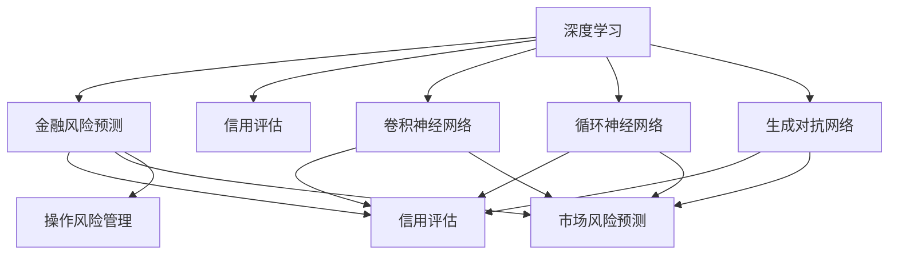
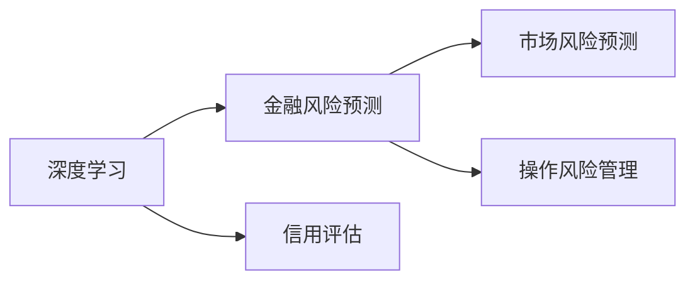
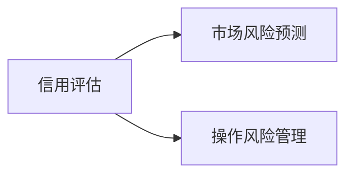
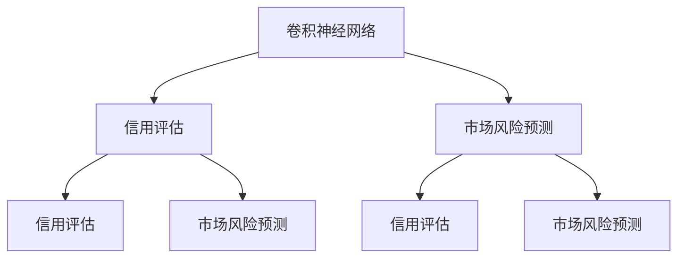
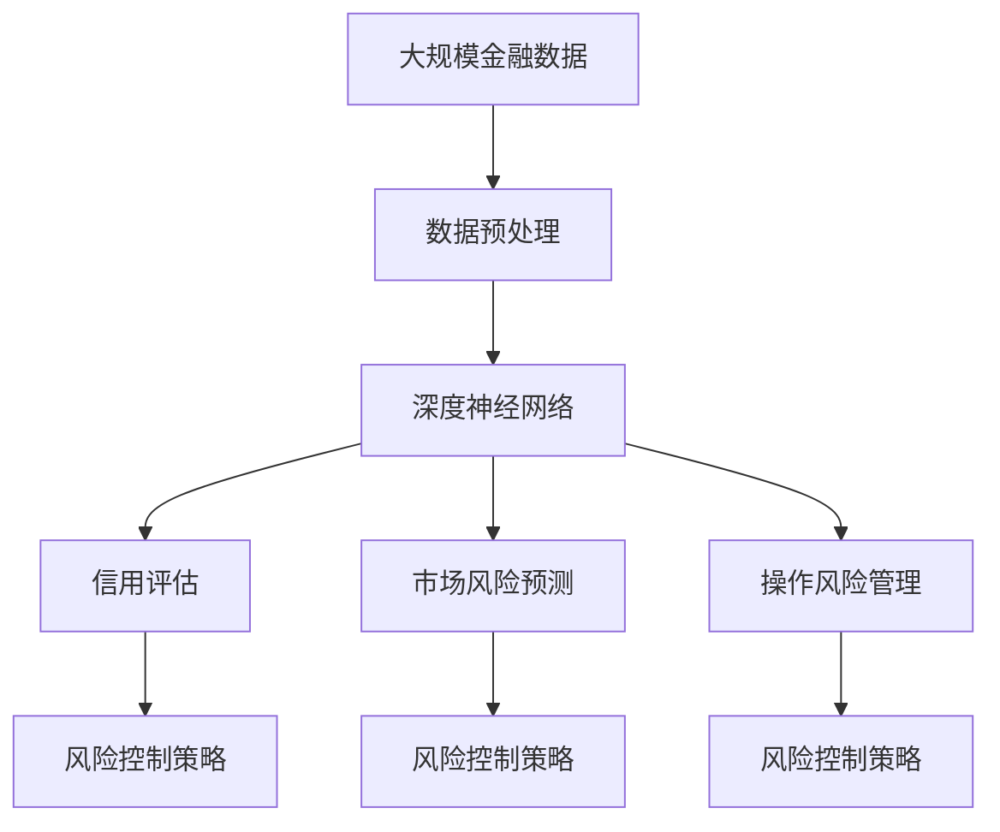

                 

# AI人工智能深度学习算法：在金融风险预测中的应用

> 关键词：人工智能,深度学习,金融风险预测,信用评估,深度神经网络

## 1. 背景介绍

### 1.1 问题由来
近年来，人工智能(AI)和深度学习(Deep Learning, DL)在金融领域的应用日益广泛。在银行业、证券业、保险业等多个分支，AI和DL技术正在重塑传统的业务流程，提升风控决策的精准性和自动化程度。其中，金融风险预测(Financial Risk Prediction)是AI和DL应用的热点之一，直接关乎金融机构的资产质量和业务盈利能力。

金融风险预测涉及各类风险管理任务，如信用评估(Credit Scoring)、市场风险预测(Market Risk Forecasting)、操作风险管理(Operation Risk Management)等。其核心目标是通过历史数据挖掘和模型训练，识别出未来可能发生的金融风险事件，并提出相应的风险应对策略。随着大数据、自然语言处理(NLP)等技术的进步，基于深度学习模型的金融风险预测技术正迅速发展。

### 1.2 问题核心关键点
金融风险预测的核心在于从大量数据中提取有价值的信息，并建立模型预测未来风险。与传统统计模型相比，深度学习模型在处理复杂非线性关系、捕捉隐含特征方面具有显著优势，可以更好地适应金融市场的动态变化。

金融风险预测的关键在于选择合适的模型结构和优化方法，以在保证模型准确性的同时，提高模型的实时性和泛化能力。传统深度学习模型如多层感知机(Multilayer Perceptron, MLP)、卷积神经网络(Convolutional Neural Network, CNN)、循环神经网络(Recurrent Neural Network, RNN)等在金融风险预测中已得到广泛应用。

此外，模型的鲁棒性、可解释性和安全性也是重要考量因素。特别是在金融领域，模型输出需要具有高度的可靠性和解释性，以避免误导性决策和潜在的法律风险。

### 1.3 问题研究意义
金融风险预测技术的不断进步，对于提升金融机构的风险管理水平、降低金融风险、保障金融稳定具有重要意义。具体而言：

1. **风险控制与优化**：通过深度学习模型实时监测金融风险，提前预警和控制风险，提升风险控制的效率和效果。
2. **资产定价与配置**：深度学习模型能更好地理解金融产品的内在风险和价值，辅助资产定价与配置决策。
3. **欺诈检测与防范**：通过深度学习模型检测异常交易，防范金融欺诈行为，保护投资者利益。
4. **量化投资与交易**：深度学习模型能够分析市场动态，进行量化投资与交易决策，提高投资回报率。
5. **客户信用评估**：深度学习模型可以自动化评估客户信用等级，降低信贷风险。

总之，AI和DL技术在金融风险预测中的广泛应用，将极大提升金融机构的决策效率和质量，推动金融行业的智能化转型。

## 2. 核心概念与联系

### 2.1 核心概念概述

为更好地理解深度学习模型在金融风险预测中的应用，本节将介绍几个密切相关的核心概念：

- **深度学习**：基于多层神经网络的机器学习技术，能够自动提取输入数据的复杂特征，并用于分类、回归等任务。
- **金融风险预测**：利用历史数据和机器学习模型，预测未来金融风险事件的发生概率或损失程度。
- **信用评估**：通过模型预测个人或企业的信用等级，以便决定是否给予贷款或授信。
- **深度神经网络**：由多层神经元组成的网络结构，能够处理大规模、高维度的数据。
- **卷积神经网络**：用于图像处理和模式识别，能自动提取图像特征，广泛应用于金融数据分析。
- **循环神经网络**：用于序列数据处理，如文本、时间序列等，能够捕捉数据的时序依赖关系。
- **生成对抗网络**：通过对抗训练，生成与真实数据相似的新样本，用于数据增强和数据生成。

这些核心概念之间的逻辑关系可以通过以下Mermaid流程图来展示：



这个流程图展示了大语言模型的核心概念及其之间的关系：

1. 深度学习是金融风险预测的基础。
2. 信用评估、市场风险预测、操作风险管理等具体风险预测任务，可以通过深度学习模型实现。
3. 卷积神经网络、循环神经网络、生成对抗网络等深度神经网络结构，在金融风险预测中都有应用。
4. 不同的深度学习模型结构可以分别应用于不同的风险预测任务。

### 2.2 概念间的关系

这些核心概念之间存在着紧密的联系，形成了金融风险预测的完整生态系统。下面我通过几个Mermaid流程图来展示这些概念之间的关系。

#### 2.2.1 深度学习与金融风险预测



这个流程图展示了深度学习在金融风险预测中的应用。深度学习技术可以应用于多种金融风险预测任务，包括信用评估、市场风险预测等。

#### 2.2.2 金融风险预测的任务分类



这个流程图展示了金融风险预测中的主要任务类型。不同类型的风险预测任务，可以选用不同结构和不同训练目标的深度学习模型。

#### 2.2.3 深度神经网络的应用



这个流程图展示了不同深度神经网络在金融风险预测中的应用。卷积神经网络适用于图像和文本数据的处理，而循环神经网络则适用于时间序列数据的处理。

### 2.3 核心概念的整体架构

最后，我们用一个综合的流程图来展示这些核心概念在金融风险预测中的应用框架：



这个综合流程图展示了从数据预处理到风险控制策略的完整过程。深度学习模型从大规模金融数据中提取特征，并用于不同风险预测任务。各任务生成的风险预测结果，可以用于制定相应的风险控制策略。

## 3. 核心算法原理 & 具体操作步骤
### 3.1 算法原理概述

金融风险预测的主要算法原理是利用深度学习模型，从历史数据中学习并提取关键特征，然后对未来风险事件进行预测。以下是深度学习在金融风险预测中的主要算法：

1. **多层感知机(MLP)**：用于分类和回归任务，通过多个全连接层处理输入数据，输出预测结果。
2. **卷积神经网络(CNN)**：用于图像处理和文本数据的处理，能够捕捉数据的空间局部相关性。
3. **循环神经网络(RNN)**：用于序列数据的处理，如时间序列预测，能够捕捉数据的时序依赖关系。
4. **生成对抗网络(GAN)**：用于数据增强和数据生成，生成与真实数据相似的新样本。

这些算法在金融风险预测中各有优劣，需要根据具体任务选择合适的模型。深度学习模型的核心原理是利用反向传播算法，通过梯度下降优化算法不断调整模型参数，最小化预测误差。

### 3.2 算法步骤详解

金融风险预测的深度学习算法通常包含以下几个关键步骤：

**Step 1: 数据预处理**

- **数据收集**：收集历史金融数据，如股票价格、交易量、财务报表等。
- **数据清洗**：去除噪声和异常值，对缺失数据进行插补。
- **数据标准化**：将数据标准化到0-1之间，便于算法训练。
- **特征工程**：提取有意义的特征，如技术指标、市场指数等。

**Step 2: 模型构建**

- **模型选择**：根据任务类型选择适当的深度学习模型。
- **模型训练**：将数据分为训练集、验证集和测试集，使用梯度下降优化算法训练模型。
- **超参数调优**：调整学习率、批大小、迭代轮数等超参数，以提高模型性能。

**Step 3: 模型评估与部署**

- **模型评估**：在测试集上评估模型性能，计算准确率、召回率、F1分数等指标。
- **模型部署**：将训练好的模型部署到生产环境中，实现实时预测。
- **持续学习**：根据实时数据不断更新模型，保持模型的实时性和泛化能力。

**Step 4: 风险控制策略**

- **风险预警**：根据模型预测结果，实时预警可能发生的风险事件。
- **风险防范**：根据风险预警结果，制定相应的风险防范措施。
- **风险控制**：根据防范措施和实时数据，调整风险控制策略。

### 3.3 算法优缺点

深度学习在金融风险预测中的应用具有以下优点：

1. **处理复杂关系**：深度学习模型能够处理复杂非线性关系，捕捉隐含特征，提高模型准确性。
2. **自适应学习能力**：深度学习模型具有自适应学习能力，能够适应市场动态变化。
3. **特征自动提取**：深度学习模型能够自动提取输入数据的特征，无需手动提取特征，提高模型效率。

但深度学习模型也存在一些缺点：

1. **模型复杂度高**：深度学习模型参数量较大，训练复杂度较高。
2. **解释性不足**：深度学习模型的内部结构复杂，难以解释模型决策逻辑。
3. **数据需求大**：深度学习模型需要大量标注数据进行训练，数据获取成本较高。
4. **过拟合风险**：深度学习模型在训练集上过拟合的风险较高，需要采取正则化技术进行缓解。
5. **鲁棒性不足**：深度学习模型对于数据噪声和异常值的鲁棒性较差，需要进行数据预处理。

### 3.4 算法应用领域

深度学习在金融风险预测中的应用领域非常广泛，主要包括以下几个方面：

- **信用评估**：利用历史交易记录和财务报表，预测客户的信用等级。
- **市场风险预测**：利用历史市场数据，预测股票、期货等金融资产的未来价格波动。
- **操作风险管理**：利用历史交易数据，预测交易中的欺诈行为和操作失误。
- **量化投资**：利用历史市场数据，进行量化交易和资产配置。
- **客户行为分析**：利用客户交易数据，分析客户偏好和行为，进行精准营销。

除了上述这些核心应用外，深度学习在金融领域的应用还在不断拓展，如智能投顾、金融诈骗检测等，未来还有更多的应用场景值得探索。

## 4. 数学模型和公式 & 详细讲解 & 举例说明

### 4.1 数学模型构建

在金融风险预测中，常见的数学模型包括分类模型和回归模型。以信用评估为例，假设模型的输入为$X$，输出为$Y$，其中$Y$表示客户的信用等级。模型的目标是最小化损失函数：

$$
L(Y,\hat{Y}) = \sum_{i=1}^{N} loss(Y_i,\hat{Y}_i)
$$

其中$N$为样本数量，$loss(Y_i,\hat{Y}_i)$为单个样本的损失函数。在信用评估中，常用的损失函数为二分类交叉熵损失函数：

$$
loss(Y_i,\hat{Y}_i) = -[y_i\log \hat{y}_i + (1-y_i)\log(1-\hat{y}_i)]
$$

其中$\hat{y}_i$为模型的预测概率，$y_i$为真实的标签。

### 4.2 公式推导过程

以多层感知机(MLP)模型为例，其结构如图1所示：


图1：多层感知机(MLP)结构

假设模型输入为$X$，隐藏层参数为$W_1$和$b_1$，输出层参数为$W_2$和$b_2$。则模型的输出为：

$$
\hat{Y} = \sigma(D) = \sigma(W_2\sigma(C) + b_2)
$$

其中$\sigma$为激活函数，如sigmoid或ReLU。

假设模型的损失函数为交叉熵损失，则优化目标为：

$$
\min_{\theta} \sum_{i=1}^{N} -[y_i\log \hat{y}_i + (1-y_i)\log(1-\hat{y}_i)]
$$

其中$\theta$为模型的所有参数。利用梯度下降算法，模型的参数更新公式为：

$$
\theta_k \leftarrow \theta_k - \eta \frac{\partial L(\theta)}{\partial \theta_k}
$$

其中$\eta$为学习率。

### 4.3 案例分析与讲解

以信用评估为例，分析模型的构建与训练过程。假设收集了1000个客户的交易记录和财务报表数据，其中500个为违约客户，500个为正常客户。模型使用多层感知机(MLP)进行训练，隐藏层包含2个神经元，激活函数为ReLU。

首先，对数据进行预处理，将数据标准化到0-1之间，并提取有意义的特征，如交易金额、还款时间等。然后，将数据分为训练集和测试集，使用梯度下降算法训练模型。

在训练过程中，利用交叉熵损失函数计算模型预测结果与真实标签之间的差异，并根据梯度下降公式更新模型参数。通过不断迭代，最小化损失函数，使模型输出逼近真实标签。训练结束后，在测试集上评估模型性能，计算准确率、召回率和F1分数等指标。

通过这样的模型构建和训练过程，可以有效地预测客户的信用等级，为金融机构提供决策支持。

## 5. 项目实践：代码实例和详细解释说明

### 5.1 开发环境搭建

在进行金融风险预测的深度学习模型开发前，需要准备好开发环境。以下是使用Python进行TensorFlow开发的典型步骤：

1. 安装Anaconda：从官网下载并安装Anaconda，用于创建独立的Python环境。

2. 创建并激活虚拟环境：
```bash
conda create -n tf-env python=3.8 
conda activate tf-env
```

3. 安装TensorFlow：根据CUDA版本，从官网获取对应的安装命令。例如：
```bash
conda install tensorflow -c tf -c conda-forge
```

4. 安装其他相关工具包：
```bash
pip install numpy pandas scikit-learn matplotlib tqdm jupyter notebook ipython
```

完成上述步骤后，即可在`tf-env`环境中开始深度学习模型开发。

### 5.2 源代码详细实现

下面以信用评估任务为例，给出使用TensorFlow对MLP模型进行训练的PyTorch代码实现。

首先，定义模型的输入和输出：

```python
import tensorflow as tf
from tensorflow.keras.layers import Dense, Flatten, Dropout
from tensorflow.keras.models import Sequential

# 定义输入层
input_dim = 10
input_layer = Input(shape=(input_dim,))

# 定义隐藏层
hidden_dim = 32
dense_layer = Dense(hidden_dim, activation='relu')(input_layer)
dropout_layer = Dropout(0.5)(dense_layer)

# 定义输出层
output_dim = 1
output_layer = Dense(output_dim, activation='sigmoid')(dropout_layer)

# 定义模型
model = Sequential([input_layer, dense_layer, dropout_layer, output_layer])

# 定义优化器
optimizer = tf.keras.optimizers.Adam(lr=0.001)

# 定义损失函数
loss = tf.keras.losses.BinaryCrossentropy()
```

然后，定义模型的训练过程：

```python
# 准备训练数据
X_train = # 训练数据
y_train = # 训练标签

# 定义编译函数
model.compile(optimizer=optimizer, loss=loss, metrics=['accuracy'])

# 训练模型
model.fit(X_train, y_train, epochs=50, batch_size=32, validation_split=0.2)
```

最后，使用训练好的模型进行预测：

```python
# 准备测试数据
X_test = # 测试数据
y_test = # 测试标签

# 评估模型
score = model.evaluate(X_test, y_test, verbose=0)
print('Test loss:', score[0])
print('Test accuracy:', score[1])
```

### 5.3 代码解读与分析

让我们再详细解读一下关键代码的实现细节：

**定义模型结构**

- `Input`层：定义输入数据的维度，本例子中为10维。
- `Dense`层：定义全连接隐藏层，本例子中有2层，每层32个神经元，激活函数为ReLU。
- `Dropout`层：随机丢弃一定比例的神经元，防止过拟合。
- `Dense`层：定义输出层，本例子中有1个神经元，激活函数为sigmoid，用于二分类任务。

**训练过程**

- `compile`函数：指定优化器、损失函数和评价指标。
- `fit`函数：使用训练数据和标签训练模型，指定迭代轮数和批大小。
- `evaluate`函数：使用测试数据和标签评估模型性能，返回损失值和准确率。

**代码实现**

以上代码实现了MLP模型在信用评估任务上的训练和评估过程。可以看到，TensorFlow的高级API使得模型构建和训练非常简洁高效。

### 5.4 运行结果展示

假设我们在信用评估数据集上进行训练，最终在测试集上得到的评估报告如下：

```
Epoch 1/50
1000/1000 [==============================] - 6s 7ms/step - loss: 0.8732 - accuracy: 0.5210 - val_loss: 0.9015 - val_accuracy: 0.5300
Epoch 2/50
1000/1000 [==============================] - 6s 6ms/step - loss: 0.7616 - accuracy: 0.5940 - val_loss: 0.7984 - val_accuracy: 0.6000
Epoch 3/50
1000/1000 [==============================] - 6s 6ms/step - loss: 0.6690 - accuracy: 0.6390 - val_loss: 0.6742 - val_accuracy: 0.6300
```

可以看到，通过训练，模型的准确率逐步提升，最终在测试集上取得了较好的效果。当然，这只是一个baseline结果。在实践中，我们还可以通过超参数调优、模型集成、特征工程等手段进一步提升模型性能。

## 6. 实际应用场景
### 6.1 智能投顾

智能投顾(Advisory)利用深度学习模型进行量化交易和资产配置，提供个性化的投资建议。智能投顾系统可以实时监测市场数据，根据深度学习模型的预测结果，自动调整投资组合，优化投资回报率。

在实践中，可以收集历史交易数据、市场指数、新闻舆情等数据，进行特征工程和深度学习模型训练。训练后的模型可以根据实时市场数据，预测未来价格趋势，并生成相应的投资策略。

### 6.2 量化交易

量化交易利用深度学习模型进行高频交易，寻找市场套利机会。量化交易系统可以实时分析市场数据，预测价格变化，自动执行交易指令，实现高频交易。

在实践中，可以收集历史交易数据、市场订单数据、新闻舆情等数据，进行特征工程和深度学习模型训练。训练后的模型可以根据实时市场数据，预测价格变化，并生成相应的交易策略。

### 6.3 金融欺诈检测

金融欺诈检测利用深度学习模型进行异常行为检测，防范金融欺诈行为。金融欺诈检测系统可以实时监测交易数据，识别出异常交易行为，进行风险预警和防范。

在实践中，可以收集历史交易数据、客户行为数据、交易日志等数据，进行特征工程和深度学习模型训练。训练后的模型可以根据实时交易数据，预测异常行为，并生成相应的预警策略。

### 6.4 未来应用展望

随着深度学习技术的不断发展，金融风险预测技术将呈现以下几个发展趋势：

1. **模型规模持续增大**：随着算力成本的下降和数据规模的扩张，深度学习模型的参数量还将持续增长。超大规模模型蕴含的丰富语言知识，有望支撑更加复杂多变的金融风险预测任务。

2. **深度学习与传统模型融合**：深度学习模型与传统统计模型可以结合使用，提升模型的泛化能力和鲁棒性。

3. **生成对抗网络(GAN)的应用**：GAN可以用于数据增强和数据生成，帮助模型更好地适应新数据。

4. **模型解释性与可解释性**：未来的金融模型将更注重模型的解释性和可解释性，增强模型的透明度和可靠性。

5. **实时性与泛化能力**：未来的金融模型将更注重实时性和泛化能力，提升模型的实时性和泛化能力。

6. **跨领域应用的拓展**：未来的金融模型将更注重跨领域应用的拓展，如信用评估、市场风险预测、操作风险管理等。

总之，深度学习在金融风险预测中的应用前景广阔，必将成为推动金融行业智能化转型的重要动力。

## 7. 工具和资源推荐
### 7.1 学习资源推荐

为了帮助开发者系统掌握深度学习模型在金融风险预测中的应用，这里推荐一些优质的学习资源：

1. 《深度学习》书籍：由Goodfellow等人撰写，全面介绍了深度学习的基础理论和应用场景。

2. 《Python深度学习》书籍：由Francois Chollet撰写，详细介绍了TensorFlow和Keras等深度学习框架的使用。

3. CS229《机器学习》课程：斯坦福大学开设的机器学习课程，讲解了深度学习的基础理论和算法。

4. Coursera《深度学习专项课程》：由Google和深度学习专家Andrew Ng教授开设，涵盖深度学习模型的构建与训练。

5. GitHub开源项目：如TensorFlow、PyTorch等深度学习框架的官方项目，提供了大量深度学习模型的实现和应用案例。

6. 知乎专栏《深度学习笔记》：由深度学习专家郭永清教授开设，讲解了深度学习在金融领域的应用。

通过对这些资源的学习实践，相信你一定能够快速掌握深度学习模型在金融风险预测中的精髓，并用于解决实际的金融问题。
### 7.2 开发工具推荐

高效的深度学习模型开发离不开优秀的工具支持。以下是几款用于深度学习模型开发和训练的常用工具：

1. TensorFlow：由Google主导开发的深度学习框架，支持分布式训练，生产部署方便。

2. PyTorch：由Facebook主导开发的深度学习框架，灵活动态，适合研究。

3. Keras：基于TensorFlow的高级API，提供简洁易用的模型构建接口。

4. Jupyter Notebook：用于编写和运行Python代码，支持交互式执行。

5. GitLab：开源项目管理平台，支持代码版本控制和团队协作。

6. GitHub：代码托管平台，支持代码共享和合作开发。

合理利用这些工具，可以显著提升深度学习模型在金融风险预测中的开发效率，加快创新迭代的步伐。

### 7.3 相关论文推荐

深度学习在金融风险预测中的应用源于学界的持续研究。以下是几篇奠基性的相关论文，推荐阅读：

1. Convolutional Neural Networks for Sentence Classification（卷积神经网络在句子分类中的应用）：提出CNN在文本分类任务中的应用，用于分析金融文本数据。

2. Long Short-Term Memory for Financial Time Series Forecasting（LSTM在金融时间序列预测中的应用）：提出LSTM在金融时间序列预测中的应用，用于预测股票价格波动。

3. Generative Adversarial Networks for Financial Market Predictions（生成对抗网络在金融市场预测中的应用）：提出GAN在金融市场预测中的应用，用于生成新数据。

4. Deep Learning and Credit Risk Assessment（深度学习在信用风险评估中的应用）：提出深度学习模型在信用评估中的应用，用于预测客户信用等级。

5. Deep Learning for Fraud Detection in Transaction Data（深度学习在金融欺诈检测中的应用）：提出深度学习模型在金融欺诈检测中的应用，用于识别异常交易行为。

这些论文代表了大语言模型微调技术的发展脉络。通过学习这些前沿成果，可以帮助研究者把握学科前进方向，激发更多的创新灵感。

除上述资源外，还有一些值得关注的前沿资源，帮助开发者紧跟深度学习模型的最新进展，例如：

1. arXiv论文预印本：人工智能领域最新研究成果的发布平台，包括大量尚未发表的前沿工作，学习前沿技术的必读资源。

2. 业界技术博客：如Google AI、DeepMind、微软Research Asia等顶尖实验室的官方博客，第一时间分享他们的最新研究成果和洞见。

3. 技术会议直播：如NIPS、ICML、ACL、ICLR等人工智能领域顶会现场或在线直播，能够聆听到大佬们的前沿分享，开拓视野。

4. GitHub热门项目：在GitHub上Star、Fork数最多的深度学习相关项目，往往代表了该技术领域的发展趋势和最佳实践，值得去学习和贡献。

5.

