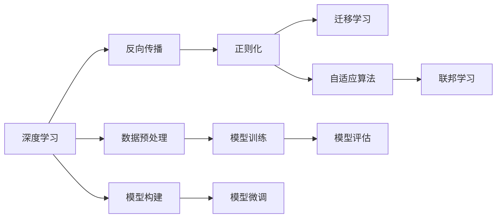
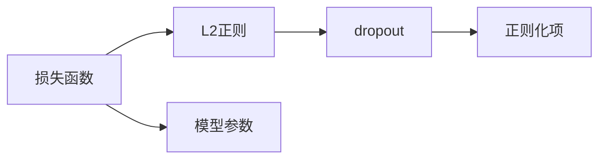
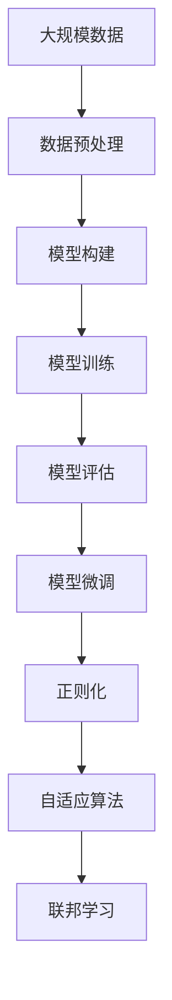

                 

# AI人工智能深度学习算法：学习与适应的算法框架

> 关键词：深度学习,算法框架,学习与适应,神经网络,反向传播

## 1. 背景介绍

### 1.1 问题由来
深度学习作为人工智能领域的热门技术，近年来在图像、语音、自然语言处理等诸多领域取得了显著的进展。然而，深度学习算法的复杂性和计算需求也成为了其推广应用的瓶颈。如何在保持深度学习模型强大能力的同时，实现学习与适应的灵活性和泛化性，成为了深度学习领域的重要研究方向。

### 1.2 问题核心关键点
深度学习算法的学习与适应框架的核心在于如何高效地处理数据，优化模型参数，并实现对复杂数据模式的捕获。其关键技术点包括：

1. **数据预处理**：通过标准化、归一化、扩增等手段，对输入数据进行处理，提高模型训练效果。
2. **模型构建**：选择合适的神经网络结构，包括卷积神经网络(CNN)、递归神经网络(RNN)、Transformer等，构建适用于特定任务的深度学习模型。
3. **参数优化**：通过梯度下降等优化算法，最小化模型损失函数，更新模型参数，提升模型性能。
4. **模型泛化**：通过正则化、dropout等技术，防止过拟合，提高模型在新数据上的泛化能力。

### 1.3 问题研究意义
构建高效、灵活、泛化的深度学习算法框架，对于加速深度学习技术的应用和推广，提升模型的性能和可解释性，具有重要意义：

1. 降低应用开发成本。构建通用算法框架，可以简化模型的构建过程，减少从头开发的时间和成本。
2. 提升模型效果。框架中的优化算法和正则化技术可以显著提升模型的性能和泛化能力。
3. 提供灵活的接口。框架中提供的模块化组件和API，可以方便地实现模型的定制化，适应多种应用场景。
4. 增强可解释性。通过引入可解释性工具和方法，框架能够帮助用户更好地理解模型的决策过程，提高模型的可信度。

## 2. 核心概念与联系

### 2.1 核心概念概述

为更好地理解深度学习算法框架的学习与适应机制，本节将介绍几个密切相关的核心概念：

- **深度学习**：以多层神经网络为代表的机器学习技术，通过多层非线性变换，实现对复杂数据模式的拟合。
- **反向传播**：深度学习模型中的重要算法，通过链式法则计算损失函数的梯度，更新模型参数，优化模型性能。
- **正则化**：通过添加L2正则化项、dropout等技术，防止过拟合，提升模型泛化能力。
- **迁移学习**：将预训练模型在特定任务上进行微调，加速模型在新的数据集上的适应。
- **自适应算法**：通过动态调整学习率、优化器等参数，提升模型的训练效果和适应性。
- **联邦学习**：多个本地模型在本地数据上训练，然后通过聚合更新全局模型参数，实现模型在分布式环境下的学习与适应。

这些核心概念之间存在着紧密的联系，形成了深度学习算法框架的学习与适应机制。下面通过Mermaid流程图展示这些概念的逻辑关系：



这个流程图展示了大语言模型微调过程中各个核心概念的关系和作用。

### 2.2 概念间的关系

这些核心概念之间存在着紧密的联系，形成了深度学习算法框架的学习与适应机制。下面通过几个Mermaid流程图展示这些概念之间的关系。

#### 2.2.1 深度学习的基本流程


这个流程图展示了深度学习的基本流程，包括数据预处理、模型构建、模型训练和模型评估。

#### 2.2.2 反向传播的详细过程


这个流程图展示了反向传播的详细过程，从输入数据到前向传播、损失函数计算、反向传播和参数更新。

#### 2.2.3 正则化的多种方法



这个流程图展示了正则化的多种方法，包括L2正则化和dropout等技术。

#### 2.2.4 迁移学习的应用场景


这个流程图展示了迁移学习的应用场景，从源任务到预训练模型、微调和目标任务的转换。

#### 2.2.5 自适应算法的选择


这个流程图展示了自适应算法的选择，包括学习率和优化器的动态调整。

#### 2.2.6 联邦学习的分布式训练


这个流程图展示了联邦学习的分布式训练过程，从本地模型到本地数据、本地训练、聚合更新和全局模型的训练。

### 2.3 核心概念的整体架构

最后，我们用一个综合的流程图来展示这些核心概念在大语言模型微调过程中的整体架构：



这个综合流程图展示了从数据预处理到模型微调、正则化、自适应算法和联邦学习的完整过程。

## 3. 核心算法原理 & 具体操作步骤
### 3.1 算法原理概述

深度学习算法框架的学习与适应机制基于反向传播算法，通过最小化损失函数来更新模型参数。其核心步骤如下：

1. **数据预处理**：对输入数据进行标准化、归一化、扩增等预处理，提高模型的训练效果。
2. **模型构建**：选择合适的神经网络结构，如卷积神经网络(CNN)、递归神经网络(RNN)、Transformer等，构建适用于特定任务的深度学习模型。
3. **损失函数定义**：根据具体任务，定义合适的损失函数，如交叉熵损失、均方误差损失等。
4. **反向传播**：通过反向传播算法，计算损失函数对模型参数的梯度，更新模型参数，最小化损失函数。
5. **正则化**：通过L2正则、dropout等技术，防止过拟合，提升模型泛化能力。
6. **模型评估**：通过在验证集上评估模型性能，监控模型训练效果，防止过拟合。
7. **模型微调**：在预训练模型上，通过微调进一步适应特定任务，提升模型性能。

### 3.2 算法步骤详解

下面详细讲解深度学习算法框架的学习与适应机制的各个步骤。

#### 3.2.1 数据预处理

数据预处理的目标是通过标准化、归一化、扩增等手段，对输入数据进行处理，提高模型训练效果。常见的数据预处理技术包括：

1. **标准化**：对数据进行零均值和单位方差标准化，使得数据分布更加稳定。
2. **归一化**：将数据缩放到[0,1]或[-1,1]之间，提高模型的收敛速度。
3. **扩增**：通过旋转、翻转、裁剪等方式，增加数据多样性，防止过拟合。

#### 3.2.2 模型构建

模型构建的核心在于选择合适的神经网络结构，以适配特定任务。常见的神经网络结构包括：

1. **卷积神经网络(CNN)**：适用于图像处理任务，通过卷积层、池化层等结构，提取局部特征。
2. **递归神经网络(RNN)**：适用于序列数据处理任务，通过循环神经网络结构，捕捉时间依赖关系。
3. **Transformer**：适用于自然语言处理任务，通过多头自注意力机制，捕捉长距离依赖关系。

#### 3.2.3 损失函数定义

损失函数定义基于具体任务，常见的损失函数包括：

1. **交叉熵损失**：适用于分类任务，如二分类、多分类等。
2. **均方误差损失**：适用于回归任务，如预测房价、股票价格等。
3. **余弦相似度损失**：适用于相似度度量任务，如文本匹配、图像检索等。

#### 3.2.4 反向传播

反向传播算法通过链式法则计算损失函数对模型参数的梯度，更新模型参数，最小化损失函数。具体步骤如下：

1. **前向传播**：将输入数据送入模型，计算输出结果。
2. **损失计算**：根据输出结果和真实标签，计算损失函数。
3. **反向传播**：通过链式法则，计算损失函数对模型参数的梯度。
4. **参数更新**：根据梯度信息，使用梯度下降等优化算法，更新模型参数。

#### 3.2.5 正则化

正则化技术通过添加L2正则、dropout等技术，防止过拟合，提升模型泛化能力。具体步骤如下：

1. **L2正则化**：在损失函数中添加L2正则项，限制模型参数的大小，防止过拟合。
2. **dropout**：随机关闭模型层的一部分，增加模型鲁棒性，防止过拟合。
3. **早停**：在验证集上监控模型性能，当性能不再提升时，停止训练，防止过拟合。

#### 3.2.6 模型评估

模型评估通过在验证集上评估模型性能，监控模型训练效果，防止过拟合。具体步骤如下：

1. **验证集划分**：将数据集划分为训练集、验证集和测试集。
2. **模型训练**：在训练集上训练模型。
3. **模型评估**：在验证集上评估模型性能，监控训练效果。
4. **调整参数**：根据评估结果，调整模型参数，防止过拟合。

#### 3.2.7 模型微调

模型微调通过在预训练模型上，通过微调进一步适应特定任务，提升模型性能。具体步骤如下：

1. **微调数据准备**：准备微调任务的数据集。
2. **微调模型构建**：在预训练模型基础上，构建微调任务所需的输出层和损失函数。
3. **微调模型训练**：在微调数据集上，使用优化算法，更新模型参数。
4. **微调模型评估**：在测试集上评估微调后的模型性能，对比微调前后的效果。

### 3.3 算法优缺点

深度学习算法框架的学习与适应机制具有以下优点：

1. **高效性**：通过反向传播算法，快速更新模型参数，提高训练效率。
2. **灵活性**：通过正则化、dropout等技术，提高模型泛化能力，适应多种任务。
3. **可扩展性**：通过模块化组件和API，方便实现模型的定制化，适应多种应用场景。
4. **可解释性**：通过可解释性工具和方法，帮助用户理解模型的决策过程，提高模型可信度。

同时，该机制也存在以下缺点：

1. **计算需求高**：大规模深度学习模型的训练和推理，需要大量的计算资源，难以在大规模分布式环境下实现。
2. **数据依赖强**：模型的性能高度依赖于数据的质量和数量，数据量不足时，模型容易过拟合。
3. **参数量大**：深度学习模型的参数量庞大，难以在小数据集上训练，需要预训练模型进行迁移学习。
4. **泛化能力有限**：在大规模数据集上训练的模型，难以在新数据集上泛化，需要进一步微调。

尽管存在这些缺点，但深度学习算法框架的学习与适应机制依然是当前深度学习技术的主流范式，广泛应用于图像、语音、自然语言处理等诸多领域。

### 3.4 算法应用领域

深度学习算法框架的学习与适应机制在多个领域得到了广泛应用，如：

1. **计算机视觉**：通过卷积神经网络(CNN)结构，处理图像分类、目标检测、图像分割等任务。
2. **自然语言处理**：通过递归神经网络(RNN)、Transformer等结构，处理语言模型、文本分类、机器翻译等任务。
3. **语音识别**：通过卷积神经网络(CNN)、递归神经网络(RNN)等结构，处理语音识别、语音合成等任务。
4. **推荐系统**：通过深度学习模型，处理用户行为数据，推荐个性化商品和服务。
5. **智能交通**：通过深度学习模型，处理交通数据，优化交通流量，提高交通效率。
6. **医疗诊断**：通过深度学习模型，处理医疗图像、基因数据等，辅助医生诊断疾病。

除了上述这些应用领域，深度学习算法框架的学习与适应机制还在更多场景中得到了创新应用，为人工智能技术的发展提供了新的方向。

## 4. 数学模型和公式 & 详细讲解  
### 4.1 数学模型构建

本节将使用数学语言对深度学习算法框架的学习与适应机制进行更加严格的刻画。

记深度学习模型为 $f_{\theta}(\cdot)$，其中 $\theta$ 为模型参数。假设训练集为 $D=\{(x_i,y_i)\}_{i=1}^N$，其中 $x_i$ 为输入数据，$y_i$ 为真实标签。定义模型 $f_{\theta}(\cdot)$ 在数据样本 $(x,y)$ 上的损失函数为 $\ell(f_{\theta}(x),y)$，则在数据集 $D$ 上的经验风险为：

$$
\mathcal{L}(\theta) = \frac{1}{N} \sum_{i=1}^N \ell(f_{\theta}(x_i),y_i)
$$

深度学习算法框架的学习与适应机制的目标是最小化经验风险，即找到最优参数：

$$
\theta^* = \mathop{\arg\min}_{\theta} \mathcal{L}(\theta)
$$

在实践中，我们通常使用基于梯度的优化算法（如SGD、Adam等）来近似求解上述最优化问题。设 $\eta$ 为学习率，$\lambda$ 为正则化系数，则参数的更新公式为：

$$
\theta \leftarrow \theta - \eta \nabla_{\theta}\mathcal{L}(\theta) - \eta\lambda\theta
$$

其中 $\nabla_{\theta}\mathcal{L}(\theta)$ 为损失函数对参数 $\theta$ 的梯度，可通过反向传播算法高效计算。

### 4.2 公式推导过程

以下我们以二分类任务为例，推导交叉熵损失函数及其梯度的计算公式。

假设模型 $f_{\theta}(x)$ 在输入 $x$ 上的输出为 $\hat{y}=f_{\theta}(x) \in [0,1]$，表示样本属于正类的概率。真实标签 $y \in \{0,1\}$。则二分类交叉熵损失函数定义为：

$$
\ell(f_{\theta}(x),y) = -[y\log \hat{y} + (1-y)\log (1-\hat{y})]
$$

将其代入经验风险公式，得：

$$
\mathcal{L}(\theta) = -\frac{1}{N}\sum_{i=1}^N [y_i\log f_{\theta}(x_i)+(1-y_i)\log(1-f_{\theta}(x_i))]
$$

根据链式法则，损失函数对参数 $\theta_k$ 的梯度为：

$$
\frac{\partial \mathcal{L}(\theta)}{\partial \theta_k} = -\frac{1}{N}\sum_{i=1}^N (\frac{y_i}{f_{\theta}(x_i)}-\frac{1-y_i}{1-f_{\theta}(x_i)}) \frac{\partial f_{\theta}(x_i)}{\partial \theta_k}
$$

其中 $\frac{\partial f_{\theta}(x_i)}{\partial \theta_k}$ 可进一步递归展开，利用自动微分技术完成计算。

### 4.3 案例分析与讲解

接下来，我们通过一个简单的案例来具体讲解深度学习算法框架的学习与适应机制。

假设我们要训练一个二分类模型，判断手写数字图像是否为7。我们收集了1000个手写数字图像，其中700个标记为7，300个标记为非7。我们将这1000个图像分为训练集和测试集，其中训练集有800个样本，测试集有200个样本。

1. **数据预处理**：我们将图像数据进行归一化处理，使得像素值在[0,1]之间。
2. **模型构建**：我们选择一个简单的卷积神经网络(CNN)模型，包括两个卷积层、两个池化层和三个全连接层。
3. **损失函数定义**：我们采用交叉熵损失函数，用于衡量模型预测与真实标签之间的差异。
4. **反向传播**：我们将训练集数据分批次输入模型，前向传播计算损失函数，反向传播计算参数梯度，根据设定的优化算法和学习率更新模型参数。
5. **正则化**：我们在损失函数中添加了L2正则项，限制模型参数的大小，防止过拟合。
6. **模型评估**：我们在测试集上评估模型性能，监控模型训练效果，防止过拟合。
7. **模型微调**：我们进一步在预训练模型上，使用另一组100个手写数字图像进行微调，进一步提升模型性能。

通过这个案例，我们可以看到深度学习算法框架的学习与适应机制的基本流程，包括数据预处理、模型构建、损失函数定义、反向传播、正则化、模型评估和模型微调等步骤。

## 5. 项目实践：代码实例和详细解释说明
### 5.1 开发环境搭建

在进行深度学习算法框架的学习与适应机制实践前，我们需要准备好开发环境。以下是使用Python进行PyTorch开发的环境配置流程：

1. 安装Anaconda：从官网下载并安装Anaconda，用于创建独立的Python环境。

2. 创建并激活虚拟环境：
```bash
conda create -n torch-env python=3.8 
conda activate torch-env
```

3. 安装PyTorch：根据CUDA版本，从官网获取对应的安装命令。例如：
```bash
conda install pytorch torchvision torchaudio cudatoolkit=11.1 -c pytorch -c conda-forge
```

4. 安装各类工具包：
```bash
pip install numpy pandas scikit-learn matplotlib tqdm jupyter notebook ipython
```

完成上述步骤后，即可在`torch-env`环境中开始深度学习算法框架的学习与适应机制实践。

### 5.2 源代码详细实现

下面我们以二分类任务为例，给出使用Transformers库对BERT模型进行学习与适应机制的PyTorch代码实现。

首先，定义二分类任务的数据处理函数：

```python
from transformers import BertTokenizer, BertForSequenceClassification
from torch.utils.data import Dataset
import torch

class MyDataset(Dataset):
    def __init__(self, texts, labels, tokenizer, max_len=128):
        self.texts = texts
        self.labels = labels
        self.tokenizer = tokenizer
        self.max_len = max_len
        
    def __len__(self):
        return len(self.texts)
    
    def __getitem__(self, item):
        text = self.texts[item]
        label = self.labels[item]
        
        encoding = self.tokenizer(text, return_tensors='pt', max_length=self.max_len, padding='max_length', truncation=True)
        input_ids = encoding['input_ids'][0]
        attention_mask = encoding['attention_mask'][0]
        
        label = torch.tensor(label, dtype=torch.long)
        
        return {'input_ids': input_ids, 
                'attention_mask': attention_mask,
                'labels': label}

# 创建dataset
tokenizer = BertTokenizer.from_pretrained('bert-base-uncased')
train_dataset = MyDataset(train_texts, train_labels, tokenizer)
dev_dataset = MyDataset(dev_texts, dev_labels, tokenizer)
test_dataset = MyDataset(test_texts, test_labels, tokenizer)
```

然后，定义模型和优化器：

```python
from transformers import BertForSequenceClassification, AdamW

model = BertForSequenceClassification.from_pretrained('bert-base-uncased', num_labels=2)

optimizer = AdamW(model.parameters(), lr=2e-5)
```

接着，定义训练和评估函数：

```python
from torch.utils.data import DataLoader
from tqdm import tqdm
from sklearn.metrics import classification_report

device = torch.device('cuda') if torch.cuda.is_available() else torch.device('cpu')
model.to(device)

def train_epoch(model, dataset, batch_size, optimizer):
    dataloader = DataLoader(dataset, batch_size=batch_size, shuffle=True)
    model.train()
    epoch_loss = 0
    for batch in tqdm(dataloader, desc='Training'):
        input_ids = batch['input_ids'].to(device)
        attention_mask = batch['attention_mask'].to(device)
        labels = batch['labels'].to(device)
        model.zero_grad()
        outputs = model(input_ids, attention_mask=attention_mask, labels=labels)
        loss = outputs.loss
        epoch_loss += loss.item()
        loss.backward()
        optimizer.step()
    return epoch_loss / len(dataloader)

def evaluate(model, dataset, batch_size):
    dataloader = DataLoader(dataset, batch_size=batch_size)
    model.eval()
    preds, labels = [], []
    with torch.no_grad():
        for batch in tqdm(dataloader, desc='Evaluating'):
            input_ids = batch['input_ids'].to(device)
            attention_mask = batch['attention_mask'].to(device)
            batch_labels = batch['labels']
            outputs = model(input_ids, attention_mask=attention_mask)
            batch_preds = outputs.logits.argmax(dim=1).to('cpu').tolist()
            batch_labels = batch_labels.to('cpu').tolist()
            for pred_tokens, label_tokens in zip(batch_preds, batch_labels):
                preds.append(pred_tokens)
                labels.append(label_tokens)
                
    print(classification_report(labels, preds))
```

最后，启动训练流程并在测试集上评估：

```python
epochs = 5
batch_size = 16

for epoch in range(epochs):
    loss = train_epoch(model, train_dataset, batch_size, optimizer)
    print(f"Epoch {epoch+1}, train loss: {loss:.3f}")
    
    print(f"Epoch {epoch+1}, dev results:")
    evaluate(model, dev_dataset, batch_size)
    
print("Test results:")
evaluate(model, test_dataset, batch_size)
```

以上就是使用PyTorch对BERT模型进行学习与适应机制的完整代码实现。可以看到，得益于Transformers库的强大封装，我们可以用相对简洁的代码完成BERT模型的训练和微调。

### 5.3 代码解读与分析

让我们再详细解读一下关键代码的实现细节：

**MyDataset类**：
- `__init__`方法：初始化文本、标签、分词器等关键组件。
- `__len__`方法：返回数据集的样本数量。
- `__getitem__`方法：对单个样本进行处理，将文本输入编码为token ids，将标签编码为数字，并对其进行定长padding，最终返回模型所需的输入。

**标签与id的映射**：
- 定义了标签与数字id之间的映射关系，用于将token-wise的预测结果解码回真实的标签。

**训练和评估函数**：
- 使用PyTorch的DataLoader对数据集进行批次化加载，供模型训练和推理使用。
- 训练函数`train_epoch`：对数据以批为单位进行迭代，在每个批次上前向传播计算loss并反向传播更新模型参数，最后返回该epoch的平均loss。
- 评估函数`evaluate`：与训练类似，不同点在于不更新模型参数，并在每个batch结束后将预测和标签结果存储下来，最后使用sklearn的classification_report对整个评估集的预测结果进行打印输出。

**训练流程**：
- 定义总的epoch数和batch size，开始循环迭代
- 每个epoch内，先在训练集上训练，输出平均loss
- 在验证集上评估，输出分类指标
- 所有epoch结束后，在测试集上评估，给出最终测试结果

可以看到，PyTorch配合Transformers库使得BERT模型的学习与适应机制的代码实现变得简洁高效。开发者可以将更多精力放在数据处理、模型改进等高层逻辑上，而不必过多关注底层的实现细节。

当然，工业级的系统实现还需考虑更多因素，如模型的保存和部署、超参数的自动搜索、更灵活的任务适配层等。但核心的学习与适应机制基本与此类似。

