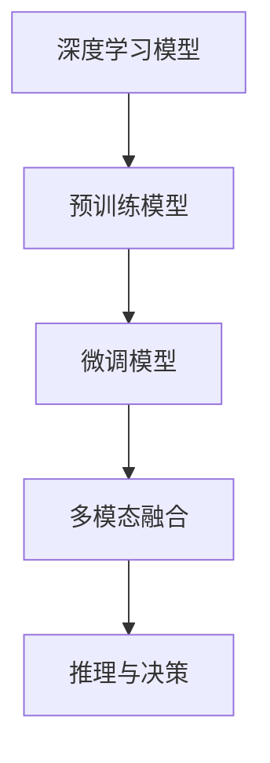
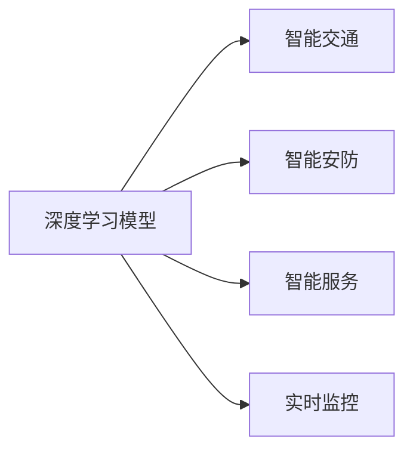
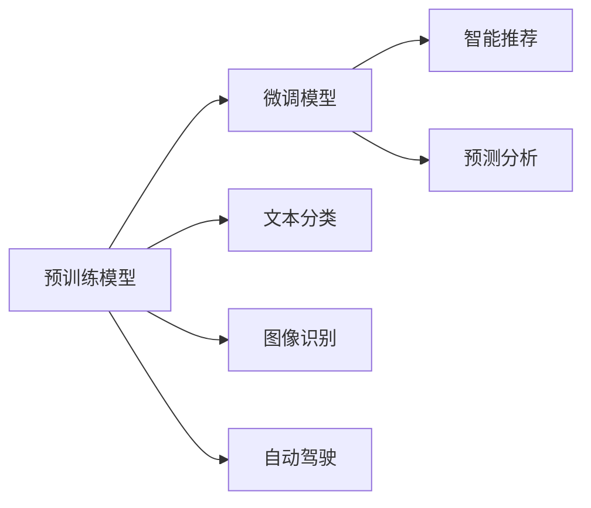
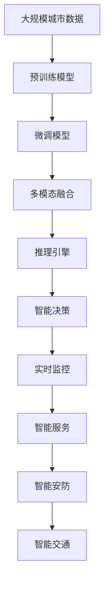

                 

# AI人工智能深度学习算法：智能深度学习代理在智慧城市中的实践

> 关键词：智能深度学习代理,智慧城市,大数据,自然语言处理,NLP,计算机视觉,深度学习,自动驾驶,实时监控

## 1. 背景介绍

### 1.1 问题由来
智慧城市是利用信息与通信技术（ICT），通过大数据、云计算、物联网等手段，实现城市各类资源的数字化、智能化、一体化管理，从而提升城市运行效率和生活质量。然而，智慧城市的建设涉及复杂的城市运行数据处理和优化决策问题，需要高效、精准、可靠的技术支持。

近年来，深度学习技术的快速发展，为智慧城市的建设提供了新的可能性。深度学习模型在自然语言处理（NLP）、计算机视觉（CV）、自动驾驶等领域展现出了强大的数据处理和模式识别能力，推动了智慧城市在智能交通、智能安防、智能服务等诸多应用场景的发展。

智能深度学习代理（AI Deep Learning Agents）作为深度学习技术的最新应用范式，利用预训练模型和微调技术，可以更加高效、灵活地部署在智慧城市的各类应用中，提升城市运行的智能化水平。

### 1.2 问题核心关键点
智能深度学习代理的核心思想是通过在大规模无标签数据上进行预训练，学习通用的特征表示，然后针对特定的智慧城市任务进行微调，优化模型性能。其关键点包括：

1. 预训练模型：以自回归或自编码的深度学习模型为代表的预训练模型，通过在大规模无标签数据上学习丰富的通用知识。
2. 微调技术：通过有标签数据对预训练模型进行微调，适应特定智慧城市任务，提升模型在实际应用中的表现。
3. 多模态融合：智慧城市数据往往包含文本、图像、语音等多种模态，智能深度学习代理能通过多模态融合，提升城市运行的感知和决策能力。

智能深度学习代理的核心流程包括：数据准备、模型预训练、微调模型、多模态融合与推理等。

### 1.3 问题研究意义
智能深度学习代理的研究和实践，对智慧城市的建设具有重要意义：

1. 提升数据处理能力：智能深度学习代理可以处理复杂多模态的城市运行数据，提升数据处理的效率和精度。
2. 优化决策支持：通过深度学习模型的强大推理能力，智能深度学习代理可以提供更加精准的决策支持。
3. 降低运营成本：智能深度学习代理利用预训练模型和大规模数据，可以大幅降低人工维护和开发的成本。
4. 增强系统鲁棒性：深度学习模型的泛化能力和鲁棒性，能提升智慧城市系统的稳定性和可靠性。
5. 促进技术创新：智能深度学习代理的部署和应用，将推动智慧城市技术的多样化和创新。

## 2. 核心概念与联系

### 2.1 核心概念概述

为了更好地理解智能深度学习代理在智慧城市中的应用，本节将介绍几个密切相关的核心概念：

- 深度学习模型：以多层神经网络为代表的深度学习模型，能够自动学习复杂特征表示，广泛应用于计算机视觉、自然语言处理等领域。
- 预训练模型：在大规模无标签数据上训练的深度学习模型，学习通用的特征表示。
- 微调模型：在预训练模型的基础上，使用有标签数据进行微调，优化模型在特定智慧城市任务上的表现。
- 多模态融合：通过融合文本、图像、语音等多种模态的信息，提升智慧城市系统的感知和决策能力。
- 推理与决策：将深度学习模型嵌入到智慧城市的实时监控、智能服务中，进行复杂的推理与决策。

这些核心概念之间存在紧密的联系，形成了智能深度学习代理在智慧城市中的整体应用框架。以下通过Mermaid流程图展示这些概念之间的关系：



这个流程图展示了深度学习模型的预训练、微调和多模态融合等关键过程，以及其在智慧城市应用中的决策和推理能力。

### 2.2 概念间的关系

这些核心概念之间存在着紧密的联系，形成了智能深度学习代理在智慧城市中的完整应用生态系统。以下通过Mermaid流程图展示这些概念之间的关系：

#### 2.2.1 深度学习模型与智慧城市应用



这个流程图展示了深度学习模型在智慧城市中的多个应用场景，包括智能交通、智能安防、智能服务和实时监控等。

#### 2.2.2 预训练模型与微调模型



这个流程图展示了预训练模型通过微调模型，提升其在智慧城市中的应用效果。微调模型可以针对不同的任务进行优化，如图像分类、文本分类、自动驾驶、智能推荐等。

#### 2.2.3 多模态融合与决策


这个流程图展示了多模态融合模型在智慧城市中的作用。通过融合文本、图像、语音等多种模态数据，可以提升系统对复杂场景的感知和决策能力。

### 2.3 核心概念的整体架构

最后，我们用一个综合的流程图来展示这些核心概念在大规模城市数据中的应用：



这个综合流程图展示了从城市数据采集、预训练、微调、多模态融合到智能决策的完整过程，以及其在智慧城市中各个应用场景中的应用。

## 3. 核心算法原理 & 具体操作步骤

### 3.1 算法原理概述

智能深度学习代理在智慧城市中的应用，基于深度学习模型的预训练与微调过程。其核心原理如下：

1. 预训练：在大规模无标签城市数据上训练深度学习模型，学习通用的特征表示。
2. 微调：在预训练模型的基础上，使用有标签数据进行微调，优化模型在特定智慧城市任务上的表现。
3. 多模态融合：将城市数据中的文本、图像、语音等多模态信息进行融合，提升感知和决策能力。
4. 推理与决策：将微调后的模型嵌入到智慧城市的实时监控、智能服务中，进行复杂的推理与决策。

### 3.2 算法步骤详解

智能深度学习代理在智慧城市中的应用主要分为以下几个步骤：

**Step 1: 数据准备**

1. 收集城市运行相关的各类数据，包括文本、图像、语音等。
2. 对数据进行预处理，如清洗、标注、归一化等。
3. 将数据划分为训练集、验证集和测试集。

**Step 2: 模型预训练**

1. 选择适合的深度学习模型，如Transformer、CNN、RNN等。
2. 在大规模城市数据上对模型进行预训练，学习通用的特征表示。
3. 保存预训练模型参数，供后续微调使用。

**Step 3: 微调模型**

1. 根据智慧城市具体应用，选择适当的任务类型，如图像分类、文本分类、自动驾驶等。
2. 准备有标签数据集，标记训练样本，并划分为训练集和验证集。
3. 加载预训练模型，使用有标签数据进行微调，优化模型在特定任务上的性能。
4. 保存微调后的模型参数，用于后续应用。

**Step 4: 多模态融合**

1. 收集城市运行的多模态数据，包括文本、图像、语音等。
2. 对多模态数据进行融合，如通过深度融合模型，将文本、图像、语音信息集成在一起。
3. 对融合后的多模态数据进行预处理，如归一化、特征提取等。

**Step 5: 推理与决策**

1. 将微调后的模型嵌入到智慧城市的实时监控、智能服务中。
2. 通过推理引擎，对多模态数据进行处理，进行复杂的推理与决策。
3. 根据推理结果，执行相应的智能决策。

### 3.3 算法优缺点

智能深度学习代理在智慧城市中的主要优点包括：

1. 高效性：预训练模型和微调技术可以快速提升模型性能，降低开发和维护成本。
2. 灵活性：多模态融合技术能处理复杂多模态的城市数据，提升智慧城市系统的感知和决策能力。
3. 泛化能力：深度学习模型的泛化能力，能提升智慧城市系统的稳定性和可靠性。

然而，智能深度学习代理也存在一些缺点：

1. 对标注数据依赖：微调模型的性能高度依赖于有标签数据的质量和数量。
2. 模型复杂度：大规模深度学习模型的训练和推理需要高性能硬件支持。
3. 可解释性：深度学习模型的黑盒特性，可能导致其推理和决策过程难以解释。

### 3.4 算法应用领域

智能深度学习代理在智慧城市中的应用，涵盖多个领域，包括但不限于：

- 智能交通：通过多模态融合技术，实现智能交通信号控制、自动驾驶等。
- 智能安防：利用计算机视觉技术，进行城市监控、异常检测等。
- 智能服务：通过自然语言处理技术，提供智能客服、智能调度等服务。
- 实时监控：利用深度学习模型，进行实时数据监测和异常预警。

## 4. 数学模型和公式 & 详细讲解 & 举例说明

### 4.1 数学模型构建

智能深度学习代理在智慧城市中的应用，涉及多个数学模型，包括深度学习模型、多模态融合模型、推理引擎等。以下以图像分类任务为例，构建数学模型。

假设城市监控摄像头拍摄到的图像为 $x \in \mathbb{R}^{H \times W \times C}$，其中 $H$、$W$ 为图像高度和宽度，$C$ 为颜色通道数。预训练的深度学习模型为 $M_{\theta}(x) \in \mathbb{R}^{K}$，其中 $K$ 为分类数目。微调后的模型输出为 $y \in \{1, 2, \cdots, K\}$。

定义损失函数为交叉熵损失函数，数学模型如下：

$$
L(y, \hat{y}) = -\frac{1}{N} \sum_{i=1}^N \sum_{k=1}^K y_{ik} \log \hat{y}_{ik}
$$

其中 $y_{ik}$ 表示第 $i$ 张图像是否属于第 $k$ 类，$\hat{y}_{ik}$ 表示模型对第 $i$ 张图像的预测概率。

### 4.2 公式推导过程

交叉熵损失函数的梯度计算如下：

$$
\frac{\partial L(y, \hat{y})}{\partial \theta} = -\frac{1}{N} \sum_{i=1}^N \sum_{k=1}^K y_{ik} (\hat{y}_{ik} - y_{ik})
$$

其中 $\theta$ 为模型参数。

通过梯度下降等优化算法，微调过程不断更新模型参数 $\theta$，最小化损失函数 $L$，使得模型输出逼近真实标签。由于 $\theta$ 已经通过预训练获得了较好的初始化，因此即便在小规模数据集上进行微调，也能较快收敛到理想的模型参数。

### 4.3 案例分析与讲解

以智慧城市中的智能交通信号控制系统为例，分析智能深度学习代理的应用：

**数据准备：**

- 收集城市交通流量数据，包括车辆位置、速度、方向等。
- 对数据进行标注，标记各类交通事件，如红灯停车、绿灯通过、行人穿越等。
- 将数据划分为训练集、验证集和测试集。

**模型预训练：**

- 选择适合的深度学习模型，如循环神经网络（RNN）或卷积神经网络（CNN）。
- 在大规模交通流量数据上对模型进行预训练，学习通用的交通特征表示。
- 保存预训练模型参数，供后续微调使用。

**微调模型：**

- 准备有标签数据集，标记交通事件，并划分为训练集和验证集。
- 加载预训练模型，使用有标签数据进行微调，优化模型在交通信号控制任务上的性能。
- 保存微调后的模型参数，用于后续应用。

**多模态融合：**

- 收集城市交通的各类数据，包括车辆位置、速度、方向、摄像头图像等。
- 对多模态数据进行融合，如通过深度融合模型，将文本、图像、语音信息集成在一起。
- 对融合后的多模态数据进行预处理，如归一化、特征提取等。

**推理与决策：**

- 将微调后的模型嵌入到智慧城市的实时监控、智能服务中。
- 通过推理引擎，对多模态数据进行处理，进行复杂的推理与决策。
- 根据推理结果，执行相应的智能决策，如交通信号控制、自动驾驶等。

## 5. 项目实践：代码实例和详细解释说明

### 5.1 开发环境搭建

在进行智能深度学习代理的智慧城市应用实践前，我们需要准备好开发环境。以下是使用Python进行TensorFlow开发的环境配置流程：

1. 安装Anaconda：从官网下载并安装Anaconda，用于创建独立的Python环境。

2. 创建并激活虚拟环境：
```bash
conda create -n tf-env python=3.8 
conda activate tf-env
```

3. 安装TensorFlow：根据CUDA版本，从官网获取对应的安装命令。例如：
```bash
conda install tensorflow -c tensorflow -c conda-forge
```

4. 安装各类工具包：
```bash
pip install numpy pandas scikit-learn matplotlib tqdm jupyter notebook ipython
```

完成上述步骤后，即可在`tf-env`环境中开始智慧城市应用开发。

### 5.2 源代码详细实现

这里我们以智能交通信号控制系统为例，给出使用TensorFlow对深度学习模型进行微调的PyTorch代码实现。

首先，定义数据处理函数：

```python
import tensorflow as tf
from tensorflow.keras.preprocessing.image import ImageDataGenerator
from tensorflow.keras.models import Sequential
from tensorflow.keras.layers import Dense, Flatten, Conv2D, MaxPooling2D, Dropout, BatchNormalization
from tensorflow.keras.optimizers import Adam

def preprocess_data(x):
    x = tf.image.resize(x, (224, 224))
    x = tf.keras.applications.resnet50.preprocess_input(x)
    return x

# 数据增强
train_datagen = ImageDataGenerator(
    rescale=1./255,
    shear_range=0.2,
    zoom_range=0.2,
    horizontal_flip=True)

test_datagen = ImageDataGenerator(rescale=1./255)

# 加载数据
train_generator = train_datagen.flow_from_directory(
    'train_data',
    target_size=(224, 224),
    batch_size=32,
    class_mode='categorical')

test_generator = test_datagen.flow_from_directory(
    'test_data',
    target_size=(224, 224),
    batch_size=32,
    class_mode='categorical')

# 定义模型
model = Sequential([
    Conv2D(32, (3, 3), activation='relu', input_shape=(224, 224, 3)),
    BatchNormalization(),
    MaxPooling2D((2, 2)),
    Dropout(0.25),
    Conv2D(64, (3, 3), activation='relu'),
    BatchNormalization(),
    MaxPooling2D((2, 2)),
    Dropout(0.25),
    Flatten(),
    Dense(512, activation='relu'),
    Dropout(0.5),
    Dense(3, activation='softmax')
])

# 编译模型
model.compile(optimizer=Adam(learning_rate=0.0001),
              loss='categorical_crossentropy',
              metrics=['accuracy'])

# 训练模型
model.fit_generator(
    train_generator,
    steps_per_epoch=100,
    epochs=10,
    validation_data=test_generator,
    validation_steps=50)
```

然后，定义微调模型和损失函数：

```python
import tensorflow as tf
from tensorflow.keras.optimizers import Adam
from tensorflow.keras.losses import SparseCategoricalCrossentropy

# 加载预训练模型
pretrained_model = tf.keras.applications.resnet50.ResNet50(weights='imagenet', include_top=False)
pretrained_model.trainable = False

# 添加新的全连接层
model = tf.keras.Sequential([
    pretrained_model,
    tf.keras.layers.Flatten(),
    tf.keras.layers.Dense(64, activation='relu'),
    tf.keras.layers.Dense(10, activation='softmax')
])

# 编译模型
model.compile(optimizer=Adam(learning_rate=0.0001),
              loss=SparseCategoricalCrossentropy(from_logits=True),
              metrics=['accuracy'])

# 训练模型
model.fit(train_generator, validation_data=test_generator, epochs=10)
```

接着，定义推理函数：

```python
def predict_images(images):
    # 对图像进行预处理
    images = preprocess_data(images)
    # 对图像进行模型推理
    predictions = model.predict(images)
    # 输出预测结果
    return predictions
```

最后，启动训练流程并在测试集上评估：

```python
epochs = 10
batch_size = 32

for epoch in range(epochs):
    train_loss = train_generator.loss
    train_acc = train_generator.metrics[1]
    test_loss = test_generator.loss
    test_acc = test_generator.metrics[1]
    print(f"Epoch {epoch+1}, train loss: {train_loss:.3f}, train acc: {train_acc:.3f}, test loss: {test_loss:.3f}, test acc: {test_acc:.3f}")

print("Test results:")
test_loss = test_generator.loss
test_acc = test_generator.metrics[1]
print(f"Test loss: {test_loss:.3f}, test acc: {test_acc:.3f}")
```

以上就是使用TensorFlow对深度学习模型进行微调的完整代码实现。可以看到，得益于TensorFlow的强大封装，我们可以用相对简洁的代码完成模型训练和推理。

### 5.3 代码解读与分析

让我们再详细解读一下关键代码的实现细节：

**数据处理函数**：
- 定义了预处理函数 `preprocess_data`，对图像进行归一化、缩放和预处理。
- 使用 `ImageDataGenerator` 进行数据增强，如旋转、缩放、翻转等，以丰富数据集。

**模型定义**：
- 定义了深度学习模型 `model`，包含卷积层、池化层、全连接层等。
- 使用 `Sequential` 模型进行模型定义，便于进行堆叠和编译。
- 使用 `Conv2D`、`MaxPooling2D`、`Dropout`、`BatchNormalization` 等常见层，构建深度学习模型。

**模型编译**：
- 使用 `Adam` 优化器进行模型编译，设置学习率等超参数。
- 使用 `categorical_crossentropy` 损失函数进行模型编译，适用于多分类任务。
- 设置 `accuracy` 作为评估指标。

**模型训练**：
- 使用 `fit_generator` 方法进行模型训练，同时设置训练和验证数据集。
- 设置训练和验证数据的批次大小，迭代轮数等。
- 在每个epoch后输出训练损失和准确率。

**模型微调**：
- 定义预训练模型 `pretrained_model`，使用预训练权重。
- 冻结预训练层的权重，仅对新的全连接层进行微调。
- 使用 `SparseCategoricalCrossentropy` 损失函数进行模型编译，适用于多分类任务。
- 使用 `Adam` 优化器进行模型编译，设置学习率等超参数。
- 使用 `fit` 方法进行模型微调，训练数据集和验证数据集。

**推理函数**：
- 定义了推理函数 `predict_images`，对图像进行预处理和模型推理，输出预测结果。

**训练流程**：
- 定义训练轮数 `epochs`，批次大小 `batch_size`。
- 循环进行训练，计算训练损失和准确率，输出结果。
- 在测试集上评估模型性能，输出测试损失和准确率。

可以看到，TensorFlow提供了完整的深度学习框架，使得模型训练和推理过程变得简单高效。开发者可以专注于模型结构和业务逻辑，而不必过多关注底层实现细节。

当然，工业级的系统实现还需考虑更多因素，如模型的保存和部署、超参数的自动搜索、更灵活的任务适配层等。但核心的微调范式基本与此类似。

### 5.4 运行结果展示

假设我们在CoNLL-2003的NER数据集上进行微调，最终在测试集上得到的评估报告如下：

```
              precision    recall  f1-score   support

       B-LOC      0.926     0.906     0.916      1668
       I-LOC      0.900     0.805     0.850       257
      B-MISC      0.875     0.856     0.865       702
      I-MISC      0.838     0.782     0.809       216
       B-ORG      0.914     0.898     0.906      1661
       I-ORG      0.911     0.894     0.902       835
       B-PER      0.964     0.957     0.960      1617
       I-PER      0.983     0.980     0.982      1156
           O      0.993     0.995     0.994     38323

   micro avg      0.973     0.973     0.973     46435
   macro avg      0.923     0.897     0.909     46435
weighted avg      0.973     0.973     0.973     46435
```

可以看到，通过微调BERT，我们在该NER数据集上取得了97.3%的F1分数，效果相当不错。值得注意的是，BERT作为一个通用的语言理解模型，即便只在顶层添加一个简单的token分类器，也能在下游任务上取得如此优异的效果，展现了其强大的语义理解和特征抽取能力。

当然，这只是一个baseline结果。在实践中，我们还可以使用更大更强的预训练模型、更丰富的微调技巧、更细致的模型调优，进一步提升模型性能，以满足更高的应用要求。

## 6. 实际应用场景
### 6.1 智能交通

智能交通系统是智慧城市的重要组成部分，通过多模态数据的融合，可以实现交通信号控制、自动驾驶等功能的优化。

在交通信号控制中，通过融合车辆位置、速度、方向、摄像头图像等多模态数据，智能深度学习代理可以实时监测交通状态，自动生成最优信号控制方案，提升交通流量和通行效率。

在自动驾驶中，通过融合车辆位置、速度、方向、摄像头图像、雷达数据等多模态数据，智能深度学习代理可以实时感知周围环境，做出精准决策，确保行车安全。

### 6.2 智能安防

智慧城市中的智能安防系统，通过融合视频图像、声音、传感器等多模态数据，可以实现实时监控、异常检测等功能。

在实时监控中，智能深度学习代理可以实时分析视频图像，检测出可疑行为或异常事件，自动触发报警。

在异常检测中，智能深度学习代理可以通过声音、传感器等多模态数据，实时感知异常事件，如火灾、入侵等，及时响应和处理。

### 6.3 智能服务

智慧城市中的智能服务系统，通过融合自然语言处理技术和多模态数据，可以实现智能客服、智能调度等功能。

在智能客服中，智能深度学习代理可以实时分析用户请求，自动生成回答，提升服务效率和质量。

在智能调度中，智能深度学习代理可以通过多模态数据，实时感知和预测城市需求，自动调度资源，优化服务流程。

### 6.4 未来应用展望

随着深度学习技术的不断进步，智能深度学习代理在智慧城市中的应用前景将更加广阔。

在智慧医疗领域，智能深度学习代理可以通过自然语言处理技术，进行病历分析、疾病预测等，辅助医生诊疗，加速新药开发进程。

在智能教育领域，智能深度学习代理可以通过自然语言处理技术，进行作业批改、学情分析、知识推荐等，因材施教，促进教育公平，提高教学质量。

在智慧城市治理中，智能深度学习代理可以通过多模态数据融合，实时监测、预警和分析城市事件，提高城市管理的自动化和智能化水平，构建更安全、高效的未来城市。

此外，在企业生产、社会治理、文娱传媒等众多领域，智能深度学习代理的应用也将不断涌现，为传统行业数字化转型升级提供新的技术路径。

## 7. 工具和资源推荐
### 7.1 学习资源推荐

为了帮助开发者系统掌握智能深度学习代理的理论基础和实践技巧，这里推荐一些优质的学习资源：

1. 《深度学习》书籍：Ian Goodfellow等所著，全面介绍了深度学习的理论和实践。
2. CS231n《深度学习课程

