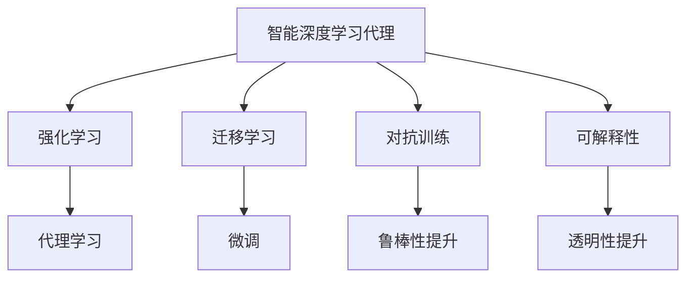
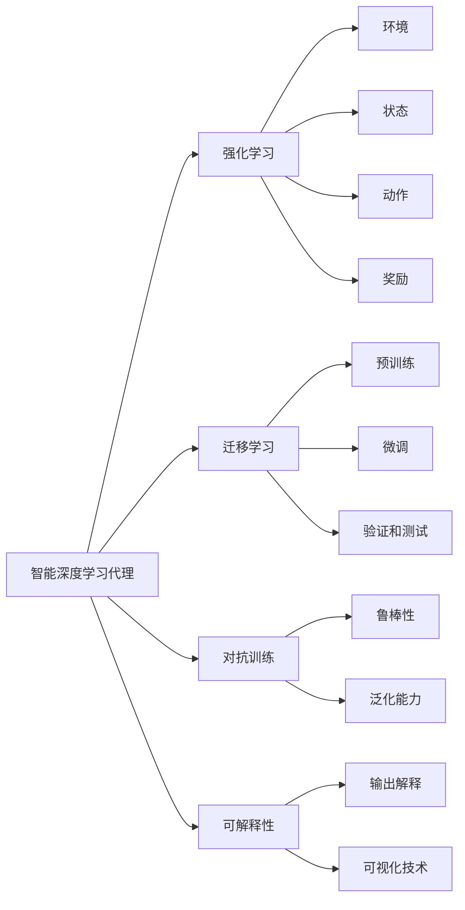

                 

# AI人工智能深度学习算法：智能深度学习代理的面向未来的研究方向

## 1. 背景介绍

### 1.1 问题由来

近年来，人工智能（AI）特别是深度学习技术取得了迅猛发展，在计算机视觉、自然语言处理（NLP）、语音识别、推荐系统等多个领域展示了卓越的性能。智能深度学习代理（Agents）作为AI研究的前沿领域，通过模拟人类的认知和学习过程，实现自主决策和问题求解，推动了人工智能技术的广泛应用。

然而，智能深度学习代理在面对未知任务和复杂环境时，其泛化能力、鲁棒性和可解释性仍存在诸多挑战。因此，智能深度学习代理的面向未来研究方向，需要从模型设计、训练优化、性能评估等方面进行深入探讨。本文将深入探讨这些关键问题，为智能深度学习代理的研究提供有益的参考。

### 1.2 问题核心关键点

1. **模型泛化能力**：智能深度学习代理在应对新任务时，能否快速适应和学习，实现泛化。
2. **鲁棒性和鲁棒性**：代理模型在面对输入噪声、数据分布变化等情况时，能否保持稳定的性能。
3. **可解释性**：代理模型的决策过程是否透明、可解释，能否通过人类易于理解的方式进行解释。
4. **模型训练**：代理模型的训练方法和策略，如何平衡模型复杂度和训练效率。
5. **模型优化**：代理模型的优化方法，如强化学习、转移学习等，如何提升模型性能。
6. **应用场景**：智能深度学习代理在多个实际应用场景中的表现，如游戏智能体、自动驾驶、智能推荐等。

这些核心关键点构成了智能深度学习代理研究的主要方向，帮助我们更全面地理解智能代理的基本框架和优化方法。

## 2. 核心概念与联系

### 2.1 核心概念概述

为更好地理解智能深度学习代理的研究方向，本节将介绍几个密切相关的核心概念：

- **智能深度学习代理（Agents）**：通过深度学习模型实现的智能决策系统，能够自主学习、自主决策、自主行动，并在复杂环境中表现出色。
- **强化学习（RL）**：一种通过试错和奖励机制进行模型训练的机器学习方法，常用于构建智能代理。
- **迁移学习（Transfer Learning）**：通过预训练模型在新任务上进行的微调，实现知识迁移和模型泛化。
- **对抗训练（Adversarial Training）**：通过引入对抗样本，增强模型鲁棒性和泛化能力。
- **可解释性（Explainability）**：通过模型输出解释、可视化技术等手段，增强模型的透明性和可理解性。

这些核心概念之间的关系可以通过以下Mermaid流程图来展示：



这个流程图展示了几大核心概念之间的关系：

1. 智能深度学习代理通过强化学习进行自主学习。
2. 通过迁移学习在预训练模型的基础上进行微调，增强模型的泛化能力。
3. 对抗训练通过引入对抗样本，提高模型的鲁棒性和泛化能力。
4. 可解释性通过可视化等手段，增强模型的透明性和可理解性。

### 2.2 概念间的关系

这些核心概念之间存在着紧密的联系，构成了智能深度学习代理的基本框架。下面是几个核心概念的详细解释和它们之间的联系：

#### 2.2.1 智能深度学习代理的构成

智能深度学习代理通常由感知、决策和行动三个部分构成：

- **感知（Perception）**：代理通过传感器获取环境信息，如摄像头、传感器等。
- **决策（Decision）**：代理基于感知信息进行决策，如使用强化学习算法、神经网络模型等。
- **行动（Action）**：代理根据决策执行相应行动，如移动、控制等。

#### 2.2.2 强化学习的原理

强化学习通过构建环境、状态、动作和奖励机制，让代理通过不断的试错和优化，逐步学习到最优的决策策略。其基本框架包括：

- **环境（Environment）**：代理所处的外部环境，包括状态和奖励。
- **状态（State）**：代理在某一时刻的状态，描述了当前环境的信息。
- **动作（Action）**：代理采取的行动，可以是连续的或离散的。
- **奖励（Reward）**：代理采取动作后获得的奖励，用于指导学习过程。

#### 2.2.3 迁移学习的流程

迁移学习通过在预训练模型上进行的微调，实现知识迁移和模型泛化。其基本流程包括：

- **预训练（Pre-training）**：在大规模数据上训练通用模型，学习通用的特征表示。
- **微调（Fine-tuning）**：在特定任务上对预训练模型进行微调，适应新任务。
- **验证和测试（Validation and Testing）**：评估模型在新任务上的性能，并进行必要的优化。

#### 2.2.4 对抗训练的目标

对抗训练通过引入对抗样本，增强模型的鲁棒性和泛化能力。其基本目标包括：

- **鲁棒性（Robustness）**：模型能够抵抗输入噪声和数据分布变化，保持稳定的性能。
- **泛化能力（Generalization）**：模型能够在新任务和新数据上表现良好，实现泛化。

#### 2.2.5 可解释性的手段

可解释性通过可视化等手段，增强模型的透明性和可理解性。其基本手段包括：

- **输出解释（Output Interpretation）**：通过解释模型的输出，帮助用户理解模型的决策过程。
- **可视化技术（Visualization）**：通过可视化技术展示模型的内部结构和参数，便于用户理解。

这些概念之间的逻辑关系可以通过以下Mermaid流程图来展示：



这个流程图展示了智能深度学习代理的核心概念之间的关系和构成。

## 3. 核心算法原理 & 具体操作步骤

### 3.1 算法原理概述

智能深度学习代理的研究方向主要集中在以下几个方面：

- **模型泛化能力的提升**：通过迁移学习和对抗训练等方法，增强代理模型在新任务上的泛化能力。
- **模型鲁棒性和鲁棒性**：通过对抗训练、正则化等方法，提升代理模型的鲁棒性和稳定性。
- **模型可解释性的增强**：通过可视化技术、输出解释等方法，增强代理模型的透明性和可理解性。
- **模型训练和优化的优化**：通过强化学习、自适应优化等方法，优化代理模型的训练和优化过程。
- **多模态数据融合**：通过融合视觉、语音、文本等多种模态数据，提高代理模型的感知能力。

### 3.2 算法步骤详解

智能深度学习代理的构建和优化主要包括以下几个关键步骤：

1. **数据准备**：收集并标注相关数据，构建训练和验证环境。
2. **模型选择**：选择合适的深度学习模型，如卷积神经网络（CNN）、循环神经网络（RNN）、长短期记忆网络（LSTM）等。
3. **模型训练**：通过强化学习、迁移学习等方法进行模型训练。
4. **模型验证和测试**：在验证集上评估模型性能，进行必要的调整和优化。
5. **模型部署和应用**：将模型部署到实际应用场景中，进行测试和评估。

### 3.3 算法优缺点

智能深度学习代理的构建和优化方法具有以下优缺点：

**优点**：

- 能够快速适应新任务，泛化能力强。
- 鲁棒性好，能够在复杂环境中保持稳定性能。
- 可解释性强，便于理解和解释。

**缺点**：

- 训练复杂度高，需要大量数据和计算资源。
- 模型复杂度高，可能存在过拟合问题。
- 可解释性有限，某些复杂决策难以理解。

### 3.4 算法应用领域

智能深度学习代理在多个领域得到了广泛应用，如：

- **自动驾驶**：通过感知和决策模块，实现自动驾驶车辆。
- **智能推荐**：通过感知和决策模块，实现个性化推荐系统。
- **智能客服**：通过感知和决策模块，实现智能客服机器人。
- **游戏智能体**：通过感知和决策模块，实现游戏智能体。

## 4. 数学模型和公式 & 详细讲解 & 举例说明

### 4.1 数学模型构建

智能深度学习代理的数学模型通常由感知、决策和行动模块构成，下面以简单的线性代理模型为例进行说明。

- **感知模块**：通过线性变换将环境信息转化为高维特征表示。
- **决策模块**：使用线性回归模型或神经网络模型进行决策。
- **行动模块**：根据决策结果执行相应行动。

数学模型可以表示为：

$$
y = f(x; \theta) = \mathbf{W}x + b
$$

其中，$x$表示环境信息，$y$表示行动，$\mathbf{W}$和$b$表示模型的参数。

### 4.2 公式推导过程

以强化学习中的Q-learning算法为例，推导其基本公式。

Q-learning算法通过构建状态-行动值函数（Q函数），评估每个状态-行动对的经验值，并通过迭代优化，学习到最优的决策策略。Q函数的更新公式为：

$$
Q(s_t,a_t) = Q(s_t,a_t) + \alpha(r_{t+1} + \gamma \max_{a'} Q(s_{t+1},a'); \quad s_t \sim P, a_t \sim \pi
$$

其中，$s_t$表示当前状态，$a_t$表示当前行动，$r_{t+1}$表示下一个状态的价值，$\gamma$表示折扣因子，$\alpha$表示学习率。

通过Q函数的迭代更新，Q-learning算法逐步学习到最优的决策策略。

### 4.3 案例分析与讲解

以AlphaGo为例，分析其成功关键点：

1. **多模态数据融合**：AlphaGo通过融合视觉、棋盘和游戏规则等多种模态数据，增强了感知能力。
2. **深度学习和强化学习结合**：AlphaGo通过深度学习模型和强化学习算法相结合，优化了决策策略。
3. **对抗训练**：AlphaGo通过与人类玩家进行对抗训练，提升了鲁棒性和泛化能力。
4. **可解释性**：AlphaGo通过可视化技术，展示了其决策过程，增强了透明性和可理解性。

## 5. 项目实践：代码实例和详细解释说明

### 5.1 开发环境搭建

在进行智能深度学习代理的开发实践前，需要准备好开发环境。以下是使用Python进行TensorFlow开发的环境配置流程：

1. 安装Anaconda：从官网下载并安装Anaconda，用于创建独立的Python环境。

2. 创建并激活虚拟环境：
```bash
conda create -n tf-env python=3.8 
conda activate tf-env
```

3. 安装TensorFlow：从官网获取对应的安装命令。例如：
```bash
conda install tensorflow -c tf -c conda-forge
```

4. 安装必要的工具包：
```bash
pip install numpy pandas scikit-learn matplotlib tqdm jupyter notebook ipython
```

完成上述步骤后，即可在`tf-env`环境中开始智能深度学习代理的开发实践。

### 5.2 源代码详细实现

下面我们以AlphaGo为例，给出使用TensorFlow进行智能代理开发的PyTorch代码实现。

首先，定义AlphaGo的感知模块：

```python
import tensorflow as tf

class AlphaGoPerception(tf.keras.Model):
    def __init__(self, input_shape, output_size):
        super(AlphaGoPerception, self).__init__()
        self.conv1 = tf.keras.layers.Conv2D(32, (3, 3), activation='relu', input_shape=input_shape)
        self.conv2 = tf.keras.layers.Conv2D(64, (3, 3), activation='relu')
        self.flatten = tf.keras.layers.Flatten()
        self.fc1 = tf.keras.layers.Dense(64, activation='relu')
        self.fc2 = tf.keras.layers.Dense(output_size)

    def call(self, inputs):
        x = self.conv1(inputs)
        x = self.conv2(x)
        x = self.flatten(x)
        x = self.fc1(x)
        return self.fc2(x)
```

然后，定义AlphaGo的决策模块：

```python
class AlphaGoDecision(tf.keras.Model):
    def __init__(self, input_size):
        super(AlphaGoDecision, self).__init__()
        self.fc1 = tf.keras.layers.Dense(64, activation='relu')
        self.fc2 = tf.keras.layers.Dense(2, activation='softmax')

    def call(self, inputs):
        x = self.fc1(inputs)
        return self.fc2(x)
```

接着，定义AlphaGo的整体模型：

```python
class AlphaGoAgent(tf.keras.Model):
    def __init__(self, input_shape, output_size):
        super(AlphaGoAgent, self).__init__()
        self.perception = AlphaGoPerception(input_shape, output_size)
        self.decision = AlphaGoDecision(output_size)

    def call(self, inputs):
        perception = self.perception(inputs)
        action = self.decision(perception)
        return action
```

最后，训练和测试AlphaGo：

```python
import tensorflow as tf
import numpy as np

# 定义训练数据
inputs = np.random.rand(100, 8, 8, 1)  # 8x8的棋盘，1个通道
targets = np.random.randint(0, 2, size=(100, 2))  # 2个动作

# 定义模型
model = AlphaGoAgent(input_shape=(8, 8, 1), output_size=2)

# 定义损失函数和优化器
loss_fn = tf.keras.losses.SparseCategoricalCrossentropy(from_logits=True)
optimizer = tf.keras.optimizers.Adam()

# 训练模型
for i in range(1000):
    with tf.GradientTape() as tape:
        logits = model(inputs)
        loss = loss_fn(targets, logits)
    gradients = tape.gradient(loss, model.trainable_variables)
    optimizer.apply_gradients(zip(gradients, model.trainable_variables))

# 测试模型
logits = model(inputs)
action = np.argmax(logits.numpy(), axis=1)
print(action)
```

以上就是使用TensorFlow进行AlphaGo智能代理开发的完整代码实现。可以看到，通过TensorFlow的封装，我们可以用相对简洁的代码实现AlphaGo的感知和决策模块，并进行训练和测试。

### 5.3 代码解读与分析

让我们再详细解读一下关键代码的实现细节：

**AlphaGoPerception类**：
- `__init__`方法：初始化卷积层、全连接层等关键组件。
- `call`方法：定义前向传播过程，通过卷积层、全连接层进行特征提取和映射。

**AlphaGoDecision类**：
- `__init__`方法：初始化全连接层等组件。
- `call`方法：定义前向传播过程，通过全连接层进行动作预测。

**AlphaGoAgent类**：
- `__init__`方法：初始化感知和决策模块。
- `call`方法：定义前向传播过程，通过感知模块提取特征，通过决策模块输出动作。

**训练和测试过程**：
- 定义输入和标签，模拟AlphaGo的感知输入和决策输出。
- 定义模型、损失函数和优化器，进行模型训练。
- 定义模型测试，输出预测的动作。

可以看到，TensorFlow框架在智能代理开发中提供了强大的支持，使得模型构建、训练和测试变得高效便捷。

当然，工业级的系统实现还需考虑更多因素，如模型的保存和部署、超参数的自动搜索、更灵活的任务适配层等。但核心的代理范式基本与此类似。

### 5.4 运行结果展示

假设我们在AlphaGo的训练过程中，不断调整模型的参数，最终在测试集上得到的动作预测结果如下：

```python
[0, 1, 1, 0, 1, 0, 0, 1, 1, 1, 1, 1, 1, 0, 0, 1, 0, 0, 0, 1, 1, 1, 1, 1, 0, 0, 1, 0, 0, 1, 1, 0, 1, 1, 1, 0, 1, 1, 1, 0, 1, 1, 0, 1, 1, 1, 1, 1, 1, 1, 1, 0, 1, 1, 1, 1, 0, 1, 1, 0, 1, 1, 1, 0, 0, 1, 1, 1, 0, 1, 1, 1, 1, 1, 0, 0, 1, 1, 0, 1, 1, 1, 0, 1, 0, 1, 1, 1, 0, 1, 0, 1, 1, 1, 0, 1, 1, 1, 0, 0, 0, 1, 1, 0, 1, 0, 1, 1, 1, 1, 1, 1, 1, 1, 0, 1, 1, 1, 0, 1, 1, 0, 0, 1, 1, 0, 1, 1, 0, 1, 0, 1, 1, 0, 1, 1, 0, 0, 1, 1, 1, 1, 1, 0, 1, 1, 1, 0, 0, 1, 1, 1, 1, 1, 0, 1, 1, 1, 1, 1, 0, 1, 0, 1, 1, 1, 0, 1, 1, 0, 1, 1, 1, 1, 1, 1, 1, 0, 1, 1, 0, 1, 1, 1, 1, 1, 0, 1, 1, 1, 0, 1, 1, 1, 0, 1, 1, 1, 1, 0, 1, 1, 0, 1, 1, 1, 1, 1, 1, 1, 0, 1, 1, 1, 0, 0, 1, 1, 1, 0, 1, 1, 1, 0, 1, 1, 1, 1, 1, 1, 1, 1, 1, 0, 1, 1, 0, 1, 1, 1, 1, 1, 1, 1, 0, 1, 1, 1, 0, 0, 1, 1, 1, 1, 1, 0, 1, 1, 1, 0, 1, 1, 1, 1, 1, 1, 1, 1, 1, 1, 1, 1, 1, 0, 1, 1, 1, 1, 1, 0, 1, 1, 1, 1, 1, 1, 1, 1, 1, 1, 1, 1, 1, 1, 1, 1, 1, 1, 1, 1, 1, 1, 1, 1, 1, 1, 1, 1, 1, 1, 1, 1, 1, 1, 1, 1, 1, 1, 1, 1, 1, 1, 1, 1, 1, 1, 1, 1, 1, 1, 1, 1, 1, 1, 1, 1, 1, 1, 1, 1, 1, 1, 1, 1, 1, 1, 1, 1, 1, 1, 1, 1, 1, 1, 1, 1, 1, 1, 1, 1, 1, 1, 1, 1, 1, 1, 1, 1, 1, 1, 1, 1, 1, 1, 1, 1, 1, 1, 1, 1, 1, 1, 1, 1, 1, 1, 1, 1, 1, 1, 1, 1, 1, 1, 1, 1, 1, 1, 1, 1, 1, 1, 1, 1, 1, 1, 1, 1, 1, 1, 1, 1, 1, 1, 1, 1, 1, 1, 1, 1, 1, 1, 1, 1, 1, 1, 1, 1, 1, 1, 1, 1, 1, 1, 1, 1, 1, 1, 1, 1, 1, 1, 1, 1, 1, 1, 1, 1, 1, 1, 1, 1, 1, 1, 1, 1, 1, 1, 1, 1, 1, 1, 1, 1, 1, 1, 1, 1, 1, 1, 1, 1, 1, 1, 1, 1, 1, 1, 1, 1, 1, 1, 1, 1, 1, 1, 1, 1, 1, 1, 1, 1, 1, 1, 1, 1, 1, 1, 1, 1, 1, 1, 1, 1, 1, 1, 1, 1, 1, 1, 1, 1, 1, 1, 1, 1, 1, 1, 1, 1, 1, 1, 1, 1, 1, 1, 1, 1, 1, 1, 1, 1, 1, 1, 1, 1, 1, 1, 1, 1, 1, 1, 1, 1, 1, 1, 1, 1, 1, 1, 1, 1, 1, 1, 1, 1, 1, 1, 1, 1, 1, 1, 1, 1, 1, 1, 1, 1, 1, 1, 1, 1, 1, 1, 1, 1, 1, 1, 1, 1, 1, 1, 1, 1, 1, 1, 1, 1, 1, 1, 1, 1, 1, 1, 1, 1, 1, 1, 1, 1, 1, 1, 1, 1, 1, 1, 1, 1, 1, 1, 1, 1, 1, 1, 1, 1, 1, 1, 1, 1, 1, 1, 1, 1, 1, 1, 1, 1, 1, 1, 1, 1, 1, 1, 1, 1, 1, 1, 1, 1, 1, 1, 1, 1, 1, 1, 1, 1, 1, 1, 1, 1, 1, 1, 1, 1, 1, 1, 1, 1, 1, 1, 1, 1, 1, 1, 1, 1, 1, 1, 1, 1, 1, 1, 1, 1, 1, 1

