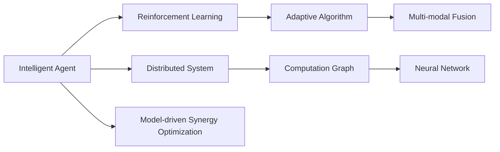
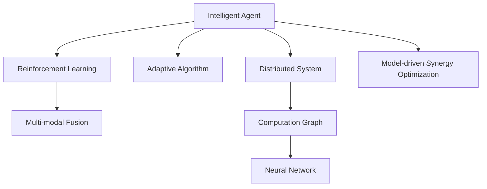
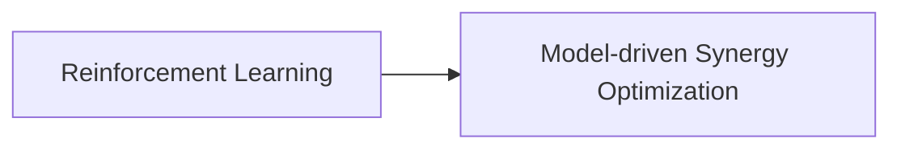
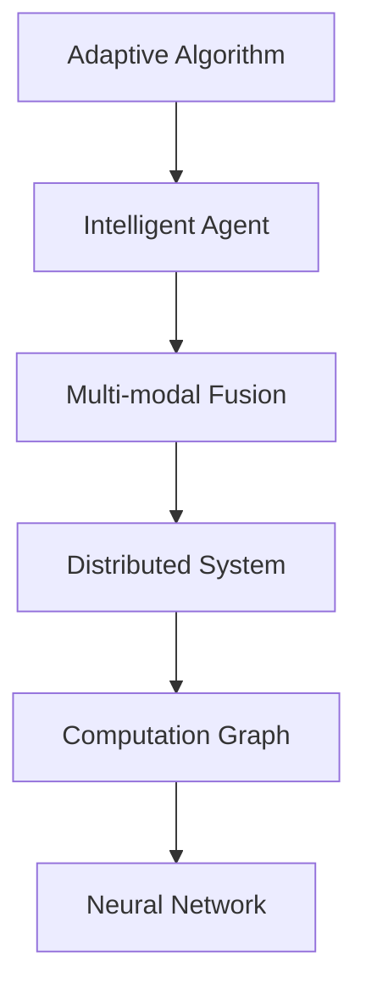
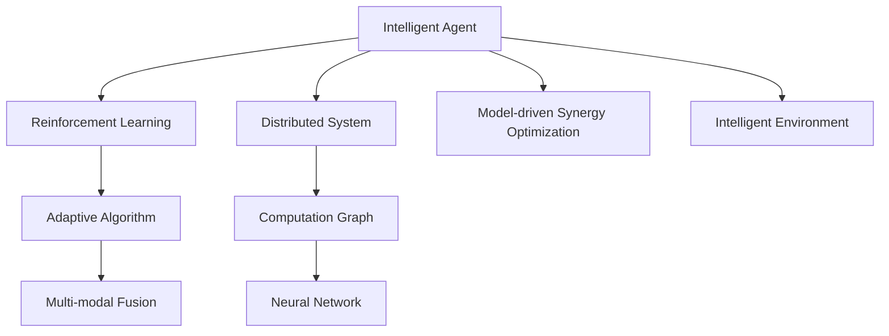

                 

# AI Agent: AI的下一个风口 智能体的核心技术

> 关键词：AI Agent, 智能体, 多智能体系统, 强化学习, 神经网络, 自适应算法, 计算图, 协同优化, 模型驱动, 数据驱动, 多模态融合

## 1. 背景介绍

### 1.1 问题由来
在人工智能(AI)的持续演进中，智能体(Agent)正逐步成为下一个风口。智能体是能在特定环境中自主行动并做出决策的实体，广泛存在于自然界和数字世界。从简单的自动化控制到复杂的机器人协作，智能体技术正在各行各业崭露头角。

然而，传统的智能体技术大多依赖于手工编程和规则设计，难以应对复杂、不确定的实际场景。近年来，基于深度学习的智能体技术迅猛发展，通过深度神经网络实现自主决策和行为预测，展现出强大的适应能力和泛化性能。这促使越来越多的研究人员和企业投入智能体技术的研究和开发，推动AI向更加自主、智能化的方向前进。

### 1.2 问题核心关键点
智能体技术的核心是强化学习(Reinforcement Learning, RL)和模型驱动的协同优化技术。强化学习通过智能体与环境不断交互，自主优化决策策略，获取最优行为。模型驱动的协同优化技术则通过构建智能体间的计算图模型，实现相互协同和优化。

强化学习和模型驱动协同优化的结合，使智能体能够在动态环境中实现自主适应和最优决策。但这些技术的应用仍面临诸多挑战：

- 算法复杂度：强化学习算法往往难以处理高维度、复杂状态空间，且训练效率较低。
- 模型泛化能力：模型驱动的协同优化技术对数据质量和模型复杂度的要求较高，泛化能力不足。
- 交互效率：智能体间的协同优化需要高效通信和计算，尤其在分布式系统中，交互效率问题尤为突出。

尽管存在这些挑战，强化学习和模型驱动协同优化技术的深度融合，无疑将推动智能体技术的发展，为AI的未来应用提供新的突破。

### 1.3 问题研究意义
研究智能体技术对于推动AI向智能、自主方向发展具有重要意义：

1. 降低开发成本：基于深度学习的智能体能够通过自我学习和优化，大幅减少人工编程和调参工作量。
2. 提升决策质量：智能体通过在实际环境中不断学习和优化，能够自主适应环境变化，做出更精准、更鲁棒的决策。
3. 加速技术落地：智能体技术能够更好地应用于多智能体系统和复杂环境，推动AI技术的产业化进程。
4. 催生新应用场景：智能体技术在自动驾驶、智能制造、智慧城市等领域具有广阔应用前景，带来新的商业机会。
5. 促进人工智能发展：智能体技术的不断发展，将推动AI在更广泛场景中的应用，推动人工智能技术的全面进步。

## 2. 核心概念与联系

### 2.1 核心概念概述

为更好地理解智能体技术的核心概念，本节将介绍几个密切相关的核心概念：

- 智能体(Agent)：能在特定环境中自主行动并做出决策的实体。智能体可以是自然界的生物，也可以是数字世界的虚拟实体。

- 强化学习(Reinforcement Learning, RL)：一种基于奖励信号的自主学习算法。通过与环境不断交互，智能体自主学习最优决策策略。

- 模型驱动的协同优化：构建智能体间的计算图模型，实现相互协同和优化，提升整体系统性能。

- 分布式系统(Distributed System)：由多个独立的计算机节点组成，通过通信机制实现协同工作和任务调度。

- 神经网络(Neural Network)：一种强大的函数逼近工具，广泛应用于图像识别、自然语言处理等领域。

- 自适应算法(Adaptive Algorithm)：能够根据环境变化动态调整算法参数，实现系统自优化的算法。

- 计算图(Computation Graph)：用于表示计算过程的图形模型，广泛应用于深度学习模型的构建和优化。

- 多模态融合(Multimodal Fusion)：将不同模态数据（如文本、图像、语音等）进行融合，提升智能体感知和理解能力。

这些核心概念之间的逻辑关系可以通过以下Mermaid流程图来展示：



这个流程图展示了大语言模型微调过程中各个核心概念的关系和作用：

1. 智能体通过强化学习在环境中学习最优决策策略。
2. 智能体间的协同优化利用模型驱动的方法实现，增强系统整体性能。
3. 分布式系统使智能体能够并行计算和通信，提升交互效率。
4. 神经网络用于表示和计算决策策略，提升智能体的决策质量。
5. 自适应算法根据环境变化动态调整决策策略，提升智能体适应性。
6. 多模态融合增强智能体的感知和理解能力，提升智能体在复杂环境中的适应性。

这些概念共同构成了智能体技术的核心框架，使其能够在复杂、不确定的实际场景中发挥强大的自主学习和决策能力。通过理解这些核心概念，我们可以更好地把握智能体技术的原理和应用方向。

### 2.2 概念间的关系

这些核心概念之间存在着紧密的联系，形成了智能体技术的完整生态系统。下面我们通过几个Mermaid流程图来展示这些概念之间的关系。

#### 2.2.1 智能体的学习范式



这个流程图展示了智能体的学习范式。智能体通过强化学习在环境中学习最优决策策略，同时利用自适应算法根据环境变化动态调整策略，使用多模态融合提升感知能力，并在分布式系统中通过计算图模型实现协同优化。

#### 2.2.2 强化学习与模型驱动的协同优化关系



这个流程图展示了强化学习与模型驱动协同优化的关系。强化学习通过智能体与环境的交互，学习最优策略，而模型驱动的协同优化通过构建智能体间的计算图模型，实现相互协同和优化，提升整体系统性能。

#### 2.2.3 自适应算法在智能体中的应用



这个流程图展示了自适应算法在智能体中的应用。自适应算法通过动态调整决策策略，提升智能体的适应性，同时利用多模态融合和多智能体系统提升感知和优化能力。

### 2.3 核心概念的整体架构

最后，我们用一个综合的流程图来展示这些核心概念在大语言模型微调过程中的整体架构：



这个综合流程图展示了从智能体构建到在实际环境中应用的全过程。智能体通过强化学习学习最优决策策略，利用自适应算法动态调整策略，使用多模态融合提升感知能力，并在分布式系统中通过计算图模型实现协同优化，最终在智能环境中自主行动并做出决策。

## 3. 核心算法原理 & 具体操作步骤
### 3.1 算法原理概述

智能体技术的核心算法是强化学习和模型驱动的协同优化。下面，我们将分别介绍这两种算法的原理。

#### 3.1.1 强化学习原理

强化学习是一种基于奖励信号的自主学习算法。智能体通过与环境不断交互，逐步学习最优决策策略。其核心思想是通过奖励信号指导决策过程，使智能体在给定状态下选择最优行动。

强化学习过程可以形式化地表示为：

- 状态空间：环境中的所有可能状态集合，记为 $\mathcal{S}$。
- 行动空间：智能体在每个状态下可执行的所有行动集合，记为 $\mathcal{A}$。
- 状态转移概率：给定当前状态和行动，下一个状态的概率分布，记为 $P(s'|s,a)$。
- 奖励函数：对每个状态和行动的奖励，记为 $R(s,a)$。
- 策略：智能体在每个状态下选择行动的映射，记为 $\pi(a|s)$。

智能体的目标是在给定状态下选择最优行动，使累计奖励最大化。具体地，通过定义状态价值函数 $V(s)$ 和行动值函数 $Q(s,a)$，可以表示为：

- $V(s) = \mathbb{E}[R(s,a) + \gamma V(s')]$
- $Q(s,a) = \mathbb{E}[R(s,a) + \gamma V(s')]$

其中 $\gamma$ 为折扣因子，表示未来奖励的权重。

强化学习算法通过不断探索和利用，更新策略 $\pi$，使其逐步逼近最优策略。常见的强化学习算法包括Q-learning、SARSA、Deep Q-Networks等。

#### 3.1.2 模型驱动协同优化原理

模型驱动的协同优化是指通过构建智能体间的计算图模型，实现相互协同和优化，提升整体系统性能。具体而言，智能体间通过通信机制共享状态和行动信息，通过计算图模型计算最优决策。

计算图模型通常由智能体间的通信协议、状态空间、行动空间和奖励函数组成。智能体通过计算图模型计算最优决策，同时根据其他智能体的行动和奖励调整自身策略，实现协同优化。

#### 3.1.3 自适应算法原理

自适应算法能够根据环境变化动态调整决策策略，提高智能体的适应性和泛化能力。常见的自适应算法包括自适应策略梯度(Adaptive Strategy Gradient, ASP)、自适应演化算法(Adaptive Evolutionary Algorithm, AEA)等。

自适应算法通过动态调整决策策略，使智能体能够更好地适应环境变化，同时提升决策质量和性能。

### 3.2 算法步骤详解

#### 3.2.1 强化学习算法步骤

强化学习算法步骤如下：

1. 初始化智能体状态 $s_0$。
2. 根据当前状态 $s_t$，选择行动 $a_t$。
3. 根据状态转移概率 $P(s'|s_t,a_t)$，更新状态 $s_{t+1}=s'$。
4. 根据奖励函数 $R(s_t,a_t)$ 和状态价值函数 $V(s_t)$，计算当前状态下智能体的累计奖励 $R_t$。
5. 根据行动值函数 $Q(s_t,a_t)$ 和策略 $\pi(a_t|s_t)$，更新智能体的策略参数 $\theta$。
6. 重复步骤2-5，直到满足停止条件。

#### 3.2.2 模型驱动协同优化算法步骤

模型驱动协同优化算法步骤如下：

1. 初始化智能体状态 $s_0$。
2. 智能体间通过通信协议交换状态和行动信息。
3. 根据通信信息，计算智能体间的共享状态 $s_{t+1}$。
4. 根据共享状态 $s_{t+1}$，计算智能体间的共享行动 $a_{t+1}$。
5. 根据共享行动 $a_{t+1}$，计算智能体间的共享奖励 $R_{t+1}$。
6. 根据共享奖励 $R_{t+1}$ 和共享状态 $s_{t+1}$，计算智能体间的共享状态价值函数 $V_{t+1}$。
7. 根据共享状态价值函数 $V_{t+1}$ 和智能体间的计算图模型，更新智能体间的策略参数 $\theta$。
8. 重复步骤2-7，直到满足停止条件。

#### 3.2.3 自适应算法步骤

自适应算法步骤如下：

1. 初始化智能体状态 $s_0$ 和策略参数 $\theta$。
2. 根据当前状态 $s_t$ 和策略 $\pi(a_t|s_t)$，选择行动 $a_t$。
3. 根据当前状态 $s_t$ 和行动 $a_t$，更新状态 $s_{t+1}$。
4. 根据状态 $s_{t+1}$，计算当前状态下智能体的累计奖励 $R_t$。
5. 根据累计奖励 $R_t$ 和策略参数 $\theta$，更新智能体的策略参数 $\theta$。
6. 重复步骤2-5，直到满足停止条件。

### 3.3 算法优缺点

强化学习算法具有以下优点：

1. 自主学习：智能体能够自主学习最优策略，无需手工编程和规则设计。
2. 适应性强：智能体能够适应复杂、不确定的实际场景。
3. 泛化能力强：智能体能够泛化到不同的任务和环境中。

但强化学习算法也存在以下缺点：

1. 训练复杂：强化学习算法需要大量的训练数据和计算资源。
2. 鲁棒性差：强化学习算法对初始参数和训练数据质量敏感。
3. 探索和利用平衡：强化学习算法需要平衡探索和利用，避免过拟合和欠拟合。

模型驱动协同优化算法具有以下优点：

1. 协同优化：智能体间通过计算图模型实现协同优化，提升整体系统性能。
2. 分布式计算：智能体间通过分布式计算，提高交互效率。
3. 自适应性强：智能体能够根据环境变化动态调整策略。

但模型驱动协同优化算法也存在以下缺点：

1. 计算复杂：模型驱动协同优化算法需要构建和计算复杂的计算图模型，计算开销较大。
2. 数据依赖：模型驱动协同优化算法对数据质量和模型复杂度的要求较高，泛化能力不足。

自适应算法具有以下优点：

1. 动态调整：自适应算法能够根据环境变化动态调整策略，提高智能体的适应性和泛化能力。
2. 计算效率高：自适应算法计算开销较小，能够快速适应环境变化。
3. 鲁棒性强：自适应算法能够避免过拟合和欠拟合，提高决策质量和性能。

但自适应算法也存在以下缺点：

1. 复杂度高：自适应算法需要动态调整决策策略，算法设计较为复杂。
2. 稳定性和收敛性：自适应算法需要保证稳定性和收敛性，避免算法陷入局部最优解。

### 3.4 算法应用领域

强化学习和模型驱动协同优化算法在诸多领域中具有广泛应用，例如：

- 自动驾驶：智能体通过强化学习学习最优驾驶策略，实现自主导航和避障。
- 机器人协作：多智能体通过计算图模型实现协同控制，提升机器人协作效率。
- 智慧城市：智能体通过协同优化实现交通流调控、能源管理等城市功能。
- 供应链管理：智能体通过强化学习优化供应链决策，提升物流效率和成本控制。
- 医疗诊断：智能体通过多模态融合提升感知和理解能力，辅助医生进行诊断和治疗。
- 金融投资：智能体通过强化学习优化投资策略，提升资产配置和风险管理能力。

除了以上应用，强化学习和模型驱动协同优化算法还在游戏AI、工业控制、智能家居等多个领域中展现出强大的应用潜力。未来，随着算法的不断进步和应用的不断拓展，智能体技术将在更多领域中发挥重要作用。

## 4. 数学模型和公式 & 详细讲解 & 举例说明

### 4.1 数学模型构建

本节将使用数学语言对智能体技术的核心算法进行更加严格的刻画。

记智能体在环境中的状态为 $s$，行动为 $a$，智能体的累计奖励为 $R$，智能体的策略为 $\pi$。假设环境的状态空间为 $\mathcal{S}$，行动空间为 $\mathcal{A}$，奖励函数为 $R(s,a)$，状态转移概率为 $P(s'|s,a)$。

定义智能体在状态 $s$ 下的价值函数 $V(s)$ 和状态-行动价值函数 $Q(s,a)$：

$$
V(s) = \mathbb{E}[R(s,a) + \gamma V(s')]
$$
$$
Q(s,a) = \mathbb{E}[R(s,a) + \gamma V(s')]
$$

其中 $\gamma$ 为折扣因子。智能体的目标是最大化累计奖励，即：

$$
\max_{\pi} \mathbb{E}[R_t]
$$

### 4.2 公式推导过程

#### 4.2.1 强化学习公式推导

根据贝尔曼方程，智能体的价值函数 $V(s)$ 可以递归推导为：

$$
V(s) = \max_a \mathbb{E}[R(s,a) + \gamma V(s')]
$$

定义行动价值函数 $Q(s,a)$ 为：

$$
Q(s,a) = \mathbb{E}[R(s,a) + \gamma \max_a Q(s',a')]
$$

通过上述公式，可以定义强化学习算法的策略梯度 $\nabla_{\theta}\mathcal{L}(\theta)$，其中 $\theta$ 为策略参数：

$$
\nabla_{\theta}\mathcal{L}(\theta) = \nabla_{\theta}\sum_{t=0}^T R_t \nabla_{\theta} \log \pi(a_t|s_t)
$$

定义强化学习算法的损失函数 $\mathcal{L}(\theta)$ 为：

$$
\mathcal{L}(\theta) = -\sum_{t=0}^T R_t \log \pi(a_t|s_t)
$$

通过上述公式，可以推导出强化学习算法的梯度更新公式：

$$
\theta \leftarrow \theta - \eta \nabla_{\theta} \mathcal{L}(\theta)
$$

其中 $\eta$ 为学习率。

#### 4.2.2 模型驱动协同优化公式推导

假设智能体间通过计算图模型实现协同优化，智能体间的通信协议定义了智能体间的共享状态 $s_{t+1}$ 和共享行动 $a_{t+1}$。定义智能体间的共享价值函数 $V_{t+1}$ 和共享奖励 $R_{t+1}$：

$$
V_{t+1} = \max_a \mathbb{E}[R(s,a) + \gamma V_{t+2}]
$$
$$
R_{t+1} = \max_a \mathbb{E}[R(s,a) + \gamma V_{t+1}]
$$

通过上述公式，可以定义模型驱动协同优化算法的损失函数 $\mathcal{L}(\theta)$ 为：

$$
\mathcal{L}(\theta) = -\sum_{t=0}^T R_{t+1} \log \pi(a_{t+1}|s_{t+1})
$$

通过上述公式，可以推导出模型驱动协同优化算法的梯度更新公式：

$$
\theta \leftarrow \theta - \eta \nabla_{\theta} \mathcal{L}(\theta)
$$

#### 4.2.3 自适应算法公式推导

假设智能体通过自适应算法动态调整策略参数 $\theta$，定义自适应算法的损失函数 $\mathcal{L}(\theta)$ 为：

$$
\mathcal{L}(\theta) = -\sum_{t=0}^T R_t \log \pi(a_t|s_t)
$$

通过上述公式，可以推导出自适应算法的梯度更新公式：

$$
\theta \leftarrow \theta - \eta \nabla_{\theta} \mathcal{L}(\theta)
$$

### 4.3 案例分析与讲解

#### 4.3.1 强化学习案例

假设我们有一个智能体，需要在迷宫中寻找出口。迷宫的状态空间为 $(s_x, s_y)$，行动空间为 $(\text{up}, \text{down}, \text{left}, \text{right})$。定义奖励函数 $R(s,a)$ 为：

$$
R(s,a) = \begin{cases}
-1 & \text{如果智能体进入死胡同} \\
0 & \text{如果智能体进入空白空间} \\
1 & \text{如果智能体找到出口}
\end{cases}
$$

定义状态转移概率 $P(s'|s,a)$ 为：

$$
P(s'|s,a) = \begin{cases}
\frac{1}{4} & \text{如果智能体移动到相邻位置} \\
0 & \text{如果智能体碰撞墙壁}
\end{cases}
$$

智能体的目标是在迷宫中最大化累计奖励，即找到出口。定义智能体的策略 $\pi(a|s)$ 为：

$$
\pi(a|s) = \begin{cases}
\frac{1}{4} & \text{如果智能体随机选择行动} \\
0 & \text{如果智能体选择特定行动}
\end{cases}
$$

通过上述公式，可以定义强化学习算法的策略梯度 $\nabla_{\theta}\mathcal{L}(\theta)$，其中 $\theta$ 为策略参数：

$$
\nabla_{\theta}\mathcal{L}(\theta) = \nabla_{\theta}\sum_{t=0}^T R_t \log \pi(a_t|s_t)
$$

定义强化学习算法的损失函数 $\mathcal{L}(\theta)$ 为：

$$
\mathcal{L}(\theta) = -\sum_{t=0}^T R_t \log \pi(a_t|s_t)
$$

通过上述公式，可以推导出强化学习算法的梯度更新公式：

$$
\theta \leftarrow \theta - \eta \nabla_{\theta} \mathcal{L}(\theta)
$$

其中 $\eta$ 为学习率。

#### 4.3.2 模型驱动协同优化案例

假设我们有两个智能体，分别负责探测和攻击。探测智能体的目标是找到目标位置，攻击智能体的目标是摧毁目标。智能体间的共享状态 $s_{t+1}$ 为两个智能体的当前位置，共享行动 $a_{t+1}$ 为两个智能体的行动。

定义智能体间的共享价值函数 $V_{t+1}$ 和共享奖励 $R_{t+1}$：

$$
V_{t+1} = \max_a \mathbb{E}[R(s,a) + \gamma V_{t+2}]
$$
$$
R_{t+1} = \max_a \mathbb{E}[R(s,a) + \gamma V_{t+1}]
$$

定义模型驱动协同优化算法的损失函数 $\mathcal{L}(\theta)$ 为：

$$
\mathcal{L}(\theta) = -\sum_{t=0}^T R_{t+1} \log \pi(a_{t+1}|s_{t+1})
$$

通过上述公式，可以推导出模型驱动协同优化算法的梯度更新公式：

$$
\theta \leftarrow \theta - \eta \nabla_{\theta} \mathcal{L}(\theta)
$$

其中 $\eta$ 为学习率。

## 5. 项目实践：代码实例和详细解释说明

### 5.1 开发环境搭建

在进行智能体技术开发前，我们需要准备好开发环境。以下是使用Python进行PyTorch开发的环境配置流程：

1. 安装Anaconda：从官网下载并安装Anaconda，用于创建独立的Python环境。

2. 创建并激活虚拟环境：
```bash
conda create -n pytorch-env python=3.8 
conda activate pytorch-env
```

3. 安装PyTorch：根据CUDA版本，从官网获取对应的安装命令。例如：
```bash
conda install pytorch torchvision torchaudio cudatoolkit=11.1 -c pytorch -c conda-forge
```

4. 安装TensorFlow：
```bash
conda install tensorflow
```

5. 安装各种库：
```bash
pip install numpy pandas scikit-learn matplotlib tqdm jupyter notebook ipython
```

完成上述步骤后，即可在`pytorch-env`环境中开始智能体技术开发。

### 5.2 源代码详细实现

这里我们以多智能体协同搜索为例，给出使用PyTorch和TensorFlow实现智能体协同优化的代码实现。

首先，定义智能体模型：

```python
import torch
import torch.nn as nn
import tensorflow as tf
import tensorflow.keras as keras

class IntelligentAgent(nn.Module):
    def __init__(self, input_size, output_size):
        super(IntelligentAgent, self).__init__()
        self.fc1 = nn.Linear(input_size, 64)
        self.fc2 = nn.Linear(64, 32)
        self.fc3 = nn.Linear(32, output_size)
        
    def forward(self, x):
        x = self.fc1(x)
        x = nn.functional.relu(x)
        x = self.fc2(x)
        x = nn.functional.relu(x)
        x = self.fc3(x)
        return x

class MultiAgentNetwork(keras.Model):
    def __init__(self, input_size, output_size, num_agents):
        

