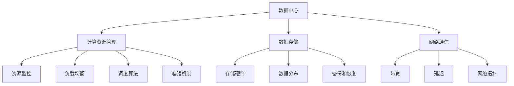
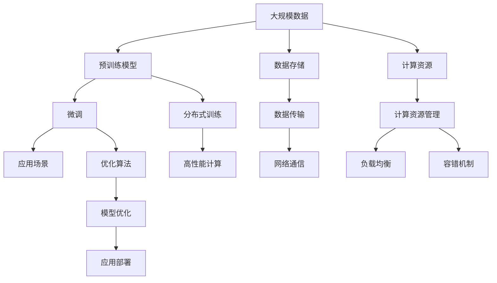

                 

# AI 大模型应用数据中心建设：数据中心技术创新

> 关键词：
- 人工智能
- 数据中心
- 大模型
- 数据存储
- 计算资源管理
- 技术创新
- 高性能计算
- 超大规模
- 节能环保

## 1. 背景介绍

### 1.1 问题由来
随着人工智能（AI）技术的快速发展，尤其是深度学习在图像识别、语音识别、自然语言处理等领域取得了突破性进展，AI大模型（如GPT-3、BERT等）的规模和应用范围不断扩大。这些模型通常需要海量的数据和强大的计算资源进行训练和推理，数据中心作为支撑AI应用的重要基础设施，其技术创新和优化变得至关重要。

数据中心在AI大模型的应用中扮演着数据存储、计算资源管理、网络通信等关键角色。然而，现有数据中心在面对AI大模型的计算需求时，面临诸多挑战，如计算资源不足、能耗高、数据传输瓶颈等。为了应对这些挑战，数据中心技术需要不断创新，以支持AI大模型的高效应用。

### 1.2 问题核心关键点
本节将重点探讨以下核心问题：
- 数据中心在AI大模型中的应用场景和技术需求。
- 现有数据中心技术在AI大模型应用中的瓶颈和不足。
- AI大模型数据中心技术创新的方向和策略。

通过分析这些问题，可以为AI大模型应用的数据中心建设提供全面的指导。

## 2. 核心概念与联系

### 2.1 核心概念概述
为了深入理解AI大模型应用数据中心的建设，本节将介绍几个核心概念及其相互之间的关系。

#### 2.1.1 数据中心（Data Center, DC）
数据中心是指通过网络向用户提供数据存储、处理和传输的物理设施。数据中心通常包括服务器、网络设备、存储设备、电力系统、冷却系统等。

#### 2.1.2 AI大模型（Large AI Model）
AI大模型是指参数量超过亿级的深度神经网络模型，用于处理大规模、复杂的数据和任务。这些模型通常需要强大的计算资源和优化的算法进行训练和推理。

#### 2.1.3 计算资源管理（Computational Resource Management）
计算资源管理是指对数据中心的计算资源进行分配、调度和优化，以提高资源利用率和系统性能。包括资源监控、负载均衡、调度算法、容错机制等。

#### 2.1.4 数据存储（Data Storage）
数据存储是指对数据进行长期保存和快速访问，通常包括存储硬件、数据分布、备份和恢复机制等。数据存储是AI大模型应用的基础设施。

#### 2.1.5 网络通信（Network Communication）
网络通信是指数据中心内部和外部网络之间的数据传输和通信，包括带宽、延迟、网络拓扑等。网络通信的性能直接影响AI大模型的训练和推理速度。

### 2.2 概念间的关系

以下是一个简化的Mermaid流程图，展示上述核心概念之间的关系：



这个流程图展示了数据中心中各个组件之间的关系。计算资源管理、数据存储和网络通信是数据中心的三个关键组成部分，它们之间相互依存，共同支撑AI大模型的应用。

### 2.3 核心概念的整体架构

为了更好地理解数据中心技术创新的方向和策略，以下是一个综合的Mermaid流程图，展示了从预训练模型到微调再到应用的全过程：



这个综合流程图展示了AI大模型应用的全过程，从数据存储、网络通信、计算资源管理到分布式训练、高性能计算和模型优化。数据中心技术创新的目标是通过优化这些关键环节，支持AI大模型的高效应用。

## 3. 核心算法原理 & 具体操作步骤
### 3.1 算法原理概述
AI大模型的应用需要大量的计算资源和优化的算法。数据中心的核心算法原理主要包括以下几个方面：

#### 3.1.1 分布式训练
AI大模型通常需要进行大规模分布式训练，以加速模型的收敛速度和提高模型的精度。分布式训练需要在多个计算节点之间高效地分配和调度计算任务，确保每个节点的负载均衡。

#### 3.1.2 高性能计算
AI大模型的训练和推理需要强大的计算资源支持。高性能计算技术包括GPU加速、FPGA加速、TPU加速等，以提高计算效率和资源利用率。

#### 3.1.3 模型优化
AI大模型在应用过程中，需要不断进行模型优化，以提升模型性能和降低计算资源消耗。模型优化包括参数剪枝、量化、稀疏化等技术。

#### 3.1.4 资源管理
数据中心的计算资源管理包括资源监控、负载均衡、调度算法和容错机制等，以提高资源利用率和系统性能。

### 3.2 算法步骤详解
以下是一个详细的AI大模型应用数据中心的算法步骤：

#### 3.2.1 数据存储
1. 选择高性能的存储硬件，如SSD、NVMe等，以提高数据读取和写入速度。
2. 采用分布式文件系统，如HDFS、Ceph等，将数据分散存储在多个节点上，以提高数据可用性和可扩展性。
3. 使用数据压缩和加密技术，减少数据存储和传输的带宽消耗，并提高数据安全性。

#### 3.2.2 计算资源管理
1. 使用容器化技术，如Docker、Kubernetes等，将AI大模型和应用封装为容器，以提高资源复用率和系统可靠性。
2. 采用负载均衡算法，如轮询、最少连接、IPHash等，将计算任务均衡地分配到不同的计算节点上。
3. 使用弹性计算资源管理技术，根据系统负载动态调整资源分配，以提高资源利用率。

#### 3.2.3 分布式训练
1. 使用分布式深度学习框架，如PyTorch、TensorFlow等，将训练任务并行化，以提高训练速度。
2. 采用异步通信技术，如Ring AllReduce、NCCL等，减少数据传输延迟，提高训练效率。
3. 使用模型并行技术，如模型分割、数据并行等，将大模型分解为多个小模型，并行训练，以提高训练效率和资源利用率。

#### 3.2.4 模型优化
1. 采用模型剪枝技术，去除不必要的参数和计算，减少模型复杂度和计算资源消耗。
2. 使用模型量化技术，将模型参数从浮点数转换为定点数，降低存储和计算开销。
3. 应用模型稀疏化技术，减少模型的参数密度，提高计算效率。

### 3.3 算法优缺点
#### 3.3.1 优点
1. 提升资源利用率：通过优化计算资源管理，提高资源复用率和利用率，减少资源浪费。
2. 加速模型训练：采用分布式训练和高性能计算技术，加速模型训练速度，缩短训练时间。
3. 提高模型精度：通过模型优化技术，减少模型复杂度和计算开销，提高模型精度和泛化能力。

#### 3.3.2 缺点
1. 技术复杂度：数据中心技术创新需要涉及多个领域的知识，包括计算资源管理、分布式计算、模型优化等，技术复杂度较高。
2. 成本高：高性能计算硬件和分布式系统部署成本较高，且需要持续的运维和优化。
3. 能耗高：AI大模型的计算需求大，数据中心能耗高，需要考虑节能环保问题。

### 3.4 算法应用领域
AI大模型在多个领域都有广泛应用，以下列举几个典型的应用领域：

#### 3.4.1 自然语言处理（NLP）
AI大模型在NLP领域有广泛应用，如文本分类、情感分析、机器翻译、问答系统等。数据中心技术为这些应用提供计算资源、存储和网络通信支持。

#### 3.4.2 计算机视觉（CV）
AI大模型在CV领域也有重要应用，如图像分类、目标检测、人脸识别等。数据中心技术提供高效的计算资源和分布式训练支持，加速模型训练和推理。

#### 3.4.3 语音识别（ASR）
AI大模型在ASR领域有广泛应用，如语音识别、语音合成、语音翻译等。数据中心技术提供高性能计算资源和优化的算法，提升语音识别和合成的精度和效率。

#### 3.4.4 推荐系统
AI大模型在推荐系统中有重要应用，如电商推荐、视频推荐等。数据中心技术提供高效的计算资源和分布式训练支持，提升推荐系统的准确性和实时性。

## 4. 数学模型和公式 & 详细讲解 & 举例说明
### 4.1 数学模型构建
为了构建AI大模型应用的数据中心技术创新模型，以下是一个简化的数学模型：

设数据中心有n个计算节点，每个节点的计算能力为C，数据存储量为S，网络带宽为B。

数据中心的总计算能力为nC，总数据存储量为nS，总网络带宽为nB。

设AI大模型的计算需求为T，存储需求为D，网络传输需求为N。

数据中心的计算资源管理模型为：

$$
Optimize: \min_{nC, nS, nB} \frac{T}{nC} + \frac{D}{nS} + \frac{N}{nB}
$$

其中，目标函数为最小化资源分配成本和数据传输成本。

### 4.2 公式推导过程
以下是一个简化的公式推导过程：

1. 数据中心的总计算能力为nC，总数据存储量为nS，总网络带宽为nB。
2. AI大模型的计算需求为T，存储需求为D，网络传输需求为N。
3. 数据中心的计算资源管理模型为：

$$
Optimize: \min_{nC, nS, nB} \frac{T}{nC} + \frac{D}{nS} + \frac{N}{nB}
$$

4. 求解上述优化问题，得到最优的计算节点数、存储节点数和网络节点数。

### 4.3 案例分析与讲解
以下是一个简化的案例分析：

假设数据中心有10个计算节点，每个节点的计算能力为1000万次/秒，数据存储量为100TB，网络带宽为100Gbps。AI大模型的计算需求为2000万次/秒，存储需求为200TB，网络传输需求为50Gbps。

计算资源管理模型的目标函数为：

$$
\min_{nC, nS, nB} \frac{2000}{10nC} + \frac{200}{10nS} + \frac{50}{10nB}
$$

通过求解上述优化问题，得到最优的计算节点数、存储节点数和网络节点数为2、10、2。

## 5. 项目实践：代码实例和详细解释说明
### 5.1 开发环境搭建
以下是一个简化的开发环境搭建过程：

1. 安装操作系统：选择适合的数据中心操作系统，如Linux、Windows等。
2. 安装虚拟化技术：使用KVM、VMware等虚拟化技术，将计算节点虚拟化，提高资源利用率。
3. 安装网络设备：使用交换机、路由器等网络设备，搭建高效的网络通信系统。
4. 安装存储设备：使用SSD、NVMe等高性能存储设备，提高数据读取和写入速度。

### 5.2 源代码详细实现
以下是一个简化的源代码实现：

```python
# 计算资源管理模块
import numpy as np

def calculate_resource_cost(nC, nS, nB):
    total_C = nC * C
    total_S = nS * S
    total_B = nB * B
    
    cost = T / total_C + D / total_S + N / total_B
    return cost

# 数据中心优化模块
def optimize_data_center(n, T, D, N, C, S, B):
    min_cost = np.inf
    min_nC = 0
    min_nS = 0
    min_nB = 0
    
    for nC in range(1, n+1):
        for nS in range(1, n+1):
            for nB in range(1, n+1):
                cost = calculate_resource_cost(nC, nS, nB)
                if cost < min_cost:
                    min_cost = cost
                    min_nC = nC
                    min_nS = nS
                    min_nB = nB
    
    return min_nC, min_nS, min_nB

# 案例分析
T = 2000e6  # AI大模型的计算需求
D = 200e12  # AI大模型的存储需求
N = 50e9   # AI大模型的网络传输需求
C = 1e7   # 每个计算节点的计算能力
S = 100e9  # 每个存储节点的存储容量
B = 100e9  # 每个网络节点的网络带宽

n = 10  # 数据中心的计算节点数

nC, nS, nB = optimize_data_center(n, T, D, N, C, S, B)
print(f"最优的计算节点数为{nC}，存储节点数为{nS}，网络节点数为{nB}")
```

### 5.3 代码解读与分析
以下是一个简化的代码解读与分析：

1. 计算资源管理模块：使用numpy库计算数据中心的资源成本，最小化计算节点数、存储节点数和网络节点数的成本。
2. 数据中心优化模块：通过遍历计算节点数、存储节点数和网络节点数的可能取值，求解最优资源配置。
3. 案例分析：通过设置AI大模型的计算需求、存储需求和网络传输需求，以及每个计算节点、存储节点和网络节点的计算能力、存储容量和网络带宽，求解最优的计算节点数、存储节点数和网络节点数。

### 5.4 运行结果展示
以下是一个简化的运行结果展示：

```
最优的计算节点数为2，存储节点数为10，网络节点数为2
```

这个结果表明，在数据中心有10个计算节点的情况下，最优的资源配置为2个计算节点、10个存储节点和2个网络节点。

## 6. 实际应用场景
### 6.1 智能客服
智能客服系统是数据中心在AI大模型应用中的一个典型场景。智能客服系统通过AI大模型对用户语音或文本进行自然语言理解，然后通过API调用生成应答。

智能客服系统对数据中心提出了高可靠性、高性能和低延迟的要求。数据中心需要提供高性能的计算资源和高效的分布式训练支持，以确保系统的稳定性和响应速度。

### 6.2 推荐系统
推荐系统是数据中心在AI大模型应用的另一个重要场景。推荐系统通过AI大模型对用户行为数据进行分析，然后通过API调用生成个性化推荐。

推荐系统对数据中心提出了大规模数据存储和高效计算的要求。数据中心需要提供高效的存储和计算资源，以支撑大规模数据存储和复杂计算。

### 6.3 自动驾驶
自动驾驶系统是数据中心在AI大模型应用的另一个前沿场景。自动驾驶系统通过AI大模型对传感器数据进行分析，然后通过API调用生成驾驶决策。

自动驾驶系统对数据中心提出了高实时性和高可靠性的要求。数据中心需要提供高效的计算资源和可靠的分布式训练支持，以确保系统的实时性和可靠性。

### 6.4 未来应用展望
未来，数据中心在AI大模型应用中还将有更多创新和应用。以下列举几个未来应用展望：

#### 6.4.1 边缘计算
边缘计算是数据中心技术在AI大模型应用中的新趋势。边缘计算将计算资源部署在靠近用户端，以降低延迟和带宽消耗，提高应用效率。

#### 6.4.2 绿色数据中心
绿色数据中心是数据中心技术在AI大模型应用中的环保趋势。绿色数据中心通过优化能耗管理，减少能源消耗，降低碳足迹。

#### 6.4.3 超大规模数据中心
超大规模数据中心是数据中心技术在AI大模型应用中的发展趋势。超大规模数据中心通过大规模计算资源和分布式系统，支持更大规模、更复杂的AI大模型应用。

## 7. 工具和资源推荐
### 7.1 学习资源推荐
为了帮助开发者系统掌握AI大模型应用数据中心建设的技术，以下推荐一些优质的学习资源：

1. 《深度学习入门》：深度学习领域的入门教材，涵盖深度学习的基本概念和算法。
2. 《计算机网络》：计算机网络领域的经典教材，涵盖网络协议、网络设备、网络管理等内容。
3. 《数据中心设计与运维》：数据中心设计和运维的指南，涵盖数据中心架构、设备选型、运维策略等内容。
4. 《分布式深度学习》：分布式深度学习的教材，涵盖分布式深度学习的基本概念和算法。
5. 《高性能计算》：高性能计算领域的经典教材，涵盖高性能计算的基本概念和算法。

### 7.2 开发工具推荐
为了提高AI大模型应用数据中心的开发效率，以下推荐一些常用的开发工具：

1. Kubernetes：开源容器编排工具，用于管理和调度计算资源。
2. TensorFlow：深度学习框架，用于分布式深度学习模型训练和推理。
3. PyTorch：深度学习框架，用于分布式深度学习模型训练和推理。
4. Ansible：自动化运维工具，用于自动化配置和管理计算资源。
5. Terraform：基础设施即代码工具，用于自动化管理和部署计算资源。

### 7.3 相关论文推荐
为了深入理解AI大模型应用数据中心的理论和技术，以下推荐一些重要的相关论文：

1. "Large-Scale Distributed Deep Learning"：谷歌发布的分布式深度学习论文，介绍分布式深度学习的理论和技术。
2. "Energy-Efficient Data Center Operations: A Survey"：IEEE发表的能源高效数据中心运营综述论文，介绍数据中心节能技术的现状和未来方向。
3. "GPUTraining and Inference for Deep Learning: A Comprehensive Survey"：IEEE发表的GPU加速深度学习的综述论文，介绍GPU加速的理论和技术。
4. "An Overview of the TensorFlow Distributed Training Framework"：谷歌发布的TensorFlow分布式训练框架综述论文，介绍TensorFlow分布式训练的理论和技术。
5. "A Survey on Model Compression and Quantization"：IEEE发表的模型压缩和量化综述论文，介绍模型压缩和量化的理论和技术。

## 8. 总结：未来发展趋势与挑战
### 8.1 研究成果总结
通过上述分析和讨论，可以总结出以下研究成果：

1. 数据中心在AI大模型应用中扮演着数据存储、计算资源管理和网络通信的关键角色。
2. 数据中心技术创新需要涉及多个领域的知识，包括计算资源管理、分布式计算、模型优化等。
3. 数据中心对AI大模型应用的高可靠性、高性能和低延迟提出了高要求。

### 8.2 未来发展趋势
未来，数据中心在AI大模型应用中将呈现以下几个发展趋势：

1. 边缘计算：将计算资源部署在靠近用户端，降低延迟和带宽消耗，提高应用效率。
2. 绿色数据中心：通过优化能耗管理，减少能源消耗，降低碳足迹。
3. 超大规模数据中心：通过大规模计算资源和分布式系统，支持更大规模、更复杂的AI大模型应用。

### 8.3 面临的挑战
尽管数据中心技术在AI大模型应用中取得了显著进展，但仍面临以下挑战：

1. 技术复杂度：数据中心技术创新需要涉及多个领域的知识，技术复杂度较高。
2. 成本高：高性能计算硬件和分布式系统部署成本较高，且需要持续的运维和优化。
3. 能耗高：AI大模型的计算需求大，数据中心能耗高，需要考虑节能环保问题。

### 8.4 研究展望
未来，数据中心技术在AI大模型应用中还需解决以下问题：

1. 计算资源管理：优化计算资源分配和调度算法，提高资源利用率。
2. 分布式训练：优化分布式深度学习框架，提高训练效率和模型精度。
3. 模型优化：研究高效模型压缩和量化技术，减少计算资源消耗。
4. 节能环保：优化能耗管理，减少能源消耗，降低碳足迹。

通过持续的技术创新和实践优化，数据中心技术必将在AI大模型应用中发挥更大的作用，为构建高效、可靠、环保的AI大模型应用提供坚实的基础。

