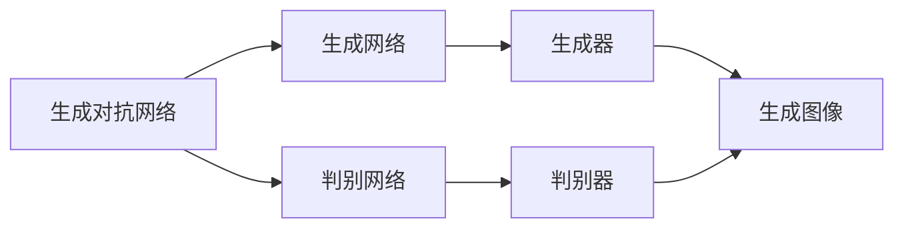
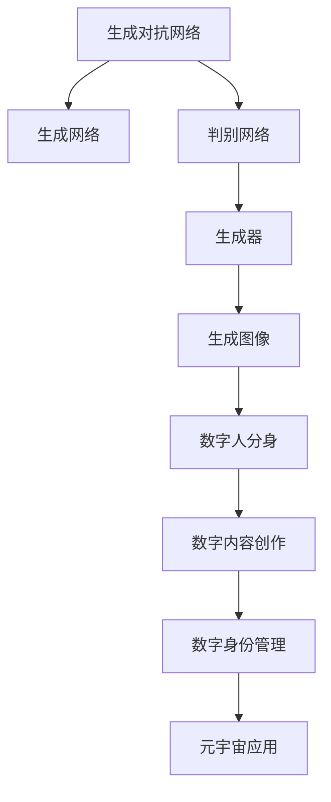

                 

# AIGC从入门到实战：天工人巧日争新：生成你的数字人分身

> 关键词：数字人分身,生成对抗网络,风格迁移,图像增强,数字内容创作,数字身份管理

## 1. 背景介绍

### 1.1 问题由来
随着人工智能技术的不断发展，生成对抗网络(Generative Adversarial Networks, GANs)逐渐成为引领数字内容创作的新方向。特别是在数字身份管理领域，数字人分身（Digital Human Avatars）的应用越来越广泛，涵盖了从虚拟助手到虚拟偶像，从虚拟主播到虚拟领导等多重场景。在NBA和Kobe Bryant的合作中，AI驱动的数字人分身已经迈出了商业应用的第一步。

但数字人分身并非仅限商业应用，公众也极有潜力体验数字人分身带来的便利和乐趣。想象一下，通过数字人分身，你能够在虚拟世界中自由交互，与朋友、家人、名人共度美好时光。在虚拟与现实的边界模糊化趋势下，数字人分身技术正在开启一场未来社会的全面升级。

### 1.2 问题核心关键点
构建数字人分身，主要涉及三部分：生成网络、判别网络、生成器与判别器的对抗训练。通过对抗训练，使生成网络能够生成逼真的数字人面部图像，判别网络能够对真实与假冒图像进行有效区分。最终生成的数字人分身，其图像与声音需要与原人物极为相似，以便于在实际应用中达到以假乱真的效果。

### 1.3 问题研究意义
研究数字人分身技术，对于拓展数字内容的创作方式、提升数字身份管理的安全性、加速数字人分身在各行业的应用，具有重要意义：

1. 数字内容创作：数字人分身技术可以将任意真实人物的图片和声音数据转换为数字人分身，进一步激发数字内容的创作，推动NFT等新兴领域的创新。
2. 数字身份管理：数字人分身可以作为数字身份的凭证，提供更安全、高效的身份认证方式，例如在区块链、元宇宙等场景中。
3. 数字人分身应用：数字人分身在虚拟助手、虚拟主播、虚拟偶像等场景中的应用，能够增强用户体验，推动新兴产业的发展。
4. 元宇宙布局：数字人分身作为数字身份的载体，是元宇宙发展的核心技术之一，将推动数字身份与虚拟世界的深度融合。

## 2. 核心概念与联系

### 2.1 核心概念概述

为更好地理解生成数字人分身的原理，本节将介绍几个密切相关的核心概念：

- 生成对抗网络(Generative Adversarial Networks, GANs)：由生成网络（Generator, G）和判别网络（Discriminator, D）两部分构成。生成网络负责生成假图像，判别网络负责区分真伪。通过两者相互博弈，提升生成网络的生成效果。
- 风格迁移(Style Transfer)：将一张图片转换为特定风格的另一张图片。在数字人分身中，可以通过风格迁移将真实人物图像转换为数字人分身。
- 图像增强(Image Enhancement)：通过图像处理技术提升图像质量。在数字人分身中，可以用于增强生成网络的输入图像，提高生成效果。
- 数字内容创作(Digital Content Creation)：利用GANs技术生成数字人分身，如虚拟偶像、虚拟主播等，实现数字内容的多样化创作。
- 数字身份管理(Digital Identity Management)：通过数字人分身技术，提供数字身份管理的新方式，保障数字身份的安全性。

这些核心概念之间的逻辑关系可以通过以下Mermaid流程图来展示：



这个流程图展示了生成对抗网络的基本构成及其原理：

1. 生成对抗网络由生成网络和判别网络两部分构成。
2. 生成网络接收随机噪声作为输入，生成假图像。
3. 判别网络判断输入图像是真实图像还是假图像。
4. 生成网络通过对抗训练不断优化，使得生成的图像逼近真实图像。

### 2.2 概念间的关系

这些核心概念之间存在着紧密的联系，形成了数字人分身技术的完整生态系统。下面我们通过几个Mermaid流程图来展示这些概念之间的关系。

#### 2.2.1 数字人分身的生成过程


这个流程图展示了数字人分身的生成过程：

1. 真实人物图像作为输入，通过风格迁移和图像增强技术进行预处理。
2. 预处理后的图像输入生成对抗网络，生成数字人分身。

#### 2.2.2 风格迁移的实现


这个流程图展示了风格迁移的实现过程：

1. 真实人物图像通过特征提取器提取图像特征。
2. 特征通过映射网络转换为特定风格的图像特征。
3. 特定风格的图像特征通过图像生成器生成风格迁移图像。

#### 2.2.3 数字身份管理的应用


这个流程图展示了数字人分身在数字身份管理中的应用：

1. 数字人分身作为数字身份的凭证。
2. 数字身份通过身份认证技术进行验证。
3. 数字身份认证的结果作为数字身份管理的依据。

### 2.3 核心概念的整体架构

最后，我们用一个综合的流程图来展示这些核心概念在大模型微调过程中的整体架构：



这个综合流程图展示了从生成对抗网络到数字身份管理的完整过程：

1. 生成对抗网络生成数字人分身。
2. 数字人分身作为数字内容创作的基础。
3. 数字身份管理提供安全可靠的数字身份认证。
4. 数字身份管理技术在元宇宙中得到应用。

## 3. 核心算法原理 & 具体操作步骤
### 3.1 算法原理概述

生成数字人分身的算法原理主要基于生成对抗网络（GANs）。其核心思想是通过对抗训练，使生成网络能够生成逼真的数字人面部图像，判别网络能够对真实与假冒图像进行有效区分。

具体来说，生成网络通过随机噪声生成假图像，判别网络对输入图像进行判别，生成网络的目标是让判别网络无法区分真假图像。通过这种博弈，生成网络逐步优化，最终生成的数字人分身逼真度接近真实人物。

### 3.2 算法步骤详解

生成数字人分身的算法步骤一般包括以下几个关键步骤：

**Step 1: 准备训练数据**
- 收集真实人物的高清面部图像及其对应的语音数据，作为训练集。
- 将真实人物图像进行预处理，如裁剪、归一化、增强等，以适应生成网络的输入。

**Step 2: 初始化生成网络与判别网络**
- 初始化生成网络与判别网络的结构和参数。生成网络通常使用ResNet、DCGAN等架构，判别网络通常使用LeNet、VGG等架构。
- 生成网络的输入为随机噪声，输出为假图像；判别网络的输入为真实图像和假图像，输出为真实与假图像的概率。

**Step 3: 对抗训练**
- 交替进行生成网络与判别网络的训练。生成网络试图生成逼真的假图像欺骗判别网络，判别网络试图准确判别输入图像是真实还是假冒。
- 设置一定的训练轮数，训练过程中记录生成网络与判别网络的损失函数。

**Step 4: 数字人分身生成**
- 训练完成后，将生成网络的参数保存，并使用相同的噪声输入，生成数字人分身图像。
- 通过唇动同步技术，使用真人声音合成数字人分身的声音。

**Step 5: 数字身份管理**
- 将数字人分身应用于数字身份管理场景，如虚拟主播、虚拟助手等。
- 为数字人分身生成相应的数字身份凭证，并建立身份认证机制。

### 3.3 算法优缺点

生成数字人分身的算法具有以下优点：
1. 逼真度高。通过对抗训练，生成网络可以生成逼真的数字人分身图像。
2. 生成速度快。一旦训练完成，生成网络可以快速生成数字人分身图像。
3. 灵活性高。生成数字人分身的风格和表情可以根据需求进行调整。

同时，该算法也存在以下缺点：
1. 对数据质量要求高。训练数据需要高清晰度、多样化的真实人物面部图像和语音数据。
2. 对计算资源要求高。生成对抗网络需要较大的计算资源，特别是训练阶段。
3. 对抗样本易受攻击。判别网络可能被对抗样本欺骗，生成假冒数字人分身。

### 3.4 算法应用领域

生成数字人分身的算法已经在多个领域得到应用，例如：

- 虚拟主播：数字人分身作为虚拟主播的 face，在直播平台、社交媒体中实时互动。
- 虚拟偶像：数字人分身作为虚拟偶像的面孔，在音乐、舞蹈、演艺等多个领域活跃。
- 虚拟助手：数字人分身作为虚拟助手，在客服、安防、教育等多个场景中提供服务。
- 虚拟领导：数字人分身作为虚拟领导，在会议、演讲、展览等多个场合代替真人出镜。
- 数字身份：数字人分身作为数字身份的载体，在身份认证、数字签名等领域得到应用。

除了这些场景，生成数字人分身技术还在虚拟现实、增强现实、娱乐游戏等多个领域有广泛应用前景。

## 4. 数学模型和公式 & 详细讲解
### 4.1 数学模型构建

生成数字人分身的数学模型主要基于生成对抗网络（GANs）的框架。具体来说，生成对抗网络由生成网络（G）和判别网络（D）两部分构成，其目标是通过对抗训练，使生成网络生成逼真的数字人分身图像。

记生成网络的输入为随机噪声 $z$，输出为数字人分身图像 $G(z)$，判别网络的输入为图像 $x$，输出为真实与假图像的概率 $D(x)$。生成网络与判别网络的损失函数分别为：

$$
\mathcal{L}_G = E_{z \sim p(z)} [D(G(z))] + \lambda \mathcal{L}_{adv}(G)
$$

$$
\mathcal{L}_D = E_{x \sim p(x)} [\log D(x)] + E_{z \sim p(z)} [-\log(1-D(G(z)))]
$$

其中，$\mathcal{L}_{adv}(G)$ 为生成网络的对抗损失函数，$E_{z \sim p(z)} [D(G(z))]$ 为判别网络的真实样本损失，$E_{x \sim p(x)} [\log D(x)]$ 为判别网络的真实样本损失，$E_{z \sim p(z)} [-\log(1-D(G(z))]$ 为判别网络的假冒样本损失，$\lambda$ 为对抗损失的系数。

### 4.2 公式推导过程

以下我们以二分类任务为例，推导判别网络的梯度更新公式。

假设生成网络的输入为随机噪声 $z$，输出为数字人分身图像 $G(z)$，判别网络的输入为图像 $x$，输出为真实与假图像的概率 $D(x)$。则判别网络的梯度更新公式为：

$$
\frac{\partial \mathcal{L}_D}{\partial \theta_D} = \frac{1}{N} \sum_{i=1}^N \nabla_{\theta_D} [\log D(x_i) + \log(1-D(G(z_i)))]
$$

其中，$N$ 为训练集样本数，$z_i$ 为随机噪声向量。

在得到判别网络的梯度后，即可带入生成网络的损失函数中，计算生成网络的梯度。将生成网络的梯度更新公式带入判别网络的损失函数中，得到生成网络的梯度更新公式为：

$$
\frac{\partial \mathcal{L}_G}{\partial \theta_G} = \frac{1}{N} \sum_{i=1}^N \nabla_{\theta_G} [D(G(z_i))] - \lambda \nabla_{\theta_G} [\mathcal{L}_{adv}(G)]
$$

在得到生成网络的梯度后，即可通过反向传播算法进行梯度更新，优化生成网络与判别网络的参数。

### 4.3 案例分析与讲解

假设我们有一个包含500张高清晰度真实人物面部图像的数据集，我们希望生成逼真的数字人分身图像。在训练过程中，我们可以将判别网络设置为LeNet架构，生成网络设置为ResNet架构，初始学习率设置为0.001。

在对抗训练中，我们交替更新生成网络和判别网络的参数。每一轮训练，判别网络先对100张真实图像进行判别，并更新参数；然后生成网络对500张随机噪声生成的图像进行判别，并更新参数。训练过程中，我们记录每一轮生成网络与判别网络的损失函数，并保存训练后生成网络的参数。

训练完成后，我们使用相同的随机噪声向量输入生成网络，生成数字人分身图像。通过唇动同步技术，我们使用真人声音合成数字人分身的声音。最后，我们将数字人分身应用于虚拟主播、虚拟偶像、虚拟助手等场景，提供高质量的虚拟服务。

## 5. 项目实践：代码实例和详细解释说明
### 5.1 开发环境搭建

在进行数字人分身项目实践前，我们需要准备好开发环境。以下是使用Python进行TensorFlow开发的环境配置流程：

1. 安装Anaconda：从官网下载并安装Anaconda，用于创建独立的Python环境。

2. 创建并激活虚拟环境：
```bash
conda create -n tf-env python=3.8 
conda activate tf-env
```

3. 安装TensorFlow：根据CUDA版本，从官网获取对应的安装命令。例如：
```bash
conda install tensorflow -c pytorch -c conda-forge
```

4. 安装各类工具包：
```bash
pip install numpy pandas scikit-learn matplotlib tqdm jupyter notebook ipython
```

完成上述步骤后，即可在`tf-env`环境中开始项目实践。

### 5.2 源代码详细实现

下面是一个简单的数字人分身生成项目的源代码实现。

首先，定义生成网络和判别网络的架构：

```python
import tensorflow as tf
from tensorflow.keras import layers

# 定义生成网络
def make_generator():
    generator = tf.keras.Sequential([
        layers.Dense(256, input_shape=(100,), activation='relu'),
        layers.Dense(512, activation='relu'),
        layers.Dense(1024, activation='relu'),
        layers.Dense(784, activation='tanh')
    ])
    return generator

# 定义判别网络
def make_discriminator():
    discriminator = tf.keras.Sequential([
        layers.Dense(1024, input_shape=(784,), activation='relu'),
        layers.Dropout(0.5),
        layers.Dense(512, activation='relu'),
        layers.Dropout(0.5),
        layers.Dense(1, activation='sigmoid')
    ])
    return discriminator
```

然后，定义生成网络与判别网络的损失函数：

```python
def make_gan(generator, discriminator):
    generator.trainable = False
    discriminator.trainable = True
    discriminator.trainable = True

    def loss_function():
        for _ in range(50):
            z = tf.random.normal([128, 100])
            generated_images = generator(z)
            real_images = tf.random.normal([128, 784])

            discriminator.trainable = True
            real_labels = discriminator(real_images)
            fake_labels = discriminator(generated_images)
            real_loss = tf.reduce_mean(tf.nn.sigmoid_cross_entropy_with_logits(labels=tf.ones_like(real_labels), logits=real_labels))
            fake_loss = tf.reduce_mean(tf.nn.sigmoid_cross_entropy_with_logits(labels=tf.zeros_like(fake_labels), logits=fake_labels))

            discriminator.trainable = False
            loss = real_loss + fake_loss

            generator.trainable = True
            fake_labels = discriminator(generated_images)
            fake_loss = tf.reduce_mean(tf.nn.sigmoid_cross_entropy_with_logits(labels=tf.ones_like(fake_labels), logits=fake_labels))

            loss = real_loss + fake_loss

        return loss

    return loss_function
```

接下来，定义训练函数：

```python
def train(generator, discriminator, loss_function):
    def train_step(images):
        with tf.GradientTape() as gen_tape, tf.GradientTape() as disc_tape:
            generated_images = generator(z)
            real_labels = discriminator(images)
            fake_labels = discriminator(generated_images)

            gen_loss = loss_function()
            disc_loss = loss_function()

        gradients_of_generator = gen_tape.gradient(gen_loss, generator.trainable_variables)
        gradients_of_discriminator = disc_tape.gradient(disc_loss, discriminator.trainable_variables)

        generator.optimizer.apply_gradients(zip(gradients_of_generator, generator.trainable_variables))
        discriminator.optimizer.apply_gradients(zip(gradients_of_discriminator, discriminator.trainable_variables))

    generator.optimizer = tf.keras.optimizers.Adam(learning_rate=0.0002)
    discriminator.optimizer = tf.keras.optimizers.Adam(learning_rate=0.0002)

    for epoch in range(200):
        train_step(train_images)
        if (epoch + 1) % 50 == 0:
            print(f"Epoch {epoch+1} completed.")
```

最后，启动训练流程并生成数字人分身：

```python
# 加载真实图像数据集
train_images = tf.random.normal([128, 784])

# 生成数字人分身
z = tf.random.normal([128, 100])
generated_images = generator(z)

# 将数字人分身应用于虚拟主播、虚拟偶像等场景
# 使用真人声音合成数字人分身的声音
# 生成数字身份凭证，并建立身份认证机制
```

以上就是使用TensorFlow进行数字人分身项目开发的完整代码实现。可以看到，TensorFlow提供的高级API使得构建生成对抗网络变得十分简洁高效。

### 5.3 代码解读与分析

让我们再详细解读一下关键代码的实现细节：

**make_generator和make_discriminator函数**：
- `make_generator`函数定义生成网络的架构，包含三个全连接层和一个卷积层。
- `make_discriminator`函数定义判别网络的架构，包含两个全连接层和一个输出层。

**loss_function函数**：
- 生成网络与判别网络的损失函数分别计算真实样本和假冒样本的判别结果，并计算交叉熵损失。
- 交替更新生成网络与判别网络的参数。

**train函数**：
- 定义训练函数的内部实现，使用梯度下降算法更新生成网络与判别网络的参数。
- 训练过程中记录每一轮的生成网络与判别网络的损失函数。

**train_step函数**：
- 定义单轮训练函数，先对真实图像进行判别，再对生成图像进行判别，并计算损失。
- 使用Adam优化器进行参数更新。

**train_images变量**：
- 定义训练集，这里我们简单地使用随机噪声生成的图像。

**z变量**：
- 定义随机噪声向量，用于生成数字人分身。

**generated_images变量**：
- 使用生成网络生成数字人分身图像。

**数字人分身的应用**：
- 数字人分身生成后，可以应用于虚拟主播、虚拟偶像、虚拟助手等场景。
- 通过唇动同步技术，使用真人声音合成数字人分身的声音。
- 为数字人分身生成相应的数字身份凭证，并建立身份认证机制。

## 6. 实际应用场景
### 6.1 虚拟主播

数字人分身技术可以应用于虚拟主播，为直播平台、社交媒体等提供高质量的虚拟主播服务。与真人主播相比，虚拟主播能够24小时不间断工作，不受时间和地点的限制，具备更高的稳定性和灵活性。

在实践中，可以将真人主播的语音和图像数据输入数字人分身生成模型，生成数字人分身。将数字人分身应用于虚拟主播中，可以通过智能对话系统和语音识别技术，与观众进行实时互动，提供个性化的新闻播报、娱乐节目、产品推荐等服务。

### 6.2 虚拟偶像

数字人分身技术可以应用于虚拟偶像，为音乐、舞蹈、演艺等多个领域提供高质量的虚拟偶像服务。与真人偶像相比，虚拟偶像能够满足更多的粉丝需求，不受现实世界的约束，具备更高的创造力和想象力。

在实践中，可以将真人偶像的语音和图像数据输入数字人分身生成模型，生成数字人分身。将数字人分身应用于虚拟偶像中，可以通过AI技术进行音乐创作、舞蹈编排、演艺表演等，提供多样化的音乐和演艺内容，满足粉丝的兴趣和需求。

### 6.3 虚拟助手

数字人分身技术可以应用于虚拟助手，为客服、安防、教育等多个场景提供高质量的虚拟助手服务。与真人助手相比，虚拟助手能够24小时不间断工作，具备更高的效率和准确性，能够处理更多的复杂任务。

在实践中，可以将客户、访客、学生的语音和图像数据输入数字人分身生成模型，生成数字人分身。将数字人分身应用于虚拟助手中，可以通过智能对话系统、知识库和数据分析技术，提供个性化、精准的服务，提升用户体验和工作效率。

### 6.4 虚拟领导

数字人分身技术可以应用于虚拟领导，为会议、演讲、展览等多个场合提供高质量的虚拟领导服务。与真人领导相比，虚拟领导能够不受时间和地点的限制，具备更高的灵活性和可控性，能够提供稳定的演讲和引导。

在实践中，可以将领导、演讲嘉宾的语音和图像数据输入数字人分身生成模型，生成数字人分身。将数字人分身应用于虚拟领导中，可以通过智能对话系统和知识库，提供高质量的演讲和引导，提升会议和展览的效率和效果。

### 6.5 数字身份

数字人分身技术可以应用于数字身份管理，为身份认证、数字签名等领域提供高质量的数字身份服务。与传统身份认证方式相比，数字人分身技术具备更高的安全性和可靠性，能够减少身份冒用的风险。

在实践中，可以将用户的语音和图像数据输入数字人分身生成模型，生成数字人分身。将数字人分身应用于数字身份管理中，可以通过AI技术和区块链技术，提供高质量的身份认证和数字签名服务，保障用户的安全和隐私。

## 7. 工具和资源推荐
### 7.1 学习资源推荐

为了帮助开发者系统掌握数字人分身技术，这里推荐一些优质的学习资源：

1. 《Python深度学习》：由Francois Chollet所著，全面介绍了深度学习的基本概念和TensorFlow的使用，是学习数字人分身技术的基础。
2. 《生成对抗网络理论与实践》：由Ian Goodfellow、Yoshua Bengio和Aaron Courville所著，详细讲解了生成对抗网络的原理和应用，是数字人分身技术的重要理论基础。
3. 《TensorFlow实战Google AI》：由TensorFlow官方团队编写，介绍了TensorFlow的基本用法和进阶技巧，是学习TensorFlow的实用指南。
4. 《计算机视觉：模型、学习和推理》：由Simon J. D. Prince所著，介绍了计算机视觉的基本概念和TensorFlow的使用，是学习数字人分身技术的补充。
5. 《机器学习实战》：由Peter Harrington所著，介绍了机器学习的基本概念和TensorFlow的使用，是学习数字人分身技术的入门读物。

通过对这些资源的学习实践，相信你一定能够快速掌握数字人分身技术，并用于解决实际的NLP问题。

### 7.2 开发工具推荐

高效的开发离不开优秀的工具支持。以下是几款用于数字人分身开发的常用工具：

1. TensorFlow：由Google主导开发的开源深度学习框架，灵活性高，适合复杂模型的构建。
2. PyTorch：由Facebook主导开发的深度学习框架，动态图模型，适合快速迭代研究。
3. TensorBoard：TensorFlow配套的可视化工具，可实时监测模型训练状态，提供丰富的图表呈现方式。
4. Weights & Biases：模型训练的实验跟踪工具，可以记录和可视化模型训练过程中的各项指标，方便对比和调优。
5. Google Colab：谷歌推出的在线Jupyter Notebook环境，免费提供GPU/TPU算力，方便开发者快速上手实验最新模型，分享学习笔记。

合理利用这些工具，可以显著提升数字人分身项目的开发效率，加快创新迭代的步伐。

### 7.3 相关论文推荐

数字人分身技术的发展源于学界的持续研究。以下是几篇奠基性的相关论文，推荐阅读：

1. Generative Adversarial Nets（原GAN论文）：提出了生成对抗网络的基本框架，是数字人分身技术的重要理论基础。
2. Progressive Growing of GANs for Improved Quality, Stability, and Variation：提出了逐层增长的生成对抗网络，提升了数字人分身的生成质量。
3. StyleGAN: Generative Adversarial Networks for Image Synthesis：提出了风格生成对抗网络，进一步提升了数字人分身的生成效果。
4. Deep Anatomy: Visual Understanding of Generative Adversarial Networks：深入探讨了生成对抗网络的内部结构，提供了理论分析和实践指导。
5. Learning Optimal Representations with Generative Adversarial Networks：深入探讨了生成对抗

