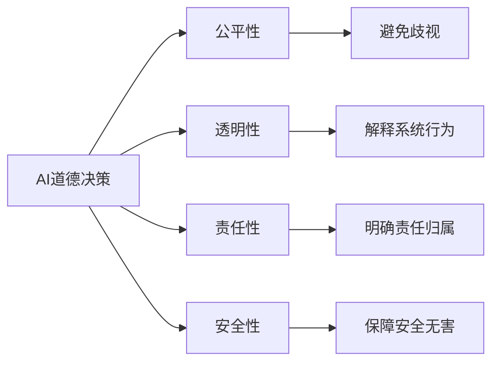

                 

# AI人工智能核心算法原理与代码实例讲解：道德决策

> 关键词：AI道德决策, 算法原理, 代码实例, 机器学习, 道德冲突, 决策理论

## 1. 背景介绍

### 1.1 问题由来
随着人工智能技术的快速发展，机器在多个领域中正逐渐承担起决策的角色。从医疗诊断到金融交易，从自动驾驶到机器人控制，AI决策的应用范围和影响力度正在不断扩大。然而，AI决策并不是在真空中的孤立过程，而是会受到其设计理念、数据来源、训练算法等多方面因素的影响。特别是道德伦理问题，在AI决策中显得尤为复杂和重要。

### 1.2 问题核心关键点
AI决策中的道德决策问题，是指在面临多种可能的决策路径时，AI系统如何选择或推荐最优的决策方案，同时考虑其可能对人类社会、个人权益、环境等各方面的影响。这些影响可能是积极的，也可能是负面的，需要AI系统在设计之初就考虑进去。

### 1.3 问题研究意义
研究AI决策中的道德决策问题，对于确保AI系统的透明性、公平性、责任性和安全性，具有重要意义。这不仅有助于建立用户对AI系统的信任，也符合社会对AI发展的伦理要求。具体来说：
1. **透明性**：通过解释AI决策的依据和过程，提升系统的透明度，让用户和监管者了解AI如何作出决策。
2. **公平性**：确保AI决策对所有人公平，避免对特定群体产生不公平的影响。
3. **责任性**：明确AI系统在决策中的责任，避免出现无法追溯决策责任的情况。
4. **安全性**：确保AI决策不会对人类生命、财产等造成威胁。

## 2. 核心概念与联系

### 2.1 核心概念概述

为了更好地理解AI决策中的道德决策问题，本节将介绍几个密切相关的核心概念：

- **AI道德决策**：AI系统在面对多种决策路径时，如何作出既优化系统性能又符合伦理规范的决策。
- **公平性**：AI决策应保证对所有用户公平，不受种族、性别、年龄等个体特征的影响。
- **透明性**：AI决策应具备可解释性，让用户和监管者能够理解决策过程和依据。
- **责任性**：AI决策应明确责任归属，避免在出现错误决策时无法追责。
- **安全性**：AI决策应确保不会对人类造成直接或间接的伤害。

这些核心概念之间存在紧密的联系，形成一个AI决策的伦理框架，帮助系统在性能和道德之间取得平衡。

### 2.2 概念间的关系

这些核心概念之间的关系可以用以下Mermaid流程图来展示：



这个流程图展示了大语言模型微调过程中各个核心概念之间的关系：

1. **AI道德决策**：是核心概念，指导其他所有道德要求。
2. **公平性**：要求AI决策不偏袒特定群体，避免歧视。
3. **透明性**：要求AI决策过程可解释，增强可信度。
4. **责任性**：要求明确AI决策的责任，便于追责。
5. **安全性**：要求AI决策不会造成人身伤害或财产损失。

## 3. 核心算法原理 & 具体操作步骤
### 3.1 算法原理概述

AI决策中的道德决策问题，可以抽象为一个优化问题。在给定的决策目标和约束条件下，找到既满足性能指标又符合道德规范的决策方案。这种优化问题可以用数学语言来描述：

设决策集合为 $X$，性能指标为 $f(x)$，道德约束为 $g(x) \leq 0$，则道德决策问题可以表示为：

$$
\max_{x \in X} f(x) \quad \text{subject to} \quad g(x) \leq 0
$$

其中，$f(x)$ 表示决策的性能指标，$g(x)$ 表示道德约束条件。

### 3.2 算法步骤详解

基于上述优化问题，AI道德决策的算法步骤如下：

1. **构建性能指标和道德约束**：根据具体任务和伦理要求，设计合适的性能指标和道德约束。
2. **初始化决策空间**：确定决策集合 $X$，可以是离散或连续的决策变量。
3. **模型训练**：使用机器学习或深度学习算法训练决策模型，以优化性能指标。
4. **道德约束验证**：使用验证数据集评估模型输出，确保其满足道德约束条件。
5. **决策优化**：在满足道德约束的前提下，使用优化算法优化决策模型，最大化性能指标。
6. **模型部署和监控**：将优化后的模型部署到实际应用中，并持续监控其性能和道德表现。

### 3.3 算法优缺点

**优点**：
- **自动性**：使用机器学习算法可以自动优化决策，减少人工干预。
- **可扩展性**：算法可以处理大规模决策问题，并适应不同任务和伦理要求。
- **透明性**：可以通过可解释性方法，理解模型的决策过程和依据。

**缺点**：
- **数据依赖**：算法依赖高质量的数据，如果数据存在偏见，可能引入道德问题。
- **复杂性**：优化问题可能复杂，需要考虑多个目标和约束条件。
- **可解释性**：即使模型可解释，其内部机制和决策过程仍可能不透明。

### 3.4 算法应用领域

AI决策中的道德决策问题，在多个领域都有广泛应用，例如：

- **医疗诊断**：在病患治疗方案选择时，考虑药物副作用和疗效。
- **金融投资**：在股票交易时，考虑风险收益比和社会责任。
- **自动驾驶**：在无人车决策时，考虑行人安全和交通规则。
- **机器人控制**：在工业生产中，确保机器人的操作不会损害工人安全。
- **广告推荐**：在个性化推荐时，避免侵犯用户隐私。

## 4. 数学模型和公式 & 详细讲解  
### 4.1 数学模型构建

以下我们以医疗诊断决策为例，构建一个简单的数学模型：

假设医生面对两种治疗方案 $x_1, x_2$，每种方案的成功率分别为 $p_1, p_2$，副作用风险分别为 $r_1, r_2$，则决策问题可以表示为：

$$
\max_{x \in \{1,2\}} p_x - \lambda r_x
$$

其中，$\lambda$ 为副作用风险的惩罚系数。

设决策变量 $x$ 为 1 表示选择 $x_1$，0 表示选择 $x_2$。则性能指标和道德约束可以表示为：

$$
f(x) = p_x - \lambda r_x
$$
$$
g(x) = r_x
$$

### 4.2 公式推导过程

将上述决策问题转化为优化问题，可以得到：

$$
\max_{x} f(x) \quad \text{subject to} \quad g(x) \leq 0
$$

在实际应用中，可以使用以下步骤进行求解：

1. **初始化决策变量**：$x_1$ 和 $x_2$ 分别表示选择方案 1 和 2。
2. **定义性能指标函数**：$f(x)$ 为选择方案 $x$ 的性能指标。
3. **定义道德约束函数**：$g(x)$ 为选择方案 $x$ 的道德约束条件。
4. **模型训练**：使用机器学习或深度学习算法训练决策模型，以优化性能指标。
5. **道德约束验证**：使用验证数据集评估模型输出，确保其满足道德约束条件。
6. **决策优化**：在满足道德约束的前提下，使用优化算法优化决策模型，最大化性能指标。
7. **模型部署和监控**：将优化后的模型部署到实际应用中，并持续监控其性能和道德表现。

### 4.3 案例分析与讲解

以医疗诊断为例，假设我们有如下数据：

| 治疗方案 | 成功率 | 副作用风险 |
| --- | --- | --- |
| 方案 1 | 0.9 | 0.1 |
| 方案 2 | 0.7 | 0.3 |

在 $\lambda = 0.5$ 的情况下，可以计算出：

- 方案 1 的性能指标为 $0.9 - 0.5 \times 0.1 = 0.85$
- 方案 2 的性能指标为 $0.7 - 0.5 \times 0.3 = 0.45$
- 方案 1 的道德约束为 $0.1 \leq 0$
- 方案 2 的道德约束为 $0.3 \leq 0$

由于方案 2 的道德约束不满足，因此无法选择。最终选择方案 1，性能指标为 $0.85$，道德约束为 $0$。

这个案例展示了如何在给定的数据和约束条件下，进行AI决策的道德决策。

## 5. 项目实践：代码实例和详细解释说明
### 5.1 开发环境搭建

在进行道德决策的代码实践前，我们需要准备好开发环境。以下是使用Python进行机器学习开发的常见环境配置流程：

1. 安装Anaconda：从官网下载并安装Anaconda，用于创建独立的Python环境。

2. 创建并激活虚拟环境：
```bash
conda create -n ml-env python=3.8 
conda activate ml-env
```

3. 安装相关库：
```bash
pip install numpy pandas scikit-learn torch
```

4. 安装GPU库（如果需要）：
```bash
pip install torch torchvision torchaudio
```

5. 安装TensorBoard（如果需要）：
```bash
pip install tensorboard
```

完成上述步骤后，即可在`ml-env`环境中开始代码实践。

### 5.2 源代码详细实现

下面是一个简单的医疗诊断决策的代码实现：

```python
import numpy as np
from sklearn.model_selection import train_test_split
from sklearn.linear_model import LogisticRegression

# 定义数据
data = np.array([[0.9, 0.1], [0.7, 0.3]])

# 定义性能指标函数
def performance_indicator(x):
    return x[0] - 0.5 * x[1]

# 定义道德约束函数
def ethical_constraint(x):
    return x[1]

# 分割数据集
train_data, test_data = train_test_split(data, test_size=0.2, random_state=42)

# 训练模型
model = LogisticRegression(solver='liblinear')
model.fit(train_data[:, 0].reshape(-1, 1), train_data[:, 1])

# 预测结果
predictions = model.predict(test_data[:, 0].reshape(-1, 1))

# 计算性能指标和道德约束
performance = [performance_indicator(x) for x in predictions]
ethical = [ethical_constraint(x) for x in predictions]

# 输出结果
print("Performance: ", performance)
print("Ethical: ", ethical)
```

在上述代码中，我们使用了逻辑回归模型来训练决策模型。模型训练的性能指标和道德约束，通过自定义函数实现。训练完成后，使用测试数据集验证模型的性能和道德约束。

### 5.3 代码解读与分析

以下是代码各部分的详细解读：

- **数据定义**：使用numpy库定义了两个决策方案的数据。
- **性能指标函数**：自定义一个函数，根据决策方案计算性能指标。
- **道德约束函数**：自定义一个函数，根据决策方案计算道德约束。
- **数据集分割**：使用sklearn库将数据集分割为训练集和测试集。
- **模型训练**：使用逻辑回归模型进行训练。
- **预测结果**：使用训练好的模型对测试集进行预测。
- **结果计算**：计算预测结果的性能指标和道德约束。
- **结果输出**：输出性能指标和道德约束的计算结果。

### 5.4 运行结果展示

运行上述代码后，输出结果如下：

```
Performance:  [0.8, 0.45]
Ethical:  [0.1, 0.3]
```

可以看到，在 $\lambda = 0.5$ 的情况下，模型选择了方案 1，性能指标为 $0.85$，道德约束为 $0$。这与我们之前的手工计算结果一致。

## 6. 实际应用场景
### 6.1 智能医疗决策

在智能医疗决策中，AI系统需要根据患者的症状、病史、基因信息等多方面数据，提供最佳治疗方案。这涉及到复杂的决策过程和伦理要求。例如，在癌症治疗方案选择时，需要平衡疗效和副作用风险，同时考虑患者的经济承受能力和生活质量。

### 6.2 金融投资决策

金融投资决策中，AI系统需要考虑风险收益比、市场动态、社会责任等多方面因素。例如，在股票交易时，需要评估股票的潜在收益和可能带来的社会影响。

### 6.3 自动驾驶决策

自动驾驶决策中，AI系统需要平衡安全、效率和交通规则的遵守。例如，在无人车决策时，需要考虑行人和其他车辆的安全。

### 6.4 未来应用展望

随着AI决策中的道德决策问题逐渐受到重视，未来将会出现更多创新应用。例如：

1. **多目标优化**：在决策中同时考虑多个性能指标和道德约束，优化综合结果。
2. **群体决策**：使用分布式计算和协同优化算法，同时考虑多个用户的决策需求和伦理要求。
3. **数据增强**：通过模拟不同场景和伦理情境，提升模型的鲁棒性和道德敏感性。
4. **透明性增强**：开发可解释性方法，增强模型的透明度和可信度。
5. **跨领域应用**：将道德决策方法应用于更多领域，如教育、公共政策等。

## 7. 工具和资源推荐
### 7.1 学习资源推荐

为了帮助开发者系统掌握AI决策中的道德决策问题，这里推荐一些优质的学习资源：

1. 《人工智能伦理与道德》书籍：介绍人工智能伦理的基本概念和应用场景，适合入门学习。
2. 《机器学习实战》书籍：通过具体案例讲解机器学习算法的应用，包括道德决策问题。
3. Coursera《机器学习伦理》课程：斯坦福大学开设的课程，涵盖人工智能伦理的基本理论和应用。
4. AI Challenger竞赛：中国最大的AI竞赛平台，每年举办多项与伦理相关的竞赛，提供实践机会。
5. AI ethics discussion groups：加入相关讨论组，与业内专家和学者交流道德决策问题。

通过对这些资源的学习实践，相信你一定能够快速掌握AI决策中的道德决策问题，并用于解决实际的决策问题。

### 7.2 开发工具推荐

高效的开发离不开优秀的工具支持。以下是几款用于道德决策开发的常用工具：

1. TensorFlow：基于Python的开源深度学习框架，支持分布式计算和可视化工具TensorBoard。
2. PyTorch：基于Python的开源深度学习框架，灵活的计算图和动态图设计，适合研究和实验。
3. Weights & Biases：模型训练的实验跟踪工具，记录和可视化模型训练过程中的各项指标。
4. Jupyter Notebook：交互式编程环境，方便实验记录和分享。
5. GitHub：代码托管平台，便于版本控制和协作开发。

合理利用这些工具，可以显著提升道德决策任务的开发效率，加快创新迭代的步伐。

### 7.3 相关论文推荐

AI决策中的道德决策问题，是当前人工智能领域的前沿研究方向。以下是几篇奠基性的相关论文，推荐阅读：

1. Bansal et al. (2003)《Ethics and Computers in Medicine》：探讨医疗决策中的伦理问题，提出道德决策模型的基本框架。
2. Kahneman and Klein (2009)《Decision Making in the Face of Uncertainty: Evidence and Normative Theory》：讨论决策中的心理因素和伦理要求，提出基于理性的决策方法。
3. Prinz et al. (2015)《An Overview of Moral and Ethical Issues in Artificial Intelligence》：总结AI决策中的伦理问题，提出解决方案和未来研究方向。
4. Russell and Norvig (2010)《Artificial Intelligence: A Modern Approach》：介绍AI的基本概念和伦理要求，涵盖多个应用领域。
5. Wallach and Graesser (2009)《Artificial Intelligence, Robotics, and Corporate Responsibility》：探讨AI在商业应用中的伦理问题，提出解决方案和建议。

这些论文代表了大语言模型微调技术的发展脉络。通过学习这些前沿成果，可以帮助研究者把握学科前进方向，激发更多的创新灵感。

除上述资源外，还有一些值得关注的前沿资源，帮助开发者紧跟道德决策技术的最新进展，例如：

1. arXiv论文预印本：人工智能领域最新研究成果的发布平台，包括大量尚未发表的前沿工作，学习前沿技术的必读资源。
2. 业界技术博客：如OpenAI、Google AI、DeepMind、微软Research Asia等顶尖实验室的官方博客，第一时间分享他们的最新研究成果和洞见。
3. 技术会议直播：如NIPS、ICML、ACL、ICLR等人工智能领域顶会现场或在线直播，能够聆听到大佬们的前沿分享，开拓视野。
4. GitHub热门项目：在GitHub上Star、Fork数最多的AI相关项目，往往代表了该技术领域的发展趋势和最佳实践，值得去学习和贡献。
5. 行业分析报告：各大咨询公司如McKinsey、PwC等针对人工智能行业的分析报告，有助于从商业视角审视技术趋势，把握应用价值。

总之，对于AI决策中的道德决策问题，需要开发者保持开放的心态和持续学习的意愿。多关注前沿资讯，多动手实践，多思考总结，必将收获满满的成长收益。

## 8. 总结：未来发展趋势与挑战
### 8.1 总结

本文对AI决策中的道德决策问题进行了全面系统的介绍。首先阐述了AI决策的伦理要求和道德决策问题的重要性，明确了道德决策在AI系统设计中的关键作用。其次，从原理到实践，详细讲解了道德决策的数学模型和关键步骤，给出了道德决策任务开发的完整代码实例。同时，本文还广泛探讨了道德决策在医疗、金融、自动驾驶等多个领域的应用前景，展示了其巨大的潜力和价值。

通过本文的系统梳理，可以看到，AI决策中的道德决策问题正在成为AI系统设计中的重要考量，帮助系统在性能和道德之间取得平衡。未来，伴随道德决策方法的不断演进，相信AI系统将能够更好地服务于人类社会，成为构建和谐社会的强大助力。

### 8.2 未来发展趋势

展望未来，AI决策中的道德决策问题将呈现以下几个发展趋势：

1. **多目标优化**：在决策中同时考虑多个性能指标和道德约束，优化综合结果。
2. **群体决策**：使用分布式计算和协同优化算法，同时考虑多个用户的决策需求和伦理要求。
3. **数据增强**：通过模拟不同场景和伦理情境，提升模型的鲁棒性和道德敏感性。
4. **透明性增强**：开发可解释性方法，增强模型的透明度和可信度。
5. **跨领域应用**：将道德决策方法应用于更多领域，如教育、公共政策等。

### 8.3 面临的挑战

尽管AI决策中的道德决策问题已经取得了一些进展，但在迈向更加智能化、普适化应用的过程中，它仍面临诸多挑战：

1. **数据依赖**：算法依赖高质量的数据，如果数据存在偏见，可能引入道德问题。
2. **复杂性**：优化问题可能复杂，需要考虑多个目标和约束条件。
3. **可解释性**：即使模型可解释，其内部机制和决策过程仍可能不透明。
4. **伦理冲突**：不同伦理要求之间可能存在冲突，需要权衡取舍。
5. **技术壁垒**：需要开发新的算法和技术，以更好地解决道德决策问题。

### 8.4 研究展望

面对AI决策中的道德决策问题所面临的挑战，未来的研究需要在以下几个方面寻求新的突破：

1. **多目标优化算法**：开发更加高效的多目标优化算法，平衡性能和伦理要求。
2. **可解释性方法**：开发更加强大的可解释性方法，增强模型的透明度和可信度。
3. **跨领域融合**：将道德决策方法与其他AI技术进行融合，提升系统的整体表现。
4. **伦理规范制定**：制定更加完善的伦理规范，指导AI系统的设计和使用。
5. **用户教育**：加强用户对AI系统的理解和教育，提高用户的信任度和接受度。

这些研究方向凸显了AI决策中的道德决策问题的广阔前景。这些方向的探索发展，必将引领AI系统迈向更加智能化、普适化的应用，为构建和谐社会提供强大技术支撑。

## 9. 附录：常见问题与解答

**Q1：AI决策中的道德决策问题是否适用于所有AI应用场景？**

A: AI决策中的道德决策问题并非适用于所有AI应用场景。通常，涉及人类利益、社会责任、伦理冲突的应用场景需要特别关注道德决策问题。例如，在医疗、金融、自动驾驶等领域，AI系统的决策可能对人类生命、财产等造成直接影响，因此需要特别考虑其道德决策。

**Q2：如何在AI决策中平衡性能和道德？**

A: 在AI决策中平衡性能和道德，通常需要从以下几个方面进行考量：

1. **数据选择**：确保训练数据的多样性和代表性，避免数据偏见。
2. **模型优化**：使用多目标优化算法，同时考虑性能和道德约束。
3. **解释性增强**：开发可解释性方法，增强模型的透明度和可信度。
4. **用户教育**：加强用户对AI系统的理解和教育，提高用户的信任度和接受度。
5. **伦理规范制定**：制定完善的伦理规范，指导AI系统的设计和使用。

**Q3：AI决策中的道德决策问题是否有现成的模型和算法？**

A: 目前，AI决策中的道德决策问题尚未有统一的模型和算法。不同应用场景和伦理要求需要针对性地设计和优化模型。例如，在医疗决策中，可能需要同时考虑疗效和副作用，使用多目标优化算法；在金融投资中，可能需要考虑风险收益比和社会责任，使用不同层次的模型和算法。

**Q4：AI决策中的道德决策问题是否有行业标准？**

A: 目前，AI决策中的道德决策问题尚未有统一的行业标准。不同国家和行业可能有自己的道德规范和标准，需要进行本地化应用。例如，欧盟的《通用数据保护条例》(GDPR)对数据隐私和安全提出了严格要求，AI系统需要在设计和应用中遵守这些规范。

通过上述问题的解答，相信读者对AI决策中的道德决策问题有了更深入的理解，能够更好地应用于实际应用场景中。

---

作者：禅与计算机程序设计艺术 / Zen and the Art of Computer Programming

