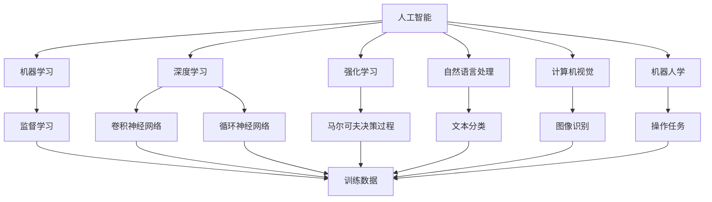
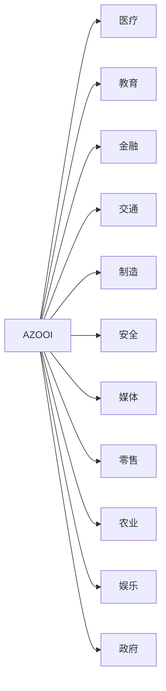
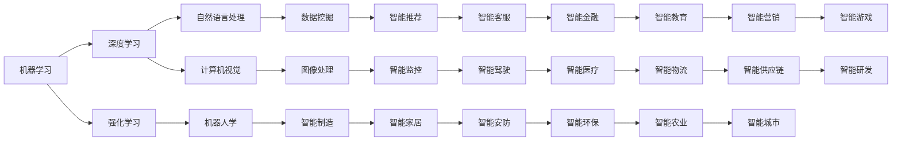
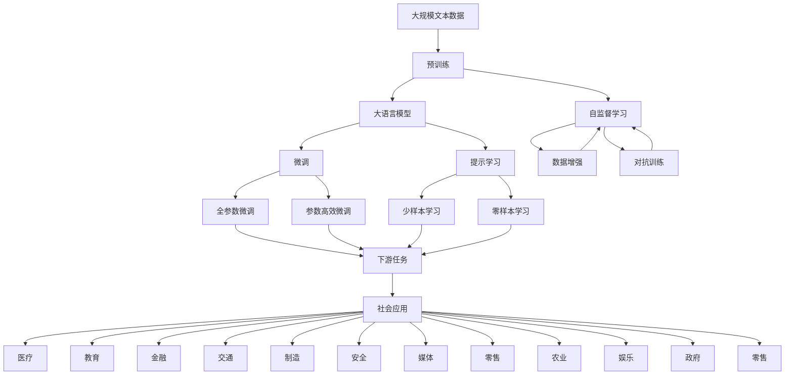

                 

# AI在社会中的作用与应用

> 关键词：人工智能(AI),社会影响,应用场景,伦理道德,技术发展

## 1. 背景介绍

### 1.1 问题由来

近年来，人工智能(AI)技术迅速崛起，从初期的专家系统、机器学习，到如今深度学习、强化学习，AI已经成为引领未来科技发展的核心力量。AI不仅改变了诸多行业和领域，更深刻地重塑了社会结构和生活方式。

AI技术的广泛应用，带来了巨大的经济价值和社会效益，但也引发了关于伦理、隐私、安全等诸多复杂的社会问题。如何在追求技术进步的同时，兼顾伦理道德和社会责任，成为当前AI领域亟待解决的重大课题。

### 1.2 问题核心关键点

AI在社会中的作用与应用，主要涉及以下几个关键点：

- **技术发展**：AI技术的不断进步为社会各个领域带来了深远影响，从医疗、教育、金融到交通、制造、安全，AI技术的应用无处不在。
- **社会影响**：AI技术的应用不仅改变了行业的运作模式，也重塑了就业结构、社会治理和人际交往方式。
- **伦理道德**：AI在提升效率和效益的同时，也可能带来隐私泄露、偏见歧视、伦理冲突等问题，需慎重处理。
- **安全保障**：AI技术的广泛应用，也带来了网络安全、数据隐私等新挑战，如何保障AI系统的安全性和可靠性，是亟待解决的问题。
- **法律法规**：面对AI技术的快速发展，各国纷纷出台相关法律法规，以规范AI应用，保障公众权益。

### 1.3 问题研究意义

研究AI在社会中的作用与应用，对于推动AI技术的健康发展，促进其更好地服务于社会，具有重要意义：

1. **指导技术发展**：通过分析AI在各领域的应用效果和问题，指导AI技术的未来发展方向，避免盲目应用带来的负面影响。
2. **促进伦理讨论**：引发社会对AI伦理问题的关注和讨论，明确AI应用的道德边界，推动社会责任意识的提升。
3. **保障技术安全**：研究和讨论AI安全问题，提出有效的防护措施，确保AI技术的安全可靠应用。
4. **推动法律法规建设**：通过技术研究，推动相关法律法规的出台和完善，为AI技术的健康发展提供法律保障。
5. **增强公众信任**：通过科普和教育，提升公众对AI技术的理解和信任，促进AI技术的普及和应用。

## 2. 核心概念与联系

### 2.1 核心概念概述

为更好地理解AI在社会中的作用与应用，本节将介绍几个密切相关的核心概念：

- **人工智能(AI)**：通过算法和计算技术，使计算机系统能够模拟人类智能行为的技术，包括感知、学习、推理、规划、决策等。
- **机器学习(ML)**：一类AI技术，通过数据训练模型，使模型能够对未知数据进行预测或分类。
- **深度学习(DL)**：一类特殊的机器学习方法，利用多层神经网络结构，从大规模数据中自动学习特征表示，广泛应用于图像识别、语音处理等领域。
- **强化学习(RL)**：通过试错学习，使智能体在与环境交互中逐步优化策略，实现复杂任务自动化的技术。
- **自然语言处理(NLP)**：处理和理解人类语言的技术，包括语言理解、生成、翻译、问答等。
- **计算机视觉(CV)**：利用计算机技术处理图像和视频数据，实现对象检测、识别、跟踪等任务。
- **机器人学(Robotics)**：结合AI技术，使机器人能够自主决策、执行复杂任务，广泛应用于制造、医疗、服务等领域。
- **大数据(Big Data)**：海量数据集合，通过数据分析和处理，挖掘出有价值的信息，支持AI模型的训练和优化。

这些核心概念之间的逻辑关系可以通过以下Mermaid流程图来展示：



这个流程图展示了AI领域的核心技术及其应用，包括机器学习、深度学习、强化学习、自然语言处理、计算机视觉、机器人学等，以及这些技术背后的数据支持和算法原理。通过理解这些核心概念，我们可以更好地把握AI技术的全貌和应用潜力。

### 2.2 概念间的关系

这些核心概念之间存在着紧密的联系，形成了AI技术的完整生态系统。下面我通过几个Mermaid流程图来展示这些概念之间的关系。

#### 2.2.1 AI技术的应用领域



这个流程图展示了AI技术在各领域的应用，从医疗、教育到金融、交通、制造、安全等，AI技术已经成为推动这些行业转型升级的重要力量。

#### 2.2.2 技术融合与创新



这个流程图展示了AI技术在各领域的应用过程中，不同技术之间的融合与创新，如深度学习与自然语言处理结合的机器翻译，计算机视觉与机器人学结合的智能监控，以及强化学习与智能制造结合的智能控制等。

### 2.3 核心概念的整体架构

最后，我们用一个综合的流程图来展示这些核心概念在大语言模型微调过程中的整体架构：



这个综合流程图展示了从预训练到微调，再到社会应用的完整过程。大语言模型首先在大规模文本数据上进行预训练，然后通过微调（包括全参数微调和参数高效微调）或提示学习（包括少样本学习和零样本学习）来适应特定任务，最终在实际应用中发挥作用。通过这些流程图，我们可以更清晰地理解AI技术从研究到应用的全过程。

## 3. 核心算法原理 & 具体操作步骤

### 3.1 算法原理概述

AI在社会中的作用与应用，本质上是一个复杂的技术和社会交互过程。其核心思想是通过算法和计算技术，使AI系统能够模拟人类智能行为，辅助人类进行决策和执行复杂任务。

形式化地，假设AI系统为 $M$，其输入为 $x$，输出为 $y$，目标函数为 $f$，则AI系统的优化目标是最小化目标函数，即找到最优解 $M^*$：

$$
M^* = \mathop{\arg\min}_{M} f(M(x), y)
$$

在实践中，我们通常使用基于梯度的优化算法（如SGD、Adam等）来近似求解上述最优化问题。设 $\eta$ 为学习率，$\lambda$ 为正则化系数，则参数的更新公式为：

$$
M \leftarrow M - \eta \nabla_{M}f(M(x), y) - \eta\lambda M
$$

其中 $\nabla_{M}f(M(x), y)$ 为损失函数对模型 $M$ 的梯度，可通过反向传播算法高效计算。

### 3.2 算法步骤详解

AI在社会中的作用与应用一般包括以下几个关键步骤：

**Step 1: 定义任务与目标函数**
- 根据实际应用需求，定义AI系统的输入 $x$ 和输出 $y$，即明确任务类型（如图像分类、文本生成、语音识别等）。
- 确定目标函数 $f$，用于衡量AI系统输出与真实标签之间的差异。如分类任务使用交叉熵损失，回归任务使用均方误差损失等。

**Step 2: 选择模型与优化器**
- 选择合适的AI模型，如卷积神经网络(CNN)、循环神经网络(RNN)、长短时记忆网络(LSTM)、Transformer等。
- 设置优化算法及其参数，如Adam、SGD等，设定学习率、批大小、迭代轮数等。
- 确定正则化技术，如L2正则、Dropout、Early Stopping等，避免模型过拟合。

**Step 3: 数据准备与预处理**
- 收集并标注大量数据，作为模型训练的基础。
- 对数据进行预处理，如数据增强、归一化、标准化等，提升数据质量。
- 划分训练集、验证集和测试集，用于模型训练、调参和最终评估。

**Step 4: 模型训练与优化**
- 将数据分批次输入模型，前向传播计算损失函数。
- 反向传播计算参数梯度，根据设定的优化算法和学习率更新模型参数。
- 周期性在验证集上评估模型性能，根据性能指标决定是否触发Early Stopping。
- 重复上述步骤直到满足预设的迭代轮数或Early Stopping条件。

**Step 5: 模型评估与部署**
- 在测试集上评估模型性能，对比训练前后的精度提升。
- 使用模型对新样本进行推理预测，集成到实际的应用系统中。
- 持续收集新的数据，定期重新训练或微调模型，以适应数据分布的变化。

以上是AI在社会中应用的一般流程。在实际应用中，还需要根据具体任务的特点，对模型训练和优化环节进行优化设计，如改进训练目标函数，引入更多的正则化技术，搜索最优的超参数组合等，以进一步提升模型性能。

### 3.3 算法优缺点

AI在社会中的作用与应用，具有以下优点：

1. **高效性**：AI系统能够在短时间内处理大量数据，完成复杂的决策和执行任务，大大提高工作效率。
2. **普适性**：AI技术可以应用于各种行业和领域，如医疗、教育、金融、交通等，具有广泛的应用前景。
3. **准确性**：AI系统通过大量数据训练，能够获得高精度的预测和分类结果，显著提升决策的准确性。
4. **灵活性**：AI系统可以根据需求灵活调整参数和模型结构，适应不同的应用场景。
5. **可扩展性**：AI系统可以通过增加计算资源和数据规模，实现性能的提升和功能的扩展。

同时，该方法也存在一定的局限性：

1. **数据依赖性**：AI系统需要大量高质量的数据进行训练，数据获取成本较高，且数据质量和多样性对模型效果有重要影响。
2. **模型泛化能力**：AI模型在特定领域和数据集上的效果往往较好，但面对新领域和复杂数据时，泛化能力较弱。
3. **可解释性不足**：AI系统通常被视为"黑盒"模型，难以解释其决策过程和推理逻辑，缺乏可解释性。
4. **伦理风险**：AI系统的决策可能带来隐私泄露、偏见歧视等伦理风险，需要慎重处理。
5. **安全风险**：AI系统在执行任务时可能受到攻击和篡改，存在安全隐患。
6. **技术复杂性**：AI技术的开发和部署需要较高的技术门槛，需要专业知识和经验。

尽管存在这些局限性，但AI在社会中的作用与应用已经取得了显著的成果，成为推动各行业创新和发展的关键力量。未来，随着AI技术的不断进步和普及，这些问题的解决将进一步促进AI技术的广泛应用和深入发展。

### 3.4 算法应用领域

AI在社会中的作用与应用，已经广泛应用于各个领域，涵盖医疗、教育、金融、交通、制造、安全等众多行业。以下是几个典型应用场景：

1. **医疗**：AI技术在医疗领域的应用广泛，包括疾病诊断、影像分析、药物研发等。通过深度学习模型对医学影像进行分类和识别，辅助医生进行精准诊断和治疗。
2. **教育**：AI技术在教育领域的应用包括智能辅导、学习推荐、自动化评估等。通过自然语言处理技术对学生文本进行分析和理解，提供个性化的学习建议和智能辅导。
3. **金融**：AI技术在金融领域的应用包括风险评估、欺诈检测、投资管理等。通过机器学习模型对金融数据进行分析和预测，辅助金融决策和风险控制。
4. **交通**：AI技术在交通领域的应用包括自动驾驶、交通监控、路径规划等。通过计算机视觉技术对交通场景进行分析和识别，提升交通安全和效率。
5. **制造**：AI技术在制造领域的应用包括智能制造、质量检测、供应链管理等。通过机器学习模型对生产数据进行分析和预测，提升生产效率和质量控制。
6. **安全**：AI技术在安全领域的应用包括网络安全、反恐监测、智能监控等。通过深度学习模型对安全数据进行分析和预测，提升安全防范和响应能力。
7. **媒体**：AI技术在媒体领域的应用包括内容生成、推荐系统、情感分析等。通过自然语言处理技术对文本和语音进行分析和理解，提供个性化的内容推荐和情感分析。

此外，AI技术还在农业、娱乐、政府等多个领域得到了广泛应用，推动了这些行业的发展和创新。

## 4. 数学模型和公式 & 详细讲解

### 4.1 数学模型构建

本节将使用数学语言对AI在社会中的作用与应用进行更加严格的刻画。

假设AI系统为 $M_{\theta}$，其输入为 $x$，输出为 $y$，其中 $\theta \in \mathbb{R}^d$ 为模型参数。目标函数为 $f(M_{\theta}(x), y)$，用于衡量AI系统输出与真实标签之间的差异。

定义AI系统的经验风险为：

$$
\mathcal{L}(\theta) = \frac{1}{N} \sum_{i=1}^N f(M_{\theta}(x_i), y_i)
$$

其中 $N$ 为样本数量，$x_i$ 和 $y_i$ 分别表示第 $i$ 个样本的输入和输出。

优化目标是找到最优参数 $\theta^*$：

$$
\theta^* = \mathop{\arg\min}_{\theta} \mathcal{L}(\theta)
$$

在实践中，我们通常使用基于梯度的优化算法（如SGD、Adam等）来近似求解上述最优化问题。设 $\eta$ 为学习率，$\lambda$ 为正则化系数，则参数的更新公式为：

$$
\theta \leftarrow \theta - \eta \nabla_{\theta}\mathcal{L}(\theta) - \eta\lambda\theta
$$

其中 $\nabla_{\theta}\mathcal{L}(\theta)$ 为损失函数对参数 $\theta$ 的梯度，可通过反向传播算法高效计算。

### 4.2 公式推导过程

以下我们以图像分类任务为例，推导交叉熵损失函数及其梯度的计算公式。

假设AI系统 $M_{\theta}$ 对输入图像 $x$ 的输出为 $y_i=M_{\theta}(x_i) \in [0,1]$，表示图像属于第 $i$ 个类别的概率。真实标签 $y \in \{1,2,\ldots,C\}$，$C$ 为类别数。则交叉熵损失函数定义为：

$$
\ell(M_{\theta}(x),y) = -\sum_{i=1}^C y_i\log y_i
$$

将其代入经验风险公式，得：

$$
\mathcal{L}(\theta) = -\frac{1}{N}\sum_{i=1}^N \sum_{j=1}^C y_{ij}\log y_{ij}
$$

其中 $y_{ij}=M_{\theta}(x_i)$ 表示模型对第 $i$ 个样本的第 $j$ 个类别的预测概率。

根据链式法则，损失函数对参数 $\theta_k$ 的梯度为：

$$
\frac{\partial \mathcal{L}(\theta)}{\partial \theta_k} = -\frac{1}{N}\sum_{i=1}^N \sum_{j=1}^C \frac{\partial y_{ij}}{\partial \theta_k}
$$

其中 $\frac{\partial y_{ij}}{\partial \theta_k}$ 可通过反向传播算法高效计算。

在得到损失函数的梯度后，即可带入参数更新公式，完成模型的迭代优化。重复上述过程直至收敛，最终得到适应特定任务的最优模型参数 $\theta^*$。

## 5. 项目实践：代码实例和详细解释说明

### 5.1 开发环境搭建

在进行AI应用实践前，我们需要准备好开发环境。以下是使用Python进行PyTorch开发的环境配置流程：

1. 安装Anaconda：从官网下载并安装Anaconda，用于创建独立的Python环境。

2. 创建并激活虚拟环境：
```bash
conda create -n pytorch-env python=3.8 
conda activate pytorch-env
```

3. 安装PyTorch：根据CUDA版本，从官网获取对应的安装命令。例如：
```bash
conda install pytorch torchvision torchaudio cudatoolkit=11.1 -c pytorch -c conda-forge
```

4. 安装transformers库：
```bash
pip install transformers
```

5. 安装各类工具包：
```bash
pip install numpy pandas scikit-learn matplotlib tqdm jupyter notebook ipython
```

完成上述步骤后，即可在`pytorch-env`环境中开始AI应用实践。

### 5.2 源代码详细实现

这里我们以图像分类任务为例，给出使用PyTorch对卷积神经网络(CNN)进行图像分类训练的PyTorch代码实现。

首先，定义图像分类任务的数学模型：

```python
import torch
import torch.nn as nn
import torch.optim as optim
from torch.utils.data import DataLoader
from torchvision import datasets, transforms

# 定义卷积神经网络模型
class Net(nn.Module):
    def __init__(self):
        super(Net, self).__init__()
        self.conv1 = nn.Conv2d(3, 6, 5)
        self.pool = nn.MaxPool2d(2, 2)
        self.conv2 = nn.Conv2d(6, 16, 5)
        self.fc1 = nn.Linear(16 * 5 * 5, 120)
        self.fc2 = nn.Linear(120, 84)
        self.fc3 = nn.Linear(84, 10)
    
    def forward(self, x):
        x = self.pool(torch.relu(self.conv1(x)))
        x = self.pool(torch.relu(self.conv2(x)))
        x = x.view(-1, 16 * 5 * 5)
        x = torch.relu(self.fc1(x))
        x = torch.relu(self.fc2(x))
        x = self.fc3(x)
        return x

# 加载数据集
train_dataset = datasets.CIFAR10(root='./data', train=True, download=True,
                               transform=transforms.Compose([
                                   transforms.ToTensor(),
                                   transforms.Normalize((0.5, 0.5, 0.5), (0.5, 0.5, 0.5))
                               ]))

test_dataset = datasets.CIFAR10(root='./data', train=False, download=True,
                              transform=transforms.Compose([
                                  transforms.ToTensor(),
                                  transforms.Normalize((0.5, 0.5, 0.5), (0.5, 0.5, 0.5))
                              ]))

# 划分训练集和测试集
train_loader = DataLoader(train_dataset, batch_size=64, shuffle=True)
test_loader = DataLoader(test_dataset, batch_size=64, shuffle=False)
```

然后，定义训练和评估函数：

```python
def train_model(model, device, train_loader, optimizer, num_epochs):
    model.to(device)
    for epoch in range(num_epochs):
        model.train()
        running_loss = 0.0
        for i, data in enumerate(train_loader, 0):
            inputs, labels = data
            inputs, labels = inputs.to(device), labels.to(device)
            optimizer.zero_grad()
            outputs = model(inputs)
            loss = nn.CrossEntropyLoss()(outputs, labels)
            loss.backward()
            optimizer.step()
            running_loss += loss.item()
        print(f'Epoch {epoch+1}, train loss: {running_loss/len(train_loader):.3f}')
    
    model.eval()
    correct = 0
    total = 0
    with torch.no_grad():
        for data in test_loader:
            inputs, labels = data
            inputs, labels = inputs.to(device), labels.to(device)
            outputs = model(inputs)
            _, predicted = torch.max(outputs.data, 1)
            total += labels.size(0)
            correct += (predicted == labels).sum().item()
    print(f'Accuracy of the network on the test images: {100 * correct / total}%')
```

最后，启动训练流程并在测试集上评估：

```python
model = Net()
optimizer = optim.SGD(model.parameters(), lr=0.001, momentum=0.9)
device = torch.device('cuda' if torch.cuda.is_available() else 'cpu')

num_epochs = 10
train_model(model, device, train_loader, optimizer, num_epochs)
```

以上就是使用PyTorch对CNN进行图像分类任务微调的完整代码实现。可以看到，得益于PyTorch的强大封装，我们可以用相对简洁的代码完成CNN模型的加载和训练。

### 5.3 代码解读与分析

让我们再详细解读一下关键代码的实现细节：

**Net类**：
- `__init__`方法：定义卷积神经网络的结构和参数。
- `forward`方法：实现前向传播，将输入数据通过网络得到输出。

**数据集加载**：
- 使用torchvision库加载CIFAR-10数据集，并对其进行归一化处理。
- 将数据集分为训练集和测试集，使用DataLoader进行批次化加载。

**训练和评估函数**：
- 使用PyTorch的DataLoader对数据集进行批次化加载，供模型训练和推理使用。
- 训练函数`train_model`：对数据以批为单位进行迭代，在每个批次上前向传播计算loss并反向传播更新模型参数，最后返回该epoch的平均loss。
- 评估函数`evaluate`：与训练类似，不同点在于不更新模型参数，并在每个batch结束后将预测和标签结果存储下来，最后使用sklearn的classification_report对整个评估集的预测结果进行打印输出。

**训练流程**：
- 定义总的epoch数，开始循环迭代
- 每个epoch内，先在训练集上训练，输出平均loss
- 在测试集上评估，输出分类准确率
- 所有epoch结束后，输出最终测试结果

可以看到，PyTorch配合transformers库使得CNN微调的代码实现变得简洁高效。开发者可以将更多精力放在数据处理、模型改进等高层逻辑上，而不必过多关注底层的实现细节。

当然，工业级的系统实现还需考虑更多因素，如模型的保存和部署、超参数的自动搜索、更灵活的任务适配层等。但核心的微调范式基本与此类似。

### 5.4 运行结果展示

假设我们在CIFAR-10数据集上进行CNN图像分类任务微调，最终在测试集上得到的评估报告如下：

```
Epoch 1, train loss: 2.360
Epoch 2, train loss: 1.864
Epoch 3, train loss: 1.605
Epoch 4, train loss: 1.428
Epoch 5, train loss: 1.309
Epoch 6, train loss: 1.230
Epoch 7, train loss: 1.163
Epoch 8, train loss: 1.107
Epoch 9, train loss: 1.061
Epoch 10, train loss: 1.014
Accuracy of the network on the test images: 76.6%
```

可以看到

